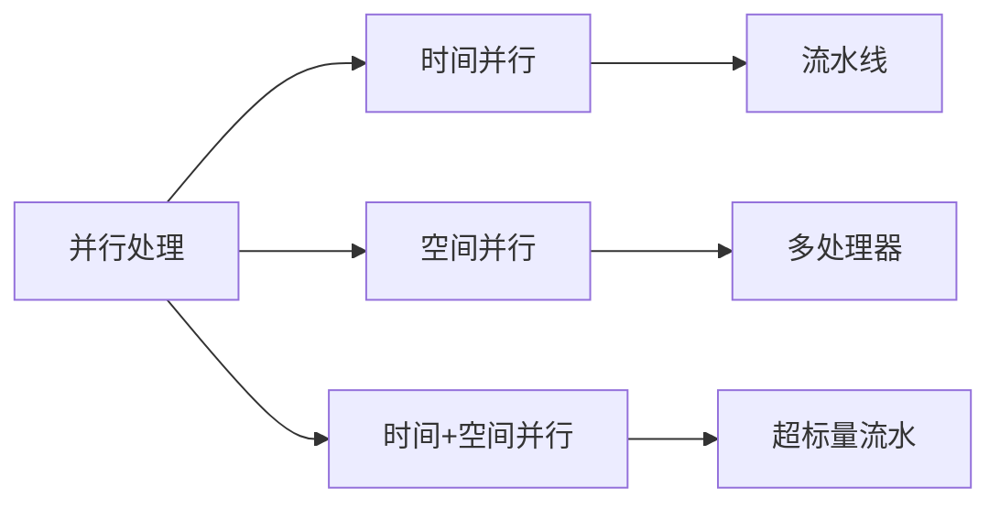
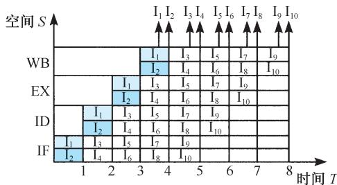
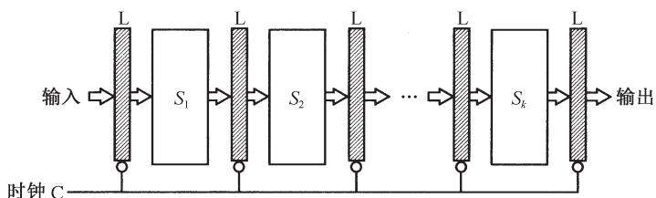
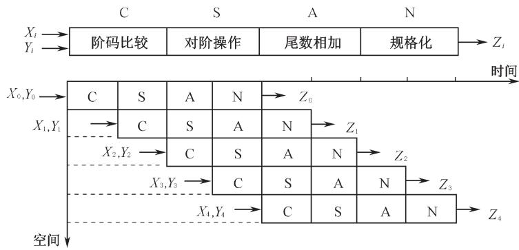
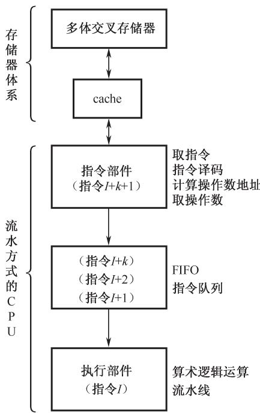
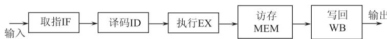

# 5.6 流水线技术与流水处理器

## 基本信息
- **课程**：计算机组成原理
- **章节**：第5章 中央处理器
- **日期**：2026-06-16
- **标签**：#流水线 #并行处理 #吞吐率 #加速比 #数据相关 #控制相关

## 重点内容

⭐⭐⭐ **三种并行处理形式**：时间并行、空间并行、时间并行+空间并行

⭐⭐⭐ **流水线性能指标**：吞吐率、加速比、效率

⭐⭐⭐ **流水线三种相关/冒险**：资源相关（结构相关）、数据相关（RAW/WAR/WAW）、控制相关

⭐⭐⭐ **超标量流水线**：时间并行+空间并行的综合应用

## 详细笔记

### 一、并行处理技术

**并行性的两种含义**：

| 含义 | 说明 |
|:-----|:-----|
| **同时性** | 两个以上事件在同一时刻发生 |
| **并发性** | 两个以上事件在同一时间间隔内发生 |

**三种并行处理形式**：

**1. 时间并行**
- 时间重叠，让多个处理过程在时间上相互错开
- 轮流重叠地使用同一套硬件设备的各个部分
- 实现方式：**流水处理部件**
- 特点：经济实用，性能价格比高

**2. 空间并行**
- 资源重复，以"数量取胜"
- 体现在多处理器系统和多计算机系统
- VLSI发展带来了巨大生机

**3. 时间并行+空间并行**
- 时间重叠和资源重复的综合应用
- 例：超标量流水技术，一个机器周期同时执行两条以上指令
- 效益最好

### 二、流水线原理

**流水线(pipeline)**：将工厂生产线上的装配流水线引入计算机内部，构成流水线结构的处理器。

**实现流水的前提**：
1. 把输入的任务分割为一系列子任务
2. 各子任务能在流水线的各个阶段并发执行
3. 任务连续不断地输入流水线，输出端连续不断地吐出执行结果

#### 📷 图5.33 流水计算机的时空图

> 📚 **课本出处**：图5.33 四种计算机的时空图对比，直观展示流水技术的优势

**指令流水线四个步骤**：

| 阶段 | 英文 | 功能 |
|:-----|:-----|:-----|
| 取指 | IF (Instruction Fetch) | 从存储器取出指令 |
| 译码 | ID (Instruction Decode) | 指令分析/译码 |
| 执行 | EX (Execution) | 运算执行 |
| 写回 | WB (Write Back) | 结果写回 |

**对比**（假设每步占1个时钟周期）：

| 类型 | 8个单位时间执行指令数 |
|:-----|:---------------------|
| 非流水计算机 | 约2条 |
| 标量流水计算机 | 5条 |
| 超标量流水计算机 | 10条 |

### 三、流水线分类

**1. 按应用场合和层次分类**

| 类型 | 级别 | 说明 | 示例 |
|:-----|:-----|:-----|:-----|
| 算术流水线 | 部件级 | 运算器操作步骤的并行 | 流水加法器、乘法器 |
| 指令流水线 | 处理器级 | 指令执行步骤的并行 | 几乎所有高性能计算机 |
| 处理器流水线 | 处理器间（宏流水） | 程序步骤的并行 | 多机系统 |

**2. 按功能段之间的连接方式分类**

#### 📷 图5.34 流水线的基本结构

> 📚 **课本出处**：图5.34 线性流水线顺序连接，非线性流水线存在反馈连接

| 类型 | 特点 |
|:-----|:-----|
| **线性流水线** | 各功能段顺序连接，段间无反馈回路，每个功能段只流过一次 |
| **非线性流水线** | 功能段之间存在反馈连接，一个周期内多次占用某个功能段 |

线性流水线可进一步分为：
- **同步流水线**：受统一流水时钟控制，要求各阶段处理时间相同
- **异步流水线**：各阶段处理时间可以不同

**3. 按输入输出顺序是否改变分类**

| 类型 | 特点 |
|:-----|:-----|
| **顺序流水线** | 严格保持输入任务和输出任务的顺序一致性 |
| **乱序流水线** | 允许后进入流水线的任务比前面的任务更先完成 |

### 四、线性流水线的性能指标

#### 📷 图5.35 线性流水线的三个阶段

> 📚 **课本出处**：图5.35 流水线的填充阶段、稳定流水阶段、排空阶段

**时钟周期定义**：

$$\tau = \max\{\tau_i\} + \tau_l = \tau_m + \tau_l$$

其中 $\tau_i$ 为过程段 $S_i$ 的处理时间，$\tau_l$ 为缓冲寄存器延时。

**k级流水线处理n个任务的时钟周期数**：

$$T_k = k + (n - 1)$$

**非流水线处理n个任务的时钟周期数**：

$$T_L = n \cdot k$$

**加速比**：

$$C_k = \frac{T_L}{T_k} = \frac{n \cdot k}{k + (n - 1)}$$

当 $n \gg k$ 时，$C_k \rightarrow k$。理论上k级流水线的最大加速比为k。

**吞吐率**：

$$T_p = \frac{n}{T_k \cdot \Delta t} = \frac{n}{(k - 1 + n) \Delta t}$$

**最大吞吐率**：

$$T_{p\max} = \lim_{n \rightarrow \infty} T_p = \frac{1}{\Delta t}$$

### 五、流水线的特点

1. **无助于减少单个任务的处理延迟**，但有助于提高整体工作负载的吞吐率
2. **多个不同任务同时操作**，使用不同资源，适合对同一种运算多次重复
3. **各阶段处理时间应大致相同**，流水线速率受限于最慢的流水段

### 六、流水线的应用

#### 1. 浮点运算流水线

#### 📷 图5.36 流水线浮点加法器框图

> 📚 **课本出处**：图5.36 浮点加减法由0操作数检查、对阶、尾数操作、结果规格化4步完成

浮点加法四个步骤：
1. 0操作数检查
2. 对阶操作
3. 尾数操作（相加）
4. 结果规格化及舍入处理

#### 📷 图5.37 向量加法计算的流水时空图

> 📚 **课本出处**：图5.37 流水线填满后，每隔一个时钟周期输出一个运算结果

#### 2. 流水计算机

#### 📷 图5.38 流水计算机系统组成原理示意图

> 📚 **课本出处**：图5.38 现代流水计算机由指令部件、指令队列、执行部件组成3级流水线

**CPU三大组成部分**：
- **指令部件**：本身构成指令流水线（取指令、译码、计算地址、取操作数）
- **指令队列**：FIFO寄存器栈，存放译码后的指令和操作数
- **执行部件**：多个算术逻辑运算部件，用流水线方式构成

**存储器设计**：采用多体交叉存储器，使存取时间与流水线速度匹配。

### 七、指令流水线设计中的若干问题

#### 1. 流水线的拥挤问题

当流水线上某一过程段处理速度很慢时，该段成为**瓶颈**。

**解决方法**：

#### 📷 图5.39 流水线拥挤问题的解决方案

> 📚 **课本出处**：图5.39 解决瓶颈问题：细分瓶颈段或重复设置瓶颈段

| 方法 | 说明 |
|:-----|:-----|
| **瓶颈段细分** | 将瓶颈过程段拆分为更小的过程段 |
| **重复设置瓶颈段** | 为瓶颈段设置多个并行工作的过程段，加数据分配器和收集器 |

#### 2. 资源相关（结构相关）

**定义**：多条指令进入流水线后在同一机器时钟周期内争用同一个功能部件，发生硬件资源冲突。

#### 📷 图5.40 资源相关实例

> 📚 **课本出处**：图5.40 五段流水线中，时钟4时I1的MEM段与I4的IF段同时访存

**表5.3 资源相关冲突示例**：

| 时钟/指令 | 1 | 2 | 3 | 4 | 5 | 6 | 7 | 8 |
|:---------:|:-:|:-:|:-:|:-:|:-:|:-:|:-:|:-:|
| I1(LAD) | IF | ID | EX | MEM | WB | | | |
| I4 | | | | IF | ID | EX | MEM | WB |

> 时钟4时，I1的MEM与I4的IF都要访问存储器，产生资源冲突。

**解决方法**：
1. 引入暂停周期，让后一条指令停顿一拍再启动
2. 资源重复设置：使用双端口存储器，或分设指令存储器和数据存储器

#### 3. 数据相关

**定义**：重叠执行的几条指令中，某条指令依赖于前面指令执行结果数据，但得不到时发生的相关。

**三种数据相关类型**：

| 类型 | 英文 | 说明 |
|:-----|:-----|:-----|
| **写后读** | RAW (Read After Write) | 后指令需用前指令的计算结果，但前指令尚未写入 |
| **读后写** | WAR (Write After Read) | 后指令在前指令读取源操作数之前就进行写操作 |
| **写后写** | WAW (Write After Write) | 两条指令目标操作数相同，后指令先写入导致顺序错误 |

**表5.4 数据相关冲突示例**：

| 指令/时钟 | 1 | 2 | 3 | 4 | 5 | 6 | 7 | 8 |
|:---------:|:-:|:-:|:-:|:-:|:-:|:-:|:-:|:-:|
| ADD R1,R2,R3 | IF | ID | EX | MEM | WB | | | |
| SUB R4,R1,R5 | | IF | ID | EX | MEM | WB | | |
| AND R6,R1,R7 | | | IF | ID | EX | MEM | WB | |

> ADD在时钟5写R1，但SUB在时钟3读R1，AND在时钟4读R1，发生RAW相关。

**解决方法**：
1. **后推法（流水线互锁）**：遇到数据相关时暂停后继指令执行
2. **定向技术（旁路技术）**：设置运算结果缓冲寄存器，使后继指令直接使用
3. **编译器调度**：插入气泡（空操作）等待结果写入
4. **动态调度**：硬件动态调整指令执行顺序

#### 4. 控制相关

**定义**：由条件转移指令或中断引起的相关，导致流水线断流。

**处理方法**：

| 方法 | 说明 |
|:-----|:-----|
| **冻结/排空流水线** | 发现分支指令后暂停其后所有指令，直到确定新PC值 |
| **延迟转移法** | 编译程序重排指令序列，"先执行再转移"，让已进入流水线的无关指令继续完成 |
| **转移预测法** | 硬件依据指令过去行为预测将来行为，预先判断下一条待取指令位置 |

### 八、动态流水线调度

#### 📷 图5.42 动态流水线调度模型

> 📚 **课本出处**：图5.42 动态流水线调度模型，分为取指令发射单元、多个功能单元、指令完成单元

**三个主要单元**：

| 单元 | 功能 |
|:-----|:-----|
| 取指令发射单元 | 取指令、译码，送到相应功能单元 |
| 功能单元（10个或更多） | 每个有自己的缓冲器（保留站），暂存操作数和指令 |
| 指令完成单元 | 确定何时能安全地将结果放入寄存器堆或内存 |

**重排序缓冲器**：指令完成单元中的缓冲器，提供操作数，工作方式类似于旁路逻辑。

## 疑问与思考

1. 为什么流水线的加速比理论上最大为k，但实际中往往达不到？
2. 动态调度与静态调度相比，各有什么优缺点？

## 相关链接

- [第5章-5.5-硬布线控制器](第5章-5.5-硬布线控制器.md)
- [第5章-5.7-RISC处理器](第5章-5.7-RISC处理器.md)
