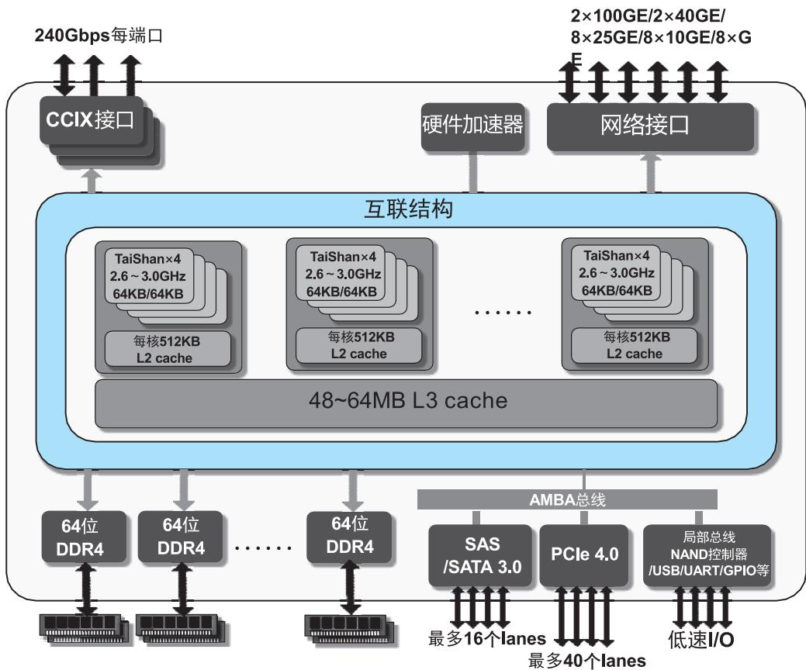
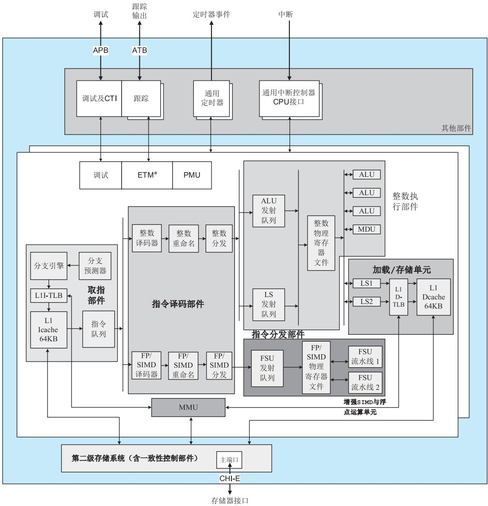
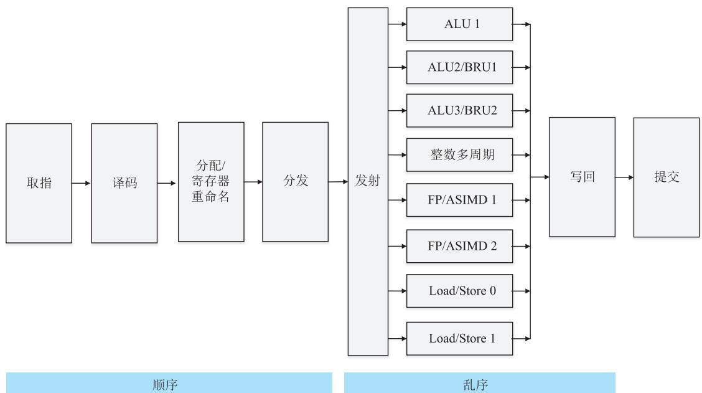
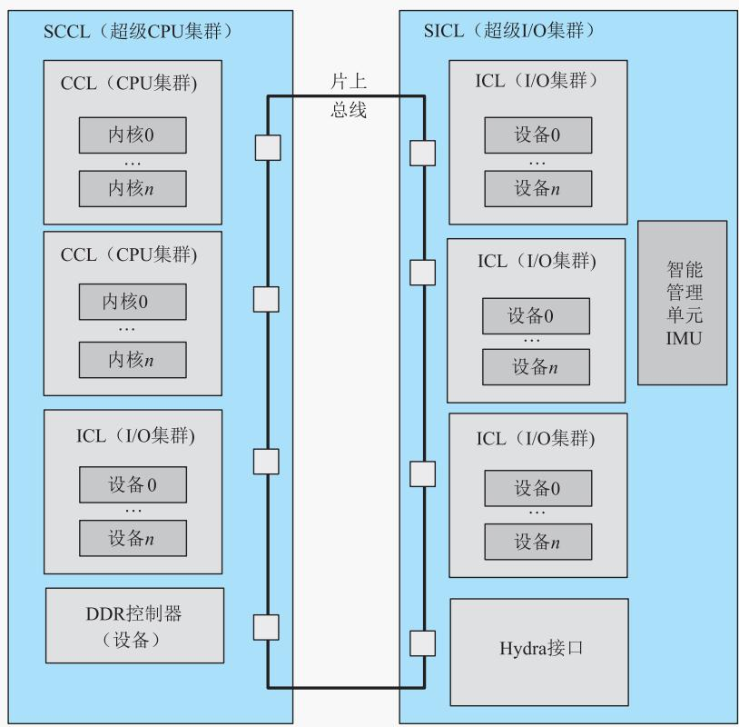

# 5.7 RISC处理器

## 基本信息
- **课程**：计算机组成原理
- **章节**：第5章 中央处理器
- **日期**：2026-06-16
- **标签**：#RISC #CISC #精简指令系统 #鲲鹏处理器 #超标量流水线

## 重点内容

⭐⭐⭐ **RISC三要素**：①有限的简单的指令系统；②CPU配备大量通用寄存器；③强调指令流水线优化

⭐⭐⭐ **RISC与CISC的主要特征对比**

⭐⭐⭐ **鲲鹏920处理器**：八级指令流水线，支持超标量和乱序执行

## 详细笔记

### 一、RISC机器的特点

**发展历史**：第一台RISC于1981年在美国加州大学伯克利分校问世。

**RISC三要素**（普遍认同）：
1. 一个有限的简单的指令系统
2. CPU配备大量的通用寄存器
3. 强调对指令流水线的优化

**RISC的目标**：使处理器结构更简单、更合理，具有更高的性能和执行效率，降低开发成本。

**RISC机器的主要特征**：

| 序号 | 特征 |
|:----:|:-----|
| 1 | 使用等长指令，典型长度4B |
| 2 | 寻址方式少且简单，一般2~3种，最多不超过4种，绝不出现存储器间接寻址 |
| 3 | 只有取数指令(LOAD)、存数指令(STORE)可以访问存储器，绝不出现SS型指令 |
| 4 | 指令系统中的指令数目一般少于100种，指令格式一般少于4种 |
| 5 | 指令功能简单，控制器多采用硬布线方式 |
| 6 | 平均而言，所有指令的执行时间为一个处理时钟周期 |
| 7 | 整数寄存器不少于32个，浮点数寄存器不少于16个 |
| 8 | 强调通用寄存器资源的优化使用 |
| 9 | 支持指令流水并强调指令流水的优化使用 |
| 10 | 复杂性在编译程序，软件系统开发时间比CISC长 |

#### RISC与CISC的主要特征对比

| 比较内容 | CISC | RISC |
|:---------|:-----|:-----|
| 指令系统 | 复杂、庞大 | 简单、精简 |
| 指令数目 | 一般大于200 | 一般小于100 |
| 指令格式 | 一般大于4 | 一般小于4 |
| 寻址方式 | 一般大于4 | 一般小于4 |
| 指令字长 | 不固定 | 等长 |
| 可访存指令 | 不加限制 | 只有LOAD/STORE |
| 各种指令使用频率 | 相差很大 | 相差不大 |
| 各种指令执行时间 | 相差很大 | 绝大多数在一个周期内完成 |
| 优化编译实现 | 很难 | 较容易 |
| 程序源代码长度 | 较短 | 较长 |
| 控制器实现方式 | 绝大多数为微程序控制 | 绝大多数为硬布线控制 |
| 软件系统开发时间 | 较短 | 较长 |

### 二、华为鲲鹏处理器

#### 1. 鲲鹏920处理器片上系统

#### 📷 图5.43 鲲鹏920处理器片上系统的组成示意图

> 📚 **课本出处**：图5.43 鲲鹏920最多可配置64个TaiShan V110处理器内核

**主要亮点**：

| 亮点 | 说明 |
|:-----|:-----|
| **高性能** | 采用多发射、乱序执行、优化分支预测，算力提升50%；支持2路和4路片间互联 |
| **高吞吐率** | 采用CoWoS封装技术，多晶片合封，"乐高架构"组合方式灵活 |
| **高集成度** | 单颗芯片实现传统上需4颗芯片的功能（通用计算+南桥+RoCE网卡+SAS存储控制器） |
| **高能效** | 能效比超过主流处理器30%，48核鲲鹏920-4826的SPECint性能测评分高达5.03 |

#### 2. TaiShan V110处理器内核

#### 📷 图5.44 TaiShan V110处理器内核顶层功能方框图

> 📚 **课本出处**：图5.44 TaiShan V110处理器内核集成处理器及私有L2 cache，支持超标量和可变长乱序指令流水线

**处理器内核组成部件**：

| 部件 | 功能 |
|:-----|:-----|
| 取指部件 | 从L1指令cache取指令，每周期最多发送4条；支持动态/静态分支预测；集成64KB L1指令cache |
| 指令译码部件 | A64指令集译码，支持增强SIMD及浮点指令集；负责寄存器重命名，消除WAW和WAR冒险 |
| 指令分发部件 | 控制译码后指令分发至执行单元的时间 |
| 整数执行部件 | 3条ALU流水线+1条MDU流水线，支持整数乘加、除法、分支与条件码解析 |
| 加载/存储单元 | 执行加载和存储指令，包含L1数据cache相关部件 |
| 第二级存储系统 | 512KB L2 cache，8路组相联，管理AMBA 5 CHI-E主接口 |
| 增强SIMD与浮点运算单元 | 支持ARMv8-A增强SIMD与浮点运算，可选加密引擎 |
| 通用中断控制器 | 向处理器发送中断请求 |
| 通用定时器 | 为事件调度提供支持，可触发中断 |
| 性能监视器PMU | 监视ARMv8-A定义事件及鲲鹏自定义事件 |
| 调试与跟踪部件 | 支持ARMv8调试架构，集成PMU和交叉触发接口 |

#### 3. 鲲鹏流水线技术

鲲鹏处理器是支持多个并行流水部件的**超标量处理器**。

#### 📷 图5.45 鲲鹏处理器指令流水线结构

> 📚 **课本出处**：图5.45 鲲鹏920采用八级指令流水线结构

**八级指令流水线**：

| 级数 | 名称 | 功能 |
|:----:|:-----|:-----|
| 1 | 取指 | 从I-cache取指令字，计算下一步取指地址，借助分支预测确定PC值 |
| 2 | 译码 | 识别指令类型，确认操作数地址 |
| 3 | 分配/寄存器重命名 | 将逻辑寄存器重命名为物理寄存器，解决WAW和WAR相关性冲突 |
| 4 | 分发(dispatch) | 指令被派发到不同运算单元的等待队列中 |
| 5 | 发射(issue) | 指令从等待队列中无序发射到运算单元，进入乱序执行阶段 |
| 6 | 运算(执行) | 8个不同执行单元并行工作 |
| 7 | 写回 | 将计算结果写入物理寄存器(PRF) |
| 8 | 提交(commit) | 将乱序执行指令恢复到程序顺序，确定推测执行结果正确性 |

**执行单元**（表5.6）：

| 执行单元 | 功能 |
|:---------|:-----|
| ALU1/ALU2/ALU3 | 整型运算、分支跳转 |
| 整数多周期运算(MDU) | 整型移位、乘法、除法、CRC运算 |
| Load/Store 0/1 | 加载/存储操作 |
| FP/ASIMD 1/2 | 浮点运算与增强SIMD运算 |

#### 📷 图5.46 鲲鹏处理器片上系统的组成示意图

> 📚 **课本出处**：图5.46 鲲鹏处理器片上系统详细组成

## 疑问与思考

1. 为什么RISC处理器更适合采用硬布线控制器而不是微程序控制器？
2. 鲲鹏处理器的八级流水线中，寄存器重命名是如何解决数据相关问题的？

## 相关链接

- [第5章-5.6-流水线技术与流水处理器](第5章-5.6-流水线技术与流水处理器.md)
- [第5章-中央处理器](第5章-中央处理器.md)
