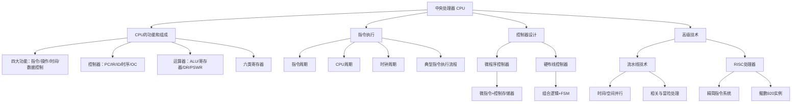

# 第5章 中央处理器

## 基本信息
- **课程**：计算机组成原理
- **章节**：第5章 中央处理器
- **日期**：2026-06-16
- **标签**：#CPU #控制器 #运算器 #微程序 #硬布线 #流水线 #RISC

## 章节结构

本章详细讲述CPU的功能和基本组成，指令周期的概念，时序发生器，微程序控制器，硬布线控制器。在此基础上，介绍流水CPU、RISC CPU。

### 小节笔记

| 小节 | 标题 | 核心内容 |
|:----:|:-----|:---------|
| 5.1 | [CPU的功能和组成](第5章-5.1-CPU的功能和组成.md) | CPU四大功能、基本组成（控制器+运算器）、六类主要寄存器 |
| 5.2 | [指令周期](第5章-5.2-指令周期.md) | 指令周期概念、五种典型指令周期、方框图语言 |
| 5.3 | [时序发生器和控制方式](第5章-5.3-时序发生器和控制方式.md) | 时序信号体制、时序信号发生器、三种控制方式 |
| 5.4 | [微程序控制器](第5章-5.4-微程序控制器.md) | 微命令/微操作、微指令格式、微程序控制器原理、微地址形成 |
| 5.5 | [硬布线控制器](第5章-5.5-硬布线控制器.md) | 组合逻辑实现、微操作控制信号产生、基于FSM的设计 |
| 5.6 | [流水线技术与流水处理器](第5章-5.6-流水线技术与流水处理器.md) | 并行处理、流水线原理与分类、性能指标、流水线相关与冒险 |
| 5.7 | [RISC处理器](第5章-5.7-RISC处理器.md) | RISC特点、与CISC对比、华为鲲鹏处理器 |

## 知识框架

## 重点与难点

### 核心概念

1. **CPU四大功能**：指令控制、操作控制、时间控制、数据加工
2. **指令周期、CPU周期、时钟周期**三者的关系
3. **微程序控制 vs 硬布线控制**：实现技术、优缺点、适用场景
4. **流水线三种相关**：资源相关、数据相关（RAW/WAR/WAW）、控制相关
5. **RISC三要素**：简单指令集、大量通用寄存器、指令流水线优化

### 关键公式

- **流水线时钟周期**：$\tau = \max\{\tau_i\} + \tau_l$
- **流水线加速比**：$C_k = \frac{n \cdot k}{k + (n - 1)}$
- **最大吞吐率**：$T_{p\max} = \frac{1}{\Delta t}$

## 相关链接

- [总结-第5章-中央处理器](../../总结复习/总结-第5章-中央处理器.md)
