# 第5章-5.2-指令周期

## 基本信息

- **课程**：计算机组成原理
- **章节**：第5章 5.2节 指令周期
- **日期**：2026-04-26
- **标签**：#CPU #指令周期 #中央处理器 #核心概念

***

## 重点内容

### ⭐⭐⭐ 核心概念

1. **指令周期**：CPU取出一条指令并执行这条指令的时间
2. **三种时间单位的关系**：指令周期 > CPU周期 > 时钟周期
3. **不同指令的指令周期长度不同**：
   - RR型指令：2个CPU周期
   - RS型指令：3个CPU周期

### ⭐⭐ 关键问题

- **CPU如何区分指令和数据？**
  - 时间角度：取指令在指令周期第一个CPU周期；取数据在执行阶段
  - 空间角度：指令从指令存储器取出，数据从数据存储器取出

***

## 详细笔记

### 一、指令周期的基本概念

#### 1. 什么是指令周期？

**指令周期**是CPU取出一条指令并执行这条指令所需的时间。

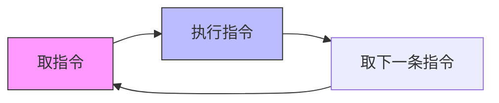

#### 2. 三个时间概念的关系

| 时间单位      | 别称       | 定义          | 关系         |
| --------- | -------- | ----------- | ---------- |
| **指令周期**  | -        | 取指令+执行指令的时间 | 包含若干个CPU周期 |
| **CPU周期** | 机器周期     | 访问一次内存的最短时间 | 包含若干个时钟周期  |
| **时钟周期**  | T周期/节拍脉冲 | 处理操作的最基本单位  | 最小时间单位     |

#### 📷 图5.3 指令周期

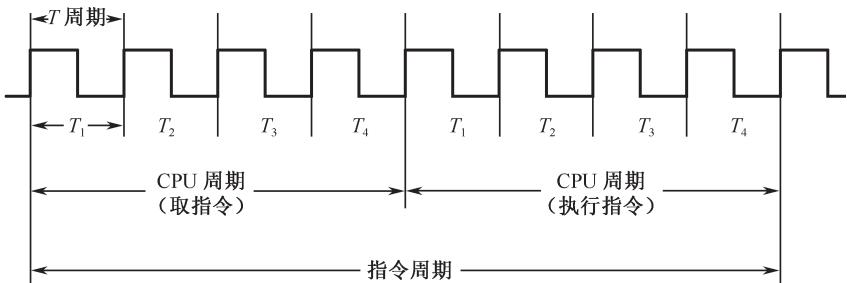

> 📚 **课本出处**：图5.3 展示了采用定长CPU周期的指令周期示意图，取出和执行任何一条指令所需的最短时间为两个CPU周期

***

### 二、五条典型指令的指令周期

课本通过6条典型指令组成的程序来讲解指令周期：

| 地址  | 指令  | 类型  | 功能           | 指令周期        |
| --- | --- | --- | ------------ | ----------- |
| 101 | NOT | RR型 | R1取反→R0      | **2个CPU周期** |
| 102 | LAD | RS型 | 从数存6号单元取数→R1 | **3个CPU周期** |
| 103 | ADD | RR型 | R1+R2→R2     | **2个CPU周期** |
| 104 | STO | RS型 | R2写入数存30号单元  | **3个CPU周期** |
| 105 | JMP | 转移型 | 跳转到101号单元    | **2个CPU周期** |

💡 **规律总结**：

- **RR型指令**（寄存器-寄存器）：只需访问寄存器，**2个CPU周期**
- **RS型指令**（寄存器-存储器）：需要访问数据存储器，**3个CPU周期**

***

### 三、各指令执行过程详解

#### 1. NOT指令（取反指令）

#### 📷 图5.4 NOT指令的指令周期

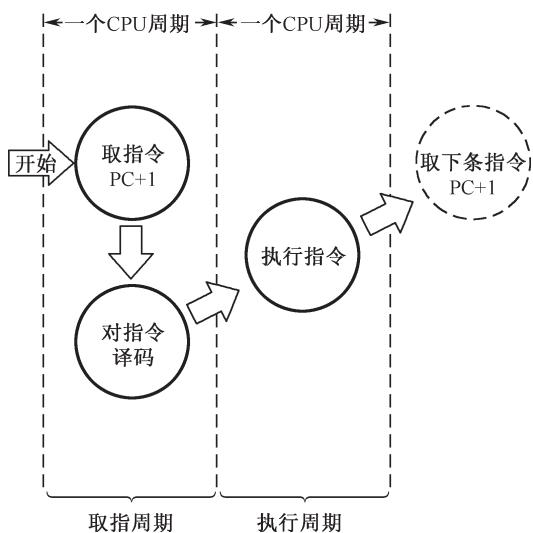

> 📚 **课本出处**：图5.4 NOT指令需要2个CPU周期（取指周期+执行周期）

**取指周期**（图5.5）：

1. PC内容送指令地址总线ABUS(I)
2. 从指存读出指令到IR
3. PC+1，为取下一条指令做准备
4. 指令译码

#### 📷 图5.5 NOT指令取指周期

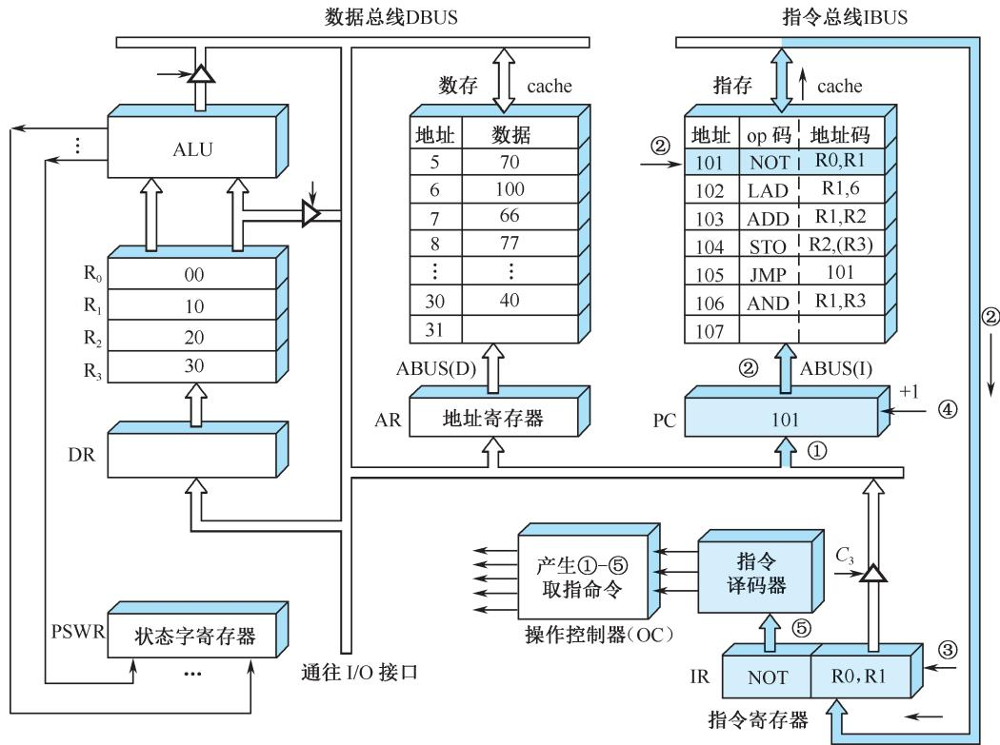

**执行周期**（图5.6）：

1. 选中R1作为源寄存器
2. ALU执行取反操作
3. 结果经DBUS送DR
4. 从DR送入R0（目标寄存器）

#### 📷 图5.6 NOT指令执行周期

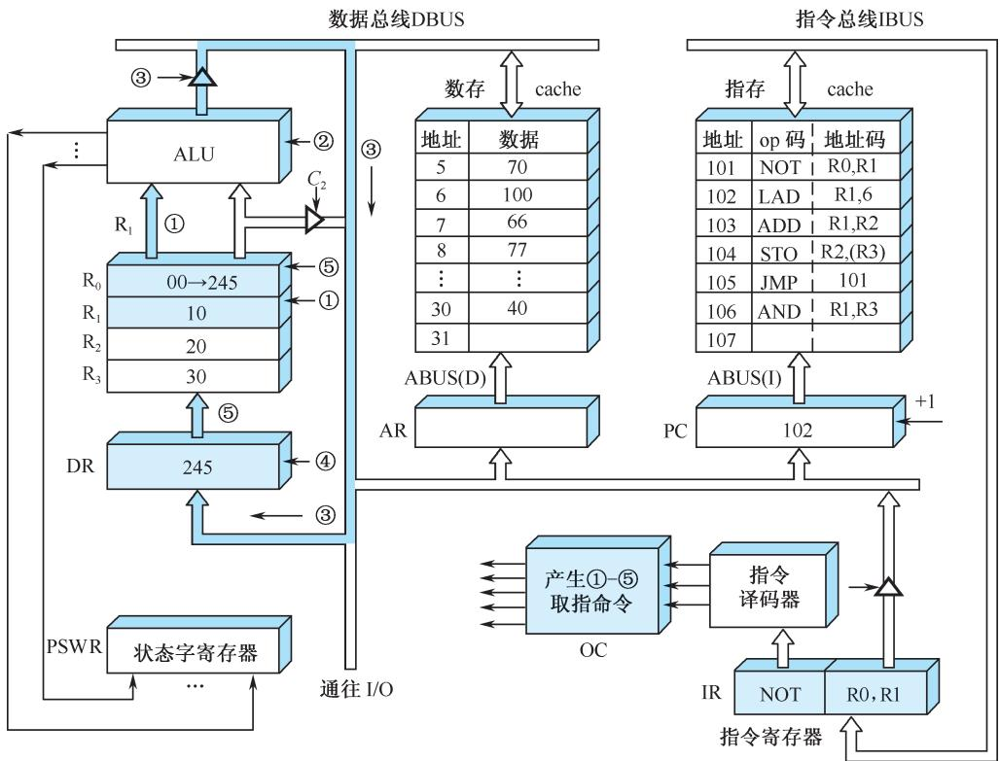

***

#### 2. LAD指令（取数指令）

LAD指令是**RS型指令**，需要**3个CPU周期**：

- 第1个CPU周期：取指
- 第2个CPU周期：送地址到AR
- 第3个CPU周期：从数存读数据到寄存器

#### 📷 图5.7 LAD指令的指令周期

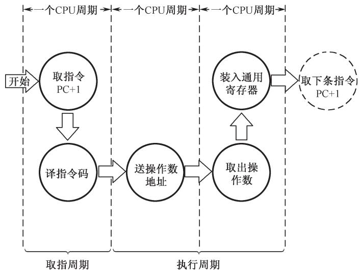

> 📚 **课本出处**：图5.7 LAD指令的指令周期需要3个CPU周期

#### 📷 图5.8 LAD指令的执行周期

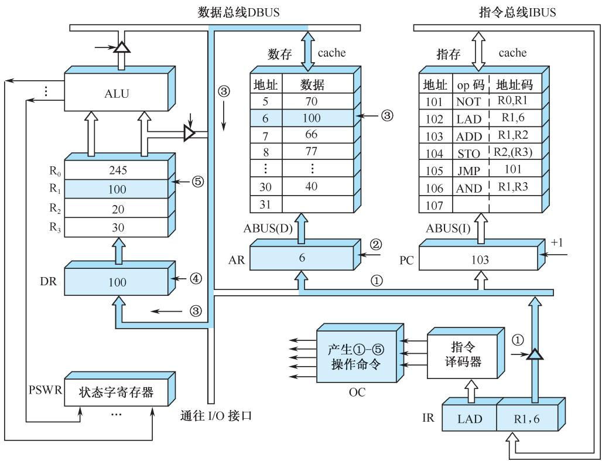

**执行过程**：

1. 将指令中的直接地址码6放到DBUS
2. 地址码6装入数存地址寄存器AR
3. 读数存6号单元中的数100到DBUS
4. 数据100装入缓冲寄存器DR
5. 将DR中的数100装入通用寄存器R1

***

#### 3. ADD指令（加法指令）

ADD指令是**RR型指令**，只需**2个CPU周期**。

#### 📷 图5.9 ADD指令执行周期

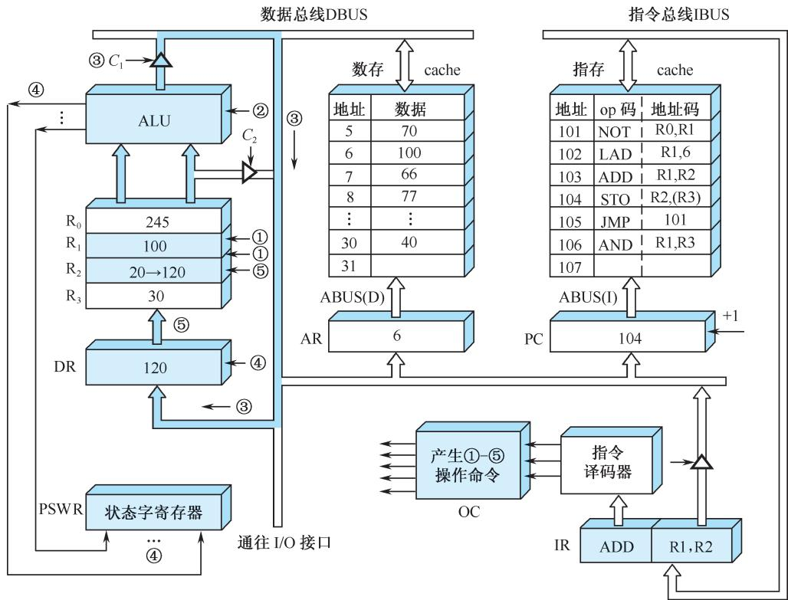

> 📚 **课本出处**：图5.9 ADD指令执行周期的数据通路

**执行过程**：

1. 选中R1和R2为源寄存器和目标寄存器
2. ALU执行R1(100)和R2(20)的加法
3. 运算结果120放到DBUS上
4. 数据打入缓冲寄存器DR，进位信号保存在PSWR
5. 将DR(120)装入R2

***

#### 4. STO指令（存数指令）

STO指令是**RS型指令**，需要**3个CPU周期**（执行周期占2个）。

#### 📷 图5.10 STO指令的指令周期

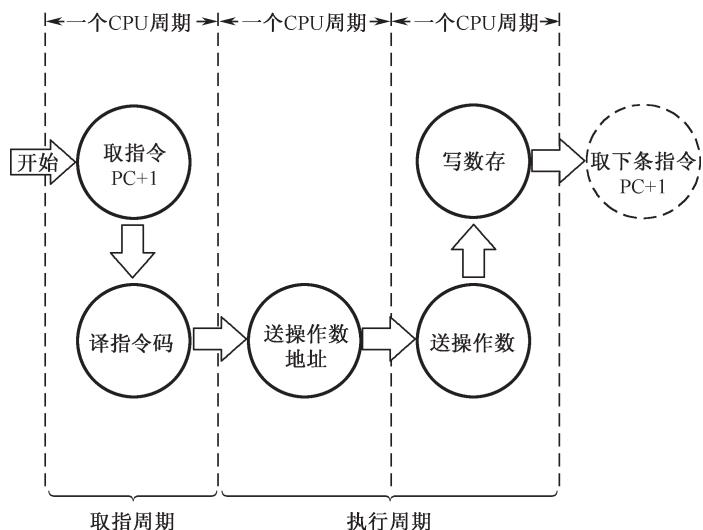

> 📚 **课本出处**：图5.10 STO指令的指令周期

#### 📷 图5.11 STO指令执行周期

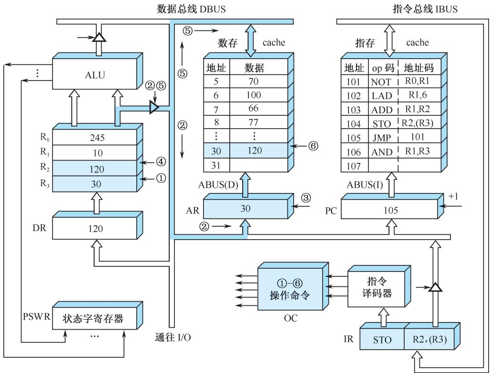

⚠️ **重要说明**：DBUS是单总线结构，先送地址(30)，后送数据(120)，必须**分时传送**，所以需要2个CPU周期。

**执行过程**：

1. 选中R3=30为地址单元
2. 将地址30放到DBUS上
3. 地址30打入AR，进行数存地址译码
4. 选中R2=120作为写入数据
5. 将数据120放到DBUS上
6. 将数据120写入数存30号单元

***

#### 5. JMP指令（无条件转移指令）

JMP指令周期为**2个CPU周期**。

#### 📷 图5.12 JMP指令的指令周期

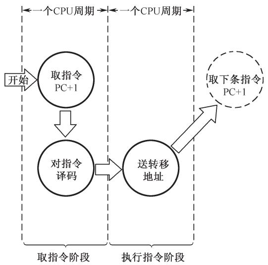

> 📚 **课本出处**：图5.12 JMP指令的指令周期

#### 📷 图5.13 JMP指令执行周期

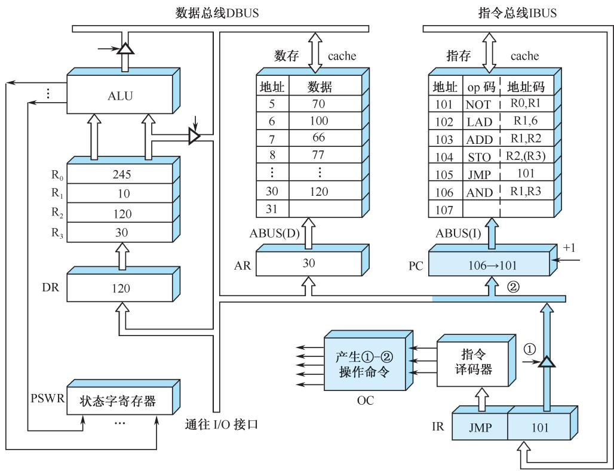

**执行过程**：

1. 打开IR输出三态门，将IR中的地址码101发送到DBUS
2. 将DBUS上的地址码101打入PC
3. PC中原先内容106被更换，下一条指令从101号单元取出

***

### 四、用方框图语言表示指令周期

#### 📷 图5.15 用方框图语言表示指令周期

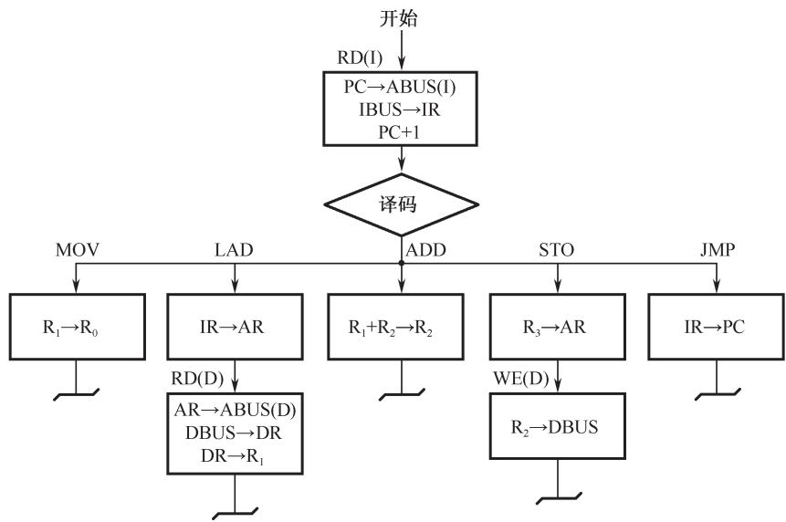

> 📚 **课本出处**：图5.15 用方框图语言归纳了五条指令的指令周期

#### 方框图符号说明

| 符号    | 含义                |
| ----- | ----------------- |
| ⬜ 方框  | 代表一个CPU周期         |
| ◇ 菱形  | 判别或测试（不单独占CPU周期）  |
| ～ 波浪线 | 公操作符号（指令执行完毕后的操作） |

#### ⭐ 重要结论

```
┌────────────────────────────────────────┐
│  ⭐ 所有指令的取指周期完全相同！         │
│     都是1个CPU周期                      │
│                                        │
│  ⭐ 执行周期各不相同：                   │
│     • NOT、ADD、JMP：1个CPU周期         │
│     • LAD、STO：2个CPU周期              │
└────────────────────────────────────────┘
```

***

### 五、例题解析

#### 例5.1 双总线结构机器的指令周期

#### 📷 图5.16 双总线结构机器的数据通路

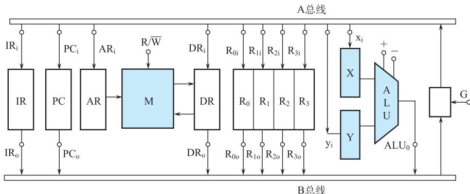

> 📚 **课本出处**：图5.16 双总线结构机器的数据通路

**题目**：
(1) "ADD R2, R0"指令完成R0+R2→R0，画出指令周期流程图
(2) "SUB R1, R3"指令完成R3-R1→R3，画出指令周期流程图

#### 📷 图5.17 加法和减法指令周期流程图

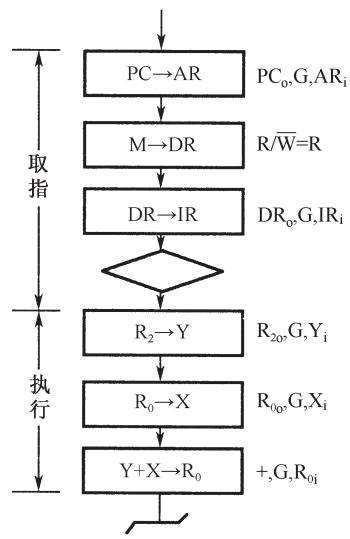

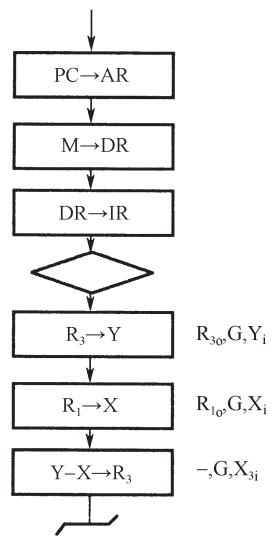

> 📚 **课本出处**：图5.17 ADD和SUB指令的详细指令周期流程图

***

## 疑问与思考

### ❓ 待解决问题

1. 单周期CPU和多周期CPU的优缺点对比？
2. 如何优化指令周期以提高CPU性能？

### 💡 个人理解

- 指令周期的概念是理解CPU工作原理的基础
- 不同指令的指令周期长度不同，这是设计控制器的重要依据
- 方框图语言是计算机设计中常用的表示方法，需要熟练掌握

***

## 核心考点总结

### ⭐⭐⭐ 必考内容

1. **指令周期的定义**
   - 取出一条指令并执行这条指令的时间
2. **三种时间单位的关系**
   ```
   指令周期 > CPU周期(机器周期) > 时钟周期(T周期)
   ```
3. **不同指令的指令周期长度**
   | 指令类型 | 指令周期    | 原因        |
   | ---- | ------- | --------- |
   | RR型  | 2个CPU周期 | 只访问寄存器    |
   | RS型  | 3个CPU周期 | 需要访问数据存储器 |
4. **CPU区分指令和数据的方法**
   - **时间**：取指令在第一个CPU周期，取数据在执行阶段
   - **空间**：指令从指令存储器取，数据从数据存储器取
5. **方框图语言**
   - 方框 = CPU周期
   - 菱形 = 判别/测试
   - 波浪线 = 公操作

### 📌 考试重点标记

- ⭐⭐⭐ 指令周期的概念和三种时间单位的关系
- ⭐⭐⭐ 不同指令的指令周期长度及原因
- ⭐⭐ CPU如何区分指令和数据
- ⭐⭐ 方框图语言的符号含义
- ⭐ 画指令周期流程图

***

## 相关链接

### 本节涉及图片

- [图5.2 取指令-执行指令序列](../../../images/5801fc891f57232fad4616eec1fc5a4040e243eab4513c0d244b8ef101acfa39.jpg)
- [图5.3 指令周期](../../../images/39586996ac492695d45fa37c4bcfe63df258121fb26160e04933fc8fe0c64190.jpg)
- [图5.4 NOT指令的指令周期](../../../images/7c19a06443d5688e1aed9fa9a54bfda1a9ac4da5820fc01f3f8a7c24ad0ffffa.jpg)
- [图5.5 NOT指令取指周期](../../../images/529f8fe1418008009f4190b5247602ae12274a97aa8069334f5f1970daea358f.jpg)
- [图5.6 NOT指令执行周期](../../../images/b233f19573478fe5a8bceff0947e8a37a018e86cd2a6ac96e2de1836c6a485c1.jpg)
- [图5.7 LAD指令的指令周期](../../../images/2e7c403a702c6101cc234f48b602526147e74293123dfddb61f3e85b25473dfc.jpg)
- [图5.8 LAD指令的执行周期](../../../images/8b6cba60bda0813e3482dd0db1cff8d911202af184d36efcc19dd26163396839.jpg)
- [图5.9 ADD指令执行周期](../../../images/a30cd003471c9b963e9aa440bada1eee21717bbb1d3fd04fc2acea4fa0dc07a2.jpg)
- [图5.10 STO指令的指令周期](../../../images/e30b7e562ee072980d83a90ca7f3e39570266801f7c3e34055779e8000986f9a.jpg)
- [图5.11 STO指令执行周期](../../../images/f3ea889282a686e5ec44f0d929f885deeca07e58727e54040775a16dde23464d.jpg)
- [图5.12 JMP指令的指令周期](../../../images/ae5fc5c11d408f0da3630ca6b61c06c3a7f170ae2cf9fd3bdcc6ceaa3b84bedf.jpg)
- [图5.13 JMP指令执行周期](../../../images/3e9f0a1f042694a346eda0cf7d5675b26dc3fdcaf952a22f954d050fa6a8ce87.jpg)
- [图5.15 用方框图语言表示指令周期](../../../images/9a9a1e667e5cb53a28ed805e610f1630c919041bb3ddfde1488fda18457ce420.jpg)
- [图5.16 双总线结构机器的数据通路](../../../images/10f92ef1e9e0ab631bfb18bc11824f8b9038d3c3cafd2808a1f6964dfdb8d419.jpg)
- [图5.17 加法和减法指令周期流程图](../../../images/b919a6db74276701b313808aee8e20c349e67ee6cd36b8e586706af937e99458.jpg)

### 关联章节

- [第5章-5.1-CPU的功能和组成](./第5章-5.1-CPU的功能和组成.md)
- [第5章-5.3-时序产生器和控制方式](./第5章-5.3-时序产生器和控制方式.md)（待创建）
- [第4章-4.2-指令格式](./第4章-4.2-指令格式.md) - RR型/RS型指令

***

*笔记创建时间：2026-04-26*
