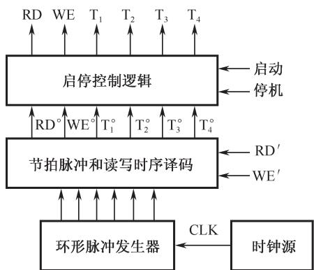
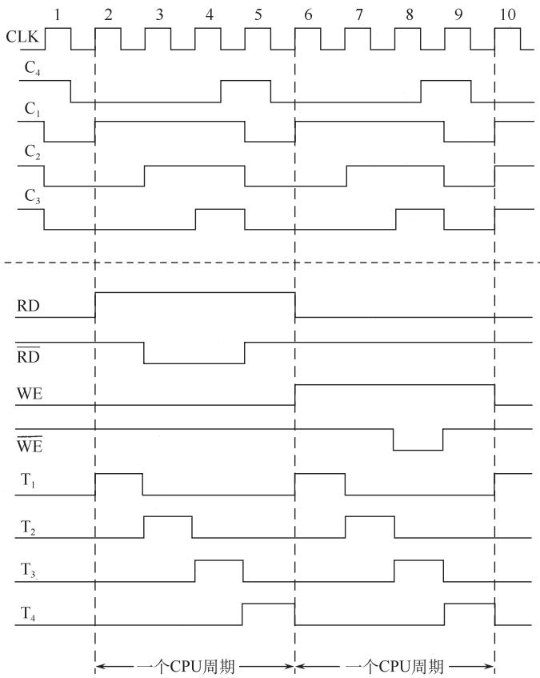
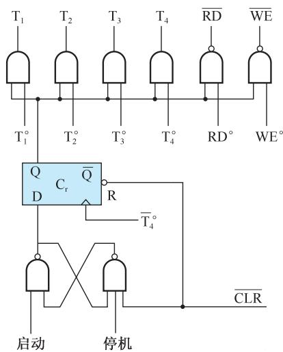

# 第5章-5.3-时序发生器和控制方式

## 基本信息
- **课程**：计算机组成原理
- **章节**：第5章 5.3节 时序发生器和控制方式
- **日期**：2026-04-26
- **标签**：#CPU #时序信号 #控制方式 #中央处理器

---

## 重点内容

### ⭐⭐⭐ 核心概念
1. **时序信号的作用**：为计算机各部分提供工作所需的时间标志
2. **时序体制**：硬布线控制器用三级体制，微程序控制器用二级体制
3. **三种控制方式**：同步控制、异步控制、联合控制

### ⭐⭐ 关键问题
- **启停控制逻辑的作用**：保证发出完整的脉冲
  - 启动：从T₁前沿开始
  - 停机：在T₄结束后关闭

---

## 详细笔记

### 一、时序信号的作用和体制

#### 1. 为什么需要时序信号？

CPU中的时序信号就像学校的"作息时间"：
- 规定在什么时间做什么事
- 保证计算机准确、迅速、有条不紊地工作
- 给计算机各部分提供工作所需的时间标志

#### 2. 时序信号的重要性

回顾5.2节的问题：**CPU如何区分指令和数据？**

```
┌─────────────────────────────────────────────────────────┐
│  时间角度：                                              │
│    • 取指令 → 发生在指令周期的第一个CPU周期（取指阶段）   │
│    • 取数据 → 发生在执行指令阶段                         │
├─────────────────────────────────────────────────────────┤
│  空间角度：                                              │
│    • 指令 → 送往指令寄存器IR                             │
│    • 数据 → 送往运算器                                   │
└─────────────────────────────────────────────────────────┘
```

⚠️ **时间约束的重要性**：
- 时间进度不能来得太早（数据未准备好）
- 时间进度不能来得太晚（数据可能丢失）

#### 3. 时序信号的基本体制

计算机硬件器件特性决定了时序信号最基本的体制是**电位-脉冲制**：
- **电位信号**：表示数据是1还是0（先建立）
- **脉冲信号**：控制数据打入寄存器（后到来）

#### 📷 图5.18 时序信号发生器框图



> 📚 **课本出处**：图5.18 微程序控制器中使用的时序信号发生器结构

#### 体制类型对比

| 体制 | 组成 | 适用场景 |
|-----|------|---------|
| **三级体制** | 主状态周期-节拍电位-节拍脉冲 | 复杂硬布线控制器 |
| **二级体制** | 节拍电位-节拍脉冲 | 微程序控制器 |

**说明**：
- **主状态周期**：最大时间单位，包含若干节拍电位
- **节拍电位**：表示一个CPU周期的时间
- **节拍脉冲**：把CPU周期划分成较小的时间间隔

---

### 二、时序信号发生器

时序信号发生器由四部分组成：

#### 1. 时钟源
- **功能**：提供频率稳定且电平匹配的方波时钟脉冲信号
- **组成**：石英晶体振荡器 + 与非门正反馈振荡电路
- **输出**：送至环形脉冲发生器

#### 2. 环形脉冲发生器
- **功能**：产生一组有序的间隔相等或不等的脉冲序列
- **作用**：通过译码电路产生最后所需的节拍脉冲

#### 3. 节拍脉冲和存储器读/写时序

#### 📷 图5.19 节拍电位与节拍脉冲时序关系图



> 📚 **课本出处**：图5.19 展示了节拍电位与节拍脉冲的时间关系

**示例参数**：
| 参数 | 数值 |
|-----|------|
| 节拍脉冲数 | 4个（T₁°~T₄°） |
| 每个脉冲宽度 | 200ns |
| 一个CPU周期 | 800ns |

**注意**：
- T₁~T₄ 是经过启停控制逻辑后的输出
- RD°、WE° 是存储器读/写时序信号

#### 4. 启停控制逻辑 ⭐⭐

#### 📷 图5.20 启停控制逻辑



> 📚 **课本出处**：图5.20 启停控制逻辑电路，保证发出完整的脉冲

**核心部件**：运行标志触发器 Cᵣ
- **Cᵣ = 1**：原始节拍脉冲通过门电路发送，时序发生器工作
- **Cᵣ = 0**：关闭时序发生器

⚠️ **重要要求**（必须满足）：
```
启动时：一定要从第1个节拍脉冲(T₁)前沿开始工作
停机时：一定要在第4个节拍脉冲(T₄)结束后关闭时序产生器

目的：保证发送出去的脉冲都是完整的脉冲！
```

**实现方法**：
- 在Cᵣ触发器下面加一个SR触发器
- 用T₄°信号作为Cᵣ触发器的时钟控制端
- 保证在T₁前沿开启，在T₄后沿关闭

---

### 三、控制方式 ⭐⭐⭐

控制不同操作序列时序信号的方法，称为控制器的**控制方式**。

#### 1. 同步控制方式

**定义**：已定的指令在执行时所需的机器周期数和时钟周期数都是**固定不变**的。

**三种方案**：

| 方案 | 说明 | 特点 |
|-----|------|------|
| **完全统一** | 所有指令用相同的机器周期 | 简单但可能造成时间浪费 |
| **不定长机器周期** | 大多数操作短周期，复杂操作延长周期 | 较灵活 |
| **中央与局部控制结合** | 大部分指令固定周期，复杂指令另设时序 | 常用方案 |

**缺点**：对简单指令会造成时间浪费

#### 2. 异步控制方式

**特点**：
- 每条指令、每个操作控制信号**需要多少时间就占用多少时间**
- 指令周期可由不等数的机器周期数组成
- 采用"**回答**"信号机制

**工作流程**：
```
控制器发出操作控制信号 → 执行部件完成操作 → 发回"回答"信号 → 开始新的操作
```

**优点**：时间利用率高，没有固定周期限制
**缺点**：控制复杂，没有严格的时序同步

#### 3. 联合控制方式 ⭐⭐

**定义**：同步控制和异步控制相结合的方式

**两种形式**：

**形式一：半同步方式**
```
├── 大部分操作序列：安排在固定的机器周期中（同步）
└── 时间难以确定的操作：以"回答"信号作为结束标志（异步）
    
    例：CPU访问主存时，依靠主存送来的"READY"信号
        作为读/写周期的结束标志
```

**形式二：微程序控制方式**
```
├── 机器周期的节拍脉冲数：固定（同步）
└── 各条指令周期的机器周期数：不固定（异步）
```

---

### 四、三种控制方式对比

| 控制方式 | 时间特点 | 适用场景 | 优缺点 |
|---------|---------|---------|--------|
| **同步控制** | 固定机器周期和时钟周期 | 简单、规整的系统 | 控制简单，但可能造成时间浪费 |
| **异步控制** | 需要多少用多少，用回答信号 | 复杂、不确定时间的操作 | 时间利用率高，但控制复杂 |
| **联合控制** | 大部分同步，特殊操作异步 | 现代计算机常用 | 兼顾效率和灵活性 |

---

## 疑问与思考

### ❓ 待解决问题
1. 如何计算时序信号发生器的具体参数？
2. 联合控制方式在实际CPU设计中的应用案例？

### 💡 个人理解
- 时序信号是CPU协调工作的"节拍器"
- 启停控制逻辑的设计体现了工程上的严谨性（保证完整脉冲）
- 三种控制方式的选择要根据具体应用场景权衡

---

## 核心考点总结

### ⭐⭐⭐ 必考内容

1. **时序信号的作用**
   - 为计算机各部分提供时间标志
   - 保证协调工作

2. **时序体制**
   | 控制器类型 | 时序体制 |
   |-----------|---------|
   | 硬布线控制器 | 三级体制（主状态周期-节拍电位-节拍脉冲） |
   | 微程序控制器 | 二级体制（节拍电位-节拍脉冲） |

3. **时序发生器组成**
   - 时钟源
   - 环形脉冲发生器
   - 节拍脉冲和读写时序译码
   - 启停控制逻辑

4. **三种控制方式**
   | 方式 | 核心特点 |
   |-----|---------|
   | 同步控制 | 固定周期 |
   | 异步控制 | 按需分配，用回答信号 |
   | 联合控制 | 同步+异步结合 |

5. **启停控制逻辑的关键**
   - 启动：T₁前沿开始
   - 停机：T₄结束后关闭
   - 目的：保证完整脉冲

### 📌 易混淆点辨析

| 概念 | 含义 | 关系 |
|-----|------|------|
| **节拍电位** | 一个CPU周期的时间 | 较大时间单位 |
| **节拍脉冲** | 把CPU周期划分成小段 | 较小时间单位 |
| **T₁~T₄** | 经过启停控制后的输出 | 实际使用的脉冲 |
| **T₁°~T₄°** | 原始节拍脉冲 | 需要经过启停控制 |

### 📝 常见考题类型

1. **简答题**：
   - 时序信号的作用是什么？
   - 简述三种控制方式的特点
   - 启停控制逻辑为什么要这样设计？

2. **计算题**：
   - 给定主脉冲频率，计算节拍脉冲宽度
   - 设计时序产生器的逻辑图

3. **分析题**：
   - 比较同步控制和异步控制的优缺点
   - 说明联合控制方式的应用场景

---

## 相关链接

### 本节涉及图片
- [图5.18 时序信号发生器框图](../../../images/e79edb8b181a4c90bda0657fe15b5b887cff15020075a073187bac415ff6809a.jpg)
- [图5.19 节拍电位与节拍脉冲时序关系图](../../../images/d8e0a56d259c53b117f2ec29d57109e2e03bac6e84aa5bf88a3692d336da78cb.jpg)
- [图5.20 启停控制逻辑](../../../images/dcd187f0454dabe85cfe9fbc73256c2b5e19af4def73eba2b0c5dcfaf154408c.jpg)

### 关联章节
- [第5章-5.2-指令周期](./第5章-5.2-指令周期.md) - 指令周期、CPU周期、时钟周期的关系
- [第5章-5.4-微程序控制器](./第5章-5.4-微程序控制器.md)（待创建）- 微程序控制器的时序特点
- [第5章-5.5-硬布线控制器](./第5章-5.5-硬布线控制器.md)（待创建）- 硬布线控制器的时序特点

---

*笔记创建时间：2026-04-26*
