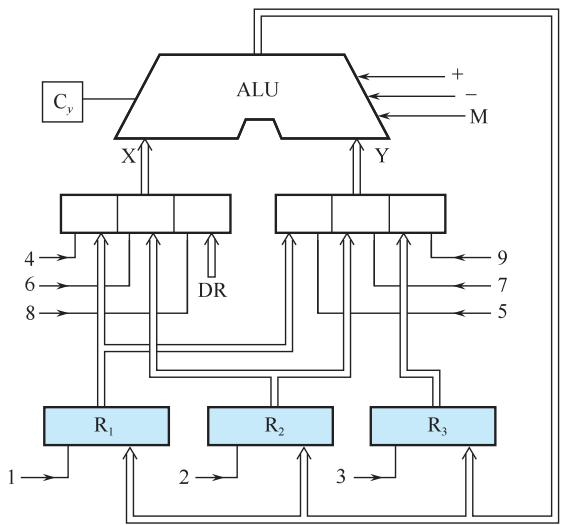
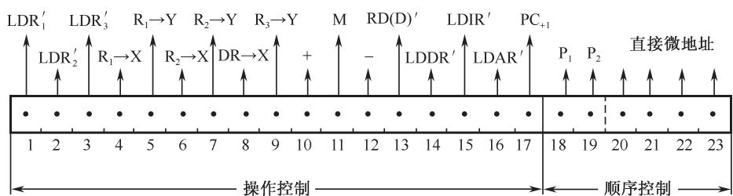
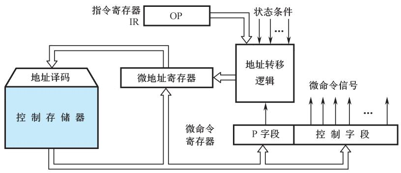
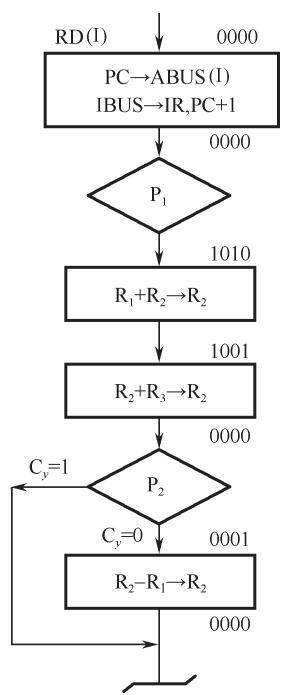
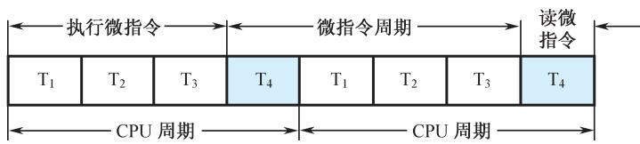
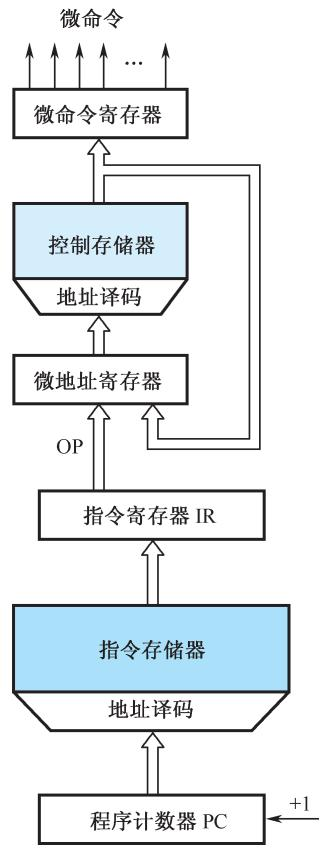
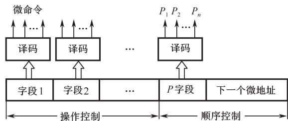

# 第5章-5.4-微程序控制器

## 基本信息

- **课程**：计算机组成原理
- **章节**：第5章 5.4节 微程序控制器
- **日期**：2026-04-26
- **标签**：#CPU #微程序控制器 #微指令 #控制存储器 #核心概念

***

## 重点内容

### ⭐⭐⭐ 核心概念

1. **微程序控制思想**：将机器指令的操作流程分解成微操作序列，用微指令实现
2. **微命令与微操作**：控制部件发出微命令，执行部件进行微操作
3. **微指令与微程序**：微指令是微命令的组合，微程序是微指令的序列
4. **机器指令与微指令的关系**：一条机器指令对应一个微程序

### ⭐⭐ 关键问题

- **CPU周期与微指令周期的关系**：在串行方式中，微指令周期 = CPU周期
- **微地址的形成**：计数器方式 vs 多路转移方式

***

## 详细笔记

### 一、微程序控制原理

#### 1. 微程序控制思想的提出

**1951年**，英国剑桥大学的\*\*威尔克斯(M.V.Wilkes)\*\*教授提出了微程序设计思想。

**核心思想**：

```
将程序设计技术与存储逻辑相结合实现操作控制器
    ↓
把机器指令的操作流程分解成基本的微操作序列
    ↓
用二进制代码表示微操作并编成微指令
    ↓
一条机器指令对应一段由微指令序列构成的微程序
    ↓
所有微程序存放在控制存储器（只读存储器）中
```

#### 2. 微程序控制器的优点

与硬布线控制器相比：

- ✅ **规整性**：不需要庞杂的组合逻辑控制单元
- ✅ **灵活性**：易于修改和扩充指令
- ✅ **可维护性**：调试、维护更方便
- ✅ **适合复杂控制器**：尤其适合CISC架构

**缺点**：执行速度相对较慢（需要从控存中读取微指令）

***

### 二、微命令和微操作

#### 1. 基本概念

| 概念      | 定义               | 关系   |
| ------- | ---------------- | ---- |
| **微命令** | 控制部件向执行部件发出的控制命令 | 控制信号 |
| **微操作** | 执行部件接受微命令后进行的操作  | 执行动作 |

#### 2. 控制部件与执行部件的联系

```
┌─────────────┐      控制线       ┌─────────────┐
│   控制部件   │ ───────────────→ │   执行部件   │
│  (控制器)   │    (微命令)      │ (运算器/存储器│
└─────────────┘                  │  /外设等)    │
       ↑                         └─────────────┘
       │                              │
       └──────────────────────────────┘
              反馈线 (状态信息)
```

#### 3. 微操作的分类

#### 📷 图5.21 简单运算器数据通路图



> 📚 **课本出处**：图5.21 简单运算器模型，用于说明相容性和相斥性微操作

**相容性微操作**：可以同时或同一个CPU周期内并行执行的微操作

- 例：ALU的X输入微操作(4,6,8)与Y输入微操作(5,7,9)是相容的

**相斥性微操作**：不能同时或同一个CPU周期内并行执行的微操作

- 例：ALU的+、-、M(传送)三个微操作是相斥的
- 例：4、6、8三个微操作是相斥的（同一组多路开关）

***

### 三、微指令和微程序

#### 1. 微指令的定义

在机器的一个CPU周期中，一组实现一定操作功能的微命令的组合，构成一条**微指令**。

#### 📷 图5.22 微指令基本格式



> 📚 **课本出处**：图5.22 微指令字长为23位，由操作控制和顺序控制两部分组成

#### 2. 微指令的结构

```
┌─────────────────────────────────────────────────────────┐
│                      微指令字（23位）                     │
├─────────────────────────────┬─────────────┬─────────────┤
│      操作控制字段（17位）     │ 判别测试字段 │  下地址字段  │
│                             │   （2位）    │   （4位）    │
├─────────────────────────────┼─────────────┼─────────────┤
│ 每一位表示一个微命令，1表示   │ P1、P2表示   │ 直接给出下   │
│ 发出该微命令，0表示不发出    │ 是否测试    │ 一条微指令   │
│                             │             │ 的地址      │
└─────────────────────────────┴─────────────┴─────────────┘
```

**操作控制字段**：发出管理和指挥全机工作的控制信号
**顺序控制字段**：决定产生下一条微指令的地址

#### 3. 微程序

**微程序**：由若干条微指令组成的序列，用来实现一条机器指令的功能。

***

### 四、微程序控制器原理框图

#### 📷 图5.24 微程序控制器组成原理框图



> 📚 **课本出处**：图5.24 微程序控制器由控制存储器、微指令寄存器和地址转移逻辑组成

#### 1. 控制存储器

- **功能**：存放实现全部指令系统的微程序
- **类型**：只读型存储器（ROM），运行时只读不写
- **工作过程**：读出一条微指令 → 执行 → 再读出下一条
- **要求**：速度快，读出周期短

#### 2. 微指令寄存器

分为两部分：

- **微地址寄存器**：保存下一条微指令的地址
- **微命令寄存器**：保存当前微指令的操作控制字段

#### 3. 地址转移逻辑

- **功能**：根据判别测试字段和状态条件，自动修改微地址
- **作用**：实现微程序的分支和转移

***

### 五、微程序举例：十进制加法指令

#### 📷 图5.25 十进制加法微程序



> 📚 **课本出处**：图5.25 十进制加法微程序流程图，由4条微指令组成

**十进制加法原理**：

- BCD码相加，当和数>9时，需要加6修正
- 先执行+6运算，再根据进位标志决定是否减6

**微程序执行过程**：

| 微指令   | 地址   | 功能               | 说明       |
| ----- | ---- | ---------------- | -------- |
| 取指微指令 | 0000 | 取机器指令，PC+1，P1测试  | 公共操作     |
| 第二条   | 1010 | 执行6+a运算          | R1+R2→R2 |
| 第三条   | 1001 | 执行(6+a)+b运算，P2测试 | 测试进位标志Cy |
| 第四条   | 0001 | 执行减6运算           | Cy=0时执行  |

**关键理解**：

- P1测试：根据指令操作码OP修改微地址，实现多路分支
- P2测试：根据进位标志Cy决定下一条微指令地址
- 当Cy=1时，跳过第四条微指令，直接返回公操作

***

### 六、CPU周期与微指令周期的关系

#### 📷 图5.26 CPU周期与微指令周期的关系



> 📚 **课本出处**：图5.26 展示了CPU周期与微指令周期的时间关系

**关系**：

```
微指令周期 = 读出微指令的时间 + 执行该条微指令的时间

在串行方式的微程序控制器中：
微指令周期 = CPU周期
```

**时间分配示例**（CPU周期 = 0.8μs）：

- T₁ + T₂ + T₃（600ns）：执行微指令
- T₄（200ns）：读取下一条微指令

***

### 七、机器指令与微指令的关系 ⭐⭐⭐

#### 📷 图5.27 机器指令与微指令的关系



> 📚 **课本出处**：图5.27 机器指令与微指令、程序与微程序、地址与微地址的对应关系

**核心关系**：

| 机器指令层面  | 微指令层面  | 存储位置   |
| ------- | ------ | ------ |
| 机器指令    | 微指令    | 控制存储器  |
| 程序      | 微程序    | 控制存储器  |
| 地址      | 微地址    | 微地址寄存器 |
| 指令寄存器IR | 微指令寄存器 | -      |

**关键结论**：

1. **一条机器指令对应一个微程序**
2. **一个微程序由若干条微指令组成**
3. **一个CPU周期对应一条微指令**
4. **微程序对软件不可见**（完全属于硬件范畴）

**类比理解**：

- 控存中的微程序 → 软件设计中的子程序定义
- 内存中的机器指令 → 软件执行时的子程序调用

***

### 八、微程序设计技术

#### 1. 微命令编码（三种方法）

| 编码方法      | 原理              | 优点            | 缺点          |
| --------- | --------------- | ------------- | ----------- |
| **直接表示法** | 每位代表一个微命令       | 简单直观，输出直接控制   | 微指令字较长      |
| **编码表示法** | 相斥微命令组成字段，经译码输出 | 缩短微指令字        | 增加译码电路，速度稍慢 |
| **混合表示法** | 直接法与编码法混合使用     | 综合考虑字长、灵活性、速度 | 设计复杂        |

#### 📷 图5.28 字段直接译码法



> 📚 **课本出处**：图5.28 字段直接译码法，用较小的二进制位表示较多的微命令

**编码示例**：

- 3位二进制位 → 可表示7个微命令（2³-1）
- 4位二进制位 → 可表示15个微命令（2⁴-1）

#### 2. 微地址的形成方法

**方法一：计数器方式**

- **原理**：类似程序计数器，顺序执行时微地址+1
- **特点**：
  - ✅ 顺序控制字段较短
  - ✅ 微地址产生机构简单
  - ❌ 多路并行转移功能弱
  - ❌ 灵活性差

**方法二：多路转移方式** ⭐⭐

- **原理**：根据判别测试标志和状态条件选择微地址
- **特点**：
  - ✅ 实现多路并行转移
  - ✅ 灵活性好，速度较快
  - ❌ 转移地址逻辑需用组合逻辑设计

**多路转移能力**：

- 1位状态条件 → 2路转移
- 2位状态条件 → 4路转移
- n位状态条件 → 2ⁿ路转移

#### 3. 微指令格式（两类）

| 类型         | 特点              | 比较                 |
| ---------- | --------------- | ------------------ |
| **水平型微指令** | 一次能定义并执行多个并行微命令 | 并行能力强、效率高、字长较长、难掌握 |
| **垂直型微指令** | 设置微操作码字段，类似机器指令 | 并行能力弱、效率低、字长短、易掌握  |

**水平型微指令格式**：

```
┌─────────────┬─────────────┬─────────────┐
│  控制字段    │ 判别测试字段 │  下地址字段  │
└─────────────┴─────────────┴─────────────┘
```

**垂直型微指令格式**（以寄存器-寄存器传送型为例）：

```
┌─────┬─────────────┬─────────────┬───────┐
│ 000 │ 源寄存器编址 │ 目标寄存器编址 │ 其他  │
│3位  │    5位      │     5位      │ 3位  │
└─────┴─────────────┴─────────────┴───────┘
```

**水平型 vs 垂直型对比**：

| 比较项    | 水平型    | 垂直型            |
| ------ | ------ | -------------- |
| 并行操作能力 | 强      | 弱              |
| 执行速度   | 快      | 慢              |
| 微指令字长  | 长      | 短              |
| 微程序长度  | 短      | 长              |
| 掌握难度   | 难      | 易              |
| 应用场景   | 高性能计算机 | Pentium 4、安腾系列 |

***

## 疑问与思考

### ❓ 待解决问题

1. 如何计算控制存储器的容量？
2. 微程序控制器和硬布线控制器在实际CPU中如何选择？

### 💡 个人理解

- 微程序控制的核心思想是"存储逻辑"，用软件方法实现硬件控制
- 水平型微指令强调并行，垂直型微指令强调简洁
- 微程序控制器适合CISC，硬布线控制器适合RISC

***

## 核心考点总结

### ⭐⭐⭐ 必考内容

1. **微程序控制思想**
   - 提出者：威尔克斯（1951年）
   - 核心：将机器指令分解为微操作序列，用微指令实现
2. **基本概念对比**

| 概念    | 定义               |
| ----- | ---------------- |
| 微命令   | 控制部件发出的控制信号      |
| 微操作   | 执行部件执行的操作        |
| 微指令   | 一个CPU周期内一组微命令的组合 |
| 微程序   | 实现一条机器指令功能的微指令序列 |
| 控制存储器 | 存放所有微程序的只读存储器    |

1. **机器指令与微指令的关系**
   - 一条机器指令 ↔ 一个微程序
   - 一个CPU周期 ↔ 一条微指令
   - 内存 ↔ 控制存储器
2. **微指令的组成**
   ```
   微指令 = 操作控制字段 + 顺序控制字段（判别测试 + 下地址）
   ```
3. **微地址形成方式**
   | 方式     | 特点           |
   | ------ | ------------ |
   | 计数器方式  | 顺序执行简单，转移功能弱 |
   | 多路转移方式 | 可实现多路分支，灵活性好 |
4. **微指令格式**
   | 类型  | 特点              |
   | --- | --------------- |
   | 水平型 | 并行能力强，字长长，微程序短  |
   | 垂直型 | 类似机器指令，字长短，微程序长 |

### 📌 易混淆点辨析

| 对比项  | 微程序控制器    | 硬布线控制器     |
| ---- | --------- | ---------- |
| 设计方法 | 存储逻辑      | 组合逻辑       |
| 规整性  | 好         | 差          |
| 灵活性  | 好（易修改）    | 差（需重新布线）   |
| 执行速度 | 较慢（需读控存）  | 快（取决于电路延迟） |
| 适用场景 | CISC、复杂指令 | RISC、简单指令  |
| 当前应用 | 复杂控制器     | 高性能处理器主流   |

### 📝 常见考题类型

1. **简答题**：
   - 简述微程序控制的基本思想
   - 说明机器指令与微指令的关系
   - 比较水平型和垂直型微指令
2. **分析题**：
   - 分析微程序控制器的优缺点
   - 说明微地址的形成方法
3. **设计题**：
   - 设计微指令格式
   - 编写简单指令的微程序

***

## 相关链接

### 本节涉及图片

- [图5.21 简单运算器数据通路图](../../../images/3ef28aae58b3f15efa644e0cec814710893a5d35409c7cc8b305c802ccee8209.jpg)
- [图5.22 微指令基本格式](../../../images/db35500d5fd94b23b923d72770c25b1dd13598926043b897643b0435c74a282f.jpg)
- [图5.24 微程序控制器组成原理框图](../../../images/82b7a9510cbe9b894e67952a64af924ad519e2ce3310126def463a96ca88625a.jpg)
- [图5.25 十进制加法微程序](../../../images/2898332c45db9d314bd9ca1989d7569281aa4dfeabfcb59ce6619a446cb69f1e.jpg)
- [图5.26 CPU周期与微指令周期的关系](../../../images/d382caddaa8435a9d745953bc393d944ca4705c77b53e067660817ac1a2b9386.jpg)
- [图5.27 机器指令与微指令的关系](../../../images/205ac96d3083079d008f34a24eab15bbd2047b75b8208bb3e12c03ecf8d921c8.jpg)
- [图5.28 字段直接译码法](../../../images/dc734ff2c4c5d91972f256ad063921c198159f92164e9196d04397199fbbca80.jpg)

### 关联章节

- [第5章-5.2-指令周期](./第5章-5.2-指令周期.md) - CPU周期与微指令周期的关系
- [第5章-5.3-时序发生器和控制方式](./第5章-5.3-时序发生器和控制方式.md) - 时序信号、控制方式
- [第5章-5.5-硬布线控制器](./第5章-5.5-硬布线控制器.md) - 两种控制器的对比

***

*笔记创建时间：2026-04-26*
