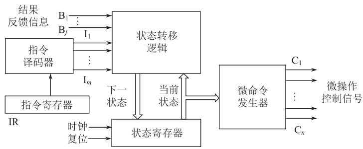
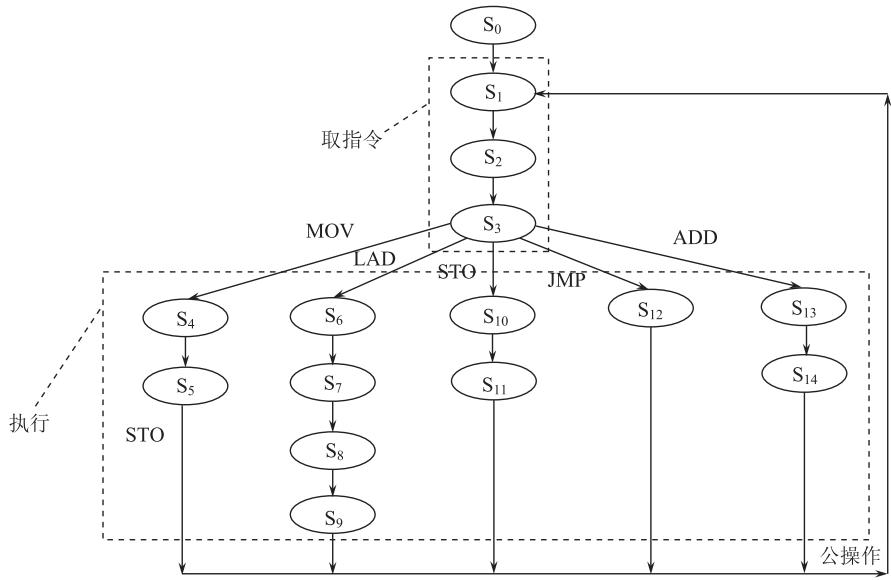

# 第5章-5.5-硬布线控制器

## 基本信息
- **课程**：计算机组成原理
- **章节**：第5章 5.5节 硬布线控制器
- **日期**：2026-04-26
- **标签**：#CPU #硬布线控制器 #组合逻辑 #有限状态机 #核心概念

---

## 重点内容

### ⭐⭐⭐ 核心概念
1. **硬布线控制器的基本思想**：用门电路和触发器构成的复杂树形逻辑网络产生控制信号
2. **微操作控制信号的产生**：$C = f(I_m, M_i, T_k, B_j)$
3. **硬布线控制器 vs 微程序控制器**：速度、规整性、灵活性、适用场景的对比

### ⭐⭐ 关键问题
- **硬布线控制器的优缺点**：速度快但设计复杂
- **基于有限状态机的设计方法**：现代硬布线控制器的主流设计方法

---

## 详细笔记

### 一、基本思想

#### 1. 什么是硬布线控制器？

硬布线控制器是最早出现的计算机操作控制器设计方法。

**定义**：把控制部件看作产生专门固定时序控制信号的逻辑电路，由门电路和触发器构成的复杂树形逻辑网络。

#### 2. 设计目标

- **使用最少元件**
- **取得最高操作速度**

#### 3. 主要特点

| 特点 | 说明 |
|-----|------|
| **固定性** | 一旦构成，除非重新设计和物理布线，否则无法增加新功能 |
| **复杂性** | 计算机中最复杂的逻辑部件之一 |
| **速度快** | 产生微命令的速度仅取决于电路延迟 |
| **结构杂乱** | 执行不同指令时激活不同的控制信号，结构不明确 |

#### 4. 发展历程

```
早期计算机
    ↓
硬布线控制器（主流）
    ↓
微程序控制器取代（因规整性、易维护）
    ↓
硬布线控制器重新流行（VLSI技术、EDA工具、RISC思想）
    ↓
现代高性能处理器主流
```

**重新流行的原因**：
- ✅ VLSI技术的发展
- ✅ 电子设计自动化（EDA）工具的成熟
- ✅ RISC设计思想的流行
- ✅ 对处理器速度要求越来越高

---

### 二、硬布线控制器结构

#### 📷 图5.29 硬布线控制器结构方框图


> 📚 **课本出处**：图5.29 硬布线控制器的逻辑网络输入来自三个方面

#### 1. 逻辑网络的输入信号（三个来源）

| 来源 | 符号 | 说明 |
|-----|------|------|
| 指令操作码译码器 | $I_m$ | 不同指令产生不同的译码输出 |
| 执行部件反馈信息 | $B_j$ | 状态条件、运算结果等 |
| 时序产生器 | $M_i, T_k$ | 节拍电位信号M和节拍脉冲信号T |

#### 2. 逻辑网络的输出信号

**微操作控制信号**：用来对执行部件进行控制

**时序控制信号**：根据条件变量改变时序发生器的计数顺序，跳过某些状态以缩短指令周期

#### 3. 微操作控制信号的产生公式

**基本公式**：

$$C = f(I_m, M_i, T_k, B_j)$$

**展开形式**：

$$C_n = \sum_{i}(M_i \cdot T_k \cdot B_j \sum_{m}I_m)$$

**含义**：某一微操作控制信号C是指令译码输出、时序信号和状态条件的逻辑函数

#### 4. 设计方法

使用**布尔代数方法**，通过门电路、触发器等器件实现：
- 确定在指令周期中各个时刻必须激活的所有操作控制信号
- 根据指令流程图，一个不漏地列出所有控制信号
- 写出布尔代数表达式并简化
- 用门电路或可编程器件实现

**示例**：主存读操作控制信号 $C_3$

$$C_3 = M_1 + M_4(LAD + ADD + AND)$$

含义：
- 当 $M_1=1$（取指令时）激活
- 或当 $M_4=1$ 且指令为LAD、ADD、AND时激活

---

### 三、指令执行流程

#### 1. 时序特点

与微程序控制器的对比：

| 特性 | 微程序控制器 | 硬布线控制器 |
|-----|-------------|-------------|
| 节拍电位产生 | 由微程序提供 | 由时序产生器产生 |
| 时序信号 | 只需节拍脉冲 | 需要节拍电位+节拍脉冲 |
| 时间利用 | 经济（微指令周期=节拍电位） | 可能浪费（同步工作方式） |

#### 📷 图5.30 硬布线控制器的指令周期流程图


> 📚 **课本出处**：图5.30 展示了硬布线控制器中五条指令的指令周期流程

#### 2. 同步工作方式的问题

**问题**：各条指令执行阶段均用最长节拍数考虑

**结果**：
- MOV、ADD、JMP指令只需$M_2$节拍
- 但LAD、STO指令需要$M_2$、$M_3$两个节拍
- 短指令在$M_3$节拍没有操作，造成时间浪费

**优化方法**：短指令执行$M_2$后跳过$M_3$，直接返回$M_1$
- 优点：提高时间利用率
- 缺点：节拍信号发生器电路更复杂

---

### 四、微操作控制信号的产生（例题）

**例5.3**：根据图5.29，写出以下操作控制信号的逻辑表达式

**控制信号含义**：
- RD(I)：指存读命令
- RD(D)：数存读命令
- WE(D)：数存写命令
- LDPC：打入程序计数器
- LDIR：打入指令寄存器
- LDAR：打入数存地址寄存器
- LDDR：打入数据缓冲寄存器
- PC+1：程序计数器加1
- $LDR_x$：打入$R_x$寄存器
- $LDR_y$：打入$R_y$寄存器

**逻辑表达式**：

| 控制信号 | 逻辑表达式 | 说明 |
|---------|-----------|------|
| RD(I) | $M_1$ | 电位信号，$M_1$期间有效 |
| RD(D) | $M_3 \cdot LAD$ | 电位信号，$M_3$且LAD指令时有效 |
| WE(D) | $M_3 \cdot T_3 \cdot STO$ | 脉冲信号，需加节拍脉冲 |
| LDPC | $M_1 \cdot T_4 + M_2 \cdot T_4 \cdot JMP$ | 取指和JMP指令时有效 |
| LDIR | $M_1 \cdot T_3$ | 取指周期打入IR |
| LDAR | $M_2 \cdot T_4 \cdot (LAD + STO)$ | LAD和STO指令时需要 |
| LDDR | $M_2 \cdot T_3 \cdot (MOV + ADD) + M_3 \cdot T_3 \cdot LAD$ | 多种指令需要 |
| PC+1 | $M_1 \cdot T_4$ | 取指后PC+1 |
| $LDR_x$ | $M_2 \cdot T_4 \cdot MOV + M_3 \cdot T_4 \cdot LAD$ | MOV和LAD指令时需要 |
| $LDR_y$ | $M_2 \cdot T_4 \cdot ADD$ | ADD指令时需要 |

**设计注意事项**：
- 区分电位有效还是脉冲有效
- 脉冲有效信号必须加入节拍脉冲进行相"与"
- 按信号出现在指令流程图中的先后次序书写，防止遗漏

---

### 五、基于有限状态机的硬布线控制器 ⭐⭐

#### 1. 传统硬布线控制器的缺点

- 控制信号形成部件结构不规整
- 设计、调试困难
- 维护代价大

#### 2. 现代解决方案

**基于有限状态机（FSM）的设计方法**

**优势**：
- 大规模可编程逻辑技术的发展降低了设计难度
- 电子设计自动化（EDA）工具的进步
- RISC设计思想降低了控制器复杂度

#### 📷 图5.31 基于有限状态机的硬布线控制器结构方框图



> 📚 **课本出处**：图5.31 基于FSM的硬布线控制器由状态寄存器、状态转移逻辑和微命令发生器组成

#### 3. 结构组成

| 部件 | 功能 |
|-----|------|
| **状态寄存器** | 保存有限状态机的当前状态 |
| **状态转移逻辑** | 根据当前状态、指令译码和反馈信号确定下一状态 |
| **微命令发生器** | 根据当前状态生成微操作控制信号（有效时间为一个时钟周期） |

#### 4. 设计步骤

**步骤1**：根据指令执行流程画出状态转移图
- 指令周期流程图的每个方框定义为一个状态
- 合并重复状态得到最简状态转移图

**步骤2**：得到微操作控制信号汇总表
- 列出每个状态下各控制信号是否有效

**步骤3**：实现逻辑电路
- 根据状态转移图和控制信号表
- 用组合逻辑实现状态转移逻辑和微命令发生器

#### 📷 图5.32 基于有限状态机的硬布线控制器状态转移图



> 📚 **课本出处**：图5.32 展示了模型机的状态转移图，每个椭圆表示一个状态

#### 5. 状态转移图特点

- **椭圆**：表示一个状态
- **箭头**：表示状态转移方向
- **标识**：表示状态转移条件
- **无标识**：无条件转移至下一状态
- **$S_0$**：初始空闲状态

**假设条件**：
- 不采用多级时序体系
- 只使用一个基本时钟信号
- 每一步操作占用1个时钟周期

---

### 六、硬布线控制器 vs 微程序控制器 ⭐⭐⭐

#### 综合对比

| 对比项 | 硬布线控制器 | 微程序控制器 |
|-------|-------------|-------------|
| **设计方法** | 组合逻辑（布尔代数） | 存储逻辑（微程序） |
| **核心部件** | 门电路、触发器 | 控制存储器、微指令寄存器 |
| **规整性** | 差（结构杂乱） | 好（结构规整） |
| **灵活性** | 差（修改需重新布线） | 好（修改微程序即可） |
| **设计难度** | 复杂（需设计复杂逻辑网络） | 简单（编写微程序） |
| **调试维护** | 困难 | 容易 |
| **执行速度** | **快**（仅取决于电路延迟） | 较慢（需从控存读取微指令） |
| **指令扩充** | 困难 | 容易 |
| **适用架构** | **RISC**、简单指令集 | **CISC**、复杂指令集 |
| **当前应用** | 高性能处理器**主流** | 复杂控制器、教学实验 |

#### 选择依据

**选择硬布线控制器**：
- 追求高速度
- 指令集简单（RISC）
- 有EDA工具支持
- 采用VLSI技术

**选择微程序控制器**：
- 指令集复杂（CISC）
- 需要频繁修改指令
- 对速度要求不极端
- 教学实验系统

---

## 疑问与思考

### ❓ 待解决问题
1. 如何用EDA工具设计硬布线控制器？
2. 现代CPU中硬布线控制器和微程序控制器的混合使用案例？

### 💡 个人理解
- 硬布线控制器的"硬"体现在控制逻辑固化在硬件电路中
- 速度优势来自于省去了读取微指令的时间
- FSM方法使硬布线控制器的设计更加系统化和规范化
- 两种控制器各有优势，选择取决于具体应用场景

---

## 核心考点总结

### ⭐⭐⭐ 必考内容

1. **硬布线控制器的基本思想**
   - 用门电路和触发器构成复杂树形逻辑网络
   - 产生专门固定时序控制信号
   - 设计目标：最少元件、最高速度

2. **微操作控制信号的产生**
   - 公式：$C = f(I_m, M_i, T_k, B_j)$
   - 三个输入来源：指令译码、时序信号、状态条件
   - 用布尔代数方法设计实现

3. **两种控制器的对比**

| 关键对比点 | 硬布线 | 微程序 |
|-----------|--------|--------|
| 速度 | 快 | 较慢 |
| 规整性 | 差 | 好 |
| 灵活性 | 差 | 好 |
| 适用 | RISC | CISC |

4. **基于FSM的设计方法**
   - 组成：状态寄存器 + 状态转移逻辑 + 微命令发生器
   - 状态转移图：指令周期流程图 → 状态定义
   - 优点：规整、系统化、易于EDA实现

### 📌 易混淆点辨析

| 概念 | 硬布线控制器 | 微程序控制器 |
|-----|-------------|-------------|
| 控制信号来源 | 组合逻辑网络 | 控制存储器中的微指令 |
| 时序信号 | 需节拍电位+节拍脉冲 | 只需节拍脉冲 |
| 修改方法 | 重新设计电路 | 修改微程序 |
| 设计工具 | 布尔代数、逻辑门 | 微程序编写 |

### 📝 常见考题类型

1. **简答题**：
   - 简述硬布线控制器的基本思想
   - 说明硬布线控制器的优缺点
   - 比较硬布线控制器和微程序控制器

2. **分析题**：
   - 分析微操作控制信号的逻辑表达式
   - 说明基于FSM的设计方法优势

3. **设计题**：
   - 根据指令流程图写出控制信号的逻辑表达式
   - 设计简单的硬布线控制电路

4. **综合题**：
   - 为特定应用场景选择合适的控制器类型并说明理由

---

## 相关链接

### 本节涉及图片
- [图5.29 硬布线控制器结构方框图](../../../images/a44e734f545313a807c916eb8a60d59fbef2987a9da87a9732724035a850a9c4.jpg)
- [图5.30 硬布线控制器的指令周期流程图](../../../images/7cd796a99a884e7469de24b84263d05d557cdf040bf570276bb7a668177237ca.jpg)
- [图5.31 基于有限状态机的硬布线控制器结构方框图](../../../images/4c70ab63962c156f8af093aeb46e1f09b0936ced308bc48bb8fc9610be2ab4cb.jpg)
- [图5.32 基于有限状态机的硬布线控制器状态转移图](../../../images/493cd6570308101bdb29cae4fedeb3e291088728e34c76ed9e6aa38a025d1466.jpg)

### 关联章节
- [第5章-5.2-指令周期](./第5章-5.2-指令周期.md) - 指令周期、CPU周期概念
- [第5章-5.3-时序发生器和控制方式](./第5章-5.3-时序发生器和控制方式.md) - 时序信号
- [第5章-5.4-微程序控制器](./第5章-5.4-微程序控制器.md) - 两种控制器的详细对比
- [第5章-5.6-流水线处理器](./第5章-5.6-流水线处理器.md) - 现代CPU技术

---

*笔记创建时间：2026-04-26*
