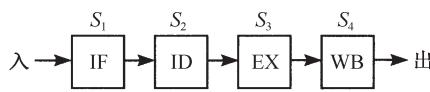
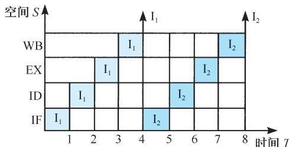
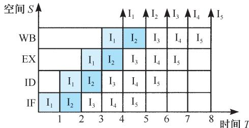
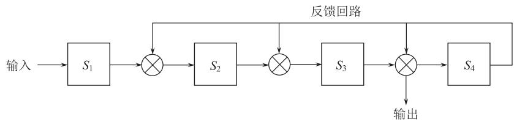
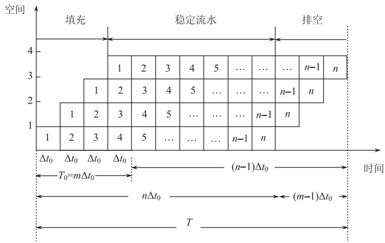
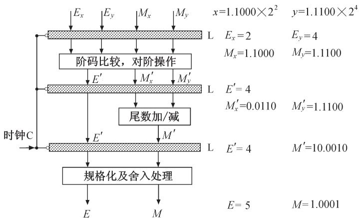
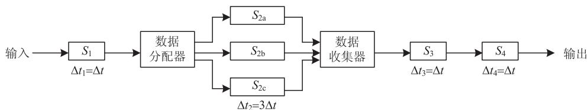
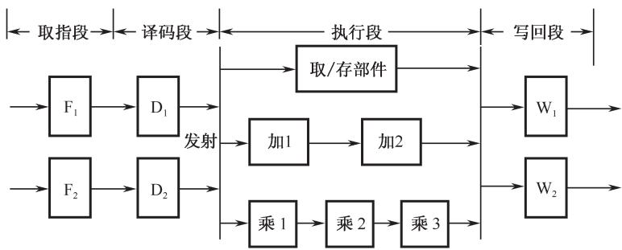
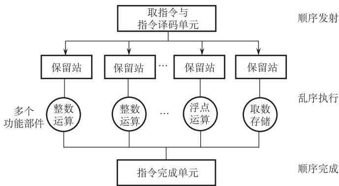

# 第5章-5.6-流水线技术与流水处理器

## 基本信息
- **课程**：计算机组成原理
- **章节**：第5章 5.6节 流水线技术与流水处理器
- **日期**：2026-04-26
- **标签**：#CPU #流水线 #并行处理 #性能优化 #核心概念

---

## 重点内容

### ⭐⭐⭐ 核心概念
1. **流水线原理**：将任务分割为子任务，在流水线的各个阶段并发执行
2. **流水线性能指标**：加速比、吞吐率
3. **流水线相关与冒险**：资源相关、数据相关、控制相关

### ⭐⭐ 关键问题
- **三种相关的解决方法**：资源重复、定向技术、延迟转移/转移预测
- **流水线性能计算**：加速比公式、吞吐率公式

---

## 详细笔记

### 一、流水线原理

#### 1. 并行处理技术

**并行性的两种含义**：
- **同时性**：两个以上事件在同一时刻发生
- **并发性**：两个以上事件在同一时间间隔内发生

**三种并行形式**：

| 形式 | 含义 | 实现方式 |
|-----|------|---------|
| **时间并行** | 时间重叠 | 流水线技术 |
| **空间并行** | 资源重复 | 多处理器系统 |
| **时间+空间并行** | 综合应用 | 超标量流水线 |

#### 2. 流水线基本概念

**流水线（Pipeline）**：将工厂生产线上的装配流水线引入计算机内部，构成流水线结构的处理器。

**工作原理**：
```
输入任务 → 分割为子任务 → 各子任务在流水线各阶段并发执行
                                              ↓
连续输入任务 → 连续输出结果 → 实现子任务级并行
```

**指令流水线的四个阶段**：

| 阶段 | 缩写 | 功能 |
|-----|------|------|
| 取指令 | IF (Instruction Fetch) | 从存储器取出指令 |
| 指令译码 | ID (Instruction Decode) | 译码并读寄存器 |
| 执行 | EX (Execution) | 执行运算或计算地址 |
| 写回 | WB (Write Back) | 将结果写回寄存器 |

#### 📷 图5.33 流水计算机的时空图








> 📚 **课本出处**：图5.33 展示了非流水线、标量流水线和超标量流水线的时空图对比

**时空图对比**（8个单位时间内）：

| 类型 | 执行指令数 | 特点 |
|-----|-----------|------|
| 非流水线 | 2条 | 串行执行，效率低 |
| 标量流水线 | 5条 | 一条指令流水线，每个周期输出1条指令 |
| 超标量流水线 | 10条 | 两条指令流水线，每个周期输出2条指令 |

---

### 二、流水线分类

#### 1. 按应用场合和层次分类

| 类型 | 层次 | 说明 | 实例 |
|-----|------|------|------|
| **算术流水线** | 部件级 | 运算器操作步骤的并行 | 流水加法器、乘法器 |
| **指令流水线** | 处理器级 | 指令执行步骤的并行 | 几乎所有高性能计算机 |
| **处理器流水线** | 处理器间 | 程序步骤的并行 | 多机系统 |

#### 2. 按功能段连接方式分类

#### 📷 图5.34 流水线的基本结构




> 📚 **课本出处**：图5.34 线性流水线（无反馈）与非线性流水线（有反馈）

| 类型 | 特点 | 说明 |
|-----|------|------|
| **线性流水线** | 段间无反馈回路，每个功能段只流过一次 | 顺序连接，线性优先关系 |
| **非线性流水线** | 存在反馈连接，一个周期内多次占用某段 | 可实现循环操作 |

**线性流水线的细分**：
- **同步流水线**：受统一时钟控制，各阶段处理时间相同（处理器内部常用）
- **异步流水线**：各阶段处理时间可不同（宏流水线常用）

#### 3. 按输入输出任务顺序分类

| 类型 | 特点 |
|-----|------|
| **顺序流水线** | 保持输入任务和输出任务的顺序一致性 |
| **乱序流水线** | 允许后进入的任务比前面的任务更先完成 |

---

### 三、线性流水线的性能指标 ⭐⭐⭐

#### 📷 图5.35 线性流水线的三个阶段



> 📚 **课本出处**：图5.35 流水线工作的三个阶段：填充、稳定流水、排空

#### 1. 时钟周期

$$\tau = \max\{\tau_i\} + \tau_l = \tau_m + \tau_l$$

其中：
- $\tau_i$：第i个过程段的处理时间
- $\tau_l$：缓冲寄存器的延时
- $\tau_m$：最慢过程段的处理时间

**流水线频率**：$f = 1/\tau$

#### 2. 流水线处理的时钟周期数

对于k级流水线处理n个任务：

$$T_k = k + (n - 1)$$

- k个周期：处理第一个任务（填充流水线）
- n-1个周期：处理剩余n-1个任务（稳定流水）

#### 3. 加速比

**非流水线方式所需周期数**：$T_L = n \cdot k$

**加速比公式**：

$$C_k = \frac{T_L}{T_k} = \frac{n \cdot k}{k + (n - 1)}$$

**最大加速比**（当 $n \gg k$ 时）：

$$C_k \rightarrow k$$

**潜在加速比**：流水线的级数k

#### 4. 吞吐率

**实际吞吐率**：

$$T_p = \frac{n}{T_k \cdot \Delta t} = \frac{n}{(k - 1 + n) \Delta t}$$

**最大吞吐率**（当 $n \rightarrow \infty$ 时）：

$$T_{p\max} = \frac{1}{\Delta t}$$

---

### 四、流水线的特点

1. **不能减少单个任务的处理延迟**，但能提高整体工作负载的吞吐率
2. **多个不同任务同时操作**，使用不同资源，适合同一种运算的多次重复
3. **各阶段处理时间应大致相同**，流水线速率受限于最慢的流水段

---

### 五、流水线的应用

#### 1. 浮点运算流水线

#### 📷 图5.36 流水线浮点加法器框图



> 📚 **课本出处**：图5.36 4段流水线浮点加法器：对阶、尾数操作、结果规格化

**浮点加法的4个步骤**：
1. 0操作数检查
2. 对阶操作
3. 尾数操作（相加）
4. 结果规格化及舍入处理

**例题5.4**：4级流水浮点加法器加速比计算

| 过程段 | 时间 |
|-------|------|
| 0操作数检查 | 70ns |
| 对阶 | 60ns |
| 相加 | 90ns |
| 规格化 | 80ns |
| 缓冲寄存器 | 10ns |

**计算**：
- 时钟周期：$\tau = 90 + 10 = 100ns$（取最慢段）
- 非流水线时间：$70 + 60 + 90 + 80 = 300ns$
- **加速比**：$C_k = 300 / 100 = 3$

若各段时间相同（都为75ns）：
- **加速比**：$C_k = 300 / 75 = 4$（达到理论最大值）

#### 📷 图5.37 向量加法计算的流水时空图


> 📚 **课本出处**：图5.37 展示了6个元素的向量加法在4段流水线中的时空图

#### 2. 流水计算机系统

#### 📷 图5.38 流水计算机系统组成原理示意图


> 📚 **课本出处**：图5.38 现代流水计算机由指令部件、指令队列、执行部件组成3级流水线

**CPU的三大部分**：
1. **指令部件**：取指令、译码、计算操作数地址、取操作数
2. **指令队列**：FIFO寄存器栈，存放译码后的指令和操作数
3. **执行部件**：多个算术逻辑运算部件，用流水线方式构成

**存储器设计**：
- 采用**多体交叉存储器**提高访问速度
- 例如：IBM 360/91采用八体交叉存储器
- 使用Cache弥补主存和CPU的速度差异

---

### 六、指令流水线设计中的问题 ⭐⭐⭐

#### 1. 流水线的拥挤问题

**问题**：某一过程段处理速度很慢，成为瓶颈

#### 📷 图5.39 流水线拥挤问题的解决方案




> 📚 **课本出处**：图5.39 解决流水线拥挤的两种方法：瓶颈段细分或重复设置

**解决方法**：

| 方法 | 说明 | 适用场景 |
|-----|------|---------|
| **瓶颈段细分** | 将慢段拆分为更小的过程段 | 能够拆分时 |
| **重复设置瓶颈段** | 设置多个并行工作的过程段 | 难以拆分时 |

#### 2. 资源相关（结构相关）⭐⭐

**定义**：多条指令在同一时钟周期内争用同一个功能部件

#### 📷 图5.40 资源相关实例


> 📚 **课本出处**：图5.40 I₁的MEM段与I₄的IF段同时访问存储器，发生资源冲突

**示例**：5段流水线（IF、ID、EX、MEM、WB）
- 时钟4时：I₁的MEM段与I₄的IF段都要访问存储器
- 当数据和指令放在同一个存储器且只有一个端口时，发生冲突

**解决方法**：
1. **引入暂停周期**：让I₄停顿一拍后再启动
2. **资源重复设置**：使用双端口存储器，或分设数据存储器和指令存储器

#### 3. 数据相关 ⭐⭐⭐

**定义**：重叠执行的指令中，某条指令依赖前面指令的执行结果，但得不到时发生相关

**三类数据相关**：

| 类型 | 缩写 | 含义 | 示例 |
|-----|------|------|------|
| **写后读** | RAW | 指令j使用指令i的结果，但j在i写入前就读取 | 最常见 |
| **读后写** | WAR | 指令j在指令i读取前就写入 | 较少见 |
| **写后写** | WAW | 指令j和i目标相同，j在i写入前先写入 | 较少见 |

**示例分析**（例5.6）：

```
(1) RAW相关：
    I₁: ADD R₁,R₂,R₃    ; R₂+R₃→R₁
    I₂: SUB R₄,R₁,R₅    ; R₁-R₅→R₄
    问题：I₂在时钟3读R₁，I₁在时钟5才写R₁
    
(2) WAR相关：
    I₃: STO M(x),R₃     ; R₃→M(x)
    I₄: ADD R₃,R₄,R₅    ; R₄+R₅→R₃
    问题：I₄在I₃读出R₃前就写入R₃
    
(3) WAW相关：
    I₅: MUL R₃,R₁,R₂    ; R₁×R₂→R₃
    I₆: ADD R₃,R₄,R₅    ; R₄+R₅→R₃
    问题：I₆在I₅写入R₃前先写入R₃
```

**解决方法**：

| 方法 | 说明 |
|-----|------|
| **后推法（流水线互锁）** | 遇到数据相关时暂停后继指令 |
| **定向技术（旁路技术）** | 设置运算结果缓冲寄存器，直接送结果给后继指令 |
| **专用数据通路** | 从结果产生位置直接送到使用位置 |
| **编译器调度** | 插入气泡（空操作）等待结果写入 |
| **动态调度** | 硬件动态调整指令执行顺序 |

#### 4. 控制相关 ⭐⭐

**定义**：由条件转移指令或中断引起的相关

**问题**：执行转移指令时，可能顺序取下条指令，也可能转移到新地址，导致流水线断流

**解决方法**：

| 方法 | 说明 |
|-----|------|
| **冻结/排空流水线** | 发现分支指令后暂停其后所有指令，直到确定新PC值 |
| **延迟转移法** | 编译程序重排指令，让与分支结果无关的指令继续执行 |
| **转移预测法** | 硬件预测下一条指令位置，确保取指顺序与执行顺序一致 |

---

### 七、超标量流水线

#### 📷 图5.41 超标量流水线



> 📚 **课本出处**：图5.41 超标度为2的超标量流水线结构模型

**特点**：
- 分为4个段：取指(F)、译码(D)、执行(E)、写回(W)
- F、D、W段只需1个时钟周期
- E段有多个功能部件（取数/存数、加法器、乘法器），都已流水化
- F段和D段成对输入
- E段有内部数据定向传送

**例题5.7**：6条指令序列的流水线执行

相关关系：
- I₁、I₂：RAW相关
- I₃、I₄：WAR相关
- I₅、I₆：WAW相关和RAW相关

**执行结果**：
- 按序发射按序完成
- 总共需要10个时钟周期完成6条指令

---

### 八、动态流水线调度

#### 📷 图5.42 动态流水线调度模型



> 📚 **课本出处**：图5.42 动态流水线调度模型，对指令重新排序以避免处理器阻塞

**三个主要单元**：
1. **取指令发射单元**：取指令、译码、送到功能单元
2. **多个功能单元**（10个或更多）：每个有自己的保留站（缓冲器）
3. **指令完成单元**：确定何时安全地将结果写入寄存器或内存

**重排序缓冲器**：
- 位于指令完成单元中
- 提供操作数，工作方式类似旁路逻辑
- 确保指令按正确顺序完成

---

## 疑问与思考

### ❓ 待解决问题
1. 如何计算复杂流水线的实际加速比？
2. 现代CPU中如何处理多种相关冲突的组合情况？

### 💡 个人理解
- 流水线技术的核心思想是"时间重叠"，用空间换时间
- 相关冲突是流水线设计的主要挑战，需要硬件和软件协同解决
- 超标量和动态调度是现代高性能CPU的关键技术

---

## 核心考点总结

### ⭐⭐⭐ 必考内容

1. **流水线性能指标**

| 指标 | 公式 | 说明 |
|-----|------|------|
| 时钟周期 | $\tau = \max\{\tau_i\} + \tau_l$ | 取最慢段+缓冲延时 |
| 处理n个任务周期数 | $T_k = k + (n-1)$ | k个填充+(n-1)个稳定 |
| 加速比 | $C_k = \frac{n \cdot k}{k + (n-1)}$ | 最大值为k |
| 最大吞吐率 | $T_{p\max} = \frac{1}{\Delta t}$ | 理想情况下 |

2. **三种相关冲突**

| 相关类型 | 冲突原因 | 解决方法 |
|---------|---------|---------|
| **资源相关** | 争用同一功能部件 | 暂停周期、资源重复 |
| **数据相关** | 指令间数据依赖 | 后推法、定向技术、动态调度 |
| **控制相关** | 转移指令改变执行顺序 | 延迟转移、转移预测 |

3. **数据相关的三种类型**

| 类型 | 缩写 | 危险 |
|-----|------|------|
| 写后读 | RAW | 读不到最新数据 |
| 读后写 | WAR | 读的数据被覆盖 |
| 写后写 | WAW | 写入顺序错误 |

### 📌 易混淆点辨析

| 概念 | 说明 |
|-----|------|
| **标量流水线** | 一条指令流水线，每周期输出1条指令 |
| **超标量流水线** | 多条指令流水线，每周期输出多条指令 |
| **超流水线** | 流水线段数很多，时钟周期很短 |
| **超长指令字** | 将多条指令合并为一条长指令 |

### 📝 常见考题类型

1. **计算题**：
   - 计算流水线的加速比和吞吐率
   - 分析给定指令序列的相关冲突

2. **分析题**：
   - 分析流水线时空图
   - 说明解决相关冲突的方法

3. **设计题**：
   - 设计简单的流水线结构
   - 优化流水线性能

---

## 相关链接

### 本节涉及图片
- [图5.33 流水计算机的时空图](../../../images/cb9eee89fd1930e01391e4769abec821b04a6f75e09c8c489a664ab6285b2e6b.jpg)
- [图5.34 流水线的基本结构](../../../images/44697b799748e464d3b9774893a29ab40fc07b5c8ad2f41ade88f5e90a8a4332.jpg)
- [图5.35 线性流水线的三个阶段](../../../images/bc16fc5a83420c3cb24a17981e89e92605e662ffbb2202b480da34144cd0cb1a.jpg)
- [图5.36 流水线浮点加法器框图](../../../images/79ca7727793123efeb88b20e9daab2fe2d6aea0219cc0c5a5cdf70c574e0a72c.jpg)
- [图5.37 向量加法计算的流水时空图](../../../images/6aa91e1b0c6bf2007835ca26df170acdfc19c81465b81a19943c947268114b6e.jpg)
- [图5.38 流水计算机系统组成原理示意图](../../../images/23f85783fa0143b81cc0af9663ae24f19b235765c874fcc217c2286943145402.jpg)
- [图5.39 流水线拥挤问题的解决方案](../../../images/95459c232da7374aa457e07a8478f8ac13629cb2d69ea72cc65ee7af708a72c.jpg)
- [图5.40 资源相关实例](../../../images/c82cb2c847e50ec132658e671e84143e7aa205bc0f65ef29aeaf82854cf936ba.jpg)
- [图5.41 超标量流水线](../../../images/1169bf296bea6094931d35ce00aa599cfa4a78e1a434da26728582b85567510c.jpg)
- [图5.42 动态流水线调度模型](../../../images/08c99698b0be3cfbd6fdb0415b788a9fa9c20abb7a52d5f3a3f755c29aa33103.jpg)

### 关联章节
- [第5章-5.2-指令周期](./第5章-5.2-指令周期.md) - 指令执行过程
- [第5章-5.5-硬布线控制器](./第5章-5.5-硬布线控制器.md) - 控制器设计
- [第5章-5.7-RISC处理器](./第5章-5.7-RISC处理器.md)（待创建）- 流水线优化

---

*笔记创建时间：2026-04-26*
