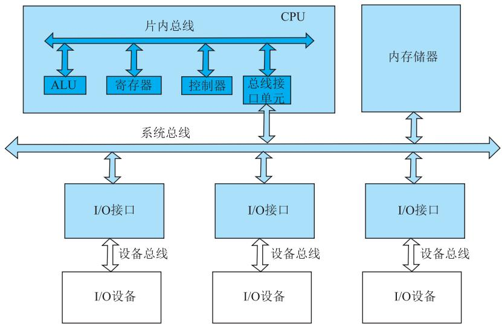
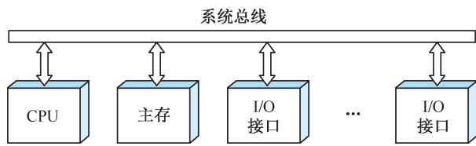
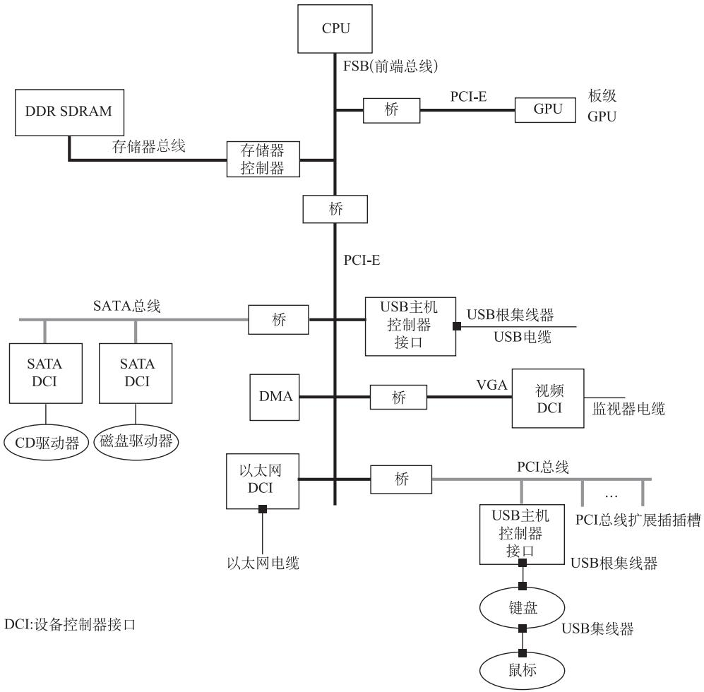
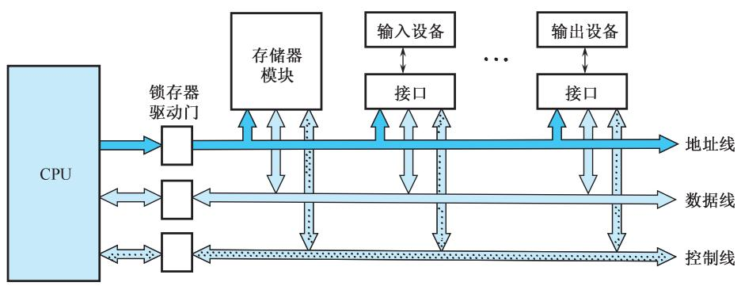
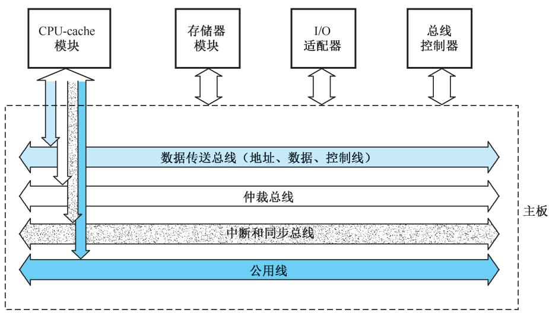

# 6.1 总线的概念和结构形态

## 基本信息
- **课程**：计算机组成原理
- **章节**：第6章 6.1节 总线的概念和结构形态
- **日期**：2026-06-16
- **标签**：#总线 #系统总线 #总线结构 #总线带宽

---

## 重点内容

### ⭐⭐⭐ 核心考点
1. **总线的定义** - 总线是构成计算机系统的互联机构，模块间传送信息的公用信号线
2. **总线带宽计算** - $D_r = D \times f$
3. **单总线 vs 多总线结构** - 结构特点及优缺点对比

### ⭐⭐ 重要概念
- 总线的层次结构（片内、系统、I/O、局部）
- 总线四特性（物理、功能、电气、时间）
- 当代总线四部分组成（数据传送、仲裁、中断同步、公用线）

---

## 详细笔记

### 6.1.1 总线的基本概念

**定义**：总线(bus)是构成计算机系统的互联机构，是在模块与模块之间或设备与设备之间传送信息、相互通信的一组公用信号线。

**总线的作用**：
- 实现地址、数据和控制信息的交换
- 使系统中的模块具有可互换性和可组合性
- 配置灵活，系统结构清晰
- 通常采用分时共享方式工作

#### 1. 总线的层次结构

#### 📷 图6.1 总线的层次结构

> 📚 **课本出处**：图6.1 展示了计算机系统中不同层次的总线结构

| 层次 | 名称 | 连接对象 |
|:----:|:-----|:---------|
| 1 | 内部总线/片内总线 | 处理器内部各寄存器及运算部件 |
| 2 | 系统总线/内总线/板级总线 | 处理器与存储器、通道等高速部件 |
| 3 | I/O总线/通信总线/外总线 | 主机与I/O设备 |
| 4 | 局部总线(local bus) | CPU私有存储器、高速外设(图形卡、硬盘控制器) |

#### 2. 总线的特性

| 特性 | 说明 |
|:-----|:-----|
| **物理特性** | 物理连接方式：总线根数、插头插座形状、引脚排列 |
| **功能特性** | 每根线的功能：地址线宽度决定寻址空间；数据线宽度决定数据位数；控制线包括读写命令、中断、DMA等 |
| **电气特性** | 信号传递方向及有效电平范围：地址线输出、数据线双向、控制线单向 |
| **时间特性** | 每根线在什么时间有效，信号有效的时序关系 |

#### 3. 总线的标准化

相同功能部件可互换使用的原因是遵守了相同的系统总线要求。

**微型计算机标准总线发展**：

| 总线 | 数据宽度 | 带宽 |
|:-----|:--------:|:-----|
| ISA | 16位 | 8MB/s |
| EISA | 32位 | 33.3MB/s |
| VESA | 32位 | 132MB/s |
| PCI | 32/64位 | 更高 |

**总线带宽**：总线本身所能达到的最高传输速率。

【例6.1】总线带宽计算：

$$D_r = D \times f$$

| 条件 | 计算 |
|:-----|:-----|
| 4B/周期，33MHz | $D_r = 4 \times 33 = 132 \text{MB/s}$ |
| 8B/周期，66MHz | $D_r = 8 \times 66 = 528 \text{MB/s}$ |

### 6.1.2 总线的连接方式

#### 1. 单总线结构

#### 📷 图6.2 单总线结构

> 📚 **课本出处**：图6.2 单总线结构，用单一系统总线连接CPU、主存和I/O设备

**特点**：
- 所有设备挂在同一总线上
- 对主存和I/O设备采用统一的操作方法
- 外围设备也可以指定地址，实现DMA
- 容易扩展成多CPU系统
- 缺点：高速设备和低速设备共用总线，效率受限

#### 2. 多总线结构

#### 📷 图6.3 多总线结构实例

> 📚 **课本出处**：图6.3 多总线结构，CPU、存储器控制器和PCI-E桥通过前端总线(FSB)相连

**特点**：
- 高速、中速、低速设备连接到不同总线
- 总线桥具有缓冲、转换、控制功能
- 提高总线效率和吞吐量
- 处理器结构变化不影响高速总线

### 6.1.3 总线的内部结构

#### 📷 图6.4 早期总线的内部结构

> 📚 **课本出处**：图6.4 早期总线是处理器芯片引脚的延伸

**早期总线的不足**：
1. CPU是总线上唯一的主控者，不能满足多CPU环境
2. 总线信号是CPU引脚信号的延伸，与CPU紧密相关，通用性差

#### 📷 图6.5 当代总线的内部结构

> 📚 **课本出处**：图6.5 当代标准总线追求与结构、CPU、技术无关

**当代总线四部分组成**：

| 部分 | 组成 | 功能 |
|:-----|:-----|:-----|
| 数据传送总线 | 地址线、数据线、控制线 | 传送数据，地址/数据可能多路复用 |
| 仲裁总线 | 总线请求线、总线授权线 | 协调多个总线请求者 |
| 中断和同步总线 | 中断请求线、中断认可线 | 处理带优先级的中断操作 |
| 公用线 | 时钟、电源、地、复位等 | 系统公用信号 |

## 疑问与思考

1. 为什么多总线结构比单总线结构效率更高？
2. 当代总线为什么要把地址线和数据线采用多路复用方式？

## 相关链接

- [第6章-6.2-总线接口](第6章-6.2-总线接口.md)
- [第6章-总线系统](第6章-总线系统.md)
