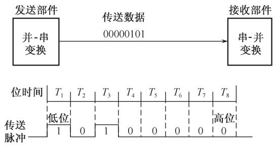
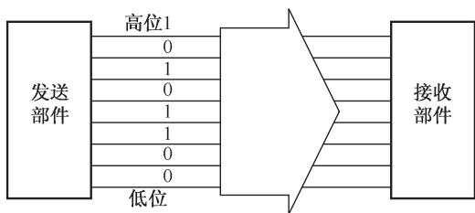
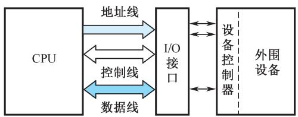

# 6.2 总线接口

## 基本信息
- **课程**：计算机组成原理
- **章节**：第6章 总线系统
- **日期**：2026-06-16
- **标签**：#总线接口 #串行传送 #并行传送 #I/O接口

## 重点内容

⭐⭐⭐ **串行传送 vs 并行传送**：串行只用一条线逐位传送；并行每位用一条线同时传送

⭐⭐⭐ **I/O接口四大功能**：控制、缓冲、状态、转换

## 详细笔记

### 一、信息传送方式

#### 1. 串行传送

#### 📷 图6.6(a) 串行传送

> 📚 **课本出处**：图6.6(a) 串行传送示意图，只有一条传输线，按顺序逐位传送

**特点**：
- 只有一条传输线，采用脉冲传送
- 每次一位，低位在前，高位在后
- 需要并-串变换(拆卸)和串-并变换(装配)
- 需要指定位时间，由同步脉冲体现
- **优点**：只需一条传输线，成本低，适合长距离传输
- **缺点**：速度较慢

#### 2. 并行传送

#### 📷 图6.6(b) 并行传送

> 📚 **课本出处**：图6.6(b) 并行传送示意图，每位单独一条线同时传送

**特点**：
- 每位数据需要单独一条传输线
- 所有位同时传送
- 一般采用电位传送
- **优点**：速度比串行快得多
- **缺点**：需要更多传输线，成本高

**系统总线采用并行传送方式**。

### 二、总线接口的基本概念

**I/O接口（适配器）**：CPU、主存和外围设备之间通过系统总线进行连接的标准化逻辑部件，在两个部件间起"转换器"的作用。

#### 📷 图6.7 外围设备的连接方法

> 📚 **课本出处**：图6.7 外围设备通过设备控制器和I/O接口与总线相连

#### 📷 图6.8 I/O接口模块框图

> 📚 **课本出处**：图6.8 I/O接口模块的一般结构框图

**I/O接口四大功能**：

| 功能 | 说明 |
|:-----|:-----|
| **控制** | 靠指令信息控制外围设备动作（启动、关闭等） |
| **缓冲** | 补偿设备间的速度差异 |
| **状态** | 监视并保存外围设备状态信息（准备就绪、忙、错误等） |
| **转换** | 完成数据转换（并-串、串-并等） |

## 疑问与思考

1. 为什么系统总线必须采用并行传送，而长距离通信更适合串行传送？
2. I/O接口的缓冲功能是如何补偿速度差异的？

## 相关链接

- [第6章-6.1-总线的概念和结构形态](第6章-6.1-总线的概念和结构形态.md)
- [第6章-6.3-总线仲裁](第6章-6.3-总线仲裁.md)
