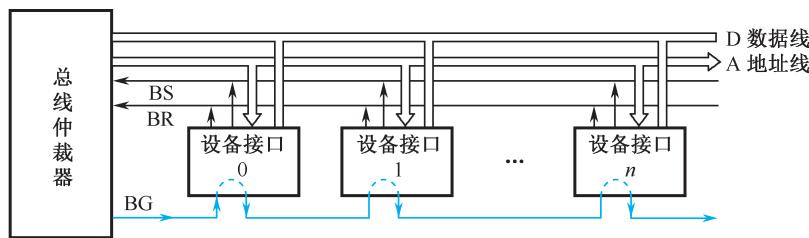
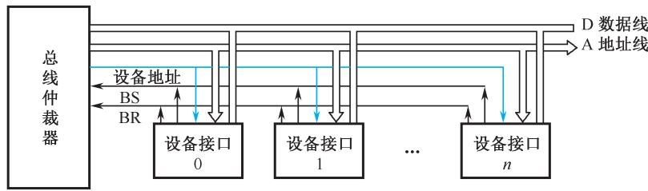
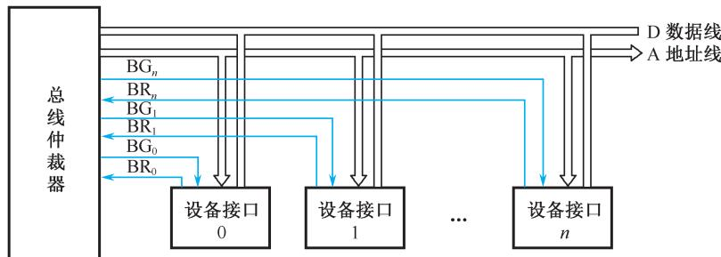
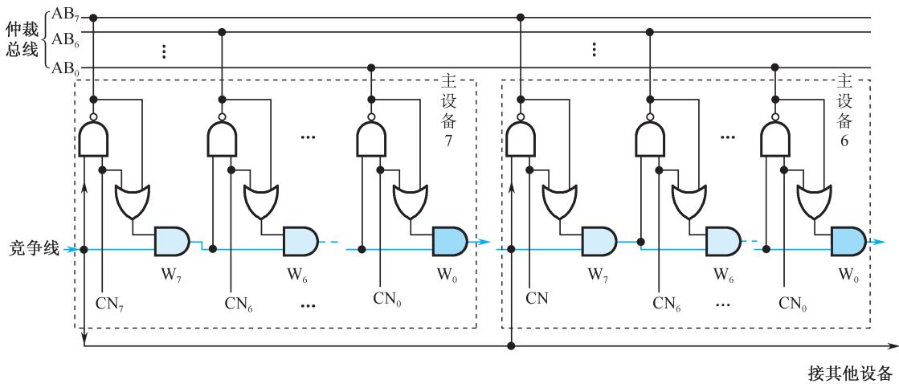

# 6.3 总线仲裁

## 基本信息
- **课程**：计算机组成原理
- **章节**：第6章 6.3节 总线仲裁
- **日期**：2026-06-16
- **标签**：#总线仲裁 #集中式仲裁 #分布式仲裁 #优先级

---

## 重点内容

### ⭐⭐⭐ 核心考点
1. **三种集中式仲裁方式** - 链式查询、计数器定时查询、独立请求的原理与对比
2. **分布式仲裁** - 竞争号比较机制（取反→线或→逐位比较）
3. **BR/BG/BS信号** - 总线请求、总线授权、总线忙

### ⭐⭐ 重要概念
- 主方（主设备）与从方（从设备）的定义
- 仲裁策略：优先级策略与公平策略
- 二维仲裁：独立请求 + 菊花链查询相结合

---

## 详细笔记

### 6.3.1 基本概念

**主方（主设备）**：可以启动一个总线周期的设备
**从方（从设备）**：只能响应主方请求的设备

**总线占用期**：主方持续控制总线的时间

**仲裁策略**：
- 优先级策略：对I/O模块的总线请求
- 公平策略：对多处理器系统中各CPU模块的总线请求

**仲裁方式分类**：

| 方式 | 特点 |
|:-----|:-----|
| 集中式仲裁 | 有中央仲裁器，功能模块有BR和BG两条线 |
| 分布式仲裁 | 无中央仲裁器，每个主方有自己的仲裁号和仲裁器 |

### 6.3.2 集中式仲裁

#### 📷 图6.10 集中式总线仲裁方式

**（a）链式查询方式（菊花链）** — BG 串行依次穿过每个设备接口

**（b）计数器定时查询方式** — 仲裁器通过"设备地址"线逐一查询

**（c）独立请求方式** — 每个设备有独立的 BR_i / BG_i 对

> 📚 **课本出处**：图6.10 三种集中式总线仲裁方式

#### 1. 链式查询方式（菊花链查询）

**原理**：总线授权信号BG串行地从一个I/O接口传送到下一个I/O接口。

| 项目 | 说明 |
|:-----|:-----|
| 优点 | 用线少，容易扩充设备 |
| 缺点 | 对电路故障敏感；优先级固定，可能 starvation |
| 优先级 | 离仲裁器越近优先级越高 |

#### 2. 计数器定时查询方式

**原理**：计数器计数值通过地址线发向各设备，与请求设备地址一致时获得总线使用权。

| 计数起点 | 优先级特点 |
|:---------|:-----------|
| 从"0"开始 | 优先级固定，同链式查询 |
| 从中止点开始 | 各设备优先级相等 |
| 程序设置初值 | 可方便改变优先次序 |

#### 3. 独立请求方式

**原理**：每个设备有一对独立的BR_i和BG_i线，仲裁器内部有排队电路。

| 项目 | 说明 |
|:-----|:-----|
| 优点 | 响应时间快；优先次序控制灵活（可固定、可程序改变、可屏蔽） |
| 缺点 | 用线多 |
| 应用 | 当代总线标准普遍采用 |

**三种集中式仲裁方式对比**：

| 比较项 | 链式查询 | 计数器查询 | 独立请求 |
|:-------|:---------|:-----------|:---------|
| 控制线数 | 2（BR, BG） | $\lceil \log_2 n \rceil + 2$ | $2n$（n对BR/BG） |
| 响应速度 | 慢（逐个查询） | 中等 | 快 |
| 优先级灵活性 | 固定 | 较灵活 | 最灵活 |
| 故障敏感性 | 敏感 | 不敏感 | 不敏感 |
| 应用 | 简单系统 | 中等系统 | 当代总线标准 |

### 6.3.3 分布式仲裁

#### 📷 图6.11 分布式仲裁方式示意图

> 📚 **课本出处**：图6.11 分布式仲裁，每个主设备有自己的仲裁器和仲裁号

**原理**：
1. 各主设备将竞争号CN取反后打到仲裁总线AB上，实现"线或"逻辑
2. CN与AB逐位比较，从最高位至最低位以菊花链方式进行
3. 竞争不到的设备自动撤除竞争号
4. 比较过程反复进行，直到有稳定结果

**特点**：基于优先级仲裁策略，不需要中央仲裁器

## 疑问与思考

1. 为什么独立请求方式被当代总线标准普遍采用？
2. 分布式仲裁相比集中式仲裁有什么优势和劣势？

## 相关链接

- [第6章-6.2-总线接口](第6章-6.2-总线接口.md)
- [第6章-6.4-总线的定时和数据传送模式](第6章-6.4-总线的定时和数据传送模式.md)
