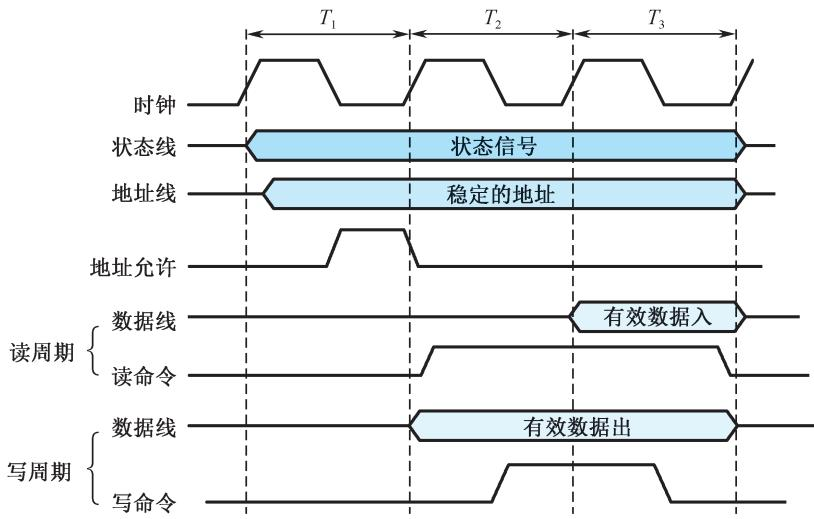
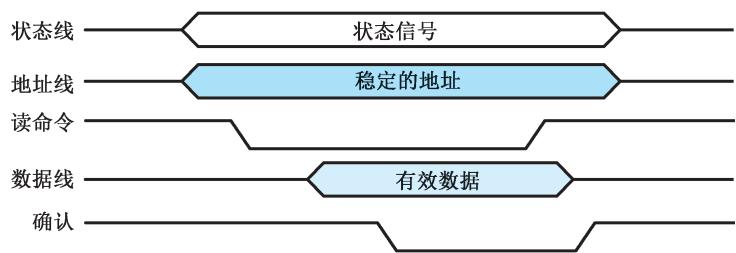
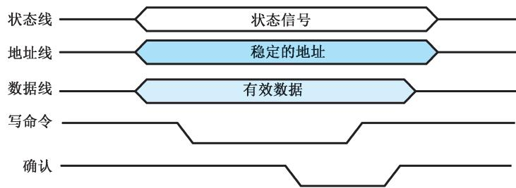
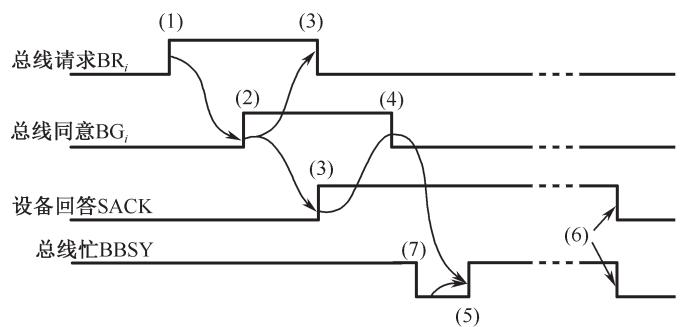
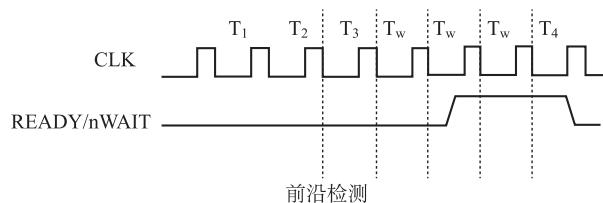
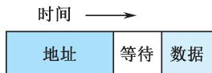
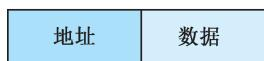
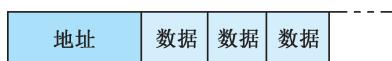
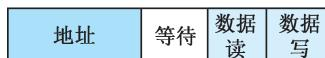
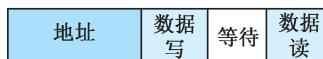

# 6.4 总线的定时和数据传送模式

## 基本信息
- **课程**：计算机组成原理
- **章节**：第6章 6.4节 总线的定时和数据传送模式
- **日期**：2026-06-16
- **标签**：#总线定时 #同步定时 #异步定时 #半同步 #周期分裂 #数据传送模式

---

## 重点内容

### ⭐⭐⭐ 核心考点
1. **同步定时 vs 异步定时** - 时钟驱动 vs 应答驱动；周期固定 vs 可变
2. **半同步定时** - READY/nWAIT信号插入等待周期
3. **周期分裂式定时** - 分离子周期，中间释放总线
4. **四种数据传送模式** - 读/写、块传送、读修改写、广播/广集

### ⭐⭐ 重要概念
- 总线信息传送五个阶段（请求→仲裁→寻址→传送→状态返回）
- 异步定时的读/写周期时序（应答式互锁机制）
- 四种定时方式的适用场景对比

---

## 详细笔记

### 6.4.1 总线的一次信息传送过程

五个阶段：
1. 请求总线
2. 总线仲裁
3. 寻址（目的地址）
4. 信息传送
5. 状态返回（或错误报告）

### 6.4.2 同步总线定时协定

#### 📷 图6.12 同步总线操作时序

> 📚 **课本出处**：图6.12 同步定时中所有事件出现在时钟信号的前沿

**特点**：
- 事件出现在总线上的时刻由总线时钟信号确定
- 总线中包含时钟信号线
- 一次I/O传送称为一个时钟周期或总线周期
- 大多数事件只占据单一时钟周期

**适用条件**：
- 总线长度较短
- 各功能模块存取时间比较接近

**缺点**：必须按最慢的模块设计公共时钟，当各模块存取时间相差大时会损失效率

**同步读周期**：
1. CPU将地址放到地址线上，发出启动信号
2. 第2个时钟周期发出读命令
3. 存储器经一个时钟周期延迟后将数据放到总线上

**同步写周期**：
1. CPU将数据放到数据线上
2. 第2个时钟周期发出写命令
3. 存储器在第3个时钟周期存入数据

### 6.4.3 异步总线定时协定

#### 📷 图6.13 异步总线操作时序

**（a）系统总线读周期** — CPU发地址+读命令，内存准备数据后用确认信号回应

**（b）系统总线写周期** — CPU同时发地址+数据，内存写入后用确认信号回应

> 📚 **课本出处**：图6.13 异步定时建立在应答式或互锁机制基础上

**特点**：
- 后一事件出现时刻取决于前一事件的出现时刻
- 建立在应答式或互锁机制基础上
- 不需要统一的公共时钟信号
- 总线周期的长度是可变的

**读周期过程**：
1. CPU发送地址和读状态信号
2. 信号稳定后发出读命令
3. 存储器译码并将数据放到数据线上
4. 数据稳定后存储器使确认线有效
5. CPU读取数据后撤销读状态信号
6. 存储器撤销数据和确认信号

**写周期过程**：
1. CPU将数据放到数据线上，启动状态线和地址线
2. 存储器接受写命令写入数据
3. 存储器使确认线有效
4. CPU撤销写命令
5. 存储器撤销确认信号

**优点**：总线周期长度可变，快速和慢速模块都能连接到同一总线上

**缺点**：增加总线的复杂性和成本

### 6.4.4 例题：二维总线仲裁时序分析

> **例6.3**：某CPU采用集中式仲裁方式，使用独立请求与菊花链查询相结合的**二维总线控制结构**。每一对 BRᵢ 和 BGᵢ 组成一对菊花链查询电路，每一根请求线可被若干个传输速率接近的设备共享。

#### 📷 图6.14 某CPU总线仲裁时序图

> 📚 **课本出处**：图6.14 二维总线仲裁时序图

**解答**：该总线采用**异步定时协议**，时序过程如下：

| 步骤 | 信号变化 | 说明 |
|:----:|:---------|:-----|
| ① | BRᵢ 上升 | 设备发出总线请求 |
| ② | BGᵢ 上升 | CPU按优先级授权，给出 BG 信号 |
| ③ | SACK 上升 | 设备收到 BG 后上升 SACK 确认 |
| ④ | BGᵢ 下降 | CPU收到SACK后下降BG作为回答 |
| ⑤ | BBSY 上升 | 设备上升BBSY，获得总线控制权 |
| ⑥ | BBSY + SACK 下降 | 设备用完总线，释放 |
| ⑦ | BBSY 下降 | 现行主设备释放后，新主设备才能上升BBSY |

**关键点**：如果当前有设备正在使用总线（BBSY=1），新的主设备必须等当前传送结束（BBSY下降）后才能获得控制权。

### 6.4.5 半同步总线定时协定

⭐⭐⭐ **核心思想**：在同步定时基础上增加一根 READY（或 nWAIT）信号线，让慢设备可以"申请等待"。

#### 📷 图6.15 半同步总线操作时序

> 📚 **课本出处**：图6.15 半同步总线在T₃前沿检测READY信号，无效则插入等待周期T_w

**工作原理**：
- 基本周期仍由 T₁~T₄ 四个时钟周期构成（同步方式）
- 在 T₃ 前沿检测 READY 信号：
  - READY 有效 → 正常进入 T₄
  - READY 无效 → 在 T₃ 和 T₄ 之间**插入等待周期 T_w**，直到 READY 有效才进入 T₄

**特点**：
- 整体仍以时钟驱动（同步）
- 慢设备可通过 READY 信号延长周期（有异步的灵活性）
- 兼顾同步的简单性和异步的适应性

**现代总线大多已扩展为半同步总线。**

### 6.4.6 周期分裂式总线定时协定

⭐⭐ **核心思想**：把一个读周期拆成**两个子周期**，中间释放总线供其他设备使用。

**工作原理**（以读操作为例）：

| 子周期 | 谁操作 | 内容 |
|:-------|:-------|:-----|
| 第一个子周期 | 主方（CPU） | 发送地址和读命令，然后**立即释放总线** |
| （空闲） | 其他设备 | 主方准备数据期间，总线可被其他设备使用 |
| 第二个子周期 | 从方（存储器） | 重新申请总线，将数据通过总线发回主方 |

**优点**：总线利用率高，准备数据期间不占用总线

**缺点**：硬件复杂度增加（读数据的双方都要成为总线主方）

### 6.4.7 四种定时方式对比

| 比较项 | 同步 | 异步 | 半同步 | 周期分裂 |
|:-------|:-----|:-----|:-------|:---------|
| 时钟信号 | ✅ 需要 | ❌ 不需要 | ✅ 需要 | ✅ 需要 |
| 总线周期 | 固定 | 可变 | 可变（可插入T_w） | 可变（中间释放总线） |
| 控制方式 | 时钟边沿 | 应答/互锁 | 时钟+READY信号 | 两次申请总线 |
| 复杂性 | 简单 | 较复杂 | 适中 | 最复杂 |
| 总线利用率 | 受最慢模块限制 | 较高 | 较高 | **最高** |
| 适用场景 | 模块速度相近 | 模块速度差异大 | 大部分快、少数慢 | 高性能系统 |

### 6.4.8 总线数据传送模式

#### 📷 图6.16 总线数据传送模式

**（a）读操作** — 从方到主方的数据传送

**（b）写操作** — 主方到从方的数据传送

**（c）成块数据传送** — 只给起始地址，连续读写多个数据

**（d）读-修改-写操作** — 同一地址先读后写，原子操作

**（e）写后读操作** — 同一地址先写后读，用于校验

> 📚 **课本出处**：图6.16 总线数据传送模式

当代总线标准支持的数据传送模式：

| 模式 | 说明 |
|:-----|:-----|
| **读/写操作** | 主方与从方之间的基本数据传送 |
| **块传送操作** | 猝发式传送，只需给出起始地址，连续读写多个数据 |
| **写后读、读修改写操作** | 原子操作，总线业务不可分割（配合LOCK#信号） |
| **广播、广集操作** | 主方向多个从方同时写（广播）；多个从方同时读（广集） |

## 疑问与思考

1. 为什么异步定时适合连接速度差异大的设备，而同步定时不适合？
2. 总线数据传送模式中，块传送为什么能提高效率？

## 相关链接

- [第6章-6.3-总线仲裁](第6章-6.3-总线仲裁.md)
- [第6章-6.5-PCI总线和PCIe总线](第6章-6.5-PCI总线和PCIe总线.md)
