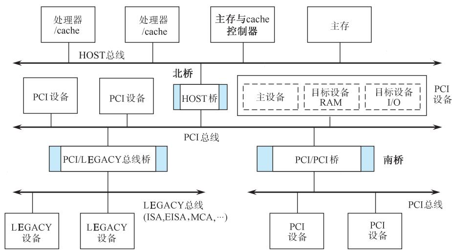
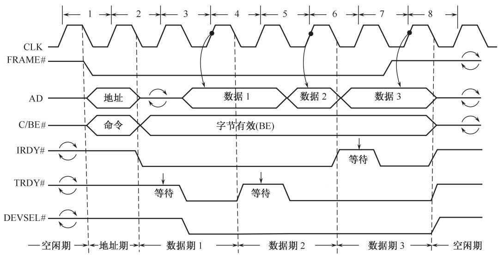
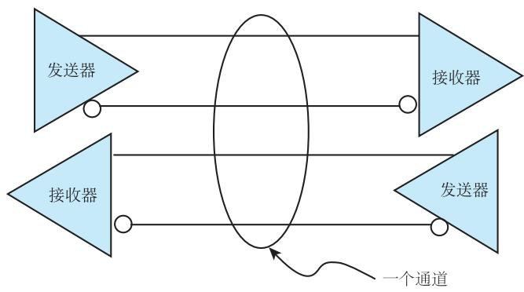
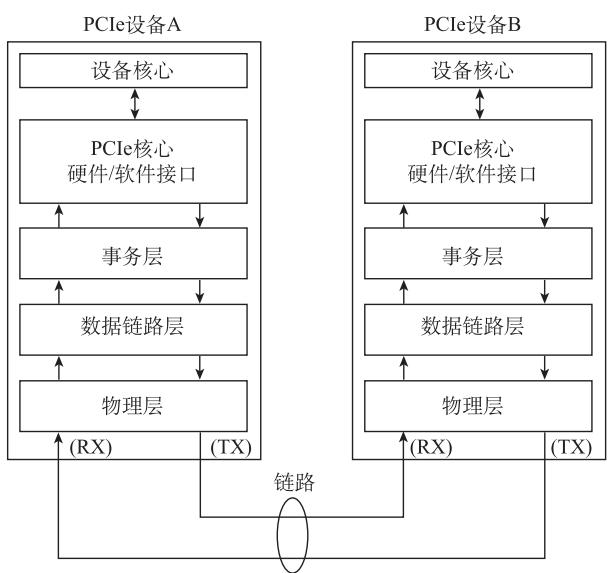
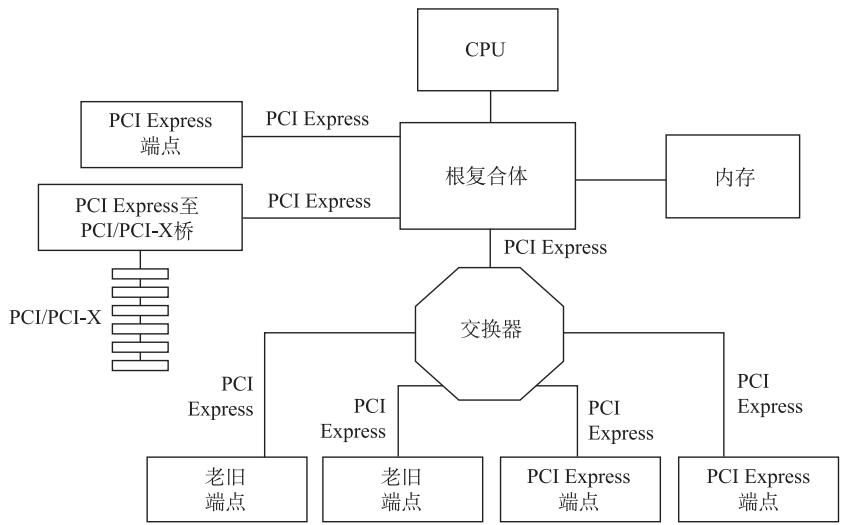

# 6.5 PCI总线和PCIe总线

## 基本信息
- **课程**：计算机组成原理
- **章节**：第6章 6.5节 PCI总线和PCIe总线
- **日期**：2026-06-16
- **标签**：#PCI #PCIe #总线标准 #多总线结构 #猝发式传送

---

## 重点内容

### ⭐⭐⭐ 核心考点
1. **PCI总线特点** - 高带宽、与处理器无关、同步定时、集中式仲裁、自动配置
2. **PCIe改进** - 高速差分传输、串行传输、全双工端到端、多通道、基于数据包
3. **猝发式传送** - PCI基本传输机制，只需一个地址期+多个数据期

### ⭐⭐ 重要概念
- 主板总线三种总线（HOST、PCI、LEGACY）
- PCI总线信号（必备信号与可选信号）
- PCI总线命令（中断响应、特殊周期、I/O读写等）
- 隐藏式仲裁机制
- PCIe总线拓扑结构

---

## 详细笔记

### 6.5.1 主板总线的多总线结构

#### 📷 图6.17 多总线结构框图

> 📚 **课本出处**：图6.17 PC机和服务器的主板总线经典结构

**三种总线**：

| 总线 | 说明 |
|:-----|:-----|
| **HOST总线** | 连接北桥芯片与CPU，64位数据线+32位地址线，支持4GB寻址 |
| **PCI总线** | 连接高速PCI设备，与处理器无关的层间总线 |
| **LEGACY总线** | ISA/EISA/MCA等传统总线，支持中低速I/O设备 |

**桥的作用**：
- 连接两条总线，使彼此通信
- 总线转换：把一条总线的地址空间映射到另一条
- 实现总线间的猝发式传送（延迟写、预读）

### 6.5.2 PCI总线信号

**PCI 2.0版必备信号**（表6.1）：

| 信号 | 类型 | 功能 |
|:-----|:-----|:-----|
| CLK | in | 总线时钟，33.3MHz方波 |
| RST# | in | 复位信号 |
| AD[31-0] | t/s | 地址和数据复用线 |
| C/BE#[3-0] | t/s | 总线命令和字节有效复用线 |
| PAR | t/s | 奇偶校验位 |
| FRAME# | s/t/s | 帧信号，指示总线业务开始 |
| IRDY# | s/t/s | 主方就绪信号 |
| TRDY# | s/t/s | 目标方就绪信号 |
| STOP# | s/t/s | 目标方要求中止 |
| LOCK# | s/t/s | 锁定信号，业务不可分割 |
| DEVSEL# | s/t/s | 设备选择信号 |
| REQ# | t/s | 总线请求信号 |
| GNT# | t/s | 总线授权信号 |

**信号类型说明**：
- `#`：低电平有效
- `in`：输入线
- `out`：输出线
- `t/s`：双向三态信号线
- `s/t/s`：一次只被一个拥有者驱动的抑制三态信号线
- `o/d`：开路驱动，允许多个设备以线或方式共享

### 6.5.3 PCI总线周期类型

4位命令代码C/BE#[3:0]，共12种命令：

| 代码 | 命令类型 |
|:-----|:---------|
| 0000 | 中断确认周期 |
| 0010 | I/O读周期 |
| 0011 | I/O写周期 |
| 0110 | 存储器读周期 |
| 0111 | 存储器写周期 |
| 1010 | 配置读周期 |
| 1011 | 配置写周期 |
| 1100 | 存储器多重读周期 |
| 1110 | 存储器读行周期 |
| 1111 | 存储器写和使无效周期 |

**三种存储器读命令区别**：

| 读命令 | 有cache | 无cache |
|:-------|:--------|:--------|
| 存储器读 | 读cache行的一半或更少 | 读1~2个存储字 |
| 存储器读行 | 猝发0.5~3个cache行 | 猝发3~12个存储字 |
| 存储器多重读 | 猝发>3个cache行 | 猝发>12个存储字 |

**特殊周期**：主设备将信息广播到多个目标方，不需要DEVSEL#响应。

**配置读/写周期**：PCI自动配置能力的体现。配置空间256个内部寄存器，保存系统初始化配置参数。

### 6.5.4 PCI总线周期操作

#### 📷 图6.18 读操作总线周期时序示例

> 📚 **课本出处**：图6.18 PCI总线读周期时序，展示了同步时序协议的操作过程

**PCI总线周期操作特点**：

1. **同步时序协议**：事件出现在时钟下跳沿，采样在上跳沿
2. **FRAME#启动**：帧信号有效指示总线周期开始
3. **地址期+数据期**：一个地址期和一个或多个数据期
4. **挂钩信号**：IRDY#和TRDY#都有效时完成一次数据传送
5. **猝发式传送**：总线周期长度由主方确定，无固定猝发长度限制
6. **目标方确认**：目标方延迟一个时钟后以DEVSEL#响应
7. **主方结束**：FRAME#无效后IRDY#也无效时周期结束

### 6.5.5 PCI总线仲裁

**集中式仲裁**：每个主设备有独立的REQ#和GNT#信号线。

**隐藏式仲裁**：
- 在当前总线占用期间裁决下一次总线主方
- 不需要单独的仲裁总线周期
- GNT#切换至少有1个时钟周期延迟（交换期）
- 16个时钟周期内不开始新周期视为"死设备"

### 6.5.6 PCIe总线

相比PCI的主要改进：

| 改进点 | PCI | PCIe |
|:-------|:----|:-----|
| 信号传输 | 单端对地 | 高速差分传输（D+/D-） |
| 传输方式 | 并行 | 串行 |
| 连接方式 | 共享总线 | 全双工端到端 |
| 通道数 | 固定 | x1/x2/x4/x8/x16/x32 |
| 数据单位 | 直接传输 | 基于数据包 |
| 时钟 | 单独传输 | 嵌入时钟（8b/10b或128b/130b编码） |

#### 📷 图6.19 PCIe总线通道的物理结构

> 📚 **课本出处**：图6.19 PCIe通道由两组差分信号组成，支持全双工通信

#### 📷 图6.20 PCIe总线的体系结构

> 📚 **课本出处**：图6.20 PCIe体系结构从上到下包括应用层、事务层、数据链路层和物理层

#### 📷 图6.21 PCIe总线的拓扑结构实例

> 📚 **课本出处**：图6.21 PCIe总线上包括根复合体、交换器、PCIe桥和端点四类实体

**PCIe四类实体**：

| 实体 | 说明 |
|:-----|:-----|
| 根复合体(root complex) | PCIe根控制器，连接处理器/内存子系统到交换结构 |
| 交换器(switch) | 扩展PCIe总线，连接多个PCIe设备 |
| PCIe桥 | PCIe与其他总线之间的转换 |
| 端点(endpoint) | 基于PCIe总线的设备（网卡、存储卡等） |

**PCIe高级特征**：电源管理、服务质量(QoS)、热插拔、数据完整性、错误处理。

## 疑问与思考

1. 为什么PCIe采用串行传输反而比PCI的并行传输速度更高？
2. PCI的隐藏式仲裁如何提高总线利用率？

## 相关链接

- [第6章-6.4-总线的定时和数据传送模式](第6章-6.4-总线的定时和数据传送模式.md)
- [第6章-6.6-鲲鹏处理器的总线与互联](第6章-6.6-鲲鹏处理器的总线与互联.md)
