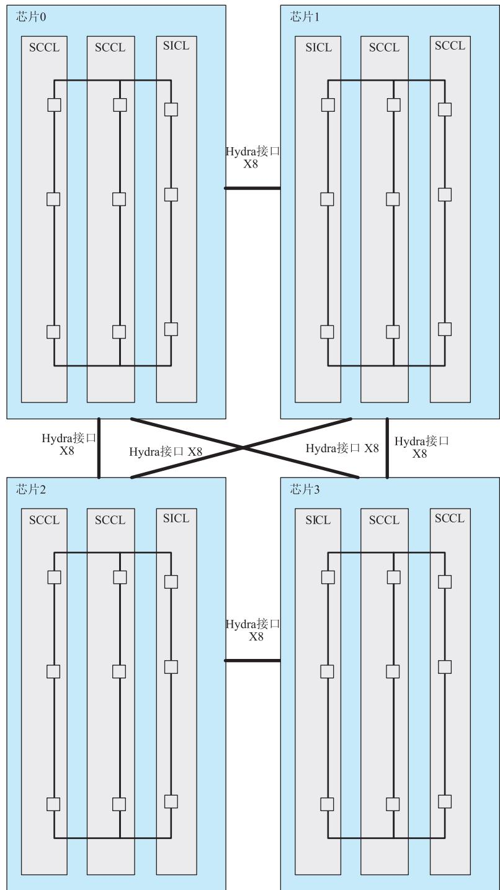

# 6.6 鲲鹏处理器的总线与互联

## 基本信息
- **课程**：计算机组成原理
- **章节**：第6章 6.6节 鲲鹏处理器的总线与互联
- **日期**：2026-06-16
- **标签**：#鲲鹏处理器 #片上网络 #环总线 #Hydra接口 #多芯片系统

---

## 重点内容

### ⭐⭐⭐ 核心考点
1. **CoWoS封装技术** - 多晶片合封，"乐高架构"组合灵活
2. **片上网络组成** - 环总线、SLLC、调度器、分发器
3. **Hydra接口** - 华为私有高性能片间接口，支持多芯片数据一致性

### ⭐⭐ 重要概念
- 鲲鹏920系统的部件互联结构
- 互联网络三个层次（超级集群内→超级集群间→片上系统间）
- 多芯片系统结构（4个片上系统组成4P服务器）

---

## 详细笔记

### 6.6.1 鲲鹏920系统的部件互联

鲲鹏920处理器片上系统采用业界领先的**CoWoS封装技术**（Chip on Wafer on Substrate），实现多晶片(die)合封。

**CoWoS优势**：
- 提升器件生产制造良率
- 有效控制每个晶片面积
- 降低整体成本
- "乐高架构"组合方式灵活
- 可伸缩性极强

#### 📷 图6.22 鲲鹏处理器计算子系统的逻辑框架

> 📚 **课本出处**：图6.22 展示了鲲鹏处理器互联系统的拓扑结构，超级集群内通过环总线互联互通

**互联网络层次**：

| 层次 | 互联方式 | 说明 |
|:-----|:---------|:-----|
| 超级集群内 | 环总线(ring bus) | 各子系统互联互通 |
| 超级集群间 | SLLC | 超级集群链路层连接器 |
| 片上系统间 | Hydra接口 | 多片片上系统互联 |

**片上网络组成部件**：

| 部件 | 全称 | 功能 |
|:-----|:-----|:-----|
| **环总线** | Ring Bus | 片上系统内部连接各设备，通过交叉站(CS)节点互联 |
| **SLLC** | Super Cluster Link Layer Connector | 连接多个超级集群的环总线通路 |
| **调度器** | Scheduler | 将I/O集群内设备访问请求有序传递至系统 |
| **分发器** | Dispatch | 将环总线收到的请求分发至正确设备 |
| **Hydra接口** | - | 华为私有高性能片间扩展接口 |
| **映射与译码** | Mapping and Decode | 识别访问目的地，产生目标标识(TgtID) |

#### 1. 环总线

- 通过多个**交叉站(CS)**节点互联而成
- 保证数据通路无传输错误
- 系统上电后**无须配置即可工作**

#### 2. SLLC（超级集群链路层连接器）

- 将一个超级集群的环总线数据路由至另一个超级集群
- 超级集群内部流量 > 集群间流量
- SLLC最高带宽 < 环总线最高带宽
- 需将数据分组打包并压缩后传输

#### 3. 调度器

- 对I/O集群内多个设备访问请求进行传输调度
- 汇聚传输流量
- 通过SMMU接入环总线交叉站
- 可调整服务质量(QoS)、限制设备流量

#### 4. 分发器

- 将环总线收到的访问请求分发至正确设备
- 通过内部数据缓冲器平滑高速与低速设备间速率差异

#### 5. Hydra接口

- 华为私有高性能接口
- 支持多片鲲鹏处理器片上系统在单一电路板上集成
- 实现多芯片间**数据一致性高效互联互通**
- 采用高速SERDES通道实现片间互联
- 高带宽、低延时

### 6.6.2 鲲鹏多芯片系统

#### 📷 图6.23 4个鲲鹏处理器片上系统组成的多芯片系统结构

> 📚 **课本出处**：图6.23 标准4P服务器处理器多芯片系统结构

**结构特点**：
- 4个处理器片上系统组成标准4P服务器
- 每个单片系统由**两个超级内核集群(SCCL)**和**一个超级I/O集群(SICL)**组成
- 四个单片系统间通过 **x8 Hydra** 片间cache一致性接口互联
- **片间通信带宽可达240Gbit/s**

## 疑问与思考

1. 环总线为什么上电后无需配置即可工作？这对系统可靠性有什么意义？
2. SLLC为什么需要将数据分组打包压缩后才传输？

## 相关链接

- [第6章-6.5-PCI总线和PCIe总线](第6章-6.5-PCI总线和PCIe总线.md)
- [第6章-总线系统](第6章-总线系统.md)
