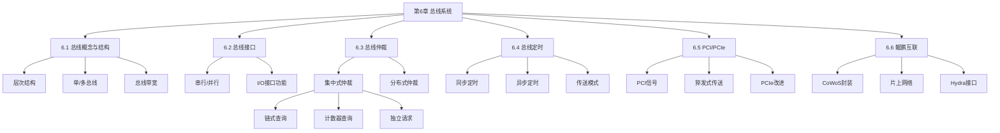

# 第6章 总线系统

## 基本信息
- **课程**：计算机组成原理
- **章节**：第6章 总线系统
- **日期**：2026-06-16
- **标签**：#总线 #系统总线 #PCI #PCIe #总线仲裁 #总线定时

## 章节结构

本章讲述总线系统的一些基本概念和基本技术，在此基础上具体介绍当前实用的PCI总线和PCIe总线，以及鲲鹏处理器的总线与互联。

### 小节笔记

| 小节 | 标题 | 核心内容 |
|:----:|:-----|:---------|
| 6.1 | [总线的概念和结构形态](第6章-6.1-总线的概念和结构形态.md) | 总线定义、层次结构、特性、标准化、连接方式、内部结构 |
| 6.2 | [总线接口](第6章-6.2-总线接口.md) | 串行/并行传送、I/O接口四大功能 |
| 6.3 | [总线仲裁](第6章-6.3-总线仲裁.md) | 集中式仲裁（链式/计数器/独立请求）、分布式仲裁 |
| 6.4 | [总线的定时和数据传送模式](第6章-6.4-总线的定时和数据传送模式.md) | 同步/异步定时、数据传送模式 |
| 6.5 | [PCI总线和PCIe总线](第6章-6.5-PCI总线和PCIe总线.md) | PCI信号、周期类型、猝发式传送、PCIe改进 |
| 6.6 | [鲲鹏处理器的总线与互联](第6章-6.6-鲲鹏处理器的总线与互联.md) | CoWoS封装、片上网络、环总线、Hydra接口 |

## 知识框架

## 重点与难点

### 核心概念

1. **总线带宽**：$D_r = D \times f$
2. **单总线 vs 多总线**：单总线简单但效率受限；多总线提高吞吐量
3. **三种集中式仲裁**：链式查询（用线少、故障敏感）、计数器查询（灵活）、独立请求（速度快、最灵活）
4. **同步 vs 异步定时**：同步周期固定、适用短总线；异步周期可变、适用速度差异大的设备
5. **PCI特点**：高带宽、与处理器无关、猝发式传送、隐藏式仲裁
6. **PCIe改进**：差分传输、串行、全双工、多通道、基于数据包

### 关键公式

- **总线带宽**：$D_r = D \times f$

## 相关链接

- [总结-第6章-总线系统](../../总结复习/总结-第6章-总线系统.md)
