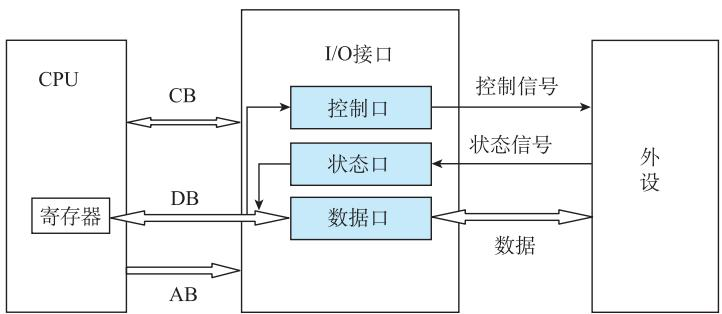
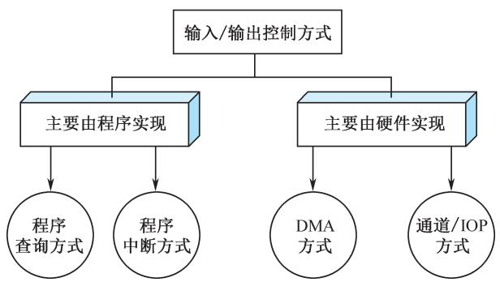

# 第8章-8.1 CPU与外设之间的信息交换方式

## 基本信息
- **课程**：计算机组成原理
- **章节**：第8章 输入/输出系统 - 8.1 CPU与外设之间的信息交换方式
- **日期**：2026-06-20
- **标签**：#输入输出系统 #I/O接口 #数据传送方式

## 重点内容

### ⭐⭐⭐ 核心考点
1. **I/O系统的核心问题** - 主机与外设的速度匹配与同步
2. **五种CPU管理外设的方式** - 无条件传送、程序查询、程序中断、DMA、通道和IOP
3. **I/O接口的编址方式** - 统一编址 vs 独立编址

### ⭐⭐ 重要概念
- CPU输入/输出操作的两个传输阶段
- 端口（port）的概念：命令端口、状态端口、数据端口
- I/O接口与外设间的数据传送方式（串行/并行）

---

## 详细笔记

### 8.1.1 I/O系统的地位和作用

计算机系统的第三类关键部件是I/O逻辑模块。系统的综合处理能力、可扩展性、兼容性和性能价格比都与I/O系统密切相关。

CPU的输入/输出操作分为两个传输阶段：
1. **I/O接口与外设间的数据传送**
2. **CPU与I/O接口之间的数据传送**

#### 📷 图8.1 CPU与外设的连接

> 📚 **课本出处**：图8.1 展示了CPU通过I/O接口与外设连接的两个传输阶段

---

### 8.1.2 输入/输出接口与端口

#### 1. 接口的功能

I/O接口是由半导体介质构成的逻辑电路，作为转换器，保证外部设备用计算机系统特性所要求的形式发送或接收信息。

#### 2. 端口的概念

接口内可以被CPU直接访问的寄存器称为**端口（port）**：

| 端口类型 | 名称 | 功能 |
|:--------|:-----|:-----|
| 命令端口 | 命令口 | 接收来自CPU的控制命令 |
| 状态端口 | 状态口 | 向CPU报告I/O设备的工作状态 |
| 数据端口 | 数据口 | 在外设和总线间交换数据的缓冲寄存器 |

#### 3. 端口编址方式

| 编址方式 | 特点 | 优点 | 缺点 |
|:--------|:-----|:-----|:-----|
| **统一编址** | I/O端口和内存单元联合编排地址 | 可用访存指令访问I/O，无需专门I/O指令 | 占用内存地址空间 |
| **独立编址** | 内存地址和I/O地址分开 | 不占用内存地址空间，程序清晰 | 需要专门的I/O指令组 |

---

### 8.1.3 输入/输出操作的一般过程

#### 输入过程
1. CPU把地址值放在地址总线上，选择输入设备
2. CPU等候输入设备的数据成为有效
3. CPU从数据总线读入数据，放入相应寄存器

#### 输出过程
1. CPU把地址值放在地址总线上，选择输出设备
2. CPU把数据放在数据总线上
3. 输出设备认为数据有效，将数据取走

#### ⚠️ 核心问题：外围设备的定时问题

高速处理器与不同速度的外设相连接，如何保证时间上同步？

#### 📌 例8.1 I/O对系统性能的影响

假设基准程序运行100s，其中90s是CPU时间，10s是I/O时间。若CPU速度每年提高50%，I/O时间不变：

| 第n年 | CPU时间/s | I/O时间/s | 总时间/s | I/O占比 |
|:-----:|:---------:|:---------:|:--------:|:-------:|
| 0 | 90 | 10 | 100 | 10% |
| 1 | 60 | 10 | 70 | 14% |
| 2 | 40 | 10 | 50 | 20% |
| 3 | 27 | 10 | 37 | 27% |
| 4 | 18 | 10 | 28 | 36% |
| 5 | 12 | 10 | 22 | 45% |

💡 **结论**：即使CPU速度大幅提升，I/O时间不变会使I/O占比越来越高，成为系统性能瓶颈。

---

### 8.1.4 I/O接口与外设间的数据传送方式

根据外设工作速度的不同，有三种传送方式：

#### 1. 无条件传送方式（零线握手）
- **适用**：速度极慢或简单的外围设备（机械开关、LED等）
- **特点**：外设无须准备操作，数据一直有效
- **硬件**：只需数据信号线，无须握手联络信号线

#### 2. 应答方式（异步传送方式）
- **适用**：慢速或中速的外围设备（键盘等）
- **特点**：采用异步定时方式，设置握手信号线
- **典型**：双线握手（选通信号 + 应答信号）

#### 3. 同步传送方式
- **适用**：高速外围设备（同步通信线路等）
- **特点**：按确定时钟速率交换信息，靠时钟脉冲控制

---

### 8.1.5 CPU与I/O接口之间的数据传送方式

#### 📷 图8.2 外围设备的输入/输出控制方式

> 📚 **课本出处**：图8.2 展示了程序查询、中断、DMA、通道、IOP五种I/O控制方式的关系和适用场景

#### 1. 无条件传送方式（简单I/O方式）
- 假设外设始终处于就绪状态
- CPU直接执行I/O指令进行数据传输
- 适用于简单外设

#### 2. 程序查询（轮询）方式
- CPU通过接口查询外设状态
- 外设未准备好时，CPU不断查询并等待
- **优点**：软硬件结构简单，操作同步
- **缺点**：CPU消耗大量时间等待，效率低
- **适用**：低速外设或CPU任务不繁忙的情况

#### 3. 程序中断方式
- 外设"主动"通知CPU
- CPU暂停现行程序，转向中断处理程序
- **优点**：节省CPU时间，适用于随机服务请求
- **缺点**：硬件结构复杂，服务开销时间较大

#### 4. DMA方式（直接内存访问）
- 完全由硬件执行I/O交换
- DMA控制器接管总线，数据直接在内存和外设间传送
- **优点**：速度快，省去CPU参与
- **适用**：高速、成批数据传送

#### 5. 通道和IOP方式
- **通道**：具有特殊功能的简化版处理器，有专用指令和程序
- **IOP（输入输出处理器）**：与CPU并行工作，提供高速DMA能力
- **PPU（外围处理器）**：基本独立于主机工作

---

### 8.1.6 五种I/O方式对比

| 方式 | 数据传输控制 | CPU参与度 | 速度 | 适用场景 |
|:-----|:------------|:---------|:-----|:---------|
| 无条件传送 | 硬件 | 直接读写 | 极低 | 简单设备 |
| 程序查询 | 软件程序 | 主动轮询 | 低 | 低速设备 |
| 程序中断 | 软件+硬件 | 响应中断 | 中 | 随机服务请求 |
| DMA | 硬件 | 不参与传送 | 高 | 高速批量数据 |
| 通道/IOP | 专用处理器 | 仅启动/结束 | 很高 | 复杂I/O管理 |

---

## 疑问与思考

1. 为什么I/O系统会成为整个计算机系统的性能瓶颈？
2. 统一编址和独立编址在实际系统中哪种更常见？
3. DMA方式为什么能比中断方式更快？

## 相关链接

- 上一章：[第7章-存储系统](../第7章-存储系统/第7章-存储系统.md)
- 下一节：[第8章-8.2-程序查询方式](./第8章-8.2-程序查询方式.md)
- 课本插图：
  - [图8.1 CPU与外设的连接](#📷-图81-cpu与外设的连接)
  - [图8.2 外围设备的输入/输出控制方式](#📷-图82-外围设备的输入输出控制方式)
