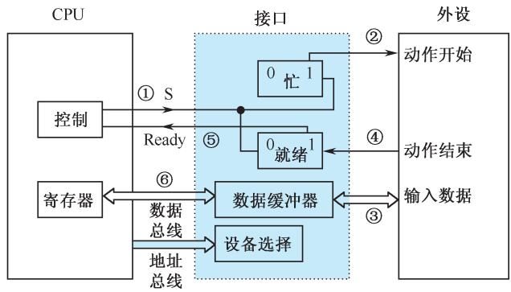
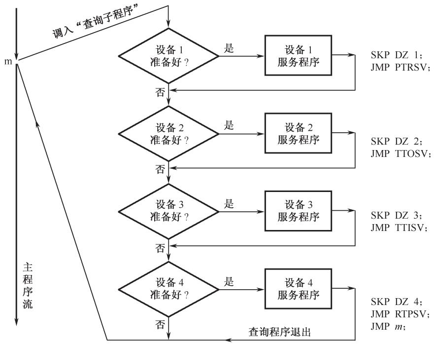

# 第8章-8.2 程序查询方式

## 基本信息
- **课程**：计算机组成原理
- **章节**：第8章 输入/输出系统 - 8.2 程序查询方式
- **日期**：2026-06-20
- **标签**：#输入输出系统 #程序查询方式 #轮询

## 重点内容

⭐⭐⭐ 程序查询方式的工作原理和接口结构

⭐⭐⭐ 程序查询方式的优缺点：简单但CPU效率低

⭐ I/O指令格式和功能

## 详细笔记

### 一、程序查询方式概述

程序查询方式又称为**程序控制I/O方式**，是在CPU主动控制下进行数据传送的方式。

**特点**：
- 最简单、最经济的输入/输出方式
- 只需要很少的硬件
- CPU定期执行设备服务程序，主动了解设备状态

**工作过程**：
1. CPU暂停执行主程序
2. 转去执行设备输入/输出的服务程序
3. 根据服务程序中的I/O指令进行数据传送

---

### 二、输入/输出指令

I/O指令一般具有三种功能：
1. **置位/复位控制触发器**：控制设备的启动、关闭等动作
2. **测试设备状态**：检查"忙""准备就绪"等状态标志
3. **传送数据**：输入时将接口数据送CPU寄存器，输出时反之

#### I/O指令格式示例

| 位 | 0~1 | 2~4 | 5~7 | 8~9 | 10~15 |
|:--:|:---:|:---:|:---:|:---:|:-----:|
| 含义 | 01（I/O指令） | R0~R7 | OP | 控制 | DMs |

- **OP**：操作码，指定8种I/O操作类型
- **DMs**：64个外部设备的设备地址
- **控制**：启动(S)、关闭(C)等功能
- **R0~R7**：CPU中的8个通用寄存器

#### 指令示例

| 汇编指令 | 含义 |
|:--------|:-----|
| `DOAS 2,13` | 将R2内容输出到13号设备的A数据缓冲寄存器，同时启动设备 |
| `DICC 3,12` | 将12号设备C寄存器的数据送入R3，并关闭设备 |
| `SKP` | 测试跳步指令：测试外设状态标志，为1则顺序执行，为0则跳过下一条 |

---

### 三、程序查询方式的接口

#### 📷 图8.3 程序查询方式接口示意图

> 📚 **课本出处**：图8.3 展示了程序查询方式接口的组成部分

#### 接口电路组成

| 部件 | 功能 |
|:-----|:-----|
| **设备选择电路** | 判别地址总线上呼叫的是否为本设备，是设备地址译码器 |
| **数据缓冲寄存器** | 输入时存放从外设读出的数据；输出时存放CPU送来的数据 |
| **设备状态标志** | "忙""准备就绪""错误"等标志触发器，供CPU查询分析 |

---

### 四、程序查询输入/输出方式

#### 数据传送步骤

1. 向I/O设备发出命令字，请求数据传送
2. 从I/O接口读入状态字
3. 检查状态字中的标志，判断是否可以进行数据交换
4. 若设备未就绪，重复步骤2~3，直到设备发出"Ready"信号
5. CPU从接口数据缓冲寄存器输入/输出数据，同时将状态标志复位

#### 📷 图8.4 程序查询I/O设备流程图

> 📚 **课本出处**：图8.4 展示了典型的程序查询流程和汇编查询程序

#### 查询程序改进

实际应用中，CPU在执行主程序过程中周期性地调用各外部设备询问子程序：
- 依次测试各I/O设备的"Ready"触发器
- 若Ready为"1"，转去执行该设备的服务子程序
- 若Ready为"0"，依次测试下一个设备

**查询次序原则**：先询问数据传输率高的设备，后询问数据传输率低的设备。

---

### 五、程序查询方式的优缺点

| 优点 | 缺点 |
|:-----|:-----|
| 软硬件结构简单 | CPU大量时间消耗在查询循环中 |
| CPU与外设操作同步 | 即使采用轮询(polling)，CPU时间消耗也客观 |
| 经济实用 | 只适用于低速外设或CPU任务不繁忙的情况 |

---

## 疑问与思考

1. 程序查询方式是否适合在大型计算机中使用？
2. SKP指令在查询程序中起什么作用？
3. 为什么查询次序要按照数据传输率从高到低排列？

## 相关链接

- 上一节：[第8章-8.1-CPU与外设之间的信息交换方式](./第8章-8.1-CPU与外设之间的信息交换方式.md)
- 下一节：[第8章-8.3-程序中断方式](./第8章-8.3-程序中断方式.md)
- 课本插图：
  - [图8.3 程序查询方式接口示意图](#📷-图83-程序查询方式接口示意图)
  - [图8.4 程序查询I/O设备流程图](#📷-图84-程序查询io设备流程图)
