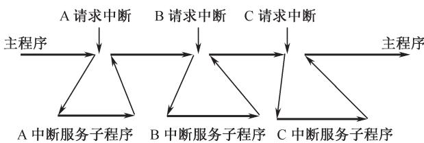
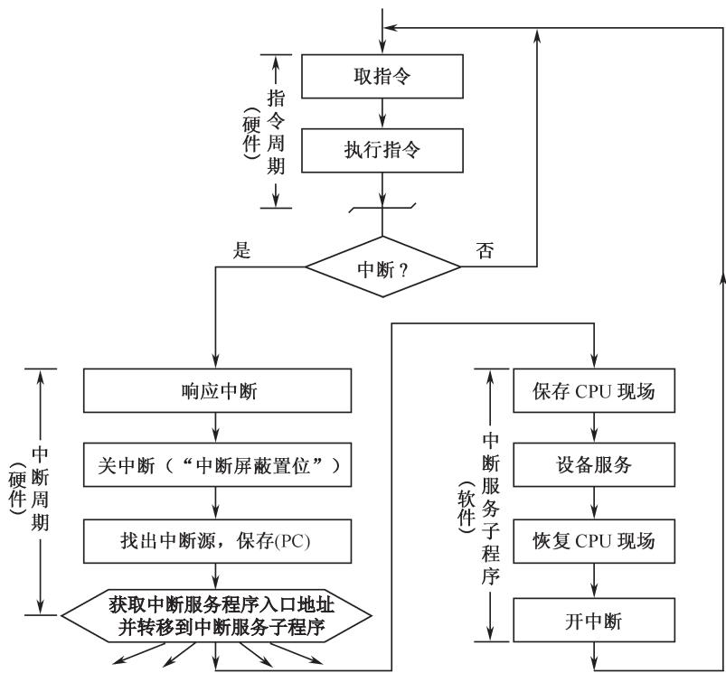
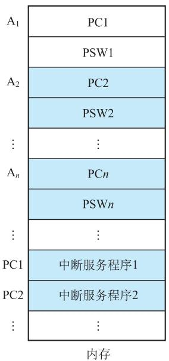
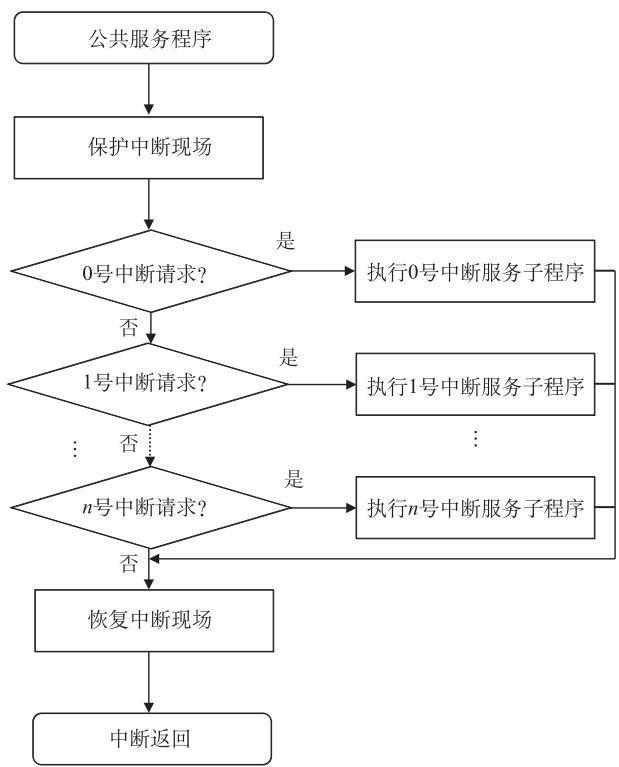
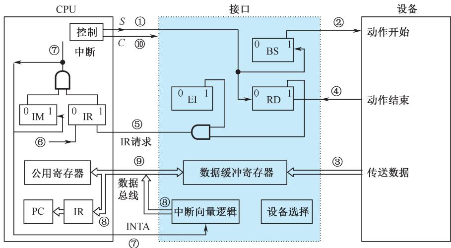
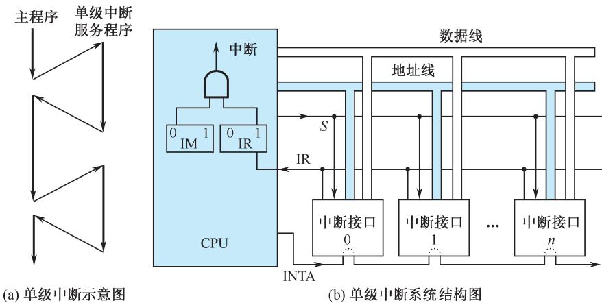
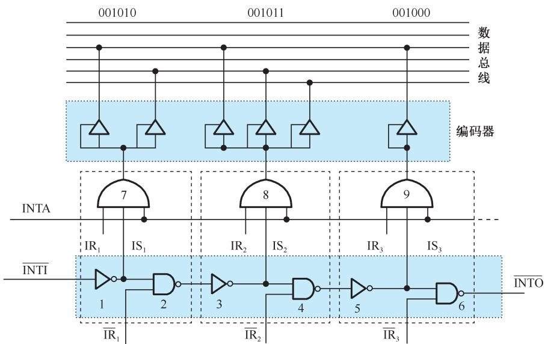
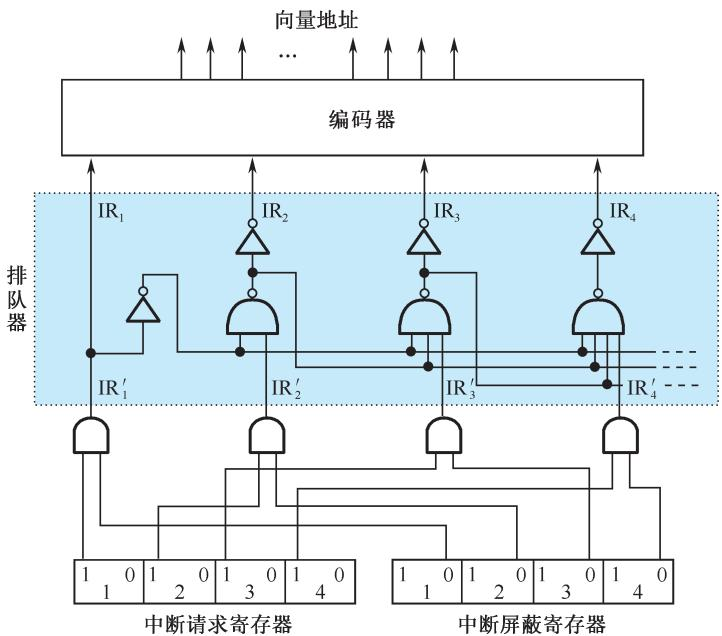
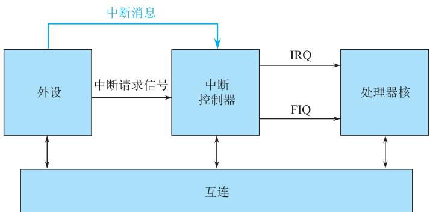

# 第8章-8.3 程序中断方式

## 基本信息
- **课程**：计算机组成原理
- **章节**：第8章 输入/输出系统 - 8.3 程序中断方式
- **日期**：2026-06-20
- **标签**：#输入输出系统 #程序中断方式 #中断系统 #ARM异常

## 重点内容

⭐⭐⭐ 中断的基本概念、处理过程和四个核心问题

⭐⭐⭐ 向量中断 vs 查询中断

⭐⭐⭐ 单级中断与多级中断的结构和原理

⭐⭐⭐ ARMv8-A架构的异常类型和处理机制

⭐ 中断接口中的四个标志触发器：RD、EI、IR、IM

## 详细笔记

### 一、异常和中断的基本概念

#### 1. 异常与中断的定义

- **异常（exception）**：现代处理器必备的程序随机切换机制
- **中断（interrupt）**：由外部事件引起的异常服务过程，是一种特定类型的异常
- **内中断（狭义异常）**：由机器内部原因引起，改变正常指令执行顺序

#### 2. 中断方式的典型应用

| 应用场景 | 说明 |
|:--------|:-----|
| CPU与外设信息交换 | 实现并行工作，提高CPU效率 |
| 故障处理 | 硬件故障（掉电、校验错）、软件故障（溢出、越界） |
| 实时处理 | 保证事件在实际时间内及时处理 |
| 程序调度 | 操作系统多任务调度的手段 |
| 软中断 | 程序自愿中断，用于系统调用 |

#### 3. 中断处理的基本过程

1. 外设数据准备就绪，向CPU发出中断请求
2. CPU响应中断，暂停主程序
3. 自动转移到该设备的中断服务程序
4. 服务结束后返回主程序断点继续执行

#### 📷 图8.5 中断处理示意图

> 📚 **课本出处**：图8.5 展示了CPU和外设并行工作的中断处理模式

#### 📷 图8.6 中断处理过程流程图

> 📚 **课本出处**：图8.6 展示了典型向量中断处理过程的详细流程

#### 4. 中断处理的四个核心问题

**问题1：指令执行完毕才受理中断**
- CPU在当前一条指令执行完毕后（转入公操作时）才受理中断请求
- 外界中断请求信号存放在接口的中断源锁存器中

**问题2：保存现场**
- 必须保存PC内容（断点）和CPU状态（寄存器、状态标志）到堆栈
- 称为"保存现场"

**问题3：中断屏蔽**
- "中断屏蔽"触发器：置"1"关中断，清"0"开中断
- 只有IM=0时，CPU才能受理新中断
- 响应中断时自动关中断，服务结束后开中断

**问题4：硬件与软件结合**
- 中断响应、关中断、保存断点：由**硬件**实现（隐操作）
- 查找中断源、排队判优、获取入口地址：可由硬件或软件实现
- 中断服务子程序：由**软件**实现

---

### 二、中断服务程序入口地址的获取

#### 1. 向量中断

**定义**：CPU响应中断后，由中断机构自动将中断向量地址送入CPU，指明中断服务程序入口地址并实现程序切换。

**中断向量表**：系统中所有中断向量按顺序存放在内存指定位置的表中。

#### 📷 图8.7 中断向量表实例

> 📚 **课本出处**：图8.7 展示了中断向量表的结构，包含向量地址、PC入口地址和PSW初始值

**向量地址的产生方式**：
- 直接地址：硬件直接产生中断服务程序入口地址
- 位移量：硬件产生位移量，加上CPU寄存器中的基地址得到入口地址
- 转移指令：向量表中存放跳转到中断服务程序的转移指令

#### 2. 查询中断

**定义**：硬件不直接提供入口地址，所有中断源共用一个公共中断服务程序，由软件查询中断源并跳转。

**特点**：
- 查找中断源和获取入口地址由**软件**实现
- 中断优先级由软件查询顺序决定，可灵活调整

#### 📷 图8.8 查询中断程序实例

> 📚 **课本出处**：图8.8 展示了查询中断方式的软件实现流程

#### 向量中断 vs 查询中断

| 特性 | 向量中断 | 查询中断 |
|:-----|:--------|:--------|
| 入口地址获取 | 硬件自动完成 | 软件查询实现 |
| 中断源识别 | 硬件自动识别 | 软件顺序查询 |
| 优先级调整 | 较固定 | 灵活可调 |
| 响应速度 | 快 | 较慢 |

---

### 三、程序中断方式的基本I/O接口

#### 📷 图8.9 程序中断方式基本接口示意图

> 📚 **课本出处**：图8.9 展示了程序中断方式接口中的四个标志触发器及其控制关系

#### 四个标志触发器

| 触发器 | 名称 | 功能 |
|:------|:-----|:-----|
| **RD** | 准备就绪触发器 | 设备动作完毕后置"1"，用作中断源触发器 |
| **EI** | 允许中断触发器 | 程序控制，EI=1允许发中断请求，EI=0禁止 |
| **IR** | 中断请求触发器 | 暂存设备发出的中断请求信号 |
| **IM** | 中断屏蔽触发器 | IM=0受理中断，IM=1不受理中断 |

#### 输入数据的控制过程（①~⑩）

1. 程序启动外设，BS置"1"，RD清"0"
2. 接口向外设发启动信号
3. 数据由外设传送到接口缓冲寄存器
4. 设备动作结束，RD置"1"
5. EI=1时，接口向CPU发中断请求
6. CPU检查中断请求线，IR接收请求信号
7. IM=0时，CPU受理中断，发响应信号并关中断
8. 转向中断服务程序入口
9. 输入指令把接口数据读至CPU寄存器
10. CPU发控制信号将BS和RD标志复位

---

### 四、单级中断

#### 1. 概念

所有中断源属于同一级，优先次序按离CPU距离排列（近的优先权高）。

**关键特点**：响应某一中断请求后，执行中断服务程序期间，不允许其他中断源再打断，即使优先权更高的也不行。

#### 📷 图8.10 单级中断

> 📚 **课本出处**：图8.10 展示了单级中断示意图和系统结构图

#### 2. 单级中断源的识别：串行排队链法

#### 📷 图8.11 串行排队链判优识别逻辑及中断向量的产生

> 📚 **课本出处**：图8.11 展示了串行排队链（菊花链）的判优识别逻辑

**工作原理**：
- IR1、IR2、IR3为中断请求信号，优先级从高到低
- IS1、IS2、IS3为中断排队选中信号
- INTI=0时，若IR1=1且INTA=1，则IR1被选中
- IR1被选中后，封锁后续设备的识别（IS2=IS3=0）

---

### 五、多级中断

#### 1. 概念

多级中断系统中，中断源分为多个优先级级别。高优先级中断可以打断低优先级的中断服务程序，实现中断嵌套。

#### 2. 多级中断的结构

#### 📷 图8.12 多级中断系统结构

> 📚 **课本出处**：图8.12 展示了三级中断系统结构（IM2、IM1、IM0为中断屏蔽字）

#### 📷 图8.13 独立请求方式的优先级排队逻辑

> 📚 **课本出处**：图8.13 展示了独立请求方式的中断优先级排队与中断向量产生逻辑

#### 3. 中断屏蔽字

每级中断设置一个中断屏蔽触发器IM：
- 执行某级中断服务程序时，将该级及更低级的IM置"1"（屏蔽）
- 更高级的IM保持"0"（开放），允许更高级中断打断

#### 📌 例8.2 多级中断的IM设置

假设三级中断系统，设备优先级A>B>C>D>E>F>G>H>I：

- 执行设备B的中断服务程序时：IM2IM1IM0 = 111
- 执行设备D的中断服务程序时：IM2IM1IM0 = 011

#### 📌 例8.3 中断饱和计算

系统中断饱和条件：处理所有设备中断请求的总时间 ≤ 中断请求周期

处理三个设备A、B、C的总时间：
$$T = t_A + t_B + t_C$$

其中：
$$t_A = 2T_M + T_{DC} + T_S + T_A + T_R$$

中断极限频率：
$$f = 1/T$$

---

### 六、ARMv8-A架构的异常与中断

#### 1. ARMv8-A的异常类型

在AArch64状态下，异常分为两类：

| 异常类型 | 定义 | 例子 |
|:--------|:-----|:-----|
| **同步异常** | 直接由执行指令引起，返回地址指明引起异常的指令 | 终止、复位、执行异常产生指令 |
| **异步异常** | 并非直接由程序执行引起 | IRQ、FIQ、SError |

**异步异常的三类**：
- **IRQ**：普通中断请求
- **FIQ**：快速中断请求（优先级更高）
- **SError**：系统错误（如异步数据终止）

**引起同步异常的事件**：
1. **终止**：指令取指错误、数据访问错误
2. **复位**：最高等级异常，不能被屏蔽
3. **执行异常产生指令**：系统调用指令（SVC、HVC、SMC）
4. **中断**：IRQ和FIQ

#### 2. ARMv8-A的异常处理

**异常等级（EL）规则**：
- 进入异常时：异常等级可保持不变或提升，不允许降低
- 返回异常时：异常等级可保持不变或降低，不允许提升

**进入异常时的硬件隐操作**：
1. 更新SPSR_ELn，保存PSTATE信息
2. 更新PSTATE，必要时提升异常等级
3. 将返回地址保存在ELR_ELn中

**异常返回**：执行ERET指令，恢复SPSR_ELn到PSTATE，恢复ELR_ELn到PC。

#### 3. AArch64的异常向量与异常向量表

- 每个异常等级（EL3、EL2、EL1）有各自的异常向量表
- 向量基址寄存器VBAR指明异常向量表基地址
- 每个表项长度128字节，可存放32条指令
- 表项存放的是异常处理程序要执行的指令序列（不是直接地址）

#### 4. ARM通用中断控制器（GIC）

#### 📷 图8.14 ARM通用中断控制器的中断请求方式

> 📚 **课本出处**：图8.14 展示了传统中断请求方式和消息信号中断(MSI)方式

**两种中断请求方式**：
- **传统方式**：外设通过中断请求信号线向中断控制器提交请求
- **MSI（消息信号中断）**：外设通过向中断控制器寄存器执行写操作触发中断，无需专门信号线

---

## 疑问与思考

1. 为什么中断处理要在指令执行完毕后才受理？
2. 向量中断和查询中断各适用于什么场景？
3. 多级中断的中断屏蔽字如何设置才能实现特定的中断处理次序？

## 相关链接

- 上一节：[第8章-8.2-程序查询方式](./第8章-8.2-程序查询方式.md)
- 下一节：[第8章-8.4-DMA方式](./第8章-8.4-DMA方式.md)
- 课本插图：
  - [图8.5 中断处理示意图](#📷-图85-中断处理示意图)
  - [图8.6 中断处理过程流程图](#📷-图86-中断处理过程流程图)
  - [图8.7 中断向量表实例](#📷-图87-中断向量表实例)
  - [图8.8 查询中断程序实例](#📷-图88-查询中断程序实例)
  - [图8.9 程序中断方式基本接口示意图](#📷-图89-程序中断方式基本接口示意图)
  - [图8.10 单级中断](#📷-图810-单级中断)
  - [图8.11 串行排队链判优识别逻辑](#📷-图811-串行排队链判优识别逻辑及中断向量的产生)
  - [图8.12 多级中断系统结构](#📷-图812-多级中断系统结构)
  - [图8.13 独立请求方式的优先级排队逻辑](#📷-图813-独立请求方式的优先级排队逻辑)
  - [图8.14 ARM通用中断控制器](#📷-图814-arm通用中断控制器的中断请求方式)
