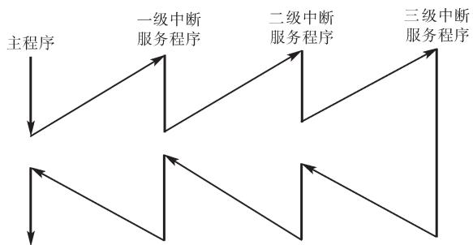
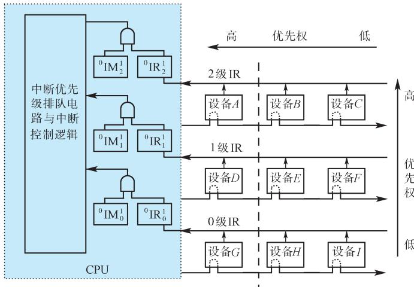

# 第8章-8.3 程序中断方式

## 基本信息
- **课程**：计算机组成原理
- **章节**：第8章 输入/输出系统 - 8.3 程序中断方式
- **日期**：2026-06-20
- **标签**：#输入输出系统 #程序中断方式 #中断系统 #ARM异常

## 重点内容

### ⭐⭐⭐ 核心考点
1. **中断的基本概念** - 异常与中断的关系，中断处理的四个核心问题
2. **向量中断 vs 查询中断** - 入口地址的两种获取方式
3. **单级中断与多级中断** - 结构、原理及对比
4. **ARMv8-A架构的异常与中断** - 异常级别、异常类型、处理机制

### ⭐⭐ 重要概念
- 中断接口的四个标志触发器：RD、EI、IR、IM
- 中断优先级与中断屏蔽
- 中断响应过程：关中断→保存断点→识别中断源→保存现场→执行服务程序→恢复现场→开中断

---

## 详细笔记

### 8.3.1 异常和中断的基本概念

#### 1. 异常与中断的定义

- **异常（exception）**：现代处理器必备的程序随机切换机制
- **中断（interrupt）**：由外部事件引起的异常服务过程，是一种特定类型的异常
- **内中断（狭义异常）**：由机器内部原因引起，改变正常指令执行顺序

#### 2. 异常与中断的关系

- **广义异常** = 中断（外中断）+ 狭义异常（内中断）
- **中断**：由处理器外部硬件触发，也称外中断
- **狭义异常**：由机器内部原因引起，也称内中断
- 中断方式与子程序调用的相似之处：都是暂停主程序转去执行另一段程序
- **关键区别**：中断请求由事件引发（随机的），子程序调用通过指令提前安排（确定的）

> 💡 **理解**：中断方式特别适合处理随机出现的服务请求，这是它相比程序查询方式的核心优势。

#### 3. 中断方式的典型应用

| 应用场景 | 说明 |
|:--------|:-----|
| CPU与外设信息交换 | 实现并行工作，提高CPU效率 |
| 故障处理 | 硬件故障（掉电、校验错）、软件故障（溢出、越界） |
| 实时处理 | 保证事件在实际时间内及时处理 |
| 程序调度 | 操作系统多任务调度的手段 |
| 软中断 | 程序自愿中断，用于系统调用 |

#### 4. 中断处理的基本过程

1. 外设数据准备就绪，向CPU发出中断请求
2. CPU响应中断，暂停主程序
3. 自动转移到该设备的中断服务程序
4. 服务结束后返回主程序断点继续执行

> 💡 **理解**：主程序只在设备数据准备就绪时才与设备交换数据，设备准备数据期间CPU继续执行主程序，实现CPU与外设的**并行工作**。

#### 📷 图8.5 中断处理示意图

> 📚 **课本出处**：图8.5 展示了CPU和外设并行工作的中断处理模式

#### 📷 图8.6 中断处理过程流程图

> 📚 **课本出处**：图8.6 展示了典型向量中断处理过程的详细流程

#### 5. 中断处理的四个核心问题

**问题1：指令执行完毕才受理中断（公操作）**
- 尽管外界中断请求是随机的，但CPU只有在当前一条指令执行完毕后才受理
- **公操作**：一条指令执行结束后CPU所进行的操作，如中断处理、取下条指令等
- 外界中断请求信号存放在接口中的**中断源锁存器**中，通过中断请求线连至CPU
- 每当一条指令执行到末尾，CPU便检查中断请求信号：若为"1"且允许响应，则CPU转入"中断周期"

> 💡 **理解**：如果在指令执行中间响应中断，当前指令的执行状态无法正确保存，会导致错误。所以必须等指令执行完毕。

**问题2：保存现场**
- 必须保存**PC内容（断点）**和**CPU状态（寄存器、状态标志）**到堆栈
- 中断服务程序执行完毕后，才能正确返回到原来主程序被中断的断点继续执行
- 使用**中断堆栈**的好处：①控制逻辑简单，按先进后出顺序进行；②各级中断不必单独设置保护区，可放在同一个栈里

**问题3：中断屏蔽**
- "中断屏蔽"触发器IM：置"1"关中断，清"0"开中断
- 只有IM=0时，CPU才能受理新中断
- CPU响应中断时，一方面发出中断响应信号INTA，另一方面**自动关中断**（IM置"1"）
- 服务结束后，中断服务程序末尾安排**开中断指令**和**中断返回指令**
- 硬件保证中断返回指令执行以后才受理新的中断请求

> 📌 **考试重点**：关中断→保存现场→中断服务→恢复现场→开中断→中断返回，这个顺序必须牢记。

**问题4：硬件与软件结合（隐操作）**
- **硬件实现**（中断处理的隐操作）：中断响应、关中断、保存断点——这些操作在主程序和中断服务程序的代码中都看不到
- **可由硬件或软件实现**：查找中断源、中断排队与判优、获取中断服务程序入口地址
- **软件实现**：中断服务子程序——执行保存现场、恢复现场、开放中断、返回主程序、与设备交换数据

> 📚 **课本出处**：8.3.1节，其中"隐操作"是指在中断周期中由硬件实现的响应中断、关中断等操作，在程序代码中不可见。

---

#### 💡 思考题
举出现实生活中采用中断方式进行管理的实际例子。

> 📚 **课本出处**：8.3.1节末尾思考题。例如：门铃响了→暂停当前活动去开门→回来继续之前的事，类似于中断处理过程。

---

### 8.3.2 中断服务程序入口地址的获取

#### 1. 向量中断

**定义**：CPU响应中断后，由中断机构自动将相应中断源的中断向量地址送入CPU，由其指明中断服务程序入口地址并实现程序切换的中断方式。

**中断向量表**：系统中所有中断向量按顺序存放在内存指定位置的表中。

#### 📷 图8.7 中断向量表实例

> 📚 **课本出处**：图8.7 展示了中断向量表的结构，包含向量地址、PC入口地址和PSW初始值

**向量地址的产生方式**：
- 直接地址：硬件直接产生中断服务程序入口地址
- 位移量：硬件产生位移量，加上CPU寄存器中的基地址得到入口地址
- 转移指令：向量表中存放跳转到中断服务程序的转移指令

#### 2. 查询中断

**定义**：硬件不直接提供入口地址，所有中断源共用一个公共中断服务程序，由软件查询中断源并跳转。

**特点**：
- 查找中断源和获取入口地址由**软件**实现
- 中断优先级由软件查询顺序决定，可灵活调整

#### 📷 图8.8 查询中断程序实例

> 📚 **课本出处**：图8.8 展示了查询中断方式的软件实现流程

#### 向量中断 vs 查询中断

| 特性 | 向量中断 | 查询中断 |
|:-----|:--------|:--------|
| 入口地址获取 | 硬件自动完成 | 软件查询实现 |
| 中断源识别 | 硬件自动识别 | 软件顺序查询 |
| 优先级调整 | 较固定 | 灵活可调 |
| 响应速度 | 快 | 较慢 |

---

### 8.3.3 程序中断方式的基本I/O接口

#### 📷 图8.9 程序中断方式基本接口示意图

> 📚 **课本出处**：图8.9 展示了程序中断方式接口中的四个标志触发器及其控制关系

#### 四个标志触发器

| 触发器 | 名称 | 功能 |
|:------|:-----|:-----|
| **RD** | 准备就绪触发器 | 设备动作完毕后置"1"，用作中断源触发器 |
| **EI** | 允许中断触发器 | 程序控制，EI=1允许发中断请求，EI=0禁止 |
| **IR** | 中断请求触发器 | 暂存设备发出的中断请求信号 |
| **IM** | 中断屏蔽触发器 | IM=0受理中断，IM=1不受理中断 |

#### 输入数据的控制过程（①~⑩）

1. 程序启动外设，BS置"1"，RD清"0"
2. 接口向外设发启动信号
3. 数据由外设传送到接口缓冲寄存器
4. 设备动作结束，RD置"1"
5. EI=1时，接口向CPU发中断请求
6. CPU检查中断请求线，IR接收请求信号
7. IM=0时，CPU受理中断，发响应信号并关中断
8. 转向中断服务程序入口
9. 输入指令把接口数据读至CPU寄存器
10. CPU发控制信号将BS和RD标志复位

---

### 8.3.4 单级中断

#### 1. 概念

所有中断源属于同一级，优先次序按离CPU距离排列（近的优先权高）。

**关键特点**：响应某一中断请求后，执行中断服务程序期间，不允许其他中断源再打断，即使优先权更高的也不行。只有该中断服务程序执行完毕之后，才能响应其他中断。

> 📌 **考试重点**：单级中断系统中，所有I/O设备通过一条公共中断请求线向CPU发出中断请求。CPU响应后，发出中断响应信号INTA，以**链式查询方式**识别中断源。

#### 📷 图8.10 单级中断

> 📚 **课本出处**：图8.10(a)为单级中断示意图，(b)为单级中断系统结构图——所有设备通过一条线连接CPU

> 💡 **与总线仲裁的对应关系**：单级中断的链式查询结构与第6章讲的**链式总线仲裁**相对应——中断请求信号IR相当于总线请求信号BR，中断响应信号INTA相当于总线授权信号BG。

#### 2. 单级中断源的识别：串行排队链法

#### 📷 图8.11 串行排队链判优识别逻辑及中断向量的产生

> 📚 **课本出处**：图8.11 展示了串行排队链（菊花链）的判优识别逻辑

**信号说明**：
- IR₁、IR₂、IR₃：中断请求信号，优先级从高到低（IR₁最高）
- IS₁、IS₂、IS₃：中断排队选中信号，ISᵢ=1表示该中断源被选中
- INTI：中断排队输入
- INTO：中断排队输出
- INTA：CPU发来的中断识别信号

**串行排队链工作原理**：

① **无更高优先级请求时**：INTI=0 → 门1输出高电平 → IS₁=1
- 若此时IR₁=1（有中断请求），当INTA=1时，IR₁被选中
- 选中信号经门7送入编码电路，产生设备地址，经数据总线送CPU
- 同时，因IR̄₁=0，**封锁门2**，使IS₂=IS₃=0，排队不再向下进行

② **IR₁无请求时**：IR₁=0 → 门7被封锁，不向编码电路送入选中信号
- 因IR̄₁=1，经门2和门3使IS₂=1
- 若IR₂=1则被选中；否则继续向下查询

> 💡 **理解**：这就像一条链上挂着多个设备，查询从最高优先级设备开始，如果该设备有请求就处理它并封锁后续设备；如果没有请求就传给下一个设备——这就是"串行"的含义。

#### 3. 中断向量的产生

当CPU识别出某中断源时，由硬件直接产生一个与该中断源对应的**向量地址**，快速引入中断服务程序。

- 向量中断要求在硬件设计时考虑**所有中断源**的向量地址
- 实际中断时只能产生**一个**向量地址
- 图8.11上半部分为中断向量产生逻辑，由**编码电路**实现
- 编码电路将排上队的中断源信号转换为唯一的向量地址

#### 💡 思考题
你能说出程序中断方式最主要的创新点吗？

> 📚 **课本出处**：8.3.4节末尾思考题。创新点在于：CPU与外设可以并行工作，外设数据准备就绪后主动通知CPU，而非CPU反复查询。

---

### 8.3.5 多级中断

#### 1. 概念

多级中断系统是指计算机系统中有相当多的中断源，根据各中断事件的轻重缓急程度不同而分成若干级别，每一中断级分配给一个优先权。优先权高的中断级可以打断优先权低的中断服务程序，以**程序嵌套方式**进行工作。

**一维多级中断 vs 二维多级中断**：
- **一维多级中断**：每一级中断中只有一个中断源
- **二维多级中断**：每一级中断中有多个中断源
- 图8.12(b)中虚线左边为一维多级中断，去掉虚线则成为二维多级中断结构

#### 2. 多级中断的结构

#### 📷 图8.12(a) 多级中断示意图

> 📚 **课本出处**：图8.12(a) 展示了三级中断优先级嵌套关系（三级>二级>一级）

#### 📷 图8.12(b) 一维、二维多级中断结构

> 📚 **课本出处**：图8.12(b) 展示了一维多级中断（每级一个中断源）和二维多级中断（每级多个中断源）的结构对比

#### 📌 对多级中断着重说明的四点

**（1）中断屏蔽寄存器的保存与设置**
- 一个系统若有n级中断，在CPU中就有n个**中断请求触发器**（总称中断请求寄存器）和n个**中断屏蔽触发器**（总称中断屏蔽寄存器）
- 与单级中断不同，多级中断中**中断屏蔽寄存器的内容是一个很重要的程序现场**
- 响应中断时，需要把中断屏蔽寄存器的内容保存起来，并设置新的中断屏蔽状态
- 规则：置"1"（关闭）**本级和低于本级**的中断屏蔽触发器，清"0"（开放）**更高级**的中断屏蔽触发器

> 📌 **考试重点**：中断屏蔽字的设置是多级中断的核心考点，详见例8.2。

**（2）同级内不嵌套**
- 每一级可以只有一个中断源，也可以有多个中断源
- **多级之间**可以实现中断嵌套
- **同一级内**有不同中断源的中断**不能嵌套**，必须处理完一个后再响应同级内其他中断源

**（3）硬件实现优先级排队**
- 设置多级中断的系统一般都希望有较快的中断响应时间
- 首先响应哪一级中断和哪一个中断源，由**硬件逻辑**实现，而不是用程序实现
- 图8.12中的中断优先级排队电路，用于决定优先响应中断级
- 在二维中断结构中：排队电路确定优先响应中断级 → 链式查询确定优先响应的中断源
- 采用**独立请求方式与链式查询方式相结合**的方法

**（4）使用中断堆栈保存现场**
- 和单级中断类似，也使用中断堆栈保存现场信息
- 好处：①控制逻辑简单，按先进后出顺序进行；②每一级中断不必单独设置现场保护区

#### 3. 多级中断源的识别

#### 📷 图8.13 独立请求方式的优先级排队逻辑

> 📚 **课本出处**：图8.13 展示了独立请求方式的中断优先级排队与中断向量产生逻辑

**独立请求方式工作原理**：
- 每一级均有一根中断请求线送往CPU的中断优先级排队电路
- 每个中断请求信号保存在"中断请求"触发器中，经"中断屏蔽"触发器控制后，若干个IR'ᵢ进入排队电路
- 排队电路在若干中断源中决定首先响应哪个中断源，在对应的输出线IRᵢ上给出"1"信号（只有一个有效）
- 编码电路根据排上队的中断源输出信号，产生预定的地址码，转向中断服务程序入口

**独立请求方式示例**：
- 假设请求源1优先级最高，请求源4最低
- 若中断请求寄存器=1111，中断屏蔽寄存器=0010
- 则进入排队器的中断请求=1101（第3位被屏蔽）
- 根据优先次序，排队器输出=1000
- 编码器产生中断源1对应的向量地址

#### 4. 中断屏蔽字

每级中断设置一个中断屏蔽触发器IM：
- 执行某级中断服务程序时，将该级及**更低级**的IM置"1"（屏蔽）
- **更高级**的IM保持"0"（开放），允许更高级中断打断

#### 📌 例8.2 多级中断的IM设置

**题目**：参见图8.12(b)所示的二维中断系统。请问：

(1) 在中断情况下，CPU和设备的优先级如何考虑？请按降序排列各设备的中断优先级。
(2) 若CPU现执行设备B的中断服务程序，IM₂、IM₁、IM₀的状态是什么？如果CPU执行设备D的中断服务程序，IM₂、IM₁、IM₀的状态又是什么？
(3) 每一级的IM能否对某个优先级的个别设备单独进行屏蔽？如果不能，采取什么办法可达到目的？
(4) 假如设备C一提出中断请求，CPU立即进行响应，如何调整才能满足此要求？

**解答**：

**(1)** 在中断情况下，**CPU的优先级最低**。各设备的优先次序是：
$$A \to B \to C \to D \to E \to F \to G \to H \to I \to CPU$$

**(2)** 执行设备B的中断服务程序时（B在第3级）：
- 第3级及以上被屏蔽：IM₂IM₁IM₀ = **111**
- 含义：屏蔽同级及以下（第3、2、1级），开放更高级

执行设备D的中断服务程序时（D在第2级）：
- 第2级及以下被屏蔽：IM₂IM₁IM₀ = **011**
- 含义：开放第3级（更高级），屏蔽第2级和第1级

**(3)** 每一级的IM标志**不能**对某个优先级的个别设备进行单独屏蔽。
- 解决办法：将接口中的**EI（中断允许）标志清"0"**，禁止设备发出中断请求

**(4)** 要使设备C的中断请求及时得到响应：将设备C从第2级取出来，单独放在第3级上，使第3级的优先级最高，即令**IM₃=0**即可。

#### 📌 例8.3 中断饱和计算

**题目**：参见图8.12(b)所示的系统，只考虑A、B、C三个设备组成的单级中断结构。

**已知条件**：
- CPU在响应新中断前，先要让被中断的程序的一条指令执行完毕
- T_DC：查询链中每个设备的延迟时间
- T_A、T_B、T_C：设备A、B、C的服务程序执行时间
- T_S、T_R：保存现场和恢复现场所需时间
- T_M：主存工作周期（也假设执行一条指令的时间为T_M）

**求**：系统在什么情况下达到中断饱和？

**解答**：三个设备同时发出中断请求，依次处理的时间为：

$$t_A = 2T_M + T_{DC} + T_S + T_A + T_R$$

$$t_B = 2T_M + 2T_{DC} + T_S + T_B + T_R$$

$$t_C = 2T_M + 3T_{DC} + T_S + T_C + T_R$$

> 💡 **理解**：设备A只需查询1次（T_DC），设备B需查询2次（2T_DC），设备C需查询3次（3T_DC）。每个设备都需2T_M（取指+中断周期）+ T_S（保存现场）+ T_R（恢复现场）。

处理三个设备所需的总时间为：

$$T = t_A + t_B + t_C$$

**T是达到中断饱和的最小时间**，即中断极限频率为：

$$f = 1/T$$

> 📌 **考试重点**：中断饱和的含义是CPU全部时间都在处理中断，没有时间执行主程序。设计时必须保证实际中断频率远低于f。

#### 💡 思考题
你能说出多级中断比单级中断在设计理念上的创新点吗？

> 📚 **课本出处**：8.3.5节末尾思考题。创新点：多级中断实现了中断嵌套，高优先级可打断低优先级，使紧急任务得到及时响应。

---

### 8.3.6 ARMv8-A架构的异常与中断

#### 1. ARMv8-A的异常类型

在ARM架构中，执行状态定义了处理单元的执行环境（寄存器宽度、指令集、异常模型等）。AArch64为64位执行状态，支持单一的A64指令集。

在AArch64状态下，广义异常分为两类：

| 异常类型 | 定义 | 特征 |
|:--------|:-----|:-----|
| **同步异常** | 直接由执行指令或尝试执行指令引起 | 返回地址指明引起异常的特定指令 |
| **异步异常** | 并非直接由程序执行引起（中断） | 包括IRQ、FIQ、SError |

**引起同步异常的四类事件**：

**(1) 终止（Abort）**
- **指令终止（instruction aborts）**：指令取指错误时产生
- **数据终止（data aborts）**：数据访问错误引起
- 可能由存储器访问失败引起，也可能由MMU需要为应用程序动态分配内存引起
- 存储管理单元引起的访问权限故障、访问属性故障、堆栈指针和PC对齐检查、无效指令和系统调用等都将产生同步终止异常
- **异步数据终止**属于系统错误异常：从Cache向外部存储器写回"脏"数据时触发

> 💡 **理解**：同步终止引起同步异常，异步终止产生系统错误（SError）异步异常。

**(2) 复位（Reset）**
- 最高等级的异常，**不能被屏蔽**
- 所有处理单元在系统复位之后总是转至最高异常等级执行复位异常，并初始化系统

**(3) 执行异常产生指令**
- 异常产生指令即系统调用指令，执行将引起**软中断**
- 用于需要提升特权等级或申请系统服务的情况：
  - **SVC**（Supervisor Call）：用户程序请求操作系统服务
  - **HVC**（Hypervisor Call）：客户操作系统请求虚拟机管理器服务
  - **SMC**（Secure Monitor Call）：非安全状态请求安全状态服务

**(4) 中断**
- 支持两种中断：**IRQ**（普通中断）和**FIQ**（快速中断，优先级更高）
- 除了某些加载多个数值的指令外，中断响应一定发生在开中断状态下当前指令执行结束之后

#### 2. ARMv8-A的异常处理

**异常等级（EL）切换规则**：
- **进入异常时**：异常等级可保持不变或**提升**，**不允许降低**
- **从异常返回时**：异常等级可保持不变或**降低**，**不允许提升**
- 每种异常类型都有一个目标异常等级（隐含的或由系统寄存器配置位定义），**目标异常等级不能是EL0**

**进入异常时的硬件隐操作**（在异常等级n处理异常时）：

| 步骤 | 操作 | 说明 |
|:----|:-----|:-----|
| ① | 更新SPSR_ELn | 保存异常处理结束返回时恢复现场必需的PSTATE信息 |
| ② | 更新PSTATE | 用新的处理器状态信息更新，必要时提升异常等级 |
| ③ | 保存返回地址到ELR_ELn | 异常处理结束返回的地址 |

**异常返回**：执行**ERET指令**
- SPSR_ELn → PSTATE（恢复程序状态）
- ELR_ELn → PC（恢复程序计数器，返回断点继续执行）

#### 3. AArch64的异常向量与异常向量表

**向量表结构**：
- 每个异常等级（EL3、EL2、EL1）有**各自独立**的异常向量表
- 每个等级有相应的**向量基址寄存器VBAR**（Vector Base Address Register），指明该等级异常向量表的基地址
- 某个ELn等级的异常向量表保存了发生在该等级的**所有类型**的异常向量
- 特定异常向量在异常向量表中的**偏移地址是固定的**

**向量表组成**：
- 每个异常等级的异常向量表有**4组**，每组有**4个异常入口**
- 4个入口分别对应：**同步异常、IRQ、FIQ、系统错误**
- 选择哪一组取决于：异常发生在当前等级还是更低等级、使用哪个堆栈指针（SP0或SPn）、执行状态（AArch64或AArch32）

> 📌 **考试重点**：异常向量表的每个表项存放的**不是异常处理程序的入口地址**，而是异常处理程序要执行的**第一条指令所对应的指令字**（指令序列）。

**表项大小**：每个表项**128字节**，可存放**32条指令**
- 一般足以存放一个完整的顶层异常处理程序代码
- 通常包含查找具体异常源的代码，然后调用相关处理函数

#### 4. ARM通用中断控制器（GIC）

**为什么需要GIC**：ARMv8-A高性能处理器的外部中断源相当多，但ARM处理器内核本身只能支持**FIQ和IRQ两级**外部中断请求输入，因此通过通用中断控制器实现中断管理。

**GIC的主要功能**：
- 中断请求的**仲裁**
- **优先级排队**
- 向处理器内核提出中断请求
- 外设中断请求由中断控制器接收后进行优先级判优，然后发送给相应处理器内核

#### 📷 图8.14 ARM通用中断控制器的中断请求方式

> 📚 **课本出处**：图8.14 展示了传统中断请求方式和消息信号中断(MSI)方式

**两种中断请求方式**：

| 方式 | 原理 | 特点 |
|:-----|:-----|:-----|
| **传统方式** | 外设通过中断请求信号线向中断控制器提交请求 | 需要专门的中断请求信号线 |
| **MSI方式** | 外设通过向中断控制器寄存器执行写操作触发中断 | 无需专门信号线，适合中断源多的大型系统 |

- MSI是ARM通用中断控制器规范v3版本新增的方式
- 两种方式的中断处理过程基本相同

---

## 疑问与思考

1. 为什么中断处理要在指令执行完毕后才受理？
2. 向量中断和查询中断各适用于什么场景？
3. 多级中断的中断屏蔽字如何设置才能实现特定的中断处理次序？

## 相关链接

- 上一节：[第8章-8.2-程序查询方式](./第8章-8.2-程序查询方式.md)
- 下一节：[第8章-8.4-DMA方式](./第8章-8.4-DMA方式.md)
- 课本插图：
  - [图8.5 中断处理示意图](#📷-图85-中断处理示意图)
  - [图8.6 中断处理过程流程图](#📷-图86-中断处理过程流程图)
  - [图8.7 中断向量表实例](#📷-图87-中断向量表实例)
  - [图8.8 查询中断程序实例](#📷-图88-查询中断程序实例)
  - [图8.9 程序中断方式基本接口示意图](#📷-图89-程序中断方式基本接口示意图)
  - [图8.10 单级中断](#📷-图810-单级中断)
  - [图8.11 串行排队链判优识别逻辑](#📷-图811-串行排队链判优识别逻辑及中断向量的产生)
  - [图8.12(a) 多级中断示意图](#📷-图812a-多级中断示意图)
  - [图8.12(b) 一维、二维多级中断结构](#📷-图812b-一维二维多级中断结构)
  - [图8.13 独立请求方式的优先级排队逻辑](#📷-图813-独立请求方式的优先级排队逻辑)
  - [图8.14 ARM通用中断控制器](#📷-图814-arm通用中断控制器的中断请求方式)
