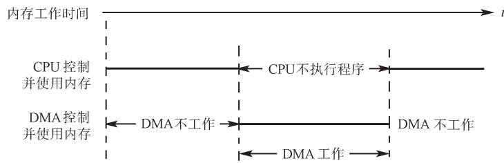
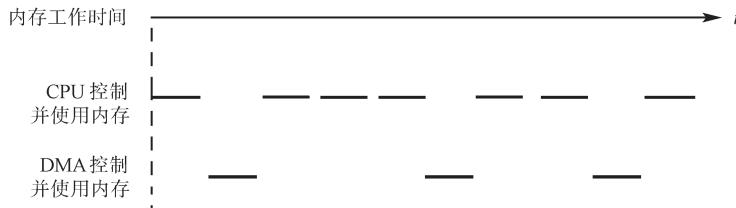
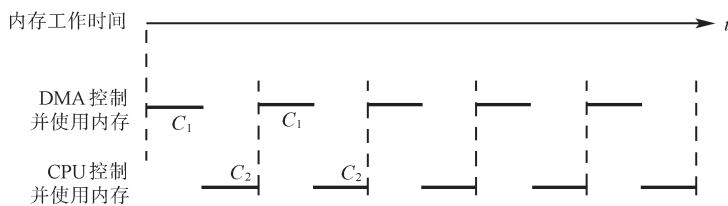
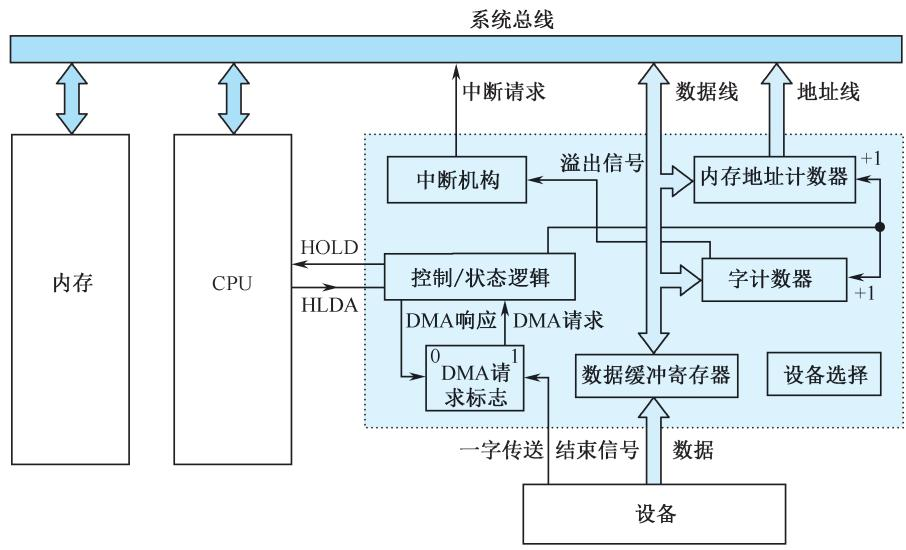
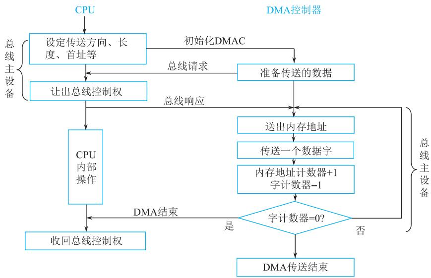
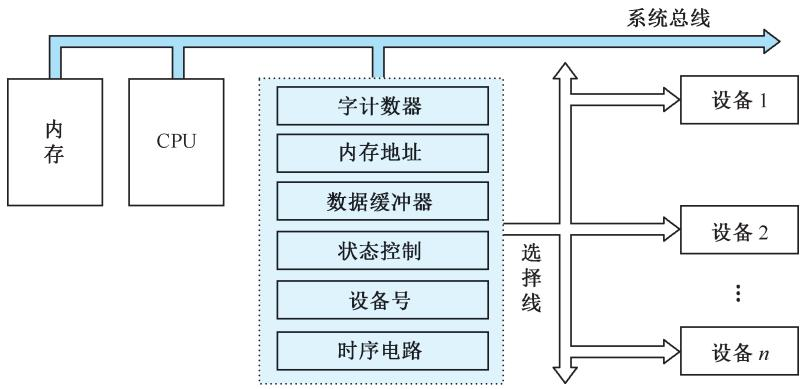
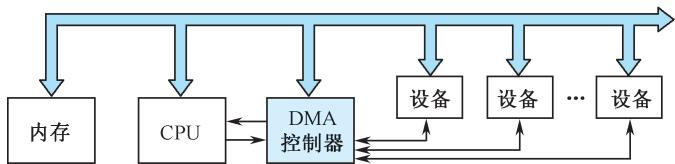
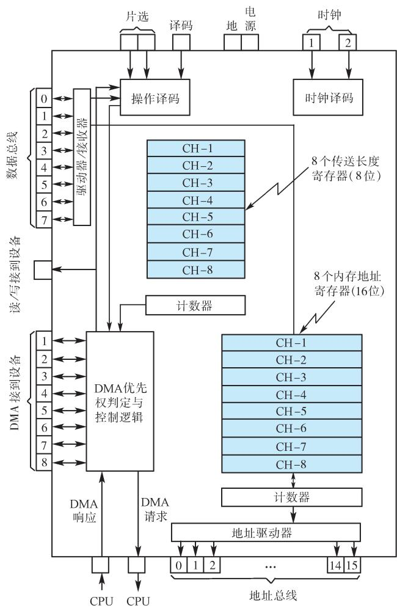
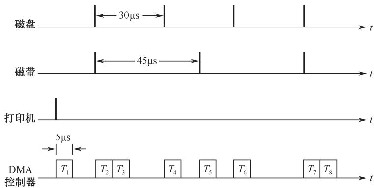

# 第8章-8.4 DMA方式

## 基本信息
- **课程**：计算机组成原理
- **章节**：第8章 输入/输出系统 - 8.4 DMA方式
- **日期**：2026-06-20
- **标签**：#输入输出系统 #DMA #直接内存访问 #DMA控制器

## 重点内容

### ⭐⭐⭐ 核心考点
1. **DMA方式的基本概念和特点** - 完全由硬件执行，数据不经过CPU
2. **三种DMA传送方式** - 成组连续传送、周期挪用、透明DMA
3. **DMA控制器的基本组成和工作原理** - DAR、DCR、WC、BR等寄存器

### ⭐⭐ 重要概念
- 选择型和多路型DMA控制器的区别
- DMA与中断方式的核心区别：DMA仅占用总线，不切换程序
- DMA的四种基本操作：预处理、数据传送、传送结束处理、后处理
- DMA控制器与CPU共享内存的方式

---

## 详细笔记

### 8.4.1 DMA的基本概念

**DMA（Direct Memory Access，直接内存访问）**：完全由硬件执行I/O交换的工作方式。DMA控制器从CPU完全接管对总线的控制，数据交换不经过CPU，直接在内存和I/O设备之间进行。DMA方式一般用于**高速传送成组数据**。

DMA控制器将向内存发出地址和控制信号，修改地址，对传送的字的个数计数，并且以**中断方式**向CPU报告传送操作的结束。

#### DMA方式的主要优点

1. **速度快**：省去CPU取指令、取数、送数等操作
2. **无现场保护/恢复**：没有保存现场、恢复现场之类的工作
3. **硬件控制**：内存地址修改、字数计数由硬件直接实现，而非软件
4. **仅受内存访问时间限制**：数据传送速度高

#### DMA方式的特点

- 以响应随机请求的方式实现主存与I/O设备间的快速数据传送
- 不影响CPU的程序执行状态，不存在访存冲突时CPU可继续执行程序
- 只能处理简单的数据传送，**不能**在传送同时进行判断和计算
- 传送开始时间是随机的，但开始传送后需要进行连续批量数据交换

#### 📌 与查询方式和中断方式的详细对比

| 对比项 | 程序查询 | 程序中断 | DMA |
|:------|:--------|:--------|:----|
| CPU等待 | 必须等待查询 | 响应中断后切换程序 | 不必等待，不切换程序 |
| 传输控制 | CPU执行指令 | CPU执行中断服务程序 | **硬件（DMA控制器）**控制 |
| 程序切换 | 无（但CPU踏步等待） | **切换程序** | **不切换程序**，仅占用总线 |
| CPU效率 | 最低 | 较高 | **最高** |
| 适用场景 | 低速设备 | 随机服务、慢速I/O | **高速批量数据传送** |
| 复杂数据处理 | — | 可识别和处理复杂事态 | 只能简单传送 |

> 📌 **考试重点**：与中断方式的核心区别——DMA**仅占用系统总线**，不切换程序，CPU可与DMA传送并行工作；而中断方式需要CPU暂停主程序转去执行中断服务程序。

#### DMA方式的典型应用场景

- 以**数据块**为单位的磁盘读/写操作
- 以**数据帧**为单位的外部通信
- **大批量数据采集**

#### DMA控制器的四种基本操作

1. 根据外设工作状态发出DMA请求
2. CPU响应请求，DMA控制器从CPU接管总线控制权
3. 决定数据传送的内存单元地址，对传送字数计数，并执行数据传送操作
4. 向CPU报告DMA操作结束

> ⚠️ **注意**：在DMA方式中，一批数据传送前的**准备工作**，以及传送结束后的**处理工作**，均由管理程序承担，DMA控制器**仅负责数据传送的工作**。

#### 💡 思考题
说出DMA方式的创新点，其意义何在？

> 📚 **课本出处**：8.4.3节末尾思考题。创新点：将数据传送完全交给硬件，CPU从繁重的数据搬运中解放出来，实现了CPU与高速I/O设备的真正并行工作。

---

### 8.4.2 DMA传送方式

根据DMA控制器占用总线周期的方式，分为三种：

#### 1. 成组连续传送方式（停止CPU访存）

- 外围设备要求传送一批数据时，DMA控制器发停止信号给CPU
- CPU放弃地址总线、数据总线和控制总线的使用权
- 一批数据传送完毕后，DMA控制器通知CPU，交还总线控制权
- 在DMA传送过程中，CPU基本处于**不工作状态或保持状态**

**优点**：控制简单，适用于数据传输率很高的设备成组传送

**缺点**：DMA控制器访内阶段，内存效能未充分发挥，许多存储周期空闲

> 💡 **理解**：外围设备传送两个数据之间的间隔一般总是大于内存存储周期。例如，软盘读出一个8位二进制数大约需要 **32μs**，而半导体内存的存储周期小于 **0.2μs**，因此许多空闲的存储周期不能被CPU利用。

#### 2. 周期挪用方式（周期窃取）

- I/O设备没有DMA请求时，CPU按程序访问内存
- 一旦I/O设备有DMA请求，挪用一个或几个内存周期

**两种情况**：
- **CPU不需要访存时**（如正在执行乘法指令）：I/O访内与CPU访内无冲突，挪用一两个内存周期对CPU**没有任何影响**
- **CPU也要求访存时**：产生访内冲突，**I/O设备访存优先**（因为I/O访存有时间要求，前一个数据必须在下一个请求到来之前存取完毕），CPU延缓执行

> ⚠️ **周期挪用的开销**：I/O设备每一次周期挪用都有**申请总线控制权、建立总线控制权和归还总线控制权**的过程。传送一个字对内存来说要占用一个周期，但对DMA控制器来说一般要**2~5个内存周期**（视逻辑线路延迟而定）。

**优点**：既实现I/O传送，又较好发挥内存和CPU效率，是**广泛采用**的方法

**适用**：I/O设备读写周期大于内存存储周期的情况

#### 3. 透明DMA方式（DMA与CPU交替操作，总线周期分时方式）

如果外设传输的频率和间隔时间基本固定，可采用**同步控制方式**分配总线使用权。

- 将一个CPU周期分为两个子周期：**C₁**和**C₂**
- **C₁**专供DMA控制器访存使用
- **C₂**专供CPU访存使用
- 不需要总线使用权的申请、建立和归还过程

> 💡 **理解**：例如CPU工作周期为 **1.2μs**，内存存取周期为 **0.6μs**，则C₁和C₂各为0.6μs。CPU和DMA控制器各自有自己的访存地址寄存器、数据寄存器和读/写信号等控制寄存器。对于总线，C₁和C₂控制的是一个**多路转换器**，总线控制权的转移几乎不需要时间。

**优点**：DMA传送和CPU可同时发挥最高效率，CPU**感受不到**DMA传输的影响（"透明"的由来）

**缺点**：CPU实际工作周期比内存存取周期长很多

> 📌 **考试重点**：透明DMA方式下，CPU既不停止主程序运行，也不进入等待状态，是一种高效率工作方式。

#### 📷 图8.15 DMA的基本方法

> 📚 **课本出处**：图8.15 展示了三种DMA传送方式的时间图：(a)成组连续传送 (b)周期挪用 (c)透明DMA

#### 三种DMA传送方式对比

| 方式 | 总线控制 | CPU状态 | 内存效率 | 适用场景 |
|:-----|:--------|:--------|:--------|:---------|
| 成组连续传送 | DMA批量控制 | 基本不工作 | 有闲置周期 | 高速设备成组传送 |
| 周期挪用 | 逐周期挪用 | 正常执行 | 较高 | 广泛采用 |
| 透明DMA | 固定分时 | 完全并行 | 最高 | 固定频率外设 |

---

### 8.4.3 基本的DMA控制器

#### 📷 图8.16 简单的DMA控制器组成

> 📚 **课本出处**：图8.16 展示了DMA控制器的五大逻辑部件

#### DMA控制器的基本组成

DMA控制器实际上是采用DMA方式的外围设备与系统总线之间的**接口电路**，在中断接口的基础上再加DMA机构组成。

| 部件 | 功能 | 详细说明 |
|:-----|:-----|:---------|
| **内存地址计数器** | 存放内存数据地址 | 传送前由程序预置首地址；传送时每交换一个数据地址**加"1"**，以增量方式给出地址 |
| **字计数器** | 记录传送数据块长度 | 传送前由程序预置（以**补码**形式表示）；传送时每传送一个字加"1"；**溢出（最高位进位）时表示传送完毕** |
| **数据缓冲寄存器** | 暂存每次传送的一个字 | 输入时：设备→缓冲寄存器→数据总线→内存；输出时反向 |
| **DMA请求标志** | 设备准备好数据后置"1" | 向控制/状态逻辑发DMA请求 |
| **控制/状态逻辑** | 协调和同步 | 修改地址计数器和字计数器，指定传送类型（输入/输出），对DMA请求信号和CPU响应信号进行协调 |
| **中断机构** | 报告传送结束 | 字计数器溢出时触发中断机构，向CPU提出中断报告（目的是报告传送结束，非数据交换） |

> ⚠️ **注意区分**：DMA中的中断是为了**报告一组数据传送结束**，与8.3节中I/O中断（用于数据输入或输出）是**不同的中断事件**。

#### DMA数据传送过程（三阶段）

**① 预处理阶段**（CPU执行程序）：
- 测试设备状态
- 向DMA控制器的设备地址寄存器中送入设备号并启动设备
- 向内存地址计数器中送入起始地址
- 向字计数器中送入交换的数据字个数
- 完成后CPU继续执行原来的主程序

**② 正式传送阶段**（DMA硬件控制）：
- 外设准备好数据→发出DMA请求
- DMA控制器向CPU发出总线使用权请求（**HOLD信号**）
- CPU在**总线周期结束后**响应请求，发回**HLDA响应信号**
- CPU的总线驱动器处于**第三态（高阻状态）**，与系统总线脱离
- DMA控制器接管数据总线与地址总线的控制
- 每交换一个字，地址计数器和字计数器加"1"
- 当计数值到零时，DMA操作结束

**③ 后处理阶段**（CPU中断服务）：
- 字计数器溢出→DMA向CPU提出**中断报告**
- CPU停止主程序，转去执行中断服务程序
- 后处理工作包括：校验数据是否正确、决定是否继续DMA传送、测试是否发生错误等

#### DMA控制器与系统的连接方式

| 连接方式 | 说明 |
|:--------|:-----|
| **公用的DMA请求方式** | 多个设备共用一条DMA请求线 |
| **独立的DMA请求方式** | 每个设备有独立的DMA请求线（与中断方式类似） |

> 📚 **课本出处**：图8.17 展示了成组连续传送方式的DMA数据传送流程

---

### 8.4.4 选择型和多路型DMA控制器

#### 📷 图8.18 选择型DMA控制器

> 📚 **课本出处**：图8.18 展示了选择型DMA控制器的逻辑框图，增加了设备号寄存器

#### 1. 选择型DMA控制器

- 物理上可连接多个设备，逻辑上**只允许连接一个设备**
- 在某一段时间内专门为某个设备服务
- 除了基本逻辑部件外，还有一个**设备号寄存器**
- 数据传送以**数据块**为单位：预置阶段通过I/O指令给出设备号、传送个数、起始地址、操作命令
- 从预置开始到数据块传送结束，只为所选设备服务；下一次预置再选择另一个设备
- 相当于一个**逻辑开关**，根据I/O指令控制与某个设备连接

**适用**：数据传输率很高、接近内存存取速度的设备。很快传送完一个数据块后，又可为其他设备服务。

#### 📷 图8.19 多路型DMA控制器原理示意图

> 📚 **课本出处**：图8.19 展示了独立请求方式的多路型DMA控制器原理图

#### 2. 多路型DMA控制器

- 不仅在物理上可连接多个设备，**逻辑上也允许这些设备同时工作**
- 各设备以**字节交叉方式**通过DMA控制器进行数据传送
- 对应多少个DMA通路（设备），控制器内部就有**多少组寄存器**用于存放各自的传送参数
- 适用于**多个低速设备**

#### 📷 图8.20 一个多路型DMA控制器芯片

> 📚 **课本出处**：图8.20 展示了多路型DMA控制器的芯片内部逻辑结构

**芯片内部结构**：
- 可对**8个独立的DMA通路(CH)**进行控制
- 外围设备以**周期挪用方式**对内存进行存取
- **8条独立的DMA请求线/响应线**：可双向通信（通过分时和脉冲编码技术），也可分别设立请求线和响应线
- 每条DMA线在优先权结构中有**固定位置**：DMA₀最高，DMA₇最低
- **8个8位的传送长度寄存器** + **8个16位的地址寄存器**：每个对应一个设备
- 每个寄存器组各有一个**计数器**，用于修改内存地址和传送长度

#### 多路型DMA的工作流程

当某个外围设备请求DMA服务时：

1. DMA控制器接到设备的DMA请求→转送到CPU
2. CPU在适当的时刻响应DMA请求：若CPU不需要占用总线则继续执行指令；若需要则进入等待状态
3. DMA控制器接到CPU响应信号后：
   - ①对现有DMA请求中**优先权最高**的请求给予DMA响应
   - ②选择相应的地址寄存器内容驱动地址总线
   - ③根据所选设备操作寄存器的内容，向总线发读、写信号
   - ④外围设备向数据总线传送数据，或从数据总线接收数据
   - ⑤每字节传送完毕后，使相应的地址寄存器和长度寄存器**加"1"或减"1"**

在一批数据传送过程中，要多次重复上述过程，直到外围设备表示数据块已传送完毕，或长度控制器判定传送长度已满。

#### 📌 例8.4 多路型DMA控制器的工作时间图

**题目**：假设有磁盘、磁带、打印机三个设备同时工作。磁盘以 **30μs** 的间隔向控制器发DMA请求，磁带以 **45μs** 的间隔发DMA请求，打印机以 **150μs** 间隔发DMA请求。根据传输速率，磁盘优先权最高，磁带次之，打印机最低。DMA控制器每完成一次DMA传送所需的时间是 **5μs**。若采用多路型DMA控制器，请画出DMA控制器服务三个设备的工作时间图。

**解答**：

#### 📷 图8.21 多路型DMA控制器工作时间图

> 📚 **课本出处**：图8.21 展示了磁盘、磁带、打印机三个设备同时工作时DMA控制器的服务时间图

在 **120μs** 时间阶段中：
- **T₁间隔**：控制器首先为**打印机**服务（因为此时只有打印机有请求）
- **T₂间隔**：磁盘、磁带同时有请求，首先为优先权高的**磁盘**服务，然后为**磁带**服务，每次服务传送1字节

统计：
- 为打印机服务：**1次**（T₁）
- 为磁盘服务：**4次**（T₂、T₄、T₆、T₇）
- 为磁带服务：**3次**（T₃、T₅、T₈）

> 💡 **理解**：从图中看到DMA尚有**空闲时间**，说明控制器还可以容纳更多设备。

#### 对比

| 特性 | 选择型DMA | 多路型DMA |
|:-----|:---------|:---------|
| 连接设备数 | 多个（轮流） | 多个（同时） |
| 服务方式 | 独占式 | 字节交叉 |
| 适用设备 | 高速设备 | 多个低速设备 |
| 复杂度 | 较低 | 较高 |

---

## 疑问与思考

1. 为什么DMA方式在高速批量数据传送时比中断方式效率更高？
2. 周期挪用方式中，为什么I/O访存优先于CPU访存？
3. 透明DMA方式的代价是什么？

## 相关链接

- 上一节：[第8章-8.3-程序中断方式](./第8章-8.3-程序中断方式.md)
- 下一节：[第8章-8.5-鲲鹏920处理器片上系统的设备与输入输出子系统](./第8章-8.5-鲲鹏920处理器片上系统的设备与输入输出子系统.md)
- 课本插图：
  - [图8.15 DMA的基本方法](#📷-图815-dma的基本方法)
  - [图8.16 简单的DMA控制器组成](#📷-图816-简单的dma控制器组成)
  - [图8.17 成组连续传送方式的DMA传送流程](#📷-图817-成组连续传送方式的dma传送流程)
  - [图8.18 选择型DMA控制器](#📷-图818-选择型dma控制器)
  - [图8.19 多路型DMA控制器原理示意图](#📷-图819-多路型dma控制器原理示意图)
  - [图8.20 一个多路型DMA控制器芯片](#📷-图820-一个多路型dma控制器芯片)
  - [图8.21 多路型DMA控制器工作时间图](#📷-图821-多路型dma控制器工作时间图)
