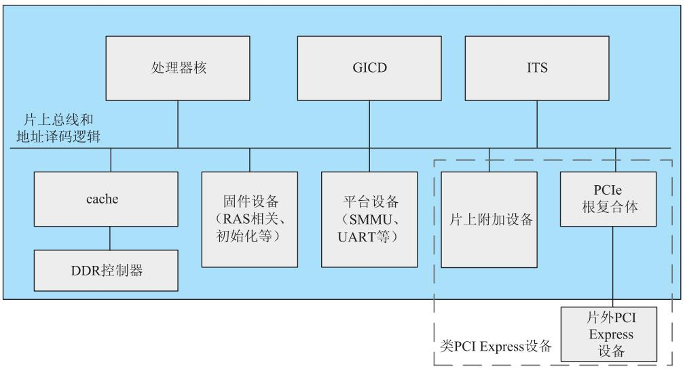
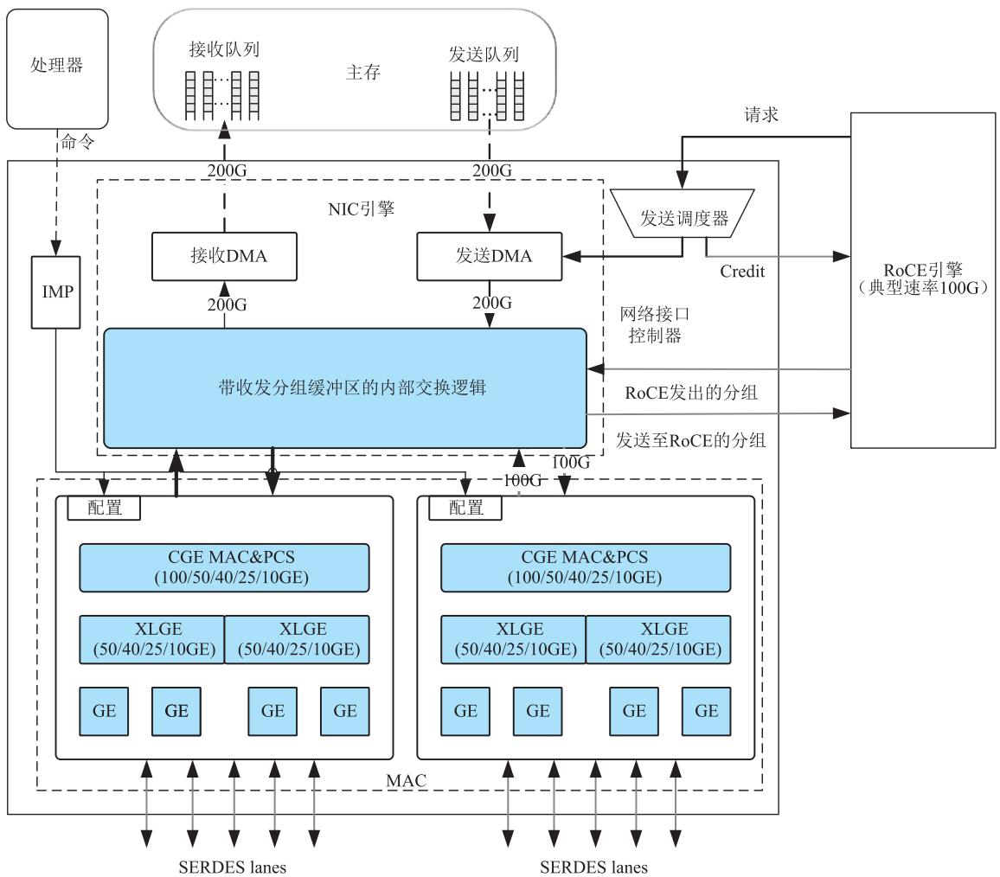
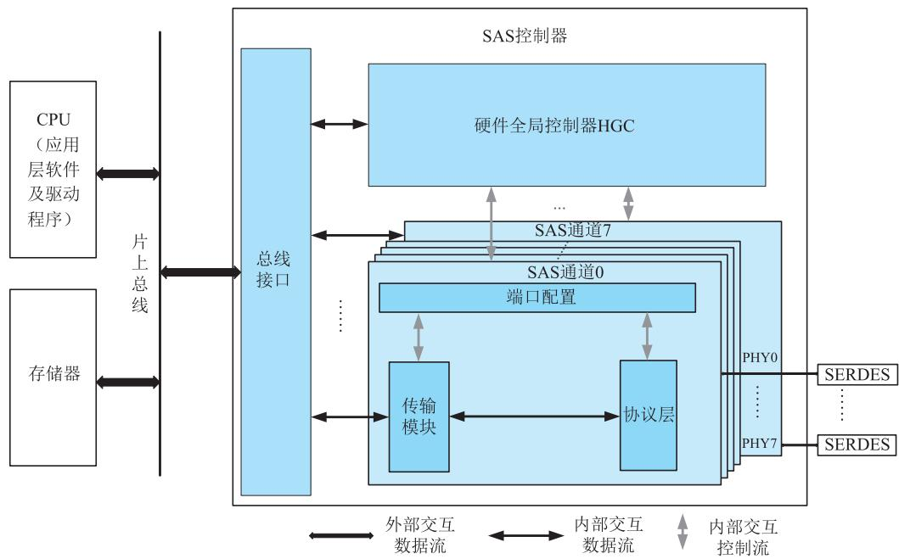
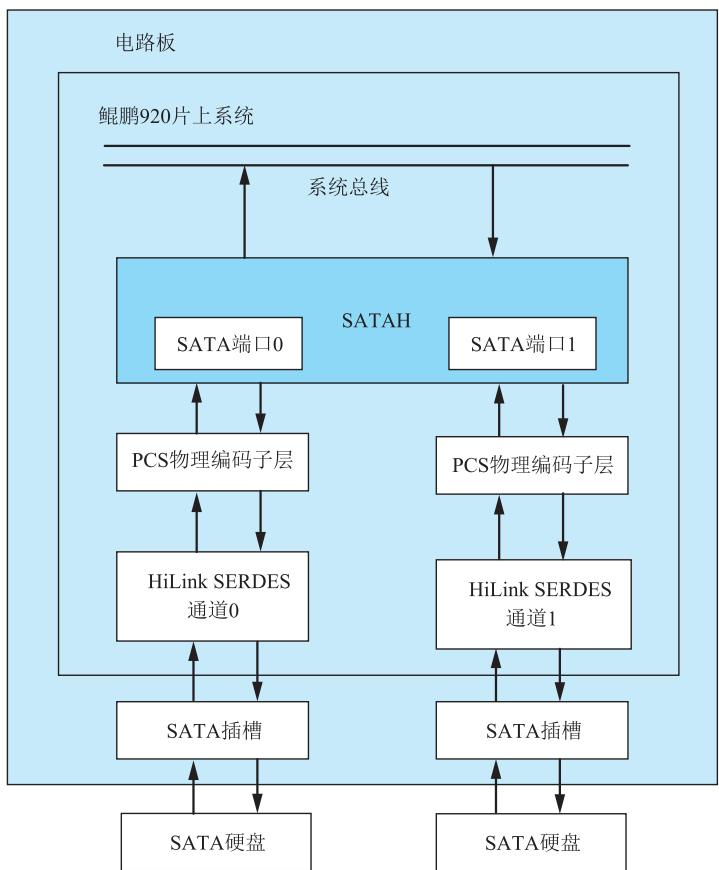

# 第8章-8.5 鲲鹏920处理器片上系统的设备与输入输出子系统

## 基本信息
- **课程**：计算机组成原理
- **章节**：第8章 输入/输出系统 - 8.5 鲲鹏920处理器片上系统的设备与输入输出子系统
- **日期**：2026-06-20
- **标签**：#输入输出系统 #鲲鹏920 #片上系统 #PCIe #网络子系统

## 重点内容

### ⭐⭐⭐ 核心考点
1. **鲲鹏920片上系统的三类片上设备** - 固件设备、平台设备、片上附加设备
2. **虚拟PCIe总线（VPB）机制** - 硬件虚拟化技术，支持物理PCIe设备资源的虚拟化
3. **网络子系统** - 组成和RDMA功能

### ⭐⭐ 重要概念
- PCIe系统拓扑作为基本的设备管理机制
- 外存储子系统：SAS和SATA控制器
- 片上设备的工作模式

---

## 详细笔记

### 8.5.1 鲲鹏920处理器片上系统概述

鲲鹏920处理器片上系统包含三类片上设备，采用PCIe系统拓扑作为基本的设备管理机制。

#### 📷 图8.22 鲲鹏920处理器芯片的逻辑结构示意图

> 📚 **课本出处**：图8.22 展示了鲲鹏920处理器片上系统的整体逻辑结构

---

### 8.5.2 片上设备类型

| 设备类型 | 功能描述 | 举例 |
|:--------|:--------|:-----|
| **固件设备** | 支持系统功能模式、参数配置和引导加载初始化 | BIOS、UEFI运行时服务访问的寄存器 |
| **平台设备** | 为系统服务的标准设备 | SMMU、GIC、看门狗定时器、UART等 |
| **片上附加设备** | 可被类似功能设备替换的部件 | 网络接口卡控制器、USB控制器等 |

**固件设备特点**：
- 支持DDR存储器初始化
- 系统地址译码
- SERDES部件初始化
- 操作系统和驱动程序一般不直接访问

**平台设备特点**：
- 包括系统设备控制器（SMMU、GIC、看门狗）
- 包括对外通信接口（UART等）

**片上附加设备特点**：
- 负责系统与外部互联互通
- 大多数按标准PCI设备模式工作

---

### 8.5.3 虚拟PCIe总线

#### 1. VPB机制

鲲鹏920利用**虚拟PCIe总线（VPB）**机制管理片上设备。对处理器内核而言，片上设备就是PCIe总线上的设备。

**工作流程**：
1. 通过PCIe标准的枚举流程，片上设备映射为PCIe总线的端点
2. 通过PCIe总线的ECAM进行配置

#### 2. 中断请求方式

支持两种中断请求方式：

| 方式 | 说明 |
|:-----|:-----|
| **PCI INTx仿真** | 传统引脚中断方式 |
| **MSI/MSI-X** | 消息信号中断，通过片上总线及Hydra接口传递 |

**MSI/MSI-X消息传递路径**：
1. MSI/MSI-X消息通过片上总线及Hydra接口传递
2. 到达中断翻译服务部件ITS
3. ITS将MSI/MSI-X翻译为LPI中断
4. 路由至通用中断控制器转发器GIDR

#### 3. PCIe控制器

- 片内包含多个根端口的逻辑电路
- 每个根端口对软件而言是一个虚拟的PCI-PCI桥
- 可灵活配置：×16链路可配置为1个×16或4个×4根端口
- 支持热插拔功能，通过I²C总线获取插槽硬件状态
- 通过AMBA总线与系统总线相连

---

### 8.5.4 网络子系统

#### 📷 图8.23 鲲鹏920网络子系统内部架构

> 📚 **课本出处**：图8.23 展示了鲲鹏920网络子系统的内部架构，包括NIC引擎和RoCEE

#### 1. 网络子系统组成

由两部分构成：
- **NIC（网络接口控制器）**：实现常规以太网通信功能
- **RoCEE（RoCE引擎）**：通过硬件实现RDMA功能

#### 2. 网络接口控制器（NIC）

**对外接口**：
- PCIe接口
- ARM总线/DJTAG接口
- RMII接口
- 10条SERDES信号线

**NIC引擎核心功能**：
- **发送方向**：软件设置发送队列指针，NIC引擎从主机内存取数据并传输
- **接收方向**：NIC引擎接收分组并写入主机内存
- 负责提出中断请求并上报队列指针状态

**发送调度器**：
- 根据流量分类的带宽限制进行调度
- 协调主机、虚拟功能单元、TC和队列之间的发送安排

**内部模块**：
- 带收发分组缓冲区的内部交换逻辑
- TxDMA：将分组送入分组队列
- RxDMA：从处理器主存加载分组至分组队列
- MAC：支持以太网帧收发、CRC计算和校验、流量控制等

**MAC配置**：
- 8个MAC，连接外部10条SERDES lanes
- 支持三种端口速率模式：CGE、LGE和GE

#### 3. RoCE引擎（RoCEE）

- 基于RoCE协议
- 通过硬件实现传输层和网络层的RDMA功能
- 用于卸载处理器片上系统的负荷

---

### 8.5.5 外存储子系统

#### 1. SAS控制器

**功能**：主机和外存设备之间的接口控制器

**内部模块**：

| 模块 | 功能 |
|:-----|:-----|
| **HGC（硬件全局控制器）** | 接收并解析软件I/O命令，管理和调度多重I/O请求 |
| **SAS通道** | 实现SAS/SATA协议各层功能，完成帧收发 |
| **总线接口** | 控制通道接口（配置寄存器）+ 数据通道接口（传输命令和数据） |

**对外接口**：
- 每个SAS控制器支持8个SAS物理层(PHY)
- 对外提供8个SERDES差分线对的模拟接口

**协议支持**：
- SAS 3.0协议：传输层、链路层、端口层、物理层
- SATA 3.0协议：传输层、链路层、物理层

#### 📷 图8.24 鲲鹏920的片内SAS控制器结构

> 📚 **课本出处**：图8.24 展示了鲲鹏920片内SAS控制器的结构

#### 2. SATA主机控制器

- 配置了两个SATA端口
- 实现AHCI规范下系统存储器和串行ATA设备之间的通信

#### 📷 图8.25 鲲鹏920的SATA主机控制器结构

> 📚 **课本出处**：图8.25 展示了鲲鹏920的SATA主机控制器结构

---

## 疑问与思考

1. 鲲鹏920为什么采用虚拟PCIe总线来管理片上设备？
2. MSI/MSI-X消息信号中断相比传统引脚中断有什么优势？
3. RoCE技术如何通过硬件卸载CPU的网络处理负荷？

## 相关链接

- 上一节：[第8章-8.4-DMA方式](./第8章-8.4-DMA方式.md)
- 下一节：[第8章-8.6-I/O系统设计](./第8章-8.6-I/O系统设计.md)
- 课本插图：
  - [图8.22 鲲鹏920处理器芯片的逻辑结构示意图](#📷-图822-鲲鹏920处理器芯片的逻辑结构示意图)
  - [图8.23 鲲鹏920网络子系统内部架构](#📷-图823-鲲鹏920网络子系统内部架构)
  - [图8.24 鲲鹏920的片内SAS控制器结构](#📷-图824-鲲鹏920的片内sas控制器结构)
  - [图8.25 鲲鹏920的SATA主机控制器结构](#📷-图825-鲲鹏920的sata主机控制器结构)
