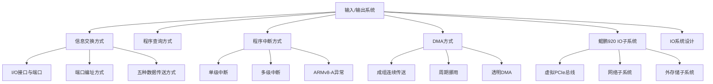

# 第8章 输入/输出系统

## 基本信息
- **课程**：计算机组成原理
- **章节**：第8章 输入/输出系统
- **日期**：2026-06-20
- **标签**：#输入输出系统 #IO系统 #中断 #DMA #程序查询

## 章节结构

```
第8章 输入/输出系统
├── 8.1 CPU与外设之间的信息交换方式
│   ├── 8.1.1 输入/输出接口与端口
│   ├── 8.1.2 输入/输出操作的一般过程
│   ├── 8.1.3 I/O接口与外设间的数据传送方式
│   └── 8.1.4 CPU与I/O接口之间的数据传送
├── 8.2 程序查询方式
├── 8.3 程序中断方式
│   ├── 8.3.1 异常和中断的基本概念
│   ├── 8.3.2 中断服务程序入口地址的获取
│   ├── 8.3.3 程序中断方式的基本I/O接口
│   ├── 8.3.4 单级中断
│   ├── 8.3.5 多级中断
│   └── 8.3.6 ARMv8-A架构的异常与中断
├── 8.4 DMA方式
│   ├── 8.4.1 DMA的基本概念
│   ├── 8.4.2 DMA传送方式
│   ├── 8.4.3 基本的DMA控制器
│   └── 8.4.4 选择型和多路型DMA控制器
├── 8.5 鲲鹏920处理器片上系统的设备与输入输出子系统
│   ├── 8.5.1 片上设备类型
│   ├── 8.5.2 虚拟PCIe总线
│   ├── 8.5.3 网络子系统
│   └── 8.5.4 外存储子系统
└── 8.6 I/O系统设计
    └── 时延约束与带宽约束
```

## 知识框架



## 核心概念与公式

### 一、I/O系统的五种控制方式

| 方式 | 控制者 | CPU参与 | 速度 | 适用 |
|:-----|:------|:--------|:-----|:-----|
| 无条件传送 | 硬件 | 直接读写 | 极低 | 简单设备 |
| 程序查询 | CPU程序 | 主动轮询 | 低 | 低速设备 |
| 程序中断 | CPU+硬件 | 响应中断 | 中 | 随机请求 |
| DMA | DMA控制器 | 不直接参与 | 高 | 高速批量数据 |
| 通道/IOP | 专用处理器 | 启动/结束 | 很高 | 复杂I/O管理 |

### 二、中断系统的核心要素

**四个标志触发器**：
- RD（准备就绪）
- EI（允许中断）
- IR（中断请求）
- IM（中断屏蔽）

**中断处理四问题**：
1. 指令执行完毕才受理
2. 保存现场（PC、状态）
3. 中断屏蔽（IM控制）
4. 硬件与软件结合

### 三、DMA三种传送方式

| 方式 | 总线控制 | CPU状态 | 特点 |
|:-----|:--------|:--------|:-----|
| 成组连续传送 | DMA批量控制 | 基本停止 | 控制简单，内存有闲置 |
| 周期挪用 | 逐周期申请 | 正常执行 | 效率较高，广泛采用 |
| 透明DMA | 固定分时 | 完全并行 | 效率最高，CPU无感知 |

### 四、例8.5核心公式

**CPU最大I/O速度**：
$$f_{CPU} = \frac{\text{指令执行速率}}{\text{每次I/O指令数}}$$

**总线最大I/O速度**：
$$f_{BUS} = \frac{\text{总线带宽}}{\text{每次I/O字节数}}$$

**磁盘访问时间**：
$$T_{disk} = \text{寻道+旋转} + \frac{\text{传输大小}}{\text{传输带宽}}$$

---

## 各节笔记链接

- [8.1 CPU与外设之间的信息交换方式](./第8章-8.1-CPU与外设之间的信息交换方式.md)
- [8.2 程序查询方式](./第8章-8.2-程序查询方式.md)
- [8.3 程序中断方式](./第8章-8.3-程序中断方式.md)
- [8.4 DMA方式](./第8章-8.4-DMA方式.md)
- [8.5 鲲鹏920处理器片上系统的设备与输入输出子系统](./第8章-8.5-鲲鹏920处理器片上系统的设备与输入输出子系统.md)
- [8.6 I/O系统设计](./第8章-8.6-I-O系统设计.md)

## 相关链接

- 上一章：[第7章-存储系统](../第7章-存储系统/第7章-存储系统.md)
- 下一章：[第9章-并行组织与结构](../第9章-并行组织与结构/第9章-并行组织与结构.md)
- [总结复习](../../总结复习/总结-第8章-输入输出系统.md)
