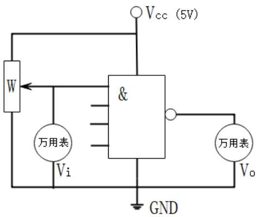

姓名： 张三丰

学号： 0123456789

学院： 计算机与电子信息学院

专业： 计算机科学技术

班级： 242 班

时间： 2026 年 X 月 XX 日

指导教师： XXX

【以上宋体

小四号字，固定行距20磅，靠右，注意保持原格式上下对齐】

# 实验名称： 寄存器实验

【实验名称黑体二号字，居中】

# 一、实验目的 【计 5 分，黑体小三号字，靠左】

1、AAAAAAAA； 【宋体小四号字，固定行距 20 磅，靠左缩进两个中文位置】  
2、BBBBBBBBB；  
3、CCCCCCCCC。

# 二、实验原理 【计 10 分，黑体小三号字，靠左】

【参考理论教材和实验指导书，简要描述支撑该实验的相关技术原理。宋体小四号字，固定行距20磅，段落开头靠左缩进两个中文位置】

# 三、实验设备及器件【计5分，黑体小三号字，靠左】

1、软件 Dream Logic 2019； 【宋体小四号字，固定行距20磅，靠左缩进两个中文位

置】

2、元器件：AAA 数量 X、BBB 数量 X、CCC 数量 X。

# 四、实验内容与过程 【计 60 分，黑体小三号字，靠左】

1、实验任务1【宋体小四号字，固定行距20磅，靠左缩进两个中文位置】

（1）实验任务描述  
【宋体小四号字，固定行距20磅，段落开头靠左缩进两个中文位置，其他类同】  
（2）实验步骤

【描述各实验步骤，有图表的引用等，如有表达式，要有推导过程。图表引用按以下示例方式书写】

【图表引用示例：……电路按图1-3连接，按表1-3所列输入电压值，逐点的进行测量 。 。 将测试结果在表1-3中记录，

（3）实验任务总结  
（4）电路图、截图及实验数据表等

【图表书写示例：】

  
图 1-3【楷体五号字，居中，位于图下方】

表1-3【楷体五号字，居中，位于表上方】  

<table><tr><td>\(V_{i\dot{\iota}}(V)\)</td><td>0</td><td>0.3</td><td>0.5</td><td>1.0</td><td>1.1</td><td>1.2</td><td>1.3</td><td>1.4</td><td>1.5</td><td>1.6</td><td>1.7</td><td>1.8</td><td>1.9</td><td>2.0</td><td>2.4</td></tr><tr><td>\(V_{0}(V)\)</td><td></td><td></td><td></td><td></td><td></td><td></td><td></td><td></td><td></td><td></td><td></td><td></td><td></td><td></td><td></td></tr></table>

2、实验任务2【宋体小四号字，固定行距20磅，靠左缩进两个中文位置】

【同上】

3、实验任务3【宋体小四号字，固定行距20磅，靠左缩进两个中文位置】

【同上】

# 五、实验收获与心得【计15分，黑体小三号字，靠左】

1、【本次实验达到了哪些实验目的，检查整个实验有什么收获。宋体小四号字，固定行距20磅，靠左缩进两个中文位置】

2、【心得体会，实验中碰到的困难、解决方法等。宋体小四号字，固定行距20磅，靠左缩进两个中文位置】

六、思考与练习【选做，最多加 5 分，但报告分数不超 99。黑体小三号字，靠左】

1、题 1 内容

答：

2、题2内容

答：

七、附录【计5分，使用到的元器件管脚图及功能说明、完整程序代码等。黑体小三号字，靠左】

1、XXX管脚图及功能说明  
2、XXX 管脚图及功能说明

【实验报告中，务必要删除各个带粗中括号部分的红色提示内容】