# 计算机组成原理

# 实验指导


# 目录

实验简介.....   
实验 1 实验环境的使用...  
实验 2 寄存器实验... . 14   
实验 3 运算器实验.... . 22   
实验 4 程序计数器实验... . 28  
实验 5 存储器实验... . 33   
实验 6 控制器实验.... . 37  
实验 7 数据通路实验... . 42  
实验 8 中断实验.... . 50  
实验 9 指令和微指令设计实验..... . 56  
实验 10 阵列乘法器实验..... .. 62   
课程设计..... .. 67  
附录 A DM1000 八位模型机规格说明.. .71  
附录 B 数字电路实验芯片功能说明.. .78

加法计数器 74LS161.. .. 78  
优先编码器 74LS148.. . 79  
3-8 译码器 74LS138.. .. 80  
7 段数码显示器 74LS48... . 81  
4 位超前进位加法器 74LS283.. . 82  
4 位算术逻辑运算器 74LS181.. . 83  
D 触发器... ..84   
JK 触发器.. ..84   
SR 触发器.. .. 85   
T 触发器.. .. 85   
四位双向移位寄存器 74LS194. . 86  
8 选 1 数据选择器 74LS151D....... ... 87  
二-五进制计数器 74LS90... .. 88  
桶形移位器.. .. 88

# 实验简介

计算机组成原理实验是在八位模型机 DM1000 上开展的。可将组成原理实验划分为五个阶段：

第一阶段包含了第一个实验《实验环境的使用》。在该实验中，读者首先要掌握 Dream Logic软件的基本使用方法，并从整体上了解一下 DM1000 八位模型机的特点，同时也需要学习 DM1000汇编程序编译、加载到运行的整个过程。

第二阶段包含《寄存器实验》、《运算器实验》、《程序计数器实验》、《存储器实验》、《控制器实验》，每一个实验对应于 DM1000 中的一个子模块。完成这些实验后，读者就可以掌握 DM1000每个子模块的功能和内部原理。并且通过仿真运行与各个子模块紧密相关的指令，读者将进一步理解各个子模块在整机中的分工与协作。

第三阶段包含《数据通路实验》，通过该实验，读者可从数字电路的角度观察数据传送的通道，学习数据通路是如何由控制器模块输出的各个控制信号建立起来的。通过搭建起的数据或地址信息通路，数据或地址信息在各个模块之间完成运算或转移。在实验的最后，希望读者能够理解微指令的本质就是数据通路，并能根据一条微指令的功能设计其数据通路，并得到微指令的机器码。

第四阶段包含《中断实验》，中断是计算机发展过程中的一个里程碑，其率先将并行工作的理念引入计算机，大大提高了 CPU的效率。在本实验中，读者首先通过跟踪软中断指令的执行和中断返回过程，理解软中断的实现机制。然后通过在 DM1000中加入一个中断控制器子模块，从而实现 8 级中断请求以及中断嵌套，通过单步运行指令，读者可看到硬中断从触发到响应，再到中断服务程序的运行以及中断返回的整个过程，从而加深对中断机制以及中断处理概念的理解。

第五阶段包含《指令和微指令设计实验》、《阵列乘法器实验》，读者将有机会从整个系统的角度重新审视 DM1000 模型机。在这些实验中，读者需要以 DM1000 模型机已有的指令为基础，为扩展的新指令设计数据通路、构造微指令的机器码，并编写指令对应的微程序，从而实现新指令的功能。通过这些实验，读者将加深对微指令和指令的理解，明白不同的数据通路（微指令）通过组合来完成不同的功能（指令），设计新的指令就是将指令功能分解为微指令的过程。

# 实验 1 实验环境的使用

实验性质：验证

建议学时：2学时

# 实验目的

掌握 Dream Logic 软件的基本使用方法。  
了解 DM1000模型机汇编程序的编写方法，并学习将汇编源程序编译为机器指令的方法。  
了解 DM1000模型机的微指令，并学习将微指令程序编译为微程序的方法。  
掌握 DM1000模型机加载指令程序和微指令程序的方法。  
 熟练掌握原理图中使用网络、端口、总线等在器件、模块间建立连接的方法，掌握模块化电路的设计方法。  
熟练掌握 DM1000模型机进行单周期仿真的方法，并了解各个工具窗口以及它们的作用。

# 二、 预备知识

# 2.1 机器语言

机器语言是机器指令的集合。机器指令展开来讲就是一台机器可以正确执行的命令。电子计算机的机器指令是一列二进制数字。计算机将之转变为一列高低电平，以使计算机的电子器件受到驱动，进行运算。

每一种微处理器，由于硬件设计和内部结构的不同，就需要不同的电平脉冲来控制，使它工作。所以每一种微处理器都有自己的机器指令集，也就是机器语言。

早期的程序设计均使用机器语言。程序员将用 0、1 数字编成的程序代码打在纸带或卡片上，1打孔，0 不打孔，再将程序通过纸带机或卡片输入计算机。

例如，如果使用 Intel 8086 CPU 完成运算 s = 768+12288-1280，机器码如下：

```txt
101100000000000000000011  
00000101000000000110000  
00101101000000000000101 
```

# 2.2 汇编语言

由于机器语言难于辨别和记忆，于是汇编语言产生了。汇编语言的主体是汇编指令。汇编指令和机器指令的差别在于指令的表示方法上。汇编指令是机器指令便于记忆的书写格式。

例如：Intel 8086 CPU 的机器指令 1000100111011000 表示把寄存器 BX 的内容送到 AX 中（寄存器，简单地讲是 CPU中可以存储数据的器件，一个 CPU中可能有多个寄存器。AX 是其中一个寄存器的代号，BX是另一个寄存器的代号。）。汇编指令则写成 mov ax，bx。显然，这样的写法更便于阅读和记忆。

操作：寄存器 BX 的内容送到 AX中

机器指令：1000100111011000

汇编指令：mov ax，bx

计算机能读懂的只是机器指令，那么如何让计算机执行用汇编指令编写的程序呢？这时，就需要一个能够将汇编指令转换成机器指令的翻译程序，这样的程序我们称其为汇编器或编译器。程序员用汇编语言写出源程序，再用汇编编译器将其译为机器码，由计算机最终执行。图 1-1中描述了这个过程。

  
图 1-1：用汇编语言编写程序的工作过程

# 2.3 DM1000 八位模型机

Dream Logic 为读者提供了一个具有完整功能的八位模型机 DM1000。可将 DM1000 理解为一个具有 8位地址线宽、8 位数据线宽的微处理器。DM1000 模型机原理图如图 1-2所示：

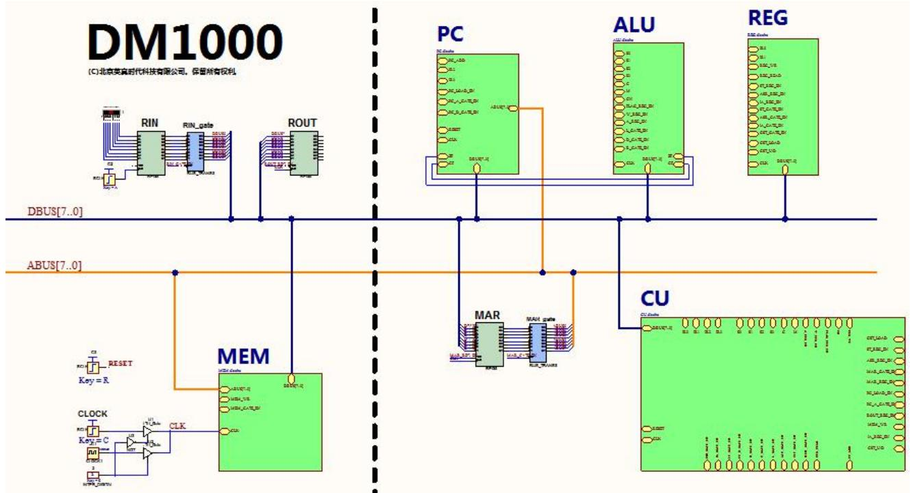  
图 1-2：DM1000 八位模型机原理图

DM1000 主要由以下几部分组成：

数据总线 DBUS和地址总线 ABUS。总线宽度均为 8位。由于地址总线只有 8 位，所以最多只能访问 256字节的物理地址。  
控制信号。控制信号并没有设计成控制总线的方式，只是一组控制信号线的集合。  
程序计数器 PC。  
运算器 ALU。用于处理 8 位数据的算术运算和逻辑运算。  
寄存器 REG。所有的寄存器都可以存储 8位数据（一个字节）。  
主存储器 MEM。其中提供了 256个字节的存储容量。  
控制器 CU。  
输入寄存器 RIN  
输出寄存器 ROUT  
地址寄存器 MAR

# 2.4 DM1000 的指令集

DM1000 有一套完整的指令集，详情请查看附录 A 中的表 A-4。DM1000的指令集与 Intel $\times 8 6$ 处理器提供的指令十分类似，所使用的汇编语言的语法也类似，如果读者之前系统的学习过 Intel $\times 8 6$ 汇编语言的

相关课程，就可以很轻松的掌握 DM1000 的指令集，并可以开始使用这些指令为 DM1000编写汇编程序。

下面显示的是一段使用 DM1000 汇编指令编写的汇编源程序，程序分为代码段和数据段。代码段的开始位置用关键字.text标出，而数据段的开始位置用关键字.data 标出。

```txt
.text ；代码段  
mov r0,16 ；将立即数16赋值给通用寄存器r0  
mov a，num ；将标号num指定的主存储器单元内容复制到累加器a中  
add a,r0 ；将累加器a的值与通用寄存器r0的值相加，结果写回累加器a中  
.data ；数据段  
num:-1
```

# 2.5 DM1000 的微指令

DM1000 在执行一条指令时，会将其分为多个步骤即多条微指令，一个时钟周期执行一条微指令。

以指令“add a，r0”为例，可以分为以下步骤：

1. 取指。取指是所有指令执行的第一步，该步骤将程序计数器 PC 在存储器中指向的一个字节取出，并将其写入指令寄存器 IR中。与此同时，CU模块将指令机器码中的高 6 位扩展为 16位，作为微程序计数器 uPC的值，使 uPC转去执行该指令对应的微程序。  
2. 将寄存器 r0 的值送到工作寄存器 w 中。  
3. ALU 将累加器 a 与工作寄存器 W 的值相加，并将结果写回累加器 a 中。  
4. 指令执行完毕，程序计数器 PC 加 1，指向下一条指令。

其对应的微指令如下所示：

```txt
path [pc], ir ；取指。注意，所有指令共用此条取指微指令。
```

```txt
··· 
```

```txt
path rx, w ；将通用寄存器rx的值传送到工作寄存器W中。
```

```txt
path alu_add, a; 将累加器 A 与寄存器 W 的值相加，结果写回 A 中。
```

inc pc ；程序计数器 $\mathrm{PC + 1}$ ，指向下一条指令。

```txt
reset upc ；将微程序计数器复位，指向共用的取指微指令，准备取出下一条指令。
```

# 三、 实验内容

请读者按照下面的步骤完成实验内容，着重理解DM1000八位模型机执行指令的基本过程，并掌握DreamLogic 软件和 CodeCode.net平台的基本使用方法，为完成后续实验做好准备。

# 3.1 从 CodeCode.net 平台领取任务

CodeCode.net平台是用于教师在线布置实验任务，并统一管理学生提交的作业的平台。如果没有使用到 CodeCode 平台，可以跳过此部分，直接从 3.2 节继续进行实验。

1. 读者通过浏览器访问 https://www.codecode.net，可以打开 CodeCode.net 平台的登录页面。  
2. 在登录页面中，读者输入帐号和密码，点击“登录”按钮，可以登录 CodeCode.net 平台。  
3. 登录成功后，在“课程”列表页面中，可以找到计算机组成原理相关的实验课程。点击此课程的链接，可以进入该课程的详细信息页面。  
4. 在课程的详细信息页面中，可以查看课程描述信息，该信息对于完成实验十分重要，建议读者认真阅读。点击左侧导航中的“任务”链接，可以打开任务列表页面。  
5. 在任务列表中找到本次实验对应的任务，点击右侧的“领取任务”按钮，可以进入“领取任务”页面。  
6. 在“领取任务”页面中，查看任务信息后，填写“新建项目名称”和“新建项目路径”，然后选择“项目所在的群组”，点击“领取任务”按钮后，可以创建个人项目用于完成本次实验，并自动跳转到该项目所在的页面。

提示：在“领取任务”页面中，“新建项目名称”和“新建项目路径”这两项的内容可以使用默认值，如

果选择的群组中已经包含了名称或者路径相同的项目，就会导致领取任务失败，此时需要修改新建项目名称和新建项目路径的内容。

7. 在个人项目页面中，包括左侧的导航栏、项目信息、文件列表、readme.md 文件内容等，如图 1-3所示。  
8. 在个人项目页面的图 1-3中，点击红色方框中的按钮，可以复制当前项目的 URL，在本实验后面的练习中会使用这个 URL将此项目克隆到读者计算机的本地磁盘中，从而供读者进行修改。

提示：领取任务的本质是：教师在新建任务时填写了实验模板的 URL，然后读者在领取任务时，根据任务中记录的 URL来派生（Fork）出一个新的项目，供读者在其中进行修改。

# 建议教师按照下面的步骤在 CodeCode.net 平台上布置此次实验任务：

1. 在计算机组成原理实验课程中，新建一个实验任务。  
2. 在“新建任务”页面中，教师需要添写“任务名称”，推荐使用“实验 1 实验环境的使用”；还需要填写“模板项目 URL”，应该使用

“https://www.codecode.net/engintime/Dream-Logic/Project-Template/DM1000/DM1000.git”。   
3. 点击“新建任务”按钮，完成新建任务操作。

  
图 1-3：个人项目页面

# 3.2 启动 Dream Logic

在安装有 Dream Logic 的计算机上，可以使用两种方法来启动 Dream Logic：

在桌面上双击“Engintime Dream Logic”图标。

或者

点击“开始”菜单，在“所有程序”中的“Engintime Dream Logic”中选择“Engintime DreamLogic”即可启动程序。

启动 Dream Logic 后会首先打开“登录”窗口，可以使用两种方法完成登录。

如果读者在CodeCode.net平台上注册了帐号，在连接互联网的情况下，可以使用CodeCode.net 平台中已注册的用户名和密码进行登录。  
 如果读者还没有 CodeCode.net 平台上的帐号，可以点击左下角“从加密锁获取授权”按钮，获取授权之后，完成登录。

# 3.3 将 CodeCode.net 平台上的 DM1000 八位模型机项目克隆到本地

如果读者从 CodeCode.net 平台领取了任务，可以在领取任务后将读者的个人项目克隆到本地磁盘中；如果读者没有 CodeCode.net平台账号无法领取任务，可以直接将实验模板项目克隆到本地磁盘中。

# 将领取任务新建的个人项目克隆到本地

1. 选择 Dream Logic 菜单“文件 $\cdot { - } \rangle$ 新建 $\Rightarrow$ 从 Git 远程库新建项目”，打开“从 Git远程库新建项目”对话框。  
2. 在“Git远程库 URL(G)”中填入读者个人项目的 Git远程库的 URL地址（在图 1-3中，点击红色方框中的按钮，可以复制当前项目的 URL）。  
3. “项目文件夹名称”填入“DM1000”。  
4. “项目位置”选择新建项目需要保存到的磁盘目录。  
5. 点击“确定”按钮后会弹出一个 Windows控制台窗口，并开始运行 Git克隆命令将 Git远程库克隆到本地，一定要等克隆成功后再关闭该窗口。  
6. 克隆项目成功后，在对话框中选择“克隆成功，打开新建项目”就可以打开新建的项目。

# 直接将实验模板项目克隆到本地

由于 CodeCode.net 平台上提供的实验模板是开放的，所有的人都可以访问。所以，Dream Logic 可以直接将 DM1000 八位模型机实验模板克隆到本地磁盘。步骤如下：

1. 选择 Dream Logic菜单“文件->新建->从 Git远程库新建项目”，打开“从 Git远程库新建项目”对话框。  
2. 在“Git 远程库 URL(G)”中填入 DM1000 项目模板 Git 远程库的 URL 地址：https://www.codecode.net/engintime/Dream-Logic/Project-Template/DM1000/DM1000.git  
3. “项目文件夹名称”填入“DM1000”。  
4. “项目位置”选择新建项目需要保存到的磁盘目录。  
5. 点击“确定”按钮后会弹出一个 Windows控制台窗口，并开始运行 Git克隆命令将 Git远程库克隆到本地，一定要等克隆成功后再关闭该窗口。  
6. 克隆项目成功后，在对话框中选择“克隆成功，打开新建项目”就可以打开新建的项目。

# 注意：

1.为了能正常使用从 Git远程库新建项目功能，用户需要在本地安装 Git 客户端程序，并且在安装 Git的过程中会有一个步骤询问是否设置 Windows环境变量，此时一定要设置上 Windows环境变量。  
2. 文件路径中不允许包含中文，请读者在使用之初就养成使用英文命名项目或文件的习惯。

# 3.4 DM1000 八位模型机项目

打开新建的 DM1000模型机项目后，在左侧的“项目管理器”窗口中会显示 DM1000 项目中包含的所有文件。请读者根据表 1-1 了解每个文件的基本情况。

表 1-1：DM1000 项目中的文件  

<table><tr><td>文件夹或文件名称</td><td>说明</td></tr><tr><td>子模块</td><td>文件夹</td></tr><tr><td>ALU.dlsche</td><td>算术逻辑运算模块原理图文件</td></tr><tr><td>PC.dlsche</td><td>程序计数器模块原理图文件</td></tr><tr><td>REG.dlsche</td><td>寄存器模块原理图文件</td></tr><tr><td>CU.dlsche</td><td>控制模块原理图文件</td></tr><tr><td>MEM.dlsche</td><td>主存储器模块原理图文件</td></tr><tr><td>uPC_NEXT.dlsche</td><td>微程序计数器模块原理图文件</td></tr><tr><td>汇编源程序</td><td>文件夹</td></tr><tr><td>ram.asm</td><td>此文件中默认包含了一个简单的汇编语言源程序,作为示例程序提供给读者,读者可以修改此文件中的源代码,根据需要编写自己的汇编程序。</td></tr><tr><td>ram.bat</td><td>这是一个Windows批处理文件,运行此文件可以执行其中的命令让dmasm.exe编译器将ram.asm中的汇编代码编译为机器码,并写入存储器映射文件ram.rxm中,同时还会生成列表文件ram lst和调试信息文件ram.dbg。</td></tr><tr><td>微指令源程序</td><td>文件夹</td></tr><tr><td>rom.masm</td><td>此文件中包含了DM1000的全部微指令源程序。读者可以根据需要修改此文件,添加新的微指令。</td></tr><tr><td>rom.bat</td><td>这是一个Windows批处理文件,运行此文件可以执行其中的命令让microasm.exe编译器将rom.masm中的微指令源程序编译为机器码,并写入存储器映射文件rom.rxm中,同时还会生成列表文件rom lst和调试信息文件rom.dbg。</td></tr><tr><td>存储器映射文件</td><td>文件夹</td></tr><tr><td>ram.rxm</td><td>主存储器映射文件,其中包含了汇编程序生成的机器码。当DM1000开始运行时,此文件中的内容会被加载到MEM子模块的RAM中,从而允许DM1000执行其中的机器码。</td></tr><tr><td>rom.rxm</td><td>微指令存储器映射文件,其中包含了微指令源程序生成的机器码。当DM1000开始运行时,此文件中的内容会被加载到CU子模块的ROM中,从而允许DM1000将指令的机器码翻译为微指令的机器码并执行。</td></tr><tr><td>DM1000.dlsche</td><td>DM1000八位模型机的总图,由各个子模块、时钟和复位控制通过总线或网络连接,组成可运行程序的计算机系统。</td></tr></table>

除了以上可以从项目管理器中看到的文件之外，在项目文件夹中还有一些其它文件需要进行说明。读者可以在项目管理器窗口中右键点击项目节点（根节点），选择右键菜单中的“打开所在的文件夹”，DreamLogic 会使用 Windows资源管理器打开项目所在的文件夹，需要说明的文件参见表 1-2。

表 1-2：DM1000 项目文件夹中的其它文件  

<table><tr><td>文件名称</td><td>说明</td></tr><tr><td>DM1000.dlproj</td><td>项目文件</td></tr><tr><td>dmasm.exe</td><td>DM1000汇编程序的编译器。</td></tr><tr><td>dmasm.c</td><td>dmasm.exe 程序的的C源代码。</td></tr><tr><td>microasm.exe</td><td>DM1000微指令程序的编译器。</td></tr><tr><td>microasm.c</td><td>microasm.exe 程序的C源代码。</td></tr><tr><td>ram.dbg</td><td>DM1000汇编程序的调试信息文件。在使用dmasm.exe编译ram.asm文件时，会生成此文件。</td></tr><tr><td>ram.lst</td><td>DM1000汇编程序的列表文件。在使用dmasm.exe编译ram.asm文件时，会生成此文件。</td></tr><tr><td>rom.dbg</td><td>DM1000微指令程序的调试信息文件。在使用microasm.exe编译rom.masm文件时，会生成此文件。</td></tr></table>

rom.lst

DM1000 微 指 令 程 序 的 列 表 文 件 。 在 使 用microasm.exe 编译 rom.masm 文件时，会生成此文件。

这里还需要对 DM1000 的原理图 DM1000.dlsche 进行一些说明：

1. 此原理图是 DM1000 的顶层原理图，其通过总线将各个模块连接起来，这样大大简化了顶层原理图的复杂度，可以使读者很清晰的掌握各个模块间的连接关系，快速掌握 DM1000 的整体结构。  
2. 在此原理图中遵守左面输入，右面输出的约定。模块左侧的总线表示输入；模块右侧的总线表示输出；模块顶部或底部的总线，表示模块既能从总线接收数据，又能向总线发送数据。  
3. 在此原理图中提供了时钟和复位两个控制信号。其中，复位信号可以使用键盘上的 R 键控制，每次复位都能使 DM1000 模型机从第一条指令开始执行程序。时钟提供了单步时钟和自动时钟，可以使用键盘上的 S键进行切换。单步时钟可以使用键盘上的 C 键控制，默认是高电平，也就是说每次按下 C 键，都会让单步时钟变为低电平，并产生一个下降沿，抬起 C 键会让单步时钟恢复为高电平，并产生一个上升沿。  
4. 除了使用总线连接各个模块的接口外，各个模块的接口还通过使用相同的名称表示它们具有连接关系。为了确保原理图简洁清晰，PC/ALU/REG 等模块的输入信号都是通过这种方式与 CU模块输出的控制信号进行连接的。  
5. 总图中的模块是通过子模块文件的名称与之对应的，例如读者使用鼠标左键点击选中REG模块后，在右侧的“属性”窗口中就会显示此模块的所有属性，其中“模块原理图文件”的属性值为“REG.dlsche”，说明此模块是与原理图文件 REG.dlsche 对应的。

提示：用鼠标左键双击总图中的模块，就会自动跳转到对应的子模块原理图文件，在子模块原理图文件中的空白处双击鼠标左键，就会返回到总图中，这样操作起来十分方便。

提示：如果读者是第一次使用 Dream Logic，请务必在本书第一部分的实验一中找到原理图常用操作的介绍内容，并自行练习，为后面的实验内容做好准备。

# 3.5 练习使用 DM1000 运行一个简单的汇编程序

接下来，本实验会带领读者使用 DM1000 运行一个简单的汇编程序，为后续的实验打下一个坚实的基础。

首先请读者学习一下如何为 DM1000 编写汇编程序：

1. 打开项目下的汇编源程序文件 ram.asm，结合附录 A 中表 A-4的内容，熟悉每一条指令的功能。  
2. 读者在后面的实验过程中，可以在 ram.asm文件中根据需要编写新的汇编程序。  
3. 汇编程序编写完毕后，可以在“项目管理器”中的 ram.bat文件上点击右键，选择菜单中的“运行批处理文件”即可完成对 ram.asm文件的编译。如果在弹出的 Windows控制台窗口中，没有报告任何语法错误信息，就说明编译成功了，并且会在最后显示成功生成的文件名称，包括存储器映射文件 ram.rxm，列表文件 ram.lst 和调试信息文件 ram.dbg。

读者可以按照下面的步骤练习如何修改汇编程序中的语法错误：

1. 首先将 ram.asm 中汇编指令 mov r0, 16中的寄存器 r0 删除后保存文件。  
2. 接着按照之前介绍的方法对汇编程序文件进行编译，在 Windows控制台窗口中会提示汇编文件中的 mov 指令缺少操作数，并提示出存在语法错误的文件名称和行号。  
3. 根据语法错误提示信息，修改汇编程序后保存。  
4. 重新编译汇编程序文件，确保可以成功。

DM1000 提供的微指令程序 rom.masm 文件的编译方法与汇编程序文件的类似，只是换为用 rom.bat 批处理文件进行编译，请读者自行练习，并注意查看微指令程序在编译过程中生成了哪些文件。接下来，读者可以按照下面的步骤了解一下汇编程序生成的文件，以及微指令程序生成的文件是如何在 DM1000 中使用的：

1. 在 DM1000.dlsche 原理图中，在主存储器单元 MEM 模块上双击可以打开此模块对应的原理图MEM.dlsche 文件。  
2. MEM.dlsche 文件中的 RAM是主存储器，用于存储 DM1000 在运行过程中所需的指令和数据。用鼠标左键选中 RAM，可以在右侧的属性窗口中查看此器件的所有属性。  
3. 在 RAM 属性中的“调试”节点下，读者可以看到“存储器映射文件”属性已经默认设置为 ram.rxm。这样，当 DM1000 启动仿真时，就会将 ram.rxm 文件中的内容加载到 RAM 中，作为指令和数据。读者可以选中此属性后，点击属性值右侧的按钮，在弹出的对话框中为 RAM指定其他的存储器映射文件。当然，在一般情况下，读者不需要修改此属性值。  
4. 在 RAM 属性中的“调试”节点下，读者可以看到“调试信息文件”属性和“程序计数器名称”属性已经默认设置为 ram.dbg 和 PC。当 DM1000启动仿真时，会使用 ram.dbg 文件提供的调试信息和 PC 寄存器的值，在“源代码”窗口中为读者实时显示 DM1000 将要执行的指令。  
5. 在 MEM.dlsche 原理图文件的空白处双击鼠标左键，返回 DM1000 的总图中。  
6. 在 DM1000.dlsche 原理图中，双击控制单元 CU 模块打开 CU.dlsche 原理图。其中的 ROM 是微程序存储器，读者可以选中 ROM 查看其属性，并与之前观察的 RAM中的属性进行对照。  
7. 在 CU.dlsche 原理图文件的空白处双击鼠标左键，返回 DM1000的总图中。

现在，读者应该已经对 DM1000 有了一些初步的了解，但是这些了解都是静态的。接下来，读者可以按照下面的步骤对 DM1000 进行一次完整仿真，通过让 DM1000 运行一个简单的汇编程序，从而对 DM1000有一个动态的认识：

1. 首先，确保当前打开的是 DM1000.dlsche 原理图，然后选择菜单“仿真”中的“启动仿真”（快捷键 F5）。

注意：“启动仿真”功能总是对当前打开的原理图进行仿真，因此，启动仿真前一定要先打开需要仿真的原理图。

2. 在 DM1000 刚刚启动仿真时，按下 R键复位，将 PC和 uPC寄存器的值初始化为 0，这就会让 DM1000从汇编程序的第一条指令开始执行，同时也是从微指令的第一条指令开始执行。  
3. 选择“视图”菜单中的“寄存器”弹出“寄存器”窗口，在寄存器窗口中找到 PC 和 uPC 的值，确认其为 0，其中 PC 是 8 位计数器，uPC 是 16 位寄存器。在寄存器窗口中灰色的项目表示对应的寄存器没有使能，时钟上升沿到来时不会写入数据，而黑色的表示寄存器使能，时钟上升沿到来时，寄存器的输入传送到输出端（写入）。红色表示上个时钟上升沿到来时发生写入操作的寄存器。  
4. 在寄存器窗口中双击 PC计数器对应的项目，可以在原理图中迅速定位 PC寄存器的位置，请读者确认 PC 计数器的 EN管脚为低电平，表示 PC 计数器不使能，禁止计数；同时，PC 计数器的 8位输出数据线都为低电平，表示 PC计数器的值为 0。用相同的方法定位 uPC寄存器，并观察其各个管脚的电平。  
5. 选择“视图”菜单中的“存储器”弹出“存储器”窗口，选择此窗口工具栏下拉列表中的 RAM，可以查看 RAM存储器中的数据。RAM存储器的地址线和数据线都是 8 位的，窗口中的每一行表示一个字节，其中冒号左边的是 8 位地址值，冒号右边的是 8 位数据值。RAM存储器加载的数据应该是汇编程序生成的机器码，所以其中的数据应该与 ram.rxm存储器映射文件中的数据相同，读者可以选择“视图”菜单中的“项目管理器”弹出“项目管理器”窗口，然后双击 ram.rxm文件，使用二进制编辑器打开此文件，确认 ram.rxm文件中的数据与 RAM 中的数据相同。  
6. 在“存储器”窗口中具有灰色底色的行，表示存储器当前输入地址线以及输出数据线上的值。读者可以选择“存储器”窗口工具栏上的定位按钮，或者在窗口中单击右键，在弹出的右键菜单中点击“定位存储器”在原理图中迅速定位 RAM 存储器，并确认其地址线上的值为 0（此时，RAM地址线上的值是由 PC寄存器提供的），输出数据线上的值是 $0 \mathrm { { x } 8 C }$ 。由于此时正在从 RAM中读取数

据，所以其 WR 管脚为高电平。

7. 请读者按照前面步骤 5和步骤 6 的方法，在“存储器”窗口中查看 ROM存储器的值，并与微指令源程序生成的 rom.rxm文件中的内容进行比较，确认其一致。需要注意的是，ROM是微程序存储器，它存储的是地址和内容均固定的微指令，只能读出，不能写入。ROM 地址线上的值是由微程序寄存器 uPC提供的，ROM输出的就是一条 32位的微指令，微指令中的每一位都有特定的含义，主要作为控制信号。例如 ROM 的 Q25管脚输出的信号 MEM_WR接到 RAM的 WR 输入端，用于控制 RAM的读写操作。由于 ROM的地址线是 12 根，数据线是 32根，所以在“存储器”窗口中，ROM的一行数据包括 4 个字节。

在仿真过程中通过“寄存器”窗口、“存储器”窗口和原理图窗口可以观察到 DM1000 在运行过程中的各种状态，为了方便读者更好的理解 DM1000 的运行机制，DreamLogic 还提供了“源代码”窗口帮助读者从汇编指令和微指令的角度观察 DM1000 的运行过程，从而将汇编指令与处理器的行为更加紧密的联系起来，使读者可以在仿真的过程中同时从汇编指令和微指令的角度、从系统的角度（寄存器、存储器）、从数字电路的角度（时序逻辑、组合逻辑）加深对计算机组成原理的理解。

请读者按照下面的步骤学习“源代码”窗口的用法：

1. 在 DM1000 启动仿真后，默认会在左侧显示两个源代码窗口“源代码 1”和“源代码 2”。其中源代码 1 窗口默认显示 RAM存储器对应的汇编代码，也就是汇编程序 ram.asm 编译生成的列表文件ram.lst 中的内容；同样的，源代码 2 窗口默认显示 ROM 存储器对应的微指令源代码，也就是微指令源程序 rom.masm 编译生成的列表文件 rom.lst中的内容。

2. 先来看源代码 1 窗口中的内容，其一行源代码的内容可以分为四个部分：

```txt
0005 00 8C10 mov r0, 16 
```

最左侧的 0005，表示此条指令在源代码文件 ram.asm 中的第 5 行。  
第二部分 00，表示此条指令的机器码在存储器映射文件中的偏移地址为 0。  
第三部分 8C 10，表示此条指令的机器码，包含了两个字节（十六进制表示）。DM1000 八位模型机指令的机器码可以是单字节或双字节。  
第四部分 mov r0, 16是此条指令的汇编代码。此条指令会将立即数 16存入 r0 寄存器中。源代码 1窗口左侧的蓝色箭头表示 PC 计数器在存储器中指向的位置，由于 DM1000启动并复位后 PC 计数器的值为 0，所以蓝色箭头指向偏移为 0的代码行。请读者将源代码 1 窗口中指令的机器码与存储器窗口中 RAM的内存进行比较，确认其内容一致。

3. 源代码 2窗口中的格式：

```txt
0005 00 EF3F F9 FF path [pc],ir 
```

最左侧的 0005，表示此条微指令在微程序源文件 rom.asm 中的第 5 行。  
第二部分 00，表示此条微指令在 ROM 存储器中的偏移地址为 0。由于 DM1000 启动并复位后uPC寄存器的值为 0，所以蓝色箭头指向偏移为 0 的微指令。  
第三部分 EF 3F F9 FF是此条微指令的机器码（十六进制表示），共 4 个字节。DM1000 八位模型机微指令的机器码都是 4 字节。  
第四部分 path [pc], ir是此条微指令的代码。

这是一条取指微指令，它的功能是将当前 PC 指向的指令从主存储器 RAM 中取出放到数据总线 DBUS 上，在下个时钟上升沿到来时写入指令寄存器 ir 中暂存。任何一条指令执行的第一条微指令都是取指微指令，取指微指令的工作方式如下：

PC计数器向地址总线的输出三态门PC_gate使能，从而将PC计数器的值传送到地址总线ABUS上。  
. ABUS上的值作为 RAM存储器的地址，RAM存储器的读写控制端输入高电平，于是将 RAM当前地址指向存储单元的内容（一个字节指令机器码）读出。  
RAM存储器输出三态门 MEM_gate使能，从而将读出的指令字节码输出到数据总线 DBUS上。

微指令实质上是 32 位控制信号的编码，将取指微指令“path [pc], ir”对应的十六进制编码“EF 3F F9 FF”转换为 32 位二进制编码得“1110 1111 0111 1111 1111 1001 11111111”。这 32位编码依次对应于微程序存储器 ROM 输出的 32 位控制信号，32 位输出信号中绝大多数是低电平有效，而一条微指令中往往只有少数信号是有效的，因此在分析 ROM输出的信号时，通常只需考虑某几位低电平输出信号。

DM1000的控制单元 CU 接收并识别数据总线 DBUS上的指令机器码。经过解析，就得到了该指令对应的微程序入口地址。该入口地址在下个时钟上升沿到来时会写入微程序计数寄存器 uPC，于是转去执行微程序。上升沿到来的同时，也将数据总线 DBUS 上的指令字节码写入了指令寄存器 ir 中。该过程需要读者通过仿真，结合电路去加以理解，以此为基础，后续的其他微指令执行过程就容易理解了。

4. 在发送时钟上升沿执行指令对应微程序的入口微指令之前，请读者再次从工具窗口和原理图窗口中确认以下内容：

PC 寄存器的值 0 已经传送到地址总线 ABUS上；  
 RAM 存储器 0 地址处的值 $0 \mathrm { { x } 8 C }$ 已经通过了总线收发器 MEM_gate（可以在“总线收发器”窗口中查看总线收发器的值和使能状态，双击可迅速在原理图中定位总线收发器的位置）传送到数据总线 DBUS 上；  
 数据总线上的数据已经到达了 IR 寄存器输入端，且 IR寄存器使能端 EN 为低电平，写使能，当下个时钟上升沿到来时，IR 寄存器输入端的指令将被写入 IR寄存器中。  
指令字节 $0 \mathrm { { x } 8 C }$ 的高 6 位扩展为 $0 \mathrm { { x } 4 6 0 }$ （该指令对应微程序的入口地址，指向入口第一条微指令）并传送到 uPC 寄存器的输入端，uPC 寄存器使能（EN 低电平表示使能）。当下一个时钟上升沿到来时， $0 \mathrm { { x } 4 6 0 }$ 将写入微程序寄存器 uPC中，这样微程序就转移到 $0 \mathrm { { x } 4 6 0 }$ 处执行。

5. 现在，读者可以使用单步时钟发送一个上升沿来触发 DM1000 执行下一条微指令了！方法是：在原理图窗口中按下单步时钟对应的键盘上的 C键再抬起，该步操作产生的时钟上升沿使得微程序寄存器 uPC将输入端的地址写入，微指令存储器 ROM 于是输出新的微指令，控制处理器电路执行相应的操作。

6. 观察 DM1000 在第一个时钟上升沿触发后进入的状态：IR寄存器的值已经变为 0x8C（在寄存器窗口中由于 IR 寄存器刚刚发生写操作，所以会用红色高亮显示）； $\mathrm { { \ u P C } }$ 寄存器的值变为 $0 \mathrm { { x } 0 4 6 0 }$ ，在源代码 2窗口中蓝色箭头跳转指向偏移为 $0 \mathrm { { x } 4 6 0 }$ 处的微指令，从源代码 2 窗口中可以看到，蓝色箭头指向的微指令正是 mov rx, immediate 的第一条微指令 inc pc，它的功能是将 PC 加 1，为读出第二个指令字节码（立即数）准备地址。后续每输入一个时钟上升沿，执行一条微指令，也就是单步运行的实质。

接下来读者就可以通过发送单步时钟的方式依次执行指令 mov r0, 16 对应的 4 条微指令了，由于在后面的实验中会对 DM1000 的各个模块有更加深入的分析，所以这里就只是对这 4 条微指令做一个简单的说明：

<table><tr><td>0283</td><td>460</td><td>FF FFFFFFFinc</td><td>pc</td><td></td></tr><tr><td>0284</td><td>464</td><td>EF 7F B9 FF</td><td>path</td><td>[pc], rx</td></tr><tr><td>0285</td><td>468</td><td>FF FFFFFFFinc</td><td>pc</td><td></td></tr><tr><td>0286</td><td>46C</td><td>CF FF FFFF</td><td>reset</td><td>upc</td></tr></table>

第一条微指令是将 PC 寄存器的值加 1，从而让 PC指向指令在 RAM存储器中的第二个机器码，也就是立即数 16,；  
第二条微指令是将 PC 指向的机器码 16 放入 $\mathrm { r 0 }$ 寄存器中，到这里此条指令的功能就完成了，接下来要执行下一条指令。  
第三条微指令将 PC寄存器的值加 1，则 PC就指向了下一条指令的第一个机器码；  
第四条微指令将 uPC的值重置为 0，则 uPC又指向了 ROM的 0 地址处，即第一条取指微指令。

读者可以按照之前的步骤依次执行此汇编程序中的所有指令，直到在累加寄存器 A 中得到 16和-1 的和。在仿真的过程中注意观察各个工具窗口和原理图窗口的变化，熟练掌握使用单步时钟仿真 DM1000 的过程，为后面的实验打下坚实的基础。

# 注意：

1. 在仿真过程中，将鼠标放置到源代码窗口中的寄存器上，会显示出当前寄存器的值。  
2. 在仿真过程中，无论是在总图中，还是在子模块中，都可以使用键盘上的 C 按键发送单步时钟。  
3. 在仿真过程中，无论是双击原理图中的子模块，还是双击子模块原理图的空白处，都是在同一个窗口中变换仿真层级，不会打开模块对应的原理图文件。

# 3.6 简单修改原理图

目前，时钟信号 CLK和复位信号 RESET主要是通过网络标签与各个模块中的对应接口进行连接的，请读者使用“绘制”菜单中的“网络”功能，使用网络将 CLK信号与各个模块中的对应接口连接起来，将 RESET信号也与各个模块中的对应接口连接起来。

通常，网络标签用于将原理图中距离比较远的、比较分散的多个网络连接在一起，比使用网络画线连接要方便很多。但是，使用网络画线连接比较直观，容易辨认连接关系。所以，在绘制原理图时，应该综合使用网络标签和网络，充分发挥各自的优点，才能绘制出可读性好、便于修改的原理图。

# 3.7 提交作业

如果读者是通过从 CodeCode.net平台领取任务创建的个人项目，并将个人项目克隆到本地进行实验，实验结束后可以将本地已更改的项目再推送到 CodeCode.net 平台的个人项目中，方便教师通过CodeCode.net平台查看读者提交的作业。步骤如下：

1. 在项目管理器窗口中，右键点击项目节点，在弹出的菜单中，选择“Git”中的“推送当前分支到 Git 远程库”菜单项，弹出“推送当前分支到 Git 远程库”的对话框。  
2. 在“推送当前分支到 Git 远程库”对话框中，输入本次项目更改的提示信息。  
3. 点击“推送”按钮，可以将当前项目推送到 CodeCode.net 平台的个人项目中。

可以按照下面的步骤查看推送后的项目：

1. 使用浏览器访问 https://www.codecode.net,使用已注册的帐号登录 CodeCode.net 平台。  
2. 在“课程”列表中选择计算机组成原理实验课程，打开计算机组成原理实验课程的详细信息页面，点击左侧导航栏的“任务”链接，打开任务列表页面。  
3. 在任务列表页面打开本次实验对应的任务，在任务详情中点击“查看项目详情”按钮，可以跳转到读者的个人项目页面。  
4. 在个人项目页面中，可以查看当前项目的全部内容。  
5. 在项目左侧的导航栏中点击“仓库”中的“提交”链接，可以打开提交列表页面。  
6. 在提交列表页面中，点击最后一次提交，可以查看此次提交发生变更的文件。

技巧：在 Dream Logic 的项目管理器窗口中，选中项目节点，点击鼠标右键，在弹出的右键菜单中，选择“Git”中的“使用浏览器访问 Git Origin”菜单项，可以自动打开本地项目在 CodeCode.net 平台上对应的个人项目。

# 四、 思考与练习

1. 本次实验，通过使用 DM1000运行了一段完整的程序。在程序的执行过程中，哪些微指令的执行使程序计数器 PC 发生了改变？微程序计数器 uPC 又有何变化规律。

提示：一条汇编指令对应一段微指令程序，一个时钟周期，执行一条微指令，因此，一条汇编指令的执行需要多个时钟周期。在源代码窗口中，蓝色箭头指向的第二列十六进制数就是 PC 或 uPC 的值。也可以在寄存器窗口中查看 PC和 uPC 的值。当 uPC等于 0时，此时指向取指微指令，执行完

取指操作后，uPC 依次加 4，逐条执行汇编指令对应微程序中的微指令。执行汇编指令对应的最后一条微指令后，uPC复位，又指向取指微指令，取出下一条汇编指令并执行。

2. 在运行程序指令时，每条指令执行的第一步是取出该条指令。取指微指令为“path [pc], ir”，其对应的 16进制机器码为 0xFFF93FEF(小端模式)，将其与 CU 模块中 ROM输出的控制信号进行比较确认是否一致。

提示：可以将取指时 CU中 ROM输出的 32位控制信号按从高位到低位（Q31表示最高位，Q0表示最低位）的顺序编码，高电平表示为 1，低电平表示为 0。然后将其转换为 16进制数，再与取指微指令的机器码比较。

3. DM1000采用何种编码方式表示带符号的整数，是原码、反码还是补码？-1 的编码是多少？  
4. 请读者按照本书第一部分数字电路实验 1 第二节中的内容，练习绘制简单的原理图，学习DreamLogic 的基本使用方法。  
5. 请读者参考本书第一部分数字电路实验11中的内容学习Dream Logic中模块和子模块的使用方法。

# 实验 2 寄存器实验

实验性质：验证

建议学时：2学时

# 实验目的

掌握寄存器模块 REG内部电路原理。  
掌握寄存器三态输出门的工作原理。  
掌握寄存器模块 REG在微处理器中承担的功能。

# 二、 预备知识

DM1000 中含有 13 个寄存器，寄存器的名称和功能如表 2-1所示：

表 2-1：DM1000 内部寄存器  

<table><tr><td>分类</td><td>名称</td><td>功能</td></tr><tr><td>输入寄存器</td><td>RIN</td><td>通过IN指令输入8位数据到累加器A,模拟DM1000的输入设备</td></tr><tr><td>输出寄存器</td><td>ROUT</td><td>通过OUT指令将累加器A的数据输出,模拟DM1000的输出设备</td></tr><tr><td>地址寄存器</td><td>MAR</td><td>连接数据总线和地址总线,是数据总线DBUS上的数据作为地址传送到地址总线ABUS上的唯一通道</td></tr><tr><td>指令寄存器</td><td>IR</td><td>存放指令的第一个字节码,该字节码含有指令类型和寄存器操作数等信息</td></tr><tr><td>累加寄存器</td><td>A</td><td>存放算术逻辑运算的第一个操作数</td></tr><tr><td>工作寄存器</td><td>W</td><td>存放算术逻辑运算的第二个操作数</td></tr><tr><td>标志寄存器</td><td>FLAG</td><td>存放算术逻辑运算结果的零标志和进位标志,用于条件转移指令</td></tr><tr><td>通用寄存器</td><td>RO~R3</td><td>暂存程序运行过程中的数据或地址</td></tr><tr><td>栈顶指针寄存器</td><td>SP</td><td>存放栈顶地址,入栈时,SP-1,栈向低地址空间生长;出栈时,SP+1,栈向高地址空间生长</td></tr><tr><td>辅助寄存器</td><td>ASR</td><td>暂存指令执行过程中的临时数据或地址</td></tr></table>

DM1000中的寄存器都是 8 位的，只可以存放一个字节，很明显是一个受限的系统。因此，在编写程序的时候，要避免立即数越界的问题。

例如：

mov a, 256

由于 256的二进制码为 1 0000 0000，超过了 8 位，超出的位在编译时将自动舍弃。这条指令放入 a寄存器中的值是 0，而不是 256。

# 2.1 写寄存器

寄存器主要用于存储程序运行过程中的数据或地址信息。DM1000 中的常用寄存器如图 2-1所示，当管脚 EN为低电平时，寄存器写使能，即允许将管脚 $\mathrm { D 0 } ^ { \sim } \mathrm { D } 7$ 输入数据传送到输出端 $\mathsf { Q 0 } ^ { \sim } \mathsf { Q } \mathsf { 7 }$ 。所以，当 $\mathrm { E N = 0 }$ 时，若管脚 CLK输入时钟上升沿，D0~D7的值就保存到寄存器中，并从 $\mathsf { Q 0 } ^ { \sim } \mathsf { Q } \mathsf { 7 }$ 输出。

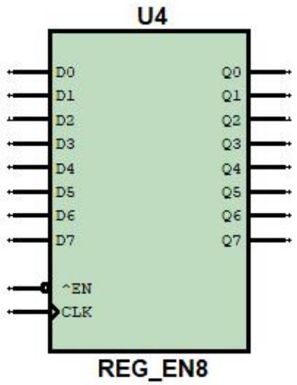  
图 2-1：低电平写使能寄存器

# 2.2 DM1000 中的单向总线收发器

当多个部件与总线相连时，如果出现两个或两个以上部件同时向总线发送信息，会导致信号冲突。

在 DM1000中，为有效防止总线冲突，挂载到总线上的输入部件（向总线发送信息的部件）必须通过 8位单向总线收发器（8位单向三态门）与总线相连。

挂载在同一总线上的多个单向总线收发器，当且仅当其中一个使能时，使能的收发器才能向总线发送信息，其余的将被禁止，这样保证只有一个部件向总线发送信息，避免了不同信号之间的冲突。如图 2-2所示。

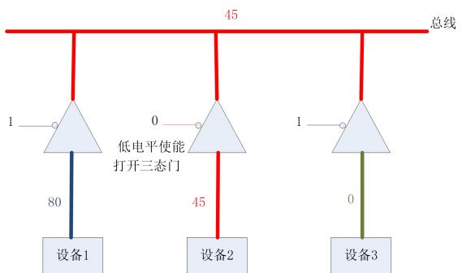  
图 2-2：多个设备通过单向总线收发器向总线传送数据示意图

# 三、 实验内容

# 3.1 任务（一）掌握寄存器的写操作

本次实验涉及到“单周期时钟”和“一位交互式数字信号”两种器件的使用，读者可以参考第一部分中的数字电路实验 1，详细了解它们的使用方法。

请读者按照下面方法之一在本地创建一个项目，用于完成本次任务：

# 方法一：从 CodeCode.net 平台领取任务

读者需要首先登录 CodeCode.net平台领取本次实验对应的任务，从而在 CodeCode.net平台上创建个人项目，然后使用 Dream Logic提供的“从 Git 远程库新建项目”功能将个人项目克隆到本地磁盘中。

# 方法二：不从 CodeCode.net 平台领取任务

如果读者不使用 CodeCode.net 平台，就需要使用 Dream Logic 提供的“从 Git 远程库新建项目”功能直接将实验模板克隆到本地磁盘中，实验模板的 URL为

https://www.codecode.net/engintime/Dream-Logic/Project-Template/DM1000/DM1000.git。

# 建议教师按照下面的步骤在 CodeCode.net 平台上布置此次实验任务：

(1) 在计算机组成原理实验课程中，新建一个实验任务。  
(2) 在“新建任务”页面中，教师需要添写“任务名称”，推荐使用“实验 2 寄存器实验-任务（一）（二）”；还需要填写“模板项目 URL”，应该使用

“https://www.codecode.net/engintime/Dream-Logic/Project-Template/DM1000/DM1000.git”。

(3) 点击“新建任务”按钮，完成新建任务操作。

请读者按照下面的步骤完成本次实验：

1. 在原理图 DM1000.dlsche 中，找到输入寄存器 RIN。  
2. 在打开的 DM1000.dlsche 原理图中，选择菜单“仿真”下的“启动仿真”（快捷键 F5）。  
3. 启动仿真后，在底部的寄存器窗口中，找到 RIN 寄存器，如图 2-3所示。打开寄存器窗口的方法是，选择菜单“视图”中的“寄存器”即可。  
4. 在寄存器窗口中可以看到，RIN使能，说明 RIN 允许写入数据；但是它的值为空，说明此时 RIN的输出端数据无效，即至少存在一位输出是无效的（蓝色网络表示无效电位）。

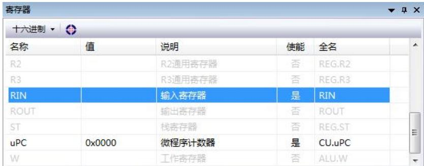  
图 2-3：寄存器窗口中 RIN的当前状态

5. 在寄存器窗口中选中 RIN，双击鼠标左键，可快速定位到寄存器在原理图中的位置。可以查看 RIN此时的状态，如图 2-4 所示。RIN的输入均为低电平，显示为灰色，输出无效，显示为蓝色。

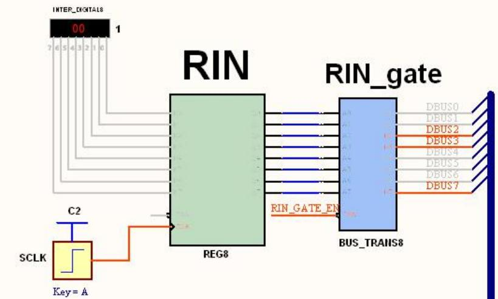  
图 2-4：启动仿真后的寄存器 RIN

6. 确保鼠标焦点在原理图 DM1000.dlsche 中，然后通过按键“A”，向 RIN 寄存器管脚 CLK端输入一个上升沿，将 0 写入 RIN 寄存器。  
7. 观察：RIN的输出均显示为灰色，表示 0。  
8. 观察：寄存器窗口中 RIN的十六进制值为 $0 \mathrm { { x } 0 0 }$ ，并且显示为红色，表示 RIN寄存器发生了写操作。  
9. 选中 RIN左侧的八位交互式数字信号，在属性栏中将数字信号值修改为 0f，如下图 2-5 所示。

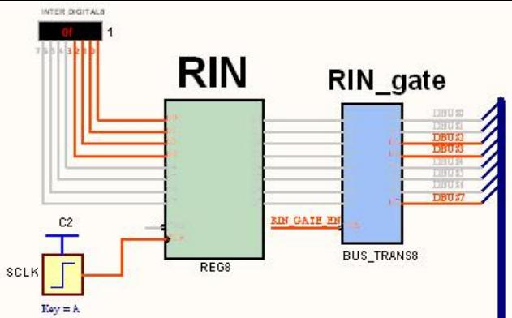  
图 2-5：RIN 输出的值为 0

10. 按下按键“A”然后抬起，就会将 0f 写入 RIN寄存器，观察写入后 RIN 寄存器的输出。  
11. 将 0f写入 RIN 寄存器后，请读者再将八位交互式数字信号输出的值修改为 ff，观察在没有时钟上升沿触发的情况下，ff有写入 RIN寄存器吗？  
12. 选择菜单“仿真”中的“结束仿真”。

通过以上步骤可知，在寄存器使能的情况下，改变寄存器的输入并不会影响其输出，若想将数据写入寄存器中，还需要时钟上升沿的触发。

请读者在 DM1000 原理图中，添加一个“一位交互式数字信号”，与 RIN的管脚 EN 连接，用来控制寄存器 RIN的写使能。启动仿真后设置 RIN寄存器的 EN 为高电平，通过按键 A 发送的时钟上升沿对 RIN进行写操作，数据能写入 RIN寄存器吗？

# 3.2 任务（二）通用寄存器 R0~R3写入数据和读取数据

请读者继续使用完成任务（一）时在本地创建的项目，并按照下面的步骤完成本次实验：

# 修改寄存器模块 REG的电路

1. 打开项目子模块中的寄存器模块原理图文件 REG.dlsche。  
2. 由于寄存器模块的输入数据和输出数据都是连接的数据总线 DBUS[7..0]，为了防止输入、输出信号相冲突，读者需要删除寄存器模块原理图中的所有名称为 DBUS0~DBUS7的网络标签，还需要删除左右两个名称为 DBUS[7..0]的端口。这样就使寄存器的输入信号网络与输出信号网络断开连接了。  
3. 在原理图中添加一个“恒定高电平”信号源，将除了寄存器 $\mathrm { R 0 } ^ { \sim } \mathrm { R 3 }$ 之外的所有寄存器的写使能管脚 EN 与该“恒定高电平”信号源连接，并且将这些寄存器右侧的与之对应的总线收发器的控制管脚 EN也与该“恒定高电平”信号源连接，这样可以防止无关寄存器的写入和读取数据操作。  
4. 为原理图中的输入端口 IR0、IR1、REG_WR、REG_READ 分别连接一个“一位交互式数字信号源”，并自定义每个信号的控制按键，以便仿真时进行手动控制。  
5. 在原理图中添加一个“单周期时钟”源器件，将其与端口 CLK连接，为各寄存器提供时钟。  
6. 在原理图中添加一个“八位数字信号”源器件，将其用于输出数据的 8 个管脚与左侧的用于向寄存器写入数据的 8 条信号线进行连接，用于控制所有寄存器的输入数据。  
7. 在原理图中添加两个十六进制七段数码管，将这两个器件的总共 8 个输入管脚与右侧用于向数据总线输出数据的 8 条信号线进行连接（注意连接顺序），用于显示通过总线收发器输出到总线上的值。

# 向通用寄存器 ${ \tt R O } ^ { \sim } { \tt R } 3$ 写入数据

通过上述步骤，完成寄存器模块测试电路。下面，按步骤完成寄存器数据的写入：

1. 设置输入端信号 $\mathrm { I R 0 = 0 }$ ，IR1=0，REG_WR $\scriptstyle = 0$ ，REG_READ=1，设置“八位数字信号”源器件的值为 1，然后单独对寄存器模块进行仿真。可看到此时只有寄存器 R0 的写使能 $\mathrm { E N = 0 }$ ，手动输入时钟，将数据 1 写入 R0 寄存器中。

表 2-2: 2-4 译码器 74LS139D 的真值表  

<table><tr><td>^1G</td><td>B</td><td>A</td><td>Y0</td><td>Y1</td><td>Y2</td><td>Y3</td></tr><tr><td>1</td><td>x</td><td>x</td><td>1</td><td>1</td><td>1</td><td>1</td></tr><tr><td>0</td><td>0</td><td>0</td><td>0</td><td>1</td><td>1</td><td>1</td></tr><tr><td>0</td><td>0</td><td>1</td><td>1</td><td>0</td><td>1</td><td>1</td></tr><tr><td>0</td><td>1</td><td>0</td><td>1</td><td>1</td><td>0</td><td>1</td></tr><tr><td>0</td><td>1</td><td>1</td><td>1</td><td>1</td><td>1</td><td>0</td></tr></table>

2. 结合 2-4译码器的真值表 2-2，仿照寄存器 $\mathrm { r 0 }$ 的写入方法，通过设置控制信号 IR1、IR0、REG_WR，以及“八位数字信号”源器件的值，分别向寄存器 r1，r2，r3中写入数据 0x11， $- 1$ (使用补码表示为 0xff), $0 \mathrm { { x } 8 0 }$ 。IR1，IR0 是指令的最后两位编码，它们编码产生 4 个控制信号，用来选择通用寄存器 $\mathrm { r 0 \tilde { \ r } 3 }$ 。

# 读出通用寄存器 R0~R3 的数据

通过控制信号 IR1、IR0、REG_READ、REG_WR，依次读出寄存器 $\mathrm { R 0 } ^ { \sim } \mathrm { R 3 }$ 的数据，读出的数据传送到输出数据总线上，记录表格如下：

表 2-3：读寄存器 R0~R3 的控制信号  

<table><tr><td>要求</td><td>REG_WR</td><td>REG_READ</td><td>IR1</td><td>IRO</td><td>输出到总线上的数据</td></tr><tr><td>将R0的值输出到总线上</td><td></td><td></td><td></td><td></td><td></td></tr><tr><td>将R1的值输出到总线上</td><td></td><td></td><td></td><td></td><td></td></tr><tr><td>将R2的值输出到总线上</td><td></td><td></td><td></td><td></td><td></td></tr><tr><td>将R3的值输出到总线上</td><td></td><td></td><td></td><td></td><td></td></tr></table>

总结上述仿真实验，可以得出以下结论：

$\textcircled{1}$ 将数据总线上的数据写入通用寄存器 $\mathrm { R 0 } ^ { \sim } \mathrm { R 3 }$ 时，需要设置 REG_WR 信号为低电平，使能用于选择寄存器的译码器 U9，并通过 IR0、IR1进行译码从而使能一个通用寄存器，当时钟上升沿触发时，完成数据的写入。  
$\textcircled{2}$ 将寄存器 $\mathrm { R 0 } ^ { \sim } \mathrm { R 3 }$ 的数据读出到数据总线上时，需要设置 REG_READ 信号为低电平，使能用于选择输出门的译码器 U10，并通过 IR0、IR1进行译码从而使能一个输出门，此时就会立即将输出门对应寄存器的值输出到数据总线上，不需要时钟上升沿触发。  
$\textcircled{3}$ 当多个通用寄存器都有值时，必须确保只有一个输出门被使能，其余的输出门关闭，从而实现将一个指定通用寄存器的值输出到数据总线的目的。  
$\textcircled{4}$ 打开控制单元 CU，可以看到指令寄存器 IR 存放的是指令的 8 位编码，仅使用其中的两位 IR0 和IR1 编码四个通用寄存器 $\mathrm { R 0 } ^ { \sim } \mathrm { R 3 }$ ，这样就节省了指令编码的位数，可以让指令编码中更多的位做别的事情。这种使用尽可能少的位数编码同一类的多个寄存器的方法在复杂指令集和精简指令集体系结构中均有使用。例如，Intel 8086 处理器的单操作数指令格式中就使用 3 位来编码 8个十六位通用寄存器，如表 2-4所示。

<table><tr><td>编码</td><td>译码后使能的寄存器</td></tr><tr><td>000</td><td>AX</td></tr><tr><td>001</td><td>CX</td></tr><tr><td>010</td><td>DX</td></tr><tr><td>011</td><td>BX</td></tr><tr><td>100</td><td>SP</td></tr><tr><td>101</td><td>BP</td></tr><tr><td>110</td><td>SI</td></tr><tr><td>111</td><td>DI</td></tr></table>

提交作业

在提交作业前，读者需要将 REG模块 SVG图形文件的链接添加到 README.md 文件中，这样，当使用浏览器查看提交后的线上项目时，就可以从 README.md 文件中看到修改后的 REG模块了。方法如下：

1. 双击“项目管理器”中的 README.md 文件，使用一种合适的文本编辑器或者 Markdown 编辑器打开此文件。  
2. 在 README.md文件的末尾添加如下的文本：

# 寄存器模块 REG


3. 保存 README.md 文件。  
4. 提交作业。

# 3.3 任务（三）

前面的实验任务是对寄存器模块 REG内部电路进行单独测试，重点是让读者学习 REG模块的电路功能和实现原理。本次任务将通过为 DM1000编写汇编程序，让 DM1000 运行寄存器读写指令的方式，完成对寄存器的读/写操作，使读者了解寄存器模块 REG在整机系统中的是如何配合其他功能模块完成功能的。

请读者按照下面方法之一在本地创建一个项目，用于完成本次任务：

# 方法一：从 CodeCode.net 平台领取任务

读者需要首先登录 CodeCode.net平台领取本次实验对应的任务，从而在 CodeCode.net平台上创建个人项目，然后使用 Dream Logic提供的“从 Git 远程库新建项目”功能将个人项目克隆到本地磁盘中。

# 方法二：不从 CodeCode.net 平台领取任务

如果读者不使用 CodeCode.net 平台，就需要使用 Dream Logic 提供的“从 Git 远程库新建项目”功能直接将实验模板克隆到本地磁盘中，实验模板的 URL为

```txt
https://wwwCodecode.net/engintime/Dream-Logic/Project-Template/DM1000/DM1000.git。 
```

# 建议教师按照下面的步骤在 CodeCode.net 平台上布置此次实验任务：

(1) 在计算机组成原理实验课程中，新建一个实验任务。  
(2) 在“新建任务”页面中，教师需要添写“任务名称”，推荐使用“实验 2 寄存器实验-任务（三）”；还需要填写“模板项目 URL”，应该使用

“https://www.codecode.net/engintime/Dream-Logic/Project-Template/DM1000/DM1000.git”。

(3) 点击“新建任务”按钮，完成新建任务操作。

请读者按照下面的步骤完成本次实验：

1. 打开项目下的汇编源程序文件 ram.asm，使用下面的源代码替换此文件中的原有内容。

.text

mov r0, 0 ; 将立即数 0 写入 r0 寄存器

mov r1, 1

mov r2, 2

mov r3, 3

mov a, 4 ; 将立即数 4 写入累加器 a，累加器 a存在于算术逻辑运算模块 ALU内部

add a, r2 ; 将累加器 a与寄存器 r2 相加，结果写回 a 中

2. 在“项目管理器”窗口中右键点击批处理文件 ram.bat，在弹出菜单中选择“运行批处理文件”，将汇编源代码文件 ram.asm 编译为机器码文件 ram.rxm，列表文件 ram.lst，以及调试信息文件ram.dbg。启动仿真后，机器码文件 ram.rxm会被加载到 MEM 模块内的存储器 RAM中。  
3. 打开原理图文件 DM1000.dlsche，启动仿真（快捷键为 F5）。  
4. 启动仿真后，如果正在使用自动时钟进行仿真，可以使用 S 键切换为单步时钟仿真。  
5. 通过按键 R 完成复位。DM1000 利用 R 按下后输出的低电平程序计数器 PC 和微程序计数器 uPC清零，从而完成复位操作。复位后，读者在源代码窗口 1中可以看到蓝色箭头指向第一条指令，在源代码窗口 2 中可看到蓝色箭头指向第一条微指令。

# 源代码窗口 1

1. 在左上角源代码窗口 1中显示的是 ram.asm编译后生成的列表文件 ram.lst。如图 2-6所示：

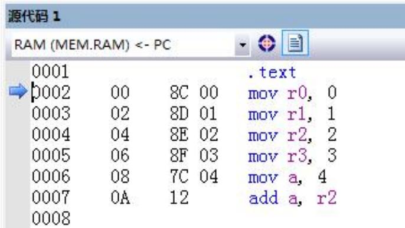  
图 2-6：源代码窗口 1

2. 在窗口中可看到“movr0， $0 ^ { \prime \prime }$ 指令地址为 00，对应的机器码是两个字节 $^ { 6 6 } 8 \mathrm { C } 0 0 ^ { 9 }$ ，其中字节“00”就表示立即数 0。依次类推，后面几条 mov指令中的立即数分别为 01、02、03、04。  
3. 此外，我们注意到，指令“movr0,0”到指令“movr3,3”的第一个从 8C 依次加 1 直到 8F，这和指令中的寄存器有什么关系呢？结论将在后面揭晓。  
4. 最后一条指令是单字节指令，它的机器码为 12。

# 取指微指令

下面，以第一条指令 mov r0, 0为例，进行单步时钟仿真，从而分析该指令是如何执行的。

1. 启动仿真后，在源代码窗口 2 中，可看到蓝色箭头指向第一条微指令“path [pc], ir”，即取指微指令。  
2. 双击打开 CU 模块，可看到 uPC 寄存器输出 0，ROM输出取指微指令编码的 32 位控制信号。  
3. 在 ROM 右侧的输出端口中，只有三个控制信号为低电平，其中有效的是 PC_A_GATE_EN，MEM_GATE_EN。  
4. PC_A_GATE_EN=0，是因为取指令是将 PC 作为地址访问指令存储器 RAM，只有 PC向地址总线输出的三态门打开，才能将 PC值传送到地址总线 ABUS上。双击当前视图中的空白处，返回顶层电路，然后双击 PC模块进入内部，可以看到当前 $\mathrm { P C = } 0$ ，地址输出门 PC_gate 使能 EN= PC_A_GATE_EN $= \ 0$ ，PC值通过输出门传送到地址总线 ABUS 上。  
5. MEM_GATE_EN=0，是因为从指令存储器 RAM 读出指令后，只有打开存储器 RAM 向数据总线的输出门，才能将指令传送到数据总线 DBUS 上。返回顶层电路，然后进入 MEM 模块内部，可看到 RAM的输入地址为0（ $\mathrm { P C = } 0 \ .$ ）， $\textstyle \mathbf { \hat { W } } \setminus \mathbf { R } = 1$ ，读出地址 0 指向的存储单元内容 8C（指令），这正是指令“movr0， 0”的第一个字节码。存储器输出门 MEM_gate 使能打开，指令 8C 传送到数据总线 DBUS 上。到此，取指微指令的使命还没有结束。

通过前面的分析可知，取指微指令通过地址输出门和存储器输出门控制信号，将指令的第一个字节从存储器 RAM读出并且输出到数据总线 DBUS上。那么接下来 CU 模块如何使用 DBUS 上的指令呢？

1. 返回顶层电路并双击打开 CU模块。  
2. 找到指令寄存器 IR，可以看到，IR写使能，且输入指令码为 8C，当下个时钟上升沿到来时，8C将被写入 IR 中。  
3. 将指令机器码写入指令寄存器只是 CU 模块完成的一个任务。CU模块的另一个任务是根据 DBUS上的指令机器码，计算出该指令对应的微程序入口地址。从 CU视图可以看到，指令机器码 8C的高 6 位扩展为 12 位地址 $0 \mathrm { { x } 4 6 0 }$ 传送到 uPC的输入端，当下个时钟到来时，uPC将写入 $0 \mathrm { { x } 4 6 0 }$ ，从而执行该处的微指令。  
4. 手动输入单步时钟，可看到 IR寄存器写入 8C，写入后 IR0 和 IR1均为 0，这两位正是寄存器 r0的编码。而 uPC写入 $0 \mathrm { { x } 4 6 0 }$ ，在源代码窗口 2 中可以看到，蓝色箭头指向 460，这正是指令“movr0,0”

对应的第一条微指令。

通过上述仿真分析可知，CU 模块将指令保存到指令寄存器 IR 的同时，使得微程序计数器 uPC 转去执行指令对应的微程序，至此，取指微指令的使命才真正结束。

# 执行指令

取指完成后，接下来就该执行取出的指令了。在 DM1000 中，执行指令的本质是顺序运行该指令对应的固定微程序，当微程序运行完后，指令的功能也就实现了。

我们逐条运行指令“mov r0， 0”对应的微程序。

1. inc pc，该条微指令将 PC 加 1，从而指向下一个字节。

$\textcircled{1}$ 将鼠标移动到该条微指令的 PC 上可以看到当前 $\mathrm { P C } { = } 0$ 。  
$\textcircled{2}$ 打开 CU 模块，可看到当前 ROM 输出均为高电平，其中只有 PC_ADD 信号有效，PC_ADD 控制PC 计数器的加计数使能，打开 PC模块，可看到 PC 的计数使能端 EN=PC_ADD为高电平，说明允许 PC 加计数。  
$\textcircled{3}$ 通过按键 C 输入一个时钟，可看到 PC输出为 1。打开存储器窗口， $\mathrm { P C } { = } 1$ ，正好指向“movr0，$0 ^ { \prime \prime }$ 指令中的立即数 0 所在的存储单元。

2. path [pc], rx，该条微指令将 PC 指向的存储单元内容读出并传送到通用寄存器中，微指令中的rx 表示 $\mathrm { R 0 } ^ { \sim } \mathrm { R 3 }$ 中的某一个寄存器，具体是哪一个，则由指令寄存器 IR中的 IR0 和 IR1决定。

$\textcircled{1}$ 打开 CU 模块，可看到当前 ROM 左端输出的控制信号中，有效的低电平信号为 REG_WR，PC_A_GATE_EN，MEM_GATE_EN。  
$\textcircled{2}$ 其中 PC_A_GATE_EN，MEM_GATE_EN两个门控信号配合，读出地址单元 1 的内容，即立即数 0，打开 MEM模块进行观察验证。  
$\textcircled{3}$ 立即数 0读出后通过总线传送到目的寄存器的输入端，准备写入目的寄存器。打开寄存器模块 REG，可看到数据总线上的立即数为 0，IR0、IR1和 REG_WR经过译码器输出唯一一个低电平信号，该信号使能 r0 寄存器。  
$\textcircled{4}$ 通过按键 C 输入时钟，可看到寄存器 r0 写入了立即数 0。

经过以上两条微指令的执行，立即数 0 已经写入寄存器 $\mathrm { r 0 }$ 中，指令“movr0,0”的使命已经完成了，后面两条微指令分别实现 PC加 1 和 uPC 复位，为下一条指令取指做准备。

至此，我们完成了指令“movr0, $0 ^ { \prime \prime }$ 的全过程分析，请读者完成后续的指令执行过程的分析。最后一条指令是加法指令，需要将寄存器 r2 中的值读取出来，请读者仿照将立即数写入寄存器的仿真过程分析读取寄存器的过程。

# 四、 思考与练习

1. 各个寄存器对应的单向总线收发器使能信号是由控制单元 CU 发出的，任何时刻，最多只能有一个总线收发器向同一总线发送数据，避免信号冲突。DM1000 中挂接到数据总线 DBUS 上的总线收发器有哪些，哪些是接收总线数据的？哪些是向总线发送数据的？控制单元 CU 是如何控制总线收发器与数据总线 DBUS 间的数据传输的？

提示：控制单元 CU发出的控制信号 X3、X2、X1、X0 四位二进制数可以编码 16个总线收发器的使能。在执行微指令的过程中，如果希望某个总线收发器向数据总线 DBUS发送数据，就可以通过编码 X3、X2、X1、X0 决定该总线收发器使能，而其他的收发器不使能，这样数据总线 DBUS 在一个时钟周期中总是只接收一个总线收发器发送的数据。请结合附录 A 中表 A-2加以理解。

2. 在 DM1000 中查找所有与地址总线 ABUS相连的总线收发器。分析 CU是如何控制它们与地址总线 ABUS传输地址的？  
3. 请读者尝试说明为什么 DM1000不支持类似 mov r0, r1 这样的指令。

# 实验 3 运算器实验

实验性质：验证+设计

建议学时：2学时

# 实验目的

通过 ALU模块电路的单独仿真，测试 ALU的算术逻辑运算功能，掌握 ALU内部电路原理。  
通过编程调用 ALU模块进行运算，掌握控制单元 CU 是如何控制 ALU进行不同运算的。

# 二、 预备知识

算术逻辑运算单元（ALU）74LS181是一种功能较强的组合逻辑电路，它能进行多种算术运算和逻辑运算。它的基本逻辑结构是超前进位加法器。

$\mathsf { S } _ { 3 } ^ { \mathsf { \Delta } } \widetilde { \mathsf { S } } _ { 0 }$ ：工作方式选择。

M：当 $\mathrm { M } { = } 1$ 时，进行逻辑运算； $\mathtt { M } = 0$ 时，进行算术运算。

$\mathsf { A } { = } \mathsf { A } _ { 3 } \mathrm { \sim } \mathsf { A } _ { 0 }$ ， $\mathtt { B } = \mathtt { B } _ { 3 } \ \sim \mathtt { B } _ { 0 }$ ：参加运算的两个数（注脚 3 表示最高位）。

$\mathbb { F } _ { 3 } \ \mathrm { \tilde { F } } _ { 0 }$ ：运算结果。

CN：当做加运算时，表示最低位进位输入， $\mathrm { C N } { = } 1$ 时，无进位输入； $\mathrm { C N = } 0$ 时，有进位输入。当做减法时，表示最低位借位， $\mathrm { C N } { = } 1$ ，有借位； $\mathrm { C N = } 0$ ，无借位。

CN4：最高位进位输出，低电平有效。

AEQB：当 $\mathrm { F _ { 3 } } ^ { \mathrm { \Delta \sim } } \mathrm { F _ { 0 } }$ 全为高电平时为 1，否则为 0。

G 称为进位发生输出，P 称为进位传送输出。它们是为了便于实现多芯片 ALU 之间的超前进位的。

表 3-1：74LS181 真值表  

<table><tr><td>方式</td><td>M=1 逻辑运算</td><td colspan="2">M=0 算术运算</td></tr><tr><td>S3 S2 S1 S0</td><td>逻辑运算</td><td>CN=1(无进位)</td><td>CN=0(有进位)</td></tr><tr><td>0 0 0 0</td><td>F=/A(非)</td><td>F=A(直传)</td><td>F=A加1</td></tr><tr><td>0 0 0 1</td><td>F=/(A+B)</td><td>F=A+B</td><td>F=(A+B)加1</td></tr><tr><td>0 0 1 0</td><td>F=(/A)B</td><td>F=A+/B</td><td>F=(A+/B)加1</td></tr><tr><td>0 0 1 1</td><td>F=0</td><td>F=负1</td><td>F=0</td></tr><tr><td>0 1 0 0</td><td>F=(AB)</td><td>F=A加A(/B)</td><td>F=A加A/B加1</td></tr><tr><td>0 1 0 1</td><td>F=B</td><td>F=(A+B)加A/B</td><td>F=(A+B)加A/B加1</td></tr><tr><td>0 1 1 0</td><td>F=A⊕B(异或)</td><td>F=A减B减1</td><td>F=A减B</td></tr><tr><td>0 1 1 1</td><td>F=A/B</td><td>F=A(/B)减1</td><td>F=A(/B)</td></tr><tr><td>1 0 0 0</td><td>F=A+B</td><td>F=A加AB</td><td>F=A加AB加1</td></tr><tr><td>1 0 0 1</td><td>F=(A⊕B)</td><td>F=A加B</td><td>F=A加B加1</td></tr><tr><td>1 0 1 0</td><td>F=B</td><td>F=(A+/B)加AB</td><td>F=(A+/B)加AB加1</td></tr><tr><td>1 0 1 1</td><td>F=AB(与)</td><td>F=AB减1</td><td>F=AB</td></tr><tr><td>1 1 0 0</td><td>F=1</td><td>F=A加A</td><td>F=A加A加1</td></tr><tr><td>1 1 0 1</td><td>F=A+/B</td><td>F=(A+B)加A</td><td>F=(A+B)加A加1</td></tr><tr><td>1 1 1 0</td><td>F=A+B(或)</td><td>F=(A+/B)加A</td><td>F=(A+/B)加A加1</td></tr><tr><td>1 1 1 1</td><td>F=A(直传)</td><td>F=A减1</td><td>F=A(直传)</td></tr></table>

提示：1—高电平，0—低电平。中文的“加”和“减”表示算数运算。其他的符号表示逻辑运算，例如“/”表示逻辑取反，“+”表示逻辑或。

# 三、 实验内容

# 3.1 任务（一）

对 DM1000 中的 ALU 模块进行单独仿真测试，检验 ALU 的算术逻辑运算功能。

请读者按照下面方法之一在本地创建一个项目，用于完成本次任务：

# 方法一：从 CodeCode.net 平台领取任务

读者需要首先登录 CodeCode.net平台领取本次实验对应的任务，从而在 CodeCode.net平台上创建个人项目，然后使用 Dream Logic提供的“从 Git 远程库新建项目”功能将个人项目克隆到本地磁盘中。

# 方法二：不从 CodeCode.net 平台领取任务

如果读者不使用 CodeCode.net 平台，就需要使用 Dream Logic 提供的“从 Git 远程库新建项目”功能直接将实验模板克隆到本地磁盘中，实验模板的 URL为

```txt
https://wwwCodec.net/engintime/Dream-Logic/Project-Template/DM1000/DM1000.git。 
```

# 建议教师按照下面的步骤在 CodeCode.net 平台上布置此次实验任务：

(1) 在计算机组成原理实验课程中，新建一个实验任务。  
(2) 在“新建任务”页面中，教师需要添写“任务名称”，推荐使用“实验 3 运算器实验-任务（一）”；还需要填写“模板项目 URL”，应该使用

```txt
"https://wwwCodec.net/engintime/Dream-Logic/Project-Template/DM1000/DM1000.git"。 
```

(3) 点击“新建任务”按钮，完成新建任务操作。

请读者按照下面的步骤完成本次实验：

1. 打开项目下的原理图文件 ALU.dlsche，ALU中的主要器件如下：

（1） 两片 74LS181串行进位扩展成 8位算术逻辑运算器。  
（2） 累加器 A和工作寄存器 W的输入端直接与数据总线相连，在使能信号和时钟控制下，可将数据总线上的数据写入寄存器。  
（3） 累加器 A和工作寄存器 W 的输出分别作为运算器 ALU的两个 8 位运算数。  
（4） ALU在控制信号的作用下进行不同的运算并通过直通门 D_gate 输出运算结果。

2. 删除电路图中的网络标签 DBUS0~DBUS7,使输入数据网络与输出数据网络断开连接，避免输入、输出信号相冲突。  
3. 在原理图中，使用型号库“数字信号源”中的元器件，为各个输入端口添加控制信号以及单周期时钟， 使用8 位交互式数字信号源作为寄存器 A 和 W 的数据输入。使用型号库“数字信号显示”中的 16 进制 7 段数码管显示 8 位 ALU的运算结果，如图 3-1 所示：

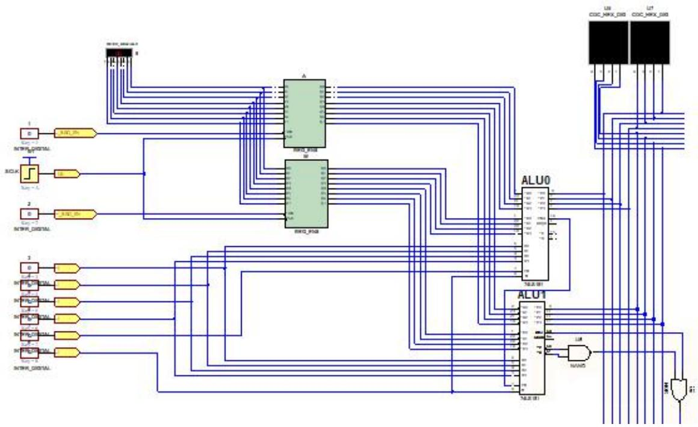  
图 3-1：在 ALU 中添加控制信号以及单周期时钟

4. 保存电路并单独仿真 ALU模块。  
5. 参照表 3-1，分别向寄存器 A 和 W 中写入数据，A 作为第一运算数，W作为第二运算数。然后通过各个控制信号手动控制 ALU的运算方式，完成表 3-2。  
6. 完成表格后，结束仿真。

表 3-2：ALU仿真记录表  

<table><tr><td rowspan="2">表达式</td><td rowspan="2">M</td><td rowspan="2">S3 S2 S1 S0</td><td colspan="3">C=1(无进位)</td><td colspan="3">C=0(有进位)</td></tr><tr><td>计算结果</td><td>为0</td><td>进位</td><td>计算结果</td><td>为0</td><td>进位</td></tr><tr><td>7+2</td><td>0</td><td>1001</td><td>0x09</td><td>否</td><td>否</td><td>0x0A</td><td>否</td><td>否</td></tr><tr><td>0xOF -5</td><td></td><td></td><td></td><td></td><td></td><td></td><td></td><td></td></tr><tr><td>3&amp; 0x0B</td><td></td><td></td><td></td><td></td><td></td><td></td><td></td><td></td></tr><tr><td>4|8</td><td></td><td></td><td></td><td></td><td></td><td></td><td></td><td></td></tr><tr><td>~7</td><td></td><td></td><td></td><td></td><td></td><td></td><td></td><td></td></tr><tr><td>8 + (-1)</td><td></td><td></td><td></td><td></td><td></td><td></td><td></td><td></td></tr><tr><td>1 + (-1)</td><td></td><td></td><td></td><td></td><td></td><td></td><td></td><td></td></tr><tr><td>0x80 + 0x80</td><td></td><td></td><td></td><td></td><td></td><td></td><td></td><td></td></tr><tr><td>6-9</td><td></td><td></td><td></td><td></td><td></td><td></td><td></td><td></td></tr></table>

提示：负数使用补码表示，因此“-1”表示为“0xff”。

通过以上实验，不难看出，要使 ALU完成运算任务，首先需要将运算数分别写入累加器 A和工作寄存器 W中，与此同时，还需要通过控制信号指定 ALU做何种运算。

由此可知，当 DM1000 执行运算指令时，首先需要将指令提供的操作数分别写入累加器 A 和 W 中，然后由指令类型输出对应的控制信号，控制 ALU做指定的运算，最终将结果写回目的操作数寄存器中。

# 提交作业

在提交作业前，读者需要将 ALU模块 SVG图形文件的链接添加到 README.md 文件中，这样，当使用浏览器查看提交后的线上项目时，就可以从 README.md 文件中看到修改后的 ALU模块了。方法如下：

1. 双击“项目管理器”中的 README.md 文件，使用一种合适的文本编辑器或者 Markdown 编辑器打开此文件。

2. 在 README.md 文件的末尾添加如下的文本：

# 运算器模块 ALU

```txt
! [raw SVG] (ALU.dlsche.svg) 
```

3. 保存 README.md 文件。  
4. 提交作业。

# 3.2 任务（二）

使用 DM1000 完成一个减法运算，观察减法指令的执行过程。

请读者按照下面方法之一在本地创建一个项目，用于完成本次任务：

# 方法一：从 CodeCode.net 平台领取任务

读者需要首先登录 CodeCode.net平台领取本次实验对应的任务，从而在 CodeCode.net平台上创建个人项目，然后使用 Dream Logic 提供的“从 Git 远程库新建项目”功能将个人项目克隆到本地磁盘中。

# 方法二：不从 CodeCode.net 平台领取任务

如果读者不使用 CodeCode.net 平台，就需要使用 Dream Logic 提供的“从 Git 远程库新建项目”功能直接将实验模板克隆到本地磁盘中，实验模板的 URL为

```txt
https://wwwCodecode.net/engintime/Dream-Logic/Project-Template/DM1000/DM1000.git。 
```

# 建议教师按照下面的步骤在 CodeCode.net 平台上布置此次实验任务：

(1) 在计算机组成原理实验课程中，新建一个实验任务。  
(2) 在“新建任务”页面中，教师需要添写“任务名称”，推荐使用“实验 3 运算器实验-任务（二）”；还需要填写“模板项目 URL”，应该使用

```txt
"https://wwwCodec.net/engintime/Dream-Logic/Project-Template/DM1000/DM1000.git"。 
```

(3) 点击“新建任务”按钮，完成新建任务操作。

请读者按照下面的步骤完成本次实验：

1. 打开项目下的汇编源程序文件 ram.asm，使用以下程序替换原程序：

```asm
.text ;代码段  
mov r0, -1 ;将立即数-1写入寄存器r0中  
mov a, 0 ;将立即数0写入累加寄存器a中  
sub a, r0 ;将累加器a的值减去寄存器r0的值，结果写回a中  
mov r0, a ;将累加器a的值放入寄存器r0，直通
```

2. 选择项目下的文件 ram.bat，单击右键弹出菜单，选择“运行批处理文件”，对汇编源程序 ram.asm进行编译。  
3. 打开原理图 DM1000.slsche，启动仿真。  
4. 通过按键 R 复位。  
5. 通过按键 S，选择单步运行程序。  
6. 通过按键 C 单步运行指令，当运行到减法指令时，停止单步时钟输入。打开寄存器窗口，选择十进制显示寄存器值，可看到寄存器 $\mathrm { r 0 }$ 的值为-1，双击定位到 $\mathrm { r 0 }$ ，可看到 $\mathrm { r 0 }$ 的输出管脚均为高电平，在寄存器窗口中选择十六进制显示，可看到 $\mathrm { r 0 }$ 的值为 0xff，这正是-1 的 8 位补码表示。累加器 a 的值为 0，双击定位累加器 a，可看到累加器 a 的输出管脚均为低电平。

通过前面的步骤，我们将-1 写入了寄存器 $\mathrm { r 0 }$ 中，而将 0 写入了累加器 a 中，接下来是减法指令执行的详细过程。

1. 在仿真窗口中打开 ALU 模块，可看到此时工作寄存器 W 的输出值无效。由指令 suba, r0 可知，需要将 $_ { \mathrm { r 0 } }$ 写入工作寄存器 W 后，ALU才能进行运算。  
2. 通过按键 C 输入时钟，执行取指微指令后，源代码窗口 2 中的蓝色箭头指向如图 3-2 所示：

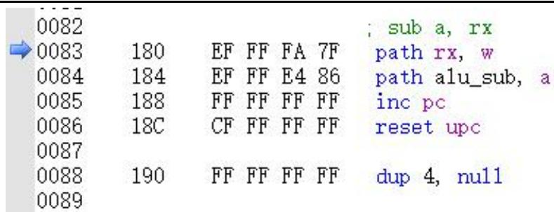  
图 3-2：减法指令对应的微程序

3. 微指令“pathrx, w”是将源寄存器 rx（rx 表示 $\mathrm { r 0 \tilde { \ r } 3 }$ 中的某一个寄存器）的值传送到工作寄存器 w 中。打开控制单元 CU，可看到 ROM 输出的有效低电平控制信号为：

$\textcircled{1}$ REG_READ，通用寄存器读使能信号。打开寄存器模块 REG，可看到当前读出到总线上的数据正是寄存器 r0 的值-1。  
$\textcircled{2}$ W_REG_EN，工作寄存器写使能信号。打开 ALU 模块，可看到 $\mathrm { r 0 }$ 寄存器的值通过总线传送到工作寄存器 W的数据输入端，且 W 寄存器写使能，下个时钟上升沿到来时，-1 将被写入 W 中。  
$\textcircled{3}$ 通过按键 C 输入单步时钟，寄存器 W写入-1。

4. 在源代码窗口 2 中，可看到蓝色箭头指向微指令“pathalu_sub, a”，该条微指令控制 alu 做减法，并使能累加器 a，为运算结果写回 a 中做准备。打开控制单元 CU，可看到 ROM输出的有效控制信号为：

$\textcircled{1}$ S0S1S2S3=0110，C和 M均输出低电平，查询表 3-1可知，此时 ALU做减法运算“A减 B”。  
$\textcircled{2}$ A_REG_EN 为电平，累加器 A 写使能。  
$\textcircled{3}$ D_GATE_EN 为低电平，ALU 的运算结果直接输出到总线 DBUS 上。  
$\textcircled{4}$ 打开 ALU 模块，可看到在上述信号控制下，ALU进行减法运算“0-（-1）”，运算结果为 1，通过直通门 D_gate 输出到总线 DBUS上，且累加器 A 写使能。  
$\textcircled{5}$ 通过按键 C输入单步时钟，可看到累加器 a 写入了运算结果 1。到此，减法指令 suba，r0的使命结束了。

5. 继续单步运行，后面两条微指令完成 PC 加 1 和复位 uPC的任务，为下一条指令取指做准备。  
6. 接下来是将累加器 a 的值放入寄存器 $\mathrm { r 0 }$ 的指令，请读者自行仿真，重点理解运算器直通的工作方式。  
7. 最后，由于 PC 加 1 后指向的存储单元没有指令，而是初始化后的 0，因此，取指时使得 uPC始终为 0,DM1000 进入重复取指状态。此时可结束仿真。

通过分析减法指令的执行过程可知，取指后，通过两步完成了减法运算，第一步将操作数传送到工作寄存器 W中，第二步控制 ALU进行减法运算，然后利用下个时钟上升沿将运算结果写回累加器 a中。

减法指令的每一步都由微指令进行控制，在这里，我们可以更清晰的看到，微指令的实质是若干有效控制信号的组合，这些有效信号控制 DM1000 完成一个特定的最小操作，通过这些微操作的顺序进行，最终实现指令的功能。

修改汇编程序文件 ram.asm，编写一段简单的汇编程序用于计算下面的运算表达式，要求将最后的计算结果保存到 R0 寄存器中。

# 表达式：

$7 + 6*2 - (4|2)$

仿真运行编写的汇编程序，确保其可以正常运行。记录移位运算时运算器模块输入的控制信号，并描述运算器模块中的电路是如何进行移位运算的。记录逻辑或运算时运算器模块输入的控制信号。

请读者按照下面的提示编写汇编程序：

1. 可能用到的指令包括加法指令 ADD，减法指令 SUB，逻辑或指令 OR，指令格式请参考附录 A 中的表 A-4。

2. 可使用逻辑左移一位指令 SHL 计算乘 2，指令格式请参考附录 A中的表 A-4。

# 四、 思考与练习

1. 参看附录 A 的内容，在 DM1000 指令集中找出算术逻辑运算类指令。比如 add 是算术运算指令，not是逻辑运算指令，试着使用这些指令编写程序。然后运行程序，观察指令执行过程中何时 ALU进行了算术逻辑运算，此时对应的微指令是什么？在 ALU模块中查看输入的控制信号，此时控制信号使 ALU做何种运算。  
2. 在程序的执行过程中，观察 ALU 模块中哪些输入信号是由控制单元 CU 发出的，并结合附录 A 中的控制信号列表，理解各个控制信号的作用。  
3. DM1000 的通用寄存器是八位的，但是仍然可以进行十六位的算术运算，方法是先使用 add指令计算低八位，再使用 adc 指令（该指令会考虑进位或借位）计算高八位。例如，下面的程序就可以用来计算两个数 $\mathrm { 0 x 0 1 7 b }$ 与 0x3a24 的和，将结果低八位放入 R0寄存器，将高八位放入 R1 寄存器：

```asm
.text mov r0, 0x7b mov r1, 0x01 mov r2, 0x24 mov r3, 0x3a mov a, r0 add a, r2 mov r0, a mov a, r1 adc a, r3 mov r1, a 
```

请读者尝试运行上面的程序，看看计算的结果是否正确。如果结果错误，请在 ALU模块中查找原因，并修正电路图。然后确保可以同时运行上面的程序，还可以运行下面的程序求 $0 \mathrm { x } 0 1 8 0$ 与 0x3acd的和：

```asm
.text mov r0, 0x80 mov r1, 0x01 mov r2, 0xCD mov r3, 0x3a mov a, r0 add a, r2 mov r0, a mov a, r1 adc a, r3 mov r1, a 
```

4. DM1000 目前实现的 CF 进位标志是通过 CN4、P 和 G 管脚做组合逻辑实现的，只能正确处理 add加法指令产生的进位标志，还无法处理 sub 减法指令产生的借位标志。请读者继续改进 CF 标志位的设计，当进行无符号减法运算时，若减数大于被减数，此时有借位，则 CF 值为 1，否则 CF 值为 0。如果读者改进了 CF标志位的设计，请参考思考与练习 3的方式，编写一段汇编代码，确保sbb指令可以正常处理有借位的减法。  
5. 目前 DM1000 只是通过网络连接时的移位方式实现了移位指令，所以只能移动一位。一般在运算器中是通过桶形移位器实现移位功能的，在 Dream Logic的型号库“桶形移位器和总线收发器”中提供了八位桶形移位器“SHIFT8”。请读者参考附录 C 学习桶形移位器的工作方式，并尝试在运算器模块中放置一个八位桶形移位器，从而实现功能更加强大的移位指令。

# 实验 4 程序计数器实验

实验性质：验证 $+$ 设计

建议学时：2学时

# 实验目的

掌握程序计数器 PC 的内部电路原理。  
掌握程序计数器 PC 在程序运行过程中的作用。

# 二、 预备知识

程序计数器 PC在计算机内部存放现行指令的地址，通常具有计数功能，可实现顺序寻址和跳跃寻址。其 $\mathrm { P C } { + } 1$ 的操作可完成顺序寻址功能，跳跃寻址则通过转移类指令修改 PC的值来实现。

程序计数器模块 PC 中的核心器件是 8 位同步置数/异步清零二进制计数器PC，它的功能如表4-1所示。

表 4-1：8 位同步置数/异步清零二进制计数器真值表  

<table><tr><td>CLR</td><td>^LOAD</td><td>EN</td><td>CLK</td><td>Q</td><td>功能</td></tr><tr><td>0</td><td>X</td><td>X</td><td>X</td><td>0</td><td>PC复位</td></tr><tr><td>1</td><td>0</td><td>X</td><td>↑（上升沿）</td><td>Q=D</td><td>同步置数，PC跳转</td></tr><tr><td>1</td><td>1</td><td>0</td><td>X</td><td>保持</td><td>保持</td></tr><tr><td>1</td><td>1</td><td>1</td><td>↑（上升沿）</td><td>Q=Q+1</td><td>加计数</td></tr></table>

程序计数器 PC是计算机中非常重要的器件，PC的基本功能：

复位。PC 清零，从第一条指令开始执行。  
地址预置。程序跳转时转移地址的置入。  
$\bullet$ 自动加 1。保证程序的顺序执行。  
地址输出。提供取指令地址。

在 DM1000中，对于双字节指令，第一个字节作为指令取出后写入指令寄存器 IR 中，并由该字节高 6位得到对应微程序的入口地址；而第二个字节是指令的操作数。

主存储器 RAM一次只能输出一个字节，所以，PC不总是指向指令，也可能指向双字节指令的第二个字节。例如指令 “mov r0， 16”是双字节指令，指令的第二个字节表示立即数 16，读取立即数 16 时，PC指向该立即数。

程序计数器 PC模块的输入控制信号如下:

$\textcircled{1}$ 当 RESET ${ \bf \bar { \Lambda } } = 0$ 时计数器被清零，输出 0地址；  
$\textcircled{2}$ 当 $\mathrm { L O A D { = } 0 }$ 时，在时钟上升沿到来时，输入端数据 $\mathrm { D 0 } ^ { \sim } \mathrm { D } 7$ 写入 PC计数器；  
$\textcircled{3}$ 当 PC_ADD=1 时，计数使能，在时钟上升沿到来时， $\mathrm { P C } { + } 1$ ；  
$\textcircled{4}$ 当 PC_A_GATE_EN=0时，PC地址输出门打开，PC 输出到地址总线上；  
$\textcircled{5}$ 当 PC_D_GATE_EN=0 时，PC 向数据总线输出门打开，PC输出到数据总线上；  
$\textcircled{6}$ 当 PC_LOAD_EN=1 时，不允许 PC 被预置；  
$\textcircled{7}$ 当 PC_LOAD_EN=0 时，PC 计数器 LOAD 端由 $\mathrm { { I R } _ { 3 } }$ ， $\mathrm { I R _ { 2 } }$ ，CF，ZF 决定。 $\mathrm { { I R } _ { 3 } }$ ， $\mathrm { I R _ { 2 } }$ 分别是指令的第四位和第三位。 $\mathrm { I R _ { 3 } I R _ { 2 } }$ 组合决定了不同的跳转方式：

. $\mathrm { { I R } _ { 3 } \mathrm { { I R } _ { 2 } \ = \ 1 1 } }$ 或 10时， $\mathrm { L O A D { = } 0 }$ ，PC 被预置，对应无条件跳转 JMP xx（转移地址）  
$\mathrm { { I R } _ { 3 } \mathrm { { I R } _ { 2 } ~ = ~ 0 0 } }$ 时， $\Delta O A D = ^ { \sim } \mathrm { C F }$ ，若 $\mathrm { C F } { = } 1$ ， $\mathrm { L O A D { = } 0 }$ ，PC被预置，对应有进位则转移的情况 JC xx   
$\mathrm { { I R } _ { 3 } \mathrm { { I R } _ { 2 } = 0 1 } }$ 时， $\mathrm { L O A D = } ^ { \sim } \mathrm { Z F }$ ，若 $Z \mathrm { F } { = } 1$ ，LOAD=0，PC被预置，对应结果为 0则转移的情况 JZ xx

# 三、 实验内容

# 3.1 任务（一）

通过仿真测试程序计数器 PC模块各输入控制信号的作用，使读者对 PC模块功能以及电路原理有深入的理解。

请读者按照下面方法之一在本地创建一个项目，用于完成本次任务：

# 方法一：从 CodeCode.net 平台领取任务

读者需要首先登录 CodeCode.net平台领取本次实验对应的任务，从而在 CodeCode.net平台上创建个人项目，然后使用 Dream Logic提供的“从 Git 远程库新建项目”功能将个人项目克隆到本地磁盘中。

# 方法二：不从 CodeCode.net 平台领取任务

如果读者不使用 CodeCode.net 平台，就需要使用 Dream Logic 提供的“从 Git 远程库新建项目”功能直接将实验模板克隆到本地磁盘中，实验模板的 URL为

https://www.codecode.net/engintime/Dream-Logic/Project-Template/DM1000/DM1000.git。

# 建议教师按照下面的步骤在 CodeCode.net 平台上布置此次实验任务：

(1) 在计算机组成原理实验课程中，新建一个实验任务。  
(2) 在“新建任务”页面中，教师需要添写“任务名称”，推荐使用“实验 4 程序计数器实验-任务（一）”；还需要填写“模板项目 URL”，应该使用

“https://www.codecode.net/engintime/Dream-Logic/Project-Template/DM1000/DM1000.git”。

(3) 点击“新建任务”按钮，完成新建任务操作。

请读者按照下面的步骤改造 PC 模块的原理图：

1. 打开原理图 PC.dlsche。  
2. 删除原理图中的网络标签 DBUS0~DBUS7，断开输入信号网络与输出信号网络的连接，防止输入、输出信号相冲突。  
3. 在原理图中添加一个“8 位交互式数字信号”源器件，将其输出管脚 $0 ^ { \sim } 7$ 分别与 PC 的输入管脚D0~D7通过网络连接，作为 PC的数据输入。  
4. 将 PC 的输出管脚与两个 16 进制 7段数码管连接，用于显示 PC的输出。  
5. 在原理图中，为 RESET 和 CLK信号分别接一个单周期时钟器件，为其它控制信号分别连接一个“一位交互式数字信号”器件，这样就可以通过这些数字信号源器件来控制 PC 模块的工作方式了。

请读者按照下面的步骤对 PC 模块进行仿真：

1. 启动仿真。  
2. 使用单周期时钟器件将复位信号 RESET置为低电平再恢复为高电平，这样当 RESET 为低电平时就会将 PC计数器清零，恢复为高电平时 PC 清零信号无效，就可以继续进行后续的工作了。  
3. 设置 PC_LOAD_EN 为高电平，PC_ADD 为高电平，允许 PC 加计数。  
4. 输入单周期时钟，使 PC 加计数，直到 PC 值为 5。  
5. 设置 RESET 为低电平，可看到 PC 被清零，这就是为什么程序运行过程中，一旦复位，立即从第一条指令开始重新运行程序。

# 无条件跳转测试

1. 将 RESET，PC_LOAD_EN，PC_ADD设置为高电平，然后连续输入单周期时钟，直到 $\mathrm { P C } { = } 4$ 。  
2. 设置 PC 的输入 $\mathrm { D 0 } ^ { \sim } \mathrm { D } 7$ 为 0x15，准备跳转地址。  
3. 设置 IR2、IR3 为高电平，对应无条件跳转指令。  
4. 设置 PC_LOAD_EN 为低电平，可看到 PC 的 LOAD 输入低电平，在输入一个单周期时钟后，输入端的跳转地址 0x15 写入了计数器 PC。

5. 设置 PC_LOAD 为高电平，PC 置数端 LAOD 为高电平，置数信号无效。  
6. 输入单周期时钟，PC 加 1。  
7. 继续输入单周期时钟，直到 $\mathrm { P C } { = } 0 \mathrm { x } 1 8$ 。

# 有进位则跳转

1. 设置 PC 的输入 $\mathrm { D 0 } ^ { \sim } \mathrm { D } 7$ 为 0xf0，准备进位跳转地址。  
2. 设置 IR2、IR3 为低电平，对应有进位则转移指令。  
3. 设置 CF 为高电平，表示有进位。  
4. 设置 PC_LOAD_EN 为低电平，可看到 PC 的 LOAD 输入低电平，在输入一个单周期时钟后，输入端的跳转地址 0xf0 写入了计数器 PC。  
5. 将 CF 置为低电平，表示无进位。可看到此时 PC 的 LOAD输入高电平，置数信号无效。  
6. 将 PC 的输入改为 0x10，在输入一个单周期时钟后，PC 没有写入新的值 0x10，而是进行了加一操作。这说明，在没有进位标志时，不满足跳转的条件，转移地址将不会被加载到 PC，程序不会跳转，而是继续执行下一条指令。

# 结果为 0 则跳转

仿照有进位则跳转的测试方法，设计实验步骤，测试结果为 0 则 PC 跳转的功能。

# 提交作业

在提交作业前，读者需要将 PC 模块 SVG 图形文件的链接添加到 README.md 文件中，这样，当使用浏览器查看提交后的线上项目时，就可以从 README.md 文件中看到修改后的 PC 模块了。方法如下：

1. 双击“项目管理器”中的 README.md 文件，使用一种合适的文本编辑器或者 Markdown 编辑器打开此文件。  
2. 在 README.md 文件的末尾添加如下的文本：

# 程序计数器模块 PC


3. 保存 README.md 文件。  
4. 提交作业。

# 3.2 任务（二）

通过前面的实验，读者对 PC模块功能有了初步的了解。本任务将通过让 DM1000运行一段汇编程序，考察 PC 模块是如何发挥其作用的。

请读者按照下面方法之一在本地创建一个项目，用于完成本次任务：

# 方法一：从 CodeCode.net 平台领取任务

读者需要首先登录 CodeCode.net平台领取本次实验对应的任务，从而在 CodeCode.net平台上创建个人项目，然后使用 Dream Logic提供的“从 Git 远程库新建项目”功能将个人项目克隆到本地磁盘中。

# 方法二：不从 CodeCode.net 平台领取任务

如果读者不使用 CodeCode.net 平台，就需要使用 Dream Logic 提供的“从 Git 远程库新建项目”功能直接将实验模板克隆到本地磁盘中，实验模板的 URL为

https://www.codecode.net/engintime/Dream-Logic/Project-Template/DM1000/DM1000.git。

# 建议教师按照下面的步骤在 CodeCode.net平台上布置此次实验任务：

(1) 在计算机组成原理实验课程中，新建一个实验任务。  
(2) 在“新建任务”页面中，教师需要添写“任务名称”，推荐使用“实验 4 程序计数器实验-任务（二）”；还需要填写“模板项目 URL”，应该使用

“https://www.codecode.net/engintime/Dream-Logic/Project-Template/DM1000/DM1000.git”。

(3) 点击“新建任务”按钮，完成新建任务操作。

请读者按照下面的步骤完成本次实验：

1. 打开项目下的源程序文件 ram.asm，输入以下程序并保存。其中“end：”是一个标号，它表示接下来那行指令的偏移地址。标号通常作为跳转指令的操作数，表示要跳转执行的位置。

<table><tr><td>.text</td><td>;代码段</td></tr><tr><td>mov r0, 4</td><td>;将立即数4移到通用寄存器r0中</td></tr><tr><td>mov a, 8</td><td>;将立即数8移到累加寄存器a中</td></tr><tr><td>jmp end</td><td>;程序跳转到end处执行</td></tr><tr><td>and a, r0</td><td>;将累加寄存器a的值与寄存器r0的值进行与运算，结果写回累加器a中</td></tr></table>

```txt
end:  
add a, r0 ;将累加寄存器a的值与寄存器r0的值相加，结果写回累加器a中
```

2. 运行批处理文件 ram.bat，编译源程序。  
3. 打开原理图文件 DM1000.dlsche，启动仿真。  
4. 通过按键 S切换为单步运行程序。

观察第一条指令的执行过程：

1. 在源代码窗口 1 中，可看到当前执行指令 movr0, 4。  
2. 在源代码窗口 2 中，可看到当前执行取指微指令。  
3. 打开 PC 模块，PC 的置数以及清零端均为高电平，无效。  
4. PC 的计数使能端 EN为低电平，禁止计数。  
5. 打开控制单元 CU，从 ROM 输出的控制信号中找出 PC_ADD 和 PC_LOAD_EN。  
6. 输入单周期时钟，PC保持不变，说明取指微指令不会改变 PC。此时 PC使能输入端 EN为高电平，允许加计数，在源代码窗口 2 中可以看到，当前对应的是微指令 incpc。  
7. 输入单周期时钟，PC 加 1，指向指令 movr0, 4 的第二个字节。  
8. 输入单周期时钟，立即数 4写入 r0 中。  
9. 输入单周期时钟，PC 加 1，指向下一条指令。

通过上述仿真可知，DM1000 通过运行 inc pc微指令实现 PC加计数，从而顺序执行指令。继续单步运行，直到取出指令 jmpend，下面分析无条件跳转指令是如何实现跳转的。

1. 取出 jmpend 指令后，源代码窗口 2 中的蓝色箭头指向微指令 incpc。  
2. 打开 CU 模块，可看到指令寄存器 IR 中已经写入了 jmpend 指令的第一个字节 AC，且 IR2、IR3均为高电平，正是无条件跳转的编码，已经为跳转做好准备。

3. 输入单周期时钟，PC 加 1，此时 uPC 指向微指令 path [pc], pc，如图 4-1 所示。

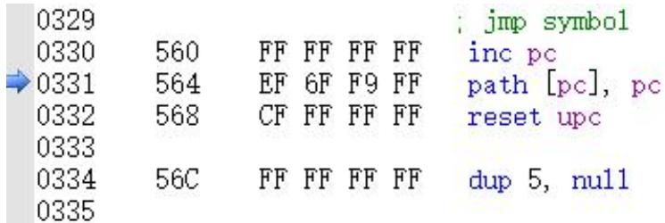  
图 4-1：无条件跳转指令

4. 打开 RAM存储器窗口，可以看到，当前 PC指向的存储单元保存的正是无条件跳转地址 07。  
5. 打开 PC 模块，可以看到 PC 的同步置数端 LOAD为低电平，置数信号有效。置数信号之所以有效，是因为 PC_LOAD_EN为低电平，IR2，IR3 均为高电平，8 选 1 数据选择器选择 D3输出到 Y 端，输出 Y取反后输出到 W 端，8选 1的 D3输入高电平，因此 LOAD为低电平。  
6. 可看到 PC的输入端数据 $\mathrm { D 0 } ^ { \sim } \mathrm { D } 7$ 正是跳转地址，打开存储器模块 MEM，可以看到该跳转地址是从存

储器 RAM 的 5号地址单元读出的。

7. 打开 PC 模块，输入单步时钟，PC 加载跳转地址 07，于是跳转到指定位置运行。  
8. 单步运行，直到程序执行完毕。  
9. 结束仿真。

通过上述仿真实验，我们分析了程序运行过程中顺序取指与无条件跳转的具体实现过程，简单地说，顺序取指是通过执行微指令 incpc 实现的，而程序跳转是通过执行微指令 path [pc]，pc实现的，具体属于哪一种跳转，则是由指令编码的 IR2 和 IR3决定的。

# 使用 JZ指令替换 JMP指令

改造源程序 ram.asm，使用为零则跳转指令 jz替换 jmp 指令，通过仿真，分析 jz 指令是如何实现跳转的。

# 提示：

（1） 为零则跳转指令 jz 是条件转移指令，发生跳转的条件是标志寄存器 FLAG 中的零标志位 ZF有效，即 ZF 为高电平。  
（2） 为了使 ZF为高电平，那么就需要在 jz指令之前通过执行一条运算指令，并使运算结果为 0。

# 使用 JC指令替换 JMP指令

改造源程序 ram.asm，使用有进位则跳转指令 jc替换 jmp 指令，通过仿真，分析 jc 指令是如何实现跳转的。

# 提示：

（1） 有进位则跳转指令 jc是条件转移指令，发生跳转的条件是标志寄存器 FLAG中的进位标志 CF有效，即 CF 为高电平。  
（2） 为了使 CF为高电平，可在 jc 指令之前执行一条加法运算指令，并使运算结果产生进位。

# 四、 思考与练习

1. 指令机器码中的 IR2和 IR3这两个位，既用于在 ROM中定位微指令的偏移位置，又用于控制跳转方式，所以就注定了 JC 指令的第一条微指令的偏移地址中的 5、6 位（从 0 开始）是 00，JZ 指令的是 01，而 JMP 指令的是 11，所以在 JMP指令和 JZ指令之间又填充了 32 个字节。读者可以在启动仿真后，在微指令的源代码窗口中找到这 3 条跳转指令，并检验他们的第一条微指令的偏移地址。再请读者考虑一个问题，如果让指令机器码中的 IR2和 IR3 这两个位只用于控制跳转方式，而不用于在 ROM中定位微指令的偏移位置的话，那么指令中还剩下多少位用于在 ROM中定位微指令的偏移位置？它们能寻址多少条指令的微指令呢？还够用吗？  
2. 目前，jmp、jz、jc指令都是跳转到绝对地址，也就是说在这些指令的第二个字节记录的都是绝对地址。首先，请读者考虑一下这种跳转到绝对地址的弊端，例如指令在内存中的位置被移动后（在一个受限的计算机系统内经常会这样做！），这些跳转指令还能正常执行吗？然后，请读者修改 PC模块的电路，当发生跳转时，不再将数据总线上的数据直接给 PC 寄存器，而是将数据总线上的数据和当前 PC的值相加后，再给 PC寄存器，从而使这些跳转指令可以跳转到相对地址。注意，除了修改 PC 模块的电路外，读者还需要修改汇编器的 C 源代码，在这些跳转指令的第二个字节中保存相对地址，而不再是绝对地址，即将 dmasm.c文件中第 1884 行替换为

“machine_code[reallocate_table[i].address] $=$ (BYTE)symbol_table[j].address -reallocate_table[i].address;”。

# 实验 5 存储器实验

实验性质：验证

建议学时：2学时

# 实验目的

掌握主存储器模块 MEM的读写访问。  
掌握主存储器模块 MEM在程序运行过程中的作用。

# 二、 预备知识

根据在计算机系统中的作用，存储器可分为主存储器、辅助存储器、缓冲存储器。

主存储器（主存）的主要特点是它可以和 CPU 直接交换信息。辅助存储器（辅存）是主存储器的后援存储器，用来存放当前暂时不用的程序和数据，它不能与 CPU直接交换信息。主存拥有速度快、容量小、每位价格高的特点。缓冲存储器（缓存）用在两个速度不同的部件之中，例如 CPU和主存之间可以设置一个快速缓存起到缓冲作用。

在 DM1000中，存储器模块 MEM 扮演主存储器的角色，它用来存储指令和数据，可以读或写。

# 三、 实验内容

# 3.1 任务（一）

掌握主存储器模块 MEM的工作原理，具体地说，MEM模块在 DM1000中承担两个功能：

（1） 读。从存储器读取指令或数据。  
（2） 写。将程序执行过程中的数据或地址信息写入存储器。

本任务通过对 MEM模块内部电路的仿真，使读者掌握存储器的读、写原理。

请读者按照下面方法之一在本地创建一个项目，用于完成本次任务：

# 方法一：从 CodeCode.net 平台领取任务

读者需要首先登录 CodeCode.net平台领取本次实验对应的任务，从而在 CodeCode.net平台上创建个人项目，然后使用 Dream Logic提供的“从 Git 远程库新建项目”功能将个人项目克隆到本地磁盘中。

# 方法二：不从 CodeCode.net 平台领取任务

如果读者不使用 CodeCode.net 平台，就需要使用 Dream Logic 提供的“从 Git 远程库新建项目”功能直接将实验模板克隆到本地磁盘中，实验模板的 URL为

https://www.codecode.net/engintime/Dream-Logic/Project-Template/DM1000/DM1000.git。

# 建议教师按照下面的步骤在 CodeCode.net平台上布置此次实验任务：

(1) 在计算机组成原理实验课程中，新建一个实验任务。  
(2) 在“新建任务”页面中，教师需要添写“任务名称”，推荐使用“实验 5 存储器实验-任务（一）”；还需要填写“模板项目 URL”，应该使用

“https://www.codecode.net/engintime/Dream-Logic/Project-Template/DM1000/DM1000.git”。

(3) 点击“新建任务”按钮，完成新建任务操作。

请读者按照下面的步骤完成本次实验：

1. 打开项目下的原理图文件 MEM.dlsche。

2. 在原理图中分别找出 MEM的各个输入输出端口，结合以下说明，熟悉电路：

（1） 端口 ABUS[7..0]，单向输入地址总线，为访问存储器提供地址。  
（2） 端口 DBUS[7..0]，双向输入/输出数据总线。写入时，外部数据通过该总线传送到存储器数据输入端；读出时，从存储器读出的指令或数据通过该总线传送到其他部件。  
（3） 端口 MEM_WR，单向输入控制信号，控制存储器的读写。当 MEM_WR 为低电平时，在输入时钟上升沿的触发下，可将数据写入存储器。当 MEM_WR为高电平时，RAM总是输出地址指定单元的内容。  
（4） 端口 MEM_GATE_EN，存储器输出门控制信号。当 MEM_GATE_EN 为低电平时，输出门 MEM_gate打开，从存储器读出的指令或数据就可以通过输出门传送到数据总线上。当 MEM_GATE_EN为高电平时，输出门关闭，存储器 RAM 的输出与总线隔离。  
（5） 端口 CLK，时钟信号。当存储器写使能，也就是 MEM_WR 为低电平时，输入数据不能立即写入存储器，还需要等待时钟上升沿到来时才能写入。  
（6） 从原理图中不难看出，存储单元 MEM的输入数据总线与输出数据总线是同一条。也就是存储器写入的数据是通过外部总线传送过来的，同时，从存储器读出的指令或数据也是通过外部总线传送到其它部件的。

读者对 MEM的各个输入输出端口有了基本的了解后，就可以在原理图中添加相应的输入信号，通过仿真模拟存储器的读写。

1. 删除图中的网络标签 DBUS0~DBUS7，断开输入信号和输出信号的连接，避免信号冲突。  
2. 分别使用 8 位交互式数字信号源作为存储器的地址和数据输入，使用一位交互式数字信号源作为存储器的读写控制信号，使用单周期时钟作为 RAM的 CLK输入。

3. 启动仿真。  
4. 将 RAM的读写控制信号 MEM_WR 设置为高电平，读存储器。  
5. 修改存储器 RAM 的输入地址，使地址从 0 递增到 8，依次读出每一个存储单元的内容，并通过存储器窗口显示的存储器内容进行比较验证，完成表格 5-1。

表 5-1：存储器 RAM的读出  

<table><tr><td>地址(两位十六进制表示)</td><td>存储器 RAM 输出值(使用十六进制表示)</td></tr><tr><td>00</td><td></td></tr><tr><td>01</td><td></td></tr><tr><td>02</td><td></td></tr><tr><td>03</td><td></td></tr><tr><td>04</td><td></td></tr><tr><td>05</td><td></td></tr><tr><td>06</td><td></td></tr><tr><td>07</td><td></td></tr><tr><td>08</td><td></td></tr></table>

以上步骤完成了对存储器 RAM的读操作，下面对存储器 RAM进行写操作。

1. 将存储器写信号置为有效，即 MEM_WR设为低电平。  
2. 将输入地址设置为 8。  
3. 将输入数据设置为 8。  
4. 输入一个时钟上升沿，在存储器窗口中可以看到，地址为 08的单元显示内容为 08，文本为红色，说明数据 08 已经写入存储器 08单元。  
5. 仿照以上方法，将地址和数据递减，逐个写入。  
6. 写入完成后，将 MEM_WR 设为高电平，依次读出地址 $\boldsymbol { 0 0 } ^ { \sim } \boldsymbol { 0 } \boldsymbol { 8 }$ 指向存储单元的数据，验证写入数据的正确性。  
7. 结束仿真。

# 提交作业

在提交作业前，读者需要将 MEM模块 SVG图形文件的链接添加到 README.md 文件中，这样，当使用浏览器查看提交后的线上项目时，就可以从 README.md 文件中看到修改后的 MEM模块了。方法如下：

1. 双击“项目管理器”中的 README.md 文件，使用一种合适的文本编辑器或者 Markdown 编辑器打开此文件。  
2. 在 README.md 文件的末尾添加如下的文本：

# 存储器模块 MEM


3. 保存 README.md 文件。  
4. 提交作业。

# 3.2 任务（二）

使用 DM1000 运行汇编程序，观察从存储器取指令和数据，以及将数据写入存储器的过程。

请读者按照下面方法之一在本地创建一个项目，用于完成本次任务：

# 方法一：从 CodeCode.net 平台领取任务

读者需要首先登录 CodeCode.net平台领取本次实验对应的任务，从而在 CodeCode.net平台上创建个人项目，然后使用 Dream Logic提供的“从 Git 远程库新建项目”功能将个人项目克隆到本地磁盘中。

# 方法二：不从 CodeCode.net 平台领取任务

如果读者不使用 CodeCode.net 平台，就需要使用 Dream Logic 提供的“从 Git 远程库新建项目”功能直接将实验模板克隆到本地磁盘中，实验模板的 URL为

https://www.codecode.net/engintime/Dream-Logic/Project-Template/DM1000/DM1000.git。

# 建议教师按照下面的步骤在 CodeCode.net 平台上布置此次实验任务：

(1) 在计算机组成原理实验课程中，新建一个实验任务。  
(2) 在“新建任务”页面中，教师需要添写“任务名称”，推荐使用“实验 5 存储器实验-任务（二）”；还需要填写“模板项目 URL”，应该使用

“https://www.codecode.net/engintime/Dream-Logic/Project-Template/DM1000/DM1000.git”。

(3) 点击“新建任务”按钮，完成新建任务操作。

请读者按照下面的步骤完成本次实验：

1. 打开项目下的汇编源程序文件 ram.asm，复制下列程序到 ram.asm中并保存：

<table><tr><td colspan="2">.text</td></tr><tr><td>mov a, 7</td><td>;将立即数7移到累加器a中</td></tr><tr><td>mov r2, 0xd0</td><td>;将立即数0xd0移到通用寄存器r2中</td></tr><tr><td>mov [r2], a</td><td>;将累加器a的值保存到r2指定的存储器单元(0xd0)中</td></tr></table>

2. 运行批处理文件 ram.bat，编译源程序。  
3. 打开项目下的原理图文件 DM1000.dlsche，启动仿真。  
4. 通过按键 S切换为单步运行。

接下来，我们以第一条指令 mova, 7为例，分析从存储器取指令和数据的过程。

1. 通过源程序窗口（源代码窗口 1）可以看到，当前正在执行指令 mova， 7。  
2. 通过微程序窗口（源代码窗口 2）可以看到，当前正在执行取指微指令。按下列说明进行观察，分析取指令过程：

$\textcircled{1}$ 打开存储器模块 MEM，可看到 MEM_WR为高电平，说明取指微指令对存储器 RAM进行读操作；  
$\textcircled{2}$ 当前输入地址为 0，这个地址是由 PC 提供的，打开 PC 模块，可看到程序计数器 PC 的值通过输出门 PC_gate 输出到了地址总线 ABUS 上。

$\textcircled{3}$ 打开 MEM 模块，从 0 地址读出的指令 $0 \mathrm { { x } 7 C }$ 通过存储器输出门传送到了数据总线上。说明指令已经读出，此时所有与数据总线连接的模块都能从数据总线上获取指令。  
$\textcircled{4}$ 打开真正使用指令的模块 CU，可看到指令寄存器 IR 使能，当前指令高 6 位扩展后得到的对应微程序入口地址传送到 uPC输入端。  
$\textcircled{5}$ 输入单步时钟，可看到指令 $0 \mathrm { { x } 7 C }$ 写入指令寄存器 IR，与此同时 uPC 写入指令对应微程序的入口地址 $\mathrm { 0 x 3 E 0 }$ 。

3. 取出指令后，首先执行的是指令“mova， 7”对应的第一条微指令“incPC”。输入单步时钟后，可看到存储器窗口中， $\mathrm { P C } { = } 1$ ，指向“mova， 7”的第二个字节“07”，这是指令中的立即数操作数。  
4. 执行完 incpc 后，微指令“path [pc], a”读出立即数并将立即数写入累加器 a中。打开存储器模块 MEM，可看到，从存储器读出地址 1 指向的字节“07”；打开 ALU模块，累加器 a使能，输入单步时钟，立即数 7 写入累加器 a 中。

指令 mova，7中包含了取指令和读立即数，需要两次对存储器 RAM 进行读访问。那么，存储器 RAM是如何通过指令进行数据写入的呢？请读者继续单步运行，分析最后一条指令“mov [r2]，a”，观察累加器a 中的数据是怎么写入寄存器 r2指向的存储单元中的。

# 实验 6 控制器实验

实验性质：验证+设计

建议学时：2学时

# 实验目的

掌握控制器模块 CU 的工作原理及其在指令执行过程中所起的作用。  
掌握 DM1000 指令集，学会编写特定功能的汇编源程序。

# 预备知识

控制单元是计算机内部的核心部件，可为完成不同指令发出各种操作命令——这些命令（控制信号）控制计算机的所有部件有次序地完成相应的操作，以达到执行程序的目的。控制单元的信号通常有以下几种，见表 6-1。

表 6-1：控制单元的信号  

<table><tr><td>分类</td><td>名称</td><td>功能</td></tr><tr><td rowspan="4">输入信号</td><td>时钟</td><td>使控制单元按一定的先后顺序、一定的节奏发出控制信号</td></tr><tr><td>指令寄存器</td><td>指令的操作码字段与时钟配合产生不同的控制信号</td></tr><tr><td>标志</td><td>根据上条指令的结果产生不同的控制信号</td></tr><tr><td>来自系统总线的控制信号</td><td>例如:中断请求、DMA请求</td></tr><tr><td rowspan="2">输出信号</td><td>CPU内的控制信号</td><td>CPU内的寄存器之间的传送和控制ALU实现不同操作</td></tr><tr><td>送至系统总线的信号</td><td>例如:命令主存或I/O读/写、中断响应等</td></tr></table>

DM1000 的控制单元是 CU模块，CU 模块的主要功能是：

1. 取指令，将取出的指令写入指令寄存器 IR 中，同时根据指令获取指令对应微程序入口地址并实现 uPC跳转执行。  
2. 指令执行过程中，uPC依次加 4，顺序执行微指令。  
3. uPC复位到 0，取下一条指令。

CU 模块中的微程序存储器 ROM输出的每一条微指令都对应 32 位控制信号，这些控制信号控制 DM1000完成指定的操作。控制信号的说明请参照附录 A 中的表 A-1。

DM1000 中的指令为单字节或双字节。若指令的操作数不涉及存储器操作，则指令的长度为一个字节，否则为两个字节。

# 2.1 指令结构

DM1000 指令集包括算术运算类指令、逻辑运算类指令、移位类指令、数据传输类指令、跳转类指令、中断返回类指令、输入/输出类指令等类别。DM1000指令集提供的指令请参考附录 A 中的表 A-4。

根据操作数的个数不同，可以将模型机汇编指令分为 3类，指令结构图如下：

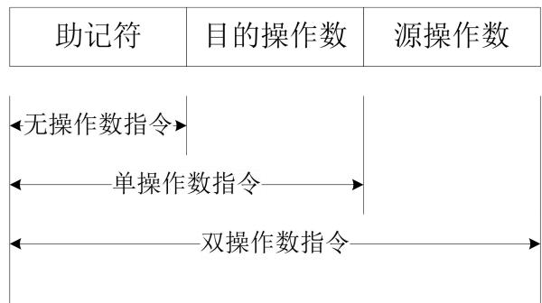  
图 6-1：DM1000汇编指令结构示意图

$\textcircled{1}$ 无操作数指令。仅有 IN、OUT、RET、IRET 和 NOP 等功能简单的指令。  
$\textcircled{2}$ 单操作数指令。包含移位指令、取反指令和跳转指令等。  
$\textcircled{3}$ 双操作数指令。机器中绝大部分指令均为这种类型，两个操作数中至少有一个是寄存器类型。

根据指令的长度可以将指令分为 2 类

$\textcircled{1}$ 单字节指令：只包含一个字节的机器码。当指令的寻址方式为累加器寻址、寄存器寻址、寄存器间接寻址时，一般为单字节指令  
$\textcircled{2}$ 双字节指令：第一个字节为机器码，第二个字节通常用于保存数据或者数据所在存储单元的地址。当指令的寻址方式为立即数寻址或存储器直接寻址时，一般为双字节指令。

指令的机器码包含一个字节，其格式如图 6-2所示。

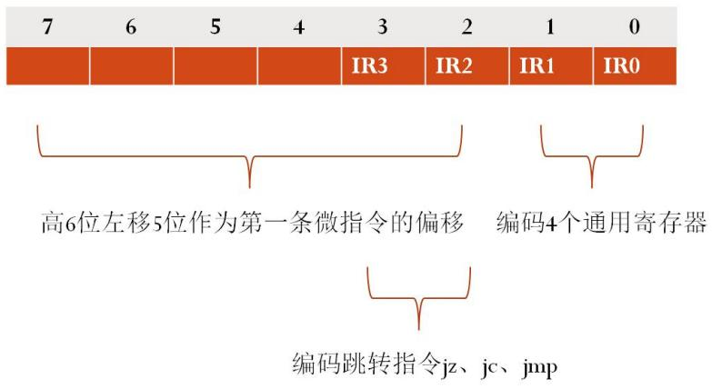  
图 6-2：指令机器码格式

# 2.2 指令的寻址方式

DM1000 的寻址方式分为累加器寻址、寄存器寻址、寄存器间接寻址、存储器直接寻址 5 种方式，寻址方式及简要说明如下表所示：

表 6-2：DM1000 寻址方式  

<table><tr><td>寻址方式</td><td>说明</td></tr><tr><td>累加器寻址</td><td>操作数为累加器A,例如NOT A是将累加器A的值取反;OUT指令隐含寻址累加器A,是将累加器A的值输出到OUT寄存器中。</td></tr><tr><td>寄存器寻址</td><td>参与运算的数据在寄存器RO~R3中,例如ADD A,RO指令是将RO寄存器的值加上累加器A的值,然后再写入累加器A中。</td></tr><tr><td>寄存器间接寻址</td><td>参与运算的数据在主存储器中,数据的地址在寄存器RO~R3中,例如MOV A,[R1]指令是将寄存器R1的值作为地址,把存储器中该地址单元的内容送入累加器A中。</td></tr><tr><td>存储器直接寻址</td><td>参与运算的数据在存储器中,数据的地址为指令的操作数。例如MOV A,Symbol是将符号Symbol指向的存储器中的数据放入累加器A中。</td></tr><tr><td>立即数寻址</td><td>参与运算的数据为指令的操作数。例如SUB A,0x10是将累加器A的值减去立即数0x10,结果存入累加器A中。</td></tr></table>

# 三、 实验内容

# 3.1 任务（一）

通过对 DM1000 中的控制单元 CU 进行单独仿真测试，观察 CU 模块取指令，执行指令微程序，然后取下一条指令的过程。

请读者按照下面方法之一在本地创建一个项目，用于完成本次任务：

# 方法一：从 CodeCode.net 平台领取任务

读者需要首先登录 CodeCode.net平台领取本次实验对应的任务，从而在 CodeCode.net平台上创建个人项目，然后使用 Dream Logic提供的“从 Git 远程库新建项目”功能将个人项目克隆到本地磁盘中。

# 方法二：不从 CodeCode.net 平台领取任务

如果读者不使用 CodeCode.net 平台，就需要使用 Dream Logic 提供的“从 Git 远程库新建项目”功能直接将实验模板克隆到本地磁盘中，实验模板的 URL为

https://www.codecode.net/engintime/Dream-Logic/Project-Template/DM1000/DM1000.git。

# 建议教师按照下面的步骤在 CodeCode.net 平台上布置此次实验任务：

(1) 在计算机组成原理实验课程中，新建一个实验任务。  
(2) 在“新建任务”页面中，教师需要添写“任务名称”，推荐使用“实验 6 控制器实验-任务（一）”；还需要填写“模板项目 URL”，应该使用

“https://www.codecode.net/engintime/Dream-Logic/Project-Template/DM1000/DM1000.git”。

(3) 点击“新建任务”按钮，完成新建任务操作。

请读者按照下面的步骤完成本次实验：

1. 打开项目下的原理图文件 CU.dlsche，结合表 6-3，熟悉控制单元 CU 的内部电路原理。

表 6-3：CU模块内部电路  

<table><tr><td>器件或模块名称</td><td>说明</td><td>功能</td></tr><tr><td>IR</td><td>指令寄存器</td><td>存储指令机器码的第一个字节,为指令执行提供寄存器编码(IRO、IR1)或转移指令类码(IR2、IR3)</td></tr><tr><td>uPC</td><td>微程序计数器</td><td>为微程序存储器ROM提供输入地址,从而读出指定微指令,发出控制信号</td></tr><tr><td>ROM</td><td>微程序存储器器</td><td>存储指令对应的微程序,执行指令时,只需顺序执行指令对应的微程序即可</td></tr><tr><td>uPC_NEXT</td><td>uPC加计数模块</td><td>计算下一条微指令地址,由于一条微指令占用4个字节,因此,uPC每次需要加4才能得到下一条微指令地址</td></tr><tr><td>IR_uAddress_gate</td><td>微程序入口地址输出门</td><td>将取出指令对应的微程序入口地址输出到uPC的输入端,下个时钟上升沿到来时,写入uPC,从而使uPC转去执行指令对应的微程序。只有取指令时,该三态门输出门才打开</td></tr><tr><td>IR_Fetch_gate</td><td>取指微指令地址输出门</td><td>由于取指微指令的地址为0,所以该输出门输出的是常数0。只有复位uPC时,该三态输出门才打开。</td></tr><tr><td>uPC_gate</td><td>微指令地址输出门</td><td>当顺序执行指令对应的微程序时,打开该三态输出门,将下一条微指令的地址输出到uPC输入端。</td></tr></table>

2. 为了单独仿真 CU 模块，需要在原理图中添加控制信号源和数据输入源。请读者使用 8 位交互式数字信号源作为 DBUS0~DBUS7 的输入，使用一个一位交互式数字信号源控制复位信号 RESET，使用一个单周期时钟源提供时钟 CLK信号。  
3. 启动仿真。

# 取指令

观察取指微指令的执行对 CU模块内部电路的影响。

1. 将复位信号 RESET置为高电平，复位无效。左侧源代码窗口中蓝色箭头指向取指微指令。  
2. 在电路中可看到 $\mathrm { u P C = 0 }$ ，指令对应微程序入口地址输出门 IR_uAddress_gate使能打开，从而将指令对应微程序入口地址输出到 uPC输入端。  
3. 将 8 位数字信号源输出修改为 10，观察此时指令寄存器 IR、微程序计数器 uPC 以及各个三态门的输入和输出。  
4. 输入一次单周期时钟，可看到 IR写入指令 10，而通过指令译码后 $\mathrm { u P C = 0 x 8 0 }$ ，指向指令“adda, rx”

对应的第一条微指令。

# 执行指令

指令的执行过程实质上是对应微程序指令顺序执行的过程。

1. 左侧的源代码窗口中蓝色箭头指向起始微指令。  
2. 在 CU模块仿真电路中可看到，微指令地址输出门 uPC_gate使能打开，下一条微指令地址输出到uPC输入端。  
3. 输入单周期时钟 CLK，可注意到 uPC依次加 4，左侧蓝色箭头指向表示微指令在顺序执行。  
4. 当运行到微指令“resetupc”时，在电路中可看到，取指微指令地址输出门 IR_Fetch_gate使能打开，0地址输出到 uPC输入端。  
5. 输入单周期时钟， $\mathrm { u P C = 0 }$ ，重新执行取指微指令，开始取下一条指令进行执行。

通过上述仿真可知，取指微指令将指令编码进行译码，从而得到指令对应的第一条微指令在 ROM中的地址，将此地址赋值给 uPC从而完成跳转，接下来顺序执行指令对应的每条微指令，从而完成指令的功能，最后将 uPC复位对下一条指令进行取指。这样不停地重复“取指-顺序执行-复位再取指”的过程，从而完成所有指令的执行。

# 提交作业

在提交作业前，读者需要将 CU 模块 SVG 图形文件的链接添加到 README.md 文件中，这样，当使用浏览器查看提交后的线上项目时，就可以从 README.md 文件中看到修改后的 CU 模块了。方法如下：

1. 双击“项目管理器”中的 README.md 文件，使用一种合适的文本编辑器或者 Markdown 编辑器打开此文件。  
2. 在 README.md 文件的末尾添加如下的文本：

# 控制器模块 CU


3. 保存 README.md 文件。  
4. 提交作业。

# 3.2 任务（二）

修改汇编程序文件 ram.asm，编写一段简单的汇编程序，通过跳转指令实现循环累加运算 $1 + 2 + 3 + 4 + 5$ ，并使用 OUT指令将计算的结果输出到外部设备的 ROUT 寄存器。

仿真运行编写的汇编程序，确保其可以正常运行。说明在 OUT 指令执行的过程中，控制器产生了哪些控制信号完成了将累加器 A中的数据发送到外部设备的 ROUT寄存器中。

请读者按照下面方法之一在本地创建一个项目，用于完成本次任务：

# 方法一：从 CodeCode.net 平台领取任务

读者需要首先登录 CodeCode.net平台领取本次实验对应的任务，从而在 CodeCode.net平台上创建个人项目，然后使用 Dream Logic提供的“从 Git 远程库新建项目”功能将个人项目克隆到本地磁盘中。

# 方法二：不从 CodeCode.net 平台领取任务

如果读者不使用 CodeCode.net 平台，就需要使用 Dream Logic 提供的“从 Git 远程库新建项目”功能直接将实验模板克隆到本地磁盘中，实验模板的 URL为

https://www.codecode.net/engintime/Dream-Logic/Project-Template/DM1000/DM1000.git。

# 建议教师按照下面的步骤在 CodeCode.net平台上布置此次实验任务：

(1) 在计算机组成原理实验课程中，新建一个实验任务。  
(2) 在“新建任务”页面中，教师需要添写“任务名称”，推荐使用“实验 6 控制器实验-任务（二）”；还需要填写“模板项目 URL”，应该使用

“https://www.codecode.net/engintime/Dream-Logic/Project-Template/DM1000/DM1000.git”。

(3) 点击“新建任务”按钮，完成新建任务操作。

请读者按照下面的提示完成本次实验：

1. 使用 ADD 指令完成加 1 操作，用于产生每个数据项。  
2. 将循环次数存储在 R3 寄存器中，每完成一次累加操作，使用 SUB 指令对 R3 寄存器减 1。然后使用 JZ指令判断循环计数变为 0 时，结束循环。

# 四、 思考与练习

1. 在设计一个处理器时，应该尽量简化设计，使用最少的逻辑门来实现功能，这样不但能够让处理器的架构简洁，还能减少芯片面积，降低功耗和散热，甚至还可以提高运行频率。CU控制器模块中的 uPC_NEXT 模块用于得到 uPC 加 4 后的值，其中包含了 4 个 74LS181 芯片，这会大大增加逻辑门的数量。请读者简化 CU 控制器模块的设计，删除 uPC_NEXT 和 uPC_gate 器件，将 uPC 替换为一个 16位同步置数/异步清零二进制加法计数器（功能表参见实验四的预备知识），然后让 uPC输出的 Q0 与 ROM 的 A2 连接，依此类推。这样当 uPC 加 1 时，ROM 的地址就会增加 4（数字系统设计中经常会用到此技巧）。需要注意的是，由于 uPC 的值左移 2 位后连接了 ROM 的地址，所以PC 的值在译码时就需要少移动 2 位了。此外，读者还要设计如何控制 uPC的 EN和 LOAD管脚，确保其在适当的时候进行加 1 操作。如果 CU控制器修改完毕后，在仿真时发现源代码窗口中的 uPC对应的蓝色箭头无法正确指向微指令也没有关系，毕竟此时uPC 的值已经与 ROM的地址不再对应了，此时读者只要判断汇编指令能够正确执行即可。  
2. 如果读者顺利完成了思考与练习的第 1 题，请读者再思考一下，如果继续删除 CU 控制器中的IR_uAddress_gate 和 IR_Fetch_gate 器件，然后让 UPC_RESET_EN 信号和 RESET 信号配合控制 uPC的 CLR信号，这样是否可行？在 uPC复位时的电路是否仍然符合“同步时序电路”的规则呢？如果这样存在问题的话，请读者设计一种计数器，能够满足这里的要求。  
3. 当前控制器中是直接使用 6 个控制信号（S0、S1、S2、S3、M、C）来控制运算器的运算方式的（共有 48种）。但是指令集中并没有用到所有的运算方式，所以可以通过设计一个译码电路，使用更少的控制信号，来产生运算器需要的 6个输入信号，从而可以节省控制信号，满足系统今后扩展的需要。请读者首先根据指令集中运算方式的数量，计算出最少需要使用几个控制信号，然后设计一个真值表，将 CU 模块的控制信号和译码后产生的 ALU模块的 6 个输入信号填入真值表中，最后根据真值表设计一个译码电路，还可以将此译码电路绘制到 DM1000 的原理图中，完成仿真验证。

# 实验 7 数据通路实验

实验性质：验证+设计

建议学时：2学时

# 实验目的

掌握数据通路的概念。  
掌握微指令和数据通路之间的关系。  
掌握数据通路的分析方法，并可以由数据通路得到微指令的机器码，为设计微指令打下基础。

# 二、 预备知识

# 2.1 数据通路

计算机系统中，各个部件通过数据总线连接形成的数据传送路径称为数据通路。数据从什么地方开始，中间经过哪些部件，最后传送到什么位置，都是分析数据通路时需要关注的问题。

数据通路是保证计算机内数据正确流动的硬件基础。在计算机中，从抽象的程序执行到具体的微指令的执行，实际是从软件到硬件的转换过程。

每一条数据通路对应一条微指令，微指令实质上是一组高低电平编码的控制信号，当这些控制信号作用在模型机上时，就可以规定一条数据通路。

# 2.2 微指令集

DM1000 微指令集其实就是机器语言指令集。模型机执行指令时，将该指令取出后，送至指令寄存器IR。同时将指令的高 6 位送至微程序计数器 uPC。指令寄存器的最低两位 $\mathrm { { I R } _ { 1 } \mathrm { { I R } _ { 0 } } }$ 作为通用寄存器的选择信号；高 6 位在程序执行时仅作为 uPC 的高 6 位使用。在跳转类指令 JMP、JC、JZ、CALL 中，指令的 3、4位 $\mathrm { I R _ { 2 } }$ 、 $\mathrm { { I R } _ { 3 } }$ 结合控制信号 ELP起到编码跳转方式的作用。请查看“程序计数器实验”相关内容了解详情。

uPC 为微程序计数器，uPC 指向微程序存储器中的微指令。微程序存储器始终输出 uPC 指定地址单元的微指令。将 DM1000 中的所有指令分步，每一步对应一组 32 位编码的控制信号序列（微指令），那么一条指令对应数条连续的微指令（微程序），将每条指令对应的微程序存储到微程序存储器特定位置（指令的高 6 位与低三位 0 组合得到 9 位地址码，可寻址 $0 \mathrm { x } 1 0 ^ { \sim } 0 \mathrm { x } 1 \mathrm { f f } )$ ），由于不同的指令，其高 6 位编码不同，所以就将各个指令的微程序存储到不同的位置，在执行每一种指令时，就通过其高 6位找到对应的微程序，通过 $\mathrm { u P C } { + 4 }$ 计数，依次取出并执行每一条微指令，微程序执行完，那么该指令也就执行完成了。注意：由于微程序存储器的最低两位地址始终是 0，所以，相连编码的两种指令，其对应的微程序地址至少相差 4的倍数，这样，一条指令对应的微指令条数就是 8的倍数，DM1000 中绝大多数指令对应 8 条微指令。结合项目下的微指令源程序文件 rom.masm 理解微指令，注意，不是每一个指令对应于一段微程序，而是每一种类型的指令对应于一段微程序。

微程序存储器中的微程序是如何得到的呢？由上可知，指令的编码是事先编好的，我们对每种指令执行过程进行分步，对每一步进行数据通路分析，从而得到其对应的 32 位控制信号编码，即微指令，这样就可以得到有序的微指令集。

# 2.3 同步时序电路

DM1000 模型机是按同步时序电路的原则设计的，模型机在运行程序的时候，在时钟的驱动下，总是由当前稳定状态迁入下一个稳定状态。

数字电路包含组合逻辑电路和时序逻辑电路。组合逻辑没有环路和竞争。如果将输入作用到组合逻辑电路中，输出总是在传播延迟内稳定为一个确定的值。但是，包含环路的时序电路存在不良的竞争或不稳定行为。为了避免时序电路中的竞争或不稳定，往往需要在环路中插入寄存器来断开电路，从而将电路转变成组合逻辑电路和寄存器的集合。寄存器包含系统的状态，这些状态仅仅在时钟上升沿到达时发生改变，所以说状态同步于时钟信号。如果时钟足够慢，使得在下一个时钟上升沿到达之前输入到寄存器的信号都

可以稳定下来，那么所有的竞争都将被消除。根据反馈环路上总是使用寄存器的原则，一个电路如果是同步时序电路，那么它由相互连接的电路元件构成，且满足以下条件：

每一个电路元件是寄存器或者组合电路。  
至少有一个电路元件是寄存器。  
$\bullet$ 所有寄存器都接收同一个时钟信号。  
每个环路至少包含一个寄存器。

# 三、 实验内容

# 3.1 任务（一）

通过使用 DM1000 仿真执行若干条指令，详细分析指令包含的微指令在执行过程中产生的数据通路。

请读者按照下面方法之一在本地创建一个项目，用于完成本次任务：

# 方法一：从 CodeCode.net 平台领取任务

读者需要首先登录 CodeCode.net平台领取本次实验对应的任务，从而在 CodeCode.net平台上创建个人项目，然后使用 Dream Logic提供的“从 Git 远程库新建项目”功能将个人项目克隆到本地磁盘中。

# 方法二：不从 CodeCode.net 平台领取任务

如果读者不使用 CodeCode.net 平台，就需要使用 Dream Logic 提供的“从 Git 远程库新建项目”功能直接将实验模板克隆到本地磁盘中，实验模板的 URL为

https://www.codecode.net/engintime/Dream-Logic/Project-Template/DM1000/DM1000.git。

# 建议教师按照下面的步骤在 CodeCode.net 平台上布置此次实验任务：

(1) 在计算机组成原理实验课程中，新建一个实验任务。  
(2) 在“新建任务”页面中，教师需要添写“任务名称”，推荐使用“实验 7 数据通路实验-任务（一）”；还需要填写“模板项目 URL”，应该使用

“https://www.codecode.net/engintime/Dream-Logic/Project-Template/DM1000/DM1000.git”。

(3) 点击“新建任务”按钮，完成新建任务操作。

请读者按照下面的步骤完成本次实验：

1. 打开项目下的汇编源程序文件 ram.asm，输入下列程序：

```txt
.text mov a, 3 mov r3, 4 add a, r3 
```

2. 编译源程序。  
3. 设置为单周期时钟仿真，然后启动仿真，并复位。

此时 DM1000 会在第一条微指令（取指微指令）产生的控制信号状态下，并等待时钟信号从而进入下一个状态。

# 分析取指微指令的数据通路

取指令操作是所有指令必备的操作，且操作过程完全一致。在 DM1000 中，是如何完成取指令操作的呢？相关控制信号说明如下：

1. 打开程序计数器 PC 模块，可看到 PC_A_GATE_EN 为低电平, 程序计数器 PC 向地址总线输出门PC_gate使能打开，PC值作为存储器的地址输出到地址总线 ABUS上。  
2. 打开存储器 MEM 模块，可看到 MEM_GATE_EN 为低电平，存储器输出门 MEM_gate 使能打开，从存储器读出一个字节（即指令的机器码 7C）输出到数据总线 DBUS上。

3. 打开控制单元 CU，可看到 IREN为低电平，指令寄存器 IR 写使能，时钟上升沿到来时即可将指令的机器码写入 IR 寄存器。由于 IREN 信号为低电平，总线输出门 IR_uAddress_gate 打开，同时微指令计数器uPC使能信号为低电平，时钟上升沿到来时，经过译码后的指令机器码就会写入uPC，作为 ROM的地址。

根据上述分析可以绘制出如图 7-1所示的通路示意图。其中方框表示寄存器，圆形表示组合逻辑电路。由于此时是读存储器，不需要时钟信号，所以这里把存储器也作为组合逻辑电路来理解了。请读者根据预备知识中描述的同步时序电路的概念，判断图 7-1所示的通路是否是一条同步时序电路。

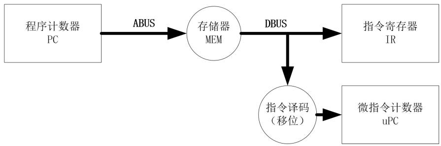  
图 7-1：path [pc], ir 微指令的数据通路

为了完成取指操作，应使得 PC_A_GATE_EN $= 0$ 、MEM_GATE_EN $= 0$ 、IREN $\scriptstyle { \left[ = 0 \right. }$ 、 $\mathrm { X 1 = 0 }$ 、 $\mathrm { X 2 = 0 }$ 。这就要求 ROM输出的控制信号应该如下表所示：

表 7-1：取指控制信号  

<table><tr><td>位置</td><td>名称</td><td>值</td><td>位置</td><td>名称</td><td>值</td></tr><tr><td>31</td><td>保留</td><td>1</td><td>15</td><td>CSP_LOAD</td><td>1</td></tr><tr><td>30</td><td>保留</td><td>1</td><td>14</td><td>REG_WR</td><td>1</td></tr><tr><td>29</td><td>UPC_RESET_EN</td><td>1</td><td>13</td><td>CN</td><td>1</td></tr><tr><td>28</td><td>PC_ADD</td><td>0</td><td>12</td><td>FLAG_REG_EN</td><td>1</td></tr><tr><td>27</td><td>CSP_U\D</td><td>1</td><td>11</td><td>X3</td><td>1</td></tr><tr><td>26</td><td>IA_REG_EN</td><td>1</td><td>10</td><td>X2</td><td>0</td></tr><tr><td>25</td><td>MEM_WR</td><td>1</td><td>9</td><td>X1</td><td>0</td></tr><tr><td>24</td><td>ROUT_REG_EN</td><td>1</td><td>8</td><td>X0</td><td>1</td></tr><tr><td>23</td><td>PC_A_GATE_EN</td><td>0</td><td>7</td><td>W_REG_EN</td><td>1</td></tr><tr><td>22</td><td>IREN</td><td>0</td><td>6</td><td>A_REG_EN</td><td>1</td></tr><tr><td>21</td><td>保留</td><td>1</td><td>5</td><td>M</td><td>1</td></tr><tr><td>20</td><td>PC_LOAD_EN</td><td>1</td><td>4</td><td>C</td><td>1</td></tr><tr><td>19</td><td>MAR_REG_EN</td><td>1</td><td>3</td><td>S3</td><td>1</td></tr><tr><td>18</td><td>MAR_GATE_EN</td><td>1</td><td>2</td><td>S2</td><td>1</td></tr><tr><td>17</td><td>ASR_REG_EN</td><td>1</td><td>1</td><td>S1</td><td>1</td></tr><tr><td>16</td><td>SP_REG_EN</td><td>1</td><td>0</td><td>S0</td><td>1</td></tr></table>

上表中，“1”表示高电平，“0”表示低电平。根据表 7-1可以得到取指微指令编码的二进制形式为：1110 1111 0011 1111 1111 1001 1111 1111。按照十六进制编码形式，可知其编码为 EF3FF9FF，这就是取指微指令在 ROM中的机器码。

请读者按照下面的步骤验证微指令的机器码：

1. 打开控制单元 CU，将 ROM输出信号与表 7-1 进行比较验证。  
2. 将表 7-1 中的取指微指令的十六进制编码与源代码窗口 2 中的取指微指令“path [pc], ir”的32 位机器码进行比较验证。

# 分析 ADD A， R3 指令的数据通路

加法指令 ADD A， R3 的功能可以描述为：取出 R3寄存器的内容并送至工作寄存器 W 中，设定 ALU做加法运算，ALU 将累加器 A 的值和工作寄存器 W 的值相加，结果回写到累加器 A 中。读者可以按照下面的步骤分析其数据通路。

1. 单周期运行程序直到 add a， r3 指令的第一条微指令 path rx, w 处。  
2. 分析此时 DM1000 的状态：在寄存器模块 REG 中，通用寄存器的选择是由指令机器码的低两位决定的，要选择寄存器 R3，指令机器码的 IR1和 IR0 的值都为 1；要读出通用寄存器的值，读信号REG_READ 需要为低电平，这样寄存器 R3 的值就可以放在数据总线上；ALU 单元的输入信号W_REG_EN 为低电平，即工作寄存器 W 写使能，下个时钟上升沿到来时，数据总线上的值就会写入W 寄存器。数据通路如图 7-2所示。控制器模块 CU中的 ROM输出的控制信号如表 7-2所示。

  
图 7-2：path rx, w 微指令的数据通路

表 7-2：取数控制信号  

<table><tr><td>位置</td><td>名称</td><td>值</td><td>位置</td><td>名称</td><td>值</td></tr><tr><td>31</td><td>保留</td><td>1</td><td>15</td><td>CSP_LOAD</td><td>1</td></tr><tr><td>30</td><td>保留</td><td>1</td><td>14</td><td>REG_WR</td><td>1</td></tr><tr><td>29</td><td>UPC_RESET_EN</td><td>1</td><td>13</td><td>CN</td><td>1</td></tr><tr><td>28</td><td>PC_ADD</td><td>0</td><td>12</td><td>FLAG_REG_EN</td><td>1</td></tr><tr><td>27</td><td>CSP_U\D</td><td>1</td><td>11</td><td>X3</td><td>1</td></tr><tr><td>26</td><td>IA_REG_EN</td><td>1</td><td>10</td><td>X2</td><td>0</td></tr><tr><td>25</td><td>MEM_WR</td><td>1</td><td>9</td><td>X1</td><td>1</td></tr><tr><td>24</td><td>ROUT_REG_EN</td><td>1</td><td>8</td><td>X0</td><td>0</td></tr><tr><td>23</td><td>PC_A_GATE_EN</td><td>1</td><td>7</td><td>W_REG_EN</td><td>0</td></tr><tr><td>22</td><td>IREN</td><td>1</td><td>6</td><td>A_REG_EN</td><td>1</td></tr><tr><td>21</td><td>保留</td><td>1</td><td>5</td><td>M</td><td>1</td></tr><tr><td>20</td><td>PC_LOAD_EN</td><td>1</td><td>4</td><td>C</td><td>1</td></tr><tr><td>19</td><td>MAR_REG_EN</td><td>1</td><td>3</td><td>S3</td><td>1</td></tr><tr><td>18</td><td>MAR_GATE_EN</td><td>1</td><td>2</td><td>S2</td><td>1</td></tr><tr><td>17</td><td>ASR_REG_EN</td><td>1</td><td>1</td><td>S1</td><td>1</td></tr><tr><td>16</td><td>SP_REG_EN</td><td>1</td><td>0</td><td>S0</td><td>1</td></tr></table>

根据表 7-2可知，将 R3 的值送到W 寄存器的微指令编码的二进制形式为：1110 1111 1111 1111 11111010 0111 1111。按照十六进制编码的形式，编码为 EFFFFA7F。

请读者按照下面的步骤验证微指令的机器码：

1. 打开控制单元 CU，将 ROM输出信号与表 7-2 进行比较验证。  
2. 将表 7-2所得的微指令编码与源代码窗口 2中的微指令“pathrx, w”的 32 位机器码进行比较验证。

接下来分析将求和的结果写到累加器 A 的数据通路：

1. 输入一次单周期时钟，完成将 r3 的数据写入 w 寄存器的微指令。  
2. 此时准备执行微指令 path alu_add, a。分析此时 DM1000的状态：A 和 W 的值需要做无进位的加

法运算，那么相关控制信号 $\mathrm { { M = } } 0$ (ALU 做算术运算)， $\mathrm { C } { = } 1$ (无进位)， $\mathrm { S } _ { 3 }$ $\mathrm { S } _ { 3 } ~ \mathrm { S } _ { 2 } ~ \mathrm { S } _ { 1 } ~ \mathrm { S } _ { 0 } = 1 0 0 1$ (加法)，FLAG_REG_EN 为低电平，标志寄存器使能，准备保存运算结果的各个标志； $\mathrm { { X } _ { 3 } }$ $\mathrm { \ : X _ { 3 } \ : \ : X _ { 2 } \ : \ : X _ { 1 } \ : \ : X _ { 0 } = 0 1 0 0 }$ $\mathrm { X _ { 2 } }$ ,就会打开 ALU 直通输出门 D_gate，将运算结果输出到数据总线上；A_REG_EN为低电平，累加器 A写使能，准备将数据总线上的计算结果写入累加器 A。数据通路如图 7-3 所示，注意，在环路上的累加器 A 确保这个通路符合同步时序电路的要求。控制器模块 CU 中的 ROM 输出的控制信号如表 7-3所示。

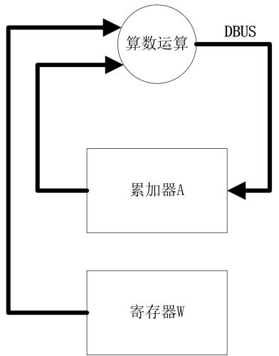  
图 7-3：path alu_add,a 微指令的数据通路

表 7-3：加法运算控制信号  

<table><tr><td>位置</td><td>名称</td><td>值</td><td>位置</td><td>名称</td><td>值</td></tr><tr><td>31</td><td>保留</td><td>1</td><td>15</td><td>CSP_LOAD</td><td>1</td></tr><tr><td>30</td><td>保留</td><td>1</td><td>14</td><td>REG_WR</td><td>1</td></tr><tr><td>29</td><td>UPC_RESET_EN</td><td>1</td><td>13</td><td>CN</td><td>1</td></tr><tr><td>28</td><td>PC_ADD</td><td>0</td><td>12</td><td>FLAG_REG_EN</td><td>0</td></tr><tr><td>27</td><td>CSP_U\D</td><td>1</td><td>11</td><td>X3</td><td>0</td></tr><tr><td>26</td><td>IA_REG_EN</td><td>1</td><td>10</td><td>X2</td><td>1</td></tr><tr><td>25</td><td>MEM_WR</td><td>1</td><td>9</td><td>X1</td><td>0</td></tr><tr><td>24</td><td>ROUT_REG_EN</td><td>1</td><td>8</td><td>X0</td><td>0</td></tr><tr><td>23</td><td>PC_A_GATE_EN</td><td>1</td><td>7</td><td>W_REG_EN</td><td>1</td></tr><tr><td>22</td><td>IREN</td><td>1</td><td>6</td><td>A_REG_EN</td><td>0</td></tr><tr><td>21</td><td>保留</td><td>1</td><td>5</td><td>M</td><td>0</td></tr><tr><td>20</td><td>PC_LOAD_EN</td><td>1</td><td>4</td><td>C</td><td>1</td></tr><tr><td>19</td><td>MAR_REG_EN</td><td>1</td><td>3</td><td>S3</td><td>1</td></tr><tr><td>18</td><td>MAR_GATE_EN</td><td>1</td><td>2</td><td>S2</td><td>0</td></tr><tr><td>17</td><td>ASR_REG_EN</td><td>1</td><td>1</td><td>S1</td><td>0</td></tr><tr><td>16</td><td>SP_REG_EN</td><td>1</td><td>0</td><td>SO</td><td>1</td></tr></table>

根据表7-3可得将A与W相加的结果写回累加器A的微指令编码的二进制形式为：111011111111 11111110 0100 1001 1001。按照十六进制编码的形式，编码为：EFFFE499。

请读者按照下面的步骤验证微指令的机器码：

1. 打开控制单元 CU，将 ROM 输出信号与表 7-3 进行比较验证。  
2. 将表 7-3所得微指令编码与源代码窗口 2中的微指令“pathalu_add, a”进行比较验证。  
3. 输入单步时钟，运算结果写入累加器 A。

# 4. 结束仿真。

请读者参考图 7-3，将“path alu_add, a”微指令的数据通路在 ALU模块的原理图中使用红色标识出来，也就是将所有参与构造此数据通络的网络连线选中后，在右侧的“属性”窗口将绘制颜色修改为红色。

# 提交作业

在提交作业前，读者需要将 ALU模块 SVG图形文件的链接添加到 README.md 文件中，这样，当使用浏览器查看提交后的线上项目时，就可以从 README.md 文件中看到修改后的 ALU模块了。方法如下：

1. 双击“项目管理器”中的 README.md 文件，使用一种合适的文本编辑器或者 Markdown 编辑器打开此文件。  
2. 在 README.md 文件的末尾添加如下的文本：

# 运算器模块 ALU

```txt
! [raw svg] (ALU.d1sche.svg) 
```

3. 保存 README.md 文件。  
4. 提交作业。

# 3.2 任务（二）

通过使用 DM1000 仿真执行若干条指令，详细分析指令包含的微指令在执行过程中产生的数据通路。

请读者按照下面方法之一在本地创建一个项目，用于完成本次任务：

# 方法一：从 CodeCode.net 平台领取任务

读者需要首先登录 CodeCode.net平台领取本次实验对应的任务，从而在 CodeCode.net平台上创建个人项目，然后使用 Dream Logic提供的“从 Git 远程库新建项目”功能将个人项目克隆到本地磁盘中。

# 方法二：不从 CodeCode.net 平台领取任务

如果读者不使用 CodeCode.net 平台，就需要使用 Dream Logic 提供的“从 Git 远程库新建项目”功能直接将实验模板克隆到本地磁盘中，实验模板的 URL为

```txt
https://wwwCodec.net/engintime/Dream-Logic/Project-Template/DM1000/DM1000.git。 
```

# 建议教师按照下面的步骤在 CodeCode.net平台上布置此次实验任务：

(1) 在计算机组成原理实验课程中，新建一个实验任务。  
(2) 在“新建任务”页面中，教师需要添写“任务名称”，推荐使用“实验 7 数据通路实验-任务（二）”；

还需要填写“模板项目 URL”，应该使用

```powershell
"https://wwwcodecode.net/engintime/Dream-Logic/Project-Template/DM1000/DM1000.git". 
```

(3) 点击“新建任务”按钮，完成新建任务操作。

请读者打开项目下的汇编源程序文件 ram.asm，输入下列程序。这个汇编程序是将存储器中的数据放入累加器 A 中，num标签用来在数据段中定义一个变量，也就是在内存中的指定位置放入了一个字节的数据，num代表这个数据在内存中的地址。

.text

mov a, num

.data

num: 0x88

编译通过后启动仿真。在仿真过程中，请读者重点查看微指令 path [pc], mar 和 path [mar], a 的数据通路，并仿照图 7-1和表 7-1的形式绘制这两条微指令的数据通路图和控制信号表格，重点理解地址寄存器 mar的作用。设想一下如果没有 mar是否可以完成类似的工作呢？

请读者将“path [mar], a”微指令的数据通路在原理图中使用红色标识出来，也就是将所有参与构造此数据通络的网络连线选中后，在右侧的“属性”窗口将绘制颜色修改为红色。

# 提交作业

在提交作业前，读者需要将 ALU模块和 MEM模块的 SVG 图形文件的链接添加到 README.md 文件中，这样，当使用浏览器查看提交后的线上项目时，就可以从 README.md文件中看到修改后的 ALU模块和 MEM模块了。方法如下：

1. 双击“项目管理器”中的 README.md 文件，使用一种合适的文本编辑器或者 Markdown 编辑器打开此文件。  
2. 在 README.md 文件的末尾添加如下的文本：

```markdown
# 运算器模块 ALU  
! [raw svg] (ALU.dlsche.svg)  
# 存储器模块 MEM  
! [raw svg] (MEM.dlsche.svg) 
```

3. 保存 README.md 文件。  
4. 提交作业。

# 3.3 任务（三）

通过使用 DM1000 仿真执行若干条指令，详细分析指令包含的微指令在执行过程中产生的数据通路。

请读者按照下面方法之一在本地创建一个项目，用于完成本次任务：

# 方法一：从 CodeCode.net 平台领取任务

读者需要首先登录 CodeCode.net平台领取本次实验对应的任务，从而在 CodeCode.net平台上创建个人项目，然后使用 Dream Logic提供的“从 Git 远程库新建项目”功能将个人项目克隆到本地磁盘中。

# 方法二：不从 CodeCode.net 平台领取任务

如果读者不使用 CodeCode.net 平台，就需要使用 Dream Logic 提供的“从 Git 远程库新建项目”功能直接将实验模板克隆到本地磁盘中，实验模板的 URL为

```txt
https://wwwCodec.net/engintime/Dream-Logic/Project-Template/DM1000/DM1000.git。 
```

# 建议教师按照下面的步骤在 CodeCode.net平台上布置此次实验任务：

(1) 在计算机组成原理实验课程中，新建一个实验任务。  
(2) 在“新建任务”页面中，教师需要添写“任务名称”，推荐使用“实验 7 数据通路实验-任务（三）”；还需要填写“模板项目 URL”，应该使用

```txt
"https://wwwCodec.net/engintime/Dream-Logic/Project-Template/DM1000/DM1000.git"。 
```

(3) 点击“新建任务”按钮，完成新建任务操作。

请读者打开项目下的汇编源程序文件 ram.asm，输入下列程序。这个汇编程序完成了函数调用功能，即调用一个函数 fun完成加法运算。参与加法运算的两个加数是通过寄存器 R0 和 R1 传入函数 fun的，在函数中完成了加法运算，然后将计算结果通过寄存器 R0 返回给调用者，最后调用者使用 out 指令将计算结果输出到外部寄存器。fun标签用来定义函数的入口点，call指令完成函数调用，在函数中使用 ret指令返回。

```asm
.text mov sp, 0xf8 mov r0, 1 mov r1, 2 call fun mov a, r0 out 
```

```txt
fun: mov a, r0 add a, r1 mov r0, a ret 
```

在读者开始仿真这段汇编程序之前，需要对 call指令、ret指令和栈的使用有一个初步的了解。

栈

栈在处理器运行过程中有十分重要的作用。DM1000 使用 sp寄存器指向栈顶，所以在汇编程序的开始就将sp 的值进行了初始化，使之指向存储器中的一个可用的位置。当有数据入栈时，先将 sp的值减 1，使 sp寄存器指向存储器中的新栈顶，然后将从某个寄存器得来的一个字节的数据写入 sp 指向的栈顶位置；当出栈时，先将 sp 指向的栈顶位置的数据放入一个寄存器中，然后将 sp的值加 1。在函数调用、中断调用等场合都会用到栈。以函数调用为例，call 指令执行时会将 PC 寄存器中的函数返回地址入栈，ret 指令会将函数返回地址出栈到 PC寄存器中，从而让程序从 call指令的下一条指令继续运行。

# Call 指令

Call 指令主要完成两项工作：一项工作是将 PC寄存器中的函数返回地址入栈，另外一项工作是将函数入口点的地址传递给 PC 寄存器，从而跳转到函数入口点继续运行。

# Ret 指令

Ret 指令主要是将函数返回地址出栈，并放入 PC 寄存器，从而让程序从 call 指令的下一条指令继续运行。

编译通过后启动仿真。在仿真过程中，请读者重点查看 call 指令的微指令和 ret 指令的微指令的执行过程，掌握这两条指令是如何配合起来完成函数调用功能的。另外，还要重点掌握 DM1000 是如何使用sp 寄存器实现栈功能的，以及 sp寄存器是如何通过 csp计数器实现加 1和减 1 操作的。

完成仿真后，尝试回答下面的问题：

1. 函数 fun的入口地址是多少？ Call指令是如何知道 fun函数的入口地址的？  
2. Call 指令执行时是如何得到函数的返回地址的？函数的返回地址是多少？函数的返回地址入栈操作本质上就是将函数的返回地址放在了存取器中，其在存储器中的地址是多少？

为了加深理解，请读者仿照图 7-1 和表 7-1 的形式绘制微指令 path sp_dec, csp 的数据通路图和控制信号表格。然后在原理图中将 path sp_dec, csp 微指令的数据通路使用红色标识出来，也就是将所有参与构造此数据通络的网络连线选中后，在右侧的“属性”窗口将绘制颜色修改为红色。

# 提交作业

在提交作业前，读者需要将 REG模块的 SVG图形文件的链接添加到 README.md 文件中，这样，当使用浏览器查看提交后的线上项目时，就可以从 README.md文件中看到修改后的 REG模块了。方法如下：

1. 双击“项目管理器”中的 README.md 文件，使用一种合适的文本编辑器或者 Markdown 编辑器打开此文件。  
2. 在 README.md 文件的末尾添加如下的文本：

# 寄存器模块 REG


3. 保存 README.md 文件。  
4. 提交作业。

# 实验 8 中断实验

实验性质：验证 $^ +$ 设计

建议学时：4学时

# 实验目的

熟悉中断请求、中断响应、中断处理及中断返回的过程。  
掌握软中断和硬中断实现原理。

# 二、 预备知识

# 2.1 中断

在计算机执行程序的过程中，当出现异常情况或特殊请求时，计算机停止现行程序的运行，转向对这些异常情况或特殊请求的处理，处理结束后再返回到现行程序的中断处，继续执行原程序，这就是“中断”。中断是现代计算机能有效合理地发挥效能和提高效率的一个十分重要的功能。通常把实现这种功能所需的软硬件技术统称为中断技术。

中断的类型可以参见表 8-1。

表 8-1：中断类型  

<table><tr><td>分类</td><td>名称</td><td>定义</td></tr><tr><td rowspan="4">硬中断</td><td>可屏蔽中断</td><td>可通过在中断屏蔽寄存器中设定位掩码来关闭</td></tr><tr><td>非可屏蔽中断</td><td>无法通过在中断屏蔽寄存器中设定位掩码来关闭</td></tr><tr><td>处理器间中断</td><td>一种特殊的硬件中断，由处理器发出，被其他处理器接收</td></tr><tr><td>伪中断</td><td>一类不希望被产生的中断</td></tr><tr><td>软中断</td><td>软中断</td><td>由一条中断指令触发，用以自陷进入一个中断服务程序</td></tr></table>

# 2.2 软中断

在 DM1000 中，软中断是指一个程序通过执行一条 INT 指令去主动调用中断服务程序，中断服务程序执行完毕后，中断返回，CPU从中断位置继续执行原来的程序。

# 2.3 硬中断

在 DM1000中，硬中断是指当 CPU检测到外部设备发出的中断请求时，CPU打断正在执行的程序，转去执行对应的中断服务程序，中断服务程序执行完毕后，CPU返回到中断位置继续执行原来的程序。

硬中断的执行过程可以分为四个步骤：

# （1）保护现场

为了从中断服务程序返回后，被中断的程序可以继续运行，有必要将中断时的现场保存起来，这通常是将处理器内部的一些寄存器入栈来实现的，例如标志寄存器等。此外还需要将程序中断处的下一条指令的地址入栈。DM1000 的初始版本还没有实现保护现场功能。

# （2）执行对应的中断服务程序

不同的中断请求源对应的中断服务程序是不同的，这样才能为不同的外部设备提供不同的中断服务。将所有中断服务程序的入口地址（起始地址）保存在一个连续的主存储区域中，就得到了一个可供查询的中断向量表。当发生外部中断时，CPU根据中断号在中断向量表中查询到对应的中断向量，然后在从中断向量中得到中断服务程序的入口地址，就可以调用中断服务程序了。

在 DM1000 中，由于硬件电路设计的原因，中断向量表位于存储器中的 0xf8~0xff 区域，一个中断向量占用一个字节，其中存放了中断服务程序的入口地址，所以 DM1000 的中断向量表中只能存放八个中断向量。

中断向量表中的内容必须由汇编程序的开发者填入，所以读者在编写中断服务程序后，必须通过

编程的方式将中断向量写入中断向量表中对应的位置。下图展示的是含有两个中断服务程序时主存储器的布局：

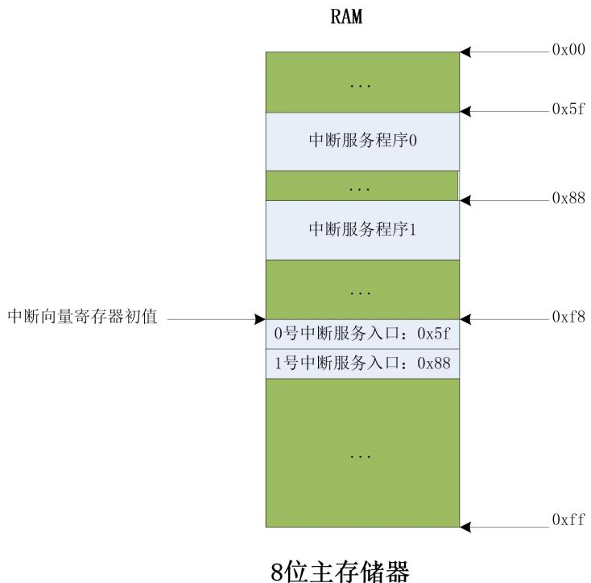  
图 8-2：DM1000 中断服务程序及中断向量存储位置示意图

# （3）恢复现场

在中断服务程序结束时，需要将之前被打断程序的“现场”恢复到原来的寄存器中，例如将标志寄存器的值出栈。由于在 DM1000 的初始版本中还没有实现中断调用保护现场功能，所以在中断服务程序结束时，也就无需恢复现场了。

# （4）中断返回

中断服务程序的最后一条指令通常是一条中断返回指令 iret，该指令会将之前保存在栈中的中断返回地址出栈到 PC寄存器中，从而回到被打断的程序处继续运行。

# 三、 实验内容

# 3.1 任务（一）软中断

仿真运行含有软中断指令 INT的汇编程序，观察软中断的实现过程。

请读者按照下面方法之一在本地创建一个项目，用于完成本次任务：

方法一：从 CodeCode.net 平台领取任务

读者需要首先登录 CodeCode.net平台领取本次实验对应的任务，从而在 CodeCode.net平台上创建个人项目，然后使用 Dream Logic提供的“从 Git 远程库新建项目”功能将个人项目克隆到本地磁盘中。

方法二：不从 CodeCode.net 平台领取任务

如果读者不使用 CodeCode.net 平台，就需要使用 Dream Logic 提供的“从 Git 远程库新建项目”功能直接将实验模板克隆到本地磁盘中，实验模板的 URL为

```txt
https://wwwCodec.net/engintime/Dream-Logic/Project-Template/DM1000/DM1000.git。 
```

# 建议教师按照下面的步骤在 CodeCode.net 平台上布置此次实验任务：

(1) 在计算机组成原理实验课程中，新建一个实验任务。  
(2) 在“新建任务”页面中，教师需要添写“任务名称”，推荐使用“实验 8 中断实验-任务（一）”；还需要填写“模板项目 URL”，应该使用

```txt
"https://wwwCodec.net/engintime/Dream-Logic/Project-Template/DM1000/DM1000.git"。 
```

(3) 点击“新建任务”按钮，完成新建任务操作。

请读者按照下面的步骤完成本次实验：

1. 打开项目下的源程序文件 ram.asm，将下面的汇编程序写入 ram.asm文件中。此汇编程序安装了0号软中断的中断服务程序，并通过 INT指令完成了对 0号软中断的调用。

.text

mov sp, 0xf8 ; 初始化栈。栈底紧邻中断向量表

lea a, INT0 ; 将 0 号中断的入口地址放入寄存器 A

mov r0, 0xf8 ; 将中断向量表中 0 号中断的位置放入 R0 寄存器

mov [r0], a ; 在中断向量表中安装 0 号中断的中断向量

int 0 ; 调用 0 号中断

ENDLOOP:

jmp ENDLOOP

INT0:

mov a, 0xff ; 0 号中断服务程序，只是简单修改寄存器 A 的值

iret

2. 保存并编译 ram.asm 源程序。  
3. 启动仿真，使用单周期时钟运行程序。观察每一条指令的执行过程，重点理解中断调用和中断返回的实现过程。

完成仿真后，尝试回答下面的问题：

1. 0 号中断服务程序的入口地址是多少？中断向量表中存放的 0 号中断向量的值是多少？  
2. INT 指令是如何得到中断号 0 的？又是如何根据中断号 0 得到其中断向量在中断向量表中的位置的？  
3. INT 指令执行时是如何得到中断返回地址的？此次中断的返回地址是多少？中断返回地址入栈操作本质上就是将中断返回地址放在了存取器中，其在存储器中的地址是多少？

请读者在此汇编程序的基础上进行修改，再安装一个 1 号软中断的中断服务程序。在 1 号软中断的中断服务程序中，将寄存器 R0 和 R1 的值相加，结果通过 R0 寄存器返回。然后，通过调用 1 号软中断计算$8 { + } 1 6$ 的结果。

# 3.2 任务（二）硬中断

请读者按照下面方法之一在本地创建一个项目，用于完成本次任务：

# 方法一：从 CodeCode.net 平台领取任务

读者需要首先登录 CodeCode.net平台领取本次实验对应的任务，从而在 CodeCode.net平台上创建个人项目，然后使用 Dream Logic提供的“从 Git 远程库新建项目”功能将个人项目克隆到本地磁盘中。

# 方法二：不从 CodeCode.net 平台领取任务

如果读者不使用 CodeCode.net 平台，就需要使用 Dream Logic 提供的“从 Git 远程库新建项目”功能直接将实验模板克隆到本地磁盘中，实验模板的 URL为

```txt
https://wwwCodec.net/engintime/Dream-Logic/Project-Template/DM1000/Hardware-IRQ.git。 
```

建议教师按照下面的步骤在 CodeCode.net 平台上布置此次实验任务：

(1) 在计算机组成原理实验课程中，新建一个实验任务。

(2) 在“新建任务”页面中，教师需要添写“任务名称”，推荐使用“实验 8 中断实验-任务（二）”；还需要填写“模板项目 URL”，应该使用“https://www.codecode.net/engintime/Dream-Logic/Project-Template/DM1000/Hardware-IRQ.git”。  
(3) 点击“新建任务”按钮，完成新建任务操作。

请读者按照下面的步骤完成本次实验：

Hardware-IRQ是一个基于 DM1000，能响应并处理硬中断的 8 位模型机。与 DM1000相比，主要变化体现在电路以及微程序上。请读者打开项目下的原理图文件 Hardware-IRQ.dlsche，结合电路，理解下列所述变化。

# 电路的变化：

1) 增加了一个硬中断控制器 IRQ，用来判别不同优先级的中断请求，并向 CPU发出中断请求信号，申请中断服务。该中断控制器支持 8级中断请求，支持中断嵌套。IRQ由 3 个功能模块构成：

 中断请求模块 IRR。记录 8 个中断源发出的中断请求信号，上升沿触发中断请求。当某个中断请求被响应后，清除对应的位，避免重复响应。  
 中断优先级判别器 PR。将新的中断请求与当前正在服务的中断请求进行优先级比较，若新的中断请求优先级低于当前正在服务的中断请求，则需要等待当前正在执行的中断服务程序返回后才能获取中断服务。若新的中断请求优先级高于当前正在服务的中断请求，则 CPU转去执行高优先级的中断服务程序，执行完后，返回继续执行还未完成的低优先级中断服务程序。  
 中断服务寄存器 ISR。记录当前正在服务的所有中断请求。若有多个标志处于有效状态，则表示当前存在中断嵌套。

2) 增加了一个硬中断使能控制信号 IF，用来控制 CPU 是否屏蔽硬中断请求。当 $\mathrm { I F } { = } 1$ 时，CPU 允许响应硬中断请求；当 $\mathrm { { I F } = 0 }$ 时，CPU屏蔽硬中断请求。

# 微程序 rom.asm 的变化：

1) 在每条指令的微指令最后位置添加了一条微指令 ask_for_int，用于查询是否有硬中断请求。  
2) 硬中断处理微程序中增加微指令 inta1 用来记录中断号，inta2 用来读取中断号并将其写入中断向量寄存器 IA 中，IA指向的存储单元中存放了中断服务程序的入口地址。  
3) 中断返回指令iret中增加了微指令eoi，该微指令用来清除中断服务寄存器ISR中对应的标志位，表示对应中断服务程序已经执行完毕，将其移除正在服务的中断请求队列。

下面，我们通过实验，完成硬中断请求、判优、响应、服务和返回的整个过程。实验步骤如下：

1. 熟悉中断控制器 IRQ的内部电路。  
2. 在 Hardware-IRQ.dlsche 中找到用于控制中断是否允许的信号源 IF。  
3. 打开汇编源程序文件 ram.asm，熟悉代码，理解中断的安装。  
4. 打开项目下的微程序源文件 rom.asm，在每种指令后有一条微指令 ask_for_int，该微指令用来查询中断请求。

在对电路有了基本的了解后，接下来通过仿真，模拟单个中断响应过程。模型机启动仿真后，首先需要安装所有的中断服务程序。

1. 打开原理图 Hardware-IRQ.dlsche，启动仿真。  
2. 通过按键 F，使 $\mathrm { I F } { = } 0$ ，禁止中断。因为在执行中断服务程序安装的过程中，还无法响应中断，所以必须先禁止中断。  
3. 通过按键 R，进行复位。  
4. 通过按键 S，切换为自动时钟，程序自动执行。当代码运行到 3号中断安装时，切换为单步时钟。

我们通过 3 号中断的安装过程，熟悉安装中断的原理。单步运行，完成下列步骤：

1. 逐步运行安装 3 号中断的第一条指令 lea a, int_3，该条指令将3 号中断服务程序的首地址int_3写入累加器 a中。  
2. 运行指令 mov r0, 0xfb，将 0xfb 写入 r0 中，0xfb 指向的存储单元存放的是 3 号中断服务程序的入口地址 int_3。  
3. 运行指令 mov [r0], a，将 3 号中断服务程序的入口地址（int_3）写入 r0（0xfb）指向的存储单元中，完成 3 号中断安装。  
4. 安装完成后，打开 ram存储器窗口，查看 0xfb所指单元的内容，将其与源代码窗口 1 中标号 int_3下的第一条指令地址相比，相同则安装正确。  
5. 切换为自动时钟，安装后续的中断。  
6. 所有中断安装完成后，查看存储器窗口 ram 中地址为 0xf8~0xff的内容，分别与中断 $0 ^ { \sim } 7$ 的入口地址相比，相同则所有安装正确。

通过上述的实验步骤，我们得出这样的结论，中断的安装过程就是将各个中断服务程序的第一条指令地址（入口地址/首地址）分别写入对应中断向量指向的存储单元中。具体到 Hardware-IRQ，中断向量表从地址 0xf8 开始（包含 0xf8），到 0xff，依次存放 $0 ^ { \sim } 7$ 号中断的服务程序入口地址。

所有中断安装完成后，模型机开始运行主程序，此时就可以允许中断了。我们通过仿真，跟踪 3号中断的响应过程。步骤如下：

1. 切换为单步时钟。  
2. 通过按键 F，设置 $\mathrm { I F } { = } 1$ ，打开中断允许开关。  
3. 通过按键 3，按下然后抬起，发出一个上升沿，模拟 3 号中断源发出中断请求。INTR输出高电平。  
4. 单周期运行程序，直到出现第一条微指令 ask_for_int，打开控制单元 CU，当前微程序计数器 uPC的输入端的值是 780（但是还没有写入 uPC），它指向硬中断处理微程序的首地址。结合控制信号IF、中断请求信号 INTR以及 ASK_FOR_INT，分析为什么是这个值？  
5. 输入单步时钟，uPC 变为 780，源代码窗口 2 中蓝色箭头指向 780 处，这是硬中断处理程序的第一条微指令。

通过上述步骤可知，在允许中断的情况下，当 CPU通过微指令 ask_for_int 查询到中断请求时，将 ROM中固定位置处的硬中断处理微程序首地址传送到 uPC 的输入端，下个时钟上升沿到来时，写入 uPC，从而跳转到硬中断处理微程序处执行。

1. 输入单步时钟，运行硬中断处理微程序。结合注释以及单步仿真电路数据通路，分析每一条微指令的功能是如何实现的？返回地址入栈后，从存储器窗口观察入栈后的内容。  
2. 当硬中断微程序执行完后，PC 转去执行 3号中断服务程序。  
3. 中断服务程序执行完后，结合指令 iret 的执行过程，理解中断返回地址出栈的过程。  
4. 继续单步运行程序，直到中断返回。  
5. 结束仿真。

上述的实验完成了一个硬中断响应的全过程。下面请读者自行模拟三种中断情形（允许中断的条件下），并详细记录这三种情形下的工作过程。

打开中断允许标志后，微指令 ask_for_int查询到有多个中断请求的情形。  
当 CPU正在运行一个中断服务程序时，发出一个或多个低优先级中断请求的情形。  
当 CPU正在运行一个中断服务程序时，发出一个或多个高优先级中断请求的情形。

# 四、 思考与练习

1. 软件中断和硬件中断有什么不同？从触发机制以及中断处理过程两方面进行分析。

2. 在带有外部中断请求的模型机上运行硬中断服务程序的过程中，若触发一个优先级更高的硬件中断，那么机器将响应新的硬件中断服务程序，即中断嵌套，请通过仿真进行验证？  
3. 计算机在运行中断服务程序之前需要保护现场。在 DM1000 中，只需要保存中断返回地址即可，结合仿真过程，分析中断是如何保存返回地址的？又是如何恢复返回地址的？  
4. 当计算机在工作时出现异常情况，需要产生一个中断对这些异常情况或特殊请求进行处理，如访问存储器时发生的缺页中断。翻阅资料，了解系统工作时对异常情况的处理过程以及处理结果，分析其对计算机运行效率的影响。  
5. 在计算机工作过程中，往往会由于执行某些指令导致异常，比如除法指令的除数为 0，从而导致异常，这时，会触发一个异常中断，调用异常中断服务程序，处理完异常后，返回重新执行发生异常的那条指令。请读者尝试在 DM1000 上做适当的改进，实现异常的处理。  
6. 在任务二中，当 DM1000 被中断请求打断时，直到所有中断请求都得到响应和服务后才会返回。若修改中断返回指令 iret的微程序，将 iret中的微指令 ask_int删除，并在最后补充一条占位微指令 dup 1, null。DM1000 响应单中断请求的过程有变化吗？多中断呢？为什么。  
7. 手动控制硬中断的允许与禁止标志 IF是一件麻烦的事，若能通过指令控制标志 IF就方便多了。请读者在标志寄存器中添加一个 IF标志位，并实现指令 CLI 和 STI，分别用来将标志寄存器中的中断标志 IF清零或置 1，当 CPU需要禁止硬中断时，将 IF 清零，当 CPU允许中断时，将 IF置 1。注意，CPU复位时会将标志寄存器中所有的标志位清零，IF标志也会清零，所以一开始 CPU是无法响应硬中断的，必须执行一条 STI指令后才能响应硬中断。  
8. 尝试为 DM1000 实现中断现场保护功能，也就是在发生中断时，自动将标志寄存器入栈，并将标志寄存器清零，在中断返回时，再自动将标志寄存器出栈。这样，中断服务程序在执行过程中，就可以使用一个新的标志寄存器，而不是被之前的程序修改后的标志寄存器，而且中断服务程序对标志寄存器的修改，也不会影响到被打断程序的运行，因为中断返回后，旧的标志寄存器的值会出栈，被打断的程序仍然可以正常运行。注意，由于中断服务程序开始运行时，标志寄存器被清零了，IF标志也会变为 0（如果已经在标志寄存器中实现了 IF标志位的话），所以如果需要允许中断嵌套的话，必须在中断服务程序开始的位置使用 STI指令允许中断嵌套。

# 实验 9 指令和微指令设计实验

实验性质：设计

建议学时：4学时

# 实验目的

掌握指令和微指令的概念。  
 能够修改指令汇编器和微指令汇编器的 C源代码文件，从而设计新的指令和微指令。

# 二、 预备知识

# 指令汇编器源代码文件 dmasm.c

指令汇编器源代码文件 dmasm.c 存放在 DM1000 的项目文件夹中，使用 C 语言编写，可以使用 C 编译器将其编译为 dmasm.exe可执行文件，作为 DM1000 的指令汇编器，用于将汇编程序编译为可以在 DM1000中运行的二进制文件。此汇编器使用经典的两遍扫描方法处理汇编代码，其 mian 函数的流程图如图 9-1所示。

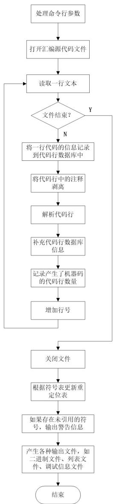  
图 9-1：dmasm.c 文件中 main 函数的流程图。

需要特别说明的是，在解析代码行时使用了“表驱动”的编程模式，就是将指令操作码作为关键字，使用

该关键字在表 keyword_function_table 中查找到对应的表项，然后调用表项中记录的处理函数。所以在表keyword_function_table 的每个表项中都存储了两个元素，第一个元素是关键字字符串指针的地址（指针的指针），第二个元素是处理函数的函数指针。使用表驱动编程方法最大的一个好处就是，当需要增加新的指令时，只需要使用新指令的操作码定义新的关键字，并编写对应的处理函数，然后在表keyword_function_table 中增加一个新的表项就可以了，其他部分的代码基本不用修改。

# 微指令汇编器源代码文件 microasm.c

微指令汇编器源代码文件 microasm.c存放在 DM1000 的项目文件夹中，使用 C 语言编写，可以使用 C编译器将其编译为 microasm.exe可执行文件，作为 DM1000 的微指令汇编器，用于将微指令程序编译为可以在 DM1000 中运行的二进制文件。此汇编器使用一遍扫描方法处理微指令代码，其 mian 函数的流程图如图 9-2 所示。需要特别说明的是，在解析代码行时也使用了“表驱动”的编程模式，使用的表名称也是keyword_function_table。

此外，在解析 path 类型的微指令时，需要根据其使用的两个操作数的不同组合，得到不同的 32 位微指令编码，这个 32 位微指令编码就是存放在 ROM 中的微指令。所以，这里也使用了“表驱动”的编程模式，使用的表名称是 path_operand_table。

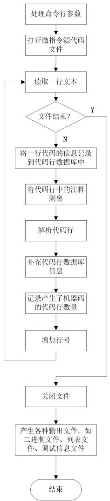  
图 9-2：microasm.c 文件中 main 函数的流程图。

# 三、 实验内容

指令系统是计算机硬件的语言系统，也叫机器语言，是机器所具有的全部指令的集合，反映了计算机所拥有的基本功能。机器的指令系统决定了一台计算机的功能，而一旦计算机的指令系统被确定以后，必须有相应的硬件支持。指令系统主要体现在它的操作类型、数据类型、地址格式和寻址方式等方面。

本次实验的重点是让读者通过定义新的指令从而扩展 DM1000的指令集，并使用新指令编写程序，进行功能验证。

# 2.1 任务（一）

定义新指令 POP A，该指令将栈寄存器 SP指向存储单元的内容出栈，出栈结果保存到累加器 A 中。

请读者按照下面方法之一在本地创建一个项目，用于完成本次任务：

# 方法一：从 CodeCode.net 平台领取任务

读者需要首先登录 CodeCode.net平台领取本次实验对应的任务，从而在 CodeCode.net平台上创建个人项目，然后使用 Dream Logic提供的“从 Git 远程库新建项目”功能将个人项目克隆到本地磁盘中。

# 方法二：不从 CodeCode.net 平台领取任务

如果读者不使用 CodeCode.net 平台，就需要使用 Dream Logic 提供的“从 Git 远程库新建项目”功能直接将实验模板克隆到本地磁盘中，实验模板的 URL为

```txt
https://wwwCodec.net/engintime/Dream-Logic/Project-Template/DM1000/DM1000.git。 
```

# 建议教师按照下面的步骤在 CodeCode.net 平台上布置此次实验任务：

(1) 在计算机组成原理实验课程中，新建一个实验任务。  
(2) 在“新建任务”页面中，教师需要添写“任务名称”，推荐使用“实验 9 设计指令/微指令系统实验-任务（一）”；还需要填写“模板项目 URL”，应该使用

```txt
"https://wwwCodec.net/engintime/Dream-Logic/Project-Template/DM1000/DM1000.git"。 
```

(3) 点击“新建任务”按钮，完成新建任务操作。

以下步骤是设计一条 POP A 指令的完整过程，请读者按下列步骤完成 POP A 指令的设计，从而掌握为DM1000 设计新指令的基本方法。

由于 POP A 指令需要用到的所有微指令都已经存在了，所以并不需要设计新的微指令，不需要修改microasm.c 文件，也不需要修改任何原理图文件。只需要修改 rom.masm 文件，在其中添加 POP A 指令需要用到的微指令，然后修改 dmasm.c文件，使指令汇编器能够正确处理新的 POP A指令即可。

首先修改微指令程序 rom.masm 文件：

1. 通过分析 POPA指令的数据通路，得到其对应的微指令为：

```txt
; pop a  
path sp, mar ; 将栈指针寄存器 SP 传送到地址寄存器 mar  
path [mar], a ; 将 SP 指向的存储单元的数据传送到累加器 A，即出栈  
path sp, rsp;sp + 1  
path sp_inc, rsp  
path rsp  
inc pc ; pc 加 1，指向下一条指令  
reset upc ; uPC 复位，指向取指微指令
```

dup 1, null ; 1 条占位微指令

2. 在 DreamLogic 中打开微指令源程序文件 rom.masm，在该文件中找到一块连续的不小于 8 条微指令的空白区域，例如在第 290 行有一块连续区域，可以将其替换为 POP A 对应的微指令。该步操作实际上是将 POPA 对应的微程序写入微程序存储器 rom 中尚未使用的存储空间。  
3. 在“项目管理器”窗口中右键单击批处理文件 rom.bat，选择“运行批处理文件”，对微指令源程序进行编译，确保可以正常生成可执行的二进制文件 rom.rxm。  
4. 由于 POP A 指令是单操作数指令，所以它的机器码只需要一个字节就可以了，机器码主要用来确定第一条微指令在 ROM中的偏移位置。所以要想得出 POP A 指令的机器码，就需要知道刚刚添加的微指令在 ROM中的偏移。读者此时可以启动仿真，在“源代码 2”窗口中会显示出刚刚添加的

第一条微指令在 ROM中的偏移为 $0 \mathrm { { x } 4 8 0 }$ ，根据在实验 6中学习的指令译码（偏移）的方法，可以从 $0 \mathrm { x } 4 8 0$ 得到其对应的机器码为 $0 \mathrm { { x } 9 0 }$ 。

在添加了 POP A 指令的微指令，并得到其机器码为 $0 \mathrm { { x } 9 0 }$ 之后，就可以修改 dmasm.c文件了，使指令汇编器能够正确处理新的 POP A指令即可：

1. 在 Dream Logic 左侧的“项目管理器”窗口中，右键点击项目节点，选择“打开所在文件夹”，在打开的磁盘目录下找到指令汇编器源文件 dmasm.c并打开，然后按照下列步骤添加代码：

1) 在第 115 行后添加 POP指令关键字：

```javascript
const char* popInstruction_keyword = "pop"; 
```

2) 在表 keyword_function_table 中添加一个新的表项（第 1574 行后面）

```txt
, { &popInstruction_keyword, parse_pop } 
```

3) 在第 487 行后添加 POP 指令的处理函数。注意，将 POP A 指令的机器码设置为 $0 \mathrm { { x } 9 0 }$ ：

```c
void parse_pop(int line_num)  
{  
    char *op;  
    unsigned long op_type; 
```

```lisp
if(Assembler_state != AS_TEXT)  
{  
    warning msginvalid_line(line_num);  
    return;  
} 
```

op $=$ strtok(NULL,delimit_char);

if(NULL $= =$ op)   
{ error msg miss op(popInstruction keyword, line_num);

```txt
op_type = get.operand_type(op); 
```

```txt
if(OTRegister_A == op_type)  
{  
// pop a  
machine_code[machine_code_address] = 0x90;  
machine_code_address++;  
}  
else  
{  
error msg WRONG_op(popInstruction_keyword, line_num);  
} 
```

```rust
//  
// 在代码行数据库中，标记此行是一个指令行  
//  
line_database line_count ].flag |= LF_INSTRUCTION;
```

2. 保存文件 dmasm.c。  
3. 任选一种 C 语言编译器将 dmasm.c 文件编译为 dmasm.exe 文件。可选择 Microsoft Visual Studio或者 GNU GCC 编译器。  
4. 用步骤 3中生成的 dmasm.exe 文件替换项目所在磁盘目录下的指令汇编器文件 dmasm.exe。

至此，DM1000已经可以运行 POP A 指令了，为了进行测试，请读者按照下面的步骤进行实验：

1. 在“项目管理器”窗口中打开项目下的汇编源程序文件 ram.asm，输入以下代码并保存。此汇编代码将 0xf7 赋值给 sp寄存器，从而在存储器的 0xf7位置构造了一个栈顶，然后通过让 r0寄存器指向栈顶位置，从而在栈顶位置存储了一个字节的值 0xff，最后使用 POPA 指令出栈，将 0xff放入 a 寄存器中。

```asm
.text mov sp, 0xf7 mov r0, 0xf7 mov a, 0xff mov [r0], a mov a, 0 pop a ENDLOOP: jmp ENDLOOP 
```

2. 在“项目管理器”窗口中右键单击批处理文件 ram.bat，选择“运行批处理文件”，对汇编文件进行编译。  
3. 在“项目管理器”窗口中打开项目下的原理图文件 DM1000.dlsche 后，启动仿真。  
4. 按 C键单步时钟执行指令，重点查看 POPA 指令的执行情况，确保最终累加器 a 的值为 0xff，完成出栈指令后 sp 寄存器的值加 1 变为 0xf8，并且完成出栈指令后可以继续运行后面的指令。

# 2.2 任务（二）

仿照任务（一）中的步骤，设计 PUSH和 POP 指令，并使用一段汇编程序对新设计的指令进行验证：

1. 实现 PUSH RX指令：将一个通用寄存器（ $\mathrm { R 0 } ^ { \sim } \mathrm { R 3 }$ ）中的数据入栈。  
2. 实现 POP RX 指令：出栈一个字节，并将这个字节的数据放入通用寄存器（ $\mathrm { R 0 \tilde { \ R } 3 }$ ）。  
3. 实现 PUSH [RX]指令：将通用寄存器（ $\mathrm { R 0 } ^ { \sim } \mathrm { R 3 }$ ）指向的存储单元中的数据入栈。  
4. 实现 POP [RX]指令：出栈一个字节，并将这个字节的数据放入通用寄存器（ $\mathrm { R 0 } ^ { \sim } \mathrm { R 3 }$ ）指向的存储单元。

# 四、 思考与练习

1. 目前 DM1000 实现的指令“IN”是将外部设备的输入寄存器 RIN的值传送到累加器 A，而指令“OUT”是将累加器 A的值传送到外部设备的输出寄存器 ROUT 中。请在 DM1000 模型机的基础上添加输入控制模块以及输出控制模块（主要是添加译码功能），然后改进指令“IN”和“OUT”的微指令，完成多个输入设备向累加器 A 输入数据以及累加器 A 向多个输出设备输出数据。例如，当 2 号输入设备向累加器 A输入数据时，指令形式为“IN 2”，同理，当累加器 A 向 0 号设备输出数据时，指令形式为“OUT 0”。  
2. 总线是指计算机中多个部件之间公用的一组连线，是若干信号线的集合，由它构成系统模块间的信息通路。在 DM1000 中，包含了数据总线 DBUS和地址总线 ABUS。若将控制单元 CU发出的所有控制信号集合成总线 CBUS，即可称之为控制总线。请修改 DM1000电路，实现控制单元 CU 通过控制总线 CBUS 对其他模块的控制。

3. 参考 DM1000 模型机中提供的编译器源代码文件 dmasm.c，用 c 语言编写一个反汇编器，其功能是将 ram.rxm中的机器码反汇编成 DM1000 中的汇编指令。  
4. 在实验 8的基础上，修改 DM1000模型机电路，添加 PUSHF/POPF指令实现标志寄存器 FLAG 的入栈和出栈功能。  
5. 读者是否发现在微指令源代码文件中写好指令对应的微指令后，需要知道第一条微指令在 ROM 中的偏移地址，这样才能产生指令的机器码。但是第一条微指令的偏移地址不是很容易获得，一种方法是启动仿真后从“源代码 2”窗口中获得其偏移，但是这种方法不是很方便。请读者修改微指令汇编器的 C 源代码，让微指令汇编器在生成机器码的同时，再生成一个文本格式的映射文件（后缀名为 map），在此映射文件中记录指令的名称及其第一条微指令的偏移。  
6. 软件会有缺陷（Bug），处理器也不例外。当 DM1000 的指令存在缺陷时，可以重新编写指令的微指令，然后更新 DM1000的 ROM 即可解决。但是，请读者设想一种情况，如果一条指令的微指令原来有 8条，但是修复后变成了 10 条，由于原来位置前后都有其它指令的微指令，所以就必须在 ROM 中另外找一个位置存放修复后的微指令，这就会导致指令的机器码也要发生变化，而之前用到该指令的二进制可执行文件就无法正常运行了，必须重新编译。这种问题对于一款已经推向市场的处理器来说是毁灭性的。请读者设计一种方案，使 DM1000能够解决这个问题，也就是当指令对应的微指令在 ROM中的位置发生变化时，之前编译好的二进制可执行文件仍然可以正常运行。

# 实验 10 阵列乘法器实验

实验性质：设计

建议学时：4学时

# 实验目的

掌握四位阵列乘法器的设计方法。  
设计八位阵列乘法器。  
为 DM1000的运算器模块 ALU添加八位阵列乘法器，并实现 MUL 指令。

# 二、 预备知识

# 2.1 四位阵列乘法器

无符号二进制乘法和十进制乘法很相似，部分积同样是乘数的一位乘以被乘数的所有位，然后移位这些部分积，并将它们相加就可以得到最后的结果。图 10-1 展示了两个四位二进制数 X 和 Y 进行无符号二进制乘法得到一个八位二进制数 P的过程，其中 $\mathrm { { X } _ { 0 } \mathrm { { Y } _ { 0 } } }$ 表示将两个二进制位进行逻辑与运算。总之， $\mathrm { N } \times \mathrm { N }$ 乘法器对两个 N 位二进制数相乘，产生一个 2N 位的二进制数作为结果。由于 1 位二进制乘法相当于逻辑与运算，所以与门电路用于产生部分积，一位全加器用于部分积相加运算。

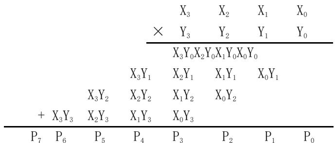  
图 10-1：两个四位二进制数 X 和 Y 的无符号二进制乘法

图 10-2 显示了一个四位阵列乘法器的电路符号和实现。阵列乘法器接收被乘数 X和乘数 Y，然后产生积 P。每一个部分积是一个单独的乘数位与被乘数的所有位进行逻辑与运算得出的，同时使用一位加法器将部分积相加，当然还要考虑进位。需要说明的是，将 $\mathrm { Y } _ { 0 }$ 与被乘数 X 的四个位分别做与运算时，输入的部分积是 0，可以认为只是做了与运算，而没有做加法运算，同时，在最右侧的 $\mathrm { X } _ { 0 }$ 与乘数 Y的四个位分别做运算时，进位输入都是 0。

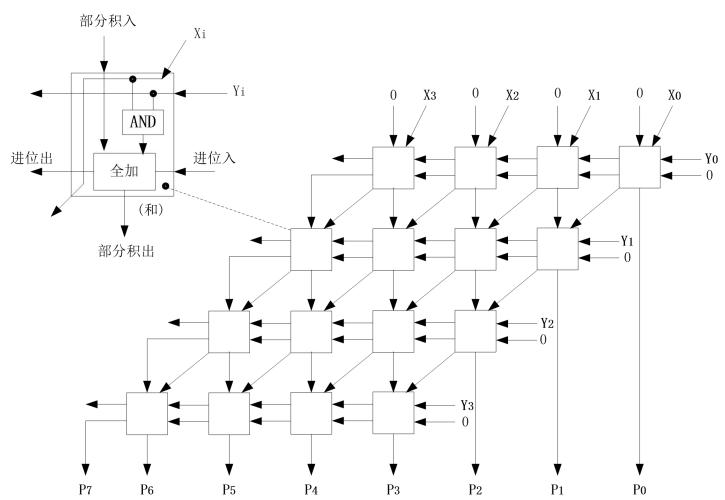  
图 10-2：四位阵列乘法器的实现

# 三、 实验内容

# 3.1 任务（一）设计八位阵列乘法器

在本任务中，读者需要学习 DM1000 提供的四位阵列乘法器的实现方法，然后在此基础上将其修改为八位阵列乘法器，并对其进行单独仿真，确保其可以正常工作。

请读者按照下面方法之一在本地创建一个项目，用于完成本次任务：

# 方法一：从 CodeCode.net 平台领取任务

读者需要首先登录 CodeCode.net平台领取本次实验对应的任务，从而在 CodeCode.net平台上创建个人项目，然后使用 Dream Logic提供的“从 Git 远程库新建项目”功能将个人项目克隆到本地磁盘中。

# 方法二：不从 CodeCode.net 平台领取任务

如果读者不使用 CodeCode.net 平台，就需要使用 Dream Logic 提供的“从 Git 远程库新建项目”功能直接将实验模板克隆到本地磁盘中，实验模板的 URL为

```txt
https://wwwCodecode.net/engintime/Dream-Logic/Project-Template/DM1000/DM1000.git 
```

# 建议教师按照下面的步骤在 CodeCode.net 平台上布置此次实验任务：

(1) 在计算机组成原理实验课程中，新建一个实验任务。  
(2) 在“新建任务”页面中，教师需要添写“任务名称”，推荐使用“实验 10 阵列乘法器实验-任务（一）”；还需要填写“模板项目 URL”，应该使用

```txt
https://wwwCodecode.net/engintime/Dream-Logic/Project-Template/DM1000/DM1000.git 
```

(3) 点击“新建任务”按钮，完成新建任务操作。

# 四位阵列乘法器

请读者首先从“项目管理器”中打开已经设计完毕的四位阵列乘法器原理图文件 MUL.dlsche 和乘法器运算单元原理图文件 MUL_unit.dlsche。其中，乘法器运算单元的电路与图 10-2中描述的是完全一致的，其主要是将乘数的一位 Y和被乘数的一位 X做与运算后作为全加器的一个输入，将上一次的部分积 Pin做为全加器的另外一个输入，同时还有一个进位输入 Cin，然后由一位全加器得到部分积输出 Pout和进位输出 Cout。

四位阵列乘法器中一共使用了 16个乘法器运算单元，其电路与图 10-2 中描述的也是完全一致的。需要特别说明的是，所有网络都使用网络标签进行了命名，只有这样才能将各个模块中模块接口连接的网络进行隔离，否则会由于这些网络的名称一致，而产生连接关系，导致它们都连接在一起。例如，所有子模块的 X 接口就算使用网络进行了分别连接（那四个斜线），但是由于这四个网络的网络名称默认都是 X，也就意味着它们是连接在一起的，只有使用网络标签 $\mathrm { { \chi 0 } ^ { \sim } \mathrm { { X 3 } } }$ 将这四个网络分别命名后，它们才是分离的。

# 设计八位阵列乘法器

读者掌握了四位阵列乘法器电路的设计方法，就可以开始设计八位阵列乘法器了。将四位阵列乘法器的 16个乘法器运算单元扩展到 64个就可以实现八位阵列乘法器，但是显然这种方法绘制原理图的工作量比较大。一种更加合理的方法是将四位阵列乘法器修改为可以继续利用的子模块，然后在一个新的原理图中使用 4个四位阵列乘法器模块就可以设计出八位阵列乘法器了。

读者可以参考下面的步骤完成八位阵列乘法器的设计：

1. 首先需要对现有的四位阵列乘法器进行改造，将其输出和输入信号全部改造为端口（Port），这样才能从模块外部使用这些信号。在已有的八个输入和八个输出信号的基础上，读者还需要：

 将 MUL_unit_15、MUL_unit_14、MUL_unit_13、MUL_unit_12、MUL_unit_8、MUL_unit_4、MUL_unit_0模块的每个 Pin信号分别接一个端口，可以使用名称 $\mathrm { P i n 0 } ^ { \sim } \mathrm { P i n } 6$ ，作为输入信号。这些端口可以像 $\mathrm { { \chi 0 } ^ { \sim } \mathrm { { X 3 } } }$ 一样放在原理图的顶部。注意每个 Pin信号与端口连接的网络要使用网络标签进行命名，网络标签的名字可以和端口名称一致。  
将 MUL_unit_15、MUL_unit_11、MUL_unit_7、MUL_unit_3 模块的 Cin 信号分别接一个端口，可以使用名称 $\mathrm { { C i n 0 } ^ { \sim } \mathrm { { C i n 3 } } }$ ，作为输入信号。这些端口可以像 $\mathrm { Y 0 ^ { \sim } Y 3 }$ 一样放在原理图的右侧。注意每个 Cin信号与端口连接的网络要使用网络标签进行命名，网络标签的名字可以和端口名称一致。

 将 MUL_unit_12、MUL_unit_8、MUL_unit_4、MUL_unit_12 模块的 Cout 信号分别接一个端口，可以使用名称 Cout0~Cout3，作为输出信号。注意，原来的 P7 端口将会变为 Cout3 端口。这些端口可以放在原理图的左侧。注意每个 Cout 信号与端口连接的网络要使用网络标签进行命名，网络标签的名字可以和端口名称一致。

将原来的 $\mathrm { P 0 } ^ { \sim } \mathrm { P 6 }$ 端口的名称修改为 Pout0~Pout6。

2. 在“项目管理器”的“子模块”文件夹上点击鼠标右键，在弹出的菜单中选择“添加”中的“新建文件”，在“新建文件”对话框中选择原理图文件模块，然后在文件名称中填写“8MUL”后点击“确定”按钮，就会新建一个名称为 8MUL的原理图，用于设计八位阵列乘法器。  
3. 在 8MUL原理图中点击鼠标右键，在弹出的菜单中选择“从原理图文件新建模块”，在弹出的对话框中选择 MUL.dlsche 文件后，点击“确定”按钮，就可以在原理图中放置一个四位阵列乘法器模块。按“Tab”键可以继续放置同样的模块，直到四个模块都放置完毕。  
4. 移动四个模块中的接口到合适的位置，主要目的是为了方便连接网络。然后为本模块添加输入端口 $\chi _ { 0 } \mathrm { \sim } _ { \mathrm { X 7 } }$ 、 $\mathrm { Y 0 } \mathrm { \widetilde { Y } Y }$ ，添加输出端口 $\mathrm { P 0 } ^ { \sim } \mathrm { P } 1 5$ ，并完成所有网络的连接，在连接时要注意部分积的移位。最后，一定要使用网络标签为所有网络命名。

# 提示：

在调整模块中的接口位置时可能会比较繁琐，建议读者可以使用下面的绘图技巧提高效率：

1. 放置对象时最好是参考网格线，便于对齐。  
2. 选中对象后，可以使用空格键让对象旋转。  
3. 在按下 Ctrl 键的同时用鼠标选中对象，可以选中多个对象。选中多个对象后再进行平移等操作可以大大提高绘图效率。  
4. 在按下 Shift 键的同时用鼠标选中对象，可以取消选中对象。  
5. 在“属性”窗口中可以编辑所有选中对象的属性。也可以使用“属性”窗口中的筛选下拉列表从选中的对象中继续筛选要编辑的对象。  
6. 可以使用“编辑”菜单中的“矩形选择”功能选中多个对象。

在八位阵列乘法器设计完毕后，读者需要对其进行单独仿真，从而确保其可以正常工作。读者可以添加两个八位交互式数字信号，分别与端口 $\chi _ { 0 } \mathrm { \sim } _ { \mathrm { X 7 } }$ 、 $\mathrm { Y 0 } ^ { \sim } \mathrm { Y } 7$ 连接，用来输入被乘数和乘数，然后再添加四个16 进制 7段数码管，与端口 $\mathrm { P 0 } ^ { \sim } \mathrm { P } 1 5$ 连接，用来显示最后的结果。

# 提交作业

在提交作业前，读者需要将 8MUL 模块 SVG 图形文件的链接添加到 README.md 文件中，这样，当使用浏览器查看提交后的线上项目时，就可以在 README.md文件中看到 8MUL 模块了。方法如下：

1. 双击“项目管理器”中的 README.md 文件，使用一种合适的文本编辑器或者 Markdown 编辑器打开此文件。  
2. 在 README.md 文件的末尾添加如下的文本：

# 八位阵列乘法器模块 8MUL


3. 保存 README.md 文件。  
4. 提交作业。

# 3.2 任务（二）为 DM1000 添加 MUL 指令

在本任务中，读者需要将上一个任务中设计完成的八位阵列乘法器添加到 DM1000 的 ALU 模块中，使之可以将寄存器 A和 W分别作为被乘数和乘数，完成无符号数的乘法运算。

请读者按照下面方法之一在本地创建一个项目，用于完成本次任务：

# 方法一：从 CodeCode.net 平台领取任务

读者需要首先登录 CodeCode.net平台领取本次实验对应的任务，从而在 CodeCode.net平台上创建个人项目，然后使用 Dream Logic提供的“从 Git 远程库新建项目”功能将个人项目克隆到本地磁盘中。

# 方法二：不从 CodeCode.net 平台领取任务

如果读者不使用 CodeCode.net 平台，就需要使用 Dream Logic 提供的“从 Git 远程库新建项目”功能直接将实验模板克隆到本地磁盘中，实验模板的 URL为

https://www.codecode.net/engintime/Dream-Logic/Project-Template/DM1000/DM1000.git

# 建议教师按照下面的步骤在 CodeCode.net 平台上布置此次实验任务：

(1) 在计算机组成原理实验课程中，新建一个实验任务。  
(2) 在“新建任务”页面中，教师需要添写“任务名称”，推荐使用“实验 10 阵列乘法器实验-任务（二）”；还需要填写“模板项目 URL”，应该使用https://www.codecode.net/engintime/Dream-Logic/Project-Template/DM1000/DM1000.git

(3) 点击“新建任务”按钮，完成新建任务操作。

请读者按照下面的步骤完成本次任务的准备工作：

1. 使用任务(一)中改造过的四位阵列乘法器模块文件 MUL.dlsche 覆盖本次任务项目文件夹中的MUL.dlshce 文件。  
2. 将任务（一）中设计的八位阵列乘法器模块文件 8MUL.dlsche 复制到本次任务项目文件夹中，然后在 Dream Logic 左侧的“项目管理器”的“子模块”文件夹上点击鼠标右键，在弹出的菜单中选择“添加”中的“现有文件”，弹出添加现有文件对话框，在其中选择刚刚复制到项目文件夹中的 8MUL.dlsche文件后，点击“打开”按钮，就可以将八位阵列乘法器模块文件添加到本次任务的项目中了。  
3. 读者可以尝试仿真一下八位阵列乘法器模块，确保其可以正常工作。

如果八位阵列乘法器可以正常工作，读者就可以参考下面的提示信息为 DM1000 添加 MUL指令了：

1. 读者首先需要定义 MUL指令的格式，为了便于实现，可以将其定义为 MUL RX，该指令将寄存器 A中的数作为被乘数，将寄存器 RX（ $\mathrm { R 0 } ^ { \sim } \mathrm { R 3 }$ ）中的数作为乘数，将结果的低 8 位保存到寄存器 RX 中，高 8 位保存到寄存器 A 中。  
2. 还需要准备一个汇编程序用于验证 MUL 指令是否可以正常执行，例如下面的一段程序用于计算0x16乘以 0x24的积，并将结果的低 8 位保存到寄存器 $\mathrm { r 0 }$ 中，高 8位保存到寄存器 r1中：

```asm
mov a, 0x16  
mov r0, 0x24  
mul r0  
mov r1, a 
```

3. 读者需要将八位阵列乘法器放置在 ALU 中，方法是首先打开 ALU的原理图，然后在原理图中点击鼠标右键，选择菜单中的“从原理图文件新建模块”，在弹出的对话框中选择 8MUL.dlsche文件后，点击确定按钮，就可以将八位阵列乘法器模块放置在 ALU 中了。注意，建议读者先在8MUL.dlsche文件中为所有端口设置好输入输出类型，例如将端口 $\chi _ { 0 } \mathrm { \sim } _ { \mathrm { X } 7 }$ 和 $\mathrm { Y 0 } \mathrm { \widetilde { Y } Y }$ 设置为输入类型，将端口 $\mathrm { P 0 } ^ { \sim } \mathrm { P } 1 5$ 设置为输出类型，这样在放置模块的时候，模块接口 $\chi _ { 0 } \mathrm { \sim } _ { \mathrm { X } 7 }$ 和 $\mathrm { Y 0 } ^ { \sim } \mathrm { Y } 7$ 就会出现在模块的左边，用于输入数据，模块接口 $\mathrm { P 0 } ^ { \sim } \mathrm { P } 1 5$ 就会出现在模块的右边，用于输出数据。  
4. 在 ALU 中放置好八位阵列乘法器后，就可以进行网络连接了。网络连接很简单，只要将寄存器 A的输出接乘法器的 $\chi _ { 0 } \mathrm { \sim } _ { \mathrm { X 7 } }$ ，将寄存器 W 的输出接乘法器的 $\mathrm { Y 0 } \mathrm { \widetilde { Y } Y }$ ，然后将乘法器输出的低 8位通过一个 8 位单向总线收发器（在型号库“桶形移位器和总线收发器”中）输出到数据总线，将乘法器输出的高 8 位也通过一个 8 位单向总线收发器输出到数据总线。最后，还需要为这两个新添加的 8 位总线收发器的使能端提供控制信号，使用 CU 模块中 U2器件上的两个还未被使用的控制信号即可。这样，虽然乘法器总是会计算寄存器 A 和 W 的乘积，但是可以通过 8 位总线收发器决定是否将结果放在数据总线上。  
5. 读者可以利用实验 9 中学到的知识，设计 MUL指令和它的微指令，当然还需要修改指令汇编器和微指令汇编器的 C 源代码，使它们支持新的 MUL指令和微指令。在设计微指令时，读者也需要使用一定的技巧，下面的代码给出了一种可以工作的微指令。需要读者注意的是，一定要先将结果

的低8位通过数据总线传送给RX寄存器，然后才能将结果的高8位通过数据总线传送给寄存器A，请读者思考一下其中的原因。

```txt
path rx, w  
path alu.mul_low, rx  
path alu.mul_high, a  
inc pc  
reset upc 
```

# 提交作业

在提交作业前，读者需要将 ALU模块 SVG图形文件的链接添加到 README.md 文件中，这样，当使用浏览器查看提交后的线上项目时，就可以在 README.md 文件中看到 ALU模块了。方法如下：

1. 双击“项目管理器”中的 README.md 文件，使用一种合适的文本编辑器或者 Markdown 编辑器打开此文件。  
2. 在 README.md 文件的末尾添加如下的文本：

# 添加乘法器后的运算器模块 ALU


3. 保存 README.md 文件。  
4. 提交作业。

# 四、 思考与练习

1. 改进任务（二）中的 ALU模块，在进行乘法运算时，如果乘法器的运算结果为 0，需要将标志寄存器FLAG中的 ZF位设置为高电平，否则将其置为低电平。注意，需要与原有的 74LS181计算的结果设置ZF 位的电路协同工作，不能产生冲突。  
2. 对于无符号乘法，是不存在进位和溢出问题的，请读者说明原因。因此，原有的 CF标志位在乘法运算时就没有意义了，但是为了方便检查字节相乘的结果是一个字节还是一个字（两个字节），可以当乘积的高 8 位为 0时，将 CF标志位置为低电平，否则置为高电平。请读者在任务（二）的 ALU 模块中实现此功能。注意，需要与原有的 74LS181计算的结果设置 CF 位的电路协同工作，不能产生冲突。  
3. 请读者自行查阅资料，实现阵列除法器。

# 课程设计

为了使读者对 DM1000 有更深入的研究，并加深对计算机组成原理的理解，这部分提供了具有一定工作量和一定难度的课程设计实验题目，这些课程设计实验题目涉及到运算器、程序计数器、控制器、中断、指令与微指令、阵列乘法器等多方面的内容，并且这些都是读者在学习计算机组成原理课程后应该重点掌握的内容。读者可以根据实际的教学需求和自身能力来选择完成一个或多个题目，相信读者在完成了以下课程设计题目后，不论是在理解计算机组成原理的深度，还是在绘制原理图的能力和编写源代码的能力方面都会有质的提升，并对今后参加工作有很大的帮助。

读者在尝试完成下列课程设计实验题目时，一定要学会将一个大任务细分成多个小任务。这些小任务可以按照一定的顺序依次完成，从而渐进、有序的推动整个项目顺利完成。这些小任务既可以是一个能够独立工作的模块，也可以是某个技术细节的验证过程，就算会暂时破坏整个系统的功能，但是只要能够完成想要达到的验证效果，也完全是可以的。读者还需要为每个细分的小任务准备一个测试方法（单元测试），用于验证任务达到了预期的目标，当然也需要为整个项目准备一个测试方法（验收测试），用于检验最终的成果。

将一个大任务细分成多个小任务的好处是多方面的，第一个好处是，一个小任务的风险通常是可控的，并且可以在较短的时间内完成（通过单元测试），此时读者可以免费获得化学物质奖励（多巴胺、肾上腺素等），产生满满的成就感，进而驱动读者不知疲倦地向最终的目标（通过验收测试）前行，反之，如果摊子铺的太开，步子迈的太大，一旦对项目的质量和风险把控不住，就会产生严重的挫败感，距离放弃就不远了；另外一个好处是，当任务结束时，即使没有通过最终的验收测试，还会有几个能够拿得出手的小任务的成果，也会有不错的收获。

# 题目一：实现更强大的移位指令（难度：较难）

目前 DM1000 只是通过网络连接时的移位方式实现了移位指令，所以只能移动一位。一般在运算器中是通过桶形移位器实现移位功能的，在 Dream Logic 的型号库“桶形移位器和总线收发器”中提供了八位桶形移位器“SHIFT8”。请读者参考附录 C，学习桶形移位器的工作方式，并尝试在运算器模块中放置一个八位桶形移位器，从而实现功能更加强大的移位指令。已经实现的移位指令可以参考附录 A 中的表 A-4。新的移位指令的格式可以参考下面的表格，其中机器码 1 的内容可以根据需要进行调整。

<table><tr><td>指令形式</td><td>机器码1</td><td>机器码2</td><td>简要说明</td></tr><tr><td>SHR A, n</td><td>110100xx</td><td>移位数量n</td><td>累加器A逻辑右移n位</td></tr><tr><td>SHL A, n</td><td>110101xx</td><td>移位数量n</td><td>累加器A逻辑左移n位</td></tr><tr><td>RCR A, n</td><td>110110xx</td><td>移位数量n</td><td>累加器A带进位循环右移n位</td></tr><tr><td>RCL A, n</td><td>110111xx</td><td>移位数量n</td><td>累加器A带进位循环左移n位</td></tr></table>

请读者按照下面方法之一在本地创建一个项目，用于完成本课程设计题目：

# 方法一：从 CodeCode.net 平台领取任务

读者需要首先登录 CodeCode.net平台领取本次实验对应的任务，从而在 CodeCode.net平台上创建个人项目，然后使用 Dream Logic提供的“从 Git 远程库新建项目”功能将个人项目克隆到本地磁盘中。

# 方法二：不从 CodeCode.net 平台领取任务

如果读者不使用 CodeCode.net 平台，就需要使用 Dream Logic 提供的“从 Git 远程库新建项目”功能直接将实验模板克隆到本地磁盘中，实验模板的 URL为

https://www.codecode.net/engintime/Dream-Logic/Project-Template/DM1000/DM1000.git。

# 建议教师按照下面的步骤在 CodeCode.net 平台上布置此次实验任务：

(1) 在计算机组成原理实验课程中，新建一个实验任务。  
(2) 在“新建任务”页面中，教师需要添写“任务名称”，推荐使用“课程设计（一）实现更强大的移位指令”；还需要填写“模板项目 URL”，应该使用

“https://www.codecode.net/engintime/Dream-Logic/Project-Template/DM1000/DM1000.git”。

(3) 点击“新建任务”按钮，完成新建任务操作。

# 题目二：跳转指令跳转到相对地址（难度：一般）

目前，jmp、jz、jc指令都是跳转到绝对地址，也就是说在这些指令的第二个字节记录的都是绝对地址。首先，请读者考虑一下这种跳转到绝对地址的弊端，例如指令在内存中的位置被移动后（在一个受限的计算机系统内经常会这样做！），这些跳转指令还能正常执行吗？然后，请读者修改 PC模块的电路，当发生跳转时，不再将数据总线上的数据直接给 PC寄存器，而是将数据总线上的数据和当前 PC 的值相加后，再给 PC 寄存器，从而使这些跳转指令可以跳转到相对地址。注意，除了修改 PC模块的电路外，读者还需要修改汇编器的C源代码，在这些跳转指令的第二个字节中保存相对地址，而不再是绝对地址，即将dmasm.c文件中第 1884行替换为

```txt
machine_code[reallocate_table[i].address] = (BYTE) symbol_table[j].address - reallocate_table[i].address; 
```

请读者按照下面方法之一在本地创建一个项目，用于完成本课程设计题目：

# 方法一：从 CodeCode.net 平台领取任务

读者需要首先登录 CodeCode.net平台领取本次实验对应的任务，从而在 CodeCode.net平台上创建个人项目，然后使用 Dream Logic提供的“从 Git 远程库新建项目”功能将个人项目克隆到本地磁盘中。

# 方法二：不从 CodeCode.net 平台领取任务

如果读者不使用 CodeCode.net 平台，就需要使用 Dream Logic 提供的“从 Git 远程库新建项目”功能直接将实验模板克隆到本地磁盘中，实验模板的 URL为

```txt
https://wwwCodec.net/engintime/Dream-Logic/Project-Template/DM1000/DM1000.git。 
```

# 建议教师按照下面的步骤在 CodeCode.net平台上布置此次实验任务：

(1) 在计算机组成原理实验课程中，新建一个实验任务。  
(2) 在“新建任务”页面中，教师需要添写“任务名称”，推荐使用“课程设计（二）跳转指令跳转到相对地址”；还需要填写“模板项目 URL”，应该使用

“https://www.codecode.net/engintime/Dream-Logic/Project-Template/DM1000/DM1000.git”。

(3) 点击“新建任务”按钮，完成新建任务操作。

# 题目三：简化 CU控制器模块的设计（难度：一般）

在设计一个处理器时，应该尽量简化设计，使用最少的逻辑门来实现功能，这样不但能够让处理器的架构简洁，还能减少芯片面积，降低功耗和散热，甚至还可以提高运行频率。CU 控制器模块中的 uPC_NEXT模块用于得到 uPC加 4 后的值，其中包含了 4个 74LS181芯片，这会大大增加逻辑门的数量。请读者简化CU 控制器模块的设计，删除 uPC_NEXT和 uPC_gate器件，将 uPC 替换为一个 16 位同步置数/异步清零二进制加法计数器（可以选择“型号库”中的“寄存器和计数器”中的“16位同步置数/异步清零二进制加法计数器”，功能表参见实验四的预备知识），然后让 uPC输出的 Q0 与 ROM的 A2连接，依此类推。这样当 uPC加 1时，ROM的地址就会增加 4（数字系统设计中经常会用到此技巧）。需要注意的是，由于 uPC的值左移2 位后连接了 ROM 的地址，所以 PC 的值在译码时就需要少移动 2位了。此外，读者还要设计如何控制 uPC的 EN 和 LOAD 管脚，确保其在适当的时候进行加 1 操作。如果 CU 控制器修改完毕后，在仿真时发现源代码窗口中的 $\mathrm { { \ u P C } }$ 对应的蓝色箭头无法正确指向微指令也没有关系，毕竟此时 uPC 的值已经与 ROM的地址不再对应了，此时读者只要从原理图中判断汇编指令能够正确执行即可。

请读者按照下面方法之一在本地创建一个项目，用于完成本课程设计题目：

# 方法一：从 CodeCode.net 平台领取任务

读者需要首先登录 CodeCode.net平台领取本次实验对应的任务，从而在 CodeCode.net平台上创建个人项目，然后使用 Dream Logic提供的“从 Git 远程库新建项目”功能将个人项目克隆到本地磁盘中。

# 方法二：不从 CodeCode.net 平台领取任务

如果读者不使用 CodeCode.net 平台，就需要使用 Dream Logic 提供的“从 Git 远程库新建项目”功能直接将实验模板克隆到本地磁盘中，实验模板的 URL为

https://www.codecode.net/engintime/Dream-Logic/Project-Template/DM1000/DM1000.git。

# 建议教师按照下面的步骤在 CodeCode.net平台上布置此次实验任务：

(1) 在计算机组成原理实验课程中，新建一个实验任务。  
(2) 在“新建任务”页面中，教师需要添写“任务名称”，推荐使用“课程设计（三）简化 CU 控制器模块的设计”；还需要填写“模板项目 URL”，应该使用

“https://www.codecode.net/engintime/Dream-Logic/Project-Template/DM1000/DM1000.git”。

(3) 点击“新建任务”按钮，完成新建任务操作。

# 题目四：添加 IF标志位并实现中断现场保护（难度：较难）

手动控制硬中断的允许与禁止标志 IF是一件麻烦的事，若能通过指令控制标志 IF就方便多了。请读者在标志寄存器中添加一个 IF 标志位，并实现指令 CLI 和 STI，分别用来将标志寄存器中的中断标志 IF清零或置 1，当 CPU需要禁止硬中断时，将 IF清零，当 CPU 允许硬中断时，将 IF置 1。注意，CPU复位时会将标志寄存器中所有的标志位清零，IF标志也会清零，所以一开始 CPU是无法响应硬中断的，必须执行一条 STI指令后才能响应硬中断。

尝试为 DM1000 实现中断现场保护功能，也就是在发生中断时，自动将标志寄存器入栈，并将标志寄存器清零，在中断返回时，再自动将标志寄存器出栈。这样，中断服务程序在执行过程中，就可以使用一个新的标志寄存器，而不是被之前的程序修改后的标志寄存器，而且中断服务程序对标志寄存器的修改，也不会影响到被打断程序的运行，因为中断返回后，旧的标志寄存器的值会出栈，被打断的程序仍然可以正常运行。注意，由于中断服务程序开始运行时，标志寄存器被清零了，IF标志也会变为 0（如果已经在标志寄存器中实现了 IF标志位的话），所以如果需要允许中断嵌套的话，必须在中断服务程序开始的位置使用 STI指令允许中断嵌套。

请读者按照下面方法之一在本地创建一个项目，用于完成本课程设计题目：

# 方法一：从 CodeCode.net 平台领取任务

读者需要首先登录 CodeCode.net平台领取本次实验对应的任务，从而在 CodeCode.net平台上创建个人项目，然后使用 Dream Logic提供的“从 Git 远程库新建项目”功能将个人项目克隆到本地磁盘中。

# 方法二：不从 CodeCode.net 平台领取任务

如果读者不使用 CodeCode.net 平台，就需要使用 Dream Logic 提供的“从 Git 远程库新建项目”功能直接将实验模板克隆到本地磁盘中，实验模板的 URL为

https://www.codecode.net/engintime/Dream-Logic/Project-Template/DM1000/Hardware-IRQ.git。

# 建议教师按照下面的步骤在 CodeCode.net 平台上布置此次实验任务：

(1) 在计算机组成原理实验课程中，新建一个实验任务。  
(2) 在“新建任务”页面中，教师需要添写“任务名称”，推荐使用“课程设计（四）添加 IF 标志位并实现中断现场保护”；还需要填写“模板项目 URL”，应该使用

“https://www.codecode.net/engintime/Dream-Logic/Project-Template/DM1000/Hardware-IRQ.g it”。

(3) 点击“新建任务”按钮，完成新建任务操作。

# 题目五：实现标志寄存器的入栈和出栈功能（难度：一般）

在实验 8 的基础上，修改 DM1000 模型机电路，添加 PUSHF/POPF 指令，实现标志寄存器 FLAG 的入栈和出栈功能。

请读者按照下面方法之一在本地创建一个项目，用于完成本课程设计题目：

# 方法一：从 CodeCode.net 平台领取任务

读者需要首先登录 CodeCode.net平台领取本次实验对应的任务，从而在 CodeCode.net平台上创建个人项目，然后使用 Dream Logic提供的“从 Git 远程库新建项目”功能将个人项目克隆到本地磁盘中。

# 方法二：不从 CodeCode.net 平台领取任务

如果读者不使用 CodeCode.net 平台，就需要使用 Dream Logic 提供的“从 Git 远程库新建项目”功能直接将实验模板克隆到本地磁盘中，实验模板的 URL为

https://www.codecode.net/engintime/Dream-Logic/Project-Template/DM1000/DM1000.git。

# 建议教师按照下面的步骤在 CodeCode.net 平台上布置此次实验任务：

(1) 在计算机组成原理实验课程中，新建一个实验任务。  
(2) 在“新建任务”页面中，教师需要添写“任务名称”，推荐使用“课程设计（五）实现标志寄存器的入栈和出栈功能”；还需要填写“模板项目 URL”，应该使用

“https://www.codecode.net/engintime/Dream-Logic/Project-Template/DM1000/DM1000.git”。

(3) 点击“新建任务”按钮，完成新建任务操作。

# 题目六：实现阵列除法器（难度：一般）

请读者自行查阅资料，实现阵列除法器。

请读者按照下面方法之一在本地创建一个项目，用于完成本课程设计题目：

# 方法一：从 CodeCode.net 平台领取任务

读者需要首先登录 CodeCode.net平台领取本次实验对应的任务，从而在 CodeCode.net平台上创建个人项目，然后使用 Dream Logic提供的“从 Git 远程库新建项目”功能将个人项目克隆到本地磁盘中。

# 方法二：不从 CodeCode.net 平台领取任务

如果读者不使用 CodeCode.net 平台，就需要使用 Dream Logic 提供的“从 Git 远程库新建项目”功能直接将实验模板克隆到本地磁盘中，实验模板的 URL为

https://www.codecode.net/engintime/Dream-Logic/Project-Template/DM1000/DM1000.git。

# 建议教师按照下面的步骤在 CodeCode.net平台上布置此次实验任务：

(1) 在计算机组成原理实验课程中，新建一个实验任务。  
(2) 在“新建任务”页面中，教师需要添写“任务名称”，推荐使用“课程设计（六）实现阵列除法器”；还需要填写“模板项目 URL”，应该使用

“https://www.codecode.net/engintime/Dream-Logic/Project-Template/DM1000/DM1000.git”。

(3) 点击“新建任务”按钮，完成新建任务操作。

# 附录 A DM1000 八位模型机规格说明

DM1000 每一条微指令就是一组 32位控制信号的编码。下表中列出了每一位控制信号名称及其含义。

表 A-1 DM1000 八位模型机中控制信号详情表  

<table><tr><td>位置</td><td>缩写</td><td>含义</td></tr><tr><td>31</td><td></td><td>保留位</td></tr><tr><td>30</td><td></td><td>保留位</td></tr><tr><td>29</td><td>UPC_RESET_EN</td><td>微程序计数器uPC(微程序地址寄存器)的复位信号,低电平有效。有效时,打开取指微指令地址输出门IR_Fetch_gate,0地址传送到uPC的输入端,当下个时钟上升沿到来时,0写入uPC,从而读出ROM中的取指微指令。</td></tr><tr><td>28</td><td>PC_ADD</td><td>程序计数器PC的加计数使能信号,高电平有效。有效时,时钟上升沿到来时,PC+1,指向下一个字节。以PC为地址从存储器读取字节,若该字节是指令的第一个字节,它将被写入指令寄存器IR中;若该字节是指令的第二个字节,那么它是指令的操作数,不会写入指令寄存器IR中。</td></tr><tr><td>27</td><td>CSP_U\D</td><td>栈计数器CSP的加/减控制信号,CSP_U\D为低电平时栈计数器做加法,对应于出栈;为高电平时栈计数器做减法,对应于入栈。</td></tr><tr><td>26</td><td>IA_REG_EN</td><td>中断向量地址寄存器IA的写使能信号,低电平有效。有效条件下,时钟上升沿到来时,数据总线上的中断号与固定偏移地址组合后的向量地址写入寄存器IA中。IA中存放的是一个地址,该地址指向的存储单元存放的是一个中断服务程序的入口地址(第一条指令的地址)。</td></tr><tr><td>25</td><td>MEM_WR</td><td>主存储器RAM的写使能信号,低电平有效。写使能时,时钟上升沿到来时,主存储器RAM的输入数据DBUS[7..0]写入地址ABUS[7..0]指定存储单元中。</td></tr><tr><td>24</td><td>ROUT_REG_EN</td><td>输出寄存器ROUT的写使能信号,低电平有效。有效时,时钟上升沿到来时,数据总线上的数据写入输出寄存器ROUT中。</td></tr><tr><td>23</td><td>PC_A_GATE_EN</td><td>地址PC输出门PC_gate的使能信号,低电平有效。有效时,打开输出门PC_gate,PC值输出至地址总线ABUS上。</td></tr><tr><td>22</td><td>IREN</td><td>指令寄存器IR的写使能信号,低电平有效。有效条件下,时钟上升沿到来时,数据总线上的指令(指令的第一个字节)写入IR中。在一条指令执行期间,指令寄存器IR保持不变,这样,指令执行期间就可以随时利用IR保存的指令信息。比如指令寄存器中的IRO和IR1两位用来寻址通用寄存器R0~R3,而IR2和IR3两位用来编码跳转指令类型。在DM1000中,跳转指令分为无条件跳转指令jmp,条件转移指令jc和jz。</td></tr><tr><td>21</td><td></td><td>保留位</td></tr><tr><td>20</td><td>PC_LOAD_EN</td><td>PC_LOAD_EN为低电平时,表示当前指令是跳转指令,结合指令的IR2、IR3以及进位标志CF、零标志ZF,得到PC置数信号LOAD。若LOAD=0,则允许PC同步置数,当PC的时钟上升沿到来时,输入数据DBUS[7..0]加载到PC中,从而跳转到指定地址处执行程序。若LOAD=1,PC不会加载输入端的数据,也就不会发生跳转。</td></tr><tr><td>19</td><td>MAR_REG_EN</td><td>地址寄存器MAR的写使能信号,低电平有效。有效时,时钟上升沿到来时,数据总线上的数据(地址)写入MAR。MAR是数据总线向地址总线传输地址的唯一单向通道。</td></tr><tr><td>18</td><td>MAR_GATE_EN</td><td>地址寄存器MAR的输出门MAR_gate的使能信号,低电平有效。有效时,MAR_gate打开,地址寄存器MAR保存的地址即可输出到地址总线ABUS上。</td></tr><tr><td>17</td><td>ASR_REG_EN</td><td>栈辅助寄存器ASR的写使能信号,低电平有效。有效条件下,时钟上升沿到来时,数据总线上的数据写入ASR中。</td></tr><tr><td>16</td><td>SP_REG_EN</td><td>栈顶指针寄存器SP写使能信号,低电平有效。有效条件下,时钟上升沿到来时,数据总线上的数据写入SP中。</td></tr><tr><td>15</td><td>CSP_LOAD</td><td>栈顶地址计数器CSP的预置信号,低电平有效。有效时,将栈顶指针寄存器SP的内容加载到CSP中,用来对栈顶指针SP加1或减1。出栈时,SP通过CSP做加1运算,结果写回SP中;入栈时,SP通过CSP做减1运算,结果写回SP中。因此,CSP的作用就是为了出入栈时,更新栈顶指针SP。</td></tr><tr><td>14</td><td>REG_WR</td><td>通用寄存器RO~R3的写信号,低电平有效。有效时,与指令寄存器中的位IRO和IR1配合,通过2-4译码器,选择RO~R3中的某一个寄存器写使能,当下个时钟上升沿到来时,就可以将数据写入被使能的寄存器中。寄存器R的选择由指令的最低两位IR2IR1决定,IR2IR1作为2-4译码器的输入,当IR2IR1为00~11时,分别选中RO~R3,从而可对选中的寄存器进行读或写操作。</td></tr><tr><td>13</td><td>CN</td><td>决定运算器ALU是否带进位移位,CN=1带进位,CN=0不带进位</td></tr><tr><td>12</td><td>FLAG_REG_EN</td><td>标志寄存器FLAG的写使能信号,低电平有效。有效条件下,时钟上升沿到来时,将运算结果标志位写入FLAG中。DM1000中的运算标志主要包含进位标志CF,零标志ZF,这两个标志分别为进位转移指令jc和为零则转移指令jz的跳转条件。</td></tr><tr><td>11</td><td>X3</td><td rowspan="4">四位组合译码来产生三态输出门的使能信号,这些三态门的输出端与数据总线相连,它们是互斥的,即任何时刻只能有一个三态门打开,其余的关闭,从而允许该三态门输出数据到总线上。避免多部件同时向总线发送数据造成的信号冲突。</td></tr><tr><td>10</td><td>X2</td></tr><tr><td>9</td><td>X1</td></tr><tr><td>8</td><td>X0</td></tr><tr><td>7</td><td>W_REG_EN</td><td>工作寄存器W的写使能信号,低电平有效。有效条件下,时钟上升沿到来时,数据总线上的数据写入W中。</td></tr><tr><td>6</td><td>A_EG_EN</td><td>累加寄存器A的写使能信号,低电平有效。有效条件下,数据总线上的数据写入A中。</td></tr><tr><td>5</td><td>M</td><td>运算类型控制信号:M=0,ALU做算术运算;M=1,ALU做逻辑运算</td></tr><tr><td>4</td><td>C</td><td>ALU进位输入信号,加运算时,若C=0,则表示最低位有进位;减运算时,若C=1,表示最低位有借位</td></tr><tr><td>3</td><td>S3</td><td rowspan="4">ALU的运算方式控制信号,决定ALU的运算类型</td></tr><tr><td>2</td><td>S2</td></tr><tr><td>1</td><td>S1</td></tr><tr><td>0</td><td>S0</td></tr></table>

所有向数据总线 DBUS 输出数据的部件，都需要通过三态门与总线连接，任何时刻只允许一个三态门打开，其余三态门关闭。打开的三态门对应的部件就可以将其数据通过三态门输出到总线上了。下表列出了数据总线上的所有三态输入门：

表 A-2 数据总线上的输入三态门  

<table><tr><td>X3</td><td>X2</td><td>X1</td><td>X0</td><td>使能信号</td><td>三态门名称</td><td>说明</td></tr><tr><td>0</td><td>0</td><td>0</td><td>0</td><td>RIN_GATE_EN</td><td>RIN_GATE</td><td>当RIN_GATE_EN为低电平时，输出门RIN_GATE打开，输入寄存器RIN的内容通过该三态门传送到数据总线DBUS上。</td></tr></table>

计算机组成原理实验指导  

<table><tr><td></td><td></td><td></td><td></td><td></td><td></td><td>当RIN_GATE_EN为高电平时,三态门关闭。</td></tr><tr><td>0</td><td>0</td><td>0</td><td>1</td><td>IA_GATE_EN</td><td>IA_GATE</td><td>中断向量地址寄存器输出门,使能时IA的内容输出到DBUS上</td></tr><tr><td>0</td><td>0</td><td>1</td><td>0</td><td>SP_GATE_EN</td><td>SP_GATE</td><td>栈指针寄存器输出门,使能时SP的内容输出到DBUS上</td></tr><tr><td>0</td><td>0</td><td>1</td><td>1</td><td>PC_D_GATE_EN</td><td>PC_D_GATE</td><td>PC向数据总线输出门,使能时,PC的内容输出到DBUS上</td></tr><tr><td>0</td><td>1</td><td>0</td><td>0</td><td>D_GATE_EN</td><td>D_GATE</td><td>ALU运算结果输出门,使能时,ALU运算结果输出到DBUS上</td></tr><tr><td>0</td><td>1</td><td>0</td><td>1</td><td>R_GATE_EN</td><td>R_GATE</td><td>逻辑右移一位输出门,ALU右移一位后的结果输出到DBUS上</td></tr><tr><td>0</td><td>1</td><td>1</td><td>0</td><td>L_GATE_EN</td><td>L_GATE</td><td>逻辑左移一位输出门,使能时,ALU左移一位后的结果输出到DBUS上</td></tr><tr><td>0</td><td>1</td><td>1</td><td>1</td><td>ASR_GATE_EN</td><td>ASR_GATE</td><td>辅助寄存器输出门,使能时,ASR的内容输出到DBUS上</td></tr><tr><td>1</td><td>0</td><td>0</td><td>0</td><td>CSP_GATE_EN</td><td>CSP_GATE</td><td>栈顶地址计数器输出门,使能时,CSP的内容输出到DBUS上</td></tr><tr><td>1</td><td>0</td><td>0</td><td>1</td><td>MEM_GATE_EN</td><td>MEM_GATE</td><td>存储器输出门,使能时,从主存储器读出的数据输出到DBUS上</td></tr><tr><td>1</td><td>0</td><td>1</td><td>0</td><td>REG_READ</td><td>IR1IR0为00~11时,分别对应:RO gates,R1 gate,R2 gate,R3 gate</td><td>被选中寄存器的内容输出到DBUS上</td></tr><tr><td>1</td><td>0</td><td>1</td><td>1</td><td>-</td><td>保留</td><td>-</td></tr><tr><td>1</td><td>1</td><td>0</td><td>0</td><td>-</td><td>保留</td><td>-</td></tr><tr><td>1</td><td>1</td><td>0</td><td>1</td><td>-</td><td>保留</td><td>-</td></tr><tr><td>1</td><td>1</td><td>1</td><td>0</td><td>-</td><td>保留</td><td>-</td></tr><tr><td>1</td><td>1</td><td>1</td><td>1</td><td>-</td><td>保留</td><td>-</td></tr></table>

表 A-3 DM1000 中的寄存器及其控制信号  

<table><tr><td>名称</td><td>说明</td><td>控制信号说明</td><td>输出三态门</td></tr><tr><td>A</td><td>累加寄存器</td><td>A_REG_EN: A累加寄存器写入使能信号,低电平有效</td><td>无</td></tr><tr><td>W</td><td>工作寄存器</td><td>W_REG_EN: W工作寄存器写入使能信号,低电平有效</td><td>无</td></tr><tr><td>RO~R3</td><td>通用寄存器 RO~R3</td><td>REG_READ: 寄存器读信号,低电平有效;有效时,被选中寄存器的内容通过打开的三态门输出到数据总线DBUS上REG_WR: 寄存器写信号,低电平有效;有效时,数据总线上的数据写入被选中的寄存器IR1, IRO是指令的最后两位,作为通用寄存器的选择信号,当IR1IRO为00~11时分别选中寄存器RO~R3</td><td>RO_GATER1_GATER2_GATER3_GATE</td></tr><tr><td>PC</td><td>Program Counter程序计数器</td><td>PC_A_GATE_EN: PC向地址总线输出三态门使能信号,低电平有效;有效时,打开三态门PC_gate,PC的内容输出到地址总线ABUS上。PC_D_GATE_EN: PC向数据总线输出三态门使能信号,低电平有效;有效时,打开三态门PC_D_gate,PC内容输出到数据总线DBUS上。</td><td>PC_D_GATEPC_gate</td></tr><tr><td>MAR</td><td>Memory address register主存地址寄存器</td><td>MAR_REG_EN: MAR寄存器写入使能信号,低电平有效;用于接收和保存数据总线传输的地址数据MAR_GATE_EN: MAR输出三态门使能信号,低电平有效;有效时,打开三态门MAR_gate,将MAR内容输出到ABUS上,作为访问主存地址</td><td>MAR_gate</td></tr><tr><td>SP</td><td>栈指针寄存器</td><td>SP_REG_EN: SP寄存器写入使能信号,低电平有效SP_GATE_EN: SP寄存器输出三态门使能信号,低电平有效;有效时,打开三态门SP_gate,SP中的内容(主存地址)输出到数据总线上</td><td>SP_gate</td></tr><tr><td>IR</td><td>Instruction Register指令寄存器</td><td>IREN: IR寄存器写入使能信号,低电平有效</td><td></td></tr><tr><td>RIN</td><td>输入寄存器</td><td>RIN_GATE_EN: RIN寄存器输出三态门使能信号,低电平有效;有效时,打开三态门RIN_gate,RIN的内容输出到数据总线DBUS上</td><td>RIN_gate</td></tr><tr><td>ROUT</td><td>输出寄存器</td><td>ROUT_REG_EN: ROUT寄存器写入使能信号,低电平有效</td><td></td></tr><tr><td>IA</td><td>中断向量寄存器</td><td>IA_REG_EN: IA寄存器写入使能信号,低电平有效IA_GATE_EN: IA寄存器输出三态门使能信号,低电平有效;有效时,打开三态门IA_gate,IA中的中</td><td>IA_gate</td></tr></table>

计算机组成原理实验指导  

<table><tr><td></td><td></td><td>断向量输出到数据总线上</td><td></td></tr><tr><td>ASR</td><td>栈辅助寄存器,用于暂存数据或地址</td><td>ASR_REG_EN: ASR 寄存器写入使能信号,低电平有效ASR_GATE_EN: ASR 寄存器输出三态门使能信号,低电平有效,有效时,打开三态门 ASR_GATE,ASR的内容输出到数据总线上</td><td>ASR_GATE</td></tr><tr><td>CSP</td><td>栈加减计数器,将栈顶指针寄存器 SP 中的地址加1 或减1</td><td>CSP_LOAD: 将 SP 中的内容加载到 CSP 中CSP_U\D: 低电平,计数器做加法;高电平,计数器做减法CSP_GATE_EN: CSP 输出三态门使能,低电平有效;有效时,打开三态门 CSP_GATE,CSP 的内容输出到数据总线 DBUS 上</td><td>CSP_GATE</td></tr></table>

表 A-4 DM1000 指令集  

<table><tr><td>指令形式</td><td>机器码1</td><td>机器码2</td><td>简要说明</td></tr><tr><td>ADD A, R?</td><td>000100xx</td><td></td><td>将寄存器R?的值加入累加寄存器A中</td></tr><tr><td>ADD A, [R?]</td><td>000101xx</td><td></td><td>将寄存器R?中地址指向的主存储器单元中的值加入累加器A中</td></tr><tr><td>ADD A, MM</td><td>000110xx</td><td>MM</td><td>将地址MM指向的存储器单元中的值加入累加器A中</td></tr><tr><td>ADD A, immediate</td><td>000111xx</td><td>immediate</td><td>将立即数immediate加入累加器A中</td></tr><tr><td>ADC A, R?</td><td>001000xx</td><td></td><td>将寄存器R?的值加入累加寄存器A中,带进位</td></tr><tr><td>ADC A, [R?]</td><td>001001xx</td><td></td><td>将寄存器R?中地址指向的主存储器单元中的值加入累加器A中,带进位</td></tr><tr><td>ADC A, MM</td><td>001010xx</td><td>MM</td><td>将地址MM指向的存储器单元中的值加入累加器A中,带进位</td></tr><tr><td>ADC A, immediate</td><td>001011xx</td><td>immediate</td><td>将立即数immediate加入累加器A中,带进位</td></tr><tr><td>SUB A, R?</td><td>001100xx</td><td></td><td>从累加器A中减去寄存器R?的值</td></tr><tr><td>SUB A, [R?]</td><td>001101xx</td><td></td><td>从累加器A中减去寄存器R?指向的存储单元的值</td></tr><tr><td>SUB A, MM</td><td>001110xx</td><td>MM</td><td>从累加器A中减去MM指向的存储单元的值</td></tr><tr><td>SUB A, immediate</td><td>001111xx</td><td>immediate</td><td>从累加器A中减去立即数immediate</td></tr><tr><td>SBB A, R?</td><td>010000xx</td><td></td><td>从累加器A中减去寄存器R?的值,减借位</td></tr><tr><td>SBB A, [R?]</td><td>010001xx</td><td></td><td>从累加器A中寄存器R?指向的存储单元的值,减借位</td></tr><tr><td>SBB A, MM</td><td>010010xx</td><td>MM</td><td>从累加器A中减去MM指向存储单元的</td></tr></table>

计算机组成原理实验指导  

<table><tr><td></td><td></td><td></td><td>值,减借位</td></tr><tr><td>SBB A, immediate</td><td>010011xx</td><td>immediate</td><td>从累加器A中减去立即数immediate,减借位</td></tr><tr><td>AND A, R?</td><td>010100xx</td><td></td><td>累加器A“与”寄存器R?的值</td></tr><tr><td>AND A, [R?]</td><td>010101xx</td><td></td><td>累加器A“与”寄存器R?指向存储单元的值</td></tr><tr><td>AND A, MM</td><td>010110xx</td><td>MM</td><td>累加器A“与”地址MM指向的存储单元的值</td></tr><tr><td>AND A, immediate</td><td>010111xx</td><td>immediate</td><td>累加器A“与”立即数immediate</td></tr><tr><td>OR A, R?</td><td>011000xx</td><td></td><td>累加器A“或”寄存器R?的值</td></tr><tr><td>OR A, [R?]</td><td>011001xx</td><td></td><td>累加器A“或”寄存器R?指向的存储单元的值</td></tr><tr><td>OR A, MM</td><td>011010xx</td><td>MM</td><td>累加器A“或”地址MM指向存储单元的值</td></tr><tr><td>OR A, immediate</td><td>011011xx</td><td>immediate</td><td>累加器A“或”立即数immediate</td></tr><tr><td>MOV A, R?</td><td>011100xx</td><td></td><td>将寄存器R?的值送到累加器A中</td></tr><tr><td>MOV A, [R?]</td><td>011101xx</td><td></td><td>将寄存器R?指向存储单元的值送到累加器A中</td></tr><tr><td>MOV A, MM</td><td>011110xx</td><td>MM</td><td>将地址MM指向存储单元的值送到累加器A中</td></tr><tr><td>MOV A, immediate</td><td>011111xx</td><td>immediate</td><td>将立即数immediate送到累加器A中</td></tr><tr><td>MOV R?, A</td><td>100000xx</td><td></td><td>将累加器A的值送到寄存器R?中</td></tr><tr><td>MOV [R?], A</td><td>100001xx</td><td></td><td>将累加器A的值送到寄存器R?指向的存储单元中</td></tr><tr><td>MOV MM, A</td><td>100010xx</td><td>MM</td><td>将累加器的值送到地址MM指向的存储单元中</td></tr><tr><td>MOV R?, immediate</td><td>100011xx</td><td>immediate</td><td>将立即数immediate送到寄存器R?中</td></tr><tr><td>LEAa, MM</td><td>1001 10xx</td><td>MM</td><td>将地址MM送到累加器a中</td></tr><tr><td>MOV SP, immediate</td><td>1001 11xx</td><td>Immediate</td><td>将立即数immediate送到栈指针寄存器SP中</td></tr><tr><td>JC MM</td><td>101000xx</td><td>MM</td><td>若进位标志是1,跳转到MM地址</td></tr><tr><td>JZ MM</td><td>101001xx</td><td>MM</td><td>若零标志是1,跳转到MM地址</td></tr><tr><td>JMP MM</td><td>101011xx</td><td>MM</td><td>跳转到MM地址</td></tr><tr><td>IN</td><td>101100xx</td><td></td><td>从输入寄存器RIN读入数据到累加器A中</td></tr><tr><td>OUT</td><td>101101xx</td><td></td><td>将累加器A的值输出到寄存器ROUT</td></tr><tr><td>INT immediate</td><td>101110xx</td><td>immediate</td><td>中断,中断号为立即数immediate</td></tr><tr><td>RET</td><td>110010xx</td><td></td><td>子程序调用返回</td></tr><tr><td>SHR A</td><td>110100xx</td><td></td><td>累加器A逻辑右移一位</td></tr><tr><td>SHL A</td><td>110101xx</td><td></td><td>累加器A逻辑左移一位</td></tr><tr><td>RCR A</td><td>110110xx</td><td></td><td>累加器A带进位循环右移一位</td></tr><tr><td>RCL A</td><td>110111xx</td><td></td><td>累加器A带进位循环左移一位</td></tr><tr><td>NOP</td><td>111000xx</td><td></td><td>空指令</td></tr><tr><td>NOT A</td><td>111001xx</td><td></td><td>累加器A取反,结果存入累加器A</td></tr><tr><td>CALL MM</td><td>111010xx</td><td>MM</td><td>调用MM地址的子程序</td></tr><tr><td>IRET</td><td>1111 10xx</td><td></td><td>中断返回</td></tr></table>

提示：机器码 1中的符号“x”表示该位可以为 0，也可以为 1，它由具体的指令决定。例如指令 adda，$\mathrm { r 0 }$ 和指令 adda，r1 的机器码 1 分别为 00010000 和 00010001。

# 附录 B 数字电路实验芯片功能说明

在 DreamLogic 中，每一个型号的管脚样式都代表一定的含义，熟悉这些代表性的符号，便于直观识别器件的控制信号输入管脚的功能。下面以同步置数/异步清零十六进制加法计数器 74LS161 为例加以说明。

# 加法计数器 74LS161

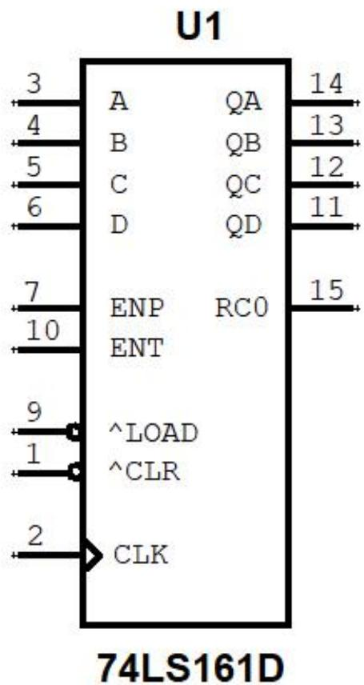  
图 1:74LS161 器件型号

如图 1 所示 74LS161 器件图，器件的管脚编号与实际芯片的管脚编号相同，但是管脚的位置不同。例如，CLK 管脚编号为 2，实际芯片的时钟输入管脚 CLK 的编号也为 2，只是它们在芯片中的位置不同。

在实际芯片中，管脚是从芯片开口处逆时针进行编号的。

在图 1 中，74LS161 的控制管脚有 ENP、ENT、LOAD、CLR 以及 CLK，其中 ENP 和 ENT 管脚表示输入信号为高电平时有效；LOAD和 CLR 管脚末端有一个圆圈，表示低电平有效；CLK 管脚末端有一个三角形，表示时钟上升沿有效，若在 CLK 管脚末端增加一个圆圈，则表示下降沿有效。管脚末端的圆圈通常表示输入信号经过一个非门后加载到输入端。

表 1:74LS161 管脚说明  

<table><tr><td>管脚编号</td><td>管脚名称</td><td>有效电平</td><td>功能描述</td></tr><tr><td>1</td><td>CLR</td><td>低电平</td><td>异步清零端,信号优先级最高,一旦CLR=0,立即将输出QA~QD清零。</td></tr><tr><td>9</td><td>LOAD</td><td>低电平</td><td>异步置数端,优先级次于CLR,当清零信号CLR无效时(高电平),若LOAD=0,则立即将输入数据A~D传送到输出端QA~QD。</td></tr><tr><td>7</td><td>ENP</td><td rowspan="2">高电平</td><td rowspan="2">ENP和ENT是计数使能端,当它们均为有效电平时,计数器才能做加计数。若其中一个为无效电平(低电平),那么计数器输出QA~QD保持不变。</td></tr><tr><td>10</td><td>ENT</td></tr><tr><td>2</td><td>CLK</td><td>↑</td><td>计数器只对输入时钟的上升沿进行计数，在计数时，CLK端每输入一个上升沿，计数器输出QA~QD的数字值加1。</td></tr><tr><td>2~6</td><td>A~D</td><td>-</td><td>计数器置数数据输入端，在LOAD有效时，A~D并行传送到输出端QA~QD。</td></tr><tr><td>11~14</td><td>QA~QD</td><td>-</td><td>计数值输出端，在计数状态下，随着CLK上升沿的输入，输出计数值逐次加1</td></tr><tr><td>15</td><td>RCO</td><td>高电平有效</td><td>RCO是计数器发生进位输出端，也就是当计数值QA~QD=1111=15时，RCO=1，表示计数已达最大值，下个时钟上升沿将发生进位</td></tr></table>

# 优先编码器 74LS148

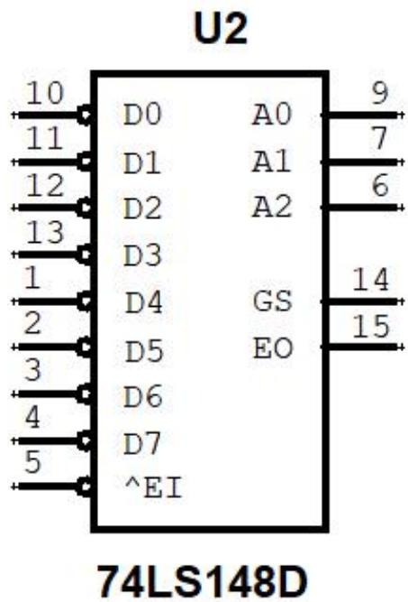  
图 2:优先编码器 74LS148

表 2：74LS148 优先编码器管脚说明  

<table><tr><td>管脚名称</td><td>有效电平</td><td>功能描述</td></tr><tr><td>EI</td><td>0</td><td>编码输入使能端,只有当EI=0使能时,才能对输入的D0~D7最高优先级位进行编码。否则,编码输出A0~A2=111且GS=1,表示编码无效</td></tr><tr><td>D0~D7</td><td>0</td><td>编码输入端,D0优先级最低,D7优先级最高</td></tr><tr><td>A0~A2</td><td>-</td><td>编码输出端,A0是最低位,A2是最高位,A2A1A0表示的十进制数对应于输入编码D0~D7中最高有效编码位的标号。例如,A2A1A0=4,则表示D7~D0=1110xxxx,也就是最高有效位D4=0</td></tr><tr><td>GS</td><td>-</td><td>片选优先编码输出端,当GS=0时,表示有效编码,且D0~D7中至少有一位有效(为低电平)</td></tr><tr><td>EO</td><td>-</td><td>使能输出端,当EO=1时,唯一表示编码输入EI=0使能,且输入编码D0~D7均为高电平,即没有有效编码位的情况</td></tr></table>

# 3-8 译码器 74LS138

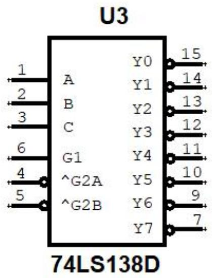  
图 3: 3-8 译码器

表 3：74LS138 译码器管脚说明  

<table><tr><td>管脚名称</td><td>有效电平</td><td>功能描述</td></tr><tr><td>A~C</td><td>-</td><td>地址输入端,A为最低位,C为最高位。当译码器工作时,可以看成一个分配器,将G1=1分配给由CBA地址唯一确定的输出端。例如,当CBA=101时,Y5端接收G1,经过一个非门输出低电平,而其余输出均为高电平。</td></tr><tr><td>G1</td><td>高电平</td><td rowspan="3">片选输入端,当G1=1,G2A+G2B=0时,译码器处于工作状态。否则,译码器被禁止,所有的输出端被封锁在高电平。利用片选的作用可以将多片连接起来以扩展译码器的功能。</td></tr><tr><td>G2A</td><td>低电平</td></tr><tr><td>G2B</td><td>低电平</td></tr><tr><td>Y0~Y7</td><td>低电平</td><td>译码器工作时,有且只有一位输出低电平。哪一位为低电平是由当前输入地址CBA决定的。</td></tr></table>

# 7 段数码显示器 74LS48

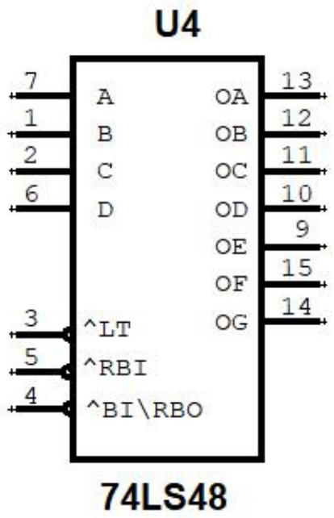  
图 4：共阴极七段显示译码器

表 4：共阴极七段显示译码器 74LS48 管脚说明  

<table><tr><td>管脚名称</td><td>有效电平</td><td>功能描述</td></tr><tr><td>LT</td><td>低电平</td><td>LT是灯测试输入信号。当 LT=0 的信号输入时,被驱动数码管的七段同时点亮,以检查该数码管各段能否正常发光。工作时应使 LT 为高电平。译码时,LT 输入高电平。</td></tr><tr><td>RBI</td><td>低电平</td><td>RBI 是灭零输入。设置灭零输入的目的是为了能把不希望显示的零熄灭。当被驱动的数码管显示的不是 0 时,灭零输入 RBI 不起作用。译码时,RBI 输入高电平。</td></tr><tr><td>BI/RBO</td><td>低电平</td><td>灭灯输入/灭零输出信号。当 BI/RBO 灭灯输入低电平时,被驱动数码管的七段同时熄灭。译码时,BI/RBO 输入高电平。</td></tr><tr><td>A~D</td><td>-</td><td>数字码输入端,A 为最低位,D 为最高位。译码时,被驱动的七段数码管显示 DCBA 表示的十六进制数值。</td></tr><tr><td>OA~OG</td><td>高电平</td><td>译码时,OA~OG 中的所有高电平驱动七段数码管显示输入数字。若是共阳极七段显示译码器 74LS47,则是使用 OA~OG 中的所有低电平驱动七段数码管显示数字。这就是共阴极和共阳极的区别。</td></tr></table>

# 4 位超前进位加法器 74LS283

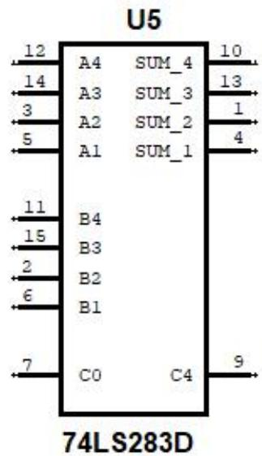  
图 5:四位超前进位加法器 74LS283

表 5：超前进位加法器 74LS283 的管脚描述  

<table><tr><td>管脚名称</td><td>有效电平</td><td>功能描述</td></tr><tr><td>A1~A4</td><td>-</td><td>四位二进制加数，A1为最低位，A4为最高位。</td></tr><tr><td>B1~B4</td><td>-</td><td>四位二进制加数，B1为最低位，B4为最高位。</td></tr><tr><td>SUM_1~SUM_4</td><td>-</td><td>加运算结果。
Sum=A+B+CO的低四位</td></tr><tr><td>CO</td><td>高电平</td><td>来自低位的进位</td></tr><tr><td>C4</td><td>高电平</td><td>进位输出。
当加运算结果超出SUM_4~SUM_1所能表示的最大数15时，输出进位C4=1。</td></tr></table>

# 4 位算术逻辑运算器 74LS181

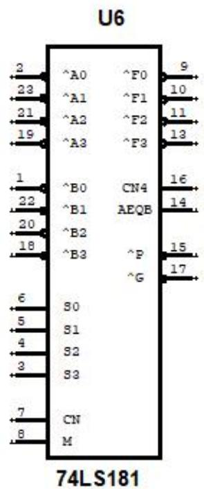  
图 6：算术逻辑运算器 74LS181

表 6：算术运算器 74LS181 的管脚说明  

<table><tr><td>管脚名称</td><td>功能描述</td></tr><tr><td>A0~A3</td><td>四位二进制运算操作数，A3为最高位</td></tr><tr><td>B0~B3</td><td>四位二进制运算操作数，B3为最高位</td></tr><tr><td>F0~F3</td><td>四位二进制运算结果，F3为最高位</td></tr><tr><td>S0~S3</td><td>运算方式，4位二进制可编码2^4=16种不同的运算方式</td></tr><tr><td>M</td><td>运算类型。
当M=1时，A与B进行逻辑运算。逻辑运算包含与、或、非等。
当M=0时，A与B进行算术运算。算术运算包含加、减以及逻辑与算术的混合运算</td></tr><tr><td>CN</td><td>CN表示最低位进位输入。
CN=0，属于有进位型运算，共十六种；
CN=1，属于无进位型运算，也包含十六种。</td></tr><tr><td>CN4</td><td>最高位进位输出，低电平有效。</td></tr><tr><td>AEQB</td><td>当F3~F0=1111时，AEQB=1，否则，AEQB=0</td></tr><tr><td>G</td><td>进位发生输出。</td></tr><tr><td>P</td><td>进位传送输出。</td></tr></table>

触发器的异步置数 PR 和异步清零 CLR 优先级相同，均为最高优先级。在触发器的其它信号起作用时，需要将 PR 和 CLR 置为 0，使其无效。

# D 触发器

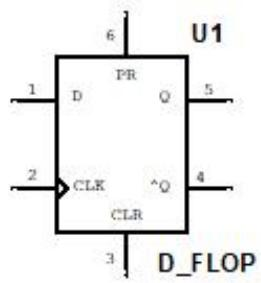  
图 7：D 触发器

表 7：D 触发器管脚描述  

<table><tr><td>管脚名称</td><td>有效电平</td><td>功能描述</td></tr><tr><td>D</td><td>-</td><td>1位输入数据</td></tr><tr><td>PR</td><td>高电平</td><td>异步置数端。当PR=1, CLR=0时,将输出Q置位为1</td></tr><tr><td>CLR</td><td>高电平</td><td>异步清零端。当CLR=1, PR=0时,将输出Q清零</td></tr><tr><td>CLK</td><td>↑</td><td>时钟上升沿有效。当PR=0且CLR=0时,时钟上升沿到来时,输入数据D传送到输出端Q,取反传送到输出端^Q</td></tr></table>

# JK 触发器

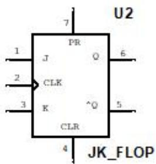  
图 8：JK 触发器

表 8：JK 触发器管脚描述  

<table><tr><td>管脚名称</td><td>有效电平</td><td>功能描述</td></tr><tr><td>D</td><td>-</td><td>1位输入数据</td></tr><tr><td>PR</td><td>高电平</td><td>异步置数端。
当PR=1，CLR=0时，将输出Q置位为1</td></tr><tr><td>CLR</td><td>高电平</td><td>异步清零端。
当CLR=1，PR=0时，将输出Q清零</td></tr><tr><td>J</td><td>高电平</td><td>同步置1端。</td></tr><tr><td></td><td></td><td>当J=1，K=0，时钟上升沿到来时，输出端Q置1</td></tr><tr><td>K</td><td>高电平</td><td>同步置0端。
当k=1，J=0，时钟上升沿到来时，输出端Q置0</td></tr><tr><td>CLK</td><td>↑</td><td>时钟上升沿有效。
当J=K=0时，Q保持不变；
当J=K=1，时钟上升沿到来时，输出端Q翻转，即Q=^Q。利用这一特性，将JK连起来就构成了T触发器。</td></tr></table>

# SR 触发器

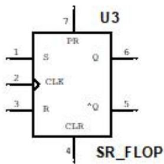  
图 9：SR 触发器

表 9：SR 触发器管脚描述  

<table><tr><td>管脚名称</td><td>有效电平</td><td>功能描述</td></tr><tr><td>D</td><td>-</td><td>1位输入数据</td></tr><tr><td>PR</td><td>高电平</td><td>异步置数端。当PR=1, CLR=0时,将输出Q置位为1</td></tr><tr><td>CLR</td><td>高电平</td><td>异步清零端。当CLR=1, PR=0时,将输出Q清零</td></tr><tr><td>S</td><td>高电平</td><td>同步置位端。当S=1,R=0,时钟上升沿到来时,输出端Q被置位为1</td></tr><tr><td>R</td><td>高电平</td><td>同步清零端。当R=1,S=0,时钟上升沿到来时,输出端Q被清零</td></tr><tr><td>CLK</td><td>↑</td><td>时钟上升沿触发同步置位或清零</td></tr></table>

# T 触发器

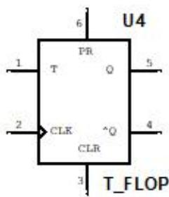  
图 10：T 触发器

表 10：T 触发器管脚描述  

<table><tr><td>管脚名称</td><td>有效电平</td><td>功能描述</td></tr><tr><td>D</td><td>-</td><td>1位输入数据</td></tr><tr><td>PR</td><td>高电平</td><td>异步置数端。当PR=1, CLR=0时,将输出Q置位为1</td></tr><tr><td>CLR</td><td>高电平</td><td>异步清零端。当CLR=1, PR=0时,将输出Q清零</td></tr><tr><td>T</td><td>高电平</td><td>当T=1,时钟上升沿到来时,输出端Q发生翻转,即Q^AQ。当T=0时,输出Q保持不变</td></tr><tr><td>CLK</td><td>↑</td><td>时钟上升沿有效。</td></tr></table>

# 四位双向移位寄存器 74LS194

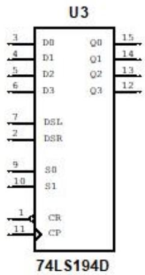  
图 11：四位双向移位寄存器

表 11：四位双向移位寄存器管脚说明  

<table><tr><td>管脚名称</td><td>有效电平</td><td>功能描述</td></tr><tr><td>D0~D3</td><td>-</td><td>移位数据输入端</td></tr><tr><td>Q0~Q3</td><td>-</td><td>移位数据输出端</td></tr><tr><td>DSL</td><td></td><td>左移串行数据输入端</td></tr><tr><td>DSR</td><td></td><td>右移串行数据输入端</td></tr><tr><td>S0~S1</td><td></td><td>移位方式控制端。S1S0=00,输出保持;S1S0=01,右移;S1S0=10,左移;S1S0=11,并行传送,输出Q0~Q3=D0~D3</td></tr><tr><td>CR</td><td>低电平</td><td>异步清零端,优先级最高,与时钟无关。当CR=0时,输出Q0~Q3均为低电平</td></tr><tr><td>CP</td><td>↑</td><td>时钟输入端,上升沿有效。触发移位或并行输出。</td></tr></table>

# 8 选 1 数据选择器 74LS151D

74LS151D 为互补输出的 8 选 1 数据选择器，引脚排列如图 12 所示，功能见表 12。选择控制端（地址端）为 ${ \mathsf { C } } { \sim } { \mathsf { A } }$ ，按二进制译码，从 8 个输入数据 ${ \tt D } 0 \sim { \tt D } 7$ 中，选择一个需要的数据送到输出端 Y，G 为使能端，低电平有效。

（1）使能端 $\mathsf { G } = \mathsf { 1 }$ 时，不论 ${ \mathsf { C } } { \sim } { \mathsf { A } }$ 状态如何，均无输出（ $\mathsf { Y } = 0$ ， ${ \mathsf { W } } = 1$ ），多路开关被禁止。  
（2）使能端 $\mathtt { G } = 0$ 时，多路开关正常工作，根据地址码 C、B、A的状态选择 ${ \tt D } 0 \sim { \tt D } 7$ 中某一个通道的数据输送到输出端 $\textsf { Y }$ 。如： $\mathtt { C B A } = 0 0 0$ ，则选择 D0 数据到输出端，即 $\yen 1200$ 。 $\mathsf { C B A } { = } 0 0 1$ ，则选择 D1 数据到输出端，即 $\curlyvee = \mathsf { D } 1$ ，依此类推。

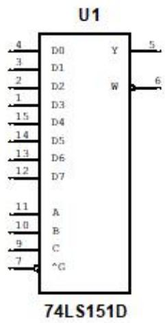  
图 12:8 选 1 数据选择器

表 12：8 选 1 数据选择器管脚说明  

<table><tr><td>管脚名称</td><td>功能描述</td></tr><tr><td>D0~D7</td><td>8位数据输入端</td></tr><tr><td>A~C</td><td>数据选择端，CBA表示的二进制数决定将哪一位输入数据作为输出。例如：CBA=101，那么选择D5输出到Y端</td></tr><tr><td>G</td><td>当G=1时，无论输入数据以及数据选择信号如何变化，输出端Y始终为低电平，W始终为高电平。当G=0时，多路开关正常工作，根据地址码C、B、A的状态选择D0~D7中某一个通道的数据输送到输出端Y。输出端W的值为Y取反。</td></tr><tr><td>W和Y</td><td>互补的数据输出端</td></tr></table>

# 二-五进制计数器 74LS90

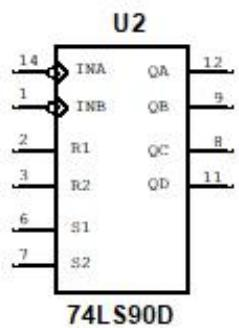  
图 13：二-五进制计数器

表 13：二-五进制计数器功能表  

<table><tr><td colspan="4">复位输入</td><td colspan="4">输出</td></tr><tr><td>R1</td><td>R2</td><td>S1</td><td>S2</td><td>Q3</td><td>Q2</td><td>Q1</td><td>Q0</td></tr><tr><td>1</td><td>1</td><td>0</td><td>x</td><td>0</td><td>0</td><td>0</td><td>0</td></tr><tr><td>1</td><td>1</td><td>x</td><td>0</td><td>0</td><td>0</td><td>0</td><td>0</td></tr><tr><td>x</td><td>x</td><td>1</td><td>1</td><td>1</td><td>0</td><td>0</td><td>1</td></tr><tr><td>x</td><td>0</td><td>x</td><td>0</td><td colspan="4">计数</td></tr><tr><td>0</td><td>x</td><td>0</td><td>x</td><td colspan="4">计数</td></tr><tr><td>0</td><td>x</td><td>x</td><td>0</td><td colspan="4">计数</td></tr><tr><td>x</td><td>0</td><td>0</td><td>x</td><td colspan="4">计数</td></tr></table>

74LS90 是二-五十进制异步计数器，该芯片包含 4 个主从触发器和附加门，其中一级 Q0 组成二分频计数器，计数器输入端是 INA；另外三级（Q3、Q2、Q1）组成五分频计数器，计数输入端是 INB。四级的共同清零输入是 R1、R2，而 S1、S2 则为预置 9 输入端。利用该异步计数器，根据“计数到 N 时置 0”的原则（也叫反馈复位法），可构成 N 进制计数器。

# 桶形移位器

桶形移位器是一种组合逻辑电路，通常作为微处理器 CPU 的一部分。它具有 n 个数据输入和 n 个数据输出，以及指定如何移动数据的控制输入，指定移位方向、移位类型（循环、算术还是逻辑移位）及移动的位数等

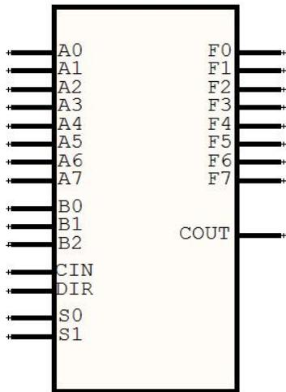  
SHIFT8   
图 14：桶形移位器

表 14：桶形移位器  

<table><tr><td>管脚名称</td><td>功能描述</td></tr><tr><td>A0~A7</td><td>输入端</td></tr><tr><td>F0~F7</td><td>输出端</td></tr><tr><td>B0~B2</td><td>移位数量，例如：B0~B2都为0移动0位，B0~B2都为1移动7位</td></tr><tr><td>S0~S1</td><td>移位方式编码，S0=0,S1=0，表示逻辑移位；S0=0,S1=1，表示循环移位；S0=1,S1=0，表示算术移位；S0=1,S1=1，表示带进位循环移位</td></tr><tr><td>CIN</td><td>进位输入信号，带进位循环移位时才会用到。1表示有进位，0表示无进位。</td></tr><tr><td>DIR</td><td>移位方向，1表示向右移；0表示向左移</td></tr><tr><td>COUT</td><td>进位输出信号，带进位循环移位时才会用到。1表有进位，0表示无进位。</td></tr></table>