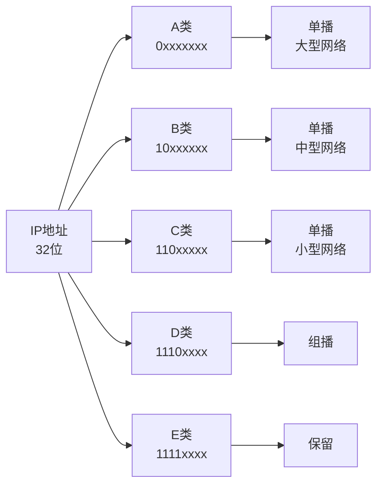
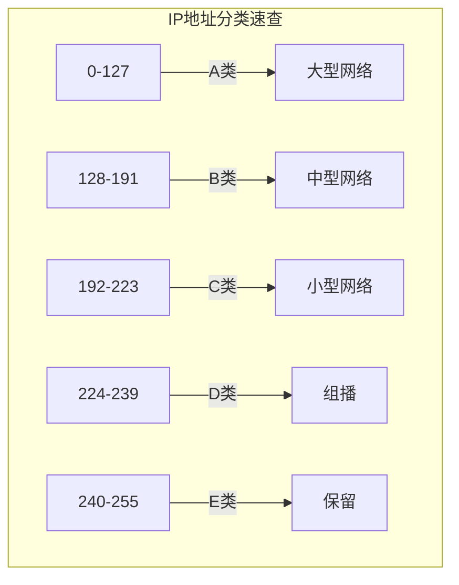

# 专题-IP地址分类

## 基本信息

- **课程**：计算机网络
- **专题**：IP地址分类（分类编址与CIDR）
- **日期**：2026-04-30
- **标签**：#IP地址 #分类编址 #CIDR #网络层 #IPv4

***

## 重点内容

### ⭐⭐⭐ 核心概念

1. **分类编址**：A、B、C、D、E五类地址的划分规则
2. **CIDR无分类编址**：网络前缀 + 主机号，斜线记法
3. **特殊IP地址**：私有地址、环回地址、广播地址
4. **地址掩码**：子网掩码的计算与应用

### ⭐⭐ 关键问题

- 如何判断一个IP地址属于哪一类？
- 分类编址存在什么问题？
- CIDR如何解决地址浪费问题？
- 如何计算网络地址和地址范围？

***

## 详细笔记

### 一、IP地址概述

**IP地址定义**：
- IP地址是分配给网络设备的数字标识
- IPv4地址长度为**32位**，采用点分十进制表示
- 全球约有43亿个IPv4地址（2³²）

**IP地址结构**：
```
┌─────────────────┬─────────────────┐
│    网络号字段    │    主机号字段    │
│   (标识网络)    │   (标识主机)    │
└─────────────────┴─────────────────┘
```

#### 📷 图4-9 IP地址中的网络号和主机号字段


> 📚 **课本出处**：图4-9 IP地址分为网络号和主机号两部分，网络号标识主机所在的网络

***

### 二、分类的IP地址（Classful Addressing）

#### 1. 分类方法



#### 📷 图4-10 分类的IP地址及各类地址所占比例


> 📚 **课本出处**：图4-10(a)展示了A、B、C、D、E五类地址的划分方式，图4-10(b)展示了各类地址占IP地址总数的比例

#### 2. 各类地址详细说明

##### 📌 A类地址

| 属性 | 说明 |
|------|------|
| 首位比特 | 0 |
| 第一个字节范围 | 0 ~ 127 |
| 网络号位数 | 8位（实际可用7位） |
| 主机号位数 | 24位 |
| 可指派网络数 | 126个（2⁷ - 2） |
| 每网络最大主机数 | 16,777,214个（2²⁴ - 2） |
| 地址空间占比 | 50% |
| 默认子网掩码 | 255.0.0.0 (/8) |

**地址结构**：
```
 0 | 网络号(7位) |      主机号(24位)      |
```

**特殊说明**：
- 网络号0：保留表示"本网络"
- 网络号127：保留用于环回测试（如127.0.0.1）
- 主机号全0：网络地址
- 主机号全1：广播地址

---

##### 📌 B类地址

| 属性 | 说明 |
|------|------|
| 首位比特 | 10 |
| 第一个字节范围 | 128 ~ 191 |
| 网络号位数 | 16位（实际可用14位） |
| 主机号位数 | 16位 |
| 可指派网络数 | 16,384个（2¹⁴） |
| 每网络最大主机数 | 65,534个（2¹⁶ - 2） |
| 地址空间占比 | 25% |
| 默认子网掩码 | 255.255.0.0 (/16) |

**地址结构**：
```
 10 |    网络号(14位)    |    主机号(16位)    |
```

---

##### 📌 C类地址

| 属性 | 说明 |
|------|------|
| 首位比特 | 110 |
| 第一个字节范围 | 192 ~ 223 |
| 网络号位数 | 24位（实际可用21位） |
| 主机号位数 | 8位 |
| 可指派网络数 | 2,097,152个（2²¹） |
| 每网络最大主机数 | 254个（2⁸ - 2） |
| 地址空间占比 | 12.5% |
| 默认子网掩码 | 255.255.255.0 (/24) |

**地址结构**：
```
 110 |       网络号(21位)       | 主机号(8位) |
```

---

##### 📌 D类地址（组播地址）

| 属性 | 说明 |
|------|------|
| 首位比特 | 1110 |
| 第一个字节范围 | 224 ~ 239 |
| 用途 | 多播（Multicast）通信 |
| 特点 | 不分配给单个主机 |

**常见组播地址**：
- 224.0.0.1：所有主机组
- 224.0.0.2：所有路由器组

---

##### 📌 E类地址（保留地址）

| 属性 | 说明 |
|------|------|
| 首位比特 | 1111 |
| 第一个字节范围 | 240 ~ 255 |
| 用途 | 保留用于实验和研究 |

#### 3. 分类地址速查表



| 类别 | 第一个字节 | 网络号位数 | 主机号位数 | 默认子网掩码 | 用途 |
|:----:|:----------:|:----------:|:----------:|:------------:|:----:|
| A | 0 ~ 127 | 8 | 24 | 255.0.0.0 | 大型网络 |
| B | 128 ~ 191 | 16 | 16 | 255.255.0.0 | 中型网络 |
| C | 192 ~ 223 | 24 | 8 | 255.255.255.0 | 小型网络 |
| D | 224 ~ 239 | - | - | - | 组播 |
| E | 240 ~ 255 | - | - | - | 保留 |

#### 4. 分类地址的问题

⚠️ **地址浪费严重**：

| 问题 | 说明 |
|------|------|
| A类网络主机太多 | 每个A类网络有1677万+主机，远超实际需求 |
| C类网络主机太少 | 每个C类网络只有254台主机，不够用 |
| 地址分配不灵活 | 只能按/8、/16、/24固定分配 |

> 💡 **历史背景**：互联网早期认为IP地址用不完，美国大学都能分配到A类地址。后来互联网爆发式增长，分类地址的缺陷暴露无遗。

***

### 三、无分类编址CIDR

#### 1. CIDR概述

**CIDR**（Classless Inter-Domain Routing）：无分类域间路由选择

**产生原因**：
- 解决分类编址的地址浪费问题
- 推迟IPv4地址枯竭的时间
- 提高地址分配灵活性

#### 📷 图4-11 CIDR表示的IP地址


> 📚 **课本出处**：图4-11 CIDR网络前缀长度可变，不同于分类地址的固定长度

#### 2. CIDR的三个要点

**(1) 网络前缀**

- 前缀长度n可变（0 ~ 32）
- **斜线记法**：IP地址/n
- 例：`128.14.35.7/20`，前20位是网络前缀

**(2) 地址块**

- 网络前缀相同的连续IP地址组成CIDR地址块
- 地址数 = 2^(32-n)
- 例：/20地址块有2¹² = 4096个地址

**(3) 地址掩码（子网掩码）**

- 1的个数 = 网络前缀长度
- 网络地址 = IP地址 AND 掩码

#### 📷 图4-12 从IP地址算出网络地址


> 📚 **课本出处**：图4-12 IP地址与掩码进行AND运算得到网络地址

#### 3. CIDR计算示例

```
IP地址：128.14.35.7/20

二进制IP：  10000000 00001110 00100011 00000111
掩码(/20)：11111111 11111111 11110000 00000000
           ----------------------------------- AND
网络地址：  10000000 00001110 00100000 00000000
           = 128.14.32.0/20

最小地址：128.14.32.0（主机号全0）
最大地址：128.14.47.255（主机号全1）
可指派地址数：2^12 - 2 = 4094
```

#### 4. 常用CIDR地址块

| 前缀长度 | 掩码 | 地址数 | 相当于分类网络 |
|:--------:|:----:|:------:|:--------------:|
| /13 | 255.248.0.0 | 512K | 8个B类或2048个C类 |
| /16 | 255.255.0.0 | 64K | 1个B类或256个C类 |
| /20 | 255.255.240.0 | 4K | 16个C类 |
| /24 | 255.255.255.0 | 256 | 1个C类 |
| /30 | 255.255.255.252 | 4 | 点对点链路 |
| /31 | 255.255.255.254 | 2 | 点对点链路 |
| /32 | 255.255.255.255 | 1 | 主机路由 |

#### 5. 路由聚合（构造超网）

**概念**：用较大的CIDR地址块代替多个小的地址块

**好处**：
- 减少转发表项目数
- 缩短查找时间
- 提高路由效率

#### 📷 图4-13 CIDR地址块划分举例


> 📚 **课本出处**：图4-13 ISP拥有206.0.64.0/18，大学分配206.0.68.0/22，各系再细分

**地址分配示例**：

```
ISP拥有：206.0.64.0/18（64个C类网络）
    ↓ 分配
大学：206.0.68.0/22（1024地址，4个C类）
    ↓ 再分配
一系：206.0.68.0/23（512地址，2个C类）
二系：206.0.70.0/24（256地址，1个C类）
三系：206.0.71.0/25（128地址，1/2个C类）
四系：206.0.71.128/25（128地址，1/2个C类）
```

***

### 四、特殊IP地址

#### 1. 私有地址（RFC 1918）

| 类别 | 私有地址范围 | 用途 |
|:----:|:------------:|:----:|
| A类 | 10.0.0.0 ~ 10.255.255.255 | 大型私有网络 |
| B类 | 172.16.0.0 ~ 172.31.255.255 | 中型私有网络 |
| C类 | 192.168.0.0 ~ 192.168.255.255 | 小型私有网络 |

> 💡 **特点**：私有地址只能在局域网内使用，不能直接在公网路由，需要通过NAT转换

#### 2. 特殊用途地址

| 地址/范围 | 用途 |
|:---------:|:----:|
| 127.0.0.0 ~ 127.255.255.255 | 回环地址（Loopback），用于本机测试 |
| 0.0.0.0 | 表示本网络或本主机 |
| 255.255.255.255 | 受限广播地址 |
| 主机号全0 | 网络地址（如：192.168.1.0） |
| 主机号全1 | 广播地址（如：192.168.1.255） |

#### 📊 表4-2 一般不指派的特殊IP地址

| 网络号 | 主机号 | 源地址 | 目的地址 | 含义 |
|:------:|:------:|:------:|:--------:|:----:|
| 0 | 0 | 可以 | 不可 | 本网络上的本主机（DHCP） |
| 0 | X | 可以 | 不可 | 本网络上主机号为X的主机 |
| 全1 | 全1 | 不可 | 可以 | 只在本网络广播（不转发） |
| Y | 全1 | 不可 | 可以 | 对网络Y的所有主机广播 |
| 127 | 非全0/全1 | 可以 | 可以 | 本地软件环回测试 |

***

### 五、分类编址 vs CIDR

```mermaid
flowchart LR
    subgraph 分类["分类编址"]
        A1[固定前缀长度]
        A2[/8 /16 /24]
        A3[管理简单]
        A4[地址浪费]
    end
    
    subgraph CIDR["CIDR"]
        B1[可变前缀长度]
        B2[/n n=0-32]
        B3[灵活分配]
        B4[路由聚合]
    end
    
    A1 --> A2
    A2 --> A3
    A3 --> A4
    
    B1 --> B2
    B2 --> B3
    B3 --> B4
```

| 特性 | 分类编址 | CIDR |
|:----:|:--------:|:----:|
| 网络前缀 | 固定（8/16/24位） | 可变（0-32位） |
| 表示方法 | 点分十进制 | 斜线记法（/n） |
| 地址分配 | 不灵活 | 灵活 |
| 地址利用率 | 低 | 高 |
| 路由表规模 | 大 | 小（支持聚合） |
| 当前使用 | 历史 | 主流 |

***

## 疑问与思考

### ❓ 待解决问题

1. 为什么分类IP地址会造成严重的地址浪费？
2. CIDR如何通过路由聚合减少路由表规模？
3. 实际网络中如何规划CIDR地址块分配？

### 💡 个人理解

- **分类编址的历史意义**：互联网早期设计简单，满足科研需求，但无法应对商业化后的爆发增长
- **CIDR的优势**：前缀长度灵活，可根据实际需求分配地址，大大提高地址利用率
- **路由聚合的价值**：ISP可以用一个大的地址块代替多个小地址块，减少全球路由表条目
- **私有地址的作用**：缓解公网地址不足，配合NAT实现多主机共享公网IP

***

## 相关链接

### 课本图片

- [图4-9 IP地址结构](../../images/14e29746fc5835648efff90b28596d003f77947ce5f78f4f3c184ad1dc62f3c9.jpg)
- [图4-10 分类的IP地址](../../images/db8490fd5b8097a245f680737842db7741894511b2e61ce3e829f437d8cd2200.jpg)
- [图4-11 CIDR表示的IP地址](../../images/731cb2968fba4755573527adc00c0d7d866c4273162ed2d41b0768582908cca4.jpg)
- [图4-12 地址掩码运算](../../images/8d36d3051cb42eafbaeb2dae4a3e9b054b78f5cde783c9d8a21ab588cd670d6b.jpg)
- [图4-13 CIDR地址块划分](../../images/543120d372726e22e12c6d81f6d14c5ac66be19c7420a6b71cf05c2ad8665ec2.jpg)

### 相关笔记

- [第4章-4.2.1~4.2.2-虚拟互连网络与IP地址](../章节笔记/第4章-网络层/第4章-4.2.1~4.2.2-虚拟互连网络与IP地址.md)
- [第4章-4.2.3-IP地址与MAC地址](../章节笔记/第4章-网络层/第4章-4.2.3-IP地址与MAC地址.md)

***

## 快速参考卡片

### IP地址分类速记

```
A类：0-127      /8      大型网络
B类：128-191    /16     中型网络  
C类：192-223    /24     小型网络
D类：224-239    -       组播
E类：240-255    -       保留
```

### 私有地址速记

```
10.x.x.x           (A类)
172.16-31.x.x      (B类)
192.168.x.x        (C类)
```

### CIDR常用前缀

```
/30 = 255.255.255.252    4地址（点对点）
/24 = 255.255.255.0      256地址（1个C类）
/16 = 255.255.0.0        65536地址（1个B类）
/8  = 255.0.0.0          1677万地址（1个A类）
```
