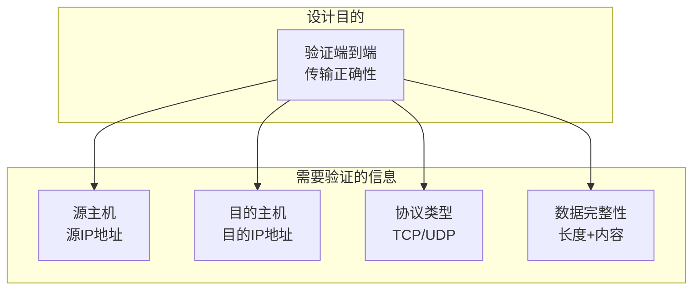
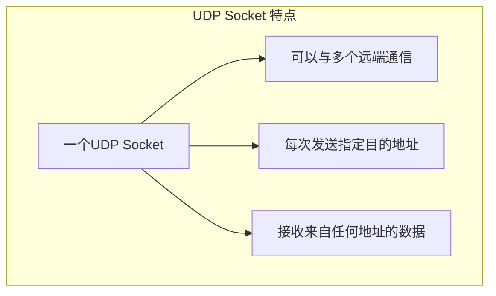
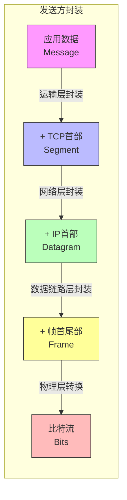

# TCP/UDP核心概念辨析

## 基本信息
- **课程**：计算机网络（第8版）
- **专题**：TCP/UDP核心概念辨析
- **日期**：2026-04-11
- **标签**：#TCP #UDP #伪首部 #Socket #数据单元 #首部对比

---

## 重点内容

### ⭐⭐⭐ 核心概念
1. **伪首部的构造规则** - 12字节固定结构
2. **IP首部 vs 伪首部** - 本质区别
3. **UDP Socket** - 无连接但存在Socket
4. **各层数据单元** - 报文、段、分组、帧、比特

### 📌 考试重点
- 伪首部的12字节构造规则
- IP首部和伪首部的5大区别
- UDP Socket与TCP Socket的区别
- 五层体系结构各层数据单元名称

---

## 详细笔记

### 一、IP首部 vs 伪首部 对比 ⭐⭐⭐

#### 核心区别一览

| 特性 | **IP首部** | **伪首部** |
|------|-----------|-----------|
| **所属层次** | 网络层 | 运输层（计算检验和时临时使用） |
| **实际传输** | ✅ 真正随数据报传输 | ❌ 不传输，仅用于计算 |
| **主要功能** | IP路由、分片、寻址 | 检验和计算时验证IP地址 |
| **存在位置** | IP数据报的前部 | UDP/TCP检验和计算时临时添加 |
| **字段内容** | 版本、首部长度、TTL、协议等 | 源IP、目的IP、0、协议、长度 |

#### 为什么要用伪首部？

**核心原因：验证端到端传输正确性**



**三大作用：**
1. **验证IP地址正确性** - 防止数据报被错误路由
2. **验证协议类型** - 防止UDP被当作TCP处理
3. **完整性验证** - 包含长度信息

---

### 二、伪首部的构造规则 ⭐⭐⭐

#### 固定结构（12字节）

```
 0                   1                   2                   3
 0 1 2 3 4 5 6 7 8 9 0 1 2 3 4 5 6 7 8 9 0 1 2 3 4 5 6 7 8 9 0 1
+-+-+-+-+-+-+-+-+-+-+-+-+-+-+-+-+-+-+-+-+-+-+-+-+-+-+-+-+-+-+-+-+
|                      源IP地址 (32位)                           |  ← 4字节
+-+-+-+-+-+-+-+-+-+-+-+-+-+-+-+-+-+-+-+-+-+-+-+-+-+-+-+-+-+-+-+-+
|                     目的IP地址 (32位)                          |  ← 4字节
+-+-+-+-+-+-+-+-+-+-+-+-+-+-+-+-+-+-+-+-+-+-+-+-+-+-+-+-+-+-+-+-+
|   全0 (8位)  |  协议 (8位)   |      TCP/UDP长度 (16位)        |  ← 4字节
+-+-+-+-+-+-+-+-+-+-+-+-+-+-+-+-+-+-+-+-+-+-+-+-+-+-+-+-+-+-+-+-+
```

#### 各字段构造规则

| 字段 | 长度 | 构造规则 | 来源 |
|------|------|---------|------|
| **源IP地址** | 4字节 | 直接复制 | IP首部的"源地址"字段 |
| **目的IP地址** | 4字节 | 直接复制 | IP首部的"目的地址"字段 |
| **全0** | 1字节 | 固定填0 | 填充字段 |
| **协议** | 1字节 | UDP=17, TCP=6 | IP首部的"协议"字段 |
| **长度** | 2字节 | TCP/UDP首部 + 数据 | 计算得出 |

#### 构造示例

**UDP伪首部示例：**
```
场景：主机A (192.168.1.1) 发送UDP数据给主机B (192.168.1.2)
      UDP数据长度 = 100字节 (首部8字节 + 数据92字节)

C0 A8 01 01    ← 源IP: 192.168.1.1
C0 A8 01 02    ← 目的IP: 192.168.1.2
00 11 00 64    ← 0 + 协议17 + 长度100
```

**关键规则：**
1. **固定长度** - 必须是12字节
2. **信息来源** - 前8字节从IP首部获取，后4字节根据实际情况填写
3. **协议号** - TCP=6，UDP=17
4. **字节序** - 大端序（网络字节序）

---

### 三、TCP伪首部 vs UDP伪首部 ⭐⭐⭐

#### 核心结论

> **TCP和UDP的伪首部结构完全相同，唯一区别是协议号**

| 特性 | UDP伪首部 | TCP伪首部 |
|------|-----------|-----------|
| **总长度** | 12字节 | 12字节 |
| **源IP地址** | 相同 | 相同 |
| **目的IP地址** | 相同 | 相同 |
| **全0字段** | 相同 | 相同 |
| **协议号** | **17** | **6** |
| **长度字段** | UDP首部(8B) + 数据 | TCP首部(20~60B) + 数据 |
| **作用** | 验证UDP数据报 | 验证TCP报文段 |

#### 结构对比

```
UDP伪首部（12字节）：
+----------------+----------------+----------------+----------------+
|                    源IP地址 (32位)                                 |
+----------------+----------------+----------------+----------------+
|                    目的IP地址 (32位)                                |
+----------------+----------------+----------------+----------------+
|   全0 (8位)    |   协议=17 (8位)   |         UDP长度 (16位)         |
+----------------+----------------+----------------+----------------+

TCP伪首部（12字节）：
+----------------+----------------+----------------+----------------+
|                    源IP地址 (32位)                                 |
+----------------+----------------+----------------+----------------+
|                    目的IP地址 (32位)                                |
+----------------+----------------+----------------+----------------+
|   全0 (8位)    |   协议=6 (8位)    |         TCP长度 (16位)         |
+----------------+----------------+----------------+----------------+
```

#### 长度字段示例

```
场景：发送100字节数据

UDP：
- UDP首部：8字节
- UDP数据：100字节
- 伪首部长度字段 = 108 (0x006C)

TCP：
- TCP首部：20字节（无选项）
- TCP数据：100字节
- 伪首部长度字段 = 120 (0x0078)
```

#### 为什么协议号不同？

**IP首部中的协议字段：**

| 协议 | 协议号 | 用途 |
|------|--------|------|
| ICMP | 1 | 网际控制报文协议 |
| IGMP | 2 | 网际组管理协议 |
| **TCP** | **6** | 传输控制协议 |
| **UDP** | **17** | 用户数据报协议 |
| IPv6 | 41 | IPv6封装 |
| OSPF | 89 | 开放最短路径优先 |

**作用：** 验证数据报是否使用了正确的运输层协议，防止错误交付。

---

### 四、UDP中有Socket吗？⭐⭐⭐

**答案：有！**

#### Socket定义（对UDP和TCP都适用）

> **Socket = (IP地址 : 端口号)**

#### UDP Socket vs TCP Socket 对比

| 特性 | **UDP Socket** | **TCP Socket** |
|------|---------------|---------------|
| **连接** | 无连接 | 面向连接 |
| **Socket数量** | 一个Socket可与多个通信 | 一个连接对应一个Socket对 |
| **标识** | 本地IP+端口 | 本地IP+端口 + 远端IP+端口 |
| **通信方式** | 一对一、一对多、多对多 | 只能一对一 |
| **可靠性** | 不可靠 | 可靠 |

#### UDP Socket 特点



**代码对比：**

```python
# UDP Socket - 无连接，可与多个通信
udp_socket = socket.socket(socket.AF_INET, socket.SOCK_DGRAM)
udp_socket.sendto(b'Hello', ('192.168.1.2', 80))
udp_socket.sendto(b'World', ('192.168.1.3', 53))  # 同一个Socket

# TCP Socket - 面向连接，只能与一个通信
tcp_socket = socket.socket(socket.AF_INET, socket.SOCK_STREAM)
tcp_socket.connect(('192.168.1.2', 80))  # 先连接
tcp_socket.send(b'Hello')  # 只能发给已连接的对方
```

---

### 四、各层级传输的数据单元 ⭐⭐⭐

#### 总体对比表

| OSI层次 | TCP/IP层次 | 数据单元名称 | 英文全称 |
|---------|-----------|-------------|---------|
| 应用层 | 应用层 | **报文（Message）** | Message |
| 运输层 | 运输层 | **报文段/用户数据报** | Segment / Datagram |
| 网络层 | 网际层 | **分组/数据报** | Packet / Datagram |
| 数据链路层 | 网络接口层 | **帧** | Frame |
| 物理层 | 网络接口层 | **比特** | Bit |

#### 数据封装过程



#### 各层详细说明

| 层次 | 数据单元 | 说明 |
|------|---------|------|
| **应用层** | 报文（Message） | HTTP请求、邮件内容等 |
| **运输层** | TCP: 报文段（Segment）<br/>UDP: 用户数据报（Datagram） | TCP首部20~60B / UDP首部8B + 数据 |
| **网络层** | 分组/数据报（Packet/Datagram） | IP首部20~60B + 数据 |
| **数据链路层** | 帧（Frame） | 帧首部 + IP数据报 + 帧尾部 |
| **物理层** | 比特（Bit） | 0和1的电信号/光信号 |

#### 记忆口诀

> **"应报运段网分链帧物比"**
> 
> 或
> 
> **"数（据）段（报文）分（组）帧（帧）比（特）"**

---

## 核心概念总结

### 伪首部构造公式

```
伪首部 = 源IP(4B) + 目的IP(4B) + 0(1B) + 协议(1B) + 长度(2B) = 12B

协议号：TCP=6，UDP=17
```

### UDP Socket 特点

```
✅ UDP有Socket
✅ Socket定义相同 (IP:端口)
✅ UDP Socket可以一对多
❌ TCP Socket只能一对一
```

### 五层数据单元

```
应用层 → 报文
运输层 → 报文段(TCP) / 用户数据报(UDP)
网络层 → 分组/IP数据报
链路层 → 帧
物理层 → 比特
```

---

## 疑问与思考

### ❓ 待解决问题
1. 为什么伪首部不直接放在TCP/UDP首部中？
2. UDP Socket一对多通信的具体应用场景？
3. 不同层数据单元命名的历史原因？

### 💡 个人理解
- 伪首部设计巧妙，既实现了端到端验证，又保持了层间独立性
- UDP Socket的无连接特性使其适合广播、多播场景
- 各层数据单元命名反映了不同层的核心功能和处理对象

---

## 相关链接

- [第5章-5.5-TCP报文段的首部格式](../章节笔记/第5章-5.5-TCP报文段的首部格式.md)
- [第5章-UDP用户数据报协议](../章节笔记/第5章-UDP用户数据报协议.md)
- 课本出处：第5章 5.2节、5.3节、5.5节
- RFC文档：RFC 793 (TCP)、RFC 768 (UDP)
