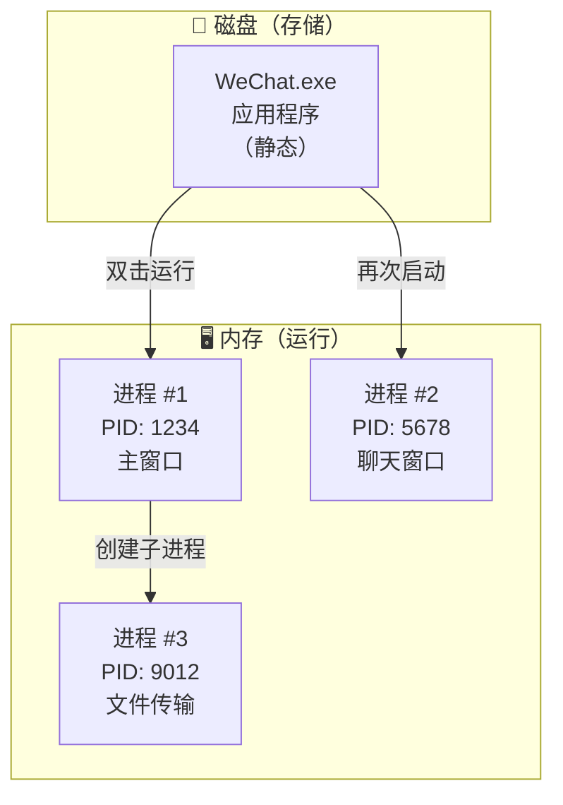
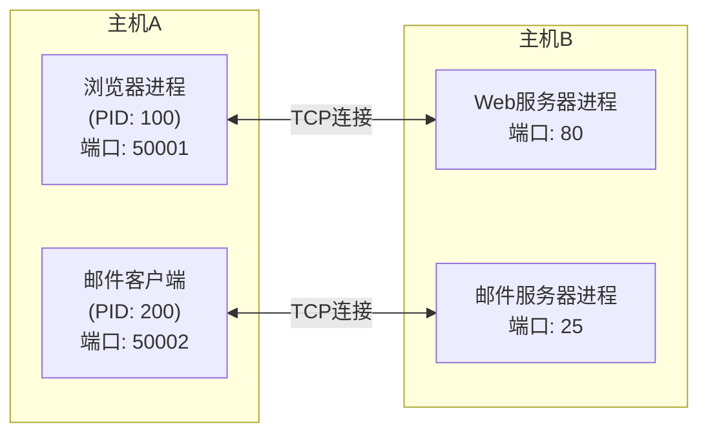
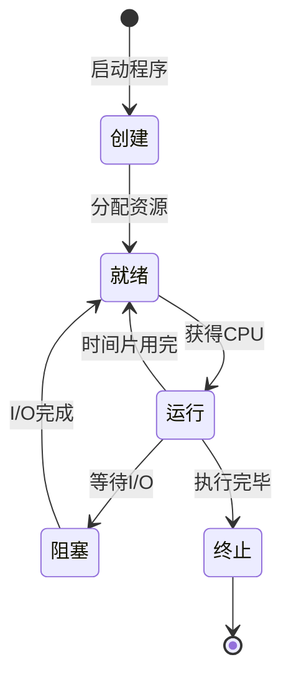

# 进程与应用程序的区别

## 基本信息
- **课程**：计算机网络
- **相关章节**：第5章 运输层（5.1.1 进程之间的通信）
- **日期**：2026-04-02
- **标签**：#操作系统 #运输层 #进程通信 #基础概念

## 重点内容

### 核心区别

| 对比项 | 应用程序（Application） | 进程（Process） |
|--------|----------------------|----------------|
| **本质** | 静态的程序代码和数据的集合 | 动态的、正在运行的程序实例 |
| **存在形式** | 存储在磁盘上（文件） | 运行在内存中 |
| **生命周期** | 永久存储（除非被删除） | 临时存在（创建→运行→终止） |
| **资源占用** | 不占用CPU和内存（未运行时） | 占用CPU、内存、I/O等资源 |
| **数量关系** | 一个应用程序可以对应多个进程 | 一个进程对应一个运行中的程序 |

### 在计算机网络中的重要性

> 📌 **运输层为应用进程之间提供逻辑通信**
> 
> IP协议能把分组送到目的主机，但分组还停留在主机的网络层。真正进行通信的实体是主机中的**应用进程**。

## 详细笔记

### 1. 应用程序（Application/Program）

**定义**：应用程序是**静态的**、存储在磁盘上的可执行文件和相关的资源文件。

**特点**：
- 是一组指令和数据的集合
- 以文件形式存储（如 `.exe`、`.app`、`.jar`）
- 未运行时不会消耗系统资源
- 可以被多次启动运行

**示例**：
```
微信安装目录/
├── WeChat.exe      ← 应用程序（可执行文件）
├── resources/
├── config.ini
└── ...
```

### 2. 进程（Process）

**定义**：进程是**动态的**、正在运行的程序实例，是操作系统进行资源分配和调度的基本单位。

**特点**：
- 是程序的一次执行过程
- 拥有独立的内存空间和系统资源
- 由操作系统创建、调度和管理
- 有生命周期：创建 → 就绪 → 运行 → 阻塞 → 终止

**进程的组成**：
- **程序段**：程序的代码
- **数据段**：程序运行时的数据
- **PCB（进程控制块）**：操作系统管理进程的数据结构，包含进程ID、状态、优先级、资源清单等

### 3. 关系图解



### 4. 在运输层中的体现

在计算机网络第5章运输层中，**进程**的概念尤为重要：



**关键点**：
- **端口号**标识的是**进程**，而不是应用程序
- 一个应用程序（如浏览器）可以打开**多个进程**，每个进程使用不同的端口号
- 运输层通过**（IP地址，端口号）**即**套接字(socket)**来唯一标识网络中的一个进程
- 套接字公式：$socket = (IP地址 : 端口号)$

### 5. 进程生命周期



## 疑问与思考

❓ **疑问**：如果一个应用程序启动了多个进程，这些进程之间如何通信？

💡 **解答**：
- 同一应用程序的多个进程之间可以通过**进程间通信(IPC)**机制通信
- 在不同主机上，通过运输层的TCP/UDP协议进行通信
- 每个进程通过唯一的端口号标识

❓ **疑问**：为什么运输层需要端口号而不是直接使用应用程序名称？

💡 **解答**：
- 进程创建和撤销是动态的
- 不同操作系统使用不同的进程标识符格式
- 端口号提供了一种与操作系统无关的统一标识方法

## 类比理解

| 类比 | 应用程序 | 进程 |
|------|---------|------|
| **食谱** | 写好的食谱（静态） | 按照食谱做菜的过程（动态） |
| **乐谱** | 纸上的音符（静态） | 演奏音乐的过程（动态） |
| **电影文件** | 存储在硬盘上的MP4文件 | 播放中的视频画面 |
| **蓝图** | 建筑的设计图纸 | 正在建造的建筑物 |

## 总结

> 💡 **一句话概括**：
> - **应用程序**是"**菜谱**"（静态的、存储的）
> - **进程**是"**炒菜的过程**"（动态的、运行的）

应用程序是进程的"模板"，进程是应用程序的"运行实例"。在计算机网络中，运输层通过端口号来标识不同的进程，实现端到端的进程通信。

## 相关链接

- 课本：第5章 5.1.1 进程之间的通信
- 相关概念：套接字(socket)、端口(port)、TCP/UDP
- 拓展知识：操作系统中的进程管理、线程(Thread)
