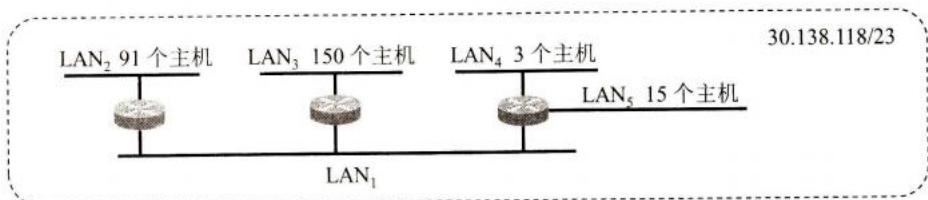
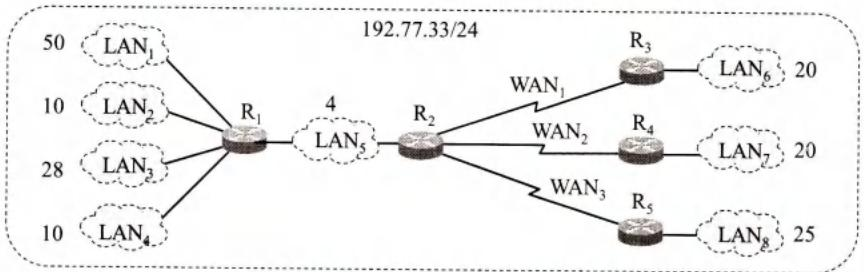
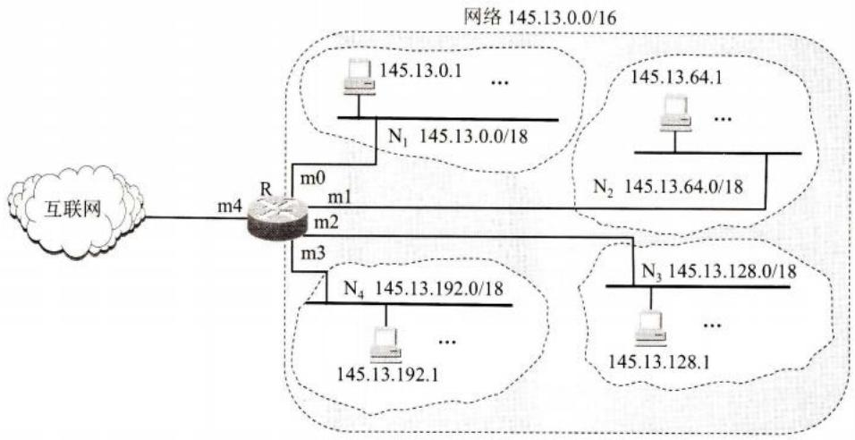

# 习题-第4章 网络层

## 基本信息
- **课程**：计算机网络
- **章节**：第4章 网络层
- **日期**：2026-06-04
- **标签**：#网络层 #习题 #IP地址 #路由选择

---

## 作业题目列表

> 📋 **作业要求**：4，13，16，17，18*，19，20*，22，23，25，26*，27-30，31*，32，33*，34，35，37，43-48，49*，51，57*
> 
> （其中，27-30表示：27、28、29、30。43-48中的"-"含义相同。带*号为重点题目）

---

## 题目详情

### 4-04 试简单说明下列协议的作用
**IP, ARP 和 ICMP**

#### 💡 解答

**IP（网际协议）**
- **作用**：IP是TCP/IP体系中最主要的协议之一，负责将数据报从源主机传送到目的主机
- **主要功能**：
  - 寻址：使用IP地址标识网络中的主机和路由器
  - 路由选择：决定数据报从源到目的的路径
  - 分片与重组：当数据报超过网络MTU时进行分片，在目的主机重组
- **特点**：IP提供无连接、不可靠的数据报传输服务

**ARP（地址解析协议）**
- **作用**：将IP地址解析为对应的MAC地址（物理地址）
- **工作原理**：
  - 主机在本地网络广播ARP请求，询问某个IP地址对应的MAC地址
  - 拥有该IP地址的主机响应ARP响应，返回自己的MAC地址
  - 请求主机将IP-MAC映射存入ARP高速缓存，减少后续广播
- **应用场景**：在同一局域网内，主机或路由器需要将IP数据报封装成MAC帧时，必须使用ARP获取目的MAC地址

**ICMP（网际控制报文协议）**
- **作用**：用于在IP主机、路由器之间传递控制消息和差错报告
- **主要功能**：
  - 差错报告：报告IP数据报传输中的错误（如目的不可达、超时等）
  - 诊断测试：ping命令使用ICMP回送请求/应答报文测试网络连通性
  - 状态查询：如ICMP时间戳请求/应答
- **常见报文类型**：
  - 回送请求/应答（类型8/0）：用于ping测试
  - 目的不可达（类型3）：网络、主机、端口不可达等
  - 超时（类型11）：TTL耗尽或分片重组超时
  - 重定向（类型5）：路由器向主机报告更优路由

#### 📌 三者关系
```
应用层
  ↓
运输层（TCP/UDP）
  ↓
网络层 ──→ IP（核心协议）
  ↑        ↑
 ICMP     ARP（辅助协议）
```

---

### 4-13 什么是最大传送单元MTU？
它和IP数据报首部中的哪个字段有关系？

#### 💡 解答

**MTU（Maximum Transfer Unit，最大传送单元）**

**定义**：MTU是指一个网络或链路层协议能够传输的最大数据帧的数据部分长度（不包括帧首部和尾部）。

**与IP数据报的关系**：
- 当IP数据报的长度超过所经过网络的MTU时，需要进行**分片（Fragmentation）**
- 分片后的每个片段都成为一个独立的IP数据报，各自独立路由到目的主机
- 在目的主机上进行重组（Reassembly）

**与IP数据报首部字段的关系**：

MTU与IP数据报首部中的以下**四个字段**密切相关：

| 字段 | 长度 | 作用 |
|------|------|------|
| **总长度** | 16位 | 指明整个IP数据报（首部+数据）的总字节数，最大65535字节 |
| **标识** | 16位 | 同一数据报的所有分片具有相同的标识值，用于重组时识别 |
| **标志** | 3位 | 第1位保留；第2位DF=1禁止分片；第3位MF=1表示后面还有分片 |
| **片偏移** | 13位 | 指明该分片在原数据报中的相对位置，以8字节为单位 |

**MTU的典型值**：
- 以太网：1500字节
- PPPoE：1492字节
- IEEE 802.3：1492字节
- FDDI：4352字节

**分片计算示例**：
```
原始IP数据报：总长度 = 4000字节，首部 = 20字节，数据 = 3980字节
经过网络MTU = 1500字节

每个分片最大数据长度 = 1500 - 20 = 1480字节（必须是8的倍数）
实际每片数据 = 1480字节

分片结果：
- 第1片：数据1480字节，片偏移=0，MF=1
- 第2片：数据1480字节，片偏移=185（1480/8），MF=1
- 第3片：数据1020字节，片偏移=370（2960/8），MF=0
```

---

### 4-16 ARP高速缓存相关问题
(1) 试解释为什么ARP高速缓存每存入一个项目就要设置 $10 \sim 20$ 分钟的超时计时器。这个时间设置得太大或太小会出现什么问题？

(2) 举出至少两种不需要发送 ARP 请求分组的情况（即不需要请求将某个目的 IP 地址解析为相应的 MAC 地址）。

#### 💡 解答

**(1) ARP高速缓存超时计时器的作用及时间设置问题**

**为什么需要设置超时计时器：**
- ARP高速缓存中存储的是IP地址与MAC地址的映射关系
- 网络中的主机可能会更换网卡（MAC地址改变），或主机从一个网络移动到另一个网络（IP地址改变）
- 如果映射关系永久保存，当目标主机的地址发生变化时，源主机仍使用旧的映射，会导致通信失败
- 超时机制确保缓存中的映射关系保持"新鲜"，及时淘汰过期条目

**时间设置太大的问题：**
- 如果目标主机的MAC地址或IP地址发生变化，源主机在超时前会一直使用错误的映射
- 导致向错误的目的MAC地址发送数据帧，通信失败
- 网络拓扑变化后，ARP缓存不能及时适应，影响网络连通性

**时间设置太小的问题：**
- 频繁淘汰缓存条目，导致ARP请求广播增多
- 增加网络流量负担，降低网络效率
- 增加主机处理ARP请求的开销
- 频繁广播会造成网络拥塞，尤其在大型网络中影响更明显

**(2) 不需要发送ARP请求分组的两种情况**

**情况一：目的IP地址与源主机在同一局域网内，且ARP高速缓存中已有该IP-MAC映射**
- 源主机先查ARP高速缓存
- 若找到对应的MAC地址，直接封装MAC帧发送，无需广播ARP请求

**情况二：目的IP地址与源主机不在同一局域网，但ARP高速缓存中已有默认网关的MAC地址**
- 跨网络通信时，数据报需发送给默认网关（路由器）
- 若缓存中已有网关IP-MAC映射，直接发送给网关
- 无需再次ARP请求网关的MAC地址

**其他可能的情况：**
- **情况三**：目的IP地址是广播地址（如255.255.255.255）或多播地址，使用广播/多播MAC地址直接发送
- **情况四**：源主机正在处理来自目标主机的数据报（刚刚通信过），ARP缓存中已有该映射

---

### 4-17 ARP使用次数问题
主机A发送IP数据报给主机B，途中经过了5个路由器。试问在IP数据报的发送过程中总共使用了几次ARP？

#### 💡 解答

**答案：共使用 6 次 ARP**

**分析过程：**

```
主机A → R1 → R2 → R3 → R4 → R5 → 主机B
  ↑     ↑     ↑     ↑     ↑     ↑     ↑
  |     |     |     |     |     |     |
 ARP1  ARP2  ARP3  ARP4  ARP5  ARP6  (不需要ARP)
```

**详细说明：**

| 步骤 | 发送方 | 目的 | ARP用途 | 获取的MAC地址 |
|:----:|:------:|:----:|:--------|:--------------|
| 1 | 主机A | R1 | 主机A需要知道下一跳R1的MAC地址 | R1的MAC地址 |
| 2 | R1 | R2 | R1需要知道下一跳R2的MAC地址 | R2的MAC地址 |
| 3 | R2 | R3 | R2需要知道下一跳R3的MAC地址 | R3的MAC地址 |
| 4 | R3 | R4 | R3需要知道下一跳R4的MAC地址 | R4的MAC地址 |
| 5 | R4 | R5 | R4需要知道下一跳R5的MAC地址 | R5的MAC地址 |
| 6 | R5 | 主机B | R5需要知道目的主机B的MAC地址 | 主机B的MAC地址 |

**关键理解：**

1. **每经过一个网段需要使用一次ARP**
   - 数据报从主机A到主机B共经过6个网段（7个节点，6条链路）
   - 每个网段独立进行IP到MAC的地址解析

2. **为什么不是只用1次ARP？**
   - ARP只能在**同一局域网**内解析IP-MAC映射
   - 跨网段时，IP数据报被封装在新的MAC帧中，目的MAC地址是下一跳路由器的MAC地址
   - 每到一个新网段，都需要重新封装MAC帧，因此需要重新获取下一跳的MAC地址

3. **路由器转发时的地址变化：**

| 网段 | 源MAC | 目的MAC | 源IP | 目的IP |
|:----:|:------|:--------|:-----|:-------|
| A→R1 | 主机A | R1 | 主机A | 主机B |
| R1→R2 | R1 | R2 | 主机A | 主机B |
| R2→R3 | R2 | R3 | 主机A | 主机B |
| ... | ... | ... | ... | ... |
| R5→B | R5 | 主机B | 主机A | 主机B |

**注意：** IP数据报首部中的源IP和目的IP始终不变，但MAC帧首部的源MAC和目的MAC每经过一个网段都会改变。

---

### ⭐ 4-18 路由器转发表计算
设某路由器建立了如下转发表：

| 前缀匹配 | 下一跳 |
|---------|--------|
| 192.4.153.0/26 | R₃ |
| 128.96.39.0/25 | 接口 m0 |
| 128.96.39.128/25 | 接口 m1 |
| 128.96.40.0/25 | R₂ |
| 192.4.153.0/26 | R₃ |
| *（默认） | R₄ |

现共收到5个分组，其目的地址分别为：
1. 128.96.39.10
2. 128.96.40.12
3. 128.96.40.151
4. 192.4.153.17
5. 192.4.153.90

试分别计算其下一跳。

#### 💡 解答

**最长前缀匹配原则**：当多个前缀都能匹配目的地址时，选择前缀长度最长的那个。

---

**分组(1)：目的地址 128.96.39.10**

| 前缀匹配 | 网络地址 | 是否匹配 |
|---------|---------|:--------:|
| 128.96.39.0/25 | 128.96.39.0 ~ 128.96.39.127 | ✅ 匹配（前缀长度25） |
| 128.96.39.128/25 | 128.96.39.128 ~ 128.96.39.255 | ❌ 不匹配 |
| 128.96.40.0/25 | 128.96.40.0 ~ 128.96.40.127 | ❌ 不匹配 |
| 192.4.153.0/26 | - | ❌ 不匹配 |

**判断**：128.96.39.10 的二进制第4字节为 00001010（10），前25位与128.96.39.0/25匹配。

**下一跳：接口 m0**

---

**分组(2)：目的地址 128.96.40.12**

| 前缀匹配 | 网络地址 | 是否匹配 |
|---------|---------|:--------:|
| 128.96.39.0/25 | 128.96.39.0 ~ 128.96.39.127 | ❌ 不匹配 |
| 128.96.39.128/25 | 128.96.39.128 ~ 128.96.39.255 | ❌ 不匹配 |
| 128.96.40.0/25 | 128.96.40.0 ~ 128.96.40.127 | ✅ 匹配（前缀长度25） |
| 192.4.153.0/26 | - | ❌ 不匹配 |

**判断**：128.96.40.12 的二进制第3字节为40，与128.96.40.0/25匹配。

**下一跳：R₂**

---

**分组(3)：目的地址 128.96.40.151**

| 前缀匹配 | 网络地址 | 是否匹配 |
|---------|---------|:--------:|
| 128.96.39.0/25 | - | ❌ 不匹配 |
| 128.96.39.128/25 | - | ❌ 不匹配 |
| 128.96.40.0/25 | 128.96.40.0 ~ 128.96.40.127 | ❌ 不匹配（151 > 127） |
| 192.4.153.0/26 | - | ❌ 不匹配 |

**判断**：128.96.40.151 的第4字节151（10010111）> 127，不在128.96.40.0/25范围内。

**下一跳：R₄（默认路由）**

---

**分组(4)：目的地址 192.4.153.17**

| 前缀匹配 | 网络地址 | 是否匹配 |
|---------|---------|:--------:|
| 192.4.153.0/26 | 192.4.153.0 ~ 192.4.153.63 | ✅ 匹配（前缀长度26） |
| 其他 | - | ❌ 不匹配 |

**判断**：192.4.153.17 的第4字节17 < 64，在192.4.153.0/26范围内。

**下一跳：R₃**

---

**分组(5)：目的地址 192.4.153.90**

| 前缀匹配 | 网络地址 | 是否匹配 |
|---------|---------|:--------:|
| 192.4.153.0/26 | 192.4.153.0 ~ 192.4.153.63 | ❌ 不匹配（90 > 63） |
| 其他 | - | ❌ 不匹配 |

**判断**：192.4.153.90 的第4字节90 > 63，不在192.4.153.0/26范围内。

**下一跳：R₄（默认路由）**

---

#### 📋 答案汇总

| 分组 | 目的地址 | 下一跳 |
|:----:|:---------|:-------|
| 1 | 128.96.39.10 | **接口 m0** |
| 2 | 128.96.40.12 | **R₂** |
| 3 | 128.96.40.151 | **R₄（默认）** |
| 4 | 192.4.153.17 | **R₃** |
| 5 | 192.4.153.90 | **R₄（默认）** |

---

### 4-19 地址块分配问题
某单位分配到一个地址块 129.250/16。该单位有 4000 台机器，平均分布在 16 个不同的地点。试给每一个地点分配一个地址块，并算出每个地址块中 IP 地址的最小值和最大值。

#### 💡 解答

**已知条件分析：**
- 总地址块：129.250.0.0/16（共 2^16 = 65536 个地址）
- 总主机数：4000 台
- 分布地点：16 个
- 每个地点主机数：4000 ÷ 16 = 250 台

**地址块分配计算：**

每个地点需要 250 台主机，考虑预留（网络地址、广播地址、路由器等），实际需要 256 个地址（2^8）。

- 每个地点需要：256 个地址 = /24 地址块
- 主机号位数：8 位（2^8 = 256）
- 网络前缀：32 - 8 = 24 位

**分配方案：**

将 129.250.0.0/16 划分为 16 个 /24 子网：

| 地点 | 地址块 | 最小地址 | 最大地址 | 可用主机数 |
|:----:|:-------|:---------|:---------|:----------:|
| 地点1 | 129.250.0.0/24 | 129.250.0.1 | 129.250.0.254 | 254 |
| 地点2 | 129.250.1.0/24 | 129.250.1.1 | 129.250.1.254 | 254 |
| 地点3 | 129.250.2.0/24 | 129.250.2.1 | 129.250.2.254 | 254 |
| 地点4 | 129.250.3.0/24 | 129.250.3.1 | 129.250.3.254 | 254 |
| 地点5 | 129.250.4.0/24 | 129.250.4.1 | 129.250.4.254 | 254 |
| 地点6 | 129.250.5.0/24 | 129.250.5.1 | 129.250.5.254 | 254 |
| 地点7 | 129.250.6.0/24 | 129.250.6.1 | 129.250.6.254 | 254 |
| 地点8 | 129.250.7.0/24 | 129.250.7.1 | 129.250.7.254 | 254 |
| 地点9 | 129.250.8.0/24 | 129.250.8.1 | 129.250.8.254 | 254 |
| 地点10 | 129.250.9.0/24 | 129.250.9.1 | 129.250.9.254 | 254 |
| 地点11 | 129.250.10.0/24 | 129.250.10.1 | 129.250.10.254 | 254 |
| 地点12 | 129.250.11.0/24 | 129.250.11.1 | 129.250.11.254 | 254 |
| 地点13 | 129.250.12.0/24 | 129.250.12.1 | 129.250.12.254 | 254 |
| 地点14 | 129.250.13.0/24 | 129.250.13.1 | 129.250.13.254 | 254 |
| 地点15 | 129.250.14.0/24 | 129.250.14.1 | 129.250.14.254 | 254 |
| 地点16 | 129.250.15.0/24 | 129.250.15.1 | 129.250.15.254 | 254 |

**验证：**
- 每个 /24 地址块可用主机数：2^8 - 2 = 254 台（减去网络地址和广播地址）
- 254 > 250，满足每个地点的需求
- 总共使用地址：16 × 256 = 4096 个
- 剩余地址：65536 - 4096 = 61440 个（可用于未来扩展）

---

### ⭐ 4-20 IP数据报分片问题
一个数据报长度为4000字节（固定首部长度）。现在经过一个网络传送，但此网络能够传送的最大数据长度为1500字节。试问应当划分为几个短些的数据报片？各数据报片的数据字段长度、片偏移字段和MF标志应为何数值？

#### 💡 解答

**已知条件分析：**
- 原始数据报总长度：4000字节
- IP首部长度：20字节（固定）
- 原始数据长度：4000 - 20 = **3980字节**
- 网络MTU：1500字节（最大传送单元）

**分片计算：**

每个分片也需要包含IP首部（20字节），所以：
- 每个分片最大数据长度 = 1500 - 20 = **1480字节**

**注意**：片偏移字段以8字节为单位，所以每个分片的数据长度必须是8的倍数。
- 1480 ÷ 8 = 185，正好是整数，满足条件！

**所需分片数：**
- 3980 ÷ 1480 = 2.69...，向上取整 = **3个分片**

**各分片参数计算：**

| 分片 | 数据长度 | 片偏移计算 | 片偏移 | MF标志 | 总长度 |
|:----:|:--------:|:----------:|:------:|:------:|:------:|
| 第1片 | 1480字节 | 0 ÷ 8 | **0** | **1** | 1500字节 |
| 第2片 | 1480字节 | 1480 ÷ 8 | **185** | **1** | 1500字节 |
| 第3片 | 1020字节 | 2960 ÷ 8 | **370** | **0** | 1040字节 |

**验证：**
- 数据总和：1480 + 1480 + 1020 = **3980字节** ✓
- 与原始数据长度一致

**MF标志说明：**
- MF = 1（More Fragments）：表示后面还有分片
- MF = 0：表示这是最后一个分片

**片偏移说明：**
- 片偏移字段占13位，以8字节为单位
- 表示该分片在原始数据报中的相对位置

#### 📋 答案汇总

| 参数 | 数值 |
|:----:|:-----|
| **分片数量** | **3个** |
| 第1片数据字段长度 | **1480字节** |
| 第1片片偏移 | **0** |
| 第1片MF标志 | **1** |
| 第2片数据字段长度 | **1480字节** |
| 第2片片偏移 | **185** |
| 第2片MF标志 | **1** |
| 第3片数据字段长度 | **1020字节** |
| 第3片片偏移 | **370** |
| 第3片MF标志 | **0** |

---

### 4-22 地址聚合问题
有如下的4个/24地址块，试进行最大可能的聚合。
- 212.56.132.0/24
- 212.56.133.0/24
- 212.56.134.0/24
- 212.56.135.0/24

#### 💡 解答

**聚合后地址块：212.56.132.0/22**

**计算过程：**

```
212.56.132.0 = 11010100.00111000.10000100.00000000
212.56.133.0 = 11010100.00111000.10000101.00000000
212.56.134.0 = 11010100.00111000.10000110.00000000
212.56.135.0 = 11010100.00111000.10000111.00000000
                ↑_____________________↑
                   前22位相同
```

- 前两个字节（212.56）：16位相同
- 第三字节的前6位（100001）：6位相同
- 共16+6 = **22位共同前缀**

---

### 4-23 CIDR地址块包含关系
有两个CIDR地址块208.128/11和208.130.28/22。是否有哪一个地址块包含了另一个的地址？如果有，请指出，并说明理由。

#### 💡 解答

**208.128/11 包含 208.130.28/22**

**理由**：
- 208.128/11 的前11位：`11010000 100`
- 208.130.28/22 的前22位：`11010000 10000010 000111`
- 小地址块的前11位与大地址块完全一致，因此完全被包含

#### 📋 答案汇总

| 地址块 | 前缀长度 | 地址范围 |
|:-------|:--------:|:---------|
| 208.128/11 | 11位 | 208.128.0.0 ~ 208.159.255.255 |
| 208.130.28/22 | 22位 | 208.130.28.0 ~ 208.130.31.255 |

**结论**：**208.128/11 包含 208.130.28/22**

---

### 4-25 局域网地址块分配
一个自治系统分配到的 IP 地址块为 30.138.118/23，并包含有 5 个局域网，其连接图如图 4-77 所示，每个局域网上的主机数分别标注在图上。试给出每一个局域网的地址块（包括前缀）。



> 📚 **课本出处**：图4-77 习题4-25的网络拓扑图

#### 💡 解答

| 局域网 | 主机数 | 所需地址数 | 地址块 | 可用地址范围 |
|:------:|:------:|:----------:|:-------|:-------------|
| LAN₃ | 150 | 256 | **30.138.118.0/24** | 30.138.118.0 ~ 30.138.118.255 |
| LAN₂ | 91 | 128 | **30.138.119.0/25** | 30.138.119.0 ~ 30.138.119.127 |
| LAN₅ | 15 | 32 | **30.138.119.128/27** | 30.138.119.128 ~ 30.138.119.159 |
| LAN₄ | 3 | 8 | **30.138.119.160/29** | 30.138.119.160 ~ 30.138.119.167 |
| LAN₁ | 3(路由器) | 8 | **30.138.119.168/29** | 30.138.119.168 ~ 30.138.119.175 |

---

### ⭐ 4-26 大公司网络地址分配
一个大公司有一个总部和三个下属部门。公司分配到的网络前缀是192.77.33/24。公司的网络布局如图4-78所示。总部共有5个局域网，其中的 LAN₁~LAN₄ 都连接到路由器 R₁ 上，R₁ 再通过 LAN₅ 与路由器 R₂ 相连。R₂ 和远地的三个部门的局域网 LAN₆~LAN₈ 通过广域网相连。每一个局域网旁边标明的数字是局域网上的主机数。试给每一个局域网分配一个合适的网络前缀。



> 📚 **课本出处**：图4-78 习题4-26的公司网络拓扑图

#### 💡 解答

| 局域网 | 主机数 | 网络前缀 |
|:------:|:------:|:---------|
| LAN₁ | 50 | **192.77.33.0/26** |
| LAN₂ | 10 | **192.77.33.192/28** |
| LAN₃ | 28 | **192.77.33.64/27** |
| LAN₄ | 10 | **192.77.33.208/28** |
| LAN₅ | 4 | **192.77.33.224/29** |
| LAN₆ | 20 | **192.77.33.96/27** |
| LAN₇ | 20 | **192.77.33.128/27** |
| LAN₈ | 25 | **192.77.33.160/27** |

---

### 4-27 地址匹配问题
以下地址中的哪一个和86.32/12匹配？请说明理由。
1. 86.33.224.123
2. 86.79.65.216
3. 86.58.119.74
4. 86.68.206.154

#### 💡 解答

**答案：1. 86.33.224.123**

**理由：** 86.32/12 的前12位为 `01010110 0010`

| 选项 | 前12位 | 是否匹配 |
|:----:|:------:|:--------:|
| 86.33.224.123 | 01010110 0010 | ✅ 匹配 |
| 86.79.65.216 | 01010110 0100 | ❌ 不匹配 |
| 86.58.119.74 | 01010110 0011 | ❌ 不匹配 |
| 86.68.206.154 | 01010110 0100 | ❌ 不匹配 |

---

### 4-28 地址前缀匹配问题
以下的地址前缀中的哪一个地址与2.52.90.140匹配？请说明理由。
1. 0/4
2. 32/4
3. 4/6
4. 80/4

#### 💡 解答

**答案：1. 0/4**

| 选项 | 网络地址 | 与运算结果 | 是否匹配 |
|:----:|:--------:|:----------:|:--------:|
| 0/4 | 0.0.0.0 | 0.0.0.0 | ✅ 匹配 |
| 32/4 | 32.0.0.0 | 0.0.0.0 | ❌ 不匹配 |
| 4/6 | 4.0.0.0 | 0.0.0.0 | ❌ 不匹配 |
| 80/4 | 80.0.0.0 | 0.0.0.0 | ❌ 不匹配 |

---

### 4-29 前缀匹配问题
下面的前缀中的哪一个和地址152.7.77.159及152.31.47.252都匹配？请说明理由。
1. 152.40/13
2. 153.40/9
3. 152.64/12
4. 152.0/11

#### 💡 解答

**答案：4. 152.0/11**

**验证：** 152.0/11 地址范围 152.0.0.0 ~ 152.31.255.255

| 地址 | 第2字节 | 前3位 | 是否在范围内 |
|:----:|:-------:|:-----:|:------------:|
| 152.7.77.159 | 7 = 00000111 | 000 | ✅ 是 |
| 152.31.47.252 | 31 = 00011111 | 000 | ✅ 是 |

---

### 4-30 掩码对应前缀长度
与下列掩码相对应的网络前缀各有多少位？
1. 192.0.0.0
2. 240.0.0.0
3. 255.224.0.0
4. 255.255.255.252

#### 💡 解答

| 掩码 | 二进制 | 前缀长度 |
|:----:|:-------|:--------:|
| 192.0.0.0 | 11000000 | **/2** |
| 240.0.0.0 | 11110000 | **/4** |
| 255.224.0.0 | 11111111.11100000 | **/11** |
| 255.255.255.252 | 11111111.11111111.11111111.11111100 | **/30** |

---

### ⭐ 4-31 地址块计算问题
已知地址块中的一个地址是 140.120.84.24/20。试求这个地址块中的最小地址和最大地址。地址掩码是什么？地址块中共有多少个地址？相当于多少个 C 类地址？

#### 💡 解答

**140.120.84.24/20 分析：**

- 地址掩码：/20 → **255.255.240.0**
- 最小地址（主机号全0）：**140.120.80.0**
- 最大地址（主机号全1）：**140.120.95.255**
- 地址数：2^(32-20) = 2^12 = **4096 个**
- 相当于 C 类地址：4096 ÷ 256 = **16 个**

#### 📋 答案汇总

| 项目 | 答案 |
|:-----|:-----|
| 地址掩码 | **255.255.240.0** |
| 最小地址 | **140.120.80.0** |
| 最大地址 | **140.120.95.255** |
| 地址总数 | **4096 个** |
| 相当于C类地址数 | **16 个** |

---

### 4-32 地址块计算问题
已知地址块中的一个地址是190.87.140.202/29。重新计算上题。

#### 💡 解答

**190.87.140.202/29 分析：**

- 地址掩码：/29 → **255.255.255.248**
- 最小地址（主机号全0）：**190.87.140.200**
- 最大地址（主机号全1）：**190.87.140.207**
- 地址数：2^(32-29) = 2^3 = **8 个**
- 相当于 C 类地址：8 ÷ 256 = **1/32 个**

#### 📋 答案汇总

| 项目 | 答案 |
|:-----|:-----|
| 地址掩码 | **255.255.255.248** |
| 最小地址 | **190.87.140.200** |
| 最大地址 | **190.87.140.207** |
| 地址总数 | **8 个** |
| 相当于 C 类地址数 | **1/32 个** |

---

### ⭐ 4-33 子网划分问题
某单位分配到一个地址块 136.23.12.64/26。现在需要进一步划分为 4 个一样大的子网。试问：
1. 每个子网的网络前缀有多长？
2. 每一个子网中有多少个地址？
3. 每一个子网的地址块是什么？
4. 每一个子网可分配给主机使用的最小地址和最大地址是什么？

#### 💡 解答

**原始地址块分析：** 136.23.12.64/26
- 网络前缀：26 位
- 主机号：6 位
- 总地址数：2^6 = **64 个**（范围 136.23.12.64 ~ 136.23.12.127）

**划分子网：** 要分 4 个一样大的子网，需从主机号借用 2 位（2^2 = 4）

**(1) 每个子网的网络前缀：** 26 + 2 = **/28**

**(2) 每个子网的地址数：** 2^(32-28) = 2^4 = **16 个**

**(3) 地址块与可用地址：**

| 子网 | 地址块 | 最小可用地址 | 最大可用地址 | 可用主机数 |
|:----:|:-------|:------------|:------------|:----------:|
| 子网1 | **136.23.12.64/28** | 136.23.12.65 | 136.23.12.78 | 14 |
| 子网2 | **136.23.12.80/28** | 136.23.12.81 | 136.23.12.94 | 14 |
| 子网3 | **136.23.12.96/28** | 136.23.12.97 | 136.23.12.110 | 14 |
| 子网4 | **136.23.12.112/28** | 136.23.12.113 | 136.23.12.126 | 14 |

**验证：** 4 × 16 = 64 ✓ 与原地址块大小一致

#### 📋 答案汇总

| 问题 | 答案 |
|:-----|:-----|
| 每个子网前缀长度 | **/28** |
| 每个子网地址数 | **16 个** |
| 子网1地址块 | **136.23.12.64/28** |
| 子网2地址块 | **136.23.12.80/28** |
| 子网3地址块 | **136.23.12.96/28** |
| 子网4地址块 | **136.23.12.112/28** |

---

### 4-34 IGP和EGP的区别
IGP和EGP这两类协议的主要区别是什么？

#### 💡 解答

**IGP（内部网关协议，Interior Gateway Protocol）** 和 **EGP（外部网关协议，External Gateway Protocol）** 的核心区别在于**作用范围**和**路由策略**不同。

| 对比维度 | IGP（内部网关协议） | EGP（外部网关协议） |
|:--------:|:-------------------|:-------------------|
| **作用范围** | 在一个 **自治系统 AS 内部** 的路由选择 | **不同自治系统 AS 之间** 的路由选择 |
| **路由目标** | 寻找 AS 内部**最优**路由（最短距离/最小代价） | 找出一条**较好**的路由（不一定最优，但不能兜圈子） |
| **路由策略** | 只考虑技术因素（距离、带宽、时延等） | 需考虑**策略因素**（经济、安全、商业关系等） |
| **典型协议** | **RIP**（距离向量）、**OSPF**（链路状态） | **BGP-4**（路径向量协议） |
| **传输层依赖** | RIP 使用 UDP，OSPF 使用 IP | BGP 使用 TCP（可靠传输） |
| **路由算法** | 距离向量算法或链路状态算法 | 路径向量算法 |

> 📚 **出处**：第4章 4.6.1节"内部网关协议与外部网关协议"

### 4-35 RIP、OSPF和BGP特点
试简述RIP、OSPF和BGP路由选择协议的主要特点。

#### 💡 解答

| 特性 | **RIP** | **OSPF** | **BGP-4** |
|:----:|:--------|:---------|:----------|
| **协议类别** | 内部网关协议 IGP | 内部网关协议 IGP | 外部网关协议 EGP |
| **路由算法** | **距离向量** | **链路状态** | **路径向量** |
| **度量标准** | 跳数（最多 **15 跳**） | 费用、距离、时延、带宽等 | AS 路径长度 + 策略因素 |
| **信息交换** | 仅与**相邻路由器**交换 | 向本 AS 中**所有路由器**发送（洪泛法） | 仅与 **BGP 对等体** 交换 |
| **交换内容** | 整个路由表 | 本路由器相邻的**链路状态** | 到达目的网络的 **AS 路径** |
| **交换时机** | **周期性**（每 30 秒） | 链路状态**变化时**或每 30 分钟 | 路由**变化时**发送更新 |
| **传输层** | **UDP**（端口 520） | **IP**（协议号 89） | **TCP**（端口 179） |
| **适用范围** | **小型互联网** | **大型 AS 内部** | **AS 之间**（全球互联网） |
| **路由目标** | 寻找**最短**路径 | 寻找**最优**路径 | 寻找**较好**路径（不能兜圈子） |
| **是否考虑策略** | ❌ 否 | ❌ 否 | ✅ 是（政治、经济、安全等） |

> 📚 **出处**：第4章 4.6.2节~4.6.4节

### 4-37 RIP路由表更新问题
假定网络中的路由器B的路由表有如下的项目（这三列分别表示"目的网络""距离"和"下一跳路由器"）：

| 目的网络 | 距离 | 下一跳路由器 |
|---------|------|-------------|
| N1 | 7 | A |
| N2 | 2 | C |
| N6 | 8 | F |
| N8 | 4 | E |
| N9 | 4 | F |

现在B收到从C发来的路由信息（这两列分别表示"目的网络"和"距离"）：

| 目的网络 | 距离 |
|---------|------|
| N2 | 4 |
| N3 | 8 |
| N6 | 4 |
| N8 | 3 |
| N9 | 5 |

试求出路由器B更新后的路由表（详细说明每一个步骤）。

#### 💡 解答

**RIP 距离向量算法规则**（课本 4.6.2 节）：
1. 将收到的报文距离**+1**，下一跳设为发送者
2. 逐条比较原路由表：
   - **不存在该网络** → 直接添加
   - **下一跳相同** → 替换（以最新消息为准）
   - **下一跳不同** → 仅新距离更短时才更新

**Step 1：修改 C 发来的报文（距离 +1，下一跳 → C）**

| 目的网络 | 原距离 | 新距离 | 下一跳 |
|:-------:|:------:|:------:|:------:|
| N2 | 4 | **5** | **C** |
| N3 | 8 | **9** | **C** |
| N6 | 4 | **5** | **C** |
| N8 | 3 | **4** | **C** |
| N9 | 5 | **6** | **C** |

**Step 2：逐条比较**

| 网络 | 原路由表 | 更新报文 | 应用规则 | 结果 |
|:----:|:---------|:---------|:---------|:----|
| **N2** | 距离 2，下一跳 **C** | 距离 5，下一跳 C | 下一跳相同 → 替换 | → N2, **5**, C |
| **N3** | ❌ 不存在 | 距离 9，下一跳 C | 不存在 → 添加 | → N3, **9**, C |
| **N6** | 距离 8，下一跳 F | 距离 5，下一跳 C | 下一跳不同且 5 < 8 → 更新 | → N6, **5**, C |
| **N8** | 距离 4，下一跳 E | 距离 4，下一跳 C | 下一跳不同但 4 = 4，不更短 → 不变 | → N8, **4**, E |
| **N9** | 距离 4，下一跳 F | 距离 6，下一跳 C | 6 > 4，不更短 → 不变 | → N9, **4**, F |

**Step 3：更新后的 B 路由表**

| 目的网络 | 距离 | 下一跳路由器 |
|:-------:|:----:|:----------:|
| N1 | 7 | A |
| N2 | **5** | **C** |
| N3 | **9** | **C** |
| N6 | **5** | **C** |
| N8 | 4 | E |
| N9 | 4 | F |

---

### 4-43 IPv4地址转换
试把下列IPv4地址从二进制记法转换为点分十进制记法。
1. 1000000100001011000010111101111
2. 11000001 10000011 00011011 11111111
3. 11100111 11011011 10001011 01101111
4. 11111001 10011011 11111011 00001111

#### 💡 解答

| # | 二进制（分4组） | 点分十进制 |
|:-:|:---------------|:----------:|
| 1 | `10000001.00001011.00001011.11101111` | **129.11.11.239** |
| 2 | `11000001.10000011.00011011.11111111` | **193.131.27.255** |
| 3 | `11100111.11011011.10001011.01101111` | **231.219.139.111** |
| 4 | `11111001.10011011.11111011.00001111` | **249.155.251.15** |

**二进制→十进制快速转换：**

| 二进制位权 | 128 | 64 | 32 | 16 | 8 | 4 | 2 | 1 |
|:----------:|:---:|:--:|:--:|:--:|:-:|:-:|:-:|:-:|

以第(2)题为例：
- `11000001` = 128+64+1 = **193**
- `10000011` = 128+2+1 = **131**
- `00011011` = 16+8+2+1 = **27**
- `11111111` = 255

> 📚 **出处**：第4章 复习与习题

### 4-44 地址段计算
假设一段地址的首地址为146.102.29.0，末地址为146.102.32.255，求这个地址段的地址数。

#### 💡 解答

**答案：1024 个地址**

**计算过程：**

| 第3字节 | 地址范围 | 地址数 |
|:------:|:---------|:-----:|
| 29 | 146.102.29.0 ~ 146.102.29.255 | 256 |
| 30 | 146.102.30.0 ~ 146.102.30.255 | 256 |
| 31 | 146.102.31.0 ~ 146.102.31.255 | 256 |
| 32 | 146.102.32.0 ~ 146.102.32.255 | 256 |
| | **合计** | **1024** |

地址数 = (32 × 256 + 255) - (29 × 256 + 0) + 1 = 8447 - 7424 + 1 = **1024**

### 4-45 网络参数计算
已知一/27 网络中有一个地址是 167.199.170.82，问这个网络的网络掩码、网络前缀长度和网络后缀长度是多少？

#### 💡 解答

| 参数 | 答案 |
|:----|:-----|
| **网络掩码** | **255.255.255.224**（11111111.11111111.11111111.11100000） |
| **网络前缀长度** | **/27** |
| **网络后缀长度** | **5**（32 − 27 = 5 位主机号） |

### 4-46 地址块计算
已知条件同上题，试求这个地址块的地址数、首地址以及末地址各是多少？

#### 💡 解答

由 4-45 已知：167.199.170.82/27

- 网络掩码：255.255.224 → 最后一字节 `111**00000**`
- 82 = `0101**0010**` → 主机号全 0 得 `010**00000**` = **64**

| 项目 | 答案 |
|:----|:-----|
| **地址数** | 2^(32-27) = **32 个** |
| **首地址**（网络地址） | **167.199.170.64** |
| **末地址**（广播地址） | **167.199.170.95** |

---

### 4-47 子网分配方案
某单位分配到一个地址块 14.24.74.0/24。该单位需要用到三个子网，对这三个子地址块的具体要求是：子网 N₁ 需要 120 个地址，子网 N₂ 需要 60 个地址，子网 N₃ 需要 10 个地址。请给出地址块的分配方案。

#### 💡 解答

**VLSM 分配**：按所需地址数从大到小分配。

| 子网 | 所需主机数 | 取整地址数 | 主机位 | 前缀 | 地址块 | 首地址 | 末地址 |
|:----:|:---------:|:----------:|:------:|:----:|:-------|:-------|:-------|
| N₁ | 120 | 128 (2⁷) | 7 | **/25** | **14.24.74.0/25** | 14.24.74.1 | 14.24.74.126 |
| N₂ | 60 | 64 (2⁶) | 6 | **/26** | **14.24.74.128/26** | 14.24.74.129 | 14.24.74.190 |
| N₃ | 10 | 16 (2⁴) | 4 | **/28** | **14.24.74.192/28** | 14.24.74.193 | 14.24.74.206 |

**分配示意图**：
```
14.24.74.0/24 (256 个地址)
├── N₁: 14.24.74.0/25   (128 个) ← 0 ~ 127
├── N₂: 14.24.74.128/26  (64 个)  ← 128 ~ 191
├── N₃: 14.24.74.192/28  (16 个)  ← 192 ~ 207
└── 剩余: 14.24.74.208/28 ~ /28 (48 个，可留作扩展)
```

---

### 4-48 路由表与分组转发
如图 4-80 所示，网络 145.13.0.0/16 划分为四个子网 N₁, N₂, N₃ 和 N₄。这四个子网与路由器 R 连接的接口分别是 m0, m1, m2 和 m3。路由器 R 的第五个接口 m4 连接到互联网。



> 📚 **课本出处**：图4-80 习题4-48的网络拓扑图

1. 试给出路由器 R 的路由表。
2. 路由器 R 收到一个分组，其目的地址是 145.13.160.78。试给出这个分组是怎样被转发的。

#### 💡 解答

**(1) 子网划分**

145.13.0.0/16 划分为四个等大的 /18 子网：

| 子网 | 地址块 | 地址范围 | 接口 |
|:----:|:-------|:---------|:----:|
| N₁ | **145.13.0.0/18** | 145.13.0.0 ~ 145.13.63.255 | m0 |
| N₂ | **145.13.64.0/18** | 145.13.64.0 ~ 145.13.127.255 | m1 |
| N₃ | **145.13.128.0/18** | 145.13.128.0 ~ 145.13.191.255 | m2 |
| N₄ | **145.13.192.0/18** | 145.13.192.0 ~ 145.13.255.255 | m3 |

**(1) 路由器 R 的路由表**

| 目的网络 | 下一跳 | 说明 |
|:---------|:-------|:----|
| 145.13.0.0/18 | **直接交付，接口 m0** | 直连 N₁ |
| 145.13.64.0/18 | **直接交付，接口 m1** | 直连 N₂ |
| 145.13.128.0/18 | **直接交付，接口 m2** | 直连 N₃ |
| 145.13.192.0/18 | **直接交付，接口 m3** | 直连 N₄ |
| 0.0.0.0/0 | **接口 m4（默认路由）** | 通往互联网 |

**(2) 分组转发：145.13.160.78**

160 的二进制：`10**100000**`，落在 128~191 范围内，匹配 **145.13.128.0/18**。

→ 路由器 R 将该分组从 **接口 m2** 直接交付给子网 N₃。

### ⭐ 4-49 最长前缀匹配问题
收到一个分组，其目的地址 D = 11.1.2.5。要查找的转发表中有这样三项：
- 路由1 到达网络 11.0.0.0/8
- 路由2 到达网络 11.1.0.0/16
- 路由3 到达网络 11.1.2.0/24

试问在转发这个分组时应当选择哪一个路由？

#### 💡 解答

**答案：选择路由3（11.1.2.0/24）**

**最长前缀匹配原则**：将目的地址与各路由的前缀逐位匹配，选择**前缀最长**的匹配项。

| 路由 | 网络前缀 | 前缀长度 | 11.1.2.5 是否匹配 |
|:----:|:---------|:--------:|:----------------:|
| 路由1 | 11.0.0.0/8 | 8 位 | ✅ |
| 路由2 | 11.1.0.0/16 | 16 位 | ✅ |
| 路由3 | 11.1.2.0/24 | 24 位 | ✅ |

三者都匹配，但路由3的前缀最长（24 > 16 > 8），因此选择**路由3**。

---

### ⭐ 4-51 CIDR地址块分析
已知一CIDR地址块为200.56.168.0/21。
1. 试用二进制形式表示这个地址块。
2. 这个CIDR地址块包括有多少个C类地址块？

#### 💡 解答

**(1) 二进制表示**

```
200      = 11001000
56       = 00111000
168      = 10101000
0        = 00000000

200.56.168.0/21 = 11001000.00111000.10101 000.00000000
                   ↑_________网络前缀_________↑ (21位)
```

前 21 位为网络前缀，后 11 位为主机号。

**(2) C 类地址块数**

C 类地址块大小为 /24（256 个地址）。

该 CIDR 地址块大小 = 2^(32-21) = 2^11 = **2048 个地址**

相当于 C 类地址块数 = 2048 ÷ 256 = **8 个**

> 也可直接看：/21 比 /24 短 3 位 → 2^3 = **8 个** /24 地址块。

---

### ⭐ 4-57 IPv6地址零压缩
试把以下的IPv6地址用零压缩方法写成简洁形式：
1. 0000:0000:0F53:6382:AB00:67DB:BB27:7332
2. 0000:0000:0000:0000:0000:0000:004D:ABCD
3. 0000:0000:0000:AF36:7328:0000:87AA:0398
4. 2819:00AF:0000:0000:0000:0035:0CB2:B271

#### 💡 解答

**零压缩规则**：
① 每组前导 0 可省略
② 最长的连续全 0 组可用 `::` 替代（仅一次）

| # | 原地址 | 零压缩后 |
|:-:|:-------|:---------|
| 1 | `0000:0000:0F53:6382:AB00:67DB:BB27:7332` | **::F53:6382:AB00:67DB:BB27:7332** |
| 2 | `0000:0000:0000:0000:0000:0000:004D:ABCD` | **::4D:ABCD** |
| 3 | `0000:0000:0000:AF36:7328:0000:87AA:0398` | **::AF36:7328:0:87AA:398** |
| 4 | `2819:00AF:0000:0000:0000:0035:0CB2:B271` | **2819:AF::35:CB2:B271** |

**逐题详解：**

**(1)** `0000:0000:0F53:6382:AB00:67DB:BB27:7332`
- 前两组全 0 → `::`；`0F53` → `F53`；`AB00` 保留；其余不变
- → **`::F53:6382:AB00:67DB:BB27:7332`**

**(2)** `0000:0000:0000:0000:0000:0000:004D:ABCD`
- 前六组全 0 → `::`；`004D` → `4D`；`ABCD` 不变
- → **`::4D:ABCD`**

**(3)** `0000:0000:0000:AF36:7328:0000:87AA:0398`
- 前三组全 0 → `::`；`0000` → `0`（`::` 已使用，不能再用）；`0398` → `398`
- → **`::AF36:7328:0:87AA:398`**

**(4)** `2819:00AF:0000:0000:0000:0035:0CB2:B271`
- 中间三组全 0 → `::`；`00AF` → `AF`；`0035` → `35`；`0CB2` → `CB2`
- → **`2819:AF::35:CB2:B271`**

## 重点题目汇总

| 题号 | 题目类型 | 涉及知识点 |
|------|---------|-----------|
| 4-18* | 路由表查找 | 最长前缀匹配、CIDR |
| 4-20* | IP分片 | MTU、片偏移、MF标志 |
| 4-26* | 地址分配 | 子网划分、VLSM |
| 4-31* | 地址块计算 | CIDR、地址范围 |
| 4-33* | 子网划分 | 子网掩码、地址分配 |
| 4-49* | 路由选择 | 最长前缀匹配 |
| 4-51* | CIDR分析 | 地址块、二进制表示 |
| 4-57* | IPv6 | 零压缩表示 |

---

## 相关链接

- [第4章-网络层](../章节笔记/第4章-网络层/第4章-网络层.md)
- [专题-IP地址分类](../专题笔记/专题-IP地址分类.md)
