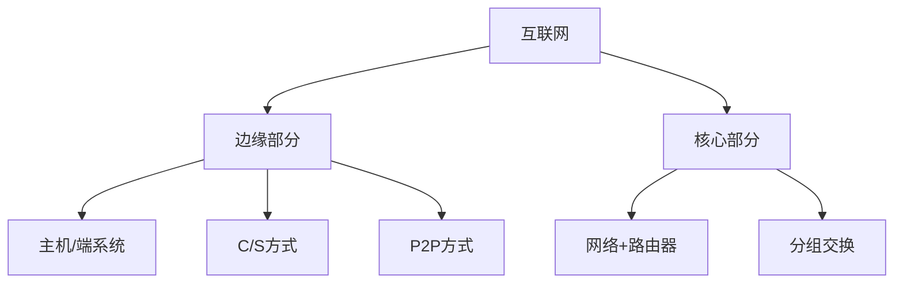

# 总结-第1章-概述

## 基本信息

- **课程**：计算机网络
- **章节**：第1章 概述
- **日期**：2026-06-15
- **标签**：#概述 #互联网 #体系结构 #OSI #TCP/IP #五层协议 #性能指标

***

## 章节概览

第1章是计算机网络的入门章节，主要介绍了互联网的基本概念、发展历程、组成结构、性能指标和体系结构。本章内容是理解后续章节的基础，其中**互联网组成**、**三种交换方式**、**性能指标**和**五层协议体系结构**是考试重点。

***

## 核心知识点

### 一、互联网基本概念（1.1、1.2）

#### 1. 21世纪三大特征
数字化、网络化、信息化

#### 2. 三大网络
电信网络、有线电视网络、**计算机网络**

#### 3. 互联网两个基本特点
- **连通性**：使上网用户之间可以交换信息
- **共享**：资源共享（信息共享、软件共享、硬件共享）

#### 4. 网络、互连网、互联网

| 概念 | 定义 | 协议要求 |
|:-----|:-----|:---------|
| **网络** | 节点 + 链路 | - |
| **互连网(internet)** | 网络的网络，通用名词 | 可任意选择 |
| **互联网(Internet)** | 全球最大的特定互连网，专用名词 | **必须TCP/IP** |

#### 5. 互联网发展的三个阶段

| 阶段 | 时间 | 特点 |
|:-----|:-----|:-----|
| 第一阶段 | 1969-1983 | ARPANET，**1983年TCP/IP成为标准**（互联网诞生） |
| 第二阶段 | 1985-1993 | 三级结构：主干网→地区网→校园网/企业网(NSFNET) |
| 第三阶段 | 1993至今 | 多层次ISP结构，商业化 |

#### 6. ISP层次
- **主干ISP**：国家范围，高速主干网
- **地区ISP**：地区范围，通过主干ISP连接
- **本地ISP**：本地范围，直接服务用户

#### 7. IXP
- **互联网交换点**，允许两个网络直接相连交换分组
- 好处：流量分布合理、减少时延、降低费用

#### 8. 标准化工作
- **ISOC** → **IAB** → **IETF** / **IRTF**
- **RFC**：Request For Comments，互联网标准形式
- 阶段：互联网草案（6个月）→ 建议标准（RFC）→ 互联网标准（STD）

### 二、互联网的组成（1.3）

#### 1. 边缘部分
- 由所有连接在互联网上的**主机（端系统）**组成
- 通信方式：

| 方式 | C/S | P2P |
|:-----|:----|:----|
| 角色 | 客户=请求方，服务器=提供方 | 既是客户又是服务器 |
| 启动 | 客户主动发起 | 平等对等 |

#### 2. 核心部分
- 由大量网络和**路由器**组成
- 路由器实现**分组交换**

#### 3. 三种交换方式对比

| 特性 | 电路交换 | 报文交换 | 分组交换 |
|:-----|:---------|:---------|:---------|
| 建立连接 | 需要 | 不需要 | 不需要 |
| 数据传送 | 连续比特流直达 | 整个报文存储转发 | 分组存储转发 |
| 资源占用 | 端到端始终占用 | 逐段占用 | 逐段占用 |
| 适用场景 | 话音通信 | 已淘汰 | **数据通信** |
| 优点 | 时延小 | - | 高效、灵活、迅速、可靠 |
| 缺点 | 效率低 | 时延大 | 排队时延、开销 |

#### 4. 分组交换要点
- **存储转发**：路由器暂存分组，查表后转发
- **首部**：包含目的地址、源地址等控制信息
- **独立选路**：每个分组独立选择传输路径
- **动态分配**：逐段占用通信资源

### 三、计算机网络在我国的发展（1.4）

- **1980年**：铁道部开始计算机联网实验
- **1989年**：第一个公用分组交换网CNPAC
- **1994年4月20日**：64kbit/s专线连入互联网，被国际正式承认
- **五大网络**：CHINANET、UNINET、CMNET、CERNET、CSTNET
- **2004年**：CERNET2试验网开通

### 四、计算机网络的类别（1.5）

#### 1. 按作用范围

| 类型 | 范围 | 英文 |
|:-----|:-----|:-----|
| 广域网 | 几十到几千公里 | WAN |
| 城域网 | 5~50 km | MAN |
| 局域网 | 约1 km | LAN |
| 个人区域网 | 约10 m | PAN/WPAN |

#### 2. 按使用者
- **公用网**：电信公司建造，公众使用
- **专用网**：某部门建造，内部使用

### 五、计算机网络的性能（1.6）

#### 1. 七个性能指标

| 指标 | 定义 | 单位 |
|:-----|:-----|:-----|
| 速率 | 数据传送速率 | bit/s |
| 带宽 | 最高数据率 | bit/s |
| 吞吐量 | 实际通过的数据量 | bit/s |
| 时延 | 数据从一端到另一端的时间 | s |
| 时延带宽积 | 传播时延×带宽 | bit |
| RTT | 往返时间 | s |
| 利用率 | 信道被利用的时间比例 | 0~1 |

#### 2. 四种时延

| 时延 | 公式 | 发生地点 |
|:-----|:-----|:---------|
| **发送时延** | 数据帧长度/发送速率 | 机器内部发送器 |
| **传播时延** | 信道长度/电磁波传播速率 | 传输媒体 |
| **处理时延** | - | 路由器处理 |
| **排队时延** | - | 路由器队列 |

$$\text{总时延} = \text{发送时延} + \text{传播时延} + \text{处理时延} + \text{排队时延}$$

#### 3. 重要公式

**时延带宽积**：
$$\text{时延带宽积} = \text{传播时延} \times \text{带宽}$$
表示链路可容纳的比特数（以比特为单位的链路长度）

**利用率与时延关系**：
$$D = \frac{D_0}{1-U}$$

- U=0.5时，D=2D₀（时延加倍）
- U→1时，D→∞
- ISP通常控制利用率**不超过50%**

#### 4. 关键结论
- 发送时延与信道长度**无关**，传播时延与发送速率**无关**
- 光纤传播速率（约20万km/s）比铜线（约23万km/s）**略低**
- 提高发送速率只减小发送时延，不改变传播时延

### 六、计算机网络体系结构（1.7）

#### 1. 协议三要素

| 要素 | 内容 |
|:-----|:-----|
| **语法** | 数据与控制信息的结构或格式 |
| **语义** | 需要发出何种控制信息，完成何种动作 |
| **同步** | 事件实现顺序的详细说明 |

#### 2. 三种体系结构

| | OSI | TCP/IP | 五层协议 |
|:--|:----|:-------|:---------|
| 层数 | 7层 | 4层 | 5层 |
| 特点 | 理论完整但复杂 | 实用但不够清晰 | 教学用，综合优点 |

#### 3. 五层协议各层

| 层次 | 名称 | 数据单元 | 核心功能 | 重要协议 |
|:-----|:-----|:---------|:---------|:---------|
| 5 | 应用层 | 报文 | 完成特定网络应用 | DNS, HTTP, SMTP |
| 4 | 运输层 | 报文段/用户数据报 | 进程间通用数据传输 | TCP, UDP |
| 3 | 网络层 | 分组/数据报 | 主机间通信，路由转发 | IP |
| 2 | 数据链路层 | 帧 | 相邻节点间帧传输 | - |
| 1 | 物理层 | 比特 | 比特流传输 | - |

#### 4. 协议 vs 服务

| | 协议 | 服务 |
|:--|:-----|:-----|
| 方向 | **水平的**：对等实体之间 | **垂直的**：下层向上层 |
| 可见性 | 对上层透明（不可见） | 上层看得见 |

#### 5. 重要概念
- **实体(entity)**：可发送或接收信息的硬件或软件进程
- **SAP**：服务访问点，相邻两层实体交互的逻辑接口
- **SDU**：服务数据单元，层与层之间交换的数据
- **PDU**：协议数据单元，对等层之间传送的数据
- **对等层**：两个同样层次之间好像直接传递数据

#### 6. TCP/IP沙漏形状
- **everything over IP**：各种应用都基于IP
- **IP over everything**：IP可在各种网络上运行
- **网络核心越简单越好**，复杂部分让边缘实现

#### 7. OSI失败原因
- 缺乏实际经验，无商业驱动力
- 协议复杂，运行效率低
- 制定周期长
- 层次划分不合理，功能重复

***

## 协议对比与归纳

| 协议/概念 | 层次 | 特点 |
|:----------|:-----|:-----|
| TCP | 运输层 | 面向连接、可靠 |
| UDP | 运输层 | 无连接、尽最大努力 |
| IP | 网络层 | 无连接、分组交换 |

***

## 考试重点

### ⭐⭐⭐ 高频考点

1. **互连网 vs 互联网**：是否采用TCP/IP协议
2. **互联网发展的三个阶段**：ARPANET → NSFNET三级结构 → 多层次ISP
3. **三种交换方式**：电路交换、报文交换、分组交换的对比
4. **分组交换的优点**：高效、灵活、迅速、可靠
5. **四种时延**：发送时延、传播时延、处理时延、排队时延
6. **时延带宽积**：传播时延×带宽，链路可容纳的比特数
7. **利用率公式**：$D = D_0/(1-U)$，利用率接近1时时延趋于无穷
8. **五层协议**：应用层、运输层、网络层、数据链路层、物理层
9. **协议三要素**：语法、语义、同步
10. **协议 vs 服务**：水平 vs 垂直

### ⭐⭐ 重要考点

1. **ISP层次**：主干ISP、地区ISP、本地ISP
2. **IXP作用**：两个网络直接相连交换分组
3. **RFC**：Request For Comments，成为标准的过程
4. **1994年4月20日**：我国正式连入互联网
5. **网络分类**：WAN、MAN、LAN、PAN
6. **发送时延 vs 传播时延**：机器内 vs 线路上
7. **TCP/IP沙漏**：everything over IP，IP over everything
8. **OSI失败原因**：复杂、效率低、周期长

### 📌 易混淆点

| 概念A | 概念B | 区别 |
|:------|:------|:-----|
| internet | Internet | 通用名词 vs 专用名词 |
| 发送时延 | 传播时延 | 机器内 vs 线路上 |
| 速率 | 带宽 | 实际/额定 vs 最高能力 |
| 协议 | 服务 | 水平 vs 垂直 |
| UDP数据报 | IP数据报 | 运输层 vs 网络层 |
| 体系结构 | 实现 | 抽象 vs 具体 |

***

## 相关链接

### 章节笔记

- [第1章-1.1-计算机网络在信息时代中的作用](../章节笔记/第1章-概述/第1章-1.1-计算机网络在信息时代中的作用.md)
- [第1章-1.2-互联网概述](../章节笔记/第1章-概述/第1章-1.2-互联网概述.md)
- [第1章-1.3-互联网的组成](../章节笔记/第1章-概述/第1章-1.3-互联网的组成.md)
- [第1章-1.4-计算机网络在我国的发展](../章节笔记/第1章-概述/第1章-1.4-计算机网络在我国的发展.md)
- [第1章-1.5-计算机网络的类别](../章节笔记/第1章-概述/第1章-1.5-计算机网络的类别.md)
- [第1章-1.6-计算机网络的性能](../章节笔记/第1章-概述/第1章-1.6-计算机网络的性能.md)
- [第1章-1.7-计算机网络体系结构](../章节笔记/第1章-概述/第1章-1.7-计算机网络体系结构.md)

### 其他章节总结

- [总结-第3章-数据链路层](./总结-第3章-数据链路层.md)
- [总结-第4章-网络层](./总结-第4章-网络层.md)
- [总结-第5章-运输层](./总结-第5章-运输层.md)
- [总结-第6章-应用层](./总结-第6章-应用层.md)

***

*总结创建时间：2026-06-15*
