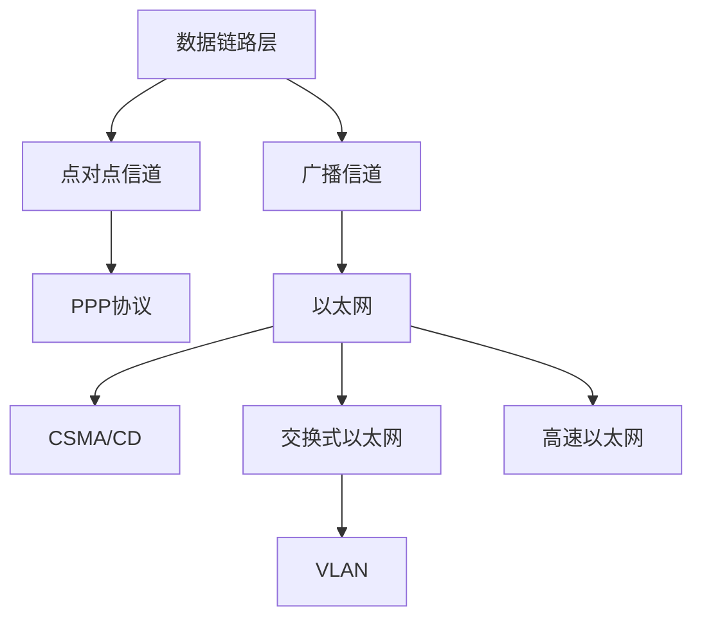

# 总结-第3章-数据链路层

## 基本信息

- **课程**：计算机网络
- **章节**：第3章 数据链路层
- **日期**：2026-06-14
- **标签**：#数据链路层 #PPP #CSMA/CD #以太网 #MAC地址 #VLAN #CRC

***

## 章节概览

数据链路层是计算机网络的低层，负责在相邻节点间可靠传输数据帧。本章围绕两种信道（点对点、广播）和对应协议（PPP、CSMA/CD）展开，核心内容是数据链路层的三个基本问题、以太网技术演进以及交换式以太网和VLAN。



***

## 一、核心概念速查

### 1. 链路 vs 数据链路

| 概念 | **链路 (link)** | **数据链路 (data link)** |
|:-----|:----------------|:------------------------|
| 定义 | 相邻节点的一段物理线路 | 链路 + 通信协议 |
| 实现 | 物理线路 | 网络适配器（网卡） |
| 层次 | 物理层概念 | 数据链路层概念 |

### 2. 数据链路层的三个基本问题

| 问题 | 核心方法 | 关键概念 |
|:-----|:---------|:---------|
| **封装成帧** | 加首部和尾部 | 帧定界符SOH(0x01)/EOT(0x04)、MTU |
| **透明传输** | 字节填充/零比特填充 | ESC转义字符、5个连续1后填0 |
| **差错检测** | CRC循环冗余检验 | FCS、生成多项式、模2除法 |

**无比特差错 vs 可靠传输**：
- CRC只能检测比特差错（无比特差错），不能检测帧丢失、重复、失序
- 可靠传输需要编号、确认、重传机制（由TCP负责，数据链路层不保证）

***

## 二、PPP协议（点对点）

### PPP协议特点

- **简单**：不纠错、不编号、不流量控制，只做CRC检验
- **封装成帧**：帧定界符 `0x7E`
- **透明传输**：异步用字节填充，同步用零比特填充
- **支持多种网络层协议和链路类型**

### PPP帧格式

| 字段 | F | A | C | 协议 | 信息 | FCS | F |
|:-----|:--|:--|:--|:-----|:-----|:----|:--|
| 长度 | 1B | 1B | 1B | 2B | ≤1500B | 2B | 1B |
| 取值 | 0x7E | 0xFF | 0x03 | 0x0021=IP | 数据 | CRC | 0x7E |

### 透明传输两种方法

| 特性 | **字节填充** | **零比特填充** |
|:-----|:-------------|:--------------|
| 适用场景 | 异步传输 | 同步传输(SONET/SDH) |
| 处理单位 | 字节 | 比特 |
| 转义方式 | 0x7E→(0x7D,0x5E) | 5个连续1后填0 |
| 使用协议 | PPP异步传输 | PPP同步传输 |

### PPP工作状态

链路静止 → 链路建立(LCP协商) → 鉴别(PAP/CHAP) → 网络层协议(NCP配置IP) → 链路打开 → 链路终止

***

## 三、CSMA/CD协议（广播信道）

### 三个要点

| 要点 | 含义 |
|:-----|:-----|
| **多点接入** | 总线型网络，多台计算机连接到一根总线 |
| **载波监听** | 发送前、发送中都要检测信道是否空闲 |
| **碰撞检测** | 边发送边检测信号电压，超过门限认为碰撞 |

### 关键参数

| 项目 | 10Mbit/s以太网 |
|:-----|:---------------|
| 争用期/碰撞窗口 | 2τ ≈ 51.2 μs |
| 最小帧长 | 64字节（512bit） |
| 意义 | 确保帧发送完毕前能检测到碰撞 |
| 工作方式 | **只能半双工** |

### 指数退避算法

- 碰撞后等待 r 倍 512 比特时间
- r 从 [0, 2^k-1] 随机选取，k = min(重传次数, 10)
- 重传达 **16次** 仍不成功，停止重传向上报错

### 以太网V2 MAC帧格式

| 字段 | 长度 | 说明 |
|:-----|:----:|:-----|
| 目的地址 | 6字节 | 接收方MAC地址 |
| 源地址 | 6字节 | 发送方MAC地址 |
| 类型 | 2字节 | 上层协议，如 0x0800=IP |
| 数据 | 46~1500字节 | 最小46B保证帧长≥64B |
| FCS | 4字节 | CRC检验 |
| 前同步码 | 7字节 | 物理层添加，位同步 |
| 帧开始定界符 | 1字节 | 物理层添加，10101011 |

**最小帧长64字节** = 6 + 6 + 2 + 46 + 4

**最大帧长1518字节** = 6 + 6 + 2 + 1500 + 4

### MAC地址

- **48位（6字节）**，固化在适配器ROM中
- 前3字节：**OUI**（IEEE分配给厂商）
- 后3字节：厂家自行指派
- I/G位（最低位）：0=单播，1=组地址
- G/L位（次低位）：0=全球管理，1=本地管理

### 曼彻斯特编码

- 每个码元中间都有一次电压转换
- 码元1：前低后高（上升沿）
- 码元0：前高后低（下降沿）
- **优点**：便于提取位同步信号
- **缺点**：频带宽度加倍

***

## 四、以太网扩展技术

### 集线器 vs 交换机

| 对比项 | **集线器** | **以太网交换机** |
|:-------|:-----------|:-----------------|
| 工作层次 | 物理层 | 数据链路层 |
| 工作方式 | 半双工 | **全双工** |
| 碰撞域 | 整个网络一个 | **每个端口一个** |
| 转发方式 | 广播到所有端口 | 根据MAC地址定向转发 |
| 总容量 | 端口速率 | 端口数×端口速率 |
| 自学习 | 无 | **有（交换表）** |

### 自学习算法

```
① 收到帧 → 查交换表，找目的MAC对应的端口
② 若找到 → 直接向该端口转发
③ 若未找到 → 向除进入端口外的所有端口广播
④ 记录源MAC和进入端口到交换表
⑤ 超过超时时间（如300秒）自动删除表项
```

### 生成树协议STP

- **目的**：消除冗余链路导致的帧兜圈子问题
- **标准**：IEEE 802.1D
- **方法**：不改变实际拓扑，逻辑上切断某些链路，形成无环树状结构

### VLAN（虚拟局域网）

| 项目 | 说明 |
|:-----|:-----|
| 定义 | 与物理位置无关的逻辑组 |
| 标准 | IEEE 802.1Q |
| 标签位置 | 源地址和类型之间插入4字节 |
| 标签内容 | 0x8100 + 12位VID |
| VID数量 | 4096个（2^12） |
| 最大帧长 | 1518 → **1522** 字节 |
| 接入链路 | 主机↔交换机，传标准帧 |
| 汇聚链路 | 交换机↔交换机，传802.1Q帧 |
| 跨VLAN通信 | **需要路由器**（网络层） |

***

## 五、高速以太网演进

### 各代以太网对比

| 特性 | 10M | 100M | 1G | 10G及以上 |
|:-----|:---:|:----:|:--:|:---------:|
| 标准 | DIX V2 | 802.3u | 802.3z | 802.3ae等 |
| CSMA/CD | 半双工用 | 半双工用 | 半双工用 | **不用** |
| 工作方式 | 半双工 | 半/全双工 | 半/全双工 | **全双工** |
| 帧格式 | V2/802.3 | 不变 | 不变 | 不变 |
| 最短帧长 | 64B | 64B | 64B（载波延伸） | 64B |
| 网段长度 | 1000m | 100m | 100m | 不受碰撞限制 |

### 关键技术

| 技术 | 作用 | 适用场景 |
|:-----|:-----|:---------|
| **载波延伸** | 争用期等效增大到512字节，不足则填充 | 吉比特以太网半双工 |
| **分组突发** | 多个短帧连续发送，只有第一个填充 | 吉比特以太网半双工 |
| **参数a不变** | 数据率提高10倍 → 电缆长度减为1/10 | 100BASE-T |

### PPPoE

- 全称：PPP over Ethernet
- 作用：把PPP帧封装在以太网帧中传输
- 应用：**光纤宽带接入**（FTTx）
- 功能：用户认证、计费、IP地址分配

***

## 六、信道利用率

### 极限信道利用率（理想无碰撞）

$$
S_{max} = \frac{T_0}{T_0 + \tau} = \frac{1}{1+a}
$$

- τ：单程端到端传播时延
- T₀：帧的发送时间
- a = τ/T₀

**结论**：a → 0 时利用率最高；实际以太网利用率达到 **30%** 时已处于重载。

***

## 七、考试重点

### ⭐⭐⭐ 必考内容

1. **链路 vs 数据链路**：物理线路 vs 链路+协议
2. **三个基本问题**：封装成帧、透明传输（字节填充/零比特填充）、差错检测（CRC）
3. **CRC计算**：模2除法，不能实现可靠传输
4. **PPP协议特点**：简单、帧格式、透明传输方法、工作状态
5. **CSMA/CD三个要点**：多点接入、载波监听、碰撞检测
6. **争用期与最小帧长**：2τ=51.2μs，最小帧长64字节
7. **以太网V2 MAC帧格式**：各字段长度和作用
8. **MAC地址**：48位，OUI+扩展标识符，I/G位和G/L位
9. **曼彻斯特编码**：码元中间电压转换，便于位同步，频带加倍
10. **集线器 vs 交换机**：层次、工作方式、碰撞域、转发方式
11. **自学习算法**：查表转发/广播、记录源地址、超时删除
12. **STP**：消除冗余链路兜圈子
13. **VLAN**：802.1Q帧、VID、接入链路/汇聚链路、跨VLAN需路由器
14. **高速以太网演进**：帧格式不变、CSMA/CD的弃用、载波延伸/分组突发
15. **PPPoE**：宽带接入认证

### 📌 易混淆点辨析

| 易混点 | 辨析 |
|:-------|:-----|
| **链路 vs 数据链路** | 链路是物理线路，数据链路=链路+协议 |
| **CRC vs FCS** | CRC是检错方法，FCS是冗余码 |
| **无比特差错 vs 可靠传输** | CRC实现前者，后者需编号+确认+重传 |
| **字节填充 vs 零比特填充** | 异步/PPP用字节填充，同步/SONET用零比特填充 |
| **CSMA/CD只能半双工** | 因为边发送边监听，无法同时收发 |
| **最小帧长64字节** | 与争用期相关，确保发送完毕前能检测碰撞 |
| **集线器 vs 交换机** | 物理层/半双工/广播 vs 数据链路层/全双工/定向转发 |
| **碰撞域 vs 广播域** | 集线器一个碰撞域，交换机每个端口一个；VLAN划分广播域 |
| **接入链路 vs 汇聚链路** | 主机-交换机传标准帧，交换机-交换机传802.1Q帧 |
| **载波延伸 vs 分组突发** | 前者解决争用期太短，后者解决短帧开销 |
| **10GbE不用CSMA/CD** | 只全双工，无共享信道，无碰撞 |
| **PPPoE不是以太网协议** | 是把PPP封装在以太网帧中的数据链路层协议 |

### 📝 常见考题类型

1. **简答题**：
   - 数据链路层的三个基本问题及解决方法
   - 说明CRC循环冗余检验的原理（为什么不是可靠传输）
   - PPP协议为什么设计得如此简单
   - CSMA/CD三个要点及为什么只能半双工
   - 为什么以太网设置最小帧长64字节
   - 以太网交换机自学习算法过程
   - VLAN的工作原理和优点
   - 为什么高速以太网保持帧格式不变
   - 载波延伸和分组突发的作用

2. **计算题**：
   - CRC模2除法计算FCS
   - 给定数据率和距离，计算争用期、最小帧长
   - 参数a的计算和影响

3. **选择题/判断题**：
   - CRC能实现可靠传输（✗）
   - 链路和数据链路是同一概念（✗）
   - MTU是帧的总长度（✗，是数据部分最大长度）
   - PPP地址字段A和控制字段C是固定值（✓）
   - CSMA/CD可以全双工通信（✗）
   - 以太网最小帧长64字节（✓）
   - 交换机工作在物理层（✗）
   - VLAN可以缩小广播域（✓）
   - 跨VLAN通信不需要路由器（✗）
   - 10GbE使用CSMA/CD（✗）
   - 100BASE-T帧格式与10BASE-T不同（✗）
   - PPPoE用于光纤宽带接入（✓）

***

## 相关链接

### 章节笔记

- [第3章-3.1-数据链路层的几个共同问题](../章节笔记/第3章-数据链路层/第3章-3.1-数据链路层的几个共同问题.md)
- [第3章-3.2-点对点协议PPP](../章节笔记/第3章-数据链路层/第3章-3.2-点对点协议PPP.md)
- [第3章-3.3-使用广播信道的数据链路层](../章节笔记/第3章-数据链路层/第3章-3.3-使用广播信道的数据链路层.md)
- [第3章-3.4-扩展的以太网](../章节笔记/第3章-数据链路层/第3章-3.4-扩展的以太网.md)
- [第3章-3.5-高速以太网](../章节笔记/第3章-数据链路层/第3章-3.5-高速以太网.md)

***

*总结创建时间：2026-06-14*
