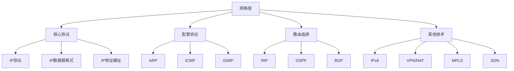
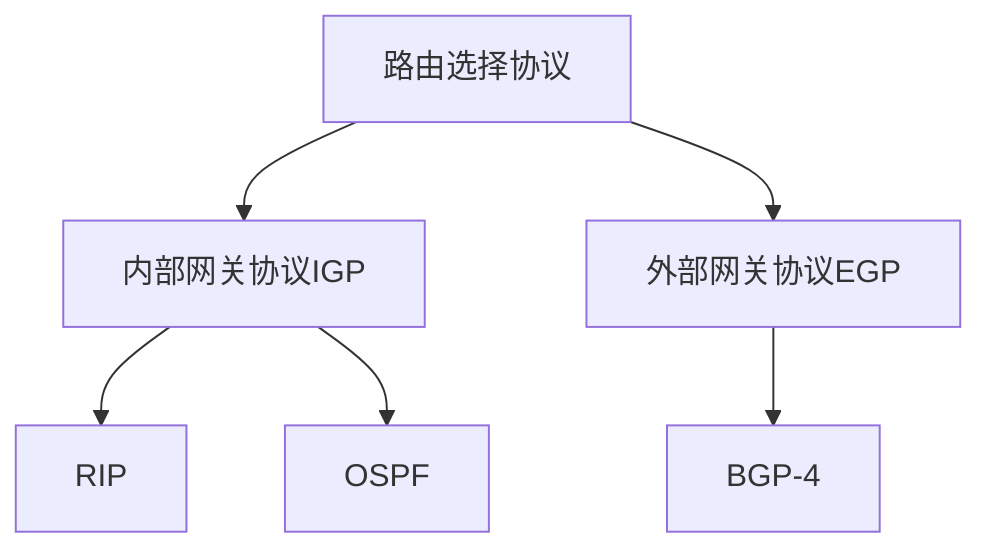

# 总结-第4章-网络层

## 基本信息

- **课程**：计算机网络
- **章节**：第4章 网络层
- **日期**：2026-06-14
- **标签**：#网络层 #IP #CIDR #路由选择 #RIP #OSPF #BGP #ICMP #IPv6 #VPN #NAT

***

## 章节概览

网络层是TCP/IP体系结构中最核心的层次，负责为分组交换网上的不同主机提供通信服务。本章核心内容是**网际协议IP**，以及配套协议（ARP、ICMP、IGMP）、路由选择协议、IPv6、VPN/NAT等。

***

## 一、核心概念速查

### 1. 网络层两种服务

| 对比项 | **虚电路服务** | **数据报服务** |
|:-------|:-------------|:-------------|
| 思路 | 网络保证可靠通信 | 主机保证可靠通信 |
| 连接 | 必须有 | 不需要 |
| 终点地址 | 连接建立后用虚电路号 | 每个分组都有完整IP地址 |
| 分组转发 | 同一路由 | 独立查找转发表 |
| 节点故障 | 所有虚电路中断 | 可能丢失分组，路由变化 |
| 分组顺序 | 按序到达 | 可能失序 |
| 差错/流量控制 | 网络或主机负责 | 仅主机负责 |

**互联网选择数据报服务的原因**：端系统有智能，网络简单灵活、造价低、可扩展性好。

### 2. 网络层的两个层面

| 层面 | **数据层面** | **控制层面** |
|:-----|:-----------|:-----------|
| 功能 | 根据转发表转发分组 | 交换路由信息，生成路由表 |
| 速度 | 纳秒级 | 秒级 |
| 实现 | 硬件转发 | 软件计算 |
| 工作方式 | 路由器独立工作 | 路由器协同工作 |

**SDN**：控制层面集中化，路由器只保留数据层面。

***

## 二、IP地址编址

### 分类编址（历史）

| 类型 | 前缀 | 网络号 | 主机号 | 地址范围 | 每个网络主机数 |
|:----:|:----:|:------:|:------:|:---------|:-------------|
| A类 | 0 | 7位 | 24位 | 1.0.0.0 ~ 126.0.0.0 | 1677万+ |
| B类 | 10 | 14位 | 16位 | 128.0.0.0 ~ 191.255.0.0 | 65534 |
| C类 | 110 | 21位 | 8位 | 192.0.0.0 ~ 223.255.255.0 | 254 |
| D类 | 1110 | - | - | 224.0.0.0 ~ 239.255.255.255 | 多播 |
| E类 | 1111 | - | - | 240.0.0.0 ~ 255.255.255.255 | 保留 |

### CIDR无分类编址（重点）

**三个要点**：
1. **网络前缀**：长度n可变，斜线记法 `IP/n`
2. **地址块**：网络前缀相同的连续地址，地址数 = 2^(32-n)
3. **地址掩码**：1的个数 = 前缀长度，网络地址 = IP AND 掩码

**常用CIDR地址块**：

| 前缀 | 掩码 | 地址数 | 用途 |
|:----:|:-----|:------:|:-----|
| /16 | 255.255.0.0 | 64K | 1个B类 |
| /24 | 255.255.255.0 | 256 | 1个C类 |
| /30 | 255.255.255.252 | 4 | 点对点链路 |
| /32 | 255.255.255.255 | 1 | 主机路由 |
| /0 | 0.0.0.0 | 所有 | 默认路由 |

**路由聚合**：用大的CIDR地址块代替多个小的地址块，减少转发表项目数。

***

## 三、IP数据报格式

### 首部固定部分（20字节）

| 字段 | 长度 | 说明 |
|:-----|:----:|:-----|
| 版本 | 4位 | IPv4=4，IPv6=6 |
| 首部长度 | 4位 | 单位4字节，最小5（20字节），最大15（60字节） |
| 区分服务 | 8位 | 一般不使用 |
| 总长度 | 16位 | 首部+数据，最大65535字节 |
| 标识 | 16位 | 分片时复制到各片 |
| 标志 | 3位 | DF（不分片）、MF（更多分片） |
| 片偏移 | 13位 | 单位8字节 |
| 生存时间TTL | 8位 | 每经路由器减1，防止无限循环 |
| 协议 | 8位 | TCP=6，UDP=17，ICMP=1 |
| 首部检验和 | 16位 | **只检验首部**，不检验数据 |
| 源地址 | 32位 | 发送方IP |
| 目的地址 | 32位 | 接收方IP |

### IP数据报分片

**分片原因**：不同网络MTU不同（以太网1500字节）

**关键规则**：
- 片偏移单位是**8字节**
- 除最后一个分片外，数据长度必须是8字节的整数倍
- 标识字段相同，MF标志区分是否最后一个分片

### IPv6基本首部（40字节，固定）

| 字段 | 长度 | 说明 |
|:-----|:----:|:-----|
| 版本 | 4位 | =6 |
| 通信量类 | 8位 | 类似IPv4区分服务 |
| 流标号 | 20位 | 标识同一流的数据报 |
| 有效载荷长度 | 16位 | 基本首部以外的字节数 |
| 下一个首部 | 8位 | 相当于IPv4协议字段 |
| 跳数限制 | 8位 | 相当于TTL |
| 源地址 | 128位 | IPv6地址长度128位 |
| 目的地址 | 128位 | |

**IPv6取消的IPv4字段**：首部长度、服务类型、总长度、标识/标志/片偏移、协议、首部检验和、选项。

***

## 四、IP层转发分组

### 基于终点的转发

1. 提取目的IP地址
2. 与转发表中的网络前缀进行**最长前缀匹配**
3. 找到匹配项后按指明接口转发

### 最长前缀匹配

**原则**：选择网络前缀最长的匹配项（前缀越长，路由越具体）

**匹配顺序**：/32（主机路由）→ /24 → /16 → /8 → /0（默认路由）

### 直接交付 vs 间接交付

| 类型 | 条件 | 特点 |
|:-----|:-----|:-----|
| 直接交付 | 源和目的在同一网络 | 不经过路由器 |
| 间接交付 | 源和目的在不同网络 | 必须经过路由器转发 |

***

## 五、配套协议

### ARP（地址解析协议）

| 项目 | 说明 |
|:-----|:-----|
| 功能 | IP地址 → MAC地址 |
| 请求方式 | **广播**（目的MAC为FF-FF-FF-FF-FF-FF） |
| 响应方式 | **单播** |
| 适用范围 | **同一局域网** |
| 高速缓存生存时间 | 10~20分钟 |
| 双向更新 | 请求中包含发送方映射，接收方也会更新缓存 |

**跨网络通信**：需要多次使用ARP，每个路由器解析下一跳的MAC地址。

### ICMP（网际控制报文协议）

**差错报告报文**（4种）：
- 类型3：终点不可达
- 类型11：时间超过（TTL=0或分片未按时到达）
- 类型12：参数问题
- 类型5：改变路由（重定向）

**询问报文**（2种）：
- 类型8/0：回送请求/回答（**PING命令**）
- 类型13/14：时间戳请求/回答

**不应发送ICMP差错报告的情况**：
- 对ICMP差错报告不再发送ICMP差错报告
- 对后续分片不发送
- 对多播地址不发送
- 对特殊地址（127.x.x.x或0.0.0.0）不发送

***

## 六、路由选择协议

### 协议分类

### RIP vs OSPF vs BGP 对比

| 特性 | **RIP** | **OSPF** | **BGP-4** |
|:-----|:--------|:---------|:----------|
| 类型 | 距离向量 | 链路状态 | 路径向量 |
| 交换对象 | 相邻路由器 | 所有路由器（洪泛法） | 边界路由器 |
| 交换内容 | 整个路由表 | 链路状态 | 可达性信息 |
| 度量 | 跳数（最大15） | 费用/距离/时延/带宽 | 策略综合 |
| 传输协议 | **UDP**端口520 | **IP**协议89 | **TCP**端口179 |
| 收敛速度 | 慢（坏消息传播慢） | 快（<100ms） | 较慢 |
| 适用规模 | 小型互联网 | 大型自治系统 | 自治系统之间 |
| 优点 | 简单 | 收敛快、无坏消息问题 | 策略灵活 |

### RIP要点

- 距离 = 经过的路由器数 + 1
- 最大距离15，16表示不可达
- 每30秒交换一次
- 3分钟未收到更新标记为不可达

### OSPF要点

- 使用Dijkstra SPF算法
- 链路状态数据库一致
- 支持区域划分（减少通信量）
- Hello分组每10秒交换，40秒未收到认为不可达
- 支持负载均衡、鉴别、CIDR

### BGP要点

- 力求选择**较好**的路由（非最佳）
- eBGP：不同AS的边界路由器之间
- iBGP：同一AS内部的路由器之间（必须全连通）
- 使用TCP半永久性连接

***

## 七、IP多播

### 基本概念

- D类地址：224.0.0.0 ~ 239.255.255.255
- 只能用于目的地址，不能用于源地址
- 不产生ICMP差错报文

### 硬件多播映射

- 以太网多播地址范围：01-00-5E-00-00-00 ~ 01-00-5E-7F-FF-FF
- D类IP后23位映射到以太网多播地址后23位
- **多对一映射**：多个D类IP可能映射到同一个MAC地址

### 所需协议

| 协议 | 范围 | 功能 |
|:-----|:-----|:-----|
| **IGMP** | 本地 | 让多播路由器知道局域网组成员信息 |
| **多播路由选择协议** | 互联网 | 协同工作，最小代价传送 |

***

## 八、VPN与NAT

### VPN（虚拟专用网）

| 项目 | 说明 |
|:-----|:-----|
| 专用地址范围 | 10.0.0.0/8, 172.16.0.0/12, 192.168.0.0/16 |
| 技术 | **IP隧道技术**：内部数据报加密后封装在外部数据报中 |
| 类型 | 内联网(Intranet)、外联网(Extranet)、远程接入VPN |

### NAT（网络地址转换）

| 项目 | 说明 |
|:-----|:-----|
| 功能 | 本地IP地址 ↔ 全球IP地址 |
| 位置 | 专用网连接互联网的路由器上 |
| NAT转换表 | 记录本地地址与全球地址的映射关系 |
| NAPT | 网络地址与端口号转换，多个主机共享一个全球IP |

***

## 九、MPLS与SDN

### MPLS（多协议标签交换）

| 项目 | 说明 |
|:-----|:-----|
| 核心思想 | 给IP数据报打标签，根据标签转发 |
| 设备 | 标签交换路由器LSR |
| 工作过程 | 入口打标签 → LSR标签对换 → 出口去标签 |
| FEC | 转发等价类，同样方式对待的IP数据报 |
| 优势 | 流量工程、负载均衡、显式路由选择 |

### SDN（软件定义网络）

| 项目 | 说明 |
|:-----|:-----|
| 核心思想 | 控制层面与数据层面分离 |
| 数据层面 | 简单快速的OpenFlow交换机 |
| 控制层面 | 逻辑上集中的远程控制器 |
| 接口协议 | OpenFlow |
| 转发表 | 流表（Flow Table），"匹配+动作" |

***

## 十、IP地址 vs MAC地址

| 对比项 | **IP地址** | **MAC地址** |
|:-------|:-----------|:------------|
| 层次 | 网络层 | 数据链路层 |
| 长度 | 32位（IPv4）/128位（IPv6） | 48位 |
| 分配方式 | 逻辑地址，软件配置 | 物理地址，固化在网卡 |
| 通信范围 | 互联网全局 | 局域网内 |
| 变化性 | 通信过程中**始终不变** | 每段链路**都会改变** |
| 作用 | 逻辑寻址、路由选择 | 物理寻址、帧交付 |

**通信过程关键**：
- IP数据报首部：源IP和目的IP始终不变
- MAC帧首部：每经过一段链路，源MAC和目的MAC都会改变
- 路由器：剥去旧MAC帧，重新封装新MAC帧

***

## 十一、考试重点

### ⭐⭐⭐ 必考内容

1. **虚电路服务 vs 数据报服务对比**
2. **CIDR编址与计算**：网络地址、地址块范围、可指派地址数
3. **IP数据报首部格式**：版本、首部长度、总长度、标识、标志、片偏移、TTL、协议、检验和
4. **IP数据报分片计算**：片偏移、MF标志、总长度
5. **IP地址 vs MAC地址**：通信过程中地址的变化
6. **ARP工作原理**：请求广播、响应单播、同一局域网
7. **ICMP报文类型**：差错报告（4种）和询问报文（2种）
8. **RIP/OSPF/BGP对比**：类型、传输协议、度量、收敛速度
9. **最长前缀匹配**：前缀越长越优先
10. **VPN隧道技术**和**NAT转换原理**

### 📌 易混淆点辨析

| 易混点 | 辨析 |
|:-------|:-----|
| **IP地址 vs MAC地址** | IP全局不变，MAC每段都变 |
| **ARP请求 vs 响应** | 请求广播，响应单播 |
| **RIP vs OSPF** | RIP距离向量/UDP/跳数；OSPF链路状态/IP/Dijkstra |
| **RIP vs BGP** | RIP是IGP，BGP是EGP；RIP用UDP，BGP用TCP |
| **直接交付 vs 间接交付** | 同网络直接交付，不同网络经路由器 |
| **主机路由 vs 默认路由** | /32最具体，/0最不具体 |
| **TTL vs 跳数限制** | IPv4叫TTL，IPv6叫跳数限制，功能相同 |
| **首部检验和为什么不检验数据** | 数据报每经路由器首部会变化（如TTL），数据不变 |
| **IPv4 vs IPv6地址长度** | 32位 vs 128位 |
| **专用地址 vs 全球地址** | 专用地址只在内部使用，不能在互联网上路由 |

### 📝 常见考题类型

1. **简答题**：
   - 为什么互联网选择数据报服务？
   - 说明网络层两个层面的功能和区别
   - ARP的工作原理是什么？
   - 为什么IP地址和MAC地址都需要？
   - RIP和OSPF的本质区别？
   - BGP为什么力求"较好"而非"最佳"路由？
   - VPN的隧道技术原理？
   - NAT如何解决IP地址不足问题？

2. **计算题**：
   - CIDR地址块计算（网络地址、范围、可用地址数）
   - IP数据报分片计算（片偏移、总长度、MF标志）
   - 最长前缀匹配（给定目的地址和转发表，确定下一跳）

3. **选择题/判断题**：
   - IP数据报首部固定部分20字节（✓）
   - 片偏移单位是1字节（✗，是8字节）
   - RIP最大距离是16（✗，最大15，16表示不可达）
   - OSPF使用UDP传送（✗，直接使用IP数据报）
   - BGP使用TCP端口179（✓）
   - ARP请求是单播发送（✗，是广播）
   - ICMP差错报告对多播地址不发送（✓）
   - NAT路由器至少需要一个全球IP地址（✓）
   - IPv6首部长度固定40字节（✓）
   - SDN中路由器之间交换路由信息（✗，控制器集中管理）

***

## 相关链接

### 章节笔记

- [第4章-4.1-网络层的几个重要概念](../章节笔记/第4章-网络层/第4章-4.1-网络层的几个重要概念.md)
- [第4章-4.2.1~4.2.2-虚拟互连网络与IP地址](../章节笔记/第4章-网络层/第4章-4.2.1~4.2.2-虚拟互连网络与IP地址.md)
- [第4章-4.2.3-IP地址与MAC地址](../章节笔记/第4章-网络层/第4章-4.2.3-IP地址与MAC地址.md)
- [第4章-4.2.4-地址解析协议ARP](../章节笔记/第4章-网络层/第4章-4.2.4-地址解析协议ARP.md)
- [第4章-4.2.5-IP数据报的格式](../章节笔记/第4章-网络层/第4章-4.2.5-IP数据报的格式.md)
- [第4章-4.3-IP层转发分组的过程](../章节笔记/第4章-网络层/第4章-4.3-IP层转发分组的过程.md)
- [第4章-4.4-网际控制报文协议ICMP](../章节笔记/第4章-网络层/第4章-4.4-网际控制报文协议ICMP.md)
- [第4章-4.5-IPv6](../章节笔记/第4章-网络层/第4章-4.5-IPv6.md)
- [第4章-4.6-互联网的路由选择协议](../章节笔记/第4章-网络层/第4章-4.6-互联网的路由选择协议.md)
- [第4章-4.7-IP多播](../章节笔记/第4章-网络层/第4章-4.7-IP多播.md)
- [第4章-4.8-虚拟专用网VPN和网络地址转换NAT](../章节笔记/第4章-网络层/第4章-4.8-虚拟专用网VPN和网络地址转换NAT.md)
- [第4章-4.9-多协议标签交换MPLS](../章节笔记/第4章-网络层/第4章-4.9-多协议标签交换MPLS.md)
- [第4章-4.10-软件定义网络SDN简介](../章节笔记/第4章-网络层/第4章-4.10-软件定义网络SDN简介.md)

***

*总结创建时间：2026-06-14*
