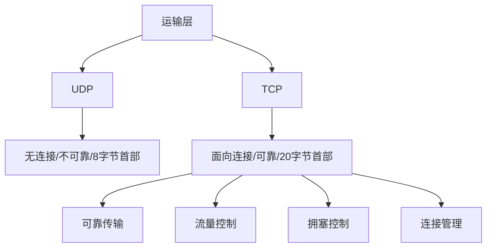

# 总结-第5章-运输层

## 基本信息

- **课程**：计算机网络
- **章节**：第5章 运输层
- **日期**：2026-06-14
- **标签**：#运输层 #TCP #UDP #端口 #三次握手 #四次挥手 #拥塞控制 #流量控制 #滑动窗口

***

## 章节概览

运输层是整个网络体系结构中的核心层次，为应用进程之间提供**端到端的逻辑通信**。本章重点讨论TCP和UDP两种运输层协议的工作原理。



***

## 一、UDP vs TCP 全面对比

### 协议基本信息

| 特性 | **UDP** | **TCP** |
|:-----|:--------|:--------|
| **连接** | 无连接 | 面向连接 |
| **可靠性** | 不可靠（尽最大努力） | 可靠交付 |
| **数据单位** | 面向报文（保留边界） | 面向字节流 |
| **首部大小** | 8字节 | 20字节（最小）~ 60字节（最大） |
| **通信方式** | 一对一/一对多/多对多 | 点对点（一对一） |
| **拥塞控制** | 无 | 有 |
| **流量控制** | 无 | 有 |
| **确认机制** | 无 | 有 |
| **适用场景** | DNS、实时视频、IP电话 | HTTP、FTP、SMTP |

### 端口使用对比

| 应用 | 应用层协议 | 运输层协议 | 端口 |
|:-----|:----------|:----------:|:----:|
| 域名解析 | DNS | UDP/TCP | 53 |
| 简单文件传输 | TFTP | UDP | 69 |
| 网络管理 | SNMP | UDP | 161/162 |
| IP地址配置 | DHCP | UDP | 67/68 |
| 路由选择 | RIP | UDP | 520 |
| 电子邮件 | SMTP | TCP | 25 |
| 远程终端 | TELNET | TCP | 23 |
| 万维网 | HTTP | TCP | 80 |
| 文件传送 | FTP | TCP | 21/20 |

***

## 二、各小节核心要点

### 5.1 运输层协议概述

**核心作用**：为应用进程之间提供**端到端的逻辑通信**（网络层是主机到主机）。

**关键概念**：

| 概念 | 说明 |
|:-----|:-----|
| **复用** | 发送方多个应用进程共用同一个运输层协议 |
| **分用** | 接收方运输层将数据正确交付给目的进程 |
| **端口** | 16位整数，标识应用层与运输层的接口 |
| **套接字** | socket = (IP地址 : 端口号) |

**端口分类**：

| 范围 | 类型 | 用途 |
|:----:|:-----|:-----|
| 0 ~ 1023 | 熟知端口 | 系统服务（HTTP:80, FTP:21, DNS:53） |
| 1024 ~ 49151 | 登记端口 | 用户服务，需向IANA登记 |
| 49152 ~ 65535 | 短暂端口 | 客户端临时使用 |

---

### 5.2 UDP用户数据报协议

**UDP首部格式（8字节）**：

| 字段 | 长度 | 说明 |
|:-----|:----:|:-----|
| 源端口 | 2字节 | 需要对方回信时选用 |
| 目的端口 | 2字节 | **必须**，用于终点交付 |
| 长度 | 2字节 | UDP数据报总长度，**最小值8** |
| 检验和 | 2字节 | 可选，检测传输差错 |

**UDP特点**：
- 发送前不需建立连接，没有连接可释放
- 不保证可靠交付，不维持连接状态表
- 面向报文：对应用层报文**既不合并，也不拆分**
- 没有拥塞控制，网络拥塞不会降低发送速率
- 支持一对一、一对多、多对一、多对多

**伪首部（12字节）**：仅用于计算检验和，不向下传送。

---

### 5.3 TCP传输控制协议概述

**TCP的5个最主要特点**：

| 特点 | 说明 |
|:-----|:-----|
| **面向连接** | 通信前建立连接，通信后释放连接 |
| **点对点** | 每条TCP连接只能有两个端点 |
| **可靠交付** | 无差错、不丢失、不重复、按序到达 |
| **全双工通信** | 双方随时都能发送，有发送/接收缓存 |
| **面向字节流** | 数据看作无结构字节流，不保证数据块对应 |

**套接字（Socket）**：

$$
\text{套接字} = (\text{IP地址} : \text{端口号})
$$

$$
\text{TCP连接} = \{(\text{IP}_1: \text{port}_1), (\text{IP}_2: \text{port}_2)\}
$$

---

### 5.4 可靠传输的工作原理

**停止等待协议**：每发送完一个分组就停止发送，等待对方确认。

**三种情况**：
1. **无差错**：正常收发
2. **出现差错**：超时重传
3. **确认丢失/迟到**：丢弃重复分组，丢弃迟到确认

**信道利用率**：

$$
U = \frac{T_D}{T_D + RTT + T_A}
$$

**连续ARQ协议**：
- 发送窗口内的分组可连续发送
- **累积确认**：对按序到达的最后一个分组确认
- **Go-back-N**：某个分组丢失，需重传该分组及之后的所有分组

---

### 5.5 TCP报文段的首部格式

**首部结构**：固定20字节 + 可选最多40字节 = 最大60字节。

**关键字段**：

| 字段 | 长度 | 说明 |
|:-----|:----:|:-----|
| **序号** | 4字节 | 本报文段第一个数据字节的序号 |
| **确认号** | 4字节 | 期望收到对方的下一个序号（确认号=N表示N-1及之前都已收到） |
| **数据偏移** | 4位 | 首部长度，单位4字节，最大15→60字节 |
| **窗口** | 2字节 | 发送方的接收窗口，用于流量控制 |
| **检验和** | 2字节 | 首部+数据，使用伪首部计算 |

**六个控制位**：

| 控制位 | 含义 | 使用场景 |
|:------:|:-----|:---------|
| **SYN** | 同步 | 连接建立：SYN=1,ACK=0（请求）；SYN=1,ACK=1（接受） |
| **ACK** | 确认 | ACK=1时确认号有效；连接建立后必须置1 |
| **FIN** | 终止 | FIN=1表示发送方数据发完，要求释放连接 |
| **RST** | 复位 | 连接出现严重差错，必须释放重连 |
| **URG** | 紧急 | URG=1时紧急指针有效 |
| **PSH** | 推送 | 尽快交付应用进程 |

**重要选项**：
- **MSS**：最大报文段长度，默认536字节
- **窗口扩大**：移位值S最大14，窗口最大2^30-1
- **时间戳**：计算RTT、防止序号绕回
- **SACK**：选择确认

---

### 5.6 TCP可靠传输的实现

**以字节为单位的滑动窗口**：

**三个指针**：
- **P₁**：已发送并已确认的后沿
- **P₂**：已发送但未确认
- **P₃**：允许发送的前沿

$$
\text{发送窗口} = P_3 - P_1 \quad \text{已发送未确认} = P_2 - P_1 \quad \text{可用窗口} = P_3 - P_2
$$

**超时重传时间RTO**：

$$
\text{新的 RTT}_S = (1 - \alpha) \times \text{旧RTT}_S + \alpha \times \text{新RTT样本} \quad (\alpha = 0.125)
$$

$$
\text{新的 RTT}_D = (1 - \beta) \times \text{旧RTT}_D + \beta \times |\text{RTT}_S - \text{新RTT样本}| \quad (\beta = 0.25)
$$

$$
\text{RTO} = \text{RTT}_S + 4 \times \text{RTT}_D
$$

**Karn算法**：报文段重传时不采用其RTT样本；每次重传RTO增大为原来的2倍。

**选择确认SACK**：
- 接收方报告不连续字节块的边界
- 最多报告4个字节块（8个边界=32字节）
- 需要建立连接时协商"允许SACK"

---

### 5.7 TCP的流量控制

**定义**：让发送方的发送速率不要太快，让接收方来得及接收。

**实现方式**：通过接收窗口 **rwnd** 控制发送窗口。

**零窗口问题**：
- B发送rwnd=0后，后续的rwnd>0报文段丢失 → 死锁
- **解决方案：持续计时器**
  - 收到零窗口 → 启动持续计时器
  - 到期 → 发送零窗口探测报文段（1字节数据）
  - 根据对方确认中的窗口值决定是否继续

**提高传输效率**：

| 算法/机制 | 作用 |
|:----------|:-----|
| **Nagle算法** | 减少小报文段数量：第一个字节立即发送，收到确认后再发缓存数据 |
| **糊涂窗口综合征** | 小窗口导致效率低下；解决：接收方等待足够空间，发送方积累足够数据 |

**流量控制 vs 拥塞控制**：

| 对比项 | **流量控制** | **拥塞控制** |
|:-------|:-------------|:-------------|
| 控制对象 | 发送方 vs 接收方 | 发送方 vs 网络 |
| 范围 | 端到端 | 全局性 |
| 目的 | 防止接收方缓存溢出 | 防止网络资源过载 |
| 手段 | 接收窗口 rwnd | 拥塞窗口 cwnd |
| 信息来源 | 接收方反馈 | 发送方超时判断 |

---

### 5.8 TCP的拥塞控制

**核心变量**：
- **cwnd**（拥塞窗口）：发送方维持，大小取决于网络拥塞程度
- **ssthresh**（慢开始门限）：慢开始和拥塞避免的分界点
- **发送窗口上限**：$\text{Min}[\text{rwnd}, \text{cwnd}]$

**四种算法**：

| 算法 | 触发条件 | cwnd变化 | ssthresh变化 | 后续状态 |
|:-----|:---------|:---------|:-------------|:---------|
| **慢开始** | cwnd < ssthresh | 每RTT加倍 | 不变 | 指数增长 |
| **拥塞避免** | cwnd ≥ ssthresh | 每RTT加1 | 不变 | 线性增长 |
| **快重传** | 收到3个重复ACK | 不变 | cwnd/2 | 快恢复 |
| **快恢复** | 快重传后 | = ssthresh | 不变 | 拥塞避免 |

**超时 vs 3个重复ACK**：

| 事件 | ssthresh | cwnd | 后续算法 |
|:-----|:---------|:-----|:---------|
| **超时** | cwnd / 2 | 1 | 慢开始 |
| **3个重复ACK** | cwnd / 2 | ssthresh | 拥塞避免 |

**AIMD算法**：
- **加法增大（AI）**：拥塞避免阶段，每RTT cwnd加1
- **乘法减小（MD）**：出现拥塞时，ssthresh = cwnd / 2

**RED（随机早期检测）**：
- 队列满之前主动丢弃分组
- 避免尾部丢弃导致的全局同步问题

---

### 5.9 TCP的运输连接管理

**TCP连接三阶段**：连接建立 → 数据传送 → 连接释放。

#### 三次握手（建立连接）

```
A → B: SYN=1, seq=x
B → A: SYN=1, ACK=1, seq=y, ack=x+1
A → B: ACK=1, seq=x+1, ack=y+1
```

**为什么需要三次握手**：防止已失效的连接请求报文段突然到达服务器，造成错误。

#### 四次挥手（释放连接）

```
A → B: FIN=1, seq=u
B → A: ACK=1, seq=v, ack=u+1        （半关闭状态）
B → A: FIN=1, ACK=1, seq=w, ack=u+1
A → B: ACK=1, seq=u+1, ack=w+1
```

**为什么连接建立是三次，释放是四次**：TCP是全双工的，释放需要分别关闭两个方向的连接。

#### TIME-WAIT状态（2MSL）

**MSL**：最长报文段寿命，RFC 793建议2分钟。

**等待2MSL的原因**：
1. 保证最后一个ACK能到达对方（丢失则重传FIN+ACK，A可重发ACK）
2. 使本连接产生的所有报文段从网络中消失，不影响下一个新连接

#### 11种TCP状态

| 状态 | 说明 |
|:-----|:-----|
| CLOSED | 关闭 |
| LISTEN | 收听（服务器等待连接） |
| SYN-SENT | 同步已发送 |
| SYN-RCVD | 同步收到 |
| ESTABLISHED | 已建立连接 |
| FIN-WAIT-1 | 终止等待1 |
| FIN-WAIT-2 | 终止等待2 |
| CLOSE-WAIT | 关闭等待（半关闭） |
| CLOSING | 关闭中（同时关闭） |
| LAST-ACK | 最后确认 |
| TIME-WAIT | 时间等待（2MSL） |

#### 保活计时器

- 通常2小时无数据 → 发送探测报文段
- 每隔75秒发送一次，连续10次无响应 → 关闭连接

***

## 三、核心公式汇总

| 公式 | 说明 |
|:-----|:-----|
| $\text{socket} = (\text{IP} : \text{port})$ | 套接字定义 |
| $U = \frac{T_D}{T_D + RTT + T_A}$ | 停止等待信道利用率 |
| $\text{RTO} = \text{RTT}_S + 4 \times \text{RTT}_D$ | 超时重传时间 |
| $\text{发送窗口上限} = \text{Min}[\text{rwnd}, \text{cwnd}]$ | 窗口上限 |
| $\text{新RTT}_S = (1-\alpha) \times \text{旧RTT}_S + \alpha \times \text{新样本}$ | 加权平均RTT |

***

## 四、考试重点

### ⭐⭐⭐ 必考内容

1. **UDP vs TCP对比**（连接、可靠性、首部大小、适用场景）
2. **TCP首部格式**（序号、确认号、六个控制位、窗口、数据偏移）
3. **三次握手过程**（SYN/ACK变化、序号同步、为什么需要三次）
4. **四次挥手过程**（FIN/ACK变化、TIME-WAIT 2MSL原因）
5. **滑动窗口机制**（三个指针、发送/接收窗口关系）
6. **流量控制**（rwnd、零窗口问题、持续计时器）
7. **拥塞控制四种算法**（慢开始指数增长、拥塞避免线性增长、快重传、快恢复）
8. **超时 vs 3个重复ACK的不同处理**

### 📌 易混淆点辨析

| 易混点 | 辨析 |
|:-------|:-----|
| **TCP面向字节流 vs UDP面向报文** | TCP不保留边界，可合并/拆分；UDP保留边界，一次一个报文 |
| **流量控制 vs 拥塞控制** | 前者端到端（rwnd），后者全局性（cwnd） |
| **三次握手 vs 四次挥手** | 建立只需同步一次，释放需分别关闭两个方向 |
| **超时 vs 3个重复ACK** | 超时→cwnd=1慢开始；3个ACK→cwnd=ssthresh拥塞避免 |
| **序号 vs 确认号** | 序号=本报文段首字节序号；确认号=期望收到的下一个序号 |
| **MSS vs 窗口** | MSS是数据字段最大长度；窗口是允许接收的数据量 |
| **SYN vs FIN** | SYN建立连接，FIN释放连接 |
| **ACK=0 vs ACK=1** | 连接建立前ACK可为0；建立后必须置1 |

### 📝 常见考题类型

1. **简答题**：
   - 为什么TCP是面向字节流而UDP是面向报文？
   - 为什么TCP连接建立需要三次握手？
   - TIME-WAIT状态为什么要等待2MSL？
   - 流量控制和拥塞控制的区别？
   - 慢开始和拥塞避免的区别？
   - 快重传和快恢复的工作原理？

2. **分析题**：
   - 给定TCP连接状态，分析下一步转换
   - 给定拥塞控制参数，画出cwnd变化曲线

3. **计算题**：
   - 信道利用率计算
   - RTO计算

4. **选择题/判断题**：
   - UDP首部是20字节（✗，是8字节）
   - TCP连接建立后ACK必须置1（✓）
   - 收到3个重复ACK后执行慢开始（✗，执行快恢复/拥塞避免）
   - 超时后cwnd重置为1（✓）
   - TIME-WAIT状态等待MSL（✗，是2MSL）
   - 停止等待协议信道利用率很高（✗，很低）

***

## 相关链接

### 章节笔记

- [第5章-5.1-运输层协议概述](../章节笔记/第5章-运输层/第5章-5.1-运输层协议概述.md)
- [第5章-5.2-UDP用户数据报协议](../章节笔记/第5章-运输层/第5章-5.2-UDP用户数据报协议.md)
- [第5章-5.3-TCP传输控制协议概述](../章节笔记/第5章-运输层/第5章-5.3-TCP传输控制协议概述.md)
- [第5章-5.4-可靠传输的工作原理](../章节笔记/第5章-运输层/第5章-5.4-可靠传输的工作原理.md)
- [第5章-5.5-TCP报文段的首部格式](../章节笔记/第5章-运输层/第5章-5.5-TCP报文段的首部格式.md)
- [第5章-5.6-TCP可靠传输的实现](../章节笔记/第5章-运输层/第5章-5.6-TCP可靠传输的实现.md)
- [第5章-5.7-TCP的流量控制](../章节笔记/第5章-运输层/第5章-5.7-TCP的流量控制.md)
- [第5章-5.8-TCP的拥塞控制](../章节笔记/第5章-运输层/第5章-5.8-TCP的拥塞控制.md)
- [第5章-5.9-TCP的运输连接管理](../章节笔记/第5章-运输层/第5章-5.9-TCP的运输连接管理.md)

***

*总结创建时间：2026-06-14*
