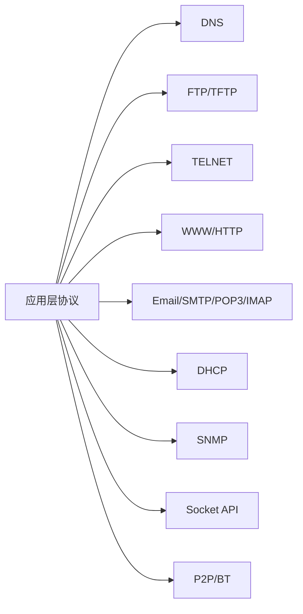
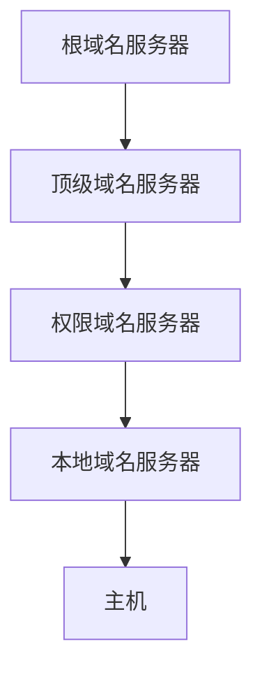

# 总结-第6章-应用层

## 基本信息

- **课程**：计算机网络
- **章节**：第6章 应用层
- **日期**：2026-06-14
- **标签**：#应用层 #DNS #FTP #HTTP #SMTP #DHCP #SNMP #P2P

***

## 章节概览

应用层是OSI模型的最高层，直接为用户应用程序提供服务。本章介绍互联网中最重要的几种应用层协议及其工作原理。



***

## 核心协议速查表

### 协议基本信息对比

| 协议 | 全称 | 运输层协议 | 端口 | 主要功能 |
|:-----|:-----|:----------:|:----:|:---------|
| DNS | 域名系统 | UDP/TCP | 53 | 域名→IP地址解析 |
| FTP | 文件传送协议 | TCP | 21(控制)/20(数据) | 文件传输 |
| TFTP | 简单文件传送协议 | UDP | 69 | 简单文件传输 |
| TELNET | 远程终端协议 | TCP | 23 | 远程登录 |
| HTTP | 超文本传送协议 | TCP | 80 | Web页面传输 |
| HTTPS | 安全的HTTP | TCP | 443 | 加密Web传输 |
| SMTP | 简单邮件传送协议 | TCP | 25 | 发送邮件 |
| POP3 | 邮局协议v3 | TCP | 110 | 读取邮件 |
| IMAP | 网际报文存取协议 | TCP | 143 | 在线邮件管理 |
| DHCP | 动态主机配置协议 | UDP | 67(服务器)/68(客户) | 自动分配IP |
| SNMP | 简单网络管理协议 | UDP | 161(查询)/162(Trap) | 网络管理 |

***

## 各小节核心要点

### 一、DNS 域名系统

**核心功能**：域名 → IP地址的解析系统。

**域名结构**：层次树状结构，从右到左层级降低。



**域名服务器类型**：

| 类型 | 作用 |
|:-----|:-----|
| 根域名服务器 | 知道所有顶级域名服务器的域名和IP |
| 顶级域名服务器 | 管理注册在该顶级域下的二级域名 |
| 权限域名服务器 | 保存管辖区域的域名映射信息 |
| 本地域名服务器 | 代理主机查询，缓存结果 |

**查询方式**：

| 方式 | 特点 |
|:-----|:-----|
| 递归查询 | 本地服务器代替主机继续查询，直到返回最终结果 |
| 迭代查询 | 上级服务器返回下一个应查询的服务器地址 |

**DNS缓存**：减轻根服务器负担，减少查询时延。

---

### 二、FTP 文件传送协议

**核心特点**：使用两条TCP连接。

| 连接 | 端口 | 作用 |
|:-----|:-----|:-----|
| 控制连接 | 21 | 传输命令和响应，整个会话期间保持 |
| 数据连接 | 20 | 传输实际文件数据，传输完即关闭 |

**TFTP**：使用UDP，端口69，适用于简单场景（如路由器固件升级）。

---

### 三、TELNET 远程终端协议

**核心机制**：网络虚拟终端NVT。

- 客户软件将本地终端格式转换为**NVT格式**
- 服务器将NVT格式转换为远程主机格式
- 解决不同系统之间的格式差异

---

### 四、WWW 万维网

**核心组件**：

| 组件 | 说明 |
|:-----|:-----|
| URL | 统一资源定位符，`协议://主机:端口/路径` |
| HTTP | 超文本传输协议，**无状态** |
| HTML | 超文本标记语言 |

**HTTP版本对比**：

| 特性 | HTTP/1.0 | HTTP/1.1 | HTTP/2 |
|:-----|:---------|:---------|:-------|
| 连接方式 | 非持久 | **持久连接** | 持久连接+多路复用 |
| 管道 | 不支持 | 支持 | 支持 |
| 头部压缩 | 无 | 无 | **HPACK压缩** |

**HTTP报文类型**：请求报文、响应报文。

**Cookie机制**：解决HTTP无状态问题，在响应和请求报文中添加Cookie首部字段。

**代理服务器**：缓存热点内容，减少访问时延，节省带宽。

---

### 五、电子邮件

**系统组成**：用户代理UA + 邮件服务器。

**核心协议**：

| 协议 | 作用 | 端口 |
|:-----|:-----|:----:|
| SMTP | 发送邮件，push方式 | 25 |
| POP3 | 读取邮件，pull方式，下载后删除 | 110 |
| IMAP | 在线管理，保留在服务器 | 143 |
| MIME | 支持非ASCII内容 | - |

**SMTP通信三阶段**：建立连接 → 邮件传送 → 连接释放。

---

### 六、DHCP 动态主机配置协议

**核心功能**：即插即用联网，自动获取IP地址等配置。

**工作过程（DORA）**：

```
DHCPDISCOVER(广播) → DHCPOFFER(广播/单播) → DHCPREQUEST(广播) → DHCPACK(广播/单播)
```

**租用期管理**：

| 时间点 | 操作 |
|:-------|:-----|
| T1 = 0.5T | 单播续租请求 |
| T2 = 0.875T | 广播续租请求 |
| T到期 | 释放IP地址 |

**DHCP中继代理**：解决不同网络中的DHCP广播问题。

---

### 七、SNMP 简单网络管理协议

**系统组成**：

| 组件 | 说明 |
|:-----|:-----|
| 管理站 | 运行管理程序，发起查询 |
| 代理 | 运行在被管设备上，响应查询或发送Trap |
| MIB | 管理信息库，被管对象的集合 |
| SMI | 管理信息结构，定义数据类型和语法 |

**操作方式**：

| 方式 | 方向 | 端口 |
|:-----|:-----|:----:|
| 轮询(polling) | 管理站 → 代理 | 161 |
| 陷阱(trap) | 代理 → 管理站 | 162 |

---

### 八、应用进程跨越网络的通信

**核心概念**：套接字(Socket)是应用进程和运输层协议之间的接口。

**TCP服务器系统调用顺序**：
```
socket() → bind() → listen() → accept() → recv()/send() → close()
```

**TCP客户系统调用顺序**：
```
socket() → connect() → send()/recv() → close()
```

**UDP特点**：不使用listen()和accept()。

**并发服务器**：主进程accept()创建新套接字，从属进程处理连接。

---

### 九、P2P应用

**三代P2P文件共享程序对比**：

| 代 | 代表 | 特点 |
|----|------|------|
| 第一代 | Napster | 集中式目录+分散传输 |
| 第二代 | Gnutella | 全分布式，洪泛法查询 |
| 第三代 | BT | 洪流、追踪器、文件块 |

**BT核心机制**：

| 概念 | 说明 |
|------|------|
| 洪流(torrent) | 参与文件分发的对等方集合 |
| 追踪器(tracker) | 跟踪洪流中的对等方 |
| 文件块(chunk) | 典型256KB |
| 最稀有的优先 | 优先请求副本最少的文件块 |
| 已疏通(unchoked) | 接收数据率最高的4个对等方 |

**文件分发时间公式**：

- 客户-服务器：$T_{cs} = \max \{NF/u_s, F/d_{min}\}$（与N成正比）
- P2P：$T_{P2P} \geqslant \max \{F/u_s, F/d_{min}, NF/u_T\}$（增长缓慢）

**DHT和Chord**：
- DHT：分布式散列表
- Chord：环形覆盖网络，指针表加速查找至$O(\log_2 N)$

***

## 考试重点

### ⭐⭐⭐ 必考内容

1. **DNS域名解析过程**（递归 vs 迭代）
2. **FTP双连接**（控制连接21 + 数据连接20）
3. **HTTP无状态**及Cookie机制
4. **SMTP/POP3/IMAP**的作用和区别
5. **DHCP DORA过程**及租用期管理
6. **SNMP轮询和Trap**的端口（161/162）
7. **Socket系统调用顺序**
8. **P2P文件分发时间对比**

### 📌 易混淆点辨析

| 易混点 | 辨析 |
|:-------|:-----|
| **DNS使用UDP还是TCP** | 一般查询用UDP，区传送用TCP |
| **FTP控制连接方向** | 客户→服务器发起，服务器→客户的数据连接是主动方式 |
| **HTTP持久连接** | HTTP/1.1默认持久，Connection: keep-alive |
| **POP3 vs IMAP** | POP3下载后删除，IMAP保留在服务器 |
| **DHCP广播问题** | 不同网络需中继代理转发 |
| **SNMP端口** | 轮询161（代理），Trap162（管理站） |
| **P2P vs C/S** | P2P分发时间增长缓慢，可扩展性好 |

### 📝 常见考题类型

1. **简答题**：
   - DNS域名解析过程（递归+迭代）
   - FTP为什么使用两个连接？
   - HTTP/1.0 vs HTTP/1.1的区别
   - DHCP工作过程及租用期管理
   - SNMP轮询和Trap的区别
   - BT的"最稀有的优先"和"疏通"机制

2. **计算题**：
   - P2P文件分发时间计算（客户-服务器 vs P2P）

3. **选择题/判断题**：
   - DNS使用TCP端口53（部分正确）
   - HTTP是有状态协议（✗，无状态）
   - POP3下载后保留邮件在服务器（✗，默认删除）
   - DHCP使用UDP（✓）
   - SNMP Trap使用端口162（✓）

***

## 相关链接

### 章节笔记

- [第6章-6.1-域名系统DNS](../章节笔记/第6章-应用层/第6章-6.1-域名系统DNS.md)
- [第6章-6.2-文件传送协议](../章节笔记/第6章-应用层/第6章-6.2-文件传送协议.md)
- [第6章-6.3-远程终端协议TELNET](../章节笔记/第6章-应用层/第6章-6.3-远程终端协议TELNET.md)
- [第6章-6.4-万维网WWW](../章节笔记/第6章-应用层/第6章-6.4-万维网WWW.md)
- [第6章-6.5-电子邮件](../章节笔记/第6章-应用层/第6章-6.5-电子邮件.md)
- [第6章-6.6-动态主机配置协议DHCP](../章节笔记/第6章-应用层/第6章-6.6-动态主机配置协议DHCP.md)
- [第6章-6.7-简单网络管理协议SNMP](../章节笔记/第6章-应用层/第6章-6.7-简单网络管理协议SNMP.md)
- [第6章-6.8-应用进程跨越网络的通信](../章节笔记/第6章-应用层/第6章-6.8-应用进程跨越网络的通信.md)
- [第6章-6.9-P2P应用](../章节笔记/第6章-应用层/第6章-6.9-P2P应用.md)

***

*总结创建时间：2026-06-14*
