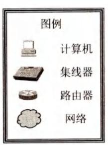
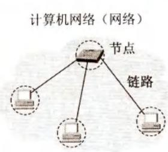
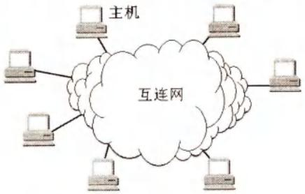
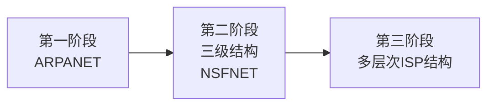
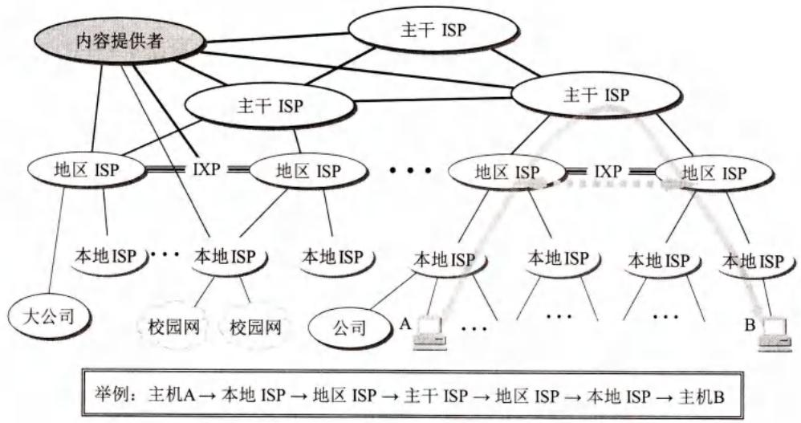
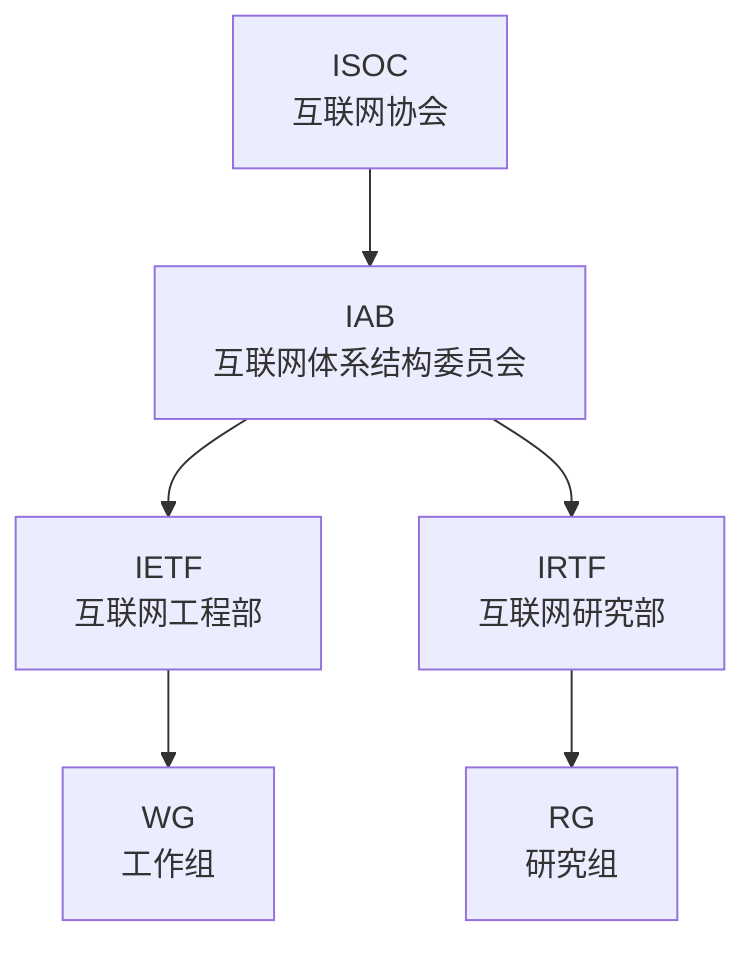
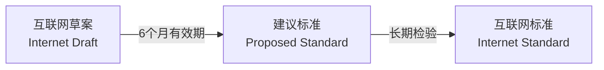

# 第1章-1.2-互联网概述

## 基本信息

- **课程**：计算机网络
- **章节**：第1章 1.2节 互联网概述
- **日期**：2026-06-15
- **标签**：#概述 #互联网 #ARPANET #ISP #IXP #RFC #标准化

***

## 重点内容

### ⭐⭐⭐ 核心概念

1. **网络 = 节点 + 链路**
2. **互连网 = 网络的网络** (network of networks)
3. **互联网发展的三个阶段**：ARPANET → 三级结构(NSFNET) → 多层次ISP
4. **ISP层次**：主干ISP、地区ISP、本地ISP
5. **IXP**：互联网交换点，允许两个网络直接相连交换分组
6. **标准化组织**：ISOC → IAB → IETF/IRTF
7. **RFC文档**：请求评论，互联网标准的形式

### ⭐⭐ 关键问题

- 互连网和互联网的本质区别是什么？
- 为什么互联网从三级结构演变为多层次ISP结构？
- IXP的作用是什么？
- RFC文档如何成为互联网标准？

***

## 详细笔记

### 一、网络、互连网、互联网

#### 📷 图1-1 简单的网络(a)和由网络构成的互连网(b)

> 📚 **课本出处**：图1-1(a) 4个节点3条链路的简单网络；(b) 多个网络通过路由器互连构成互连网。

#### 📷 图1-2 互连网与所连接的主机

> 📚 **课本出处**：图1-2 与网络相连的计算机称为主机(host)，路由器是一种特殊计算机但不能称为主机。智能手机、智能电视也是主机。

**基本概念**：

| 概念 | 定义 |
|:-----|:-----|
| **网络** | 若干节点(node) + 连接节点的链路(link) |
| **节点** | 计算机、集线器、交换机、路由器等 |
| **互连网(internet)** | 多个网络通过路由器连接在一起，"网络的网络" |
| **互联网(Internet)** | 全球最大的、开放的、由众多网络互连而成的特定互连网 |
| **主机(host)** | 与网络相连的计算机（含智能手机、智能电视等） |

**重要区分**：

| 对比项 | 互连网(internet) | 互联网(Internet) |
|:-------|:-----------------|:-----------------|
| 协议 | 可以任意选择 | **必须采用TCP/IP协议族** |
| 范围 | 泛指 | 特指全球最大 |
| 大小写 | 小写i | 大写I |

> 任意把几个计算机网络互连起来（不管用什么协议）能够相互通信，构成的是**互连网**，不是**互联网**。

***

### 二、互联网基础结构发展的三个阶段

#### 第一阶段：从单个网络ARPANET向互连网发展

- **1969年**：美国国防部创建第一个分组交换网ARPANET
- **20世纪70年代中期**：研究多种网络互连技术，出现互连网络
- **1983年**：TCP/IP协议成为ARPANET标准协议 → **互联网诞生时间**
- **1990年**：ARPANET正式宣布关闭（实验任务完成）

#### 第二阶段：三级结构的互联网

- **1985年起**：美国国家科学基金会NSF建设计算机网络NSFNET
- **三级结构**：
  - **主干网**
  - **地区网**
  - **校园网/企业网**
- **1991年**：认识到互联网不应仅限于大学和研究机构
- **1992年**：互联网主机超过100万台
- **1993年**：主干网速率达到45Mbit/s（T3速率）

**为什么用三级结构？**
- 普通校园网/企业网无法实现所有用户互联（投资巨大）
- 地区网完成本地区内各校园网/企业网通信
- 主干网使不同地区用户相互通信

#### 第三阶段：多层次ISP结构的互联网

- **1993年开始**：NSFNET被商用互联网主干网替代
- 出现**互联网服务提供者ISP**(Internet Service Provider)

**ISP的层次**：

| ISP类型 | 特点 | 覆盖范围 |
|:--------|:-----|:---------|
| **主干ISP** | 拥有高速主干网(10Gbit/s+)，十几个 | 国家范围 |
| **地区ISP** | 通过一个或多个主干ISP连接 | 地区范围 |
| **本地ISP** | 给端用户提供直接服务 | 本地范围 |

> 互联网由全世界无数大大小小的ISP共同拥有。

#### 📷 图1-3 具有三层ISP结构的互联网的概念示意图

> 📚 **课本出处**：图1-3 主机A经过不同层次ISP与主机B通信。图中不表示地理位置关系。

#### IXP（互联网交换点）

- **作用**：允许两个网络**直接相连并交换分组**，不需要通过第三个网络转发
- **好处**：
  - 数据流量分布更合理
  - 减少分组转发迟延
  - 降低分组转发费用
  - 对等交换通常互相不收费
- **结构**：一个或多个网络交换机组成，ISP连接到交换机端口
- **统计**：2020年全球1064个IXP，我国32个
- **大型IXP**：德国法兰克福DE-CIX，峰值吞吐量7.72 Tbit/s

**内容提供者(content provider)**：
- 向用户提供视频文件的公司（如Netflix）
- 不提供互联网转接服务，只提供内容服务
- 有独立于互联网的专门网络，与各级ISP和IXP相连

**互联网发展数据**：
- 万维网WWW是互联网指数级增长的主要驱动力
- 数据通信量每月约增加10%
- 2005年用户数超10亿，2010年超20亿，2014年近30亿，2019年3月超43.8亿

***

### 三、互联网的标准化工作

#### 标准化组织层次

| 组织 | 全称 | 职能 |
|:-----|:-----|:-----|
| **ISOC** | Internet Society | 全面管理互联网，促进发展和使用 |
| **IAB** | Internet Architecture Board | 管理互联网有关协议的开发 |
| **IETF** | Internet Engineering Task Force | 短期和中期工程问题，协议开发和标准化 |
| **IRTF** | Internet Research Task Force | 长期问题，协议、应用、体系结构研究 |

#### RFC文档

- **RFC**：Request For Comments，请求评论
- 所有RFC文档可从互联网免费下载
- 任何人可用电子邮件发表意见或建议
- 按发表时间先后编号（RFCxxxx）
- 更新后使用新编号，老编号文档保留供参考
- 2020年8月RFC编号已达8881

#### 互联网标准的制定阶段

| 阶段 | 说明 |
|:-----|:-----|
| **互联网草案** | 有效期6个月，**不算RFC文档** |
| **建议标准** | 成为RFC文档 |
| **互联网标准** | 分配STDxx编号 |

> 2011年10月起取消"草案标准"阶段，简化为：建议标准 → 互联网标准。

**其他RFC文档类型**：
- **历史的**：被取代或未达到成熟等级
- **实验的**：正在实验，不能实用
- **提供信息的**：一般、历史或指导信息

***

## 疑问与思考

### ❓ 待解决问题

#### 1. 互连网和互联网的本质区别是什么？

**📚 课本出处**：第1章 1.2.1节、1.2.2节

| 对比项 | 互连网(internet) | 互联网(Internet) |
|:-------|:-----------------|:-----------------|
| 协议要求 | 可任意选择 | **必须采用TCP/IP** |
| 前身 | 无特定 | 美国ARPANET |
| 性质 | 通用名词 | 专用名词 |
| 关系 | 任意几个网络互连 | 全球最大的特定互连网 |

> 关键区别：**是否采用TCP/IP协议族**。

#### 2. 为什么互联网从三级结构演变为多层次ISP结构？

**📚 课本出处**：第1章 1.2.2节

原因：
1. 互联网上通信量急剧增大，NSFNET容量不够
2. 互联网应扩大使用范围，不应仅限于大学研究机构
3. 公司纷纷接入，需要商业化运营
4. 政府把主干网转交私人公司经营，开始收费

#### 3. IXP的作用和优势？

**📚 课本出处**：第1章 1.2.2节

- **作用**：允许两个网络直接相连交换分组，不经过第三个网络
- **优势**：流量分布合理、减少迟延、降低费用、对等交换不收费

#### 4. RFC文档都能成为互联网标准吗？

**📚 课本出处**：第1章 1.2.3节

**不能**。只有很少部分RFC文档最后能变成互联网标准。需要经过：
1. 互联网草案（6个月，不算RFC）
2. 建议标准（成为RFC）
3. 互联网标准（分配STD编号）

到2019年11月，互联网标准最大编号才STD92，而RFC已达8000+。

### 💡 个人理解

- "网络的网络"这个定义非常精妙：互联网不是单一网络，而是由无数网络通过路由器互连而成。
- ISP分层结构体现了互联网的商业化和去中心化：没有单一组织拥有互联网，而是由无数ISP共同拥有。
- IXP是互联网高效运行的关键基础设施，它让网络之间可以"对等"交换，避免了所有流量都必须经过顶层主干ISP的瓶颈。
- RFC的开放制定方式是互联网成功的关键：任何人都可以参与，任何意见都可以被听到。

***

## 核心考点总结

### ⭐⭐⭐ 必考内容

1. **网络、互连网、互联网**
   - 网络 = 节点 + 链路
   - 互连网 = 网络的网络（通用名词，协议任意）
   - 互联网 = 全球最大的互连网（专用名词，**TCP/IP**）

2. **互联网发展的三个阶段**

| 阶段 | 时间 | 特点 |
|:-----|:-----|:-----|
| 第一阶段 | 1969-1983 | ARPANET，1983年TCP/IP成为标准，**互联网诞生** |
| 第二阶段 | 1985-1993 | 三级结构：主干网→地区网→校园网/企业网(NSFNET) |
| 第三阶段 | 1993至今 | 多层次ISP结构，商业化 |

3. **ISP层次**

| 类型 | 覆盖 | 连接 |
|:-----|:-----|:-----|
| 主干ISP | 国家范围 | 高速主干网 |
| 地区ISP | 地区范围 | 通过主干ISP连接 |
| 本地ISP | 本地范围 | 直接服务用户 |

4. **IXP作用**：两个网络直接相连交换分组，无需第三方

5. **标准化组织**：ISOC → IAB → IETF/IRTF

6. **RFC**：Request For Comments，互联网标准形式
   - 互联网草案（6个月）→ 建议标准（RFC）→ 互联网标准（STD）

### 📌 易混淆点辨析

| 概念 | 说明 |
|:-----|:-----|
| **internet vs Internet** | 通用名词 vs 专用名词，协议任意 vs TCP/IP |
| **ARPANET** | 互联网的前身，1983年TCP/IP成为标准，1990年关闭 |
| **NSFNET** | 三级结构，1993年被商用主干网替代 |
| **ISP** | 互联网服务提供者/提供商 |
| **IXP** | 互联网交换点，对等交换 |
| **IETF vs IRTF** | 工程部（短期/中期）vs 研究部（长期） |
| **RFC vs STD** | RFC是文档形式，STD是标准编号 |

### 📝 常见考题类型

1. **简答题**：
   - 说明网络、互连网、互联网的区别
   - 简述互联网发展的三个阶段
   - 什么是ISP？分哪几个层次？
   - IXP的作用是什么？
   - 说明RFC文档成为互联网标准的过程
2. **选择题/判断题**：
   - 互连网和互联网是同一个概念（✗）
   - 互联网必须采用TCP/IP协议（✓）
   - 1983年是互联网的诞生时间（✓）
   - NSFNET是三级结构（✓）
   - 所有RFC文档都是互联网标准（✗）
   - IXP允许两个网络直接交换分组（✓）
   - 互联网草案有效期6个月（✓）

***

## 相关链接

### 本节涉及图片

- [图1-1 简单的网络和互连网](../../../images/4933b2cb3be49683538c7d7890f5c70ae2c327af9c776f51e8c911ffc6cf5e38.jpg)
- [图1-1(b) 由网络构成的互连网](../../../images/a3dcfdacf75568ea54304141d1d35da876d19a26b607cddab6d23fd1f877376d.jpg)
- [图1-2 互连网与所连接的主机](../../../images/6920190786c929fe5d7731d71433f57f6e60ef87b747cb00b554f5b6b1bfc3c7.jpg)
- [图1-3 具有三层ISP结构的互联网](../../../images/9f4fceca96a935ccc397a4776e6dcb3dee27b055e421988281d238bea294e9f3.jpg)

### 关联章节

- [第1章-1.1-计算机网络在信息时代中的作用](./第1章-1.1-计算机网络在信息时代中的作用.md) - 互联网的基本特点
- [第1章-1.3-互联网的组成](./第1章-1.3-互联网的组成.md) - 边缘部分和核心部分

***

*笔记创建时间：2026-06-15*
