# 第1章-1.3-互联网的组成

## 基本信息

- **课程**：计算机网络
- **章节**：第1章 1.3节 互联网的组成
- **日期**：2026-06-15
- **标签**：#概述 #边缘部分 #核心部分 #分组交换 #电路交换 #P2P #C/S

***

## 重点内容

### ⭐⭐⭐ 核心概念

1. **互联网两大组成**：边缘部分（主机/端系统）+ 核心部分（网络+路由器）
2. **边缘部分两种通信方式**：客户-服务器方式(C/S)、对等连接方式(P2P)
3. **核心部分的关键构件**：路由器，实现分组交换
4. **三种交换方式**：电路交换、报文交换、分组交换
5. **分组交换**：存储转发、动态分配带宽、独立选路
6. **分组交换的优点**：高效、灵活、迅速、可靠

### ⭐⭐⭐ 关键问题

- 电路交换和分组交换的本质区别是什么？
- 为什么分组交换适合传送突发式计算机数据？
- C/S方式和P2P方式的本质区别？
- 分组交换的缺点是什么？

***

## 详细笔记

### 一、互联网的两大组成

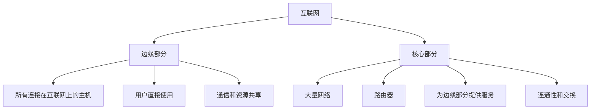

#### 📷 图1-4 互联网的边缘部分与核心部分

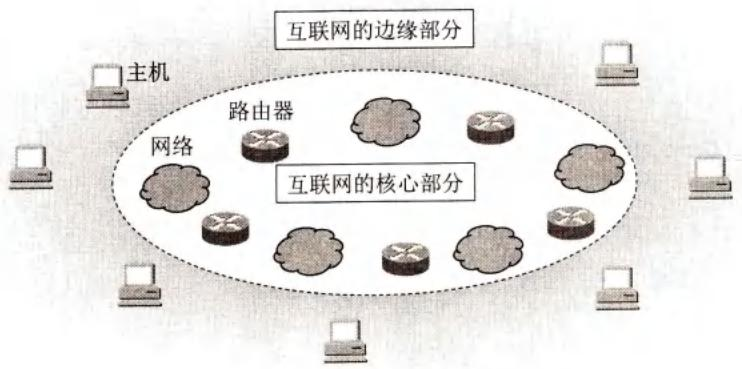

> 📚 **课本出处**：图1-4 边缘部分是用户直接使用的主机，核心部分由网络和路由器组成，为边缘提供服务。

***

### 二、互联网的边缘部分

**端系统(end system)**：连接在互联网上的所有主机，是互联网的末端。
- 小的端系统：个人电脑、智能手机、网络摄像头
- 大的端系统：大型服务器、数据中心（如谷歌有上百个数据中心，每个拥有10万+服务器）

**"主机A和主机B进行通信"**：实际上是运行在主机A上的某个程序和主机B上的另一个程序进行通信，即**进程和进程之间的通信**。

#### 1. 客户-服务器方式 (C/S方式)

#### 📷 图1-5 客户-服务器工作方式

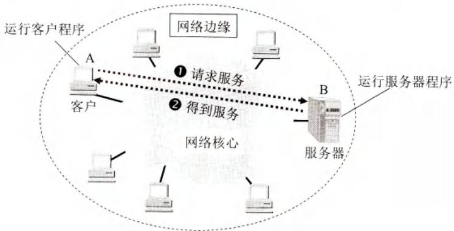

> 📚 **课本出处**：图1-5 主机A运行客户程序，主机B运行服务器程序。客户请求服务，服务器提供服务。

**核心特征**：**客户是服务请求方，服务器是服务提供方**。

| | 客户程序 | 服务器程序 |
|:--|:---------|:-----------|
| 启动方式 | 被用户调用后运行 | 系统启动后一直运行 |
| 通信方式 | **主动**向远地服务器发起通信 | **被动**等待并接受客户请求 |
| 地址 | 必须知道服务器地址 | 不需要知道客户地址 |
| 并发 | 一般一个请求 | 可同时处理多个客户请求 |
| 硬件要求 | 不需要特殊硬件 | 需要强大硬件和高级OS |

> 通信建立后是双向的，双方都可发送和接收数据。

#### 2. 对等连接方式 (P2P方式)

#### 📷 图1-6 对等连接工作方式

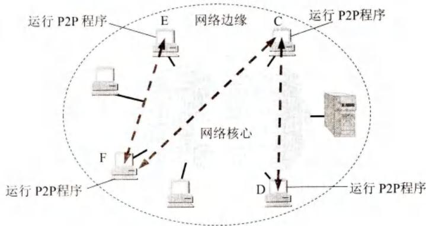

> 📚 **课本出处**：图1-6 运行P2P程序的主机C、D、E、F可进行对等通信，每一台主机既是客户又是服务器。

**核心特征**：不区分服务请求方和服务提供方，**每台主机既是客户又是服务器**。

- 只要两台主机都运行P2P软件，就可以平等通信
- 双方都可以下载对方硬盘中的共享文档
- 可支持大量对等用户（上百万个）同时工作

> P2P方式本质上看仍然使用客户-服务器方式，只是每台主机同时扮演两种角色。

***

### 三、互联网的核心部分

**核心部分起特殊作用的是路由器(router)**：
- 专用计算机（但不叫主机）
- 实现**分组交换(packet switching)**的关键构件
- 任务：**转发收到的分组**

#### 1. 电路交换的主要特点

#### 📷 图1-7 电话机的不同连接方法

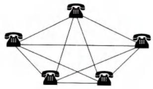

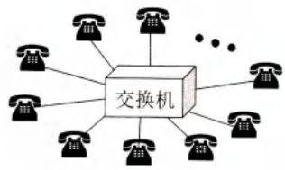

> 📚 **课本出处**：图1-7 N部电话两两相连需N(N-1)/2对电线，使用交换机可大大减少线路数量。

#### 📷 图1-8 电路交换的用户始终占用端到端的通信资源

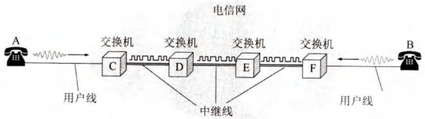

> 📚 **课本出处**：图1-8 电路交换中，通话双方始终占用端到端的通信资源。

**电路交换的三个步骤**：
1. **建立连接**（占用通信资源）
2. **通话**（一直占用通信资源）
3. **释放连接**（归还通信资源）

**电路交换的特点**：
- 通话的全部时间内，两个用户始终占用端到端的通信资源
- 线路传输效率低：计算机数据是突发式的，真正传送数据的时间往往不到10%甚至1%
- 已被占用的线路在绝大部分时间里空闲

#### 2. 分组交换的主要特点

分组交换采用**存储转发技术**。

**分组交换过程**：
1. 把要发送的整块数据（**报文message**）划分为等长数据段
2. 每个数据段前面加上**首部(header)**，构成**分组(packet/包)**
3. 分组在互联网中独立选择传输路径
4. 路由器收到分组，暂时存储，检查首部，查找转发表，转发到下一个路由器
5. 最终交付到目的主机

#### 📷 图1-9 以分组为基本单位在网络中传送

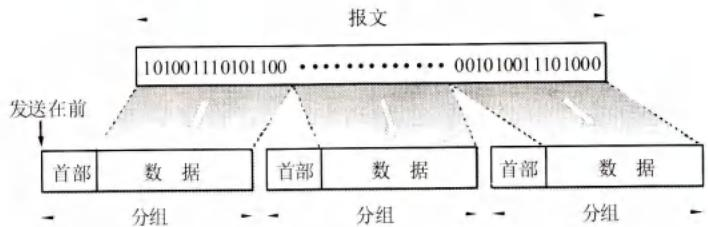

> 📚 **课本出处**：图1-9 长报文划分为等长数据段，加首部后构成分组。

#### 📷 图1-10 分组交换的示意图

**图1-10(a) 核心部分中的路由器把许多网络互连起来**

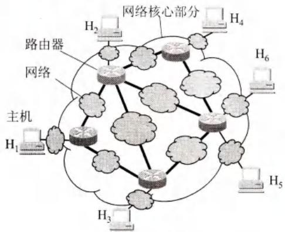

**图1-10(b) 核心部分中的网络可用一条链路表示**

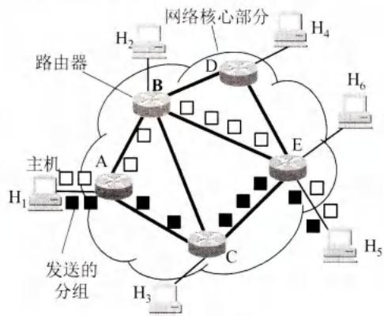

> 📚 **课本出处**：图1-10 路由器之间用高速链路连接，主机接入用相对低速链路。简化图中网络用链路表示。

**分组交换的关键特征**：
- **逐段占用**：分组在哪段链路上传送才占用那段链路的资源
- **动态路由**：某条链路通信量大时，可选择另一条路由
- **缓存转发**：路由器暂存分组在内存中（非磁盘），保证高交换速率
- **无需预先建立连接**：省去建立和释放连接的开销

**分组交换的优点**（表1-1）：

| 优点 | 所采用的手段 |
|:-----|:-------------|
| **高效** | 动态分配传输带宽，对通信链路逐段占用 |
| **灵活** | 为每个分组独立选择最合适的转发路由 |
| **迅速** | 以分组为传送单位，不先建立连接就能发送 |
| **可靠** | 网络协议保证可靠性；分布式多路由，生存性好 |

**分组交换的缺点**：
- 路由器存储转发时需要**排队**，造成时延
- 无法确保通信时端到端所需的**带宽**
- 分组携带的控制信息造成一定的**开销**
- 需要专门的管理和控制机制

#### 3. 三种交换方式的比较

#### 📷 图1-11 三种交换的比较

**图1-11 三种交换的比较**

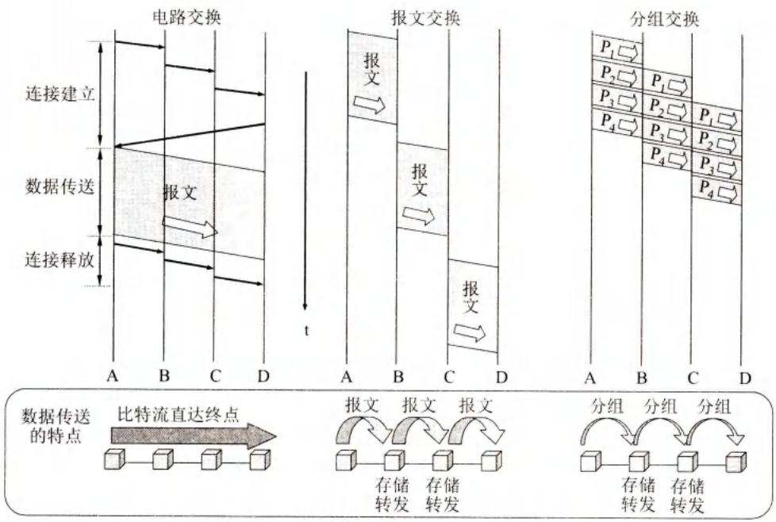

> 📚 **课本出处**：图1-11 电路交换、报文交换、分组交换比较。P1~P4表示4个分组。

**三种交换方式对比**：

| 特性 | 电路交换 | 报文交换 | 分组交换 |
|:-----|:---------|:---------|:---------|
| 建立连接 | 需要 | 不需要 | 不需要 |
| 数据传输 | 连续比特流直达终点 | 整个报文存储转发 | 分组存储转发 |
| 资源占用 | 始终占用端到端资源 | 逐段占用 | 逐段占用 |
| 适用场景 | 连续大量数据（话音） | 早期电报（现已不用） | 突发式计算机数据 |
| 时延 | 小（建立连接后） | 大（分钟到小时） | 较小 |
| 灵活性 | 差 | 一般 | 好 |
| 可靠性 | 一般 | 一般 | 好 |

**选择建议**：
- 连续传送大量数据且传送时间远大于连接建立时间 → **电路交换**传输速率较快
- 传送突发数据 → **分组交换**可提高信道利用率
- 分组交换比报文交换时延小、灵活性好

> 从4G开始，无论是话音还是数据通信，都采用**分组交换**。

***

## 疑问与思考

### ❓ 待解决问题

#### 1. 电路交换和分组交换的本质区别是什么？

**📚 课本出处**：第1章 1.3.2节

| 对比项 | 电路交换 | 分组交换 |
|:-------|:---------|:---------|
| 资源分配 | 静态，预先分配端到端资源 | 动态，逐段占用 |
| 连接 | 必须先建立连接 | 无需预先建立连接 |
| 数据传送 | 连续比特流 | 离散的分组 |
| 效率 | 低（空闲时浪费资源） | 高（逐段动态分配） |
| 适合数据 | 连续的话音通信 | 突发的计算机数据 |

#### 2. 为什么分组交换适合传送突发式计算机数据？

**📚 课本出处**：第1章 1.3.2节

计算机数据的特点是**突发性**：数据在短时间内集中出现，随后长时间空闲。

- 电路交换：即使空闲也占用资源，利用率极低（<10%）
- 分组交换：只在传送分组时占用链路资源，空闲时资源可给其他用户使用
- 动态分配带宽使得信道利用率大大提高

#### 3. C/S方式和P2P方式的本质区别？

**📚 课本出处**：第1章 1.3.1节

| 对比项 | C/S方式 | P2P方式 |
|:-------|:--------|:--------|
| 角色区分 | 明确区分客户和服务器 | 不区分，平等对等 |
| 服务请求 | 客户主动请求 | 任何一方都可请求 |
| 服务提供 | 服务器被动提供 | 任何一方都可提供 |
| 依赖 | 依赖服务器 | 不依赖中央服务器 |
| 本质 | 一方服务另一方 | 本质是C/S的对等化 |

#### 4. 分组交换有哪些缺点？

**📚 课本出处**：第1章 1.3.2节

1. **排队时延**：路由器存储转发需要排队
2. **带宽不确定**：无法确保端到端带宽
3. **开销**：每个分组都要携带首部控制信息
4. **管理复杂**：需要专门的管理和控制机制

### 💡 个人理解

- 互联网的设计哲学：边缘智能，核心简单。边缘部分的主机负责处理信息，核心部分的路由器只负责转发分组。
- 分组交换是互联网成功的关键技术：它使得互联网可以灵活、高效、可靠地传输数据。
- 电路交换虽然适合话音通信，但面对数据通信的突发特性显得低效。现代通信网全面转向分组交换是必然趋势。
- P2P方式体现了互联网的分布式精神：没有中心节点，每个节点既是消费者也是提供者。

***

## 核心考点总结

### ⭐⭐⭐ 必考内容

1. **互联网两大组成**

| 组成 | 构成 | 功能 |
|:-----|:-----|:-----|
| **边缘部分** | 所有连接在互联网上的主机（端系统） | 用户直接使用，通信和资源共享 |
| **核心部分** | 大量网络 + 路由器 | 为边缘部分提供连通性和交换 |

2. **边缘部分两种通信方式**

| 方式 | C/S方式 | P2P方式 |
|:-----|:--------|:--------|
| 角色 | 客户=请求方，服务器=提供方 | 既是客户又是服务器 |
| 通信 | 客户主动发起 | 平等对等 |
| 依赖 | 依赖服务器 | 不依赖中央服务器 |

3. **三种交换方式对比**

| 方式 | 建立连接 | 数据传送 | 资源占用 | 适用场景 |
|:-----|:---------|:---------|:---------|:---------|
| **电路交换** | 需要 | 连续比特流直达 | 端到端始终占用 | 话音通信 |
| **报文交换** | 不需要 | 整个报文存储转发 | 逐段占用 | 已淘汰 |
| **分组交换** | 不需要 | 分组存储转发 | 逐段占用 | 数据通信 |

4. **分组交换的优点**：高效、灵活、迅速、可靠

5. **分组交换的关键**：存储转发、首部包含目的地址、独立选路、逐段占用资源

6. **路由器的作用**：转发分组，是分组交换的关键构件

### 📌 易混淆点辨析

| 概念 | 说明 |
|:-----|:-----|
| **端系统** | 连接在互联网上的主机，包括计算机、智能手机等 |
| **主机通信** | 实际是进程和进程之间的通信 |
| **客户/服务器** | 指通信中的两个应用进程（软件），不是机器 |
| **分组首部** | 包含目的地址、源地址等控制信息，使分组能独立选路 |
| **存储转发** | 路由器先存储分组，查表后再转发 |
| **电路交换效率低** | 计算机数据突发式，空闲时资源被浪费 |
| **分组交换效率高** | 只在传送时占用资源，动态分配带宽 |

### 📝 常见考题类型

1. **简答题**：
   - 互联网由哪两部分组成？各有什么作用？
   - 说明C/S方式和P2P方式的区别
   - 比较电路交换、报文交换、分组交换
   - 为什么分组交换适合计算机数据通信？
   - 分组交换有哪些优点和缺点？
   - 路由器在互联网核心部分的作用是什么？
2. **选择题/判断题**：
   - 互联网的边缘部分由路由器组成（✗，是主机）
   - 核心部分为边缘部分提供连通性和交换（✓）
   - P2P方式中主机只作为客户（✗，既是客户又是服务器）
   - 电路交换需要预先建立连接（✓）
   - 分组交换采用存储转发技术（✓）
   - 分组交换中每个分组独立选择路由（✓）
   - 电路交换适合传送突发式计算机数据（✗）
   - 从4G开始话音通信也采用分组交换（✓）

***

## 相关链接

### 本节涉及图片

- [图1-4 互联网的边缘部分与核心部分](../../../images/b6969c66de71fef230ae57cbd29c6a74dce79b57a2fd29eaf12fd2abd57e1c93.jpg)
- [图1-5 客户-服务器工作方式](../../../images/c7e78829e10866e2c469be5c58d5070c4a7c813c8013dbe6d2788148b9acd03c.jpg)
- [图1-6 对等连接工作方式](../../../images/a28bc4922ada6f2c5b74396fed70d3e04cad9e8550512660282fc6e5df6dbb5d.jpg)
- [图1-7 电话机的不同连接方法](../../../images/fb4095c84f505288cd068542f198f90655455dc520b850565f2330bebdf38310.jpg)
- [图1-8 电路交换](../../../images/1d4854fa58f99132f0af6b2fd16dd2d335826ee028f55b2a4cc70b3fe920945c.jpg)
- [图1-9 以分组为基本单位在网络中传送](../../../images/7ff4ede82289b7a583942e296d3b7a8d431af1e8da4f2ffc3dbe2d5ad3a6e2cf.jpg)
- [图1-10(a) 核心部分中的路由器把许多网络互连起来](../../../images/2e28f39dc16ee979e7a05c455af2b9dea96c2342c50f0ea0e6452f53226cf307.jpg)
- [图1-10(b) 核心部分中的网络可用一条链路表示](../../../images/7e3eb916cccdd99f6b379bf311b8d9b158d787539d9abaa312317b9c2df70df2.jpg)
- [图1-11 三种交换的比较](../../../images/d6654e0d47aa019cd745c4223135dff7614815f1de3b7f0b6008c5fc49081960.jpg)

### 关联章节

- [第1章-1.2-互联网概述](./第1章-1.2-互联网概述.md) - ISP、IXP
- [第4章-网络层](../第4章-网络层/第4章-4.1-网络层的几个重要概念.md) - 路由器的详细工作原理
- [第6章-应用层](../第6章-应用层/第6章-6.9-P2P应用.md) - P2P应用的详细介绍

***

*笔记创建时间：2026-06-15*
