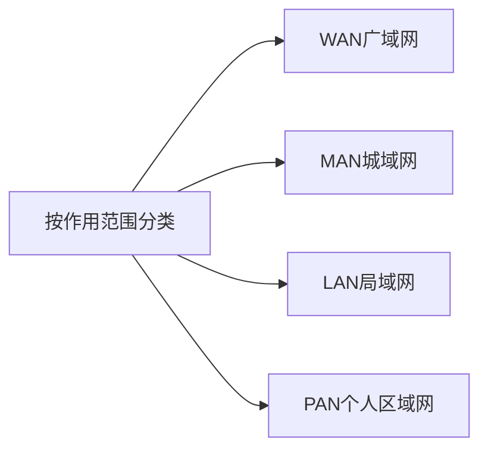

# 第1章-1.5-计算机网络的类别

## 基本信息

- **课程**：计算机网络
- **章节**：第1章 1.5节 计算机网络的类别
- **日期**：2026-06-15
- **标签**：#概述 #WAN #MAN #LAN #PAN #公用网 #专用网 #接入网

***

## 重点内容

### ⭐⭐ 核心概念

1. **计算机网络定义**：通用、可编程的硬件互连而成，能传送多种数据，支持广泛应用
2. **按作用范围分类**：WAN、MAN、LAN、PAN
3. **按使用者分类**：公用网、专用网
4. **接入网(AN)**：把用户接入到互联网的网络

***

## 详细笔记

### 一、计算机网络的定义

**较好的定义**：
> 计算机网络主要是由一些通用的、可编程的硬件互连而成的，而这些硬件并非专门用来实现某一特定目的。这些可编程的硬件能够用来传送多种不同类型的数据，并能支持广泛的和日益增长的应用。

**定义的要点**：
- 所连接的硬件不限于计算机，包括智能手机、智能电视等
- 并非专门用来传送数据，能支持多种应用
- "可编程的硬件"表明一定包含有**CPU**

> 本书不使用"计算机通信网"这一名词，因为容易误认为专门为了通信而设计。

### 二、按网络的作用范围分类

| 类型 | 英文 | 作用范围 | 特点 |
|:-----|:-----|:---------|:-----|
| **广域网** | WAN (Wide Area Network) | 几十到几千公里 | 互联网核心部分，长距离通信，高速链路 |
| **城域网** | MAN (Metropolitan Area Network) | 5~50 km，一个城市 | 连接多个局域网，很多采用以太网技术 |
| **局域网** | LAN (Local Area Network) | 约1 km左右 | 微型计算机或工作站通过高速线路相连，速率10Mbit/s+ |
| **个人区域网** | PAN (Personal Area Network) / WPAN | 约10 m左右 | 个人电子设备用无线技术连接 |

**注意**：
- 若中央处理机距离非常近（约1米或更小），称为**多处理机系统**，不是计算机网络
- 现在很多城域网采用以太网技术，有时并入局域网讨论

### 三、按网络的使用者分类

| 类型 | 说明 | 示例 |
|:-----|:-----|:-----|
| **公用网** | 电信公司出资建造，按规定交费即可使用 | 公众网 |
| **专用网** | 某部门为满足特殊业务需要建造，不对外服务 | 军队、铁路、银行、电力等系统 |

### 四、接入网 AN (Access Network)

- 又称为**本地接入网**或**居民接入网**
- 作用：把用户接入到互联网
- 组成：端系统连接到本地ISP第一个路由器（边缘路由器）之间的物理链路
- 覆盖范围：几百米到几公里
- 很多接入网属于局域网
- 作用：起到让用户与互联网连接的"桥梁"作用

> 发展初期多用电话线拨号接入，速率很低。现在宽带接入技术成为热门课题（第2章2.6节讨论）。

***

## 核心考点总结

### ⭐⭐ 必考内容

1. **四种网络按作用范围分类**

| 类型 | 范围 | 英文 |
|:-----|:-----|:-----|
| 广域网 | 几十到几千公里 | WAN |
| 城域网 | 5~50 km | MAN |
| 局域网 | 约1 km | LAN |
| 个人区域网 | 约10 m | PAN/WPAN |

2. **公用网 vs 专用网**

| 类型 | 出资方 | 使用范围 |
|:-----|:-------|:---------|
| 公用网 | 电信公司 | 公众按规定交费使用 |
| 专用网 | 某部门 | 本单位内部使用 |

3. **接入网(AN)**：用户接入互联网的"桥梁"

### 📝 常见考题类型

1. **选择题**：
   - 局域网的作用范围大约是？（1 km左右）
   - 互联网的核心部分是？（广域网）
   - 个人区域网的范围大约是？（10 m）
   - 军队使用的网络属于？（专用网）
2. **填空题**：
   - WAN的中文名称是____。（广域网）
   - 接入网的英文缩写是____。（AN）

***

## 相关链接

### 关联章节

- [第1章-1.2-互联网概述](./第1章-1.2-互联网概述.md) - ISP、互联网结构
- [第3章-3.3-使用广播信道的数据链路层](../第3章-数据链路层/第3章-3.3-使用广播信道的数据链路层.md) - 局域网

***

*笔记创建时间：2026-06-15*
