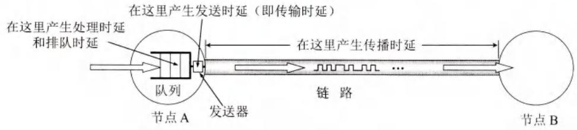
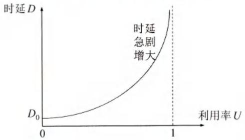

# 第1章-1.6-计算机网络的性能

## 基本信息

- **课程**：计算机网络
- **章节**：第1章 1.6节 计算机网络的性能
- **日期**：2026-06-15
- **标签**：#概述 #性能指标 #时延 #带宽 #吞吐量 #RTT #利用率

***

## 重点内容

### ⭐⭐⭐ 核心概念

1. **七个性能指标**：速率、带宽、吞吐量、时延、时延带宽积、往返时间RTT、利用率
2. **四种时延**：发送时延、传播时延、处理时延、排队时延
3. **总时延公式**：总时延 = 发送时延 + 传播时延 + 处理时延 + 排队时延
4. **时延带宽积**：传播时延 × 带宽，表示链路可容纳的比特数
5. **利用率与时延关系**：$D = \frac{D_0}{1-U}$，利用率接近1时时延趋于无穷大
6. **发送时延 vs 传播时延**：发生地点不同，与不同因素有关

### ⭐⭐⭐ 关键公式

- 发送时延 = 数据帧长度(bit) / 发送速率(bit/s)
- 传播时延 = 信道长度(m) / 电磁波传播速率(m/s)
- 时延带宽积 = 传播时延 × 带宽
- 有效数据率 = 数据长度 / (发送时间 + RTT)
- $D = \frac{D_0}{1-U}$

***

## 详细笔记

### 一、性能指标

#### 1. 速率

- **定义**：数据的传送速率，也称数据率(data rate)或比特率(bit rate)
- **单位**：bit/s (bps)
- **常用单位**：

| 单位 | 数值 | 中文 |
|:-----|:-----|:-----|
| k (kilo) | $10^3$ | 千 |
| M (Mega) | $10^6$ | 兆 |
| G (Giga) | $10^9$ | 吉 |
| T (Tera) | $10^{12}$ | 太 |
| P (Peta) | $10^{15}$ | 拍 |

> 注意：网络速率通常指**额定速率**或**标称速率**，并非实际运行速率。

#### 2. 带宽

**两种含义**：

| 含义 | 说明 | 单位 |
|:-----|:-----|:-----|
| **频域称谓** | 信号包含的频率范围 | Hz (kHz, MHz, GHz) |
| **时域称谓** | 单位时间内信道能通过的最高数据率 | bit/s |

> 本书中"带宽"主要指时域含义，即**最高数据率**。

**本质**：带宽越宽，最高数据率越高。

#### 3. 吞吐量

- **定义**：单位时间内通过某个网络的实际数据量
- **特点**：
  - 受网络带宽或额定速率限制
  - 实际吞吐量通常远低于额定速率
  - 取决于互联网的流量分布

**示例**：
- 1Gbit/s以太网，实际吞吐量可能只有100Mbit/s
- 主机A(100Mbit/s)与服务器B(1Gbit/s)通信，吞吐量 = 100Mbit/s（瓶颈）
- 100个用户同时连接服务器B，每个用户平均10Mbit/s

#### 4. 时延

**四种时延**：

##### (1) 发送时延（传输时延）

$$\text{发送时延} = \frac{\text{数据帧长度(bit)}}{\text{发送速率(bit/s)}}$$

- 发生在机器内部的**发送器**中（网络适配器）
- 与信道长度**无关**
- 与帧长成正比，与发送速率成反比

##### (2) 传播时延

$$\text{传播时延} = \frac{\text{信道长度(m)}}{\text{电磁波传播速率(m/s)}}$$

- 发生在机器外部的**传输信道媒体**上
- 与发送速率**无关**
- 距离越远，传播时延越大

**电磁波传播速率**：

| 介质 | 传播速率 |
|:-----|:---------|
| 自由空间（光速） | $3.0 \times 10^5$ km/s |
| 铜线电缆 | 约 $2.3 \times 10^5$ km/s |
| 光纤 | 约 $2.0 \times 10^5$ km/s |

> 1000 km光纤传播时延约 **5 ms**

##### (3) 处理时延

- 路由器收到分组后进行处理的时延
- 包括：分析首部、提取数据、差错检验、查找转发表等

##### (4) 排队时延

- 分组在路由器输入/输出队列中排队等待的时延
- 取决于网络当时的通信量
- 通信量大时可能队列溢出，分组丢失（排队时延无穷大）

**总时延**：

$$\text{总时延} = \text{发送时延} + \text{传播时延} + \text{处理时延} + \text{排队时延}$$

#### 📷 图1-12 几种时延产生的地方不一样

> 📚 **课本出处**：图1-12 发送时延发生在发送器，传播时延发生在传输媒体上。

**发送时延 vs 传播时延的区别**（重要！）：

| | 发送时延 | 传播时延 |
|:--|:---------|:---------|
| **发生地点** | 机器内部的发送器 | 机器外部的传输媒体 |
| **与距离关系** | 无关 | 距离越远越大 |
| **与速率关系** | 发送速率越高越小 | 无关 |
| **比喻** | 车队过收费站的时间 | 车队在公路上行驶的时间 |

**重要结论**：
- 不能笼统认为"发送速率越高，总时延越小"
- 当数据量很小（如1字节）时，传播时延占主导
- 提高发送速率只减小发送时延，不改变传播时延
- "光纤信道的传输速率高"是指可用很高的速率发送数据，但光纤中的**传播速率**比铜线还略低

#### 5. 时延带宽积

$$\text{时延带宽积} = \text{传播时延} \times \text{带宽}$$

#### 📷 图1-13 链路像一条空心管道

> 📚 **课本出处**：图1-13 管道长度=传播时延，截面积=带宽，体积=时延带宽积。

**物理意义**：
- 表示链路可容纳的**比特数**
- 又称为**以比特为单位的链路长度**
- 链路充满比特时，才得到最充分利用

**示例**：传播时延20ms，带宽10Mbit/s
$$\text{时延带宽积} = 20 \times 10^{-3} \times 10 \times 10^6 = 2 \times 10^5 \text{ bit}$$
即第一个比特即将到达终点时，发送端已发送20万个比特。

#### 6. 往返时间 RTT

- **定义**：双向交互一次所需的时间
- **应用**：A发送数据，B收到后立即发送确认，A等待的时间
- **有效数据率**：

$$\text{有效数据率} = \frac{\text{数据长度}}{\text{发送时间} + \text{RTT}}$$

**示例**：数据100MB，发送速率100Mbit/s，RTT=2s
- 发送时间 ≈ 8.39s
- 有效数据率 ≈ 80.7 Mbit/s（小于100Mbit/s）

> RTT还包括中间节点的处理时延、排队时延和转发发送时延。卫星通信时RTT较长。

#### 7. 利用率

**两种利用率**：
- **信道利用率**：某信道有百分之几的时间被利用
- **网络利用率**：全网络信道利用率的加权平均值

**利用率与时延的关系**：

$$D = \frac{D_0}{1-U}$$

- $D_0$：网络空闲时的时延
- $D$：当前时延
- $U$：网络利用率（0~1）

| 利用率U | 时延D |
|:--------|:------|
| 0 | $D_0$（最小） |
| 0.5 | $2D_0$（加倍） |
| 0.9 | $10D_0$ |
| →1 | →∞（趋于无穷大） |

#### 📷 图1-14 时延与利用率的关系

> 📚 **课本出处**：图1-14 利用率接近1时，时延趋于无穷大。

**重要结论**：
- 信道/网络利用率**并非越高越好**
- 利用率过高会产生非常大的时延
- 大型ISP通常控制信道利用率**不超过50%**，超过就扩容

***

### 二、非性能特征

| 特征 | 说明 |
|:-----|:-----|
| **费用** | 性能越高，价格越高 |
| **质量** | 取决于构件质量和组网方式，影响可靠性、管理简易性 |
| **标准化** | 最好采用国际标准，便于互操作、升级、维修 |
| **可靠性** | 与质量和性能都有关，高速网络可靠性更难保证 |
| **可扩展性和可升级性** | 考虑未来规模扩大和性能提高 |
| **易于管理和维护** | 良好管理才能达到和保持设计性能 |

***

## 疑问与思考

### ❓ 待解决问题

#### 1. 发送时延和传播时延有什么区别？

**📚 课本出处**：第1章 1.6.1节

| | 发送时延 | 传播时延 |
|:--|:---------|:---------|
| 发生地点 | 机器内部发送器 | 机器外部传输媒体 |
| 与距离 | 无关 | 距离越远越大 |
| 与发送速率 | 速率越高越小 | 无关 |
| 比喻 | 车队过收费站 | 车队在公路行驶 |

#### 2. 为什么提高发送速率不一定减小总时延？

**📚 课本出处**：第1章 1.6.1节

总时延由四项组成：发送时延 + 传播时延 + 处理时延 + 排队时延

- 当数据量很大时，发送时延占主导，提高速率可显著减小总时延
- 当数据量很小时（如1字节），传播时延占主导，提高发送速率几乎不影响总时延

**示例**：1字节数据，传播时延5ms
- 1Mbit/s：发送时延8μs，总时延≈5ms
- 1Gbit/s：发送时延0.008μs，总时延仍≈5ms

#### 3. 为什么信道利用率不是越高越好？

**📚 课本出处**：第1章 1.6.1节

根据公式 $D = \frac{D_0}{1-U}$：
- U=0.5时，D=2D₀（时延加倍）
- U=0.9时，D=10D₀
- U→1时，D→∞

类比高速公路：车流量大时堵塞，行车时间变长。网络也一样，通信量大时分组排队，时延增大。

#### 4. 时延带宽积的物理意义是什么？

**📚 课本出处**：第1章 1.6.1节

时延带宽积 = 传播时延 × 带宽，表示：
- 链路中**正在传输但尚未到达接收端**的比特数
- 以比特为单位的**链路长度**
- 只有管道充满比特时，链路才最充分利用

### 💡 个人理解

- 理解时延的四个组成部分是分析网络性能的基础。实际中，处理时延和排队时延往往难以精确计算。
- 发送时延和传播时延是最容易混淆的概念。记住：发送时延在"机器内"，传播时延在"线路上"。
- 时延带宽积是一个很有用的概念，它告诉我们链路中"飞行中"的数据量。
- 利用率公式 $D = D_0/(1-U)$ 是排队论的结果，实际网络更复杂，但这个公式定性地说明了利用率不能太高。

***

## 核心考点总结

### ⭐⭐⭐ 必考内容

1. **七个性能指标**

| 指标 | 定义 | 单位 |
|:-----|:-----|:-----|
| 速率 | 数据传送速率 | bit/s |
| 带宽 | 最高数据率 | bit/s |
| 吞吐量 | 实际通过的数据量 | bit/s或字节/s |
| 时延 | 数据从一端到另一端的时间 | s |
| 时延带宽积 | 传播时延×带宽 | bit |
| RTT | 往返时间 | s |
| 利用率 | 信道被利用的时间比例 | 0~1 |

2. **四种时延**

| 时延 | 公式 | 发生地点 |
|:-----|:-----|:---------|
| 发送时延 | 数据帧长度/发送速率 | 机器内部发送器 |
| 传播时延 | 信道长度/电磁波传播速率 | 传输媒体 |
| 处理时延 | - | 路由器处理 |
| 排队时延 | - | 路由器队列 |

3. **重要公式**

$$\text{总时延} = \text{发送时延} + \text{传播时延} + \text{处理时延} + \text{排队时延}$$

$$D = \frac{D_0}{1-U}$$

4. **关键结论**
   - 发送时延与信道长度无关，传播时延与发送速率无关
   - 光纤传播速率比铜线略低（约20万km/s vs 23万km/s）
   - 利用率接近1时时延趋于无穷大
   - ISP通常控制利用率不超过50%

### 📌 易混淆点辨析

| 概念 | 说明 |
|:-----|:-----|
| **速率 vs 带宽** | 速率是实际/额定速率，带宽是最高能力 |
| **发送时延 vs 传播时延** | 机器内 vs 线路上；与距离无关 vs 与距离有关 |
| **带宽(频域) vs 带宽(时域)** | 频率范围(Hz) vs 最高数据率(bit/s) |
| **时延带宽积** | 链路中"飞行中"的比特数 |
| **利用率** | 不是越高越好，超过50%就要考虑扩容 |

### 📝 常见考题类型

1. **计算题**：
   - 计算发送时延、传播时延、总时延
   - 计算时延带宽积
   - 计算有效数据率
   - 利用 $D = D_0/(1-U)$ 计算时延
2. **简答题**：
   - 说明四种时延的区别
   - 为什么提高发送速率不一定减小总时延？
   - 为什么信道利用率不是越高越好？
   - 时延带宽积的物理意义是什么？
3. **选择题/判断题**：
   - 发送时延与信道长度有关（✗）
   - 传播时延与发送速率有关（✗）
   - 光纤中的传播速率比铜线高（✗，略低）
   - 时延带宽积表示链路可容纳的比特数（✓）
   - 利用率越高时延越小（✗）
   - 网络利用率达到50%时，时延加倍（✓）

***

## 相关链接

### 本节涉及图片

- [图1-12 几种时延产生的地方不一样](../../../images/6683d999ffb7aba456eb32f1c9f9121d34ce90a5a5225d5bc945e14de8f42982.jpg)
- [图1-13 链路像一条空心管道](../../../images/21f4c957a0e18448d8ee5c6caef8548109afdb691caa974b1da66cae82e098c1.jpg)
- [图1-14 时延与利用率的关系](../../../images/d553fabd839c5f7bdda3af691c5af4f5b42b5a354683d992cee01f18888c5746.jpg)

### 关联章节

- [第1章-1.3-互联网的组成](./第1章-1.3-互联网的组成.md) - 分组交换的时延分析
- [第5章-运输层](../第5章-运输层/第5章-5.1-运输层协议概述.md) - RTT在TCP中的应用

***

*笔记创建时间：2026-06-15*
