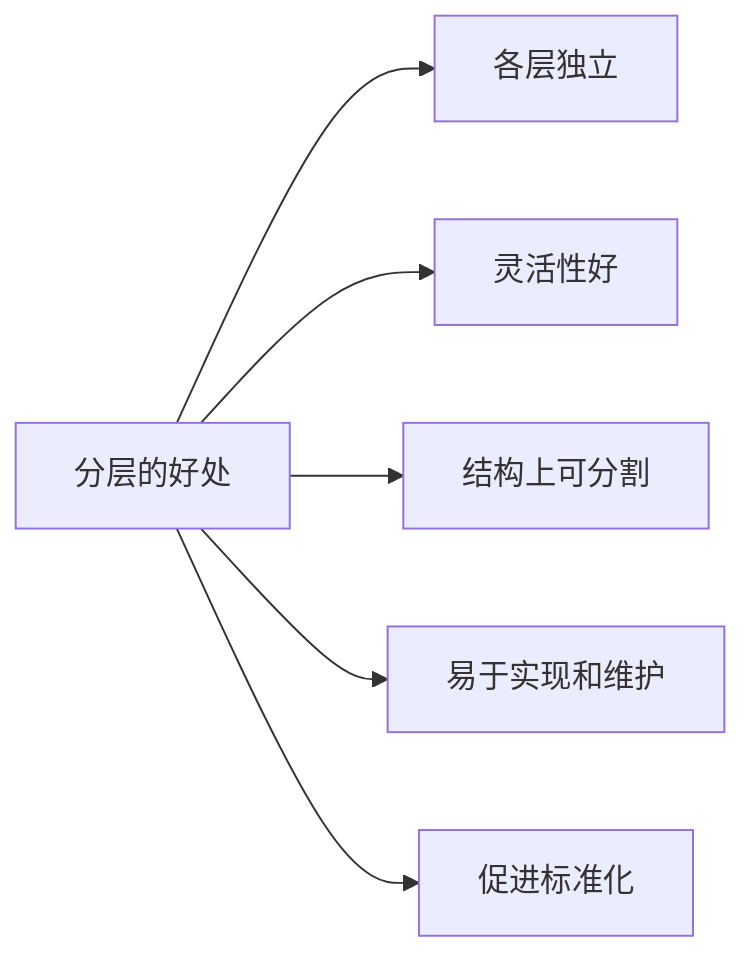
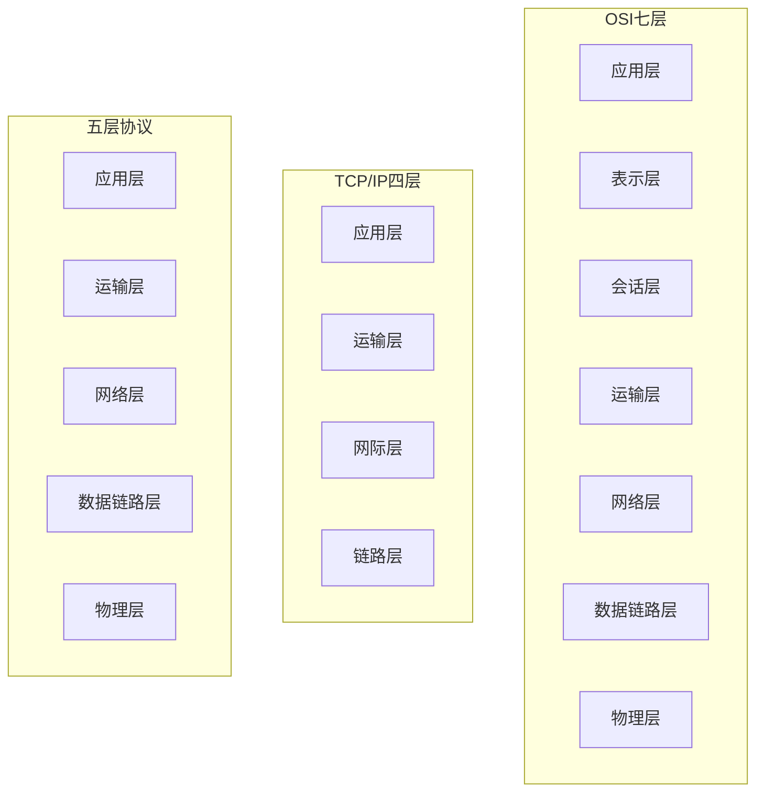

# 第1章-1.7-计算机网络体系结构

## 基本信息

- **课程**：计算机网络
- **章节**：第1章 1.7节 计算机网络体系结构
- **日期**：2026-06-15
- **标签**：#概述 #体系结构 #OSI #TCP/IP #五层协议 #协议 #服务 #实体 #SAP

***

## 重点内容

### ⭐⭐⭐ 核心概念

1. **协议三要素**：语法、语义、同步
2. **分层的好处**：独立、灵活、可分割、易于实现、促进标准化
3. **五层体系结构**：应用层、运输层、网络层、数据链路层、物理层
4. **OSI七层**：物理层、数据链路层、网络层、运输层、会话层、表示层、应用层
5. **TCP/IP四层**：链路层、网际层、运输层、应用层
6. **协议是水平的，服务是垂直的**
7. **实体、协议、服务、SAP、SDU、PDU**
8. **TCP/IP的沙漏形状**：everything over IP，IP over everything

***

## 详细笔记

### 一、计算机网络体系结构的形成

#### OSI/RM（开放系统互连基本参考模型）

- **提出者**：国际标准化组织ISO，1977年成立专门机构研究
- **时间**：1983年形成正式文件ISO 7498
- **层次**：七层协议体系结构
- **目标**：使各种计算机在世界范围内互连成网

**OSI失败的原因**：

| 原因 | 说明 |
|:-----|:-----|
| 缺乏实际经验 | 专家缺乏商业驱动力 |
| 过于复杂 | 协议实现复杂，运行效率低 |
| 制定周期长 | 设备无法及时进入市场 |
| 层次划分不合理 | 有些功能在多个层次重复出现 |

**现状**：
- OSI只获得理论研究成果，市场化失败
- **TCP/IP成为事实上的国际标准**
- 现在许多公司加入标准化组织，技术标准有浓厚商业气息

> 能够占领市场的就是标准。

### 二、协议与划分层次

#### 网络协议的三要素

| 要素 | 说明 | 类比 |
|:-----|:-----|:-----|
| **语法** | 数据与控制信息的结构或格式 | 怎么写 |
| **语义** | 需要发出何种控制信息，完成何种动作以及做出何种响应 | 什么意思 |
| **同步** | 事件实现顺序的详细说明 | 什么时候做 |

#### 分层的好处

1. **各层之间是独立的**：某层只需知道下层通过接口提供的服务
2. **灵活性好**：某层变化时，只要接口不变，上下层不受影响
3. **结构上可分割开**：各层可采用最合适的技术实现
4. **易于实现和维护**：复杂系统分解为相对独立的子系统
5. **能促进标准化工作**：每层功能和服务有精确说明

#### 各层要完成的功能

| 功能 | 说明 |
|:-----|:-----|
| **差错控制** | 使对等方通信更加可靠 |
| **流量控制** | 发送端速率使接收端来得及接收 |
| **分段和重装** | 发送端划分数据块，接收端还原 |
| **复用和分用** | 多个高层会话复用一条低层连接 |
| **连接建立和释放** | 交换数据前建立逻辑连接，结束后释放 |

#### 体系结构 vs 实现

| | 体系结构(architecture) | 实现(implementation) |
|:--|:-----------------------|:---------------------|
| 性质 | **抽象的** | **具体的** |
| 内容 | 各层及其协议的集合，功能的精确定义 | 真正运行的计算机硬件和软件 |
| 类比 | 建筑风格 | 具体的建筑物 |

### 三、具有五层协议的体系结构

#### 📷 图1-16 计算机网络体系结构

> 📚 **课本出处**：图1-16 (a)OSI七层 (b)TCP/IP四层 (c)五层协议（教学用）。

#### 三种体系结构对比

#### 五层协议各层功能

| 层次 | 名称 | 主要功能 | 数据单元 | 重要协议 |
|:-----|:-----|:---------|:---------|:---------|
| 第5层 | **应用层** | 通过应用进程交互完成特定网络应用 | 报文(message) | DNS, HTTP, SMTP |
| 第4层 | **运输层** | 为两台主机进程间通信提供通用数据传输服务 | 报文段(TCP)/用户数据报(UDP) | TCP, UDP |
| 第3层 | **网络层** | 为分组交换网上不同主机提供通信服务 | 分组/数据报 | IP, 路由选择协议 |
| 第2层 | **数据链路层** | 将IP数据报组装成帧，在相邻节点间传送 | 帧(frame) | - |
| 第1层 | **物理层** | 传输比特流，定义电压、引脚等 | 比特(bit) | - |

##### (1) 应用层

- 体系结构中的最高层
- 通过应用进程间的交互完成特定网络应用
- 定义应用进程间通信和交互的规则
- 数据单元：**报文(message)**
- 协议：DNS、HTTP、SMTP等

##### (2) 运输层

- 向两台主机中进程之间的通信提供**通用的数据传输服务**
- **复用和分用**：多个应用层进程同时使用运输层服务
- 主要协议：
  - **TCP**：面向连接的、可靠的数据传输，数据单元是**报文段(segment)**
  - **UDP**：无连接的、尽最大努力的数据传输，数据单元是**用户数据报**

> 注意：UDP是运输层协议，不要与网络层的IP数据报混淆。

##### (3) 网络层

- 为分组交换网上的不同主机提供通信服务
- 将运输层的报文段或用户数据报封装成**分组/包**传送
- 使用IP协议，分组也叫**IP数据报**
- 两个任务：
  1. 在路由器上生成转发表
  2. 依据转发表转发分组
- 互联网的网络层也叫**网际层**或**IP层**

##### (4) 数据链路层

- 两台主机数据传输总是在一段一段链路上传送
- 将网络层交下来的IP数据报组装成**帧(frame)**
- 在相邻节点间链路上传送帧
- 每帧包括：数据 + 控制信息（同步、地址、差错控制等）
- 可检测差错，丢弃差错帧
- 可靠传输协议可纠正差错（但会使协议复杂）

##### (5) 物理层

- 数据单位是**比特**
- 定义：电压代表"1"或"0"、接收方识别比特、插头引脚数量和连接方式
- **不解释比特代表的意思**
- 物理传输媒体（双绞线、同轴电缆、光缆、无线信道）在物理层协议之下

#### 📷 图1-17 数据在各层之间的传递过程

> 📚 **课本出处**：图1-17 应用进程数据在各层传递过程中的变化。发送方逐层加首部（数据链路层还加尾部），接收方逐层剥去。

**数据传递过程**：
1. **发送方**：应用层数据 → 加H5 → 加H4 → 加H3 → 加H2和T2 → 物理层比特流
2. **路由器**：物理层 → 上升到网络层（查转发表）→ 下降到物理层转发
3. **接收方**：物理层 → 逐层剥去控制信息 → 上交应用层

**重要概念**：
- **PDU**(Protocol Data Unit)：对等层次之间传送的数据单位
- **对等层**(peer layers)：两个同样层次之间好像直接传递数据
- **协议栈**(protocol stack)：几个层次画在一起像栈的结构

### 四、实体、协议、服务和服务访问点

#### 📷 图1-18 相邻两层之间的关系

> 📚 **课本出处**：图1-18 第n层实体通过协议(n)通信，向第n+1层提供服务。第n+1层实体是服务用户。

| 概念 | 定义 |
|:-----|:-----|
| **实体(entity)** | 任何可发送或接收信息的硬件或软件进程 |
| **协议** | 控制两个对等实体进行通信的规则的集合 |
| **服务** | 下层通过层间接口向上层提供的功能 |
| **SAP**(Service Access Point) | 服务访问点，相邻两层实体交互的地方（逻辑接口） |
| **SDU**(Service Data Unit) | 服务数据单元，层与层之间交换的数据单位 |
| **PDU**(Protocol Data Unit) | 协议数据单元，对等层之间传送的数据单位 |

**协议与服务的区别**（非常重要！）：

| | 协议 | 服务 |
|:--|:-----|:-----|
| **方向** | **水平的**：对等实体之间 | **垂直的**：下层向上层 |
| **可见性** | 对上层实体**透明**（不可见） | 上层实体**看得见** |
| **关系** | 实现协议才能保证提供服务 | 使用服务不必知道协议 |

**重要说明**：
- 第n层向上层提供的服务已包括以下各层提供的服务
- SDU可以与PDU不一样（多个SDU合成一个PDU，或一个SDU划分为几个PDU）

#### 📷 图1-19 无限循环的协议（两军问题）

> 📚 **课本出处**：图1-19 蓝军协同作战问题。没有协议能使蓝军100%确保胜利。说明协议设计要考虑所有不利条件。

**协议设计原则**：
- 必须把所有**不利条件**事先都估计到
- 不能假定一切都是正常的和非常理想的
- 检查协议能否应付**任何出现概率极小的异常情况**

### 五、TCP/IP的体系结构

#### 📷 图1-20 TCP/IP四层协议的表示方法

> 📚 **课本出处**：图1-20 TCP/IP四层：应用层、运输层、网际层、链路层。

#### 📷 图1-21 TCP/IP体系结构的另一种表示方法

> 📚 **课本出处**：图1-21 某些应用程序可直接使用IP层或链路层。TCP/IP没有清晰区分服务、接口和协议。

#### 📷 图1-22 沙漏计时器形状的TCP/IP协议族

> 📚 **课本出处**：图1-22 沙漏形状：上下两头大（多种应用层协议、多种网络接口），中间小（IP协议）。

**TCP/IP的设计理念**：
- **everything over IP**：IP层支持多种运输层协议，上面有多种应用层协议
- **IP over everything**：IP协议可在多种类型网络上运行
- **网络核心越简单越好**，复杂部分让边缘实现
- IP协议在互联网中的**核心作用**

#### 📷 图1-23 应用层的客户进程和服务器进程的交互

> 📚 **课本出处**：图1-23 主机A的客户进程向主机B的服务器进程发出请求，使用各层服务，但对等层好像直接通信。

#### 📷 图1-24 主机C的两个服务器进程分别提供服务

> 📚 **课本出处**：图1-24 一台主机中可同时有多个服务器进程，分别向不同客户提供服务。

***

## 疑问与思考

### ❓ 待解决问题

#### 1. 协议和服务的区别是什么？

**📚 课本出处**：第1章 1.7.4节

| | 协议 | 服务 |
|:--|:-----|:-----|
| 方向 | 水平的（对等实体间） | 垂直的（下层向上层） |
| 可见性 | 对上层透明（不可见） | 上层看得见 |
| 关系 | 实现协议才能提供服务 | 使用服务不必知道协议 |

#### 2. 为什么采用五层协议而不是OSI七层或TCP/IP四层？

**📚 课本出处**：第1章 1.7.3节

- **OSI七层**：概念清楚但复杂不实用
- **TCP/IP四层**：实用但不够清晰（链路层非真正层次，未包含物理层）
- **五层协议**：综合OSI和TCP/IP优点，便于教学阐述原理

#### 3. 什么是TCP/IP的沙漏形状？

**📚 课本出处**：第1章 1.7.5节

沙漏形状特点：
- **上层**：多种应用层协议
- **中间**：IP层很小（核心）
- **下层**：多种网络接口

含义：
- **everything over IP**：各种应用都基于IP
- **IP over everything**：IP可在各种网络上运行
- IP是互联网的核心

#### 4. 为什么OSI失败了而TCP/IP成功了？

**📚 课本出处**：第1章 1.7.1节

| OSI失败原因 | TCP/IP成功原因 |
|:------------|:---------------|
| 专家缺乏实际经验 | 基于实际运行的ARPANET |
| 协议复杂、效率低 | 简单实用 |
| 制定周期长 | 快速迭代 |
| 层次划分不合理 | 灵活适应市场需求 |
| 缺乏商业驱动力 | 互联网成功运行，市场驱动 |

### 💡 个人理解

- 体系结构的核心思想是"分而治之"：将复杂问题分解为多个相对简单的子问题。
- 协议是"规定"，服务是"能力"。协议是对等层之间的约定，服务是上下层之间的接口。
- 五层协议是学习的框架，TCP/IP是实际运行的体系。理解五层协议有助于理解TCP/IP。
- TCP/IP的沙漏形状体现了互联网设计的精髓：用一个简单的IP层屏蔽底层差异，支撑上层丰富应用。
- 两军问题说明：在不可靠的通信信道上，100%的可靠性是无法保证的，只能追求足够高的概率。

***

## 核心考点总结

### ⭐⭐⭐ 必考内容

1. **协议三要素**

| 要素 | 内容 |
|:-----|:-----|
| 语法 | 数据与控制信息的结构或格式 |
| 语义 | 需要发出何种控制信息，完成何种动作 |
| 同步 | 事件实现顺序的详细说明 |

2. **三种体系结构对比**

| | OSI | TCP/IP | 五层协议 |
|:--|:----|:-------|:---------|
| 层数 | 7层 | 4层 | 5层 |
| 应用层 | 应用层、表示层、会话层 | 应用层 | 应用层 |
| 运输层 | 运输层 | 运输层 | 运输层 |
| 网络层 | 网络层 | 网际层 | 网络层 |
| 数据链路层 | 数据链路层 | 链路层 | 数据链路层 |
| 物理层 | 物理层 | (无) | 物理层 |
| 特点 | 理论完整但复杂 | 实用但不够清晰 | 教学用，综合优点 |

3. **五层协议各层功能**

| 层次 | 数据单元 | 核心功能 |
|:-----|:---------|:---------|
| 应用层 | 报文 | 完成特定网络应用 |
| 运输层 | 报文段/用户数据报 | 进程间通用数据传输 |
| 网络层 | 分组/数据报 | 主机间通信，路由转发 |
| 数据链路层 | 帧 | 相邻节点间帧传输 |
| 物理层 | 比特 | 比特流传输 |

4. **协议 vs 服务**

| | 协议 | 服务 |
|:--|:-----|:-----|
| 方向 | 水平 | 垂直 |
| 可见性 | 透明 | 可见 |

5. **重要概念**：实体、SAP、SDU、PDU、对等层、协议栈

6. **TCP/IP沙漏**：everything over IP，IP over everything

### 📌 易混淆点辨析

| 概念 | 说明 |
|:-----|:-----|
| **体系结构 vs 实现** | 抽象的 vs 具体的 |
| **协议 vs 服务** | 对等层规则 vs 上下层接口 |
| **SAP** | 逻辑接口，不是硬件接口 |
| **SDU vs PDU** | 层间交换单位 vs 对等层交换单位 |
| **用户数据报(UDP) vs IP数据报** | 运输层 vs 网络层 |
| **运输层 vs 传输层** | 本书用运输层（对应Transport） |

### 📝 常见考题类型

1. **简答题**：
   - 网络协议的三要素是什么？
   - 分层有哪些好处？
   - 说明协议和服务的区别
   - 简述五层协议各层的功能
   - 为什么OSI失败了而TCP/IP成功了？
   - 什么是TCP/IP的沙漏形状？
2. **选择题/判断题**：
   - 协议是垂直的（✗，是水平的）
   - 服务是水平的（✗，是垂直的）
   - OSI有七层（✓）
   - TCP/IP有物理层（✗）
   - 五层协议是事实上的国际标准（✗，TCP/IP是）
   - IP数据报是运输层的数据单元（✗，是网络层）
   - SAP是硬件接口（✗，是逻辑接口）

***

## 相关链接

### 本节涉及图片

- [图1-15 划分层次举例](../../../images/04d30c1abc72d30af8bef39e2577e19950589cca73c410c5b182196027d50766.jpg)
- [图1-16(a) OSI七层](../../../images/2dd251503d9b7de99d510a490137f649cfb1f55d2db3f4ff44df07da051e6cd5.jpg)
- [图1-16(b) TCP/IP四层](../../../images/2db49d8430ac3aeb7c18d4dda331024e2223ae6cc4af3ac85a93855b0c41bcf0.jpg)
- [图1-16(c) 五层协议](../../../images/208dc1c8316c8b8681d623a5a87b4981d6d0d51984462410a0bcdd39f72a9dc6.jpg)
- [图1-17 数据在各层之间的传递过程](../../../images/7b59335814c30ef395b9ff5aadfb6ae943fd40586c4338d7fd36fc61963d0d71.jpg)
- [图1-18 相邻两层之间的关系](../../../images/fa2a806f9be8bb39abe16819afe5c618e6f33ec0ca2b965d293649f84992710f.jpg)
- [图1-19 无限循环的协议](../../../images/ef79748be79aeb577a27fe79786f8e4914b4c80c77e16fa4dedb9b75673dcd77.jpg)
- [图1-20 TCP/IP四层协议](../../../images/b6def3aa43c11cff0c3c8f788155e1fdd70697a17054f3fb620cfdc5c359131e.jpg)
- [图1-21 TCP/IP另一种表示](../../../images/d5047ef0737cbc47348e75809b947d334efa0546605ea7a5801c7e34a8e6cf40.jpg)
- [图1-22 沙漏计时器形状](../../../images/dba19037bee9f3aff7e246a0f3b2ebec2631dc349b567626cda5094507ee58ac.jpg)
- [图1-23 客户和服务器进程交互](../../../images/bdf667045a4b28a3c7e24be6d7fe9852b752354c89bc4c60b6a79836335d6dc5.jpg)
- [图1-24 两个服务器进程](../../../images/866e4c225af29fcff28bd3d8f28e3d08f39e41671518765e552d7774fc69e447.jpg)

### 关联章节

- [第1章-1.3-互联网的组成](./第1章-1.3-互联网的组成.md) - 边缘部分和核心部分
- [第3章-数据链路层](../第3章-数据链路层/) - 数据链路层详细内容
- [第4章-网络层](../第4章-网络层/) - 网络层详细内容
- [第5章-运输层](../第5章-运输层/) - 运输层详细内容
- [第6章-应用层](../第6章-应用层/) - 应用层详细内容

***

*笔记创建时间：2026-06-15*
