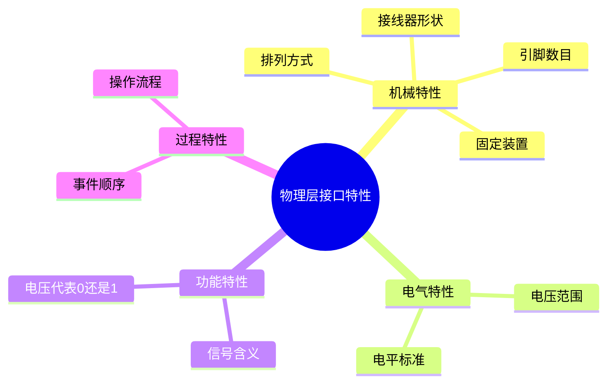
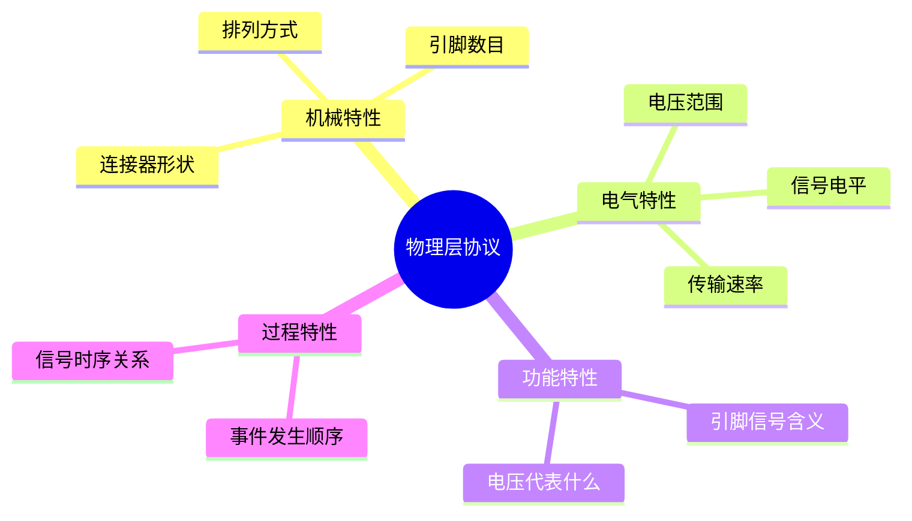

# 第2章-2.1 物理层的基本概念

## 基本信息
- **课程**：计算机网络
- **章节**：第2章 物理层 - 2.1节
- **日期**：2026-06-26
- **标签**：#物理层 #基本概念 #四个特性

---

## 重点内容
- ⭐ 物理层的主要任务
- ⭐⭐ 四个重要特性
- ⭐ 串行传输与并行传输

---

## 📚 出处：第2章 2.1节"物理层的基本概念"

---

## 详细笔记

### 1. 物理层的基本定位 ⭐

物理层考虑的是怎样才能在连接各种计算机的传输媒体上传输数据比特流，而不是指具体的传输媒体。

**核心作用**：尽可能地屏蔽掉传输媒体和通信手段的差异，使物理层上面的数据链路层感觉不到这些差异。

💡 **理解**：物理层就像一个"适配器"，它把各种不同的传输媒体（如双绞线、光纤、无线等）抽象成统一的接口，让上层协议不需要关心底层的具体实现。

---

### 2. 物理层的主要任务 ⭐⭐

物理层的主要任务是确定与传输媒体的接口有关的**四个特性**：

#### 📷 图号 物理层四个特性



| 特性类型 | 说明 | 具体内容 | 示例 |
|:--------:|:----:|:--------|:-----|
| **机械特性** | 接口形状 | 指明接口所用接线器的形状和尺寸、引脚数目和排列、固定和锁定装置等 | USB接口、RJ-45接口的物理规格 |
| **电气特性** | 电压范围 | 指明在接口电缆的各条线上出现的电压的范围 | RS-232-C标准规定逻辑"1"的电平为-15V~-5V |
| **功能特性** | 信号含义 | 指明某条线上出现的某一电平的电压的意义 | 某条线上出现的电压代表"0"还是"1" |
| **过程特性** | 事件顺序 | 指明对于不同功能的各种可能事件的出现顺序 | 先建立连接，再传输数据，最后释放连接 |

📌 **考试重点**：四个特性的名称和含义必须牢记！

---

### 3. 传输方式 ⭐

#### 3.1 并行传输与串行传输

| 传输方式 | 特点 | 应用场景 |
|:--------:|:-----|:---------|
| **并行传输** | 多个比特同时传输 | 计算机内部（如CPU到内存） |
| **串行传输** | 逐个比特按时间顺序传输 | 通信线路（出于经济考虑） |

💡 **理解**：物理层还要完成传输方式的转换，即把计算机内部的并行传输转换为通信线路上的串行传输。

#### 3.2 信道通信方式

| 通信方式 | 别名 | 特点 | 信道需求 |
|:--------:|:----:|:-----|:--------:|
| **单向通信** | 单工通信 | 只能有一个方向的通信，没有反方向交互 | 1条信道 |
| **双向交替通信** | 半双工通信 | 双方都可以发送信息，但不能同时发送 | 2条信道 |
| **双向同时通信** | 全双工通信 | 双方可以同时发送和接收信息 | 2条信道 |

⚠️ **常见误区**：有时人们常用"单工"表示"双向交替通信"，如常说的"单工电台"并不是只能进行单向通信。

---

### 4. 物理层协议的种类

📌 **重要概念**：物理层协议也称为**物理层规程**（procedure）。

物理层协议种类繁多的原因：
1. 物理连接方式很多（点对点、多点连接、广播连接）
2. 传输媒体种类繁多（架空明线、双绞线、同轴电缆、光缆、无线信道等）

---

## 💡 重点总结

### 核心概念速记

| 概念 | 说明 |
|:-----|:-----|
| **物理层任务** | 确定与传输媒体接口有关的四个特性 |
| **四个特性** | 机械、电气、功能、过程 |
| **传输方式转换** | 并行 → 串行 |
| **物理层规程** | 即物理层协议 |

### 记忆口诀

```
机械电气功能过程，四个特性要记清
并行串行需转换，屏蔽差异是核心
```

---

## 疑问与思考

❓ **疑问**：物理层和传输媒体（如双绞线、光纤）有什么区别？物理层是硬件吗？

💡 **解答**：

- 物理层**不是**具体的传输媒体，而是一个**协议层**，它定义的是如何在各种传输媒体上传输数据比特流的规则
- 传输媒体（双绞线、光纤、无线信道等）是**物理层面的物质基础**，属于OSI模型的第0层（有些教材的说法）
- 物理层的作用是**屏蔽差异**：无论底层用什么传输媒体，上面的数据链路层都不需要关心具体细节
- 可以类比为：传输媒体是"道路"，物理层是"交通规则"
- 📚 出处：第2章 2.1节"物理层的基本概念"

❓ **疑问**：DTE和DCE分别是什么？它们在物理层中起什么作用？

💡 **解答**：

| 概念 | 全称 | 含义 | 示例 |
|:----:|:-----|:-----|:-----|
| **DTE** | Data Terminal Equipment（数据终端设备） | 具有数据处理能力的设备，是数据的源或目的 | 计算机、终端、路由器 |
| **DCE** | Data Circuit-terminating Equipment（数据电路终接设备） | 在DTE和传输线路之间提供信号变换和编码的设备 | 调制解调器、网络设备 |

- DTE之间不能直接相连，需要通过DCE进行信号转换
- DCE负责提供**时钟信号**、进行**信号编码/解码**，并在DTE和传输网络之间建立物理连接
- 📚 出处：第2章 2.1节"物理层的基本概念"，RS-232-C标准

❓ **疑问**：为什么说RS-232是一个典型的物理层标准？

💡 **解答**：

- RS-232-C完整定义了物理层的**四个特性**：
  - **机械特性**：规定了25针（或9针）D型连接器的形状和引脚排列
  - **电气特性**：规定逻辑"1"为-15V~-5V，逻辑"0"为+5V~+15V（负逻辑）
  - **功能特性**：规定各引脚的信号含义（如TxD发送数据、RxD接收数据、RTS请求发送等）
  - **过程特性**：规定信号之间的时序关系和操作顺序
- RS-232不涉及数据如何组织（那是数据链路层的事），只关心比特如何在电缆上传输
- 📚 出处：第2章 2.1节"物理层的基本概念"

---

## 总结

### DTE vs DCE 对比

| 比较项 | DTE（数据终端设备） | DCE（数据电路终接设备） |
|:------:|:-------------------|:---------------------|
| 全称 | Data Terminal Equipment | Data Circuit-terminating Equipment |
| 功能 | 数据的产生和处理 | 信号变换和时钟提供 |
| 典型设备 | 计算机、路由器、终端 | 调制解调器(MODEM) |
| 在通信中的位置 | 端系统侧 | 位于DTE和传输线路之间 |
| 提供时钟 | 否 | 是 |

### RS-232-C关键规格

| 特性 | 具体内容 |
|:----:|:---------|
| **机械特性** | 25针D型连接器（常用9针简化版） |
| **电气特性** | 逻辑"1"：-15V~-5V；逻辑"0"：+5V~+15V（负逻辑） |
| **功能特性** | TxD(发送)、RxD(接收)、RTS(请求发送)、CTS(允许发送)、DTR(数据终端就绪)等 |
| **过程特性** | 先建立连接（DTR/DSR），再请求发送（RTS/CTS），然后传输数据 |
| **最大传输距离** | 约15m |
| **最高传输速率** | 20 kbit/s（早期标准） |

### 物理层协议的四个特性



### 关键要点

1. **物理层不等于物理媒体**：物理层是协议/规则，传输媒体是物质基础
2. **DTE与DCE的分工**：DTE处理数据，DCE负责信号转换和时钟
3. **RS-232是典型范例**：完整定义了四个特性，是理解物理层的最佳案例
4. **物理层屏蔽差异**：使上层协议无需关心底层传输媒体的具体实现

---

## 相关链接

- **上一章**：第1章 概述 - 计算机网络体系结构
- **下一节**：第2章 2.2节 数据通信的基础知识
- **相关概念**：数据链路层、网络适配器

---

## 📚 课后习题

### 习题2-01
**问题**：物理层要解决哪些问题？物理层的主要特点是什么？

### 习题2-05
**问题**：物理层的接口有哪几个方面的特性？各包含些什么内容？

---

*最后更新：2026-06-26*