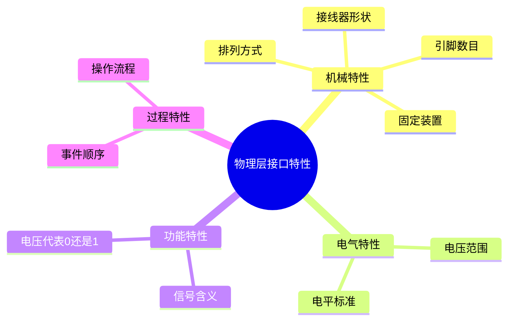

# 第2章-2.1 物理层的基本概念

## 基本信息
- **课程**：计算机网络
- **章节**：第2章 物理层 - 2.1节
- **日期**：2026-06-26
- **标签**：#物理层 #基本概念 #四个特性

---

## 重点内容
- ⭐ 物理层的主要任务
- ⭐⭐ 四个重要特性
- ⭐ 串行传输与并行传输

---

## 📚 出处：第2章 2.1节"物理层的基本概念"

---

## 详细笔记

### 1. 物理层的基本定位 ⭐

物理层考虑的是怎样才能在连接各种计算机的传输媒体上传输数据比特流，而不是指具体的传输媒体。

**核心作用**：尽可能地屏蔽掉传输媒体和通信手段的差异，使物理层上面的数据链路层感觉不到这些差异。

💡 **理解**：物理层就像一个"适配器"，它把各种不同的传输媒体（如双绞线、光纤、无线等）抽象成统一的接口，让上层协议不需要关心底层的具体实现。

---

### 2. 物理层的主要任务 ⭐⭐

物理层的主要任务是确定与传输媒体的接口有关的**四个特性**：

#### 📷 图号 物理层四个特性



| 特性类型 | 说明 | 具体内容 | 示例 |
|:--------:|:----:|:--------|:-----|
| **机械特性** | 接口形状 | 指明接口所用接线器的形状和尺寸、引脚数目和排列、固定和锁定装置等 | USB接口、RJ-45接口的物理规格 |
| **电气特性** | 电压范围 | 指明在接口电缆的各条线上出现的电压的范围 | RS-232-C标准规定逻辑"1"的电平为-15V~-5V |
| **功能特性** | 信号含义 | 指明某条线上出现的某一电平的电压的意义 | 某条线上出现的电压代表"0"还是"1" |
| **过程特性** | 事件顺序 | 指明对于不同功能的各种可能事件的出现顺序 | 先建立连接，再传输数据，最后释放连接 |

📌 **考试重点**：四个特性的名称和含义必须牢记！

---

### 3. 传输方式 ⭐

#### 3.1 并行传输与串行传输

| 传输方式 | 特点 | 应用场景 |
|:--------:|:-----|:---------|
| **并行传输** | 多个比特同时传输 | 计算机内部（如CPU到内存） |
| **串行传输** | 逐个比特按时间顺序传输 | 通信线路（出于经济考虑） |

💡 **理解**：物理层还要完成传输方式的转换，即把计算机内部的并行传输转换为通信线路上的串行传输。

#### 3.2 信道通信方式

| 通信方式 | 别名 | 特点 | 信道需求 |
|:--------:|:----:|:-----|:--------:|
| **单向通信** | 单工通信 | 只能有一个方向的通信，没有反方向交互 | 1条信道 |
| **双向交替通信** | 半双工通信 | 双方都可以发送信息，但不能同时发送 | 2条信道 |
| **双向同时通信** | 全双工通信 | 双方可以同时发送和接收信息 | 2条信道 |

⚠️ **常见误区**：有时人们常用"单工"表示"双向交替通信"，如常说的"单工电台"并不是只能进行单向通信。

---

### 4. 物理层协议的种类

📌 **重要概念**：物理层协议也称为**物理层规程**（procedure）。

物理层协议种类繁多的原因：
1. 物理连接方式很多（点对点、多点连接、广播连接）
2. 传输媒体种类繁多（架空明线、双绞线、同轴电缆、光缆、无线信道等）

---

## 💡 重点总结

### 核心概念速记

| 概念 | 说明 |
|:-----|:-----|
| **物理层任务** | 确定与传输媒体接口有关的四个特性 |
| **四个特性** | 机械、电气、功能、过程 |
| **传输方式转换** | 并行 → 串行 |
| **物理层规程** | 即物理层协议 |

### 记忆口诀

```
机械电气功能过程，四个特性要记清
并行串行需转换，屏蔽差异是核心
```

---

## 📝 疑问与思考

1. 为什么物理层要屏蔽传输媒体的差异？这样做的好处是什么？
2. 在实际应用中，如何确定一个接口的四个特性？
3. 为什么通信线路一般采用串行传输而不是并行传输？

---

## 🔗 相关链接

- **上一章**：第1章 概述 - 计算机网络体系结构
- **下一节**：第2章 2.2节 数据通信的基础知识
- **相关概念**：数据链路层、网络适配器

---

## 📚 课后习题

### 习题2-01
**问题**：物理层要解决哪些问题？物理层的主要特点是什么？

### 习题2-05
**问题**：物理层的接口有哪几个方面的特性？各包含些什么内容？

---

*最后更新：2026-06-26*