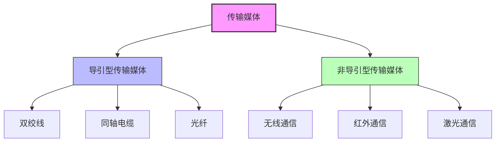

# 第2章-2.3 物理层下面的传输媒体

## 基本信息
- **课程**：计算机网络
- **章节**：第2章 物理层 - 2.3节
- **日期**：2026-06-26
- **标签**：#传输媒体 #双绞线 #同轴电缆 #光纤 #无线通信

---

## 重点内容
- ⭐⭐ 传输媒体的分类
- ⭐⭐ 双绞线的特点和分类
- ⭐⭐ 光纤的工作原理和优点
- ⭐ 无线通信的主要方式

---

## 📚 出处：第2章 2.3节"物理层下面的传输媒体"

---

## 详细笔记

### 1. 传输媒体的分类 ⭐

📌 **重要概念**：传输媒体不属于物理层的范围，但物理层需要在其上传输数据比特流。

传输媒体可分为两大类：

| 类型 | 英文 | 定义 | 示例 |
|:----:|:----:|:-----|:-----|
| **导引型传输媒体** | Guided | 电磁波被导引沿着固体媒体传播 | 双绞线、同轴电缆、光纤 |
| **非导引型传输媒体** | Unguided | 自由空间，电磁波在其中传输 | 无线、红外、大气激光 |

#### 📷 图2-5 电信领域使用的电磁波频谱

> 📚 **课本出处**：图2-5 展示了电信领域使用的电磁波频谱分布

---

### 2.3.1 导引型传输媒体

#### 1. 双绞线 ⭐⭐

双绞线是最古老但也是最常用的传输媒体，把两根互相绝缘的铜导线并排放在一起，然后用规则的方法绞合起来构成。

**绞合的作用**：减少对相邻导线的电磁干扰

##### 📷 图2-6 几种不同的双绞线

> 📚 **课本出处**：图2-6 展示了无屏蔽双绞线和屏蔽双绞线的结构对比

---

##### （1）双绞线的分类

| 类型 | 英文缩写 | 特点 |
|:----:|:--------:|:-----|
| **无屏蔽双绞线** | UTP | 价格较便宜 |
| **屏蔽双绞线** | STP | 具有更好的抗干扰能力 |

**屏蔽双绞线的类型**：
- F/UTP：铝箔屏蔽层
- S/UTP：金属编织层屏蔽
- F/FTP或S/FTP：双重屏蔽

---

##### （2）表2-1 常用的绞合线的类别、带宽和典型应用 ⭐⭐

| 绞合线类别 | 带宽 | 线缆特点 | 典型应用 |
|:----------:|:----:|:--------|:---------|
| 3 | 16 MHz | 2对4芯双绞线 | 模拟电话；传统以太网(10 Mbit/s) |
| 5 | 100 MHz | 增加了绞合度 | 传输速率100 Mbit/s(距离100m) |
| 5E(超5类) | 125 MHz | 衰减更小 | 传输速率1 Gbit/s(距离100m) |
| 6 | 250 MHz | 改善了串扰等性能 | 传输速率10 Gbit/s(距离35~55m) |
| 6A | 500 MHz | 改善了串扰等性能 | 传输速率10 Gbit/s(距离100m) |
| 7 | 600 MHz | 必须使用屏蔽双绞线 | 传输速率超过10 Gbit/s,距离100m |
| 8 | 2000 MHz | 必须使用屏蔽双绞线 | 传输速率25/40 Gbit/s,距离30m |

💡 **重要特性**：无论哪种类别的双绞线，衰减都随频率的升高而增大。绞合度越高的双绞线能够用越高的数据率传送数据。

---

#### 2. 同轴电缆 ⭐

同轴电缆由内导体铜质芯线、绝缘层、网状编织的外导体屏蔽层以及绝缘保护套层所组成。

##### 📷 图2-7 同轴电缆的结构

> 📚 **课本出处**：图2-7 展示了同轴电缆的内部结构

**特点**：具有很好的抗干扰特性，被广泛用于传输较高速率的数据。

**应用现状**：在局域网发展初期曾广泛使用，但现在基本上采用双绞线，目前主要用于有线电视网。

---

#### 3. 光缆 ⭐⭐⭐

光纤通信就是利用光导纤维传递光脉冲来进行通信的。有光脉冲相当于1，而没有光脉冲相当于0。

**核心优势**：可见光的频率非常高，约为 $10^{8}\mathrm{MHz}$ 的量级，因此光纤通信系统的传输带宽远远大于其他传输媒体。

---

##### （1）光纤的工作原理

##### 📷 图2-8 光线在光纤中的折射

> 📚 **课本出处**：图2-8 展示了光线在光纤中发生全反射的原理

**工作原理**：
- 光纤由纤芯和包层构成双层通信圆柱体
- 纤芯的折射率高于包层
- 当入射角足够大时，会发生**全反射**
- 光线沿着光纤传输下去

##### 📷 图2-9 光波在纤芯中的传输

> 📚 **课本出处**：图2-9 展示了光波在纤芯中不断全反射向前传播

---

##### （2）光纤的分类 ⭐⭐

##### 📷 图2-10 多模光纤和单模光纤的比较

> 📚 **课本出处**：图2-10 展示了多模光纤和单模光纤的结构对比

| 光纤类型 | 特点 | 应用场景 | 成本 |
|:--------:|:-----|:---------|:----:|
| **多模光纤** | 多条不同角度入射的光线同时传输，光脉冲会逐渐展宽 | 近距离传输 | 较低 |
| **单模光纤** | 光纤直径减小到只有一个光的波长，不会产生多次反射 | 长距离、高速率传输 | 较高 |

**单模光纤的优势**：
- 衰耗较小
- 在100Gbit/s的高速率下可传输100公里而不必采用中继器

---

##### （3）光纤的常用波段

| 波段中心波长 | 特点 |
|:------------:|:-----|
| 850 nm | 衰减较大，但其他特性均较好 |
| 1300 nm | 衰减较小 |
| 1550 nm | 衰减较小 |

所有这三个波段都具有 $25000\sim 30000\mathrm{GHz}$ 的带宽。

---

##### （4）光缆结构

##### 📷 图2-11 四芯光缆剖面示意图

> 📚 **课本出处**：图2-11 展示了四芯光缆的内部结构

---

##### （5）光纤的优点 ⭐⭐

1. **传输损耗小**，中继距离长，对远距离传输特别经济
2. **抗雷电和电磁干扰性能好**，这在有大电流脉冲干扰的环境下尤为重要
3. **无串音干扰**，保密性好，也不易被窃听或截取数据
4. **体积小，重量轻**，例如1km长的1000对双绞线电缆约重8000kg，而同样长度但容量大得多的一对两芯光缆仅重100kg

---

### 2.3.2 非导引型传输媒体 ⭐

#### 1. 无线通信概述

无线传输可使用的频段很广，主要包括：
- 紫外线和更高的波段目前还不能用于通信
- 无线电微波通信在当前的数据通信中占有特殊重要的地位

---

#### 2. 微波通信 ⭐⭐

微波的频率范围为 $300\mathrm{MHz}\sim 300\mathrm{GHz}$（波长1m～1mm），主要使用 $2\mathrm{GHz}\sim 40\mathrm{GHz}$ 的频率范围。

**特点**：
- 在空间主要是直线传播
- 传播距离一般只有50km左右
- 采用100m高天线塔可增大到100km
- 微波会穿透电离层而进入宇宙空间

---

##### （1）多径效应

##### 📷 图2-12 多径效应的影响

> 📚 **课本出处**：图2-12 展示了多径效应对信号传输的影响

基站发出的信号可以经过多个障碍物的数次反射到达手机，多条路径的信号叠加后会产生很大的失真。

---

##### （2）误码率与信噪比的关系

##### 📷 图2-13 理想信道的误码率与信噪比、调制方式、数据率的关系

> 📚 **课本出处**：图2-13 展示了误码率与信噪比、调制方式、数据率的关系曲线

**三个基本概念**：
1. 对于给定的调制方式和数据率，信噪比越大，误码率就越低
2. 对于同样的信噪比，具有更高数据率的调制技术的误码率也更高
3. 移动用户地理位置改变会引起无线信道特性改变，需要自适应调制和编码技术

---

##### （3）微波接力通信

**优点**：
1. 频段范围很宽，通信信道容量很大
2. 受工业干扰和天电干扰小，传输质量较高
3. 建设投资少，见效快，易于跨越山区、江河

**缺点**：
1. 相邻站之间必须直视（LOS - Line Of Sight），不能有障碍物
2. 传播有时会受到恶劣气候的影响
3. 隐蔽性和保密性较差
4. 对大量中继站的使用和维护要耗费较多的人力和物力

---

#### 3. 卫星通信 ⭐⭐

利用约3万6千公里高空的人造同步地球卫星作为中继器的微波接力通信。

**特点**：
- 通信距离远，且通信费用与通信距离无关
- 同步地球卫星发射出的电磁波能辐射到地球上的通信覆盖区的跨度达1万8千多公里，面积约占全球的三分之一
- 只要在地球赤道上空的同步轨道上，等距离地放置3颗相隔120度的卫星，就能基本上实现全球的通信

📌 **重要参数**：
- 传播时延：250～300ms（一般取270ms）
- 这和其他的通信有较大差别（与两个地球站之间的距离无关）

---

#### 4. 无线局域网使用的ISM频段

##### 📷 图2-14 无线局域网使用的ISM频段

> 📚 **课本出处**：图2-14 展示了无线局域网使用的ISM频段

**ISM频段**：Industrial, Scientific, and Medical（工业、科学与医药）频段，可以自由使用（只要不干扰他人）。

---

## 💡 重点总结

### 传输媒体特性对比

| 媒体类型 | 主要优点 | 主要缺点 | 应用场景 |
|:--------:|:---------|:---------|:---------|
| **双绞线** | 价格便宜，应用广泛 | 距离受限，抗干扰能力一般 | 以太网、电话系统 |
| **同轴电缆** | 抗干扰能力强 | 成本较高，安装不便 | 有线电视网 |
| **光纤** | 带宽大，传输距离远，抗干扰 | 成本较高，连接需要专用设备 | 骨干网、高速局域网 |
| **无线** | 移动性强，无需布线 | 受环境影响大，安全性较低 | 移动通信、无线局域网 |

---

## 📝 疑问与思考

1. 为什么光纤的传输带宽比其他传输媒体大得多？
2. 多模光纤和单模光纤各适用于什么场景？
3. 为什么卫星通信的传播时延与其他通信方式不同？
4. 在实际网络部署中，如何选择合适的传输媒体？

---

## 🔗 相关链接

- **上一节**：第2章 2.2节 数据通信的基础知识
- **下一节**：第2章 2.4节 信道复用技术
- **相关章节**：第9章 无线网络和移动网络

---

## 📚 课后习题

### 习题2-10
**问题**：常用的传输媒体有哪几种？各有何特点？

### 习题2-11
**问题**：假定有一种双绞线的衰减是0.7dB/km（在1kHz时），若容许有20dB的衰减，试问使用这种双绞线的链路的工作距离有多长？如果要使这种双绞线的工作距离增大到100公里，问应当使衰减降低到多少？

**解答**：
- 工作距离 = 20dB ÷ 0.7dB/km ≈ 28.6 km
- 若工作距离为100km，则衰减应降低到 20dB ÷ 100km = 0.2 dB/km

### 习题2-12
**问题**：试计算工作在1200～1400nm之间以及工作在1400～1600nm之间的光波的频带宽度。假定光在光纤中的传播速率为 $2\times 10^{8}\mathrm{m/s}$

---

*最后更新：2026-06-26*