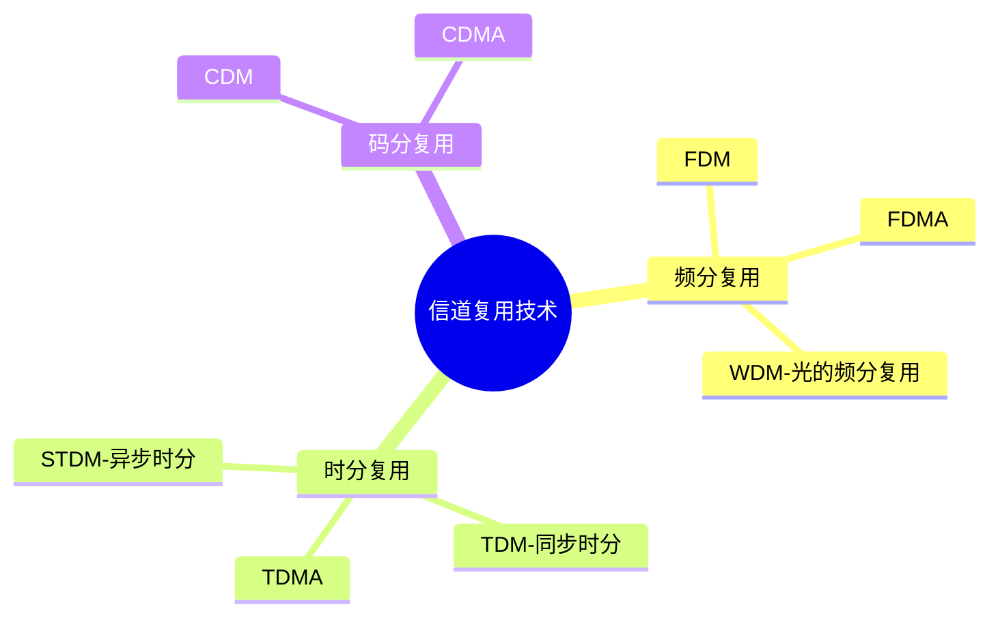
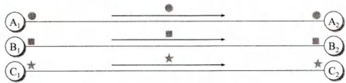
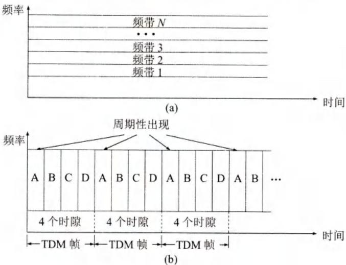
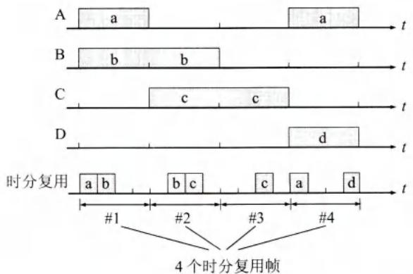
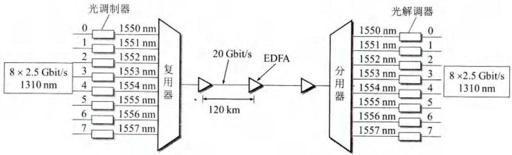
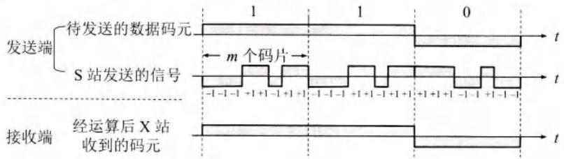
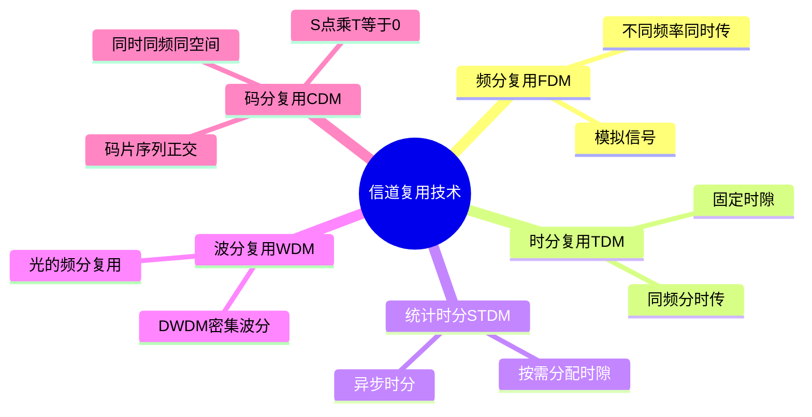

# 第2章-2.4 信道复用技术

## 基本信息
- **课程**：计算机网络
- **章节**：第2章 物理层 - 2.4节
- **日期**：2026-06-26
- **标签**：#复用技术 #FDM #TDM #WDM #CDM #CDMA

---

## 重点内容
- ⭐⭐⭐ 频分复用FDM
- ⭐⭐⭐ 时分复用TDM
- ⭐⭐⭐ 码分复用CDM/CDMA
- ⭐⭐ 波分复用WDM
- ⭐⭐ 统计时分复用STDM

---

## 📚 出处：第2章 2.4节"信道复用技术"

---

## 详细笔记

### 1. 复用的基本概念 ⭐⭐

📌 **复用**是通信技术中的基本概念。

##### 📷 图2-15 复用的示意图

> 📚 **课本出处**：图2-15 展示了使用单独信道和利用复用技术的对比

**复用的优点**：
- 使用一个共享信道传送多路信号
- 如果复用的信道数量较大，经济上合算

---

### 2.4.1 频分复用、时分复用和统计时分复用 ⭐⭐⭐

##### 📷 图2-16 频分复用和时分复用

> 📚 **课本出处**：图2-16 展示了频分复用(a)和时分复用(b)的原理对比

---

#### 1. 频分复用FDM ⭐⭐⭐

**原理**：使用调制的方法，把各路信号分别搬移到适当的频率位置，使彼此不产生干扰。

**特点**：各路信号在同样的时间占用**不同的带宽资源**（这里的"带宽"是频率带宽而不是数据的发送速率）。

**示例**：传统的电话通信中每个标准话路的带宽是4kHz，若有1000个用户进行频分复用，则复用后的总带宽就是4MHz。

📚 出处：第2章 2.4.1节"频分复用"

---

#### 2. 时分复用TDM ⭐⭐⭐

**原理**：将时间划分为一段段等长的时分复用帧（TDM帧），每一路信号在每一个TDM帧中占用固定序号的时隙。

**特点**：所有用户是在不同的时间占用**同样的频带宽度**。

**TDM帧长度**：始终是125μs

**时隙分配**：每一路信号所占用的时隙周期性地出现，其周期就是TDM帧的长度。

📌 **TDM信号也称为等时(isochronous)信号**。

📚 出处：第2章 2.4.1节"时分复用"

---

##### 时分复用的问题 ⭐⭐

##### 📷 图2-17 时分复用造成线路资源浪费

> 📚 **课本出处**：图2-17 展示了时分复用可能造成线路资源浪费的情况

**问题**：当使用时分复用系统传送计算机数据时，由于计算机数据的突发性质，一个用户对已经分配到的子信道的利用率一般是不高的。

**表现**：当某用户暂时无数据发送时，分配给该用户的时隙只能处于空闲状态，其他用户即使一直有数据要发送，也不能使用这些空闲的时隙。

---

#### 3. 统计时分复用STDM ⭐⭐

##### 📷 图2-18 统计时分复用的工作原理

> 📚 **课本出处**：图2-18 展示了统计时分复用的工作原理

**改进之处**：
- 每个STDM帧中的时隙数小于连接在集中器上的用户数
- **按需动态地分配时隙**
- 明显提高信道利用率

**特点**：
- 统计时分复用又称为**异步时分复用**
- 普通的时分复用称为**同步时分复用**

📌 **注意**：TDM帧和STDM帧都是在物理层传送的比特流中所划分的帧，和数据链路层的"帧"是完全不同的概念。

📚 出处：第2章 2.4.1节"统计时分复用"

---

#### 4. 多址接入技术 ⭐

| 技术类型 | 英文缩写 | 说明 |
|:--------:|:--------:|:-----|
| **频分多址接入** | FDMA | 让多个用户使用频分信道 |
| **时分多址接入** | TDMA | 让多个用户使用时分信道 |

⚠️ **注意区分**：
- **FDM/TDM**：强调在频域或时域进行复用，不强调用于多用户
- **FDMA/TDMA**：强调复用信道可以让多个用户（可在不同地点）接入

---

#### 5. 三种复用方式对比总结 ⭐⭐

| 复用方式 | 英文缩写 | 原理 | 特点 | 适用场景 |
|:--------:|:--------:|:-----|:-----|:---------|
| **频分复用** | FDM | 把各路信号分别搬移到适当的频率位置 | 各路信号在同样的时间占用不同的带宽资源 | 模拟信号传输 |
| **时分复用** | TDM | 将时间划分为等长的TDM帧，每路信号在每帧中占用固定时隙 | 所有用户在不同时间占用同样的频带宽度 | 数字信号传输 |
| **统计时分复用** | STDM | 按需动态分配时隙，提高信道利用率 | 又称为异步时分复用 | 突发数据传输 |

---

### 2.4.2 波分复用 ⭐⭐

**波分复用WDM**就是**光的频分复用**。

##### 📷 图2-19 波分复用的概念

> 📚 **课本出处**：图2-19 展示了波分复用的概念和工作原理

---

#### 波分复用的演进

| 阶段 | 说明 |
|:----:|:-----|
| 最初 | 在一根光纤上复用两路光载波信号 |
| 现在 | **密集波分复用DWDM**，可在一根光纤上复用几十路或更多路光载波信号 |

---

#### 性能示例 ⭐

**示例1**：
- 每路数据率 40 Gbit/s
- 复用 64路
- 总速率 = 40 × 64 = 2560 Gbit/s = 2.56 Tbit/s

**示例2**：
- 8路传输速率均为 2.5Gbit/s 的光载波
- 波长分别变换到 1550～1557nm，每个光载波相隔 1nm
- 总速率 = 8 × 2.5 = 20 Gbit/s

---

#### 掺饵光纤放大器EDFA ⭐

**特点**：不需要进行光电转换而直接对光信号进行放大

**性能**：
- 在1550nm波长附近有 35nm（即 4.2THz）频带范围
- 提供较均匀的、最高可达 40～50 dB 的增益
- 两个光纤放大器之间的光缆线路长度可达 120km

📚 出处：第2章 2.4.2节"波分复用"

---

### 2.4.3 码分复用 ⭐⭐⭐

**码分复用CDM**是另一种共享信道的方法。当码分复用信道为多个不同地址的用户所共享时，就称为**码分多址CDMA**。

---

#### 1. CDMA的核心特点 ⭐⭐

- 每一个用户可以在**同样的时间**使用**同样的频带**进行通信
- 各用户使用经过特殊挑选的不同码型，不会造成干扰
- 最初用于**军事通信**（抗干扰能力强，频谱类似于白噪声）
- 现已广泛应用于民用移动通信，特别是在无线局域网中

📚 出处：第2章 2.4.3节"码分复用"

---

#### 2. 码片序列的概念 ⭐⭐⭐

##### 📷 图2-20 CDMA的工作原理

> 📚 **课本出处**：图2-20 展示了CDMA的工作原理和码片序列的使用

---

**基本概念**：

在CDMA中，每一个比特时间再划分为 $m$ 个短的间隔，称为**码片(chip)**。通常 $m$ 的值是64或128。

每个站被指派一个唯一的 $m$ bit**码片序列**：

| 发送内容 | 发送的序列 |
|:--------:|:----------:|
| 比特1 | 发送自己的 $m$ bit码片序列 |
| 比特0 | 发送该码片序列的二进制反码 |

---

**示例**：

S站的8bit码片序列是 00011011

| 发送比特 | 实际发送的序列 |
|:--------:|:--------------:|
| 比特1 | 00011011 |
| 比特0 | 11100100（反码） |

为了方便，按惯例将码片中的0记为-1，将1记为+1。

因此S站的码片序列是：$(-1 -1 -1 +1 +1 -1 +1 +1)$

---

**扩频通信**：

- 发送比特1时，发送码片序列
- 发送比特0时，发送码片序列的二进制反码

这种通信方式是**扩频(spread spectrum)**通信中的一种，包括：
- **直接序列扩频DSSS**：使用码片序列
- **跳频扩频FHSS**

📚 出处：第2章 2.4.3节"扩频通信"

---

#### 3. 码片序列的正交性 ⭐⭐⭐

📌 **重要特性**：给每一个站分配的码片序列不仅必须各不相同，并且还必须**互相正交(orthogonal)**。

在实用的系统中是使用**伪随机码序列**。

---

**正交性的数学定义**：

两个不同站的码片序列正交，就是向量 $\boldsymbol{S}$ 和 $\boldsymbol{T}$ 的**规格化内积**都是 0：

$$
\boldsymbol{S} \cdot \boldsymbol{T} \equiv \frac{1}{m}\sum_{i=1}^{m}S_iT_i = 0
$$

📚 出处：第2章 2.4.3节"正交性公式"(公式2-3)

---

**自相关性**：

任何一个码片向量和该码片向量自己的规格化内积都是 1：

$$
\boldsymbol{S} \cdot \boldsymbol{S} = \frac{1}{m}\sum_{i=1}^{m}S_i^2 = \frac{1}{m}\sum_{i=1}^{m}(\pm 1)^2 = 1
$$

📚 出处：第2章 2.4.3节"自相关性公式"(公式2-4)

---

**与反码的内积**：

一个码片向量和该码片反码的向量的规格化内积值是 **-1**。

---

#### 4. CDMA的工作原理 ⭐⭐⭐

##### （1）发送过程

假定S站要发送的数据是 110 三个码元：

- 发送比特1时，发送码片序列 $(-1 -1 -1 +1 +1 -1 +1 +1)$
- 发送比特0时，发送码片序列的反码 $(+1 +1 +1 -1 -1 +1 -1 -1)$

S站发送的扩频信号为 $S_x$。

##### （2）接收过程

当接收站X要接收S站发送的信号时：

1. X站必须知道S站所特有的码片序列
2. X站使用S站的码片向量 $\boldsymbol{S}$ 与收到的信号进行求内积的运算
3. 结果：
   - 当S站发送比特1时，内积结果为 **+1**
   - 当S站发送比特0时，内积结果为 **-1**
   - 所有其他站的信号都被过滤掉（内积为0）

📚 出处：第2章 2.4.3节"CDMA接收过程"

---

## 💡 重点公式和概念速记

### 核心公式

1. **码片序列正交性**：$\boldsymbol{S} \cdot \boldsymbol{T} = 0$（不同站之间）
2. **码片自相关性**：$\boldsymbol{S} \cdot \boldsymbol{S} = 1$（同一站）
3. **与反码内积**：$\boldsymbol{S} \cdot \overline{\boldsymbol{S}} = -1$

### 复用技术对比

| 技术 | 英文 | 频域 | 时域 | 码域 |
|:----:|:----:|:----:|:----:|:----:|
| **频分复用** | FDM | ✓ | - | - |
| **时分复用** | TDM | - | ✓ | - |
| **码分复用** | CDM | - | - | ✓ |
| **波分复用** | WDM | ✓(光) | - | - |

---

## 📝 疑问与思考

❓ **疑问1**：FDM、TDM、WDM、CDM这四种复用方式的核心区别是什么？

💡 **解答**：四种复用方式从不同维度划分共享信道的资源：

| 复用方式 | 划分维度 | 核心思想 | 适用场景 |
|:--------:|:--------:|:---------|:---------|
| **FDM** | 频域 | 各路信号占用**不同频率**，同时传输 | 模拟通信、ADSL |
| **TDM** | 时域 | 各路信号轮流占用**同一频率**，分时传输 | 数字通信、PCM |
| **WDM** | 光的波长 | 本质上是光的频分复用，各路光载波占用**不同波长** | 光纤骨干网 |
| **CDM** | 码域 | 各用户使用不同**正交码片序列**，同时同频传输 | 移动通信、军事通信 |

FDM和WDM原理相同（WDM就是光的FDM），区别仅在频段不同；TDM是数字时代的选择；CDM最为独特，允许多用户同时、同频、同空间通信。

---

❓ **疑问2**：为什么统计时分复用STDM比同步时分复用TDM效率更高？

💡 **解答**：

**同步TDM的问题**：每个用户被**固定分配**时隙，即使该用户暂时没有数据发送，该时隙也必须空闲保留，其他用户无法使用。这在传输计算机突发数据时造成大量带宽浪费。

**STDM的改进**：
- STDM帧的时隙数**小于**实际连接的用户数
- 时隙**按需动态分配**，只给当前有数据发送的用户
- 缺点是每个时隙必须携带**地址信息**（同步TDM不需要，因为位置固定）
- 适合**突发性数据**传输，显著提高信道利用率

简言之：同步TDM是"预留座位"，统计TDM是"先到先坐"。

---

❓ **疑问3**：CDMA中码片序列为什么必须正交？如果不正交会怎样？

💡 **解答**：

**正交的意义**：接收站用某站的码片序列与收到的混合信号做内积运算，正交性保证了：
- 本站信号内积 = +1 或 -1（能正确识别）
- 其他站信号内积 = 0（被完全过滤掉）

**如果不正交**：不同站的码片序列内积不为0，各站信号会**互相干扰**，接收站无法从混合信号中干净地分离出目标站的数据，导致通信质量严重下降甚至完全无法通信。正交性是CDMA实现多用户同时同频通信的数学基础。

***

## 总结

### 复用技术对比表

| 复用方式 | 英文缩写 | 划分维度 | 同时传输? | 频带占用 | 时隙分配 | 典型应用 |
|:--------:|:--------:|:--------:|:---------:|:---------|:---------|:---------|
| **频分复用** | FDM | 频域 | 是 | 各路不同 | - | 模拟广播、ADSL |
| **时分复用** | TDM | 时域 | 否 | 全部相同 | 固定分配 | PCM数字电话 |
| **统计时分复用** | STDM | 时域 | 否 | 全部相同 | 动态分配 | 计算机数据 |
| **波分复用** | WDM | 光波长 | 是 | 各路不同 | - | 光纤骨干网 |
| **码分复用** | CDM | 码域 | 是 | 全部相同 | - | CDMA移动通信 |

### CDMA关键公式

$$
\boldsymbol{S} \cdot \boldsymbol{T} \equiv \frac{1}{m}\sum_{i=1}^{m}S_iT_i = 0 \quad (\text{不同站，正交})
$$

$$
\boldsymbol{S} \cdot \boldsymbol{S} = \frac{1}{m}\sum_{i=1}^{m}S_i^2 = 1 \quad (\text{同站，自相关})
$$

$$
\boldsymbol{S} \cdot \overline{\boldsymbol{S}} = -1 \quad (\text{与反码})
$$

### 核心概念思维导图

***

## 🔗 相关链接

- **上一节**：第2章 2.3节 物理层下面的传输媒体
- **下一节**：第2章 2.5节 数字传输系统
- **相关章节**：第9章 无线网络和移动网络（CDMA在移动通信中的应用）

---

## 📚 课后习题

### 习题2-13
**问题**：为什么要使用信道复用技术？常用的信道复用技术有哪些？

### 习题2-14
**问题**：试写出下列英文缩写的全称，并进行简单的解释。
FDM，FDMA，TDM，TDMA，STDM，WDM，DWDM，CDMA，SONET，SDH，STM-1，OC-48。

### 习题2-15
**问题**：码分多址CDMA为什么可以使所有用户在同样的时间使用同样的频带进行通信而不会互相干扰？这种复用方法有何优缺点？

### 习题2-16 ⭐⭐⭐（重要计算题）
**问题**：共有四个站进行码分多址CDMA通信。四个站的码片序列为：

- A: $(-1 -1 -1 +1 +1 -1 +1 +1)$
- B: $(-1 -1 +1 -1 +1 +1 +1 -1)$
- C: $(-1 +1 -1 +1 +1 +1 -1 -1)$
- D: $(-1 +1 -1 -1 -1 -1 +1 -1)$

现收到这样的码片序列：$(-1 +1 -3 +1 -1 -3 +1 +1)$。问哪个站发送数据了？发送数据的站发送的是1还是0？

**解答思路**：
1. 计算收到的信号与每个站的码片序列的内积
2. 若内积为+1，表示该站发送了比特1
3. 若内积为-1，表示该站发送了比特0
4. 若内积为0，表示该站没有发送数据

---

*最后更新：2026-06-26*