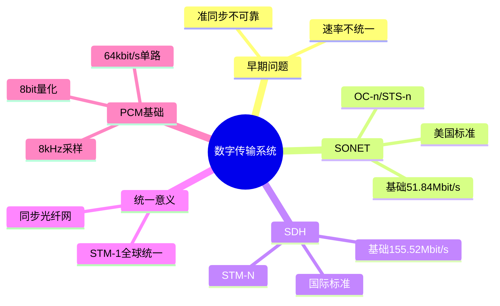

# 第2章-2.5 数字传输系统

## 基本信息
- **课程**：计算机网络
- **章节**：第2章 物理层 - 2.5节
- **日期**：2026-06-26
- **标签**：#数字传输 #SONET #SDH #同步光纤网

---

## 重点内容
- ⭐⭐ 早期数字传输系统的缺点
- ⭐⭐ SONET/SDH的基本概念
- ⭐ SONET与SDH的对应关系

---

## 📚 出处：第2章 2.5节"数字传输系统"

---

## 详细笔记

### 1. 数字传输系统的发展背景 ⭐

在早期电话网中：
- 市话局到用户电话机的用户线采用最廉价的**双绞线电缆**
- 长途干线采用的是**频分复用FDM的模拟传输方式**

**发展趋势**：
- 由于数字通信与模拟通信相比，无论在传输质量上还是经济上都有明显的优势
- 目前长途干线大都采用**时分复用PCM的数字传输方式**

---

### 2. 早期数字传输系统的缺点 ⭐⭐

#### （1）速率标准不统一

由于历史的原因，多路复用的速率体系有两个互不兼容的国际标准：

| 标准 | 速率 | 适用地区 |
|:----:|:----:|:---------|
| **T1速率** | 1.544 Mbit/s | 北美和日本 |
| **E1速率** | 2.048 Mbit/s | 欧洲 |

**问题**：再往上的复用，日本又使用了第三种不兼容的标准。这样，国际范围的基于光纤的高速数据传输就很难实现。

---

#### （2）不是同步传输

在过去相当长的时间，为了节约经费，各国的数字网主要采用**准同步方式**。

**准同步系统的问题**：
- 各支路信号的时钟频率有一定的偏差
- 给时分复用和分用带来许多麻烦
- 当数据传输的速率很高时，收发双方的时钟同步就成为很大的问题

---

### 3. 同步光纤网SONET ⭐⭐

为解决上述问题，美国在1988年首先推出了同步光纤网**SONET**（Synchronous Optical Network）。

**SONET的特点**：
- 整个同步网络的各级时钟都来自一个非常精确的主时钟
- 通常采用昂贵的**铯原子钟**，其精度优于 $\pm 1 \times 10^{-11}$

**速率等级**：
- 传输速率以 **51.840 Mbit/s** 为基础
- 对电信号称为**第1级同步传送信号STS-1**（Synchronous Transport Signal）
- 对光信号称为**第1级光载波OC-1**（Optical Carrier）

📚 出处：第2章 2.5节"同步光纤网SONET"

---

### 4. 同步数字系列SDH ⭐⭐

ITU-T以美国标准SONET为基础，制定出国际标准**SDH**（Synchronous Digital Hierarchy）。

**SONET与SDH的区别**：
- SDH的基本速率为 **155.520 Mbit/s**
- 称为**第1级同步传递模块STM-1**（Synchronous Transfer Module）
- 相当于SONET体系中的OC-3速率

---

### 5. 表2-2 SONET和SDH的对应关系 ⭐⭐

| 线路速率 (Mbit/s) | 近似值 | SONET符号 | ITU-T符号 | 话路数 |
|:-----------------:|:------:|:---------:|:---------:|:------:|
| 51.840 | - | OC-1/STS-1 | - | 810 |
| 155.520 | 155 Mbit/s | OC-3/STS-3 | STM-1 | 2430 |
| 622.080 | 622 Mbit/s | OC-12/STS-12 | STM-4 | 9720 |
| 1244.160 | - | OC-24/STS-24 | STM-8 | 19440 |
| 2488.320 | 2.5 Gbit/s | OC-48/STS-48 | STM-16 | 38880 |
| 4976.640 | - | OC-96/STS-96 | STM-32 | 77760 |
| 9953.280 | 10 Gbit/s | OC-192/STS-192 | STM-64 | 155520 |
| 39813.120 | 40 Gbit/s | OC-768/STS-768 | STM-256 | 622080 |

📚 出处：第2章 2.5节"表2-2"

---

#### 速率等级的记忆技巧

| 等级 | SONET | SDH | 倍数关系 |
|:----:|:-----:|:---:|:---------|
| 基础 | OC-1 (51.84M) | - | 1× |
| 4倍 | OC-12 (622M) | STM-4 | 12× |
| 16倍 | OC-48 (2.5G) | STM-16 | 48× |
| 192倍 | OC-192 (10G) | STM-64 | 192× |
| 768倍 | OC-768 (40G) | STM-256 | 768× |

---

### 6. SDH/SONET的重要意义 ⭐

SDH/SONET标准的制定，使北美、日本和欧洲这三个地区三种不同的数字传输体制在STM-1等级上获得了**统一**。

**意义**：
- 各国都同意将这一速率以及在此基础上的更高的数字传输速率作为国际标准
- 这是第一次真正实现了数字传输体制上的世界性标准
- 现在SDH/SONET标准已成为公认的新一代理想的传输网体制

---

### 7. SDH/SONET的技术特点

- 定义了标准光信号
- 规定了波长为1310nm和1550nm的激光源
- 在物理层定义了帧结构
- SDH的帧结构是以STM-1为基础的
- 更高的等级是用 $N$ 个STM-1复用组成STM-$N$

---

## 💡 重点总结

### 核心概念速记

| 概念 | 说明 |
|:-----|:-----|
| **SONET** | 美国标准，以51.840 Mbit/s为基础 |
| **SDH** | 国际标准，基本速率155.520 Mbit/s (STM-1) |
| **STS-1** | 第1级同步传送信号（电接口） |
| **OC-1** | 第1级光载波（光接口） |
| **STM-1** | 第1级同步传递模块（SDH基础速率） |

### 速率单位换算

- STM-1 = 155.520 Mbit/s ≈ 155 Mbit/s
- STM-4 = 622.080 Mbit/s ≈ 622 Mbit/s
- STM-16 = 2488.320 Mbit/s ≈ 2.5 Gbit/s
- STM-64 = 9953.280 Mbit/s ≈ 10 Gbit/s
- STM-256 = 39813.120 Mbit/s ≈ 40 Gbit/s

---

## 📝 疑问与思考

❓ **疑问1**：SONET和SDH到底是什么关系？有什么区别？

💡 **解答**：SONET和SDH本质上是**同一套技术体系的两个名称**，区别仅在于制定者和地区：

| 对比项 | SONET | SDH |
|:------:|:------|:----|
| **制定者** | 美国贝尔公司（1988年） | ITU-T（国际电信联盟） |
| **基础速率** | 51.840 Mbit/s (OC-1/STS-1) | 155.520 Mbit/s (STM-1) |
| **基本单位** | OC-n（光信号）/ STS-n（电信号） | STM-N |
| **关系** | STM-1 = OC-3 | OC-3 = STM-1 |

SDH以SONET为基础，将北美、日本和欧洲三个不兼容的数字传输体制在STM-1等级上统一起来，成为国际标准。

---

❓ **疑问2**：为什么PCM采用8kHz的采样频率？这个数值是怎么确定的？

💡 **解答**：8kHz采样率是根据**奈奎斯特采样定理**和人声特性决定的：

- 人耳能听到的声音频率范围约为 **20Hz~20kHz**
- 电话系统只需传输**语音信号**，有效频率范围约 **300Hz~3400Hz**
- 为避免混叠，采样频率必须大于信号最高频率的2倍
- 因此电话系统取 **8kHz**（大于3400Hz x 2 = 6800Hz），留有一定余量
- 每个采样值用 **8 bit** 编码（256个量化级）
- 单路PCM话音速率 = 8000次/秒 x 8 bit = **64 kbit/s**（这就是著名的DS0速率）

---

❓ **疑问3**：T1速率（1.544 Mbit/s）和E1速率（2.048 Mbit/s）为什么不同？它们如何计算的？

💡 **解答**：T1和E1来自不同的PCM复用标准：

**T1（北美/日本）**：
- 24路PCM话音复用
- 每路 64 kbit/s，24 x 64 = 1536 kbit/s
- 每帧额外加 **1 bit** 帧同步位
- T1速率 = (24 x 8 + 1) x 8000 = 1.544 Mbit/s

**E1（欧洲/中国）**：
- 32路PCM话音复用（其中30路传语音，2路用于同步和信令）
- 32 x 64 kbit/s = 2048 kbit/s
- E1速率 = 2.048 Mbit/s

两者不兼容，这也是SONET/SDH要解决的全球统一问题。

***

## 总结

### SONET/SDH速率等级表

| 线路速率 (Mbit/s) | 近似值 | SONET符号 | SDH符号 | 话路数 |
|:-----------------:|:------:|:---------:|:-------:|:------:|
| 51.840 | 51 Mbit/s | OC-1/STS-1 | - | 810 |
| 155.520 | 155 Mbit/s | OC-3/STS-3 | STM-1 | 2430 |
| 622.080 | 622 Mbit/s | OC-12/STS-12 | STM-4 | 9720 |
| 2488.320 | 2.5 Gbit/s | OC-48/STS-48 | STM-16 | 38880 |
| 9953.280 | 10 Gbit/s | OC-192/STS-192 | STM-64 | 155520 |
| 39813.120 | 40 Gbit/s | OC-768/STS-768 | STM-256 | 622080 |

### T1 vs E1 对比

| 对比项 | T1 | E1 |
|:------:|:---|:---|
| **速率** | 1.544 Mbit/s | 2.048 Mbit/s |
| **总话路数** | 24路 | 32路 |
| **有效话路数** | 24路 | 30路 |
| **帧同步** | 1 bit/帧 | 专用时隙 |
| **适用地区** | 北美、日本 | 欧洲、中国 |
| **基础速率** | 64 kbit/s (DS0) | 64 kbit/s |

### PCM采样参数

| 参数 | 数值 | 依据 |
|:----:|:----:|:-----|
| **采样频率** | 8000 Hz | 人声范围300-3400Hz，奈奎斯特定理 |
| **量化精度** | 8 bit | 256个量化级 |
| **单路速率** | 64 kbit/s | 8000 x 8 bit |
| **帧周期** | 125 us | 1/8000 Hz |

### 核心概念思维导图

***

## 🔗 相关链接

- **上一节**：第2章 2.4节 信道复用技术
- **下一节**：第2章 2.6节 宽带接入技术
- **相关概念**：PCM脉冲编码调制、光纤通信

---

## 📚 课后习题

### 习题2-14
**问题**：试写出下列英文缩写的全称，并进行简单的解释。
SONET，SDH，STM-1，OC-48。

**解答**：
- **SONET**：Synchronous Optical Network，同步光纤网
- **SDH**：Synchronous Digital Hierarchy，同步数字系列
- **STM-1**：Synchronous Transfer Module level-1，第1级同步传递模块，速率为155.520 Mbit/s
- **OC-48**：Optical Carrier level-48，第48级光载波，速率为2488.320 Mbit/s

---

*最后更新：2026-06-26*