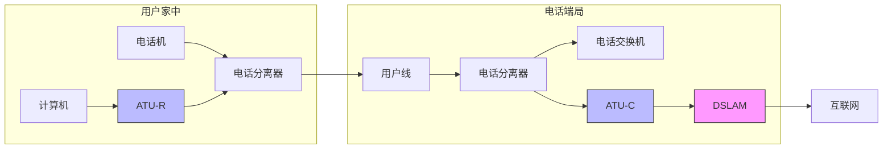
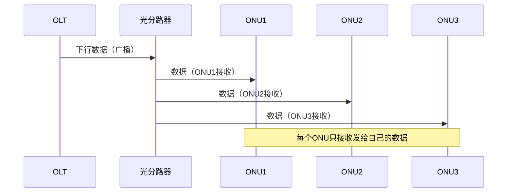
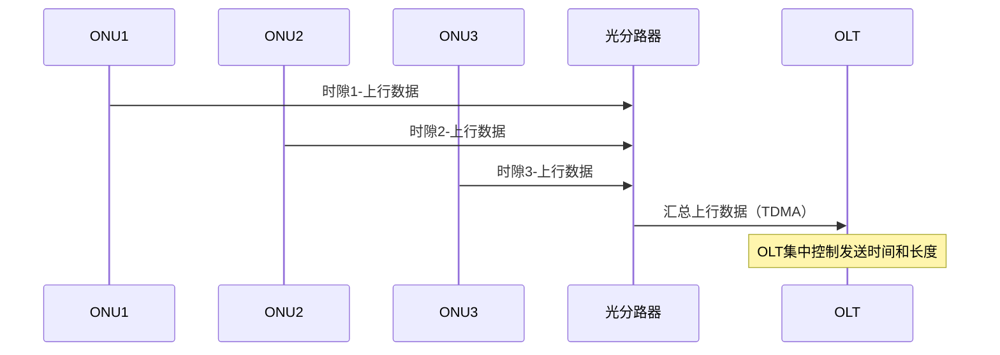

# 第2章-2.6 宽带接入技术

## 基本信息
- **课程**：计算机网络
- **章节**：第2章 物理层 - 2.6节
- **日期**：2026-06-26
- **标签**：#宽带接入 #ADSL #HFC #FTTx #PON #EPON #GPON

---

## 重点内容
- ⭐⭐ ADSL技术原理和特点
- ⭐⭐ HFC网的结构
- ⭐⭐⭐ FTTx技术
- ⭐⭐⭐ 无源光网络PON

---

## 📚 出处：第2章 2.6节"宽带接入技术"

---

## 详细笔记

### 1. 宽带接入技术概述 ⭐

**背景**：用户要连接到互联网，必须先连接到某个ISP，以便获得上网所需的IP地址。

**宽带标准的演变**：
- 最初：接入速率远大于56kbit/s就是宽带
- 后来：美国FCC认为双向速率之和超过200kbit/s就是宽带
- 2015年：FCC重新定义，下行速率调整至25Mbit/s，上行速率调整至3Mbit/s

**接入媒体分类**：

| 类型 | 说明 |
|:----:|:-----|
| **有线宽带接入** | 本节讨论的重点 |
| **无线宽带接入** | 在第9章中讨论 |

---

### 2.6.1 ADSL技术 ⭐⭐

**ADSL**（Asymmetric Digital Subscriber Line，非对称数字用户线）是用数字技术对现有模拟电话的用户线进行改造，使它能够承载宽带数字业务。

---

#### 1. ADSL的基本原理 ⭐⭐

**频谱划分**：
- **0～4kHz**：低端频谱留给传统电话使用
- **4kHz～1.1MHz**：高端频谱留给用户上网使用

**"非对称"的含义**：
- 下行（从ISP到用户）带宽远大于上行（从用户到ISP）带宽
- 这是因为用户上网主要是下载文档，发送的信息量一般都不太大

📚 出处：第2章 2.6.1节"ADSL技术"

---

#### 2. ADSL的传输特性 ⭐

**传输距离与数据率的关系**：

| 线径 | 数据率 | 传输距离 |
|:----:|:------:|:--------:|
| 0.5mm | 1.5～2.0 Mbit/s | 5.5km |
| 0.5mm | 6.1 Mbit/s | 3.7km |
| 0.4mm | 6.1 Mbit/s | 2.7km |

**影响因素**：ADSL所能得到的最高数据传输速率还与实际的用户线上的信噪比密切相关。

---

#### 3. DMT调制技术 ⭐⭐

我国采用的方案是**离散多音调DMT**（Discrete Multi-Tone）调制技术。

##### 📷 图2-21 DMT技术的频谱分布

> 📚 **课本出处**：图2-21 展示了DMT技术的频谱分布，上行和下行信道的划分

---

**DMT技术特点**：

| 信道类型 | 子信道数量 | 用途 |
|:--------:|:----------:|:-----|
| **上行信道** | 25个 | 用户向ISP发送数据 |
| **下行信道** | 249个 | ISP向用户发送数据 |

**工作原理**：
- 采用频分复用的方法，把40kHz以上一直到1.1MHz的高端频谱划分为许多子信道
- 使用不同的载波（即不同的音调）进行数字调制
- 相当于在一对用户线上使用许多小的调制解调器并行地传送数据

**自适应调制**：
- ADSL启动时，两端的调制解调器会测试可用的频率、各子信道受到的干扰情况
- 选择合适的调制方案以获得尽可能高的数据率
- 因此ADSL**不能保证固定的数据率**

---

#### 4. ADSL的网络组成 ⭐⭐

##### 📷 图2-22 基于ADSL的接入网组成

> 📚 **课本出处**：图2-22 展示了基于ADSL的接入网的三大部分组成

---

**ADSL接入网的网络拓扑**：

**ADSL接入网的三大组成部分**：

| 组成部分 | 说明 |
|:--------:|:-----|
| **DSLAM** | 数字用户线接入复用器，包含许多ADSL调制解调器 |
| **用户线** | 电话用户线（铜线） |
| **用户家中设施** | 包括电话分离器和ATU-R |

---

**关键设备**：

| 设备名称 | 英文缩写 | 位置 | 功能 |
|:--------:|:--------:|:----:|:-----|
| **ATU-C** | Access Termination Unit-Central | 电话端局 | 局端的ADSL调制解调器 |
| **ATU-R** | Access Termination Unit-Remote | 用户家中 | 用户端的ADSL调制解调器 |
| **电话分离器** | Splitter | 用户家中和端局 | 利用低通滤波器将电话信号与数字信号分开 |

**重要特性**：电话分离器是无源的，停电时不影响传统电话的使用。

📚 出处：第2章 2.6.1节"ADSL网络组成"

---

#### 5. ADSL的优势和限制

**优势**：
- 可以利用现有电话网中的用户线（铜线），不需要重新布线
- 适合有历史意义的古老建筑（不能破坏原有建筑）

**限制**：
- 不适合企业（企业往往需要使用上行信道发送大量数据）
- 传输距离受限

---

#### 6. xDSL技术系列 ⭐

| 技术 | 英文全称 | 特点 |
|:----:|:--------|:-----|
| **SDSL** | Symmetric DSL | 对称DSL，上下行带宽平均分配 |
| **HDSL** | Highspeed DSL | 高速DSL，数据速率可达768kbit/s或1.5Mbit/s |
| **VDSL** | Very high speed DSL | 甚高速DSL，下行速率达50～55Mbit/s |
| **G.fast** | - | 超高速DSL，100m距离提供900Mbit/s |

---

### 2.6.2 光纤同轴混合网（HFC网）⭐⭐

**HFC**（Hybrid Fiber Coax）是在目前覆盖面很广的有线电视网的基础上开发的一种居民宽带接入网。

---

#### 1. HFC网的结构 ⭐⭐

##### 📷 图2-23 HFC网的结构图

> 📚 **课本出处**：图2-23 展示了HFC网的结构，从光纤节点到用户的连接方式

---

**HFC网的改造**：
- 把原有线电视网中的同轴电缆主干部分改换为光纤
- 光纤从头端连接到光纤节点
- 在光纤节点光信号被转换为电信号，然后通过同轴电缆传送到每个用户家庭

**网络参数**：
- 光纤节点与头端的典型距离为 25km
- 从光纤节点到用户的距离不超过 2～3km
- 连接到一个光纤节点的典型用户数是500左右，但不超过2000

---

#### 2. HFC网的频带划分 ⭐

##### 📷 图2-24 我国的HFC网的频带划分

> 📚 **课本出处**：图2-24 展示了我国HFC网的频带划分方案

---

**频带划分**：

| 频段 | 用途 |
|:----:|:-----|
| **5～50MHz** | 上行信道（交互数字电视、上网） |
| **50～550MHz** | 下行模拟电视（传统有线电视） |
| **550～750MHz** | 下行数字电视、数据 |
| **750MHz以上** | 双向数字业务 |

---

#### 3. 电缆调制解调器 ⭐⭐

**电缆调制解调器**（cable modem）：
- 只需安装在用户端（不需要成对使用）
- 比ADSL使用的调制解调器复杂得多
- 必须解决共享信道中可能出现的冲突问题

**与ADSL的区别**：

| 特性 | ADSL | HFC电缆调制解调器 |
|:----:|:----:|:-----------------:|
| **信道使用** | 专用 | 共享 |
| **数据率确定性** | 确定（与他人无关） | 不确定（取决于用户数量） |
| **峰值速率** | 可达6Mbit/s以上 | 可达10Mbit/s甚至30Mbit/s |
| **实际体验** | 稳定 | 随用户数量增加而下降 |

📚 出处：第2章 2.6.2节"光纤同轴混合网"

---

### 2.6.3 FTTx技术 ⭐⭐⭐

**FTTx**表示Fiber To The...（光纤到...），这里字母x可代表不同的光纤接入地点。

---

#### 1. FTTx的种类 ⭐⭐

| 技术 | 英文全称 | 含义 |
|:----:|:--------|:-----|
| **FTTH** | Fiber To The Home | 光纤到户 |
| **FTTC** | Fiber To The Curb | 光纤到路边 |
| **FTTZ** | Fiber To The Zone | 光纤到小区 |
| **FTTB** | Fiber To The Building | 光纤到大楼 |
| **FTTF** | Fiber To The Floor | 光纤到楼层 |
| **FTTO** | Fiber To The Office | 光纤到办公室 |
| **FTTD** | Fiber To The Desk | 光纤到桌面 |

**发展趋势**：光网络单元ONU越来越靠近用户的家庭，因此有了**"光进铜退"**的说法。

📚 出处：第2章 2.6.3节"FTTx技术"

---

#### 2. 无源光网络PON ⭐⭐⭐

为了有效地利用光纤资源，在光纤干线和广大用户之间，还需要铺设一段中间的转换装置即**光配线网ODN**（Optical Distribution Network），使得数十个家庭用户能够共享一根光纤干线。

📌 **"无源"**表明在光配线网中无须配备电源，因此基本上不用维护，其长期运营成本和管理成本都很低。

---

##### 📷 图2-25 无源光配线网的组成

> 📚 **课本出处**：图2-25 展示了无源光配线网的组成，包括OLT、光分路器和ONU

---

**PON的组成设备**：

| 设备名称 | 英文缩写 | 位置 | 功能 |
|:--------:|:--------:|:----:|:-----|
| **OLT** | Optical Line Terminal | 光纤干线终端 | 连接到光纤干线的终端设备 |
| **ONU** | Optical Network Unit | 用户端 | 光网络单元 |
| **光分路器** | Splitter | OLT和ONU之间 | 典型分路比是1:32 |

---

**工作原理**：

##### 下行方向（OLT → ONU）广播方式

##### 上行方向（ONU → OLT）TDMA方式

**波分复用**：光配线网采用波分复用，上行和下行分别使用不同的波长。

📚 出处：第2章 2.6.3节"无源光网络PON"

---

#### 3. PON的主要类型 ⭐⭐

##### （1）EPON（以太网无源光网络）

**标准**：IEEE 802.3ah（2004年），较新版本是802.3ah-2008

**特点**：
- 在链路层使用以太网协议
- 利用PON的拓扑结构实现了以太网的接入
- 与现有以太网的兼容性好
- 成本低，扩展性强，管理方便

---

##### （2）GPON（吉比特无源光网络）

**标准**：ITU-T G.984（2003年），目前最新的是G.984.7（2010年）

**特点**：
- 采用通用封装方法GEM（Generic Encapsulation Method）
- 可承载多业务
- 对各种业务类型都能够提供服务质量保证
- 总体性能比EPON好
- 成本稍高，但仍是很有潜力的宽带光纤接入技术

---

**EPON vs GPON对比**：

| 特性 | EPON | GPON |
|:----:|:----:|:----:|
| **标准组织** | IEEE | ITU-T |
| **链路层协议** | 以太网 | GEM |
| **成本** | 较低 | 较高 |
| **性能** | 一般 | 较好 |
| **多业务支持** | 一般 | 优秀 |
| **QoS保证** | 一般 | 优秀 |

📚 出处：第2章 2.6.3节"EPON和GPON"

---

#### 4. FTTx的应用现状

**中国的发展**：
- 截至2019年12月，我国光纤接入FTTH/O的用户已占互联网宽带接入用户总数的 **92.9%**
- 光纤接入已在我们互联网宽带接入中占绝对优势

**注意**：有些网络运营商宣传的"光纤到户"，往往并非真正的FTTH，而是FTTB或FTTF。

---

## 💡 重点总结

### 宽带接入技术对比 ⭐⭐

| 技术 | 传输介质 | 主要优点 | 主要缺点 | 适用场景 |
|:----:|:--------:|:---------|:---------|:---------|
| **ADSL** | 电话线 | 利用现有线路，不需要重新布线 | 下行快上行慢，距离受限 | 居民家庭 |
| **HFC** | 有线电视线 | 带宽较大，覆盖面广 | 共享信道，用户多时速率下降 | 有线电视用户 |
| **FTTx** | 光纤 | 速度快，质量稳定 | 需要铺设光纤，成本较高 | 新建小区、商业区 |

### 关键设备速记

| 技术 | 关键设备 | 功能 |
|:----:|:--------:|:-----|
| **ADSL** | ATU-C, ATU-R, Splitter | 调制解调和信号分离 |
| **HFC** | Cable Modem | 电缆调制解调器 |
| **PON** | OLT, ONU, Splitter | 光电转换和信号分配 |

---

## 📝 疑问与思考

1. 为什么ADSL是"非对称"的？这种设计适合什么样的应用场景？
2. HFC网中的电缆调制解调器如何解决共享信道的冲突问题？
3. 为什么说"光进铜退"是宽带接入的发展趋势？
4. EPON和GPON各适用于什么场景？
5. 为什么无源光网络不需要配备电源？这样做有什么优势？

---

## 🔗 相关链接

- **上一节**：第2章 2.5节 数字传输系统
- **本章总结**：第2章 本章重要概念
- **相关章节**：第9章 无线网络和移动网络（无线宽带接入）

---

## 📚 课后习题

### 习题2-17
**问题**：试比较ADSL, HFC以及FTTx接入技术的优缺点。

**解答要点**：
- **ADSL**：优点是利用现有电话线；缺点是非对称，距离受限
- **HFC**：优点是覆盖面广，带宽较大；缺点是共享信道，用户多时性能下降
- **FTTx**：优点是速度快，质量稳定；缺点是需要铺设光纤，成本较高

### 习题2-18
**问题**：在ADSL技术中，为什么在不到1MHz的带宽中却可以使传送速率高达每秒几个兆比特？

**解答要点**：
- 采用DMT调制技术，将频谱划分为多个子信道
- 每个子信道独立进行数字调制
- 相当于多个小调制解调器并行工作
- 采用自适应调制技术，根据线路质量选择最优调制方案

### 习题2-19
**问题**：什么是EPON和GPON？

**解答要点**：
- **EPON**：以太网无源光网络，在链路层使用以太网协议，成本低，与现有以太网兼容性好
- **GPON**：吉比特无源光网络，采用通用封装方法GEM，可承载多业务，总体性能更好

---

*最后更新：2026-06-26*