# 第2章 物理层

## 基本信息
- **课程**：计算机网络
- **章节**：第2章 物理层
- **日期**：2026-06-26
- **标签**：#物理层 #数据通信 #传输媒体 #复用技术 #宽带接入

---

## 📌 章节概述

本章首先讨论物理层的基本概念，然后介绍有关数据通信的重要概念，以及各种传输媒体的主要特点（但传输媒体本身并不属于物理层的范围）。在讨论几种常用的信道复用技术后，对数字传输系统进行简单介绍。最后讨论几种常用的宽带接入技术。

### 🎯 本章重点内容
1. 物理层的任务
2. 几种常用的信道复用技术
3. 几种常用的宽带接入技术，重点是FTTx

---

## 2.1 物理层的基本概念 ⭐

### 📚 出处：第2章 2.1节"物理层的基本概念"

#### 核心任务

物理层考虑的是怎样才能在连接各种计算机的传输媒体上传输数据比特流，而不是指具体的传输物理层的作用正是要尽可能地屏蔽掉这些传输媒体和通信手段的差异，使物理层上面的数据链路层感觉不到这些差异。

📌 物理层的主要任务是确定与传输媒体的接口有关的**四个特性**：

| 特性类型 | 说明 | 具体内容 |
|:--------:|:----:|:--------|
| **机械特性** | 接口形状 | 指明接口所用接线器的形状和尺寸、引脚数目和排列、固定和锁定装置等 |
| **电气特性** | 电压范围 | 指明在接口电缆的各条线上出现的电压的范围 |
| **功能特性** | 信号含义 | 指明某条线上出现的某一电平的电压的意义 |
| **过程特性** | 事件顺序 | 指明对于不同功能的各种可能事件的出现顺序 |

#### 传输方式

数据在计算机内部多采用**并行传输**方式，但数据在通信线路上的传输方式一般都是**串行传输**（出于经济考虑），即逐个比特按照时间顺序传输。因此物理层还要完成传输方式的转换。

---

## 2.2 数据通信的基础知识 ⭐⭐

### 📚 出处：第2章 2.2节"数据通信的基础知识"

#### 2.2.1 数据通信系统的模型

一个数据通信系统可划分为**三大部分**：

```
源系统 ──→ 传输系统 ──→ 目的系统
```

- **源系统**：包括源点（产生数据）和发送器（编码数据）
- **传输系统**：可以是简单的传输线，也可以是复杂的网络系统
- **目的系统**：包括接收器（解码信号）和终点（输出信息）

#### 📷 图号 图2-1 数据通信系统的模型
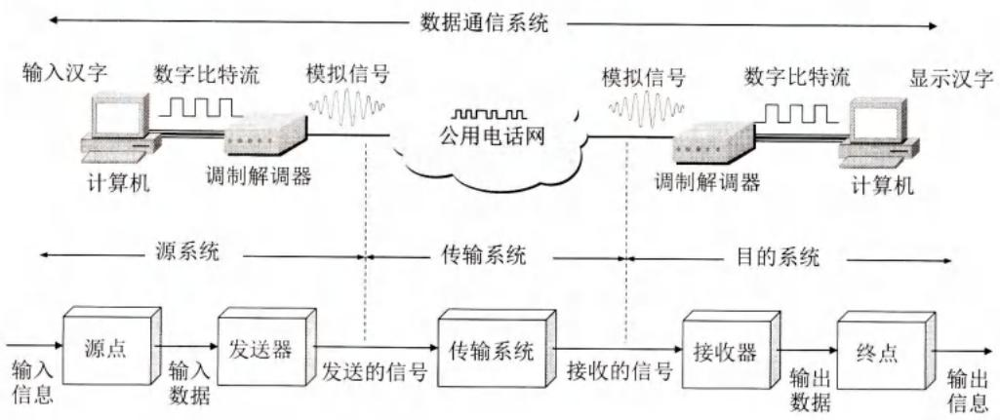
> 📚 课本出处：图2-1 数据通信系统的模型

#### 基本术语

| 术语 | 定义 |
|:----:|:-----|
| **消息** | 通信要传送的内容，如话音、文字、图像、视频等 |
| **数据** | 运送消息的实体，是有意义的符号序列 |
| **信号** | 数据的电气或电磁的表现 |

#### 信号分类

| 信号类型 | 特点 | 示例 |
|:--------:|:----:|:-----|
| **模拟信号**（连续信号） | 代表消息的参数取值是连续的 | 电话用户线上传送的信号 |
| **数字信号**（离散信号） | 代表消息的参数取值是离散的 | 计算机到调制解调器之间的信号 |

💡 **码元**：在使用时域波形表示数字信号时，代表不同离散数值的基本波形称为码元。在使用二进制编码时，只有两种不同的码元，一种代表0状态而另一种代表1状态。

#### 2.2.2 有关信道的基本概念

**信道和电路并不等同**。信道一般都是用来表示向某一个方向传送信息的媒体。一条通信电路往往包含一条发送信道和一条接收信道。

#### 通信方式

| 通信方式 | 别名 | 特点 | 信道需求 |
|:--------:|:----:|:-----|:--------:|
| **单向通信** | 单工通信 | 只能有一个方向的通信，没有反方向交互 | 1条信道 |
| **双向交替通信** | 半双工通信 | 双方都可以发送信息，但不能同时发送 | 2条信道 |
| **双向同时通信** | 全双工通信 | 双方可以同时发送和接收信息 | 2条信道 |

💡 **提示**：有时人们常用"单工"表示"双向交替通信"，如常说的"单工电台"并不是只能进行单向通信。

#### 调制的基本概念

来自信源的信号常称为**基带信号**（基本频带信号）。许多信道不能传输低频分量或直流分量，因此需要对基带信号进行调制。

调制可分为两大类：

1. **基带调制（编码）**：仅对基带信号的波形进行变换，使它能够与信道特性相适应。变换后的信号仍然是基带信号。

2. **带通调制**：使用载波进行调制，把基带信号的频率范围搬移到较高的频段，并转换为模拟信号。

#### 📷 图号 图2-2 常用编码方法
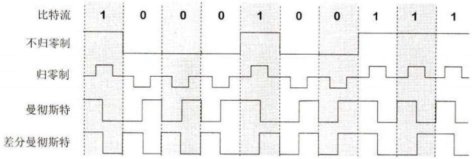
> 📚 课本出处：图2-2 数字信号常用的编码方法

#### 常用编码方式

| 编码方式 | 特点 |
|:--------:|:-----|
| **不归零制** | 正电平代表1，负电平代表0 |
| **归零制** | 正脉冲代表1，负脉冲代表0 |
| **曼彻斯特编码** | 位周期中心的向上跳变代表0，向下跳变代表1（或反过来） |
| **差分曼彻斯特编码** | 位开始边界有跳变代表0，无跳变代表1 |

💡 **重要特性**：
- 不归零制不能从信号波形中提取时钟频率（**没有自同步能力**）
- 曼彻斯特编码具有**自同步能力**

#### 📷 图号 图2-3 基本调制方法
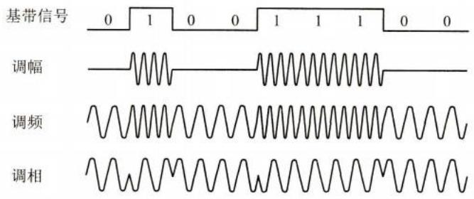
> 📚 课本出处：图2-3 最基本的三种调制方法

#### 基本的带通调制方法

| 调制方式 | 英文缩写 | 调制原理 |
|:--------:|:--------:|:--------|
| **调幅** | AM | 载波的振幅随基带数字信号而变化 |
| **调频** | FM | 载波的频率随基带数字信号而变化 |
| **调相** | PM | 载波的初始相位随基带数字信号而变化 |

💡 为了达到更高的信息传输速率，可以采用**正交振幅调制QAM**等更复杂的多元制调制方法。

#### 2.2.3 信道的极限容量 ⭐⭐

限制码元在信道上的传输速率的因素有两个：

##### （1）奈氏准则（Nyquist Criterion）

**适用条件**：带宽为 $W(\mathrm{Hz})$ 的低通信道，不考虑噪声影响

**结论**：码元传输的最高速率是 $2W$ 码元/秒

📌 **公式**：
$$
\text{最高码元传输速率} = 2W \text{ (码元/秒)}
$$

📚 出处：第2章 2.2.3节"奈氏准则"

**示例**：若信道带宽为4000 Hz，则最高码元传输速率 = 8000码元/秒

⚠️ 传输速率超过此上限，会出现严重的**码间串扰**问题。

##### （2）香农公式（Shannon's Theorem）

**适用条件**：有噪声的实际信道

**信噪比计算**：
$$
\text{信噪比(dB)} = 10\log_{10}(S/N) \text{ (dB)}
$$

例如：当 $S/N = 10$ 时，信噪比为10dB；当 $S/N = 1000$ 时，信噪比为30dB。

📚 出处：第2章 2.2.3节"香农公式"(公式2-2)

📌 **香农公式**：
$$
C = W\log_2(1 + S/N) \text{ (bit/s)}
$$

其中：
- $C$：信道的极限信息传输速率
- $W$：信道带宽（以Hz为单位）
- $S$：信道内所传信号的平均功率
- $N$：信道内部的高斯噪声功率

💡 **香农公式的意义**：
1. 信道的带宽或信道中的信噪比越大，信息的极限传输速率就越高
2. **只要信息传输速率低于信道的极限信息传输速率，就一定存在某种办法来实现无差错的传输**

⚠️ **奈氏准则与香农公式的区别**：
- 奈氏准则：激励工程人员不断探索更加先进的编码技术，使每一个码元携带更多比特的信息量
- 香农公式：告诫工程人员，在有噪声的实际信道上，不论采用多么复杂的编码技术，都不可能突破其给出的信息传输速率的绝对极限

#### 提高数据传输速率的方法

在频带宽度确定的信道上，如果信噪比也不能再提高，可以采用**编码的方法让每一个码元携带更多比特的信息量**。

**示例**：
- 原本每个码元携带1bit信息
- 若将每3个比特编为一组，则同样的码元速率可将信息传输速率提高到3倍
- 8个比特有256种不同排列，需要接收端能从噪声干扰中准确判断

---

## 2.3 物理层下面的传输媒体

### 📚 出处：第2章 2.3节"物理层下面的传输媒体"

传输媒体可分为两大类：
- **导引型传输媒体**：电磁波被导引沿着固体媒体（铜线或光纤）传播
- **非导引型传输媒体**：自由空间，电磁波在其中传输称为无线传输

#### 📷 图号 图2-5 电信领域使用的电磁波频谱
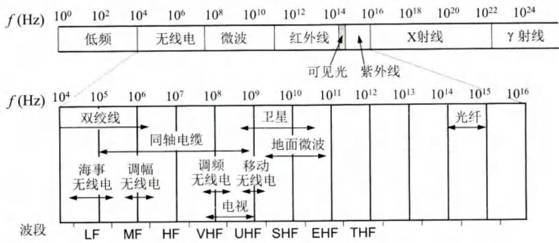
> 📚 课本出处：图2-5 电信领域使用的电磁波的频谱

### 2.3.1 导引型传输媒体

#### 1. 双绞线 ⭐

双绞线是最古老但也是最常用的传输媒体，把两根互相绝缘的铜导线并排放在一起，然后用规则的方法绞合起来构成。

**绞合的作用**：减少对相邻导线的电磁干扰

#### 📷 图号 图2-6 几种不同的双绞线
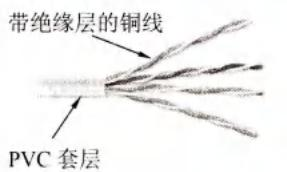
> 📚 课本出处：图2-6 几种不同的双绞线

**分类**：
- **无屏蔽双绞线UTP**：价格较便宜
- **屏蔽双绞线STP**：具有更好的抗干扰能力
  - F/UTP：铝箔屏蔽层
  - S/UTP：金属编织层屏蔽
  - F/FTP或S/FTP：双重屏蔽

📚 出处：第2章 2.3.1节"双绞线"

#### 表2-1 常用的绞合线的类别、带宽和典型应用

| 绞合线类别 | 带宽 | 线缆特点 | 典型应用 |
|:----------:|:----:|:--------|:---------|
| 3 | 16 MHz | 2对4芯双绞线 | 模拟电话；传统以太网(10 Mbit/s) |
| 5 | 100 MHz | 增加了绞合度 | 传输速率100 Mbit/s(距离100m) |
| 5E(超5类) | 125 MHz | 衰减更小 | 传输速率1 Gbit/s(距离100m) |
| 6 | 250 MHz | 改善了串扰等性能 | 传输速率10 Gbit/s(距离35~55m) |
| 6A | 500 MHz | 改善了串扰等性能 | 传输速率10 Gbit/s(距离100m) |
| 7 | 600 MHz | 必须使用屏蔽双绞线 | 传输速率超过10 Gbit/s,距离100m |
| 8 | 2000 MHz | 必须使用屏蔽双绞线 | 传输速率25/40 Gbit/s,距离30m |

#### 2. 同轴电缆

同轴电缆由内导体铜质芯线、绝缘层、网状编织的外导体屏蔽层以及绝缘保护套层所组成。

**特点**：具有很好的抗干扰特性，被广泛用于传输较高速率的数据。

📚 出处：第2章 2.3.1节"同轴电缆"

#### 📷 图号 图2-7 同轴电缆的结构
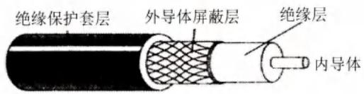
> 📚 课本出处：图2-7 同轴电缆的结构

#### 3. 光缆 ⭐⭐

光纤通信就是利用光导纤维传递光脉冲来进行通信的。有光脉冲相当于1，而没有光脉冲相当于0。

**特点**：
- 传输带宽远大于其他传输媒体
- 可见光的频率约为 $10^{8}\mathrm{MHz}$ 量级

📚 出处：第2章 2.3.1节"光缆"

#### 📷 图号 图2-8 光线在光纤中的折射
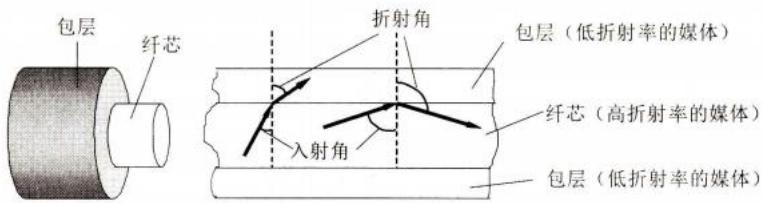
> 📚 课本出处：图2-8 光线在光纤中的折射

#### 光纤的分类

| 光纤类型 | 特点 | 应用场景 |
|:--------:|:-----|:---------|
| **多模光纤** | 光脉冲在传输时会逐渐展宽，造成失真 | 近距离传输 |
| **单模光纤** | 光纤的直径减小到只有一个光的波长 | 长距离、高速率传输 |

#### 📷 图号 图2-10 多模光纤和单模光纤的比较
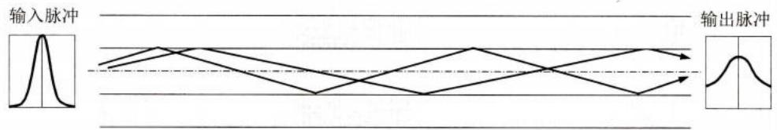
> 📚 课本出处：图2-10 多模光纤(a)和单模光纤(b)的比较

**光纤的优点**：
1. 传输损耗小，中继距离长
2. 抗雷电和电磁干扰性能好
3. 无串音干扰，保密性好
4. 体积小，重量轻

**常用波段**：850nm、1300nm、1550nm，带宽为25000～30000GHz

#### 📷 图号 图2-11 四芯光缆剖面示意图
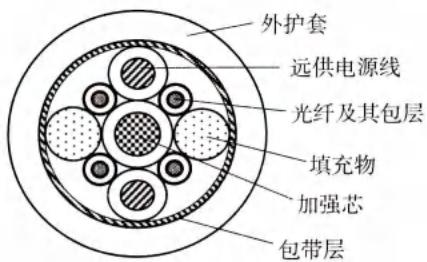
> 📚 课本出处：图2-11 四芯光缆剖面的示意图

### 2.3.2 非导引型传输媒体

#### 微波通信

微波的频率范围为 $300\mathrm{MHz}\sim 300\mathrm{GHz}$（波长1m～1mm），主要使用 $2\mathrm{GHz}\sim 40\mathrm{GHz}$ 的频率范围。

**特点**：
- 在空间主要是直线传播
- 传播距离一般只有50km左右（采用100m高天线塔可增大到100km）
- 微波会穿透电离层而进入宇宙空间

#### 多径效应

基站发出的信号可以经过多个障碍物的数次反射到达手机，多条路径的信号叠加后会产生很大的失真。

📚 出处：第2章 2.3.2节"非导引型传输媒体"

#### 📷 图号 图2-12 多径效应的影响
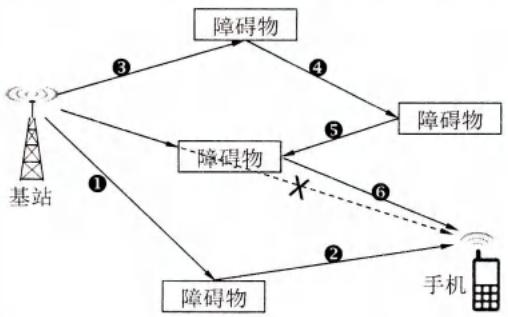
> 📚 课本出处：图2-12 多径效应的影响

#### 卫星通信

- 利用约3万6千公里高空的人造同步地球卫星作为中继器
- 最大特点：通信距离远，且通信费用与通信距离无关
- 传播时延：250～300ms（一般取270ms）

📚 出处：第2章 2.3.2节"卫星通信"

---

## 2.4 信道复用技术 ⭐⭐⭐

### 📚 出处：第2章 2.4节"信道复用技术"

**复用**是通信技术中的基本概念。

#### 📷 图号 图2-15 复用的示意图

> 📚 课本出处：图2-15 复用的示意图

### 2.4.1 频分复用、时分复用和统计时分复用

#### 📷 图号 图2-16 频分复用和时分复用

> 📚 课本出处：图2-16 频分复用(a)和时分复用(b)

#### 三种基本复用方式对比

| 复用方式 | 英文缩写 | 原理 | 特点 |
|:--------:|:--------:|:-----|:-----|
| **频分复用** | FDM | 把各路信号分别搬移到适当的频率位置 | 各路信号在同样的时间占用不同的带宽资源 |
| **时分复用** | TDM | 将时间划分为等长的TDM帧，每路信号在每帧中占用固定时隙 | 所有用户在不同时间占用同样的频带宽度 |
| **统计时分复用** | STDM | 按需动态分配时隙，提高信道利用率 | 又称为异步时分复用 |

**时分复用帧长度**：始终是125μs

📚 出处：第2章 2.4.1节"频分复用、时分复用和统计时分复用"

#### 📷 图号 图2-17 时分复用造成线路资源浪费

> 📚 课本出处：图2-17 时分复用可能会造成线路资源的浪费

**统计时分复用STDM的优势**：
- 每个STDM帧中的时隙数小于连接在集中器上的用户数
- 按需动态分配时隙
- 明显提高信道利用率

#### 📷 图号 图2-18 统计时分复用的工作原理

> 📚 课本出处：图2-18 统计时分复用的工作原理

#### 多址接入技术

| 技术类型 | 英文缩写 | 说明 |
|:--------:|:--------:|:-----|
| **频分多址接入** | FDMA | 让多个用户使用频分信道 |
| **时分多址接入** | TDMA | 让多个用户使用时分信道 |

⚠️ **注意区分**：
- **FDM/TDM**：强调在频域或时域进行复用，不强调用于多用户
- **FDMA/TDMA**：强调复用信道可以让多个用户（可在不同地点）接入

### 2.4.2 波分复用 ⭐

波分复用WDM就是**光的频分复用**。

#### 📷 图号 图2-19 波分复用的概念

> 📚 课本出处：图2-19 波分复用的概念

**波分复用的演进**：
- 最初：在一根光纤上复用两路光载波信号
- 现在：**密集波分复用DWDM**，可在一根光纤上复用几十路或更多路光载波信号

**示例**：
- 每路数据率40 Gbit/s，复用64路 → 总速率2.56 Tbit/s
- 掺饵光纤放大器EDFA：不需要光电转换直接对光信号进行放大
- 两个光纤放大器之间的光缆线路长度可达120km

📚 出处：第2章 2.4.2节"波分复用"

### 2.4.3 码分复用 ⭐⭐⭐

码分复用CDM是另一种共享信道的方法。当码分复用信道为多个不同地址的用户所共享时，就称为**码分多址CDMA**。

**特点**：
- 每一个用户可以在同样的时间使用同样的频带进行通信
- 各用户使用经过特殊挑选的不同码型，不会造成干扰
- 最初用于军事通信，现已广泛应用于民用移动通信，特别是在无线局域网中

📚 出处：第2章 2.4.3节"码分复用"

#### 码片序列的概念

在CDMA中，每一个比特时间再划分为 $m$ 个短的间隔，称为**码片(chip)**。通常 $m$ 的值是64或128。

每个站被指派一个唯一的 $m$ bit**码片序列**：
- 发送比特1：发送自己的 $m$ bit码片序列
- 发送比特0：发送该码片序列的二进制反码

#### 📷 图号 图2-20 CDMA的工作原理

> 📚 课本出处：图2-20 CDMA的工作原理

#### 码片序列的正交性 ⭐

两个不同站的码片序列必须**互相正交**，用向量表示时规格化内积为0：

$$
\boldsymbol{S} \cdot \boldsymbol{T} \equiv \frac{1}{m}\sum_{i=1}^{m}S_iT_i = 0
$$

**重要性质**：
- 任何两个不同站的码片序列内积为0
- 一个码片向量和该码片反码向量的内积为-1
- 任何一个码片向量和自己的规格化内积为1：$\boldsymbol{S} \cdot \boldsymbol{S} = 1$

📚 出处：第2章 2.4.3节"正交性公式"(公式2-3和2-4)

#### CDMA的工作原理

当接收站要接收某站发送的信号时，使用该站的码片序列与收到的信号求规格化内积：
- 发送比特1时，内积结果为+1
- 发送比特0时，内积结果为-1

所有其他站的信号都被过滤掉（内积为0），实现码分多址通信。

---

## 2.5 数字传输系统

### 📚 出处：第2章 2.5节"数字传输系统"

#### 早期数字传输系统的缺点

1. **速率标准不统一**：有两个互不兼容的国际标准
   - 北美和日本的T1速率（1.544 Mbit/s）
   - 欧洲的E1速率（2.048 Mbit/s）

2. **不是同步传输**：采用准同步方式，各支路信号的时钟频率有一定的偏差

#### 同步光纤网SONET/同步数字系列SDH ⭐

为解决上述问题，美国在1988年首先推出了同步光纤网SONET，后来ITU-T制定了国际标准SDH。

**SONET的速率等级**：以51.840 Mbit/s为基础

#### 表2-2 SONET和SDH的对应关系

| 线路速率 (Mbit/s) | 近似值 | SONET符号 | ITU-T符号 | 话路数 |
|:-----------------:|:------:|:---------:|:---------:|:------:|
| 51.840 | - | OC-1/STS-1 | - | 810 |
| 155.520 | 155 Mbit/s | OC-3/STS-3 | STM-1 | 2430 |
| 622.080 | 622 Mbit/s | OC-12/STS-12 | STM-4 | 9720 |
| 2488.320 | 2.5 Gbit/s | OC-48/STS-48 | STM-16 | 38880 |
| 9953.280 | 10 Gbit/s | OC-192/STS-192 | STM-64 | 155520 |
| 39813.120 | 40 Gbit/s | OC-768/STS-768 | STM-256 | 622080 |

📚 出处：第2章 2.5节"数字传输系统"

---

## 2.6 宽带接入技术 ⭐⭐

### 📚 出处：第2章 2.6节"宽带接入技术"

从宽带接入的媒体来看，可分为两大类：
- **有线宽带接入**
- **无线宽带接入**（在第9章中讨论）

### 2.6.1 ADSL技术 ⭐⭐

非对称数字用户线ADSL是用数字技术对现有模拟电话的用户线进行改造，使它能够承载宽带数字业务。

**特点**：
- 下行带宽远大于上行带宽（"非对称"的由来）
- 利用现有电话网中的用户线（铜线），不需要重新布线

📚 出处：第2章 2.6.1节"ADSL技术"

#### ADSL的调制技术

采用**离散多音调DMT**调制技术，使用频分复用把高端频谱划分为许多子信道：
- 25个子信道用于上行信道
- 249个子信道用于下行信道

#### 📷 图号 图2-21 DMT技术的频谱分布
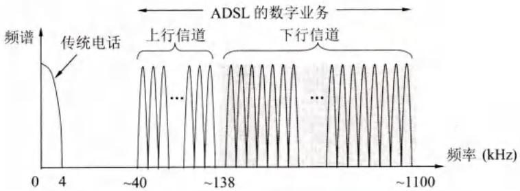
> 📚 课本出处：图2-21 DMT技术的频谱分布

#### 基于ADSL的接入网组成

由三大部分组成：
1. 数字用户线接入复用器DSLAM
2. 用户线
3. 用户家中的一些设施

#### 📷 图号 图2-22 基于ADSL的接入网组成
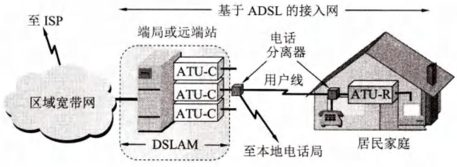
> 📚 课本出处：图2-22 基于ADSL的接入网的组成

#### ADSL技术的演进

| 版本 | 标准 | 下行速率 | 上行速率 | 特点 |
|:----:|:----:|:--------:|:--------:|:-----|
| 第一代ADSL | G.992.1 | 1.5~8 Mbit/s | 512 kbit/s | 使用DMT技术 |
| ADSL2 | G.992.3 | 8 Mbit/s | 800 kbit/s | 更高的数据率 |
| ADSL2+ | G.992.5 | 16 Mbit/s | 800 kbit/s | 频谱扩展到2.2MHz |

📚 出处：第2章 2.6.1节"ADSL技术的演进"

#### xDSL技术系列

| 技术 | 全称 | 特点 |
|:----:|:-----|:-----|
| SDSL | 对称DSL | 上下行带宽平均分配 |
| HDSL | 高速DSL | 数据速率可达768kbit/s或1.5Mbit/s |
| VDSL | 甚高速DSL | 下行速率达50~55Mbit/s |
| G.fast | - | 在100m距离提供900Mbit/s的接入速率 |

### 2.6.2 光纤同轴混合网（HFC网）⭐

HFC网是在有线电视网的基础上开发的居民宽带接入网。

**特点**：
- 把原有线电视网中的同轴电缆主干部分改换为光纤
- 光纤从头端连接到光纤节点，在光纤节点光信号被转换为电信号

📚 出处：第2章 2.6.2节"光纤同轴混合网"

#### 📷 图号 图2-23 HFC网的结构图
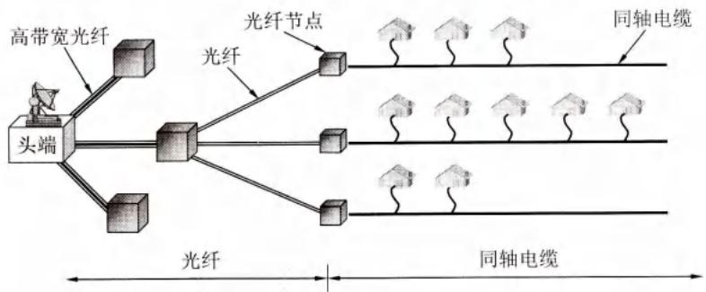
> 📚 课本出处：图2-23 HFC网的结构图

#### 📷 图号 图2-24 我国的HFC网的频带划分
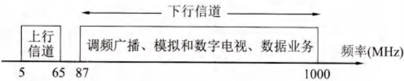
> 📚 课本出处：图2-24 我国的HFC网的频带划分

**电缆调制解调器**：
- 只需安装在用户端
- 比ADSL使用的调制解调器复杂得多
- 必须解决共享信道中可能出现的冲突问题

### 2.6.3 FTTx技术 ⭐⭐⭐

FTTx表示Fiber To The...，即光纤到...

**种类**：
- **FTTH**：光纤到户(Fiber To The Home)
- **FTTC**：光纤到路边(Fiber To The Curb)
- **FTTZ**：光纤到小区(Fiber To The Zone)
- **FTTB**：光纤到大楼(Fiber To The Building)
- **FTTF**：光纤到楼层(Fiber To The Floor)
- **FTTO**：光纤到办公室(Fiber To The Office)
- **FTTD**：光纤到桌面(Fiber To The Desk)

📚 出处：第2章 2.6.3节"FTTx技术"

#### 无源光网络PON ⭐

为了有效利用光纤资源，在光纤干线和广大用户之间需要铺设光配线网ODN。

#### 📷 图号 图2-25 无源光配线网的组成
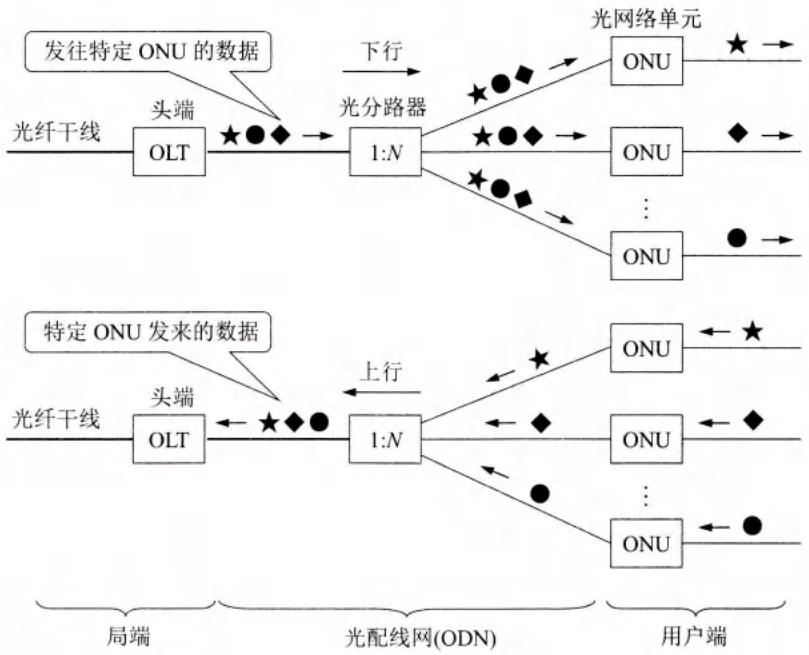
> 📚 课本出处：图2-25 无源光配线网的组成

**PON的组成**：
- **OLT**：光线路终端，连接到光纤干线的终端设备
- **ONU**：光网络单元，用户端设备
- **光分路器**：典型的分路比是1:32

**工作方式**：
- 下行：OLT广播方式向所有ONU发送，每个ONU根据标识只接收发给自己的数据
- 上行：各ONU以TDMA方式发送，由OLT集中控制

#### PON的主要类型

| 类型 | 全称 | 标准 | 特点 |
|:----:|:-----|:----:|:-----|
| **EPON** | 以太网无源光网络 | IEEE 802.3ah | 与现有以太网兼容性好，成本低 |
| **GPON** | 吉比特无源光网络 | ITU-T G.984 | 可承载多业务，总体性能好 |

---

## 本章的重要概念总结 ⭐⭐

### 1. 物理层的主要任务

确定与传输媒体的接口有关的四个特性：
- 机械特性
- 电气特性
- 功能特性
- 过程特性

### 2. 数据通信系统三大部分

- 源系统（源点、发送器）
- 传输系统
- 目的系统（接收器、终点）

### 3. 信号分类

- **模拟信号**：参数取值连续
- **数字信号**：参数取值离散

### 4. 通信方式

- 单向通信（单工）
- 双向交替通信（半双工）
- 双向同时通信（全全工）

### 5. 调制方式

- **基带调制（编码）**：变换波形，仍是基带信号
- **带通调制**：使用载波，转换为模拟信号

### 6. 传输速率限制

- **奈氏准则**：最高码元传输速率 = 2W（不考虑噪声）
- **香农公式**：$C = W\log_2(1 + S/N)$（考虑噪声）

### 7. 传输媒体分类

- **导引型**：双绞线、同轴电缆、光纤
- **非导引型**：无线、红外、大气激光

### 8. 信道复用技术

| 复用方式 | 特点 |
|:--------:|:-----|
| **频分复用FDM** | 同时占用不同带宽 |
| **时分复用TDM** | 不同时间占用同样带宽 |
| **统计时分复用STDM** | 动态分配时隙 |
| **波分复用WDM** | 光的频分复用 |
| **码分复用CDM** | 使用不同码型 |

### 9. 数字传输系统

- **SONET**：美国标准，以51.840 Mbit/s为基础
- **SDH**：国际标准，基本速率155.520 Mbit/s (STM-1)

### 10. 宽带接入技术

| 技术 | 原理 | 特点 |
|:----:|:-----|:-----|
| **ADSL** | 利用现有电话用户线 | 下行带宽远大于上行 |
| **HFC** | 在有线电视网基础上开发 | 共享信道 |
| **FTTx** | 光纤接入 | 速度快，光进铜退 |

### 11. 无源光网络PON

- **EPON**：与以太网兼容
- **GPON**：可承载多业务

---

## 💡 重点公式和概念速记

### 公式

1. **信噪比计算**：$\text{信噪比(dB)} = 10\log_{10}(S/N)$

2. **奈氏准则**：最高码元传输速率 = 2W (码元/秒)

3. **香农公式**：$C = W\log_2(1 + S/N)$ (bit/s)

4. **码片序列正交性**：$\boldsymbol{S} \cdot \boldsymbol{T} = 0$（不同站之间）

5. **码片自相关性**：$\boldsymbol{S} \cdot \boldsymbol{S} = 1$（同一站）

### 核心概念

- 物理层四个特性
- 基带信号与带通信号
- 编码与调制
- 码间串扰
- 码分多址CDMA
- 无源光网络PON

---

## 疑问与思考

❓ **疑问**：物理层的主要任务是什么？为什么不直接定义具体的传输媒体？

💡 **解答**：

- 物理层的主要任务是确定与传输媒体的接口有关的**四个特性**（机械、电气、功能、过程）
- 物理层**不定义具体的传输媒体**，而是要尽可能地屏蔽掉各种传输媒体和通信手段的差异
- 这样做的好处是：使物理层上面的数据链路层感觉不到底层的差异，无论底层是双绞线、光纤还是无线，上层协议都可以统一处理
- 📚 出处：第2章 2.1节"物理层的基本概念"

❓ **疑问**：物理层的四个特性分别解决什么问题？

💡 **解答**：

| 特性 | 解决的问题 | 典型例子 |
|:----:|:----------|:---------|
| 机械特性 | 接口的物理规格（形状、尺寸、引脚） | USB接口、RJ-45接口的形状 |
| 电气特性 | 电压范围和信号电平 | RS-232逻辑"1"为-15V~-5V |
| 功能特性 | 各条线上传输信号的含义 | 某引脚电压代表"0"还是"1" |
| 过程特性 | 信号出现的先后顺序 | 先建立连接，再传输，最后释放 |

- 📚 出处：第2章 2.1节"物理层的基本概念"

❓ **疑问**：模拟传输和数字传输有什么区别？

💡 **解答**：

| 比较项 | 模拟传输 | 数字传输 |
|:------:|:---------|:---------|
| 信号形式 | 传输模拟信号 | 传输数字信号（0和1的脉冲） |
| 抗干扰能力 | 较差，噪声会累积 | 较强，中继器可再生信号 |
| 典型应用 | 传统电话网 | 计算机通信、现代数字电话网 |
| 处理方式 | 放大器放大信号 | 中继器再生（整形、再定时） |

- 在数字传输系统中，中继器在收到数字信号后进行**判决再生**，消除噪声积累
- 而模拟传输中的放大器在放大信号的同时也放大了噪声
- 📚 出处：第2章 2.5节"数字传输系统"

---

## 总结

### 物理层四个特性

| 特性类型 | 说明 | 具体内容 |
|:--------:|:----:|:---------|
| **机械特性** | 接口形状 | 接线器的形状和尺寸、引脚数目和排列、固定和锁定装置 |
| **电气特性** | 电压范围 | 接口电缆各条线上出现的电压的范围 |
| **功能特性** | 信号含义 | 某条线上出现的某一电平的电压的意义 |
| **过程特性** | 事件顺序 | 对于不同功能的各种可能事件的出现顺序 |

### 模拟传输 vs 数字传输

| 比较项 | 模拟传输 | 数字传输 |
|:------:|:---------|:---------|
| 信号 | 连续波形 | 离散脉冲(0/1) |
| 噪声处理 | 放大器（噪声累积） | 中继器（判决再生） |
| 典型场景 | 传统电话网 | 现代数字通信 |
| 质量 | 随距离衰减 | 长距离仍可保真 |

### 核心概念导图

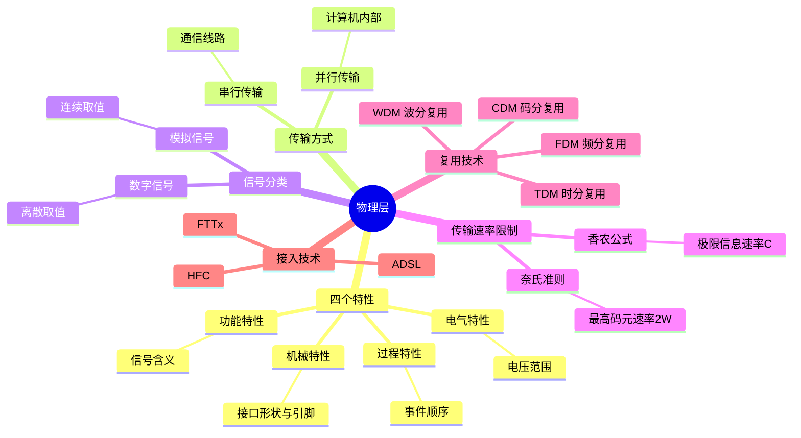

### 关键公式

$$
\text{奈氏准则：最高码元速率} = 2W \text{ (码元/秒)}
$$

$$
\text{香农公式：} C = W\log_2(1+S/N) \text{ (bit/s)}
$$

$$
\text{信噪比(dB)} = 10\log_{10}(S/N)
$$

---

## 相关链接

- 第1章 概述 - 计算机网络体系结构
- 第3章 数据链路层 - 物理层之上的层次
- 第9章 无线网络和移动网络 - 无线信道的详细讨论

---

## 📚 习题

### 习题2-01
**问题**：物理层要解决哪些问题？物理层的主要特点是什么？

### 习题2-06
**问题**：数据在信道中的传输速率受哪些因素的限制？信噪比能否任意提高？香农公式在数据通信中的意义是什么？"比特/秒"和"码元/秒"有何区别？

### 习题2-07
**问题**：假定某信道受奈氏准则限制的最高码元速率为20000码元/秒。如果采用振幅调制，把码元的振幅划分为16个不同等级来传送，那么可以获得多高的数据率（bit/s）？

### 习题2-08
**问题**：假定要用3kHz带宽的电话信道传送64kbit/s的数据（无差错传输），试问这个信道应具有多高的信噪比（分别用比值和分贝来表示）？这个结果说明什么问题？

### 习题2-09
**问题**：用香农公式计算一下，假定信道带宽为3100Hz，最大信息传输速率为35kbit/s，那么若想使最大信息传输速率增加60%，问信噪比S/N应增大到多少倍？如果在刚才计算出的基础上将信噪比S/N再增大到10倍，问最大信息传输速率能否再增加20%？

### 习题2-16
**问题**：共有四个站进行码分多址CDMA通信。四个站的码片序列为：
- A: (-1 -1 -1 +1 +1 -1 +1 +1)
- B: (-1 -1 +1 -1 +1 +1 +1 -1)
- C: (-1 +1 -1 +1 +1 +1 -1 -1)
- D: (-1 +1 -1 -1 -1 -1 +1 -1)

现收到这样的码片序列：(-1 +1 -3 +1 -1 -3 +1 +1)。问哪个站发送数据了？发送数据的站发送的是1还是0？

### 习题2-17
**问题**：试比较ADSL, HFC以及FTTx接入技术的优缺点。

---

*最后更新：2026-06-26*