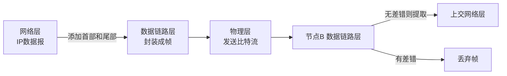
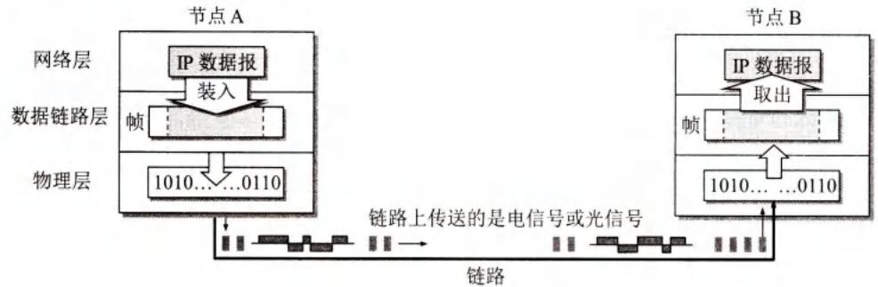
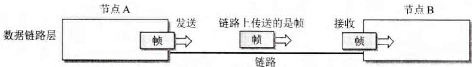
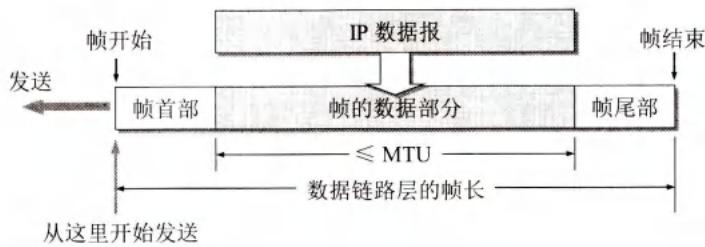
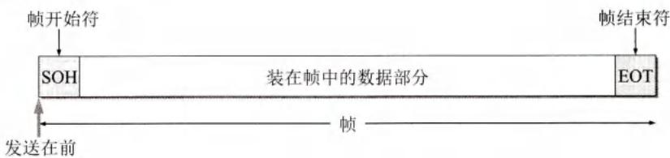
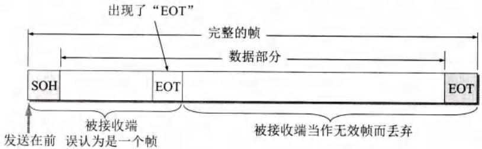
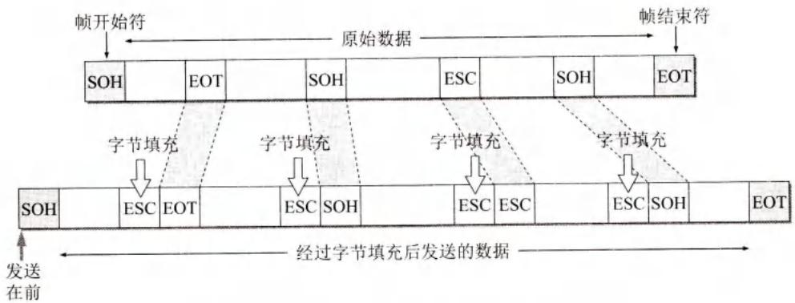
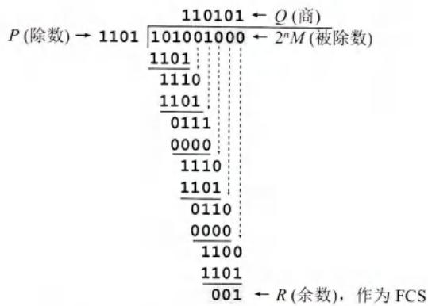
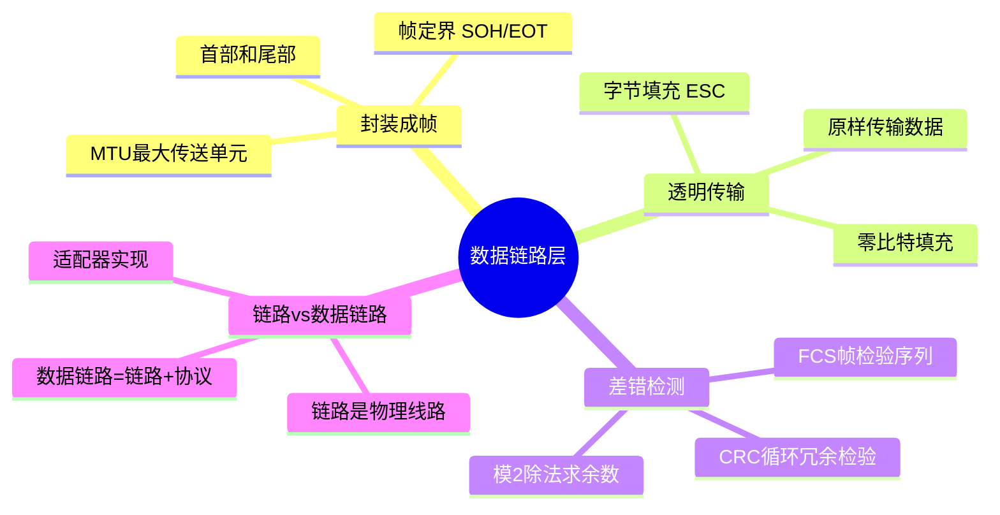

# 第3章-3.1-数据链路层的几个共同问题

## 基本信息

- **课程**：计算机网络
- **章节**：第3章 3.1节 数据链路层的几个共同问题
- **日期**：2026-06-14
- **标签**：#数据链路层 #帧 #封装成帧 #透明传输 #CRC #差错检测

***

## 重点内容

### ⭐⭐⭐ 核心概念

1. **链路 vs 数据链路**：链路是物理线路，数据链路 = 链路 + 协议（适配器实现）
2. **三个基本问题**：封装成帧、透明传输、差错检测
3. **帧定界**：使用SOH(0x01)和EOT(0x04)等控制字符确定帧的边界
4. **字节填充**：在数据中的控制字符前插入转义字符ESC(0x1B)
5. **CRC循环冗余检验**：通过模2运算生成FCS冗余码，实现无比特差错传输

### ⭐⭐ 关键问题

- 为什么数据链路层只需要实现无比特差错，而不是可靠传输？
- 透明传输的两种实现方法分别适用于什么场景？
- CRC能100%检测出差错吗？

***

## 详细笔记

### 一、数据链路和帧

#### 1. 链路 vs 数据链路

| 概念 | 定义 |
|------|------|
| **链路 (link)** | 从一个节点到相邻节点的一段物理线路（有线或无线），中间没有任何交换节点 |
| **数据链路 (data link)** | 链路 + 必要的通信协议（硬件和软件）。常用**网络适配器**（网卡）实现 |

> 适配器一般包括数据链路层和物理层两层功能。物理链路 = 链路，逻辑链路 = 数据链路。

#### 2. 点对点信道数据链路层通信步骤



1. 节点A把网络层交下来的IP数据报添加首部和尾部，**封装成帧**
2. 节点A把帧发送给节点B的数据链路层
3. 若节点B收到的帧无差错，则提取出IP数据报上交网络层；否则**丢弃**

#### 📷 图3-3 使用点对点信道的数据链路层



> 📚 **课本出处**：图3-3(a) 三层的简化模型：不管在哪一段链路上通信，都看成节点和节点的通信



> 📚 **课本出处**：图3-3(b) 只考虑数据链路层：可设想数据沿水平方向直接发送到对方

***

### 二、三个基本问题

#### 1. 封装成帧

- 在数据前后添加**首部**和**尾部**，构成帧
- **帧定界**：首部和尾部的作用是确定帧的界限
- **MTU**（最大传送单元）：帧的数据部分长度上限

#### 📷 图3-4 用帧首部和帧尾部封装成帧



> 📚 **课本出处**：图3-4 网络层IP数据报成为帧的数据部分，前后加上首部和尾部，帧长=数据部分+首部+尾部

**帧定界符**：
- **SOH** (Start Of Header)：`01`（二进制00000001），表示帧首部开始
- **EOT** (End Of Transmission)：`04`（二进制00000100），表示帧结束

> SOH和EOT是控制字符的名称，不是S,O,H三个字符。

#### 📷 图3-5 用控制字符进行帧定界的方法举例



> 📚 **课本出处**：图3-5 使用SOH和EOT控制字符进行帧定界。若发送端故障导致帧发送中断，接收端发现只有SOH没有EOT，就知道是不完整帧，会丢弃。

***

#### 2. 透明传输

**定义**：无论什么样的比特组合的数据，都能够按照原样没有差错地通过数据链路层。

**问题**：若数据中出现与SOH/EOT相同的二进制代码，接收端会错误定界。

#### 📷 图3-6 数据部分恰好出现与EOT一样的代码



> 📚 **课本出处**：图3-6 数据中碰巧出现字符EOT时，接收端会错误解释为传输结束，后面的数据因找不到SOH被丢弃

**解决方法：字节填充 (Byte Stuffing)**

- 发送端：在数据中的控制字符前插入**转义字符ESC**（`1B`，二进制00011011）
- 接收端：删除插入的转义字符
- 若ESC本身出现在数据中，也在其前面插入一个ESC

#### 📷 图3-7 用字节填充法解决透明传输的问题



> 📚 **课本出处**：图3-7 字节填充法：在控制字符(SOH/EOT)和转义字符(ESC)前插入ESC。接收端收到连续两个ESC时，删除前面的一个。

***

#### 3. 差错检测

**比特差错**：传输过程中1变0或0变1。

**误码率BER**：传输错误的比特占所传输比特总数的比率。

##### CRC 循环冗余检验

- **FCS**（帧检验序列）：为检错而添加的冗余码
- **CRC** 是一种检错方法，FCS 是添加的冗余码，二者概念不同

**计算步骤**：
1. 数据 $M$（$k$ 位）后面添加 $n$ 个0（即 $2^n \times M$）
2. 用**模2除法**除以双方商定的除数 $P$（$n+1$ 位）
3. 余数 $R$（$n$ 位）即为FCS，拼接在 $M$ 后面发送

#### 📷 图3-8 说明循环冗余检验原理的例子



> 📚 **课本出处**：图3-8 CRC原理示例：M=101001(k=6)，P=1101(n=3)，模2除后余数R=001作为FCS。发送帧为101001001(k+n=9位)。

**接收端检验**：
- 收到的帧除以同样的除数 $P$（模2运算）
- 余数 $R = 0$：无差错，接受
- 余数 $R \neq 0$：有差错，丢弃

**常用生成多项式**：

$$
\begin{aligned}
\text{CRC-16} &= X^{16} + X^{15} + X^{2} + 1 \\
\text{CRC-CCITT} &= X^{16} + X^{12} + X^{5} + 1 \\
\text{CRC-32} &= X^{32} + X^{26} + X^{23} + X^{22} + X^{16} + X^{12} + X^{11} + X^{10} + X^{8} + X^{7} + X^{5} + X^{4} + X^{2} + X + 1
\end{aligned}
$$

> 在数据链路层，FCS的生成和CRC检验都是用**硬件**完成的，处理迅速，不会延误数据传输。

***

## 疑问与思考

### ❓ 待解决问题

#### 1. 为什么数据链路层不要求提供可靠传输？

**📚 课本出处**：第3章 3.1.2节，差错检测部分

传输差错分为两大类：
- **比特差错**：帧中出现比特错误（CRC可检测）
- **传输差错**：帧丢失、帧重复、帧失序（CRC无法检测）

互联网采取区别对待的方法：
- **通信质量良好的有线链路**：数据链路层不使用确认和重传，差错改正由上层（如TCP）完成
- **通信质量较差的无线链路**：数据链路层使用确认和重传机制，提供可靠传输（见第9章）

**原因**：现代通信线路质量大大提高，由链路质量引起差错的概率已大大降低。让上层负责可靠传输可以提高通信效率。

#### 2. CRC能检测出所有差错吗？

**📚 课本出处**：第3章 3.1.2节

CRC**不能**检测出所有差错，但出现误码而余数R仍等于零的概率是**非常非常小**的。

- CRC的检错能力取决于生成多项式 $P(X)$ 的选择
- 良好的生成多项式可以检测出：所有奇数个差错、所有双比特差错、所有长度小于等于 $n$ 的突发差错
- 对于更长的突发差错，检测失败的概率为 $1/2^n$

#### 3. 字节填充和零比特填充有什么区别？分别适用于什么场景？

**📚 课本出处**：第3章 3.1.2节、3.2.2节

| 特性 | 字节填充 | 零比特填充 |
|------|----------|------------|
| 适用传输方式 | 异步传输 | 同步传输 |
| 处理单位 | 字节 | 比特 |
| 转义方式 | 插入转义字符ESC(0x7D) | 5个连续1后插入0 |
| 使用协议 | PPP异步传输 | PPP同步传输(SONET/SDH) |

### 💡 个人理解

- "透明"是一个很重要的术语：某个实际存在的事物看起来却好像不存在。数据链路层对数据透明，即数据"看不见"数据链路层的存在。
- 模2运算就是异或运算，不进位不借位，因此加减法等价。
- CRC只能实现"无比特差错"，不是"可靠传输"，这是考试常考的概念辨析点。

***

## 核心考点总结

### ⭐⭐⭐ 必考内容

1. **链路 vs 数据链路**

```
┌─────────────────────────────────────────────────────────┐
│  链路 (link)              vs        数据链路 (data link) │
├─────────────────────────────────────────────────────────┤
│  物理线路                        链路 + 协议             │
│  无交换节点                       用适配器实现            │
│  物理链路                        逻辑链路                │
└─────────────────────────────────────────────────────────┘
```

2. **三个基本问题对比**

| 基本问题 | 核心方法 | 关键概念 |
|----------|----------|----------|
| 封装成帧 | 加首部和尾部 | 帧定界(SOH/EOT)、MTU |
| 透明传输 | 字节填充 | ESC转义字符 |
| 差错检测 | CRC循环冗余检验 | FCS、生成多项式 |

3. **CRC计算要点**
   - $2^n \times M$ 除以 $P$，余数 $R$ 作为FCS
   - 模2运算：异或运算，不进位不借位
   - 接收端：收到的帧除以 $P$，$R=0$ 接受，$R \neq 0$ 丢弃

### 📌 易混淆点辨析

| 概念 | 说明 |
|------|------|
| **CRC** | 一种检错方法 |
| **FCS** | 添加在数据后面的冗余码，检错方法可以选CRC或其他 |
| **无比特差错** | 接收端接受的帧没有比特错误（CRC可实现） |
| **可靠传输** | 发送端发什么，接收端收什么（CRC不能保证，需编号+确认+重传） |
| **MTU** | 数据链路层帧的数据部分的最大长度，不是帧的总长度 |

### 📝 常见考题类型

1. **简答题**：
   - 数据链路层的三个基本问题是什么？如何解决？
   - 说明CRC循环冗余检验的原理
   - 为什么数据链路层不要求可靠传输？
2. **计算题**：
   - 给定M和P，计算FCS（模2除法）
   - 判断接收端收到的帧是否有差错
3. **选择题/判断题**：
   - CRC能实现可靠传输（✗）
   - 链路和数据链路是同一概念（✗）
   - MTU是帧的总长度（✗）
   - 字节填充使用ESC作为转义字符（✓）

***

## 总结

### 三个基本问题对比

| 问题 | 核心方法 | 关键概念 | 要解决的困难 |
|------|----------|----------|--------------|
| **封装成帧** | 在数据前后添加首部和尾部 | SOH(01)、EOT(04)、MTU | 确定帧的边界 |
| **透明传输** | 字节填充（异步）/ 零比特填充（同步） | ESC转义字符、连续控制字符处理 | 数据中出现与定界符相同的比特组合 |
| **差错检测** | CRC循环冗余检验 | FCS冗余码、生成多项式、模2除法 | 传输过程中比特翻转(1变0或0变1) |

### 核心概念思维导图



### CRC 与 FCS 的区别

| 对比项 | CRC | FCS |
|--------|-----|-----|
| **本质** | 一种**检错方法**（循环冗余检验算法） | 添加在数据后面的**冗余码**（具体的比特串） |
| **关系** | CRC是用来**计算**FCS的算法 | FCS是CRC算法的**计算结果** |
| **类比** | 相当于"做菜的方法" | 相当于"做出来的菜" |
| **可替代性** | 检错方法可以用CRC，也可以用其他方法 | 不一定非要用CRC生成，但CRC最常用 |
| **位置** | 运算过程，不出现在帧中 | 实际拼接在数据M后面发送 |

### 关键要点

1. **无比特差错 ≠ 可靠传输**：CRC只能保证接收的帧没有比特错误，不能保证帧不丢失、不重复、不失序
2. **数据链路层的定位**：有线链路通常不提供可靠传输，差错恢复由上层TCP负责；无线链路则可能使用确认重传机制
3. **透明传输的本质**：让数据链路层对上层数据"透明"，无论数据内容如何都能正确传输

***

## 相关链接

### 本节涉及图片

- [图3-3 使用点对点信道的数据链路层](../../../images/a9aa8ad35fc56741d843c167acd3d0b9edca6c6807ef5209c4735a5547d8eb21.jpg)
- [图3-3 只考虑数据链路层](../../../images/23c4a4f3f2a088f386f4e6e67e2d4237372570bb0c7ab372205981f0c356c73d.jpg)
- [图3-4 用帧首部和帧尾部封装成帧](../../../images/aba0d111d71c5ebee074eedb5196124d7d2b533f66f02f65824e4a46fa2c98f5.jpg)
- [图3-5 用控制字符进行帧定界的方法举例](../../../images/3c70967397ccc45c7c3380998ba4b3438df44fedd4389ce8801c8b280b5b73ec.jpg)
- [图3-6 数据部分恰好出现与EOT一样的代码](../../../images/a96a20c31da353c785f29054d6b20524579b090a4e1599c1e250e77bf8352d81.jpg)
- [图3-7 用字节填充法解决透明传输的问题](../../../images/7a9229c6c1045ffe70f9b604fedd984e338b4b10eaf2c256d8a69024dc96f192.jpg)
- [图3-8 说明循环冗余检验原理的例子](../../../images/7b93d3a52b716c4fd8adbc95d36688db4dcdd71c63711201d8a3fbb0a157f2db.jpg)

### 关联章节

- [第3章-3.2-点对点协议PPP](./第3章-3.2-点对点协议PPP.md) - PPP协议详解
- [第5章-5.1-运输层协议概述](../第5章-运输层/第5章-5.1-运输层协议概述.md) - 可靠传输由TCP负责

***

*笔记创建时间：2026-06-14*
