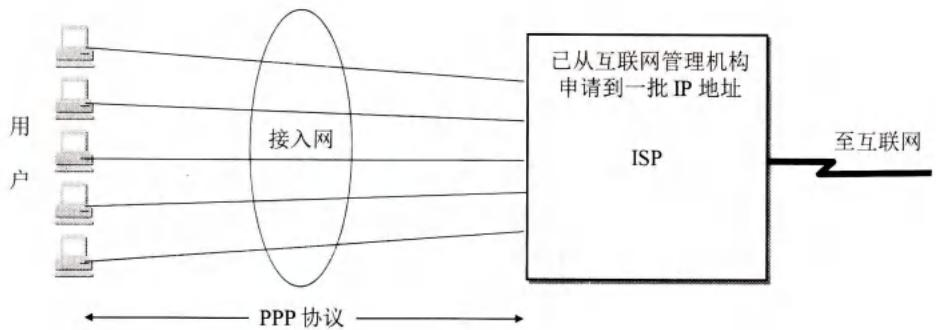
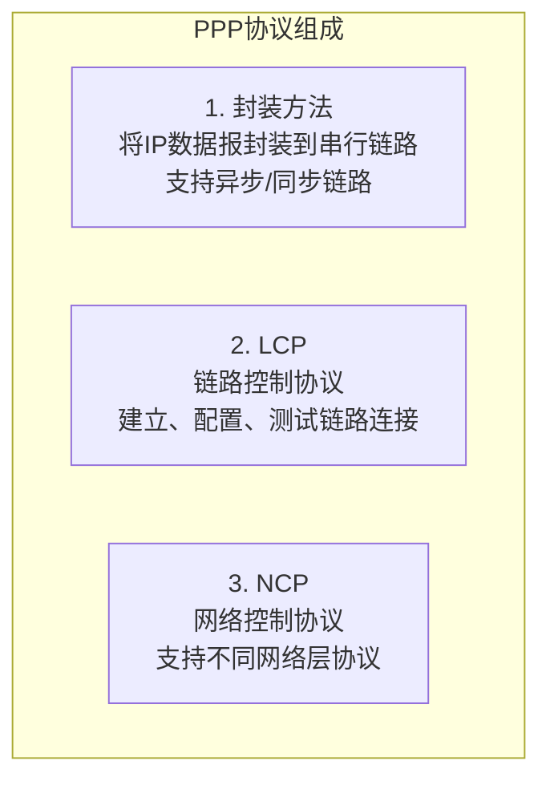
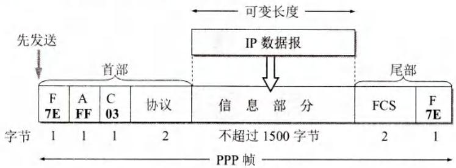
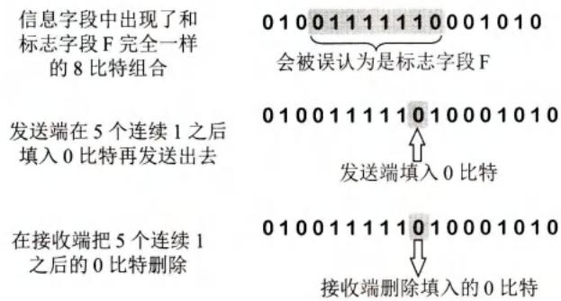
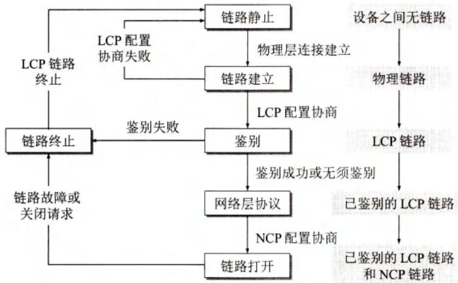

# 第3章-3.2-点对点协议 PPP

## 基本信息

- **课程**：计算机网络
- **章节**：第3章 3.2节 点对点协议 PPP
- **日期**：2026-06-14
- **标签**：#PPP #数据链路层 #LCP #NCP #PPPoE #字节填充 #零比特填充

***

## 重点内容

### ⭐⭐⭐ 核心概念

1. **PPP协议特点**：简单（不纠错、不编号、不流量控制）、封装成帧、透明性、支持多种网络层协议和链路类型
2. **PPP三个组成部分**：封装方法 + LCP（链路控制协议）+ NCP（网络控制协议）
3. **PPP帧格式**：F(0x7E)-A(0xFF)-C(0x03)-协议-信息-FCS-F(0x7E)
4. **透明传输两种方法**：异步用字节填充，同步用零比特填充
5. **PPP工作状态**：链路静止→链路建立→鉴别→网络层协议→链路打开→链路终止

### ⭐⭐ 关键问题

- 为什么PPP协议被设计得如此简单？
- 字节填充和零比特填充分别适用于什么场景？
- PPP协议与HDLC协议的主要区别是什么？

***

## 详细笔记

### 一、PPP协议的特点

PPP (Point-to-Point Protocol) 是目前使用最广泛的点对点数据链路层协议。

#### 📷 图3-9 用户到ISP的链路使用PPP协议



> 📚 **课本出处**：图3-9 用户计算机通过PPP协议与ISP进行通信。PPP是IETF在1992年制定，1994年成为互联网正式标准[RFC 1661, STD51]。

#### 1. PPP协议的10个需求

| 需求 | 说明 |
|------|------|
| **简单** | 不纠错、不编号、不流量控制，只做CRC检验，正确就收，错误就丢 |
| **封装成帧** | 规定特殊的帧定界符 |
| **透明性** | 解决数据中出现定界符的问题 |
| **多种网络层协议** | 同一条物理链路上支持多种网络层协议（IP、IPX等） |
| **多种类型链路** | 支持串行/并行、同步/异步、低速/高速、电/光等 |
| **差错检测** | 检测并立即丢弃差错帧 |
| **检测连接状态** | 及时（不超过几分钟）自动检测链路是否正常 |
| **MTU** | 对每种点对点链路设置最大传送单元默认值 |
| **网络层地址协商** | 协商彼此的网络层地址 |
| **数据压缩协商** | 协商使用数据压缩算法 |

> **PPPoE** (PPP over Ethernet)：把PPP帧封装在以太网帧中，用于宽带上网。即使只有一个用户利用ADSL宽带上网，也使用PPPoE协议。

#### 2. PPP协议的三个组成部分



***

### 二、PPP协议的帧格式

#### 1. 各字段意义

#### 📷 图3-10 PPP帧的格式



> 📚 **课本出处**：图3-10 PPP帧格式：F(标志)-A(地址)-C(控制)-协议-信息-FCS-F(标志)。首尾标志字段为0x7E。

| 字段 | 长度 | 取值/说明 |
|------|------|-----------|
| **F** (标志) | 1字节 | `0x7E` (01111110)，帧定界符，表示帧开始/结束 |
| **A** (地址) | 1字节 | `0xFF` (11111111)，固定值，无实际意义 |
| **C** (控制) | 1字节 | `0x03` (00000011)，固定值，无实际意义 |
| **协议** | 2字节 | `0x0021`=IP数据报, `0xC021`=LCP数据, `0x8021`=网络层控制数据 |
| **信息** | 可变 | IP数据报等，不超过1500字节 |
| **FCS** | 2字节 | CRC帧检验序列 |
| **F** (标志) | 1字节 | `0x7E`，帧结束 |

> 连续两帧之间只需一个标志字段。连续两个标志字段表示空帧，应丢弃。

#### 2. 字节填充（异步传输）

转义字符定义为 `0x7D` (01111101)。

| 原始数据 | 填充后 |
|----------|--------|
| `0x7E` | `(0x7D, 0x5E)` |
| `0x7D` | `(0x7D, 0x5D)` |
| 控制字符 `< 0x20` | 前加`0x7D`，编码改变。如`0x03`→`(0x7D, 0x23)` |

#### 3. 零比特填充（同步传输）

PPP用在SONET/SDH链路时，使用同步传输，采用零比特填充方法。

#### 📷 图3-11 零比特的填充与删除



> 📚 **课本出处**：图3-11 发送端扫描信息字段，发现5个连续1就立即填入一个0；接收端发现5个连续1就把后面的0删除。

- **发送端**：发现**5个连续1**，立即填入一个**0**
- **接收端**：发现**5个连续1**，删除后面的**0**

> 这样可保证信息字段中不会出现6个连续1（即不会出现标志字段 `0x7E = 01111110`）。

***

### 三、PPP协议的工作状态

#### 📷 图3-12 PPP协议的状态图



> 📚 **课本出处**：图3-12 PPP协议从链路静止到链路打开再到终止的完整状态转换。PPP已不是纯粹的数据链路层协议，还包含物理层和网络层的内容。

#### 状态转换过程

| 状态 | 说明 |
|------|------|
| **链路静止** (Link Dead) | 无物理连接 |
| **链路建立** (Link Establish) | LCP发送配置请求帧(Configure-Request)，协商最大帧长、鉴别协议等 |
| **鉴别** (Authentication) | PAP(口令鉴别)或CHAP(握手鉴别)。失败则转到链路终止 |
| **网络层协议** (Network-Layer Protocol) | NCP配置网络层，如IPCP分配临时IP地址 |
| **链路打开** (Link Open) | 可正常传输数据，可发Echo-Request/Reply检测链路状态 |
| **链路终止** (Link Terminate) | 依次释放NCP、LCP、物理层连接 |

#### LCP配置响应类型

- **配置确认帧** (Configure-Ack)：所有选项都接受
- **配置否认帧** (Configure-Nak)：所有选项都理解但不能接受
- **配置拒绝帧** (Configure-Reject)：有的选项无法识别或不能接受，需要协商

***

## 疑问与思考

### ❓ 待解决问题

#### 1. 为什么PPP协议被设计得如此简单？

**📚 课本出处**：第3章 3.2.1节

IETF在设计互联网体系结构时，把最复杂的部分放在**TCP协议**中，而**IP协议**相对简单，提供的是不可靠的数据报服务。在这种情况下：

- 数据链路层没有必要提供比IP更多的功能
- 不需要纠错、不需要序号、不需要流量控制
- 简单的设计使协议在实现时不容易出错
- 提高了不同厂商在协议实现上的**互操作性**

> 接收方每收到一个帧，就进行CRC检验。正确就收下，错误就丢弃，其他什么也不做。

#### 2. PPP协议为什么不支持多点线路？

**📚 课本出处**：第3章 3.2.1节

PPP协议**只支持点对点链路通信**，不支持多点线路（一个主站轮流和链路上的多个从站通信）。

**原因**：
- PPP的名字就是"点对点协议"，其设计目标就是简化点对点通信
- 多点线路需要更复杂的介质访问控制（如轮询机制），这会增加协议复杂度
- 如果需要多点接入，可以使用其他协议（如以太网的CSMA/CD）

#### 3. PPPoE在实际宽带上网中是如何工作的？

**📚 课本出处**：第3章 3.2.1节、3.5.4节

PPPoE的工作流程：
1. 主机通过以太网连接到接入设备（如光猫）
2. PPPoE发现阶段：主机发现接入服务器（BRAS）
3. PPPoE会话阶段：在以太网帧中封装PPP帧进行通信
4. 通过PPP的NCP（IPCP）获取临时IP地址
5. 通信结束后释放连接

**为什么用PPPoE**：
- 可以让多个连接在以太网上的用户共享一条到ISP的宽带链路
- 便于ISP进行用户认证、计费和带宽控制
- 兼容现有的PPP协议栈

### 💡 个人理解

- PPP的"简单"是相对于HDLC而言的。在互联网环境下，端到端原则使得下层协议可以保持简单。
- 地址字段A和控制字段C虽然是固定值，但为了向后兼容和标准化，仍然保留在帧格式中。
- 零比特填充用硬件实现非常高效，这是同步传输场景下的最优解。

***

## 核心考点总结

### ⭐⭐⭐ 必考内容

1. **PPP协议的三个组成部分**

```
┌─────────────────────────────────────────────────────────┐
│  1. 封装方法：将IP数据报封装到串行链路                     │
│  2. LCP：链路控制协议，建立、配置、测试链路连接            │
│  3. NCP：网络控制协议，支持不同网络层协议                  │
└─────────────────────────────────────────────────────────┘
```

2. **PPP帧格式各字段**

| 字段 | 长度 | 取值 |
|------|------|------|
| F | 1字节 | 0x7E |
| A | 1字节 | 0xFF |
| C | 1字节 | 0x03 |
| 协议 | 2字节 | 0x0021=IP, 0xC021=LCP, 0x8021=网络层控制 |
| 信息 | 可变 | <=1500字节 |
| FCS | 2字节 | CRC |
| F | 1字节 | 0x7E |

3. **透明传输两种方法对比**

| 特性 | 字节填充 | 零比特填充 |
|------|----------|------------|
| 适用场景 | 异步传输 | 同步传输(SONET/SDH) |
| 转义方式 | 0x7E→(0x7D,0x5E) | 5个连续1后填0 |
| 硬件/软件 | 软件实现 | 硬件实现 |

4. **PPP工作状态**

链路静止 → 链路建立(LCP协商) → 鉴别(PAP/CHAP) → 网络层协议(NCP/IPCP配置IP) → 链路打开 → 链路终止

### 📌 易混淆点辨析

| 概念 | 说明 |
|------|------|
| **PPP** | 点对点协议，数据链路层 |
| **PPPoE** | PPP over Ethernet，把PPP帧封装在以太网帧中 |
| **LCP** | 链路控制协议，建立和配置数据链路连接 |
| **NCP** | 网络控制协议，支持不同网络层协议 |
| **IPCP** | IP控制协议，NCP中支持IP的协议，用于分配IP地址 |
| **PAP** | 口令鉴别协议，简单的明文身份验证 |
| **CHAP** | 挑战握手鉴别协议，更安全的身份验证 |

### 📝 常见考题类型

1. **简答题**：
   - PPP协议有哪些特点？为什么要设计得简单？
   - 说明PPP帧的格式及各字段作用
   - 比较字节填充和零比特填充
   - 简述PPP协议的工作状态
2. **分析题**：
   - 为什么PPPoE广泛用于宽带接入？
   - PPP协议不是纯粹的数据链路层协议，为什么？
3. **选择题/判断题**：
   - PPP协议需要纠错和流量控制（✗）
   - PPP支持多点线路（✗）
   - PPP帧的标志字段是0x7E（✓）
   - 零比特填充在异步传输时使用（✗）
   - LCP用于分配IP地址（✗，是NCP/IPCP的工作）

***

## 相关链接

### 本节涉及图片

- [图3-9 用户到ISP的链路使用PPP协议](../../../images/bd5de5646d434ee06116b63ec28313f44d066a668ba302e4347316ad3575389a.jpg)
- [图3-10 PPP帧的格式](../../../images/bd93f77f2640ff557bdfd56fc2ae4bd9b2647ffc330cf63d9497c020a3691ece.jpg)
- [图3-11 零比特的填充与删除](../../../images/d450fe5205e2460c4bbff8896f9909c5c411716e52cd668affff61f5f355d72b.jpg)
- [图3-12 PPP协议的状态图](../../../images/6b5d237e90ed7df1ab6154131c624bd53708794d00610879f37cf04fb33dd152.jpg)

### 关联章节

- [第3章-3.1-数据链路层的几个共同问题](./第3章-3.1-数据链路层的几个共同问题.md) - 数据链路层基本问题
- [第3章-3.3-使用广播信道的数据链路层](./第3章-3.3-使用广播信道的数据链路层.md) - CSMA/CD协议和以太网

***

*笔记创建时间：2026-06-14*
