# 第3章-3.3-使用广播信道的数据链路层

## 基本信息

- **课程**：计算机网络
- **章节**：第3章 3.3节 使用广播信道的数据链路层
- **日期**：2026-06-14
- **标签**：#CSMA/CD #以太网 #MAC地址 #集线器 #曼彻斯特编码 #争用期

***

## 重点内容

### ⭐⭐⭐ 核心概念

1. **CSMA/CD协议**：载波监听多点接入/碰撞检测，以太网核心协议
2. **争用期/碰撞窗口**：最先发送的站最多经过 $2\tau$ 可知是否碰撞
3. **曼彻斯特编码**：每个码元中间电压转换，便于位同步，频带加倍
4. **10BASE-T**：10Mbit/s基带双绞线，物理星形逻辑总线
5. **MAC地址**：48位全球唯一地址，固化在适配器ROM中
6. **以太网V2帧格式**：目的地址-源地址-类型-数据-FCS

### ⭐⭐ 关键问题

- 为什么CSMA/CD只能半双工通信？
- 争用期和最小帧长有什么关系？
- MAC地址的全球唯一性如何保证？
- 为什么以太网要设置最小帧长64字节？

***

## 详细笔记

### 一、局域网的数据链路层

#### 1. 局域网拓扑

#### 📷 图3-13 局域网的拓扑

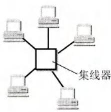

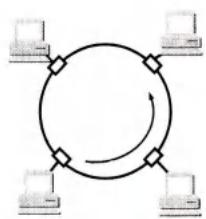

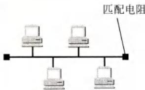

> 📚 **课本出处**：图3-13 局域网三种拓扑。现在以太网演变成了星形网，已成为局域网的同义词。

#### 2. 媒体接入控制

| 方法 | 分类 | 说明 |
|------|------|------|
| **静态划分信道** | 频分/时分/波分/码分复用 | 信道固定分配，代价高，不适合局域网 |
| **动态媒体接入控制** | **随机接入**（CSMA/CD） | 用户随机发送，可能碰撞，需协议解决 |
| | 受控接入（令牌环） | 用户必须服从控制，目前使用较少 |

#### 3. 以太网的两个主要标准

- **DIX Ethernet V2**（1982年）：世界上第一个局域网产品规约
- **IEEE 802.3**（1983年）：与DIX V2只有很小差别，硬件可互操作

> 以太网在局域网市场取得垄断地位，几乎成为局域网的代名词。IEEE 802.2 LLC子层作用已消失，很多厂商适配器上仅装有MAC协议。

#### 4. LLC子层与MAC子层

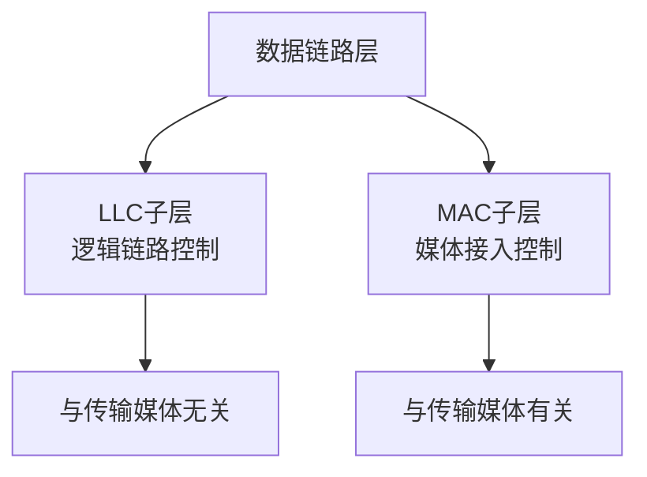

#### 📷 图3-14 局域网对LLC子层是透明的

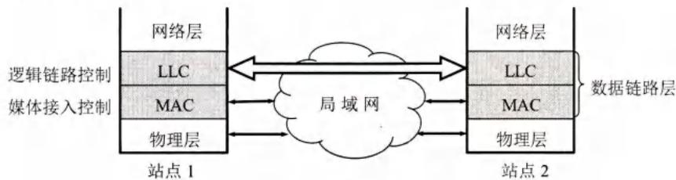

> 📚 **课本出处**：图3-14 不管采用何种MAC子层的局域网，对LLC子层来说都是透明的。由于以太网垄断，本章不再考虑LLC子层。

#### 5. 适配器的作用

#### 📷 图3-15 计算机通过适配器和局域网进行通信

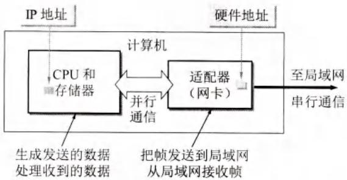

> 📚 **课本出处**：图3-15 适配器实现串并行转换、数据缓存、以太网协议。硬件地址在ROM中，IP地址在计算机存储器中。

适配器（网卡）功能：
- 串行传输和并行传输的转换
- 数据缓存（解决网络数据率和总线数据率不同）
- 实现以太网协议
- 收到差错帧直接丢弃，正确帧用中断通知计算机

***

### 二、CSMA/CD协议

CSMA/CD：载波监听多点接入 / 碰撞检测 (Carrier Sense Multiple Access with Collision Detection)

#### 1. 以太网的两项措施

**第一，无连接工作方式**
- 不必先建立连接就可直接发送数据
- 不编号、不要求确认
- 不可靠交付，差错由高层（如TCP）处理

**第二，曼彻斯特编码**

#### 📷 图3-16 曼彻斯特编码

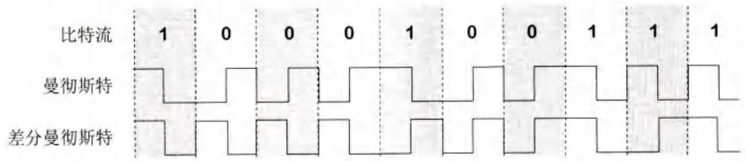

> 📚 **课本出处**：图3-16 曼彻斯特编码：码元1是前低后高，码元0是前高后低。每个比特正中间出现一次电压转换，便于提取位同步信号。缺点是频带宽度比原始基带信号增加一倍。

#### 2. CSMA/CD 三个要点

| 要点 | 含义 |
|------|------|
| **多点接入** | 总线型网络，多台计算机连接到一根总线 |
| **载波监听** | 发送前、发送中都要检测信道是否空闲 |
| **碰撞检测** | 边发送边检测信号电压，超过门限认为碰撞 |

#### 3. 传播时延对载波监听的影响

#### 📷 图3-17 传播时延对载波监听的影响

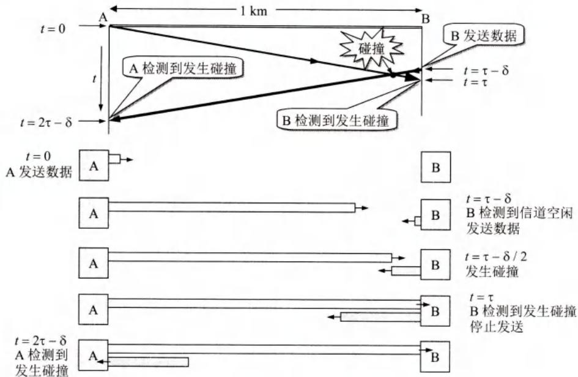

> 📚 **课本出处**：图3-17 A和B相距1km，传播时延约5μs。若B在A的数据到达前发送，就会碰撞。A最多经过 $2\tau$ 可知道是否碰撞。

**关键时间线**：
- $t=0$：A发送数据
- $t=\tau-\delta$：B检测到信道空闲，发送数据
- $t=\tau-\delta/2$：A和B数据碰撞（双方都不知道）
- $t=\tau$：B检测到碰撞，停止发送
- $t=2\tau-\delta$：A检测到碰撞，停止发送

> **争用期/碰撞窗口**：$2\tau$（端到端往返传播时延）。最先发送的站最多经过 $2\tau$ 就可知道是否遭受碰撞。

> **重要结论**：使用CSMA/CD协议的以太网**只能半双工通信**（不能同时发送和接收）。

#### 4. CSMA/CD 发送流程

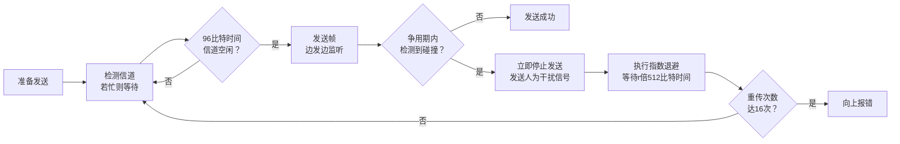

**指数退避算法**：
- 碰撞后等待 $r$ 倍 512 比特时间
- $r$ 从 $[0, 2^k-1]$ 中随机选取，$k = \min(\text{重传次数}, 10)$
- 重传达 **16次** 仍不成功，停止重传向上报错

***

### 三、使用集线器的星形拓扑

#### 📷 图3-19 使用集线器的双绞线以太网

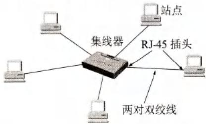

> 📚 **课本出处**：图3-19 10BASE-T以太网采用星形拓扑，集线器在中心。每个站到集线器距离不超过100m。

#### 📷 图3-20 具有三个端口的集线器

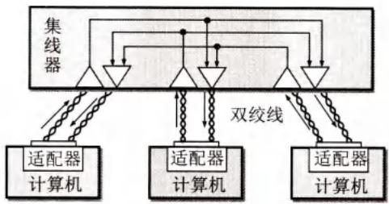

> 📚 **课本出处**：图3-20 集线器工作在物理层，只简单转发比特，不进行碰撞检测。

**集线器特点**：
- 物理星形，**逻辑总线**
- 多端口转发器，工作在**物理层**
- 只简单转发比特，**不进行碰撞检测**
- 若两个端口同时有信号输入，所有端口都收不到正确帧
- 采用自适应串音回波抵消和再生整形

***

### 四、以太网的信道利用率

#### 📷 图3-21 以太网的信道被占用的情况

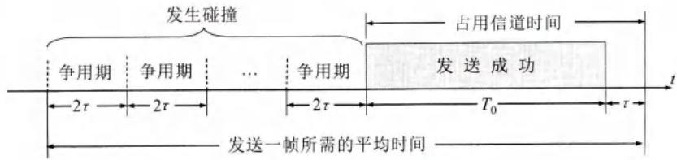

> 📚 **课本出处**：图3-21 成功发送一帧占用信道的时间是 $T_0+\tau$，比帧发送时间多一个单程时延 $\tau$。

**参数定义**：

$$
a = \frac{\tau}{T_0}
$$

- $\tau$：以太网单程端到端传播时延
- $T_0$：帧的发送时间

**极限信道利用率**（理想无碰撞）：

$$
S_{max} = \frac{T_0}{T_0 + \tau} = \frac{1}{1+a}
$$

- $a \to 0$：碰撞后立即检测，信道浪费极少
- $a$ 越大：每次碰撞浪费越多，利用率越低

> 实际以太网利用率达到 **30%** 时已处于重载，很多容量被碰撞消耗。

***

### 五、以太网的MAC层

#### 1. MAC层的硬件地址

在局域网中，硬件地址又称为**物理地址**或**MAC地址**（因为这种地址用在MAC帧中）。

- **48位（6字节）**，固化在适配器ROM中
- **EUI-48**（扩展唯一标识符）

**地址结构**：
- 前3字节（高位24位）：**OUI**（组织唯一标识符），IEEE分配给厂商
- 后3字节（低位24位）：扩展标识符，厂家自行指派

**地址字段第一字节的位**：
- **I/G位**（最低有效位）：0=单个站地址（单播），1=组地址（多播）
- **G/L位**（次低位）：0=全球管理，1=本地管理

**发往本站的帧**：
- **单播帧**（一对一）：目的MAC地址与本站相同
- **广播帧**（一对全体）：目的地址全1（FF-FF-FF-FF-FF-FF）
- **多播帧**（一对多）：发送给一部分站点

> **混杂方式**：适配器接收所有帧，用于嗅探器(Sniffer)监视网络流量。

#### 2. MAC帧的格式

#### 📷 图3-22 以太网V2的MAC帧格式

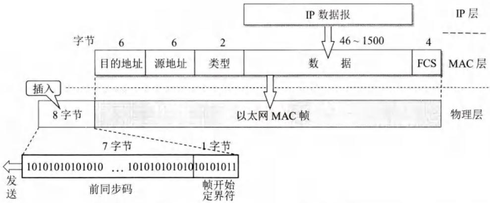

> 📚 **课本出处**：图3-22 以太网V2的MAC帧由目的地址(6B)、源地址(6B)、类型(2B)、数据(46~1500B)、FCS(4B)组成。

| 字段 | 长度 | 说明 |
|------|------|------|
| 目的地址 | 6字节 | 接收方MAC地址 |
| 源地址 | 6字节 | 发送方MAC地址 |
| 类型 | 2字节 | 上层协议，如 `0x0800`=IP |
| 数据 | 46~1500字节 | 最小46字节保证帧长≥64字节 |
| FCS | 4字节 | CRC检验 |
| 前同步码 | 7字节 | 物理层添加，实现位同步 |
| 帧开始定界符 | 1字节 | 物理层添加，`10101011` |

> **最小帧长 64字节** = 目的地址6 + 源地址6 + 类型2 + 数据46 + FCS4 = 64字节
> 
> **最大帧长 1518字节** = 6 + 6 + 2 + 1500 + 4 = 1518字节

***

## 疑问与思考

### ❓ 待解决问题

#### 1. 为什么CSMA/CD只能半双工通信？

**📚 课本出处**：第3章 3.3.2节

因为CSMA/CD要求"边发送边监听"，适配器在发送数据的同时要检测信道上的信号电压变化。如果一个站同时进行发送和接收，发送的信号会淹没接收的信号，就无法检测到其他站是否在发送。

> 使用CSMA/CD协议的以太网**不可能进行全双工通信**，只能进行双向交替通信（半双工通信）。

#### 2. 为什么以太网要设置最小帧长64字节？

**📚 课本出处**：第3章 3.3.2节、3.3.5节

最小帧长的设定与**争用期**直接相关：

- 以太网最大端到端距离约2.5km（加上4个中继器），单程传播时延 $\tau \approx 25.6\mu s$
- 往返传播时延 $2\tau \approx 51.2\mu s$
- 10Mbit/s以太网在51.2μs内可发送 512 bit = **64字节**

**意义**：如果帧长小于64字节，在发送完毕之前可能检测不到碰撞（帧已经发完了）。因此规定最小帧长64字节，确保在帧发送完毕前一定能检测到碰撞。

#### 3. 曼彻斯特编码为什么能实现位同步？

**📚 课本出处**：第3章 3.3.2节

普通二进制基带信号可能出现一长串连续1或连续0，接收端无法提取位同步信号。

曼彻斯特编码**每个码元中间都有一次电压转换**：
- 码元1：前低后高（上升沿）
- 码元0：前高后低（下降沿）

接收端利用这种**周期性的电压转换**就能很方便地提取位同步时钟信号。代价是频带宽度加倍。

### 💡 个人理解

- CSMA/CD的"载波监听"在以太网中其实没有真正的载波，只是检测信道是否有信号。这个译名不太准确，但已约定俗成。
- 指数退避算法中，重传次数越多，等待时间范围越大，这减少了重传时再次碰撞的概率。
- 适配器的过滤功能非常重要：只接收发给自己的帧（单播、广播、已注册的多播），其他帧直接丢弃，不浪费主机CPU和内存。

***

## 核心考点总结

### ⭐⭐⭐ 必考内容

1. **CSMA/CD三个要点**

```
┌─────────────────────────────────────────────────────────┐
│  多点接入：总线型网络，多台计算机连到一根总线            │
│  载波监听：发送前、发送中都要检测信道                    │
│  碰撞检测：边发送边检测信号电压，超过门限即碰撞          │
└─────────────────────────────────────────────────────────┘
```

2. **争用期与最小帧长**

| 项目 | 数值/说明 |
|------|-----------|
| 单程传播时延 $\tau$ | 1km电缆约5μs |
| 争用期 $2\tau$ | 10Mbit/s以太网约51.2μs |
| 最小帧长 | 64字节（512bit） |
| 意义 | 确保在帧发送完毕前能检测到碰撞 |

3. **以太网V2 MAC帧格式**

| 字段 | 长度 |
|------|------|
| 目的地址 | 6字节 |
| 源地址 | 6字节 |
| 类型 | 2字节 |
| 数据 | 46~1500字节 |
| FCS | 4字节 |

4. **MAC地址结构**

- 48位，6字节
- OUI（前3字节）+ 扩展标识符（后3字节）
- I/G位（最低位）：0=单播，1=多播
- G/L位（次低位）：0=全球管理，1=本地管理

5. **10BASE-T含义**

| 部分 | 含义 |
|------|------|
| 10 | 10 Mbit/s |
| BASE | 基带信号 |
| T | 双绞线(Twisted pair) |

### 📌 易混淆点辨析

| 概念 | 说明 |
|------|------|
| **LLC子层** | 逻辑链路控制，与传输媒体无关。因以太网垄断，已失去意义 |
| **MAC子层** | 媒体接入控制，与传输媒体有关 |
| **适配器** | 包含数据链路层和物理层功能，又称网卡 |
| **集线器** | 工作在物理层，逻辑上是总线 |
| **争用期** | $2\tau$，又称碰撞窗口 |
| **人为干扰信号** | 检测到碰撞后立即发送，让其他站也知道碰撞 |
| **混杂方式** | 适配器接收所有帧，用于网络分析 |

### 📝 常见考题类型

1. **简答题**：
   - 说明CSMA/CD协议的三个要点
   - 为什么CSMA/CD只能半双工通信？
   - 以太网为什么设置最小帧长64字节？
   - 简述以太网V2的MAC帧格式
   - 说明MAC地址的结构和全球唯一性的保证
2. **计算题**：
   - 给定电缆长度和发送速率，计算争用期
   - 给定帧长和数据率，判断是否满足最小帧长要求
3. **选择题/判断题**：
   - CSMA/CD以太网可以全双工通信（✗）
   - 集线器工作在数据链路层（✗，物理层）
   - MAC地址是128位的（✗，48位）
   - 以太网提供可靠传输（✗）
   - 曼彻斯特编码频带宽度加倍（✓）

***

## 相关链接

### 本节涉及图片

- [图3-13(a) 星形网](../../../images/94b0c6db3f1c3dc45482c415d1c3f8ad2a5cacabf81f742b2fb0d5c6bf57140b.jpg)
- [图3-13(b) 环形网](../../../images/c280c30d97fb9b2e8a60776b63c5dd0ce0b06b3866a7ebbb8d65c9db50646699.jpg)
- [图3-13(c) 总线网](../../../images/152bd34054f54e8f8fac1cc5ece4c2cfd4237e5420357a0a9658d5de022be8c1.jpg)
- [图3-14 局域网对LLC子层是透明的](../../../images/37db8b63e7bc8bf159527dc6234a271a119df90b11c6cfeb3b55f00445fbbf0d.jpg)
- [图3-15 计算机通过适配器和局域网进行通信](../../../images/cb1cf09c1ba9a85d3bbcce74440684517b947eaa927b432393bd8c49ff501843.jpg)
- [图3-16 曼彻斯特编码](../../../images/06921ca78d249b6c919dcfc2d32444c36d921f8f22c66dc5953b5bfb87254af3.jpg)
- [图3-17 传播时延对载波监听的影响](../../../images/65ad81a15d7bcb3d3bd7f8c8d64c6bcaeefae6edc15f6059e1245d88595d00de.jpg)
- [图3-19 使用集线器的双绞线以太网](../../../images/cfe1cb0485eacc0668c685a3d5a8d6d5d1f55c92700d8a0e49341ca4f4cbcebe.jpg)
- [图3-20 具有三个端口的集线器](../../../images/4262a33f9318ae0eed10f81927d16ef66199910d3f20d0407c964a95154e58a3.jpg)
- [图3-21 以太网的信道被占用的情况](../../../images/da76f991683da7c5da47cafd3528a7fca8e5aba70c33043bb89b12d1dc5fd4fa.jpg)
- [图3-22 以太网V2的MAC帧格式](../../../images/824fe166aa92d924966c155a70c069008f3c0f3e690281c697eb4ee14de45916.jpg)

### 关联章节

- [第3章-3.2-点对点协议PPP](./第3章-3.2-点对点协议PPP.md) - PPP协议详解
- [第3章-3.4-扩展的以太网](./第3章-3.4-扩展的以太网.md) - 网桥、交换机、VLAN

***

*笔记创建时间：2026-06-14*
