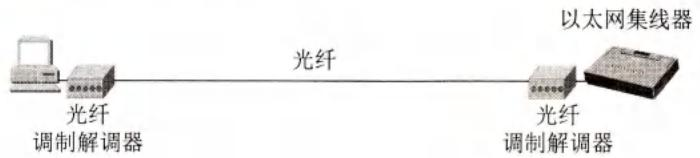
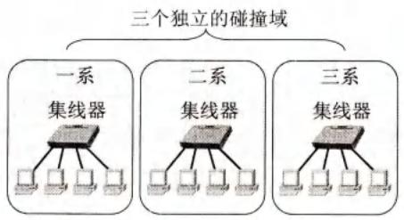
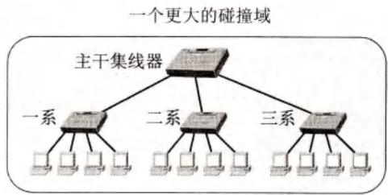
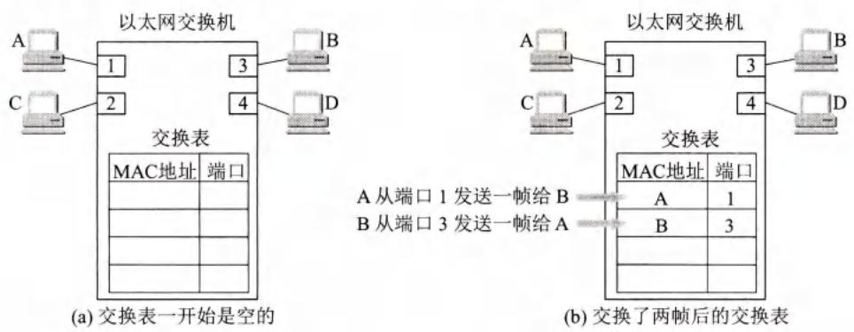
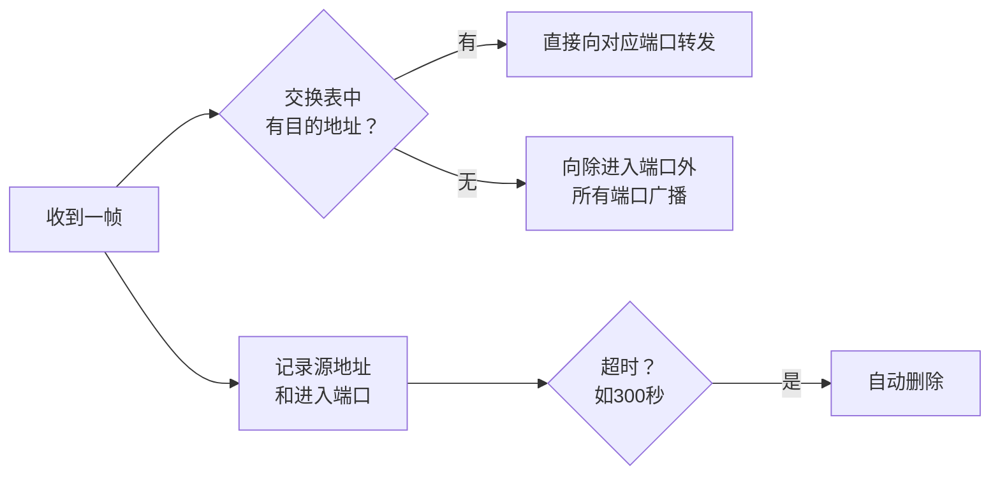
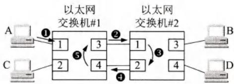
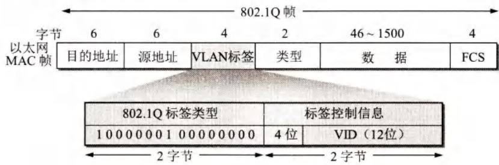
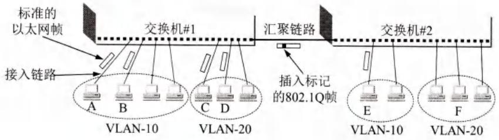

# 第3章-3.4-扩展的以太网

## 基本信息

- **课程**：计算机网络
- **章节**：第3章 3.4节 扩展的以太网
- **日期**：2026-06-14
- **标签**：#以太网交换机 #VLAN #STP #自学习 #碰撞域 #汇聚链路

***

## 重点内容

### ⭐⭐⭐ 核心概念

1. **以太网交换机**：实质是多端口网桥，工作在全双工，每个端口一个碰撞域
2. **自学习算法**：通过记录源地址和进入端口自动建立交换表，超时删除
3. **生成树协议STP**：逻辑上切断冗余链路，消除帧兜圈子现象
4. **虚拟局域网VLAN**：与物理位置无关的逻辑组，缩小广播域
5. **802.1Q帧**：在源地址和类型之间插入4字节VLAN标签（0x8100+12位VID）
6. **接入链路**传标准帧，**汇聚链路**传802.1Q帧

### ⭐⭐ 关键问题

- 用集线器扩展以太网有什么缺点？
- 以太网交换机为什么比集线器性能好？
- 自学习算法如何建立和维护交换表？
- VLAN如何解决广播风暴和信息安全问题？
- 为什么交换机不用CSMA/CD还叫以太网？

***

## 详细笔记

### 一、在物理层扩展以太网

#### 1. 扩展方法

- **光纤+光纤调制解调器**：进行电/光信号转换，可连接几公里外的集线器
- **多个集线器连成多级星形**：通过主干集线器连接各系的以太网

#### 📷 图3-23 主机使用光纤和一对光纤调制解调器连接到集线器



> 📚 **课本出处**：图3-23 使用光纤可使主机和几公里外的集线器相连接。

#### 📷 图3-24 用多个集线器连成更大的以太网





> 📚 **课本出处**：图3-24 用主干集线器连接三个系的以太网，扩大了地理范围，但也扩大了碰撞域。

#### 2. 缺点

| 缺点 | 说明 |
|------|------|
| **碰撞域扩大** | 三个独立碰撞域变成一个，最大吞吐量从30Mbit/s降到10Mbit/s |
| **不同技术无法互连** | 数据率不同时只能按最低速率工作 |

***

### 二、在数据链路层扩展以太网

#### 1. 以太网交换机的特点

以太网交换机（交换式集线器）实质上是**多端口的网桥**，工作在**数据链路层**。

| 特点 | 说明 |
|------|------|
| **工作方式** | 全双工，无碰撞 |
| **并行性** | 同时连通多对端口，多对主机同时通信 |
| **碰撞域** | 每个端口一个碰撞域，N个端口有N个碰撞域 |
| **缓存** | 输出端口繁忙时可缓存帧 |
| **即插即用** | 自学习算法自动建立交换表（CAM） |
| **转发速率** | 专用交换结构芯片硬件转发，比网桥快 |
| **总容量** | 端口数 × 端口速率（如10端口×10Mbit/s=100Mbit/s） |

**交换方式**：
- **存储转发**：先缓存整个帧，检查差错后再转发
- **直通(cut-through)**：接收同时立即按目的MAC地址决定转发端口，速度快但不检查差错

#### 2. 以太网交换机的自学习功能

#### 📷 图3-25 以太网交换机中的交换表



> 📚 **课本出处**：图3-25 交换表初始为空，通过自学习逐渐建立MAC地址到端口的映射。

**自学习过程**：



**交换表三列**：MAC地址、端口、写入时间

- 收到帧后**先查目的地址**，决定转发/广播
- 再**记录源地址和进入端口**，供以后转发使用
- **超时自动删除**（如300秒），保证数据符合当前网络状况

#### 3. 冗余链路与兜圈子问题

#### 📷 图3-26 在两个交换机之间兜圈子的帧



> 📚 **课本出处**：图3-26 冗余链路导致帧在环路中无限兜圈子（2→3→4→5→...），消耗网络资源。

**解决方法**：生成树协议STP（IEEE 802.1D）
- 不改变网络实际拓扑
- 逻辑上切断某些链路，形成无环路的树状结构

#### 4. 从总线以太网到星形以太网

| 对比项 | 总线以太网 | 星形以太网（交换机） |
|--------|-----------|---------------------|
| 协议 | CSMA/CD | 不使用CSMA/CD |
| 工作方式 | 半双工 | 全双工 |
| 碰撞 | 有 | 无 |
| 帧结构 | 以太网V2 | 以太网V2（未改变） |

> 仍叫"以太网"是因为**帧结构未改变**。

***

### 三、虚拟局域网

#### 1. VLAN的定义

虚拟局域网VLAN（IEEE 802.1Q）是由一些局域网网段构成的与**物理位置无关的逻辑组**。

**产生原因**：
1. **广播风暴**：大量广播帧消耗资源，配置错误可致网络瘫痪
2. **信息安全**：不同部门共享局域网对信息安全不利

#### 2. 802.1Q帧格式

#### 📷 图3-27 插入VLAN标签后变成了802.1Q帧



> 📚 **课本出处**：图3-27 在源地址和类型字段之间插入4字节VLAN标签，最大帧长从1518变为1522字节。

**VLAN标签（4字节）**：
- 前2字节：**0x8100**（IEEE 802.1Q标签类型）
- 后2字节：前4位无用，后12位 **VID**（VLAN标识符）
- VID可识别 **4096** 个不同VLAN（$2^{12}=4096$）

**帧长变化**：最大帧长从 **1518字节** → **1522字节**

#### 3. VLAN的工作方式

#### 📷 图3-28 利用以太网交换机构成虚拟局域网



> 📚 **课本出处**：图3-28 VLAN可跨越不同交换机，接入链路传标准帧，汇聚链路传802.1Q帧。

| 概念 | 说明 |
|------|------|
| **接入链路(access link)** | 主机到交换机的链路，传输标准以太网帧 |
| **汇聚链路(trunk link)** | 交换机之间的链路，传输802.1Q帧（带VLAN标签） |
| **同VLAN通信** | 直接转发，不需要VLAN标签 |
| **跨VLAN通信** | 需要路由器（网络层）解决 |

***

## 疑问与思考

### ❓ 待解决问题

#### 1. 用集线器扩展以太网有什么缺点？

**📚 课本出处**：第3章 3.4.1节

两个主要缺点：

**第一，碰撞域扩大，吞吐量下降**

三个独立的10Mbit/s以太网各有自己的碰撞域，总最大吞吐量为30Mbit/s。用集线器连接后变成一个大的碰撞域，最大吞吐量只有10Mbit/s。当某个系的两个站通信时，数据会通过所有集线器转发，其他系的内部也不能通信。

**第二，不同技术无法互连**

如果一个系使用10Mbit/s适配器，另一个系使用100Mbit/s适配器，用集线器连接后大家都只能工作在10Mbit/s。

#### 2. 以太网交换机为什么比集线器性能好？

**📚 课本出处**：第3章 3.4.2节

| 对比项 | 集线器 | 交换机 |
|--------|--------|--------|
| 工作层次 | 物理层 | 数据链路层 |
| 工作方式 | 半双工 | 全双工 |
| 碰撞域 | 整个网络一个 | 每个端口一个 |
| 转发方式 | 广播到所有端口 | 根据MAC地址定向转发或广播 |
| 缓存 | 无 | 有 |
| 并行通信 | 不能 | 能 |

举例：10个端口的10Mbit/s交换机，总容量为100Mbit/s；而10个端口的10Mbit/s集线器，总容量只有10Mbit/s。

#### 3. 为什么交换机不使用CSMA/CD还叫以太网？

**📚 课本出处**：第3章 3.4.2节

因为以太网交换机**仍然采用以太网的帧结构**（以太网V2或802.3标准）。帧结构是以太网的核心特征，而CSMA/CD只是针对共享总线的一种媒体接入控制协议。当使用交换机后，每个端口独享带宽，没有共享总线，自然不需要CSMA/CD协议。

### 💡 个人理解

- 自学习算法是交换机"智能"的核心，它让交换机能够即插即用，无需人工配置。
- STP生成树协议虽然解决了兜圈子问题，但也浪费了冗余链路的带宽。实际网络中可能会有更高级的协议来利用这些冗余链路。
- VLAN的VID只有12位（4096个），对于大型数据中心可能不够，因此后来发展出了VXLAN等技术，使用24位的VNI标识符。
- 跨VLAN通信必须经过路由器，这说明VLAN实际上是把一个物理局域网在逻辑上划分成了多个独立的网络（广播域）。

***

## 核心考点总结

### ⭐⭐⭐ 必考内容

1. **以太网交换机 vs 集线器**

| 对比项 | 集线器 | 交换机 |
|--------|--------|--------|
| 工作层次 | 物理层 | 数据链路层 |
| 工作方式 | 半双工 | 全双工 |
| 碰撞域 | 整个网络一个 | 每个端口一个 |
| 转发方式 | 广播 | 定向转发或广播 |
| 总容量 | 端口速率 | 端口数×端口速率 |

2. **自学习算法过程**

```
┌─────────────────────────────────────────────────────────┐
│  ① 收到帧 → 查交换表，找目的MAC对应的端口               │
│  ② 若找到 → 直接向该端口转发                            │
│  ③ 若未找到 → 向除进入端口外的所有端口广播              │
│  ④ 记录源MAC和进入端口到交换表                          │
│  ⑤ 超过超时时间（如300秒）自动删除表项                  │
└─────────────────────────────────────────────────────────┘
```

3. **生成树协议STP**

- 目的：消除冗余链路导致的帧兜圈子问题
- 标准：IEEE 802.1D
- 方法：不改变实际拓扑，逻辑上切断某些链路，形成无环树状结构

4. **802.1Q帧格式**

| 字段 | 长度 | 说明 |
|------|------|------|
| 目的地址 | 6字节 | |
| 源地址 | 6字节 | |
| **VLAN标签** | **4字节** | **0x8100 + 12位VID** |
| 类型 | 2字节 | |
| 数据 | 46~1500字节 | |
| FCS | 4字节 | 需重新计算 |

- VID 12位，可识别 **4096** 个VLAN
- 最大帧长从 **1518** → **1522** 字节

5. **接入链路 vs 汇聚链路**

| 链路类型 | 连接对象 | 传输帧类型 |
|----------|----------|-----------|
| 接入链路(access link) | 主机↔交换机 | 标准以太网帧 |
| 汇聚链路(trunk link) | 交换机↔交换机 | 802.1Q帧（带VLAN标签） |

### 📌 易混淆点辨析

| 概念 | 说明 |
|------|------|
| **碰撞域** | 同一时刻只能有一个站发送数据的区域。集线器整个是一个碰撞域，交换机每个端口一个 |
| **广播域** | 广播帧能到达的范围。一个VLAN是一个广播域 |
| **网桥** | 早期数据链路层设备，已被交换机淘汰 |
| **交换机** | 多端口网桥，工作在数据链路层，全双工 |
| **STP** | 生成树协议，解决冗余链路兜圈子问题 |
| **VLAN** | 虚拟局域网，缩小广播域，与物理位置无关 |

### 📝 常见考题类型

1. **简答题**：
   - 说明用集线器扩展以太网的缺点
   - 以太网交换机自学习算法的过程
   - 生成树协议STP的作用和工作原理
   - 说明VLAN的工作原理和优点
   - 为什么交换机不叫集线器但仍叫以太网？
2. **分析题**：
   - 给定网络拓扑，分析碰撞域和广播域的数量
   - 给定交换表状态，判断帧的转发行为
3. **选择题/判断题**：
   - 交换机工作在数据链路层（✓）
   - 交换机使用CSMA/CD协议（✗）
   - VLAN可以缩小广播域（✓）
   - 汇聚链路传输标准以太网帧（✗，传输802.1Q帧）
   - STP不改变网络实际拓扑（✓）

***

## 相关链接

### 本节涉及图片

- [图3-23 主机使用光纤和一对光纤调制解调器连接到集线器](../../../images/38fb79e4506c869881e21eb2c355c2e9165f683125cd48de027957e6f7e493a5.jpg)
- [图3-24(a) 三个独立的以太网](../../../images/0a7dd93dbe8c18b948f6db3b806ed9506a6ee0f638362f13fe46a27a583297c2.jpg)
- [图3-24(b) 一个扩展的以太网](../../../images/054e9d98cad34e6ca4174b4631f0ea3cd3742e4358806bb4ab8088d46d9b9ca0.jpg)
- [图3-25 以太网交换机中的交换表](../../../images/5b7014105eb1cae1a7758897000ea3cd26d55f888a301561a0334a1ec46844e0.jpg)
- [图3-26 在两个交换机之间兜圈子的帧](../../../images/c437f0ff69970fbbfd9074765b73a396b7fbeb43197b018598eb79f55c56227d.jpg)
- [图3-27 插入VLAN标签后变成了802.1Q帧](../../../images/33959210b8165ac08e47d1c773a94d5e395b004de59c9a4cae66e353f80c542e.jpg)
- [图3-28 利用以太网交换机构成虚拟局域网](../../../images/072602251b7864a34481066859f5a8261e979f838e3a7f905ee626675afa27ab.jpg)

### 关联章节

- [第3章-3.3-使用广播信道的数据链路层](./第3章-3.3-使用广播信道的数据链路层.md) - CSMA/CD协议、MAC帧格式
- [第4章-4.1-网络层的几个重要概念](../第4章-网络层/第4章-4.1-网络层的几个重要概念.md) - 跨VLAN通信需要路由器

***

*笔记创建时间：2026-06-14*
