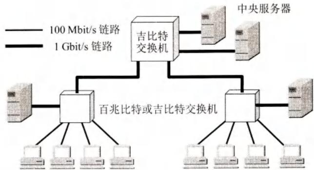
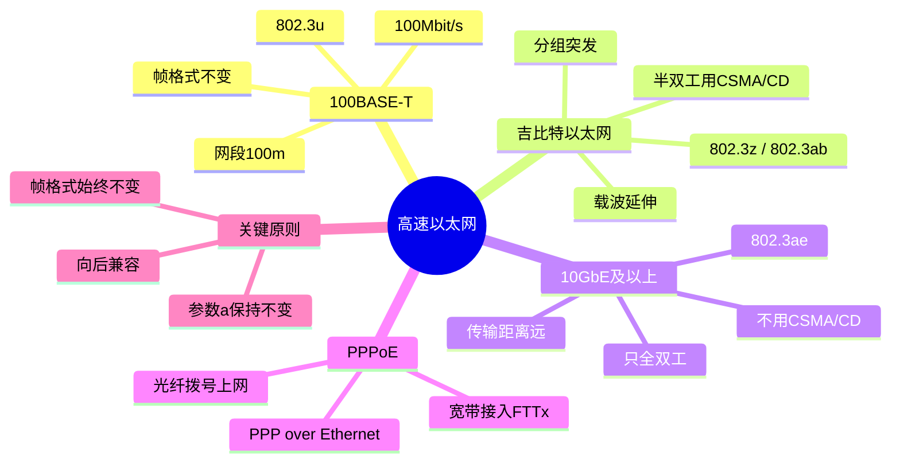

# 第3章-3.5-高速以太网

## 基本信息

- **课程**：计算机网络
- **章节**：第3章 3.5节 高速以太网
- **日期**：2026-06-14
- **标签**：#快速以太网 #吉比特以太网 #10GbE #载波延伸 #分组突发 #PPPoE

***

## 重点内容

### ⭐⭐⭐ 核心概念

1. **100BASE-T（快速以太网）**：IEEE 802.3u，100Mbit/s，CSMA/CD（半双工），帧格式不变
2. **参数 $a$ 保持不变**：数据率提高10倍 → 电缆长度减为1/10，最短帧长64字节不变
3. **吉比特以太网**：IEEE 802.3z，载波延伸+分组突发解决短帧开销问题
4. **10GbE及更高速率**：只工作在全双工，不使用CSMA/CD，帧格式不变
5. **PPPoE**：在以太网上运行PPP，用于光纤宽带接入

### ⭐⭐ 关键问题

- 为什么高速以太网要保持最短帧长64字节不变？
- 载波延伸和分组突发的作用是什么？
- 为什么10GbE不使用CSMA/CD？
- PPPoE的作用和使用场景是什么？

***

## 详细笔记

### 一、100BASE-T以太网（快速以太网）

**标准**：IEEE 802.3u（1995年）

**特点**：
- 双绞线上传送100Mbit/s基带信号，星形拓扑
- 仍使用CSMA/CD协议（半双工时），MAC帧格式不变
- 适配器自动识别10Mbit/s和100Mbit/s
- 与10BASE-T向后兼容，无需改变拓扑结构和软件

**参数 $a$ 保持不变**：

$$
a = \frac{\tau}{T_0}
$$

- 数据率提高到10倍 → 电缆长度减小到1/10
- 最短帧长仍为 **64字节**，争用期变为 **5.12μs**，帧间最小间隔 **0.96μs**

**物理层标准（表3-1）**：

| 名称 | 媒体 | 网段最大长度 | 特点 |
|------|------|-------------|------|
| 100BASE-TX | 铜缆 | 100m | 两对UTP5类线或STP |
| 100BASE-T4 | 铜缆 | 100m | 4对UTP3类线或5类线 |
| 100BASE-FX | 光缆 | 2000m | 两根光纤，收发各一根 |

> 100BASE-X = 100BASE-TX + 100BASE-FX

***

### 二、吉比特以太网

**标准**：IEEE 802.3z（1998年）

**特点**：
- 全双工和半双工两种方式
- 帧格式不变，与10BASE-T和100BASE-T向后兼容
- 半双工使用CSMA/CD，全双工不使用

**物理层标准（表3-2）**：

| 名称 | 媒体 | 网段最大长度 | 特点 |
|------|------|-------------|------|
| 1000BASE-SX | 光缆 | 550m | 多模光纤(50和62.5μm) |
| 1000BASE-LX | 光缆 | 5000m | 单/多模光纤 |
| 1000BASE-CX | 铜缆 | 25m | 2对屏蔽双绞线STP |
| 1000BASE-T | 铜缆 | 100m | 4对UTP 5类线 |

> 1000BASE-X（前三项）标准802.3z；1000BASE-T标准802.3ab

#### 📷 图3-29 吉比特以太网的配置举例

> 📚 **课本出处**：图3-29 吉比特以太网可用作主干网，连接图形工作站和服务器。

#### 关键技术

| 技术 | 作用 |
|------|------|
| **载波延伸** | 最短帧长仍为64字节，争用期增大为512字节。不足512字节时填充特殊字符 |
| **分组突发** | 多个短帧连续发送，只第一个用载波延伸，随后短帧只需帧间最小间隔 |

**载波延伸原理**：
- 吉比特以太网保持网段最大长度100m
- 若按传统方法，争用期太短，参数 $a$ 会太大
- 办法：发送的MAC帧长不足512字节时，用特殊字符填充到512字节
- 接收端收到后删除填充字符再交付高层

**分组突发原理**：
- 很多短帧要发送时，第一个短帧用载波延伸填充
- 随后的短帧可一个接一个发送，只需帧间最小间隔
- 形成一串分组突发，直到达到1500字节或稍多为止

> **全双工方式不使用载波延伸和分组突发**。

***

### 三、10吉比特以太网(10GbE)和更快的以太网

**10GbE特点**：
- 帧格式与10M/100M/1G以太网**完全相同**
- **只工作在全双工方式**，不使用CSMA/CD
- 传输距离大大提高（不受碰撞检测限制）

**物理层标准（表3-3）**：

| 名称 | 媒体 | 网段最大长度 | 特点 |
|------|------|-------------|------|
| 10GBASE-SR | 光缆 | 300m | 多模光纤(0.85μm) |
| 10GBASE-LR | 光缆 | 10km | 单模光纤(1.3μm) |
| 10GBASE-ER | 光缆 | 40km | 单模光纤(1.5μm) |
| 10GBASE-CX4 | 铜缆 | 15m | 4对双芯同轴电缆 |
| 10GBASE-T | 铜缆 | 100m | 4对6A类UTP双绞线 |

**更高速率**：

| 标准 | 速率 | 标准编号 | 特点 |
|------|------|----------|------|
| 40GbE/100GbE | 40/100 Gbit/s | 802.3ba-2010, 802.3bm-2015 | 只全双工 |
| 200GbE/400GbE | 200/400 Gbit/s | 802.3bs（2017年） | 全部用光纤 |

**以太网的优点**（从10M到400G的演进证明）：
1. **可扩展的**（速率从10Mbit/s到400Gbit/s）
2. **灵活的**（多种媒体、全/半双工、共享/交换）
3. **易于安装的**
4. **稳健性好的**

***

### 四、使用以太网进行宽带接入

**PPPoE（PPP over Ethernet）**：
- 1999年公布，RFC 2516
- 把PPP帧封装到以太网中传输
- 光纤宽带接入FTTx普遍使用

**FTTB方案**：
- 大楼楼口安装光网络单元ONU
- 用5类线接入用户家中
- 用户家中只需RJ-45插口，PPPoE拨号上网

> ⚠️ **注意**：ADSL也使用PPPoE拨号，但用户电脑到ADSL调制解调器后转换为电话线传输，**不是以太网上网**。

***

## 疑问与思考

### ❓ 待解决问题

#### 1. 为什么高速以太网要保持最短帧长64字节不变？

**📚 课本出处**：第3章 3.5.1节、3.5.2节

保持最短帧长64字节不变是为了**向后兼容**。如果改变最小帧长，现有的网络适配器、交换机、路由器等设备都需要更换，代价巨大。

但数据率提高后，若保持网段长度不变，参数 $a = \tau/T_0$ 会变大（因为 $T_0$ 变小），信道利用率会降低。

- **100BASE-T**：保持最短帧长64字节，网段最大长度从1000m减到100m（$\tau$ 减小为1/10），$a$ 保持不变。
- **吉比特以太网**：保持网段最大长度100m，采用**载波延伸**，使争用期等效增大到512字节，$a$ 保持较小值。

#### 2. 载波延伸和分组突发的作用是什么？

**📚 课本出处**：第3章 3.5.2节

**载波延伸**：
- 吉比特以太网半双工时，争用期太短（64字节的发送时间仅0.512μs），若保持最短帧长64字节，参数 $a$ 会太大
- 办法：将争用期等效增大到512字节，发送的帧不足512字节时用特殊字符填充
- 问题：短帧的开销极大（64字节帧填充448字节，有效载荷仅占12.5%）

**分组突发**：
- 解决载波延伸带来的短帧开销问题
- 多个短帧连续发送时，只有第一个短帧需要填充
- 后续短帧一个接一个发送，只需保留帧间最小间隔
- 形成一串分组突发，直到达到1500字节左右

#### 3. 为什么10GbE不使用CSMA/CD？

**📚 课本出处**：第3章 3.5.3节

10GbE**只工作在全双工方式**，通信双方可同时发送和接收，不存在共享信道的问题，因此没有碰撞，自然不需要CSMA/CD协议。

不使用CSMA/CD的好处是：
- 传输距离大大提高（不再受碰撞检测的限制）
- 网络设计更简单

### 💡 个人理解

- 以太网从10M发展到400G，始终**保持帧格式不变**，这是其成功的关键——向后兼容让用户可以平滑升级。
- 载波延伸和分组突发是吉比特以太网在半双工模式下的"过渡性"技术。实际应用中，吉比特以太网基本都工作在全双工方式，这两个技术很少用到。
- 10GbE及以上速率只支持全双工，标志着CSMA/CD协议在高端以太网中已成为历史。
- PPPoE把PPP的认证功能和以太网的高速传输结合起来，是宽带接入的主流方案。

***

## 核心考点总结

### ⭐⭐⭐ 必考内容

1. **100BASE-T特点**

| 项目 | 内容 |
|------|------|
| 标准 | IEEE 802.3u |
| 速率 | 100 Mbit/s |
| 拓扑 | 星形 |
| 协议 | CSMA/CD（半双工） |
| 帧格式 | 不变（与10M相同） |
| 最短帧长 | 64字节（不变） |
| 争用期 | 5.12 μs（10M的1/10） |

2. **吉比特以太网关键技术**

| 技术 | 适用场景 | 说明 |
|------|----------|------|
| **载波延伸** | 半双工、短帧 | 争用期等效增大到512字节，不足则填充 |
| **分组突发** | 半双工、多个短帧 | 只有第一个短帧填充，后续连续发送 |

3. **各代以太网对比**

| 特性 | 10M | 100M | 1G | 10G及以上 |
|------|-----|------|-----|----------|
| CSMA/CD | 半双工用 | 半双工用 | 半双工用 | **不用** |
| 工作方式 | 半双工 | 半/全双工 | 半/全双工 | **全双工** |
| 帧格式 | V2/802.3 | 不变 | 不变 | 不变 |
| 最短帧长 | 64B | 64B | 64B（载波延伸） | 64B |

4. **PPPoE**
- 全称：PPP over Ethernet
- 作用：在以太网上传输PPP帧
- 应用：FTTx光纤宽带接入
- 注意：ADSL用PPPoE拨号，但不是以太网上网

### 📌 易混淆点辨析

| 概念 | 说明 |
|------|------|
| **100BASE-X** | 100BASE-TX + 100BASE-FX |
| **1000BASE-X** | 1000BASE-SX + 1000BASE-LX + 1000BASE-CX（802.3z） |
| **1000BASE-T** | 单独标准802.3ab，4对UTP5类线 |
| **载波延伸** | 解决半双工吉比特以太网争用期太短的问题 |
| **分组突发** | 解决载波延伸带来的短帧开销问题 |
| **PPPoE** | 数据链路层协议，用于宽带接入认证 |

### 📝 常见考题类型

1. **简答题**：
   - 为什么高速以太网要保持最短帧长64字节不变？
   - 说明载波延伸和分组突发的作用
   - 为什么10GbE不使用CSMA/CD？
   - PPPoE的作用是什么？
2. **选择题/判断题**：
   - 100BASE-T的帧格式与10BASE-T不同（✗）
   - 吉比特以太网全双工方式使用CSMA/CD（✗）
   - 10GbE只工作在全双工方式（✓）
   - 载波延伸在全双工方式下也使用（✗）
   - PPPoE用于光纤宽带接入（✓）
3. **计算题**：
   - 给定数据率和电缆长度，计算争用期、最短帧长
   - 比较不同速率以太网的参数 $a$

***

## 总结

### 以太网标准对比

| 特性 | 10BASE-T | 100BASE-T | 1000BASE-X/T | 10GbE | 40G/100G |
|------|----------|-----------|--------------|-------|----------|
| **标准编号** | 802.3i | 802.3u | 802.3z / 802.3ab | 802.3ae | 802.3ba |
| **速率** | 10 Mbit/s | 100 Mbit/s | 1 Gbit/s | 10 Gbit/s | 40/100 Gbit/s |
| **CSMA/CD** | 半双工用 | 半双工用 | 半双工用 | 不用 | 不用 |
| **工作方式** | 半双工 | 半/全双工 | 半/全双工 | 全双工 | 全双工 |
| **最短帧长** | 64字节 | 64字节 | 64字节 | 64字节 | 64字节 |
| **帧格式** | Ethernet V2 | 不变 | 不变 | 不变 | 不变 |
| **典型媒体** | UTP 3/5类 | UTP 5类 / 光纤 | 光纤 / UTP 5类 | 光纤 / 6A类UTP | 光纤 |
| **典型距离** | 100m | 100m / 2km | 100m ~ 5km | 300m ~ 40km | 更远 |

### 共享以太网 vs 交换以太网

| 对比项 | 共享以太网 | 交换以太网 |
|--------|-----------|-----------|
| **拓扑** | 总线型 / 集线器 | 交换机星形 |
| **冲突域** | 所有站点共享一个冲突域 | 每个端口独立冲突域 |
| **CSMA/CD** | 需要（半双工） | 全双工，不需要 |
| **带宽** | 所有站点共享总带宽 | 每个端口独享带宽 |
| **安全广播** | 所有站点收到广播帧 | 交换机按MAC地址转发 |
| **典型场景** | 早期10M/100M局域网 | 现代局域网主流 |

### 自动协商与MDI/MDIX

| 概念 | 说明 |
|------|------|
| **自动协商** | 适配器自动识别对端速率（10M/100M/1G）和工作方式（半/全双工），协商最优参数 |
| **MDI** | Medium Dependent Interconnect，直通线，用于连接不同层设备（如PC到交换机） |
| **MDIX** | MDI Crossover，交叉线，用于连接同层设备（如交换机到交换机） |
| **Auto MDI/MDIX** | 现代适配器自动检测并切换MDI/MDIX模式，免去区分直通/交叉线的麻烦 |

### 核心概念

### 关键结论

- **帧格式不变**：从10M到400G，以太网始终保持相同帧格式，这是向后兼容的基石
- **CSMA/CD逐步退出**：10G及以上速率只支持全双工，CSMA/CD在高速以太网中不再需要
- **载波延伸与分组突发**：仅用于吉比特以太网半双工模式，实际部署中全双工为主流
- **PPPoE**：将PPP认证与以太网高速传输结合，是FTTx宽带接入的主流方案

***

## 相关链接

### 本节涉及图片

- [图3-29 吉比特以太网的配置举例](../../../images/3e5d37599a1044ec04b00d687cf0188fb52a7cf118e518d6fc52b5c23a178a12.jpg)

### 关联章节

- [第3章-3.3-使用广播信道的数据链路层](./第3章-3.3-使用广播信道的数据链路层.md) - CSMA/CD协议、争用期、参数 $a$
- [第3章-3.4-扩展的以太网](./第3章-3.4-扩展的以太网.md) - 以太网交换机、全双工
- [第3章-3.2-点对点协议PPP](./第3章-3.2-点对点协议PPP.md) - PPP协议基础

***

*笔记创建时间：2026-06-14*
